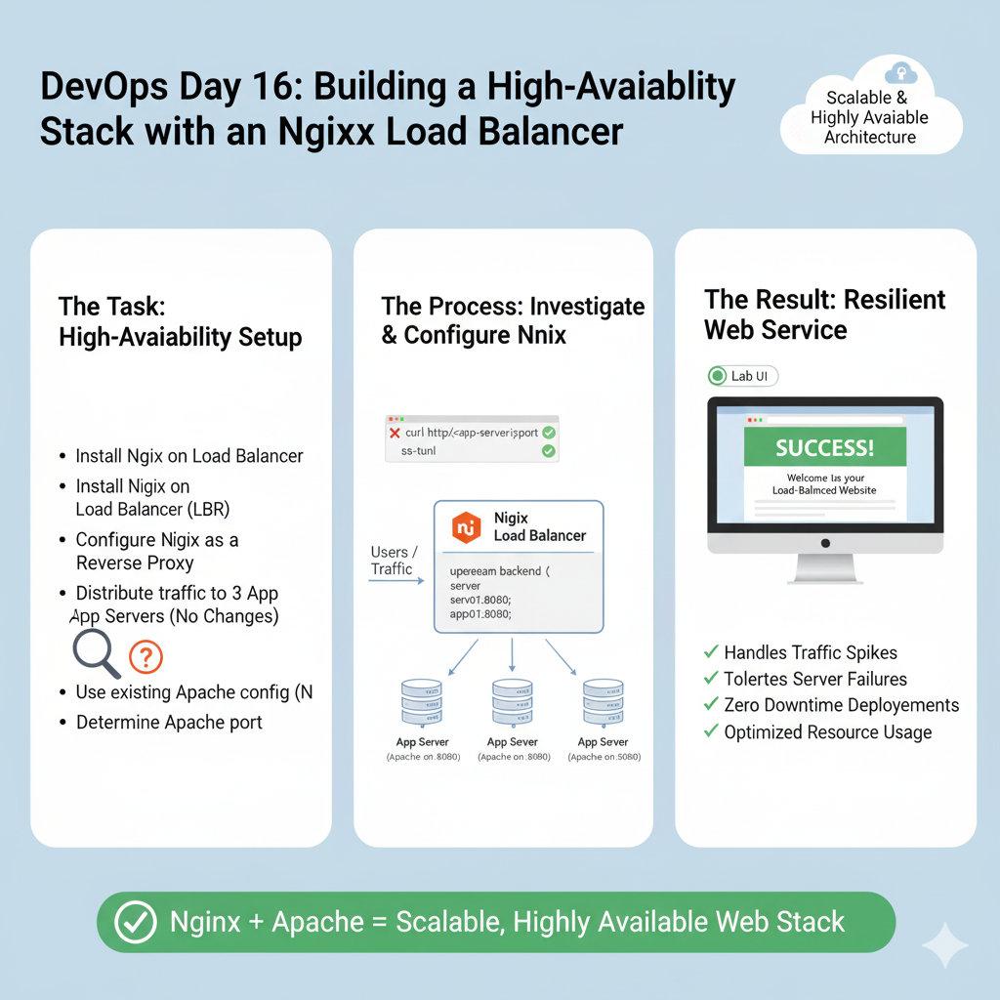
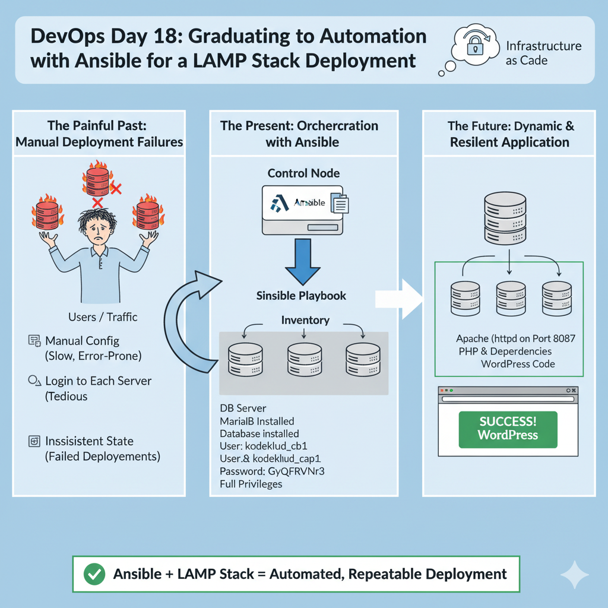
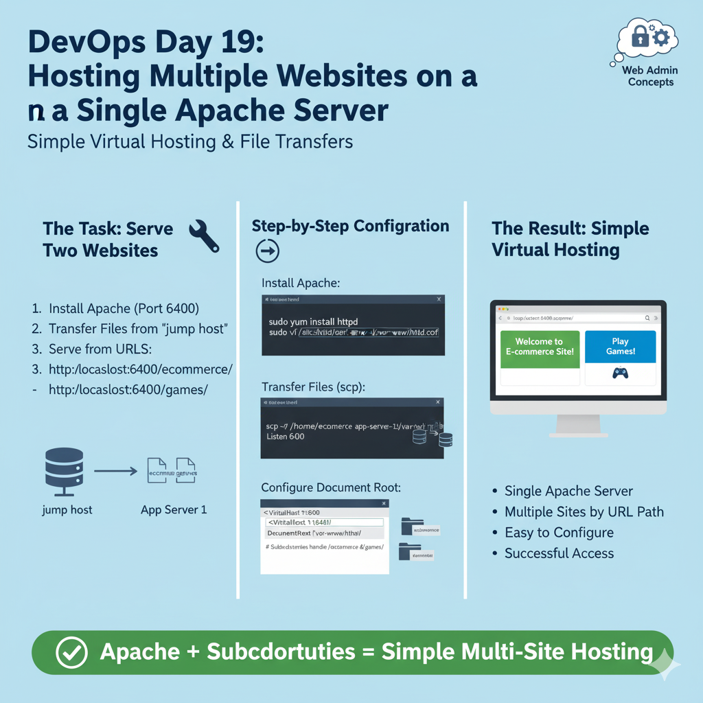
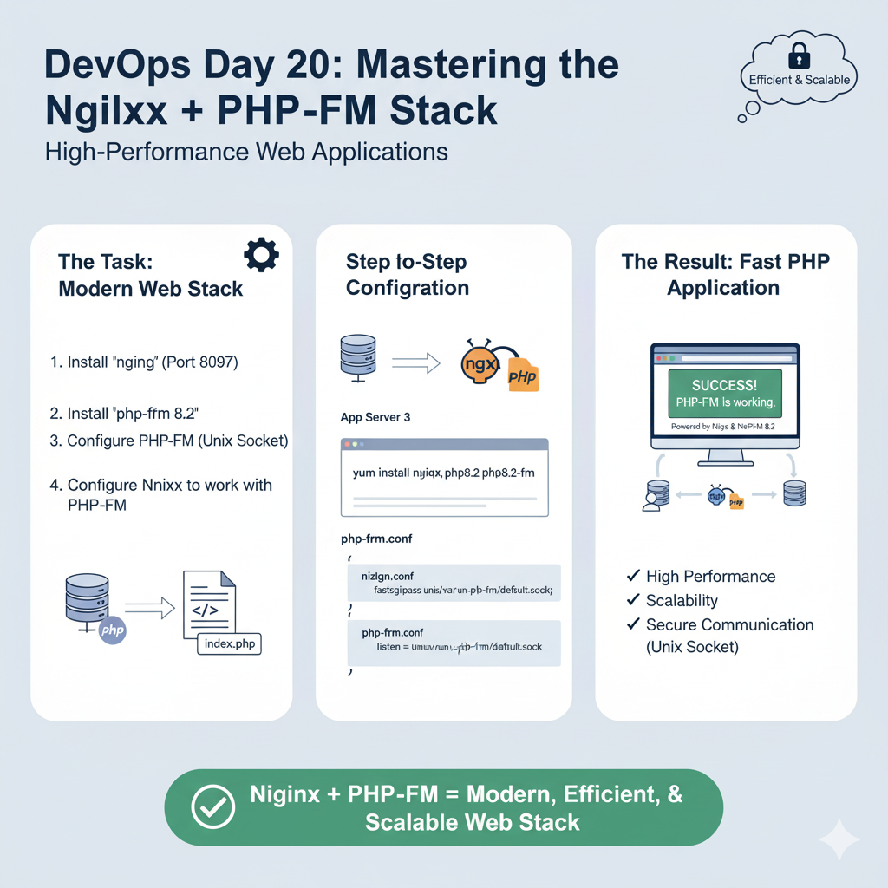
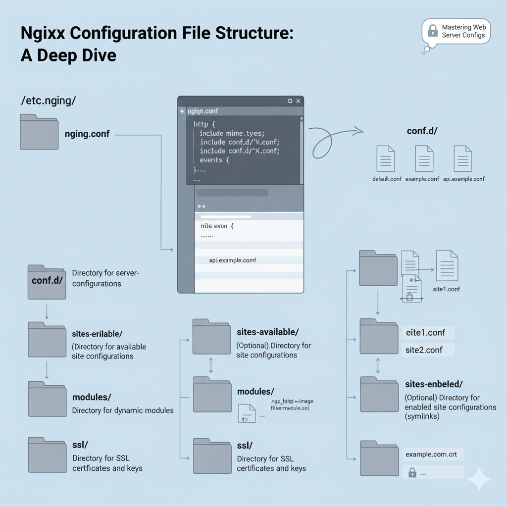

# DevOps Day 01 — Creating a Linux User with a Non‑Interactive Shell

<br>
<br>

- [DevOps Day 01 — Creating a Linux User with a Non‑Interactive Shell](#devops-day-01--creating-a-linux-user-with-a-noninteractive-shell)
  - [Real Scenario](#real-scenario)
- [Understanding the Requirement](#understanding-the-requirement)
- [How Linux Login Works Internally](#how-linux-login-works-internally)
- [Creating the User](#creating-the-user)
- [Verifying the User Creation](#verifying-the-user-creation)
- [Important System Files Involved](#important-system-files-involved)
- [Why DevOps Teams Use Non‑Interactive Users](#why-devops-teams-use-noninteractive-users)
- [Related Commands Worth Exploring](#related-commands-worth-exploring)
- [Alternative Method: /bin/false](#alternative-method-binfalse)
- [Practical Outcome](#practical-outcome)
- [DevOps Day 02 — Creating a Temporary Linux User with an Expiry Date](#devops-day-02--creating-a-temporary-linux-user-with-an-expiry-date)
  - [Real Scenario](#real-scenario-1)
- [Understanding the Requirement](#understanding-the-requirement-1)
- [Creating the Temporary User](#creating-the-temporary-user)
- [Verifying the Account Expiry](#verifying-the-account-expiry)
- [How Linux Implements Account Expiry Internally](#how-linux-implements-account-expiry-internally)
- [Difference Between Account Expiry and Password Expiry](#difference-between-account-expiry-and-password-expiry)
- [Why DevOps Teams Use Expiring Accounts](#why-devops-teams-use-expiring-accounts)
- [Additional Commands to Explore](#additional-commands-to-explore)
- [Practical Outcome](#practical-outcome-1)
- [DevOps Day 03 — Disabling Direct Root SSH Login](#devops-day-03--disabling-direct-root-ssh-login)
  - [Real Scenario](#real-scenario-2)
- [Understanding the Requirement](#understanding-the-requirement-2)
- [How SSH Login Works Internally](#how-ssh-login-works-internally)
- [Step 1 — Editing the SSH Configuration](#step-1--editing-the-ssh-configuration)
- [Step 2 — Restarting the SSH Service](#step-2--restarting-the-ssh-service)
- [Understanding the SSH Daemon](#understanding-the-ssh-daemon)
- [Why Disabling Root SSH Login Is Important](#why-disabling-root-ssh-login-is-important)
- [Understanding the PermitRootLogin Directive](#understanding-the-permitrootlogin-directive)
- [Additional Useful Commands](#additional-useful-commands)
- [Practical Outcome](#practical-outcome-2)
- [DevOps Day 04 — Setting Executable Permissions on a Script](#devops-day-04--setting-executable-permissions-on-a-script)
  - [Real Scenario](#real-scenario-3)
- [Understanding the Requirement](#understanding-the-requirement-3)
- [Step 1 — Checking Current Permissions](#step-1--checking-current-permissions)
- [Understanding Linux Permission Structure](#understanding-linux-permission-structure)
- [Step 2 — Granting Execute Permission](#step-2--granting-execute-permission)
- [Step 3 — Verifying the Change](#step-3--verifying-the-change)
- [Numeric (Octal) Permission Representation](#numeric-octal-permission-representation)
- [Why Linux Does Not Allow Scripts to Run by Default](#why-linux-does-not-allow-scripts-to-run-by-default)
- [Common Permission Scenarios in DevOps](#common-permission-scenarios-in-devops)
- [Additional Commands Worth Exploring](#additional-commands-worth-exploring)
- [Practical Outcome](#practical-outcome-3)
- [DevOps Day 05 — Installing SELinux Tools and Configuring SELinux](#devops-day-05--installing-selinux-tools-and-configuring-selinux)
  - [Real Scenario](#real-scenario-4)
- [Understanding the Requirement](#understanding-the-requirement-4)
- [What SELinux Actually Is](#what-selinux-actually-is)
- [Step 1 — Installing SELinux Packages](#step-1--installing-selinux-packages)
- [Step 2 — Modifying the SELinux Configuration](#step-2--modifying-the-selinux-configuration)
- [Why Changes Apply Only After Reboot](#why-changes-apply-only-after-reboot)
- [Troubleshooting Problems During Setup](#troubleshooting-problems-during-setup)
- [Understanding Here Documents](#understanding-here-documents)
- [Checking SELinux Status](#checking-selinux-status)
- [Useful Commands for SELinux Management](#useful-commands-for-selinux-management)
- [Why SELinux Is Important in DevOps Environments](#why-selinux-is-important-in-devops-environments)
- [Practical Outcome](#practical-outcome-4)
- [DevOps Day 06 — Automating Tasks with Cron Jobs](#devops-day-06--automating-tasks-with-cron-jobs)
  - [Real Scenario](#real-scenario-5)
- [Understanding the Requirement](#understanding-the-requirement-5)
- [What Cron Is](#what-cron-is)
- [Step 1 — Installing the Cron Service](#step-1--installing-the-cron-service)
- [Step 2 — Starting the Cron Daemon](#step-2--starting-the-cron-daemon)
- [Step 3 — Enabling Cron at Boot](#step-3--enabling-cron-at-boot)
- [Step 4 — Creating the Scheduled Task](#step-4--creating-the-scheduled-task)
- [The Cron Job Entry](#the-cron-job-entry)
- [Understanding the Cron Time Format](#understanding-the-cron-time-format)
- [Step 5 — Verifying the Cron Job](#step-5--verifying-the-cron-job)
- [Checking the Output of the Job](#checking-the-output-of-the-job)
- [How Cron Works Internally](#how-cron-works-internally)
- [Where Cron Jobs Are Stored](#where-cron-jobs-are-stored)
- [Common Problems with Cron Jobs](#common-problems-with-cron-jobs)
- [Useful Commands for Cron Administration](#useful-commands-for-cron-administration)
- [Practical Outcome](#practical-outcome-5)
- [DevOps Day 07 — Password‑less SSH Authentication (Detailed Explanation)](#devops-day-07--passwordless-ssh-authentication-detailed-explanation)
  - [Real Scenario](#real-scenario-6)
- [Understanding the Infrastructure](#understanding-the-infrastructure)
- [Step 1 — Generating an SSH Key Pair](#step-1--generating-an-ssh-key-pair)
- [Why No Passphrase Was Used](#why-no-passphrase-was-used)
- [Step 2 — Copying the Public Key to Remote Servers](#step-2--copying-the-public-key-to-remote-servers)
- [What ssh-copy-id Does Internally](#what-ssh-copy-id-does-internally)
- [Step 3 — Verifying Password‑less Login](#step-3--verifying-passwordless-login)
- [How Public Key Authentication Works Internally](#how-public-key-authentication-works-internally)
- [Why Password‑less SSH Is Secure](#why-passwordless-ssh-is-secure)
- [Important SSH Files Involved](#important-ssh-files-involved)
- [Common Problems During Setup](#common-problems-during-setup)
- [Useful SSH Commands](#useful-ssh-commands)
- [Practical Outcome](#practical-outcome-6)
- [DevOps Day 08 — Installing and Preparing an Ansible Controller](#devops-day-08--installing-and-preparing-an-ansible-controller)
  - [Real Scenario](#real-scenario-7)
- [Understanding the Ansible Architecture](#understanding-the-ansible-architecture)
  - [Controller Node](#controller-node)
  - [Managed Nodes](#managed-nodes)
- [Step 1 — Installing Ansible](#step-1--installing-ansible)
  - [sudo](#sudo)
  - [pip3](#pip3)
  - [Version Pinning](#version-pinning)
- [Step 2 — Verifying the Installation](#step-2--verifying-the-installation)
    - [Check Ansible Version](#check-ansible-version)
    - [Locate the Executable](#locate-the-executable)
    - [Verify the Python Package](#verify-the-python-package)
- [Understanding the Ansible vs Ansible-Core Difference](#understanding-the-ansible-vs-ansible-core-difference)
  - [ansible (Community Package)](#ansible-community-package)
  - [ansible-core (Execution Engine)](#ansible-core-execution-engine)
- [Why DevOps Engineers Use Ansible](#why-devops-engineers-use-ansible)
  - [Agentless Architecture](#agentless-architecture)
  - [Simple Configuration Language](#simple-configuration-language)
  - [Idempotent Operations](#idempotent-operations)
- [Common Problems During Installation](#common-problems-during-installation)
  - [Forgetting sudo](#forgetting-sudo)
  - [Version Confusion](#version-confusion)
  - [PATH Issues](#path-issues)
- [Useful Ansible Commands](#useful-ansible-commands)
- [Practical Outcome](#practical-outcome-7)
  - [Table of Contents](#table-of-contents)
    - [The Task](#the-task)
    - [My Troubleshooting Journey: A Step-by-Step Solution](#my-troubleshooting-journey-a-step-by-step-solution)
      - [Step 1: Initial Investigation](#step-1-initial-investigation)
      - [Step 2: Digging into the Logs](#step-2-digging-into-the-logs)
      - [Step 3: Testing Hypotheses](#step-3-testing-hypotheses)
      - [Step 4: Discovering the True Root Cause](#step-4-discovering-the-true-root-cause)
      - [Step 5: The Final Solution](#step-5-the-final-solution)
    - [Why Did I Do This? (The "What \& Why")](#why-did-i-do-this-the-what--why)
    - [Deep Dive: The Hierarchy of Troubleshooting](#deep-dive-the-hierarchy-of-troubleshooting)
    - [Common Pitfalls](#common-pitfalls)
    - [Exploring the Commands Used](#exploring-the-commands-used)
  - [Table of Contents](#table-of-contents-1)
    - [The Task](#the-task-1)
    - [My Step-by-Step Solution](#my-step-by-step-solution)
      - [Part 1: The Critical Prerequisite Setup](#part-1-the-critical-prerequisite-setup)
      - [Part 2: Writing the Backup Script](#part-2-writing-the-backup-script)
    - [Why Did I Do This? (The "What \& Why")](#why-did-i-do-this-the-what--why-1)
    - [Deep Dive: Why Password-less SSH is Non-Negotiable for Automation](#deep-dive-why-password-less-ssh-is-non-negotiable-for-automation)
    - [Common Pitfalls](#common-pitfalls-1)
    - [Exploring the Commands Used](#exploring-the-commands-used-1)
- [DevOps Day 11: Deploying a Java Application on Tomcat](#devops-day-11-deploying-a-java-application-on-tomcat)
  - [Table of Contents](#table-of-contents-2)
    - [The Task](#the-task-2)
    - [My Step-by-Step Solution](#my-step-by-step-solution-1)
      - [Phase 1: Installing and Configuring Tomcat on App Server 3](#phase-1-installing-and-configuring-tomcat-on-app-server-3)
      - [Phase 2: Preparing for Secure File Transfer](#phase-2-preparing-for-secure-file-transfer)
      - [Phase 3: Deploying the Web Application](#phase-3-deploying-the-web-application)
    - [Why Did I Do This? (The "What \& Why")](#why-did-i-do-this-the-what--why-2)
    - [Deep Dive: The Magic of `ROOT.war`](#deep-dive-the-magic-of-rootwar)
    - [Common Pitfalls](#common-pitfalls-2)
    - [Exploring the Commands Used](#exploring-the-commands-used-2)
- [DevOps Day 12: The Port Conflict Detective Story](#devops-day-12-the-port-conflict-detective-story)
  - [Table of Contents](#table-of-contents-3)
    - [The Task](#the-task-3)
    - [My Troubleshooting Journey: A Step-by-Step Solution](#my-troubleshooting-journey-a-step-by-step-solution-1)
      - [Step 1: Confirming the Failure](#step-1-confirming-the-failure)
      - [Step 2: The First Clue - A Failed Service](#step-2-the-first-clue---a-failed-service)
      - [Step 3: The Second Clue - The Root Cause](#step-3-the-second-clue---the-root-cause)
      - [Step 4: The Third Clue - Identifying the Culprit](#step-4-the-third-clue---identifying-the-culprit)
      - [Step 5: The First Fix - Resolving the Port Conflict](#step-5-the-first-fix---resolving-the-port-conflict)
      - [Step 6: The Final Hurdle - The Firewall](#step-6-the-final-hurdle---the-firewall)
      - [Step 7: The Final Fix - Configuring `iptables`](#step-7-the-final-fix---configuring-iptables)
      - [Step 8: Final Verification](#step-8-final-verification)
    - [Why Did I Do This? (The "What \& Why")](#why-did-i-do-this-the-what--why-3)
    - [Deep Dive: The Sysadmin's Method - A Layered Approach](#deep-dive-the-sysadmins-method---a-layered-approach)
    - [Common Pitfalls](#common-pitfalls-3)
    - [Exploring the Commands Used](#exploring-the-commands-used-3)
- [DevOps Day 13: Securing Servers with an `iptables` Firewall](#devops-day-13-securing-servers-with-an-iptables-firewall)
  - [Table of Contents](#table-of-contents-4)
    - [The Task](#the-task-4)
    - [My Step-by-Step Solution](#my-step-by-step-solution-2)
      - [Prerequisite: Finding the LBR IP](#prerequisite-finding-the-lbr-ip)
      - [Main Workflow (for each server)](#main-workflow-for-each-server)
    - [Why Did I Do This? (The "What \& Why")](#why-did-i-do-this-the-what--why-4)
    - [Deep Dive: The Importance of `iptables` Rule Order](#deep-dive-the-importance-of-iptables-rule-order)
    - [Common Pitfalls](#common-pitfalls-4)
    - [Exploring the Commands Used](#exploring-the-commands-used-4)
- [DevOps Day 14: The Multi-Server Troubleshooting and Standardization Challenge](#devops-day-14-the-multi-server-troubleshooting-and-standardization-challenge)
  - [Table of Contents](#table-of-contents-5)
    - [The Task](#the-task-5)
    - [My Step-by-Step Solution](#my-step-by-step-solution-3)
      - [Step 1: The Investigation - Finding the Faulty Server](#step-1-the-investigation---finding-the-faulty-server)
      - [Step 2: The Diagnosis - Identifying the Culprit](#step-2-the-diagnosis---identifying-the-culprit)
      - [Step 3: The First Fix - Resolving the Conflict](#step-3-the-first-fix---resolving-the-conflict)
      - [Step 4: The Main Fix - Standardization Across All Servers](#step-4-the-main-fix---standardization-across-all-servers)
      - [Step 5: Final Verification](#step-5-final-verification)
    - [Why Did I Do This? (The "What \& Why")](#why-did-i-do-this-the-what--why-5)
    - [Deep Dive: The Importance of Standardization](#deep-dive-the-importance-of-standardization)
    - [Common Pitfalls](#common-pitfalls-5)
    - [Exploring the Commands Used](#exploring-the-commands-used-5)
- [DevOps Day 15: Deploying a Secure Nginx Web Server with SSL](#devops-day-15-deploying-a-secure-nginx-web-server-with-ssl)
  - [Table of Contents](#table-of-contents-6)
    - [The Task](#the-task-6)
    - [My Step-by-Step Solution](#my-step-by-step-solution-4)
      - [Step 1: Install Nginx and Prepare Certificates](#step-1-install-nginx-and-prepare-certificates)
      - [Step 2: Configure Nginx for SSL/HTTPS](#step-2-configure-nginx-for-sslhttps)
      - [Step 3: Deploy Content and Start the Service](#step-3-deploy-content-and-start-the-service)
      - [Step 4: Final Verification](#step-4-final-verification)
    - [Why Did I Do This? (The "What \& Why")](#why-did-i-do-this-the-what--why-6)
    - [Deep Dive: Anatomy of an Nginx SSL Server Block](#deep-dive-anatomy-of-an-nginx-ssl-server-block)
    - [Common Pitfalls](#common-pitfalls-6)
    - [Exploring the Commands Used](#exploring-the-commands-used-6)
- [DevOps Day 16: Building a High-Availability Stack with an Nginx Load Balancer](#devops-day-16-building-a-high-availability-stack-with-an-nginx-load-balancer)
  - [Table of Contents](#table-of-contents-7)
    - [The Task](#the-task-7)
    - [My Step-by-Step Solution](#my-step-by-step-solution-5)
      - [Step 1: The Investigation Phase](#step-1-the-investigation-phase)
      - [Step 2: LBR Server Configuration](#step-2-lbr-server-configuration)
    - [Step 3: Verification](#step-3-verification)
    - [Why Did I Do This? (The "What \& Why")](#why-did-i-do-this-the-what--why-7)
    - [Deep Dive: The "Investigate First" Principle](#deep-dive-the-investigate-first-principle)
    - [Common Pitfalls](#common-pitfalls-7)
    - [Exploring the Commands Used](#exploring-the-commands-used-7)
- [DevOps Day 17: PostgreSQL Database and User Management](#devops-day-17-postgresql-database-and-user-management)
  - [Table of Contents](#table-of-contents-8)
    - [The Task](#the-task-8)
    - [My Step-by-Step Solution](#my-step-by-step-solution-6)
      - [Step 1: Gaining Administrative Access](#step-1-gaining-administrative-access)
      - [Step 2: Executing the SQL Commands](#step-2-executing-the-sql-commands)
    - [Step 3: Verification](#step-3-verification-1)
    - [Why Did I Do This? (The "What \& Why")](#why-did-i-do-this-the-what--why-8)
    - [Deep Dive: The Principle of Least Privilege in Databases](#deep-dive-the-principle-of-least-privilege-in-databases)
      - [How I Applied the Principle:](#how-i-applied-the-principle)
    - [Common Pitfalls](#common-pitfalls-8)
    - [Exploring the Commands Used](#exploring-the-commands-used-8)
- [DevOps Day 18: Graduating to Automation with Ansible for a LAMP Stack Deployment](#devops-day-18-graduating-to-automation-with-ansible-for-a-lamp-stack-deployment)
  - [Table of Contents](#table-of-contents-9)
    - [The Task](#the-task-9)
    - [My Solution: The Ansible Automation Approach](#my-solution-the-ansible-automation-approach)
      - [1. The Inventory (`inventory.ini`)](#1-the-inventory-inventoryini)
      - [2. The Playbook (`playbook.yaml`)](#2-the-playbook-playbookyaml)
      - [3. The Execution](#3-the-execution)
    - [Post-Mortem: Why My Manual Attempts Failed](#post-mortem-why-my-manual-attempts-failed)
    - [Why Did I Do This? (The "What \& Why" of Ansible)](#why-did-i-do-this-the-what--why-of-ansible)
    - [Deep Dive: A Line-by-Line Explanation of My Ansible Playbook](#deep-dive-a-line-by-line-explanation-of-my-ansible-playbook)
    - [Exploring the Commands Used](#exploring-the-commands-used-9)
- [DevOps Day 19: Hosting Multiple Websites on a Single Apache Server](#devops-day-19-hosting-multiple-websites-on-a-single-apache-server)
  - [Table of Contents](#table-of-contents-10)
    - [The Task](#the-task-10)
    - [My Step-by-Step Solution](#my-step-by-step-solution-7)
      - [Phase 1: Preparing the Web Server (on App Server 1)](#phase-1-preparing-the-web-server-on-app-server-1)
      - [Phase 2: Transferring the Website Files (from Jump Host)](#phase-2-transferring-the-website-files-from-jump-host)
      - [Phase 3: Deploying the Websites (on App Server 1)](#phase-3-deploying-the-websites-on-app-server-1)
      - [Phase 4: Verification](#phase-4-verification)
    - [Why Did I Do This? (The "What \& Why")](#why-did-i-do-this-the-what--why-9)
    - [Deep Dive: How Apache Maps URLs to Directories](#deep-dive-how-apache-maps-urls-to-directories)
    - [Common Pitfalls](#common-pitfalls-9)
    - [Exploring the Commands Used](#exploring-the-commands-used-10)
- [DevOps Day 20: Mastering the Nginx + PHP-FPM Stack](#devops-day-20-mastering-the-nginx--php-fpm-stack)
  - [Table of Contents](#table-of-contents-11)
    - [The Task](#the-task-11)
    - [My Step-by-Step Solution (The One That Worked)](#my-step-by-step-solution-the-one-that-worked)
      - [Phase 1: Installing the Correct PHP Version](#phase-1-installing-the-correct-php-version)
      - [Phase 2: Configuring PHP-FPM](#phase-2-configuring-php-fpm)
      - [Phase 3: Configuring Nginx](#phase-3-configuring-nginx)
      - [Phase 4: Final Verification](#phase-4-final-verification)
    - [Post-Mortem: The Platform Validation Issue](#post-mortem-the-platform-validation-issue)
    - [Why Did I Do This? (The "What \& Why")](#why-did-i-do-this-the-what--why-10)
    - [Deep Dive: Nginx Server Blocks vs. the Main Config File](#deep-dive-nginx-server-blocks-vs-the-main-config-file)
    - [The Full Arsenal: Every Command I Used, Explained](#the-full-arsenal-every-command-i-used-explained)
- [DevOps Day 21: Creating a Central Git Repository](#devops-day-21-creating-a-central-git-repository)
  - [Table of Contents](#table-of-contents-12)
    - [The Task](#the-task-12)
    - [My Step-by-Step Solution](#my-step-by-step-solution-8)
      - [Step 1: Connect and Install Git](#step-1-connect-and-install-git)
      - [Step 2: Create the Bare Repository](#step-2-create-the-bare-repository)
      - [Step 3: Verification](#step-3-verification-2)
    - [Why Did I Do This? (The "What \& Why")](#why-did-i-do-this-the-what--why-11)
    - [Deep Dive: Bare vs. Non-Bare (Working) Repositories](#deep-dive-bare-vs-non-bare-working-repositories)
    - [Common Pitfalls](#common-pitfalls-10)
    - [Exploring the Commands Used](#exploring-the-commands-used-11)
- [DevOps Day 22: Mastering the `git clone` Command](#devops-day-22-mastering-the-git-clone-command)
  - [Table of Contents](#table-of-contents-13)
    - [The Task](#the-task-13)
    - [My Step-by-Step Solution (The One That Worked)](#my-step-by-step-solution-the-one-that-worked-1)
      - [Step 1: Connect to the Server](#step-1-connect-to-the-server)
      - [Step 2: Navigate to the Parent Directory](#step-2-navigate-to-the-parent-directory)
      - [Step 3: Clone the Repository](#step-3-clone-the-repository)
      - [Step 4: Verification](#step-4-verification)
    - [Post-Mortem: Why My Previous Attempts Failed](#post-mortem-why-my-previous-attempts-failed)
    - [Why Did I Do This? (The "What \& Why")](#why-did-i-do-this-the-what--why-12)
    - [Deep Dive: How `git clone` Determines the Destination Path](#deep-dive-how-git-clone-determines-the-destination-path)
    - [Common Pitfalls](#common-pitfalls-11)
    - [Exploring the Commands Used](#exploring-the-commands-used-12)
- [DevOps Day 23: Collaborative Git Workflows with Forks](#devops-day-23-collaborative-git-workflows-with-forks)
  - [Table of Contents](#table-of-contents-14)
    - [The Task](#the-task-14)
    - [My Step-by-Step Solution](#my-step-by-step-solution-9)
    - [Why Did I Do This? (The "What \& Why")](#why-did-i-do-this-the-what--why-13)
    - [The Fork and Pull Request Workflow](#the-fork-and-pull-request-workflow)
    - [Exploring the UI Used](#exploring-the-ui-used)
- [DevOps Day 24: Managing Development with Git Branches](#devops-day-24-managing-development-with-git-branches)
  - [Table of Contents](#table-of-contents-15)
    - [The Task](#the-task-15)
    - [My Step-by-Step Solution](#my-step-by-step-solution-10)
    - [Why Did I Do This? (The "What \& Why")](#why-did-i-do-this-the-what--why-14)
    - [Deep Dive: `git branch` vs. `git checkout -b`](#deep-dive-git-branch-vs-git-checkout--b)
    - [Exploring the Commands Used](#exploring-the-commands-used-13)
- [DevOps Day 25: The Complete Git Feature Branch Workflow](#devops-day-25-the-complete-git-feature-branch-workflow)
  - [Table of Contents](#table-of-contents-16)
    - [The Task](#the-task-16)
    - [My Step-by-Step Solution](#my-step-by-step-solution-11)
      - [Phase 1: Branching and Development](#phase-1-branching-and-development)
      - [Phase 2: Merging and Pushing](#phase-2-merging-and-pushing)
    - [Why Did I Do This? (The "What \& Why")](#why-did-i-do-this-the-what--why-15)
    - [Deep Dive: The Lifecycle of a Feature Branch](#deep-dive-the-lifecycle-of-a-feature-branch)
    - [Common Pitfalls](#common-pitfalls-12)
    - [Exploring the Commands Used](#exploring-the-commands-used-14)
- [DevOps Day 26: Managing Multiple Git Remotes](#devops-day-26-managing-multiple-git-remotes)
  - [Table of Contents](#table-of-contents-17)
    - [The Task](#the-task-17)
    - [My Step-by-Step Solution](#my-step-by-step-solution-12)
      - [Phase 1: Managing the Remote](#phase-1-managing-the-remote)
      - [Phase 2: Committing and Pushing the New File](#phase-2-committing-and-pushing-the-new-file)
    - [Why Did I Do This? (The "What \& Why")](#why-did-i-do-this-the-what--why-16)
    - [Deep Dive: How Git Remotes Work](#deep-dive-how-git-remotes-work)
    - [Common Pitfalls](#common-pitfalls-13)
    - [Exploring the Commands I Used](#exploring-the-commands-i-used)
- [DevOps Day 27: Safely Undoing Changes with `git revert`](#devops-day-27-safely-undoing-changes-with-git-revert)
  - [Table of Contents](#table-of-contents-18)
    - [The Task](#the-task-18)
    - [My Step-by-Step Solution](#my-step-by-step-solution-13)
      - [Phase 1: Investigation](#phase-1-investigation)
      - [Phase 2: The Revert and Commit](#phase-2-the-revert-and-commit)
      - [Phase 3: Verification](#phase-3-verification)
    - [Why Did I Do This? (The "What \& Why")](#why-did-i-do-this-the-what--why-17)
    - [Deep Dive: The Critical Difference - `git revert` vs. `git reset`](#deep-dive-the-critical-difference---git-revert-vs-git-reset)
    - [Common Pitfalls](#common-pitfalls-14)
    - [Exploring the Commands Used](#exploring-the-commands-used-15)
- [DevOps Day 28: Targeted Code Integration with `git cherry-pick`](#devops-day-28-targeted-code-integration-with-git-cherry-pick)
  - [Table of Contents](#table-of-contents-19)
    - [The Task](#the-task-19)
    - [My Step-by-Step Solution](#my-step-by-step-solution-14)
      - [Phase 1: Investigation and Preparation](#phase-1-investigation-and-preparation)
      - [Phase 2: The Cherry-Pick and Push](#phase-2-the-cherry-pick-and-push)
      - [Phase 3: Verification](#phase-3-verification-1)
    - [Why Did I Do This? (The "What \& Why")](#why-did-i-do-this-the-what--why-18)
    - [Deep Dive: The Power of `git cherry-pick` vs. `git merge`](#deep-dive-the-power-of-git-cherry-pick-vs-git-merge)
    - [Common Pitfalls](#common-pitfalls-15)
    - [Exploring the Commands I Used](#exploring-the-commands-i-used-1)
- [DevOps Day 29: Mastering the Pull Request Workflow](#devops-day-29-mastering-the-pull-request-workflow)
  - [Table of Contents](#table-of-contents-20)
    - [The Task](#the-task-20)
    - [My Step-by-Step Solution (The One That Worked)](#my-step-by-step-solution-the-one-that-worked-2)
      - [Phase 1: Max Creates the Pull Request](#phase-1-max-creates-the-pull-request)
      - [Phase 2: Tom Reviews, Approves, and Merges](#phase-2-tom-reviews-approves-and-merges)
    - [Post-Mortem: Why My Previous Attempts Failed](#post-mortem-why-my-previous-attempts-failed-1)
    - [Why Did I Do This? (The "What \& Why")](#why-did-i-do-this-the-what--why-19)
    - [Deep Dive: The Anatomy of a Professional Code Review](#deep-dive-the-anatomy-of-a-professional-code-review)
    - [Common Pitfalls](#common-pitfalls-16)
    - [Exploring the UI Used](#exploring-the-ui-used-1)
- [DevOps Day 30: Rewriting History with `git reset --hard`](#devops-day-30-rewriting-history-with-git-reset---hard)
  - [Table of Contents](#table-of-contents-21)
    - [The Task](#the-task-21)
    - [My Step-by-Step Solution](#my-step-by-step-solution-15)
      - [Phase 1: Investigation](#phase-1-investigation-1)
      - [Phase 2: The Reset and Force Push](#phase-2-the-reset-and-force-push)
      - [Phase 3: Verification](#phase-3-verification-2)
    - [Why Did I Do This? (The "What \& Why")](#why-did-i-do-this-the-what--why-20)
    - [Deep Dive: What Exactly is `HEAD` in Git?](#deep-dive-what-exactly-is-head-in-git)
    - [The Dangers: `reset` vs. `revert` and the Force Push](#the-dangers-reset-vs-revert-and-the-force-push)
    - [Common Pitfalls](#common-pitfalls-17)
    - [Exploring the Commands I Used](#exploring-the-commands-i-used-2)
- [DevOps Day 31: Managing Work-in-Progress with `git stash`](#devops-day-31-managing-work-in-progress-with-git-stash)
  - [Table of Contents](#table-of-contents-22)
    - [The Task](#the-task-22)
    - [My Step-by-Step Solution](#my-step-by-step-solution-16)
      - [Phase 1: Investigation](#phase-1-investigation-2)
      - [Phase 2: Restoring and Committing](#phase-2-restoring-and-committing)
      - [Phase 3: Verification](#phase-3-verification-3)
    - [Why Did I Do This? (The "What \& Why")](#why-did-i-do-this-the-what--why-21)
    - [Deep Dive: The Stash Stack and `apply` vs. `pop`](#deep-dive-the-stash-stack-and-apply-vs-pop)
    - [Common Pitfalls](#common-pitfalls-18)
    - [Exploring the Commands I Used](#exploring-the-commands-i-used-3)
- [DevOps Day 32: Keeping History Clean with `git rebase`](#devops-day-32-keeping-history-clean-with-git-rebase)
  - [Table of Contents](#table-of-contents-23)
    - [The Task](#the-task-23)
    - [My Step-by-Step Solution](#my-step-by-step-solution-17)
      - [Phase 1: Preparation](#phase-1-preparation)
      - [Phase 2: The Rebase and Force Push](#phase-2-the-rebase-and-force-push)
      - [Phase 3: Verification](#phase-3-verification-4)
    - [Why Did I Do This? (The "What \& Why")](#why-did-i-do-this-the-what--why-22)
    - [Deep Dive: The Great Debate - `rebase` vs. `merge`](#deep-dive-the-great-debate---rebase-vs-merge)
    - [Common Pitfalls and the Dangers of Rewriting History](#common-pitfalls-and-the-dangers-of-rewriting-history)
    - [Exploring the Commands I Used](#exploring-the-commands-i-used-4)
- [DevOps Day 33: Resolving a Real-World Merge Conflict](#devops-day-33-resolving-a-real-world-merge-conflict)
  - [Table of Contents](#table-of-contents-24)
    - [The Task](#the-task-24)
    - [My Step-by-Step Solution](#my-step-by-step-solution-18)
      - [Phase 1: Diagnosing the Problem](#phase-1-diagnosing-the-problem)
      - [Phase 2: The Conflict](#phase-2-the-conflict)
      - [Phase 3: The Resolution](#phase-3-the-resolution)
      - [Phase 4: The Final Push](#phase-4-the-final-push)
    - [Why Did I Do This? (The "What \& Why")](#why-did-i-do-this-the-what--why-23)
    - [Deep Dive: The Anatomy of a Merge Conflict](#deep-dive-the-anatomy-of-a-merge-conflict)
    - [Common Pitfalls](#common-pitfalls-19)
    - [Exploring the Commands I Used](#exploring-the-commands-i-used-5)
- [DevOps Day 34: Automating Releases with Server-Side Git Hooks](#devops-day-34-automating-releases-with-server-side-git-hooks)
  - [Table of Contents](#table-of-contents-25)
    - [The Task](#the-task-25)
    - [My Step-by-Step Solution](#my-step-by-step-solution-19)
      - [Phase 1: Creating the Server-Side Git Hook](#phase-1-creating-the-server-side-git-hook)
      - [Phase 2: Triggering the Hook](#phase-2-triggering-the-hook)
      - [Phase 3: Verification](#phase-3-verification-5)
    - [Why Did I Do This? (The "What \& Why")](#why-did-i-do-this-the-what--why-24)
    - [Deep Dive: Anatomy of My `post-update` Hook Script](#deep-dive-anatomy-of-my-post-update-hook-script)
    - [Common Pitfalls](#common-pitfalls-20)
    - [Exploring the Commands I Used](#exploring-the-commands-i-used-6)
- [DevOps Day 35: Setting Up a Docker Environment](#devops-day-35-setting-up-a-docker-environment)
    - [The Task](#the-task-26)
    - [My Step-by-Step Solution](#my-step-by-step-solution-20)
    - [Key Concepts (The "What \& Why")](#key-concepts-the-what--why)
    - [Commands I Used](#commands-i-used)
- [DevOps Day 36: Deploying a Simple Nginx Container](#devops-day-36-deploying-a-simple-nginx-container)
    - [The Task](#the-task-27)
    - [My Step-by-Step Solution](#my-step-by-step-solution-21)
    - [Key Concepts (The "What \& Why")](#key-concepts-the-what--why-1)
    - [Commands I Used](#commands-i-used-1)
- [DevOps Day 37: Transferring Files into a Running Docker Container](#devops-day-37-transferring-files-into-a-running-docker-container)
    - [The Task](#the-task-28)
    - [My Step-by-Step Solution](#my-step-by-step-solution-22)
    - [Key Concepts (The "What \& Why")](#key-concepts-the-what--why-2)
    - [Commands I Used](#commands-i-used-2)
- [DevOps Day 38: Docker Image Management and Tagging](#devops-day-38-docker-image-management-and-tagging)
    - [The Task](#the-task-29)
    - [My Step-by-Step Solution](#my-step-by-step-solution-23)
    - [Key Concepts (The "What \& Why")](#key-concepts-the-what--why-3)
    - [Commands I Used](#commands-i-used-3)
- [DevOps Day 39: Creating a Docker Image from a Running Container](#devops-day-39-creating-a-docker-image-from-a-running-container)
    - [The Task](#the-task-30)
    - [My Step-by-Step Solution](#my-step-by-step-solution-24)
    - [Key Concepts (The "What \& Why")](#key-concepts-the-what--why-4)
    - [Commands I Used](#commands-i-used-4)
- [DevOps Day 40: Modifying a Live Container with `docker exec`](#devops-day-40-modifying-a-live-container-with-docker-exec)
    - [The Task](#the-task-31)
    - [My Step-by-Step Solution](#my-step-by-step-solution-25)
    - [Key Concepts (The "What \& Why")](#key-concepts-the-what--why-5)
    - [Commands I Used](#commands-i-used-5)
- [DevOps Day 41: Creating a Custom Apache Image with a `Dockerfile`](#devops-day-41-creating-a-custom-apache-image-with-a-dockerfile)
    - [The Task](#the-task-32)
    - [My Step-by-Step Solution](#my-step-by-step-solution-26)
    - [Key Concepts (The "What \& Why")](#key-concepts-the-what--why-6)
    - [Commands I Used](#commands-i-used-6)
- [DevOps Day 42: Creating Custom Docker Networks](#devops-day-42-creating-custom-docker-networks)
    - [The Task](#the-task-33)
    - [My Step-by-Step Solution](#my-step-by-step-solution-27)
    - [Key Concepts (The "What \& Why")](#key-concepts-the-what--why-7)
    - [Commands I Used](#commands-i-used-7)
- [DevOps Day 43: Deploying a Container and Exposing a Service](#devops-day-43-deploying-a-container-and-exposing-a-service)
    - [The Task](#the-task-34)
    - [My Step-by-Step Solution](#my-step-by-step-solution-28)
    - [Key Concepts (The "What \& Why")](#key-concepts-the-what--why-8)
    - [Commands I Used](#commands-i-used-8)
- [DevOps Day 44: Declarative Container Management with Docker Compose](#devops-day-44-declarative-container-management-with-docker-compose)
    - [The Task](#the-task-35)
    - [My Step-by-Step Solution](#my-step-by-step-solution-29)
    - [Key Concepts (The "What \& Why")](#key-concepts-the-what--why-9)
    - [Commands I Used](#commands-i-used-9)
- [DevOps Day 45: Debugging a `Dockerfile` with `COPY` Path Errors](#devops-day-45-debugging-a-dockerfile-with-copy-path-errors)
  - [Table of Contents](#table-of-contents-26)
    - [The Task](#the-task-36)
    - [My Step-by-Step Solution](#my-step-by-step-solution-30)
      - [Phase 1: The Diagnosis](#phase-1-the-diagnosis)
      - [Phase 2: The Investigation](#phase-2-the-investigation)
      - [Phase 3: The Fix](#phase-3-the-fix)
      - [Phase 4: Verification](#phase-4-verification-1)
    - [Why Did I Do This? (The "What \& Why")](#why-did-i-do-this-the-what--why-25)
    - [Deep Dive: The Build Context and `COPY` Source Paths](#deep-dive-the-build-context-and-copy-source-paths)
    - [Common Pitfalls](#common-pitfalls-21)
    - [Exploring the Commands I Used](#exploring-the-commands-i-used-7)
- [DevOps Day 46: Deploying a Two-Tier Application with Docker Compose](#devops-day-46-deploying-a-two-tier-application-with-docker-compose)
  - [Table of Contents](#table-of-contents-27)
    - [The Task](#the-task-37)
    - [My Step-by-Step Solution](#my-step-by-step-solution-31)
      - [Phase 1: Preparing the Host and Writing the Compose File](#phase-1-preparing-the-host-and-writing-the-compose-file)
      - [Phase 2: Launching the Application Stack](#phase-2-launching-the-application-stack)
      - [Phase 3: Verification](#phase-3-verification-6)
    - [Why Did I Do This? (The "What \& Why")](#why-did-i-do-this-the-what--why-26)
    - [Deep Dive: A Line-by-Line Breakdown of My Multi-Service Compose File](#deep-dive-a-line-by-line-breakdown-of-my-multi-service-compose-file)
    - [Common Pitfalls](#common-pitfalls-22)
    - [Exploring the Commands I Used](#exploring-the-commands-i-used-8)
- [DevOps Day 47: "Dockerizing" a Python Application from Scratch](#devops-day-47-dockerizing-a-python-application-from-scratch)
  - [Table of Contents](#table-of-contents-28)
    - [The Task](#the-task-38)
    - [My Step-by-Step Solution](#my-step-by-step-solution-32)
      - [Phase 1: Writing the `Dockerfile`](#phase-1-writing-the-dockerfile)
      - [Phase 2: Building the Custom Image](#phase-2-building-the-custom-image)
      - [Phase 3: Running the Container](#phase-3-running-the-container)
    - [Why Did I Do This? (The "What \& Why")](#why-did-i-do-this-the-what--why-27)
    - [Deep Dive: A Line-by-Line Explanation of My Python `Dockerfile`](#deep-dive-a-line-by-line-explanation-of-my-python-dockerfile)
    - [Common Pitfalls](#common-pitfalls-23)
    - [Exploring the Commands I Used](#exploring-the-commands-i-used-9)
- [DevOps Day 48: My First Pod in Kubernetes](#devops-day-48-my-first-pod-in-kubernetes)
  - [Table of Contents](#table-of-contents-29)
    - [The Task](#the-task-39)
    - [My Step-by-Step Solution](#my-step-by-step-solution-33)
      - [Phase 1: Writing the Pod Manifest](#phase-1-writing-the-pod-manifest)
      - [Phase 2: Applying the Manifest and Verifying](#phase-2-applying-the-manifest-and-verifying)
    - [Why Did I Do This? (The "What \& Why" for a K8s Beginner)](#why-did-i-do-this-the-what--why-for-a-k8s-beginner)
    - [Deep Dive: A Line-by-Line Explanation of My Pod YAML File](#deep-dive-a-line-by-line-explanation-of-my-pod-yaml-file)
    - [Common Pitfalls for Beginners](#common-pitfalls-for-beginners)
    - [Exploring the Essential kubectl Commands](#exploring-the-essential-kubectl-commands)
- [DevOps Day 49: From Pods to Deployments - My First Kubernetes Application](#devops-day-49-from-pods-to-deployments---my-first-kubernetes-application)
  - [Table of Contents](#table-of-contents-30)
    - [The Task](#the-task-40)
    - [My Step-by-Step Solution](#my-step-by-step-solution-34)
      - [Phase 1: Writing the Deployment Manifest](#phase-1-writing-the-deployment-manifest)
      - [Phase 2: Applying the Manifest and Verifying](#phase-2-applying-the-manifest-and-verifying-1)
    - [Why Did I Do This? (The "What \& Why" for a K8s Beginner)](#why-did-i-do-this-the-what--why-for-a-k8s-beginner-1)
    - [Deep Dive: A Line-by-Line Explanation of My Deployment YAML File](#deep-dive-a-line-by-line-explanation-of-my-deployment-yaml-file)
    - [Common Pitfalls for Beginners](#common-pitfalls-for-beginners-1)
    - [Exploring the Essential `kubectl` Commands](#exploring-the-essential-kubectl-commands-1)
- [DevOps Day 50: Managing Container Resources in Kubernetes](#devops-day-50-managing-container-resources-in-kubernetes)
  - [Table of Contents](#table-of-contents-31)
    - [The Task](#the-task-41)
    - [My Step-by-Step Solution](#my-step-by-step-solution-35)
      - [Phase 1: Writing the Pod Manifest](#phase-1-writing-the-pod-manifest-1)
      - [Phase 2: Applying the Manifest and Verifying](#phase-2-applying-the-manifest-and-verifying-2)
    - [Why Did I Do This? (The "What \& Why" for a K8s Beginner)](#why-did-i-do-this-the-what--why-for-a-k8s-beginner-2)
    - [Deep Dive: A Line-by-Line Explanation of My Pod YAML File](#deep-dive-a-line-by-line-explanation-of-my-pod-yaml-file-1)
    - [Common Pitfalls for Beginners](#common-pitfalls-for-beginners-2)
    - [Exploring the Essential `kubectl` Commands](#exploring-the-essential-kubectl-commands-2)
- [DevOps Day 51: Zero-Downtime Updates with Kubernetes Deployments](#devops-day-51-zero-downtime-updates-with-kubernetes-deployments)
  - [Table of Contents](#table-of-contents-32)
    - [The Task](#the-task-42)
    - [My Step-by-Step Solution](#my-step-by-step-solution-36)
      - [Phase 1: The Investigation (The Most Important Step)](#phase-1-the-investigation-the-most-important-step)
      - [Phase 2: The Rolling Update](#phase-2-the-rolling-update)
      - [Phase 3: Verification](#phase-3-verification-7)
    - [My Troubleshooting Journey: Finding the Correct Container Name](#my-troubleshooting-journey-finding-the-correct-container-name)
    - [Why Did I Do This? (The "What \& Why" for a K8s Beginner)](#why-did-i-do-this-the-what--why-for-a-k8s-beginner-3)
    - [Deep Dive: How a Rolling Update Works](#deep-dive-how-a-rolling-update-works)
    - [Common Pitfalls for Beginners](#common-pitfalls-for-beginners-3)
    - [Exploring the Essential `kubectl` Commands](#exploring-the-essential-kubectl-commands-3)
- [DevOps Day 52: Zero-Downtime Rollbacks in Kubernetes](#devops-day-52-zero-downtime-rollbacks-in-kubernetes)
  - [Table of Contents](#table-of-contents-33)
    - [The Task](#the-task-43)
    - [My Step-by-Step Solution](#my-step-by-step-solution-37)
      - [Phase 1: The Investigation (Investigate Before You Act)](#phase-1-the-investigation-investigate-before-you-act)
      - [Phase 2: The Rollback](#phase-2-the-rollback)
      - [Phase 3: Verification](#phase-3-verification-8)
    - [Why Did I Do This? (The "What \& Why" for a K8s Beginner)](#why-did-i-do-this-the-what--why-for-a-k8s-beginner-4)
    - [Deep Dive: How a rollout undo Works Under the Hood](#deep-dive-how-a-rollout-undo-works-under-the-hood)
    - [Common Pitfalls for Beginners](#common-pitfalls-for-beginners-4)
    - [Exploring the Essential kubectl Commands](#exploring-the-essential-kubectl-commands-4)
- [DevOps Day 53: Troubleshooting a Multi-Container Pod in Kubernetes](#devops-day-53-troubleshooting-a-multi-container-pod-in-kubernetes)
  - [Table of Contents](#table-of-contents-34)
    - [The Task](#the-task-44)
    - [My Step-by-Step Solution](#my-step-by-step-solution-38)
      - [Phase 1: The Investigation](#phase-1-the-investigation)
      - [Phase 2: Applying the Fix](#phase-2-applying-the-fix)
      - [Phase 3: Deploying the Content](#phase-3-deploying-the-content)
    - [Why Did I Do This? (The "What \& Why")](#why-did-i-do-this-the-what--why-28)
    - [Deep Dive: The Anatomy of a Multi-Container Failure](#deep-dive-the-anatomy-of-a-multi-container-failure)
    - [Common Pitfalls for Beginners](#common-pitfalls-for-beginners-5)
    - [Exploring the Essential `kubectl` Commands](#exploring-the-essential-kubectl-commands-5)
- [DevOps Day 54: Shared Volumes in Multi-Container Pods](#devops-day-54-shared-volumes-in-multi-container-pods)
  - [Table of Contents](#table-of-contents-35)
    - [The Task](#the-task-45)
    - [My Step-by-Step Solution](#my-step-by-step-solution-39)
      - [Phase 1: Writing the Pod Manifest](#phase-1-writing-the-pod-manifest-2)
      - [Phase 2: Applying the Manifest and Verifying](#phase-2-applying-the-manifest-and-verifying-3)
    - [Why Did I Do This? (The "What \& Why" for a K8s Beginner)](#why-did-i-do-this-the-what--why-for-a-k8s-beginner-5)
    - [Deep Dive: A Line-by-Line Explanation of My Pod YAML File](#deep-dive-a-line-by-line-explanation-of-my-pod-yaml-file-2)
    - [Common Pitfalls for Beginners](#common-pitfalls-for-beginners-6)
    - [Exploring the Essential `kubectl` Commands](#exploring-the-essential-kubectl-commands-6)
- [DevOps Day 55: Implementing the Kubernetes Sidecar Pattern](#devops-day-55-implementing-the-kubernetes-sidecar-pattern)
  - [Table of Contents](#table-of-contents-36)
    - [The Task](#the-task-46)
    - [My Step-by-Step Solution](#my-step-by-step-solution-40)
      - [Phase 1: Writing the Pod Manifest](#phase-1-writing-the-pod-manifest-3)
      - [Phase 2: Applying the Manifest and Verifying](#phase-2-applying-the-manifest-and-verifying-4)
    - [Why Did I Do This? (The "What \& Why" for a K8s Beginner)](#why-did-i-do-this-the-what--why-for-a-k8s-beginner-6)
    - [Deep Dive: A Line-by-Line Explanation of My Pod YAML File](#deep-dive-a-line-by-line-explanation-of-my-pod-yaml-file-3)
    - [Common Pitfalls for Beginners](#common-pitfalls-for-beginners-7)
    - [Exploring the Essential `kubectl` Commands](#exploring-the-essential-kubectl-commands-7)
- [DevOps Day 56: Deploying a Scalable and Accessible Application in Kubernetes](#devops-day-56-deploying-a-scalable-and-accessible-application-in-kubernetes)
  - [Table of Contents](#table-of-contents-37)
    - [The Task](#the-task-47)
    - [My Step-by-Step Solution](#my-step-by-step-solution-41)
      - [Phase 1: Writing the Manifest File](#phase-1-writing-the-manifest-file)
      - [Phase 2: Applying the Manifest and Verifying](#phase-2-applying-the-manifest-and-verifying-5)
    - [Why Did I Do This? (The "What \& Why" for a K8s Beginner)](#why-did-i-do-this-the-what--why-for-a-k8s-beginner-7)
    - [Deep Dive: A Line-by-Line Explanation of My YAML Manifest](#deep-dive-a-line-by-line-explanation-of-my-yaml-manifest)
    - [Common Pitfalls for Beginners](#common-pitfalls-for-beginners-8)
    - [Exploring the Essential `kubectl` Commands](#exploring-the-essential-kubectl-commands-8)

<br>
<br>

## Real Scenario

- In production Linux environments, many programs run continuously in the background. These programs include monitoring agents, backup services, CI/CD runners, container runtimes, and log collectors. Even though these programs are automated, the Linux operating system still requires them to run under a **user identity**.

- Linux does not allow processes to exist without an owner. Every running process must belong to a specific **UID (User Identifier)** so the kernel can enforce permissions such as which files the process can read, modify, or execute.

- Because of this design, administrators usually create **dedicated service accounts** for these automated tools.

- These accounts are intentionally restricted so that humans cannot log in interactively. The goal is to allow the process to run while reducing the risk of unauthorized access.

- The task in this exercise is to create a user named `james` for a backup agent, while preventing interactive shell access.

---

<br>
<br>

# Understanding the Requirement

**The operations team required the following configuration:**

* A Linux user named **james** must exist on the server.
* The account will be used by a **backup agent service**.
* Humans must **not be able to log in as this user**.

At first glance this may appear unusual. Normally creating a user means allowing someone to log in. However, in DevOps environments many users exist only so that services can run safely.

Instead of allowing interactive access, the user will be assigned a **non‑interactive login shell**.

---

<br>
<br>

# How Linux Login Works Internally

To understand why a non‑interactive shell works, it helps to look at the login flow.

**When a user attempts to log in to Linux, the operating system performs several internal steps:**

1. The login service (such as SSH or a console login) authenticates the user credentials.
2. The system checks the user's entry inside the **`/etc/passwd`** database.
3. The final field of that entry tells Linux which program should start after authentication.

<br>
<br>

**For most human users, that program is a shell such as:**

```bash
/bin/bash
```

**When bash starts, it prints a prompt like:**

```bash
[user@server ~]$
```

This is called an **interactive shell** because it waits for commands typed by the user.

However, if the login shell is replaced with a different program, Linux will run that program instead of bash.

This mechanism is exactly what we use to disable interactive access.

---

<br>
<br>

# Creating the User

The user is created using the following command:

```bash
sudo useradd james -s /sbin/nologin
```

This single command performs multiple system operations.

---

<br>
<br>

- **`sudo`**: The command begins with `sudo`.
  - `sudo` allows a normal user to execute commands with **root privileges**.

**User management commands modify critical system files such as:**

```bash
/etc/passwd
/etc/shadow
/etc/group
```

Because these files control system authentication and identity, only the root user can modify them.

---

<br>
<br>

- **`useradd`**: `useradd` is a standard Linux utility responsible for creating new user accounts.

  - **When executed, it performs several internal actions:**
    1. Allocates a new **UID** from the system UID range.
    2. Creates a matching **primary group**.
    3. Adds a user entry to `/etc/passwd`.
    4. Updates `/etc/shadow` for password storage.
    5. Optionally creates a home directory.
    6. Assigns the login shell.

These operations register the user with the operating system.

---

<br>
<br>

- **Username: `james`**:The argument `james` becomes the **login name** of the account.
  - Internally Linux does not rely on usernames. Instead it maps the username to a numeric **UID**.

**Example:**

```bash
james → UID 1002
```

Files created by the user will actually be owned by UID 1002, even though the system displays the username.

---

<br>
<br>

- **`-s` Option (Login Shell)**: The `-s` option specifies the **login shell** for the account.
  - **Instead of assigning `/bin/bash`, the command sets the shell to:**

```bash
/sbin/nologin
```

  - The program `nologin` is a small binary that immediately terminates the session.
  - When someone attempts to log in as this user, the system executes `nologin` instead of bash. The program prints a message and exits.

**As a result:**

* Authentication may succeed
* No shell prompt appears
* The session ends immediately

This effectively disables interactive login.

---

<br>
<br>

# Verifying the User Creation

After creating the user, administrators usually verify the configuration.

The simplest method is to inspect the system user database.

```bash
grep james /etc/passwd
```

Example output:

```bash
james:x:1002:1002::/home/james:/sbin/nologin
```

This output reveals how Linux internally stores account information.

The `/etc/passwd` file stores user entries using colon-separated fields.

**Structure:**

```bash
username : password_placeholder : UID : GID : comment : home_directory : shell
```

**Breaking down the example:**

```bash
james          # The Username
x              # Indicates the encrypted password is stored in /etc/shadow.
1002           # User ID assigned by the system.
1002           # Primary group ID.
/home/james    # Home directory
/sbin/nologin  # Assigned login shell.
```

Seeing `nologin` confirms that interactive login is disabled.

---

<br>
<br>

# Important System Files Involved

- **`/etc/passwd`**: 
  - Contains the list of user accounts and their attributes.
  - Despite its name, this file does not contain passwords anymore.

---

<br>
<br>

- **`/etc/shadow`**
  - Stores encrypted password hashes and password expiration policies.
  - Only root can read this file.

---

<br>
<br>

- **`/etc/group`**
  - Defines system groups and which users belong to them.
  - Groups allow multiple users to share file permissions.

---

<br>
<br>

# Why DevOps Teams Use Non‑Interactive Users

This approach implements a core security concept called the **Principle of Least Privilege**.

**The idea is simple:**

A system component should only have the permissions required to perform its job.

**A backup agent needs:**

* access to read files
* ability to write backup archives
* ability to run scheduled tasks

**It does **not** need:**

* a command prompt
* interactive login
* human access

By disabling the shell, administrators reduce the attack surface of the server.

---

<br>
<br>

# Related Commands Worth Exploring

**View the user entry using the system account database:**

```bash
getent passwd james

# getent is a command that queries the system's account databases, including /etc/passwd. It provides a consistent way to retrieve user information regardless of the underlying storage mechanism (local files, LDAP, etc.).

# passwd is the database of user accounts, and getent looks up the entry for james, showing the same information as grep but in a more standardized format.
```

**List all users with non‑interactive shells:**

```bash
grep -E 'nologin|false' /etc/passwd

# -E enables extended regular expressions, allowing us to search for multiple patterns (nologin or false) in the shell field of the passwd file. This command helps identify all accounts that are configured to prevent interactive logins.
```

**Create a system service account without a home directory:**

```bash
sudo useradd -r -s /sbin/nologin backup_agent

# here -r is used to create a system account, which is typically reserved for services and does not have a home directory. This is another common pattern for service accounts that only need to run processes without human interaction.
```

`-r` creates a **system account** typically used by services.

---

<br>
<br>

# Alternative Method: /bin/false

**Another common non‑interactive shell is:**

```bash
/bin/false

# Example:
sudo useradd testuser -s /bin/false

```

**Difference between the two:**

| Shell   | Behavior                                      |
| ------- | --------------------------------------------- |
| nologin | Prints a message explaining login is disabled |
| false   | Immediately exits silently                    |

---

<br>
<br>

# Practical Outcome

After running the command:

* The user `james` exists in the system
* The backup service can run under this identity
* Interactive login is prevented

This configuration pattern is widely used across production servers for running automation tools securely.


<br>
<br>
<br>
<br>

# DevOps Day 02 — Creating a Temporary Linux User with an Expiry Date

<br>
<br>

- [DevOps Day 01 — Creating a Linux User with a Non‑Interactive Shell](#devops-day-01--creating-a-linux-user-with-a-noninteractive-shell)
  - [Real Scenario](#real-scenario)
- [Understanding the Requirement](#understanding-the-requirement)
- [How Linux Login Works Internally](#how-linux-login-works-internally)
- [Creating the User](#creating-the-user)
- [Verifying the User Creation](#verifying-the-user-creation)
- [Important System Files Involved](#important-system-files-involved)
- [Why DevOps Teams Use Non‑Interactive Users](#why-devops-teams-use-noninteractive-users)
- [Related Commands Worth Exploring](#related-commands-worth-exploring)
- [Alternative Method: /bin/false](#alternative-method-binfalse)
- [Practical Outcome](#practical-outcome)
- [DevOps Day 02 — Creating a Temporary Linux User with an Expiry Date](#devops-day-02--creating-a-temporary-linux-user-with-an-expiry-date)
  - [Real Scenario](#real-scenario-1)
- [Understanding the Requirement](#understanding-the-requirement-1)
- [Creating the Temporary User](#creating-the-temporary-user)
- [Verifying the Account Expiry](#verifying-the-account-expiry)
- [How Linux Implements Account Expiry Internally](#how-linux-implements-account-expiry-internally)
- [Difference Between Account Expiry and Password Expiry](#difference-between-account-expiry-and-password-expiry)
- [Why DevOps Teams Use Expiring Accounts](#why-devops-teams-use-expiring-accounts)
- [Additional Commands to Explore](#additional-commands-to-explore)
- [Practical Outcome](#practical-outcome-1)
- [DevOps Day 03 — Disabling Direct Root SSH Login](#devops-day-03--disabling-direct-root-ssh-login)
  - [Real Scenario](#real-scenario-2)
- [Understanding the Requirement](#understanding-the-requirement-2)
- [How SSH Login Works Internally](#how-ssh-login-works-internally)
- [Step 1 — Editing the SSH Configuration](#step-1--editing-the-ssh-configuration)
- [Step 2 — Restarting the SSH Service](#step-2--restarting-the-ssh-service)
- [Understanding the SSH Daemon](#understanding-the-ssh-daemon)
- [Why Disabling Root SSH Login Is Important](#why-disabling-root-ssh-login-is-important)
- [Understanding the PermitRootLogin Directive](#understanding-the-permitrootlogin-directive)
- [Additional Useful Commands](#additional-useful-commands)
- [Practical Outcome](#practical-outcome-2)
- [DevOps Day 04 — Setting Executable Permissions on a Script](#devops-day-04--setting-executable-permissions-on-a-script)
  - [Real Scenario](#real-scenario-3)
- [Understanding the Requirement](#understanding-the-requirement-3)
- [Step 1 — Checking Current Permissions](#step-1--checking-current-permissions)
- [Understanding Linux Permission Structure](#understanding-linux-permission-structure)
- [Step 2 — Granting Execute Permission](#step-2--granting-execute-permission)
- [Step 3 — Verifying the Change](#step-3--verifying-the-change)
- [Numeric (Octal) Permission Representation](#numeric-octal-permission-representation)
- [Why Linux Does Not Allow Scripts to Run by Default](#why-linux-does-not-allow-scripts-to-run-by-default)
- [Common Permission Scenarios in DevOps](#common-permission-scenarios-in-devops)
- [Additional Commands Worth Exploring](#additional-commands-worth-exploring)
- [Practical Outcome](#practical-outcome-3)
- [DevOps Day 05 — Installing SELinux Tools and Configuring SELinux](#devops-day-05--installing-selinux-tools-and-configuring-selinux)
  - [Real Scenario](#real-scenario-4)
- [Understanding the Requirement](#understanding-the-requirement-4)
- [What SELinux Actually Is](#what-selinux-actually-is)
- [Step 1 — Installing SELinux Packages](#step-1--installing-selinux-packages)
- [Step 2 — Modifying the SELinux Configuration](#step-2--modifying-the-selinux-configuration)
- [Why Changes Apply Only After Reboot](#why-changes-apply-only-after-reboot)
- [Troubleshooting Problems During Setup](#troubleshooting-problems-during-setup)
- [Understanding Here Documents](#understanding-here-documents)
- [Checking SELinux Status](#checking-selinux-status)
- [Useful Commands for SELinux Management](#useful-commands-for-selinux-management)
- [Why SELinux Is Important in DevOps Environments](#why-selinux-is-important-in-devops-environments)
- [Practical Outcome](#practical-outcome-4)
- [DevOps Day 06 — Automating Tasks with Cron Jobs](#devops-day-06--automating-tasks-with-cron-jobs)
  - [Real Scenario](#real-scenario-5)
- [Understanding the Requirement](#understanding-the-requirement-5)
- [What Cron Is](#what-cron-is)
- [Step 1 — Installing the Cron Service](#step-1--installing-the-cron-service)
- [Step 2 — Starting the Cron Daemon](#step-2--starting-the-cron-daemon)
- [Step 3 — Enabling Cron at Boot](#step-3--enabling-cron-at-boot)
- [Step 4 — Creating the Scheduled Task](#step-4--creating-the-scheduled-task)
- [The Cron Job Entry](#the-cron-job-entry)
- [Understanding the Cron Time Format](#understanding-the-cron-time-format)
- [Step 5 — Verifying the Cron Job](#step-5--verifying-the-cron-job)
- [Checking the Output of the Job](#checking-the-output-of-the-job)
- [How Cron Works Internally](#how-cron-works-internally)
- [Where Cron Jobs Are Stored](#where-cron-jobs-are-stored)
- [Common Problems with Cron Jobs](#common-problems-with-cron-jobs)
- [Useful Commands for Cron Administration](#useful-commands-for-cron-administration)
- [Practical Outcome](#practical-outcome-5)
- [DevOps Day 07 — Password‑less SSH Authentication (Detailed Explanation)](#devops-day-07--passwordless-ssh-authentication-detailed-explanation)
  - [Real Scenario](#real-scenario-6)
- [Understanding the Infrastructure](#understanding-the-infrastructure)
- [Step 1 — Generating an SSH Key Pair](#step-1--generating-an-ssh-key-pair)
- [Why No Passphrase Was Used](#why-no-passphrase-was-used)
- [Step 2 — Copying the Public Key to Remote Servers](#step-2--copying-the-public-key-to-remote-servers)
- [What ssh-copy-id Does Internally](#what-ssh-copy-id-does-internally)
- [Step 3 — Verifying Password‑less Login](#step-3--verifying-passwordless-login)
- [How Public Key Authentication Works Internally](#how-public-key-authentication-works-internally)
- [Why Password‑less SSH Is Secure](#why-passwordless-ssh-is-secure)
- [Important SSH Files Involved](#important-ssh-files-involved)
- [Common Problems During Setup](#common-problems-during-setup)
- [Useful SSH Commands](#useful-ssh-commands)
- [Practical Outcome](#practical-outcome-6)
- [DevOps Day 08 — Installing and Preparing an Ansible Controller](#devops-day-08--installing-and-preparing-an-ansible-controller)
  - [Real Scenario](#real-scenario-7)
- [Understanding the Ansible Architecture](#understanding-the-ansible-architecture)
  - [Controller Node](#controller-node)
  - [Managed Nodes](#managed-nodes)
- [Step 1 — Installing Ansible](#step-1--installing-ansible)
  - [sudo](#sudo)
  - [pip3](#pip3)
  - [Version Pinning](#version-pinning)
- [Step 2 — Verifying the Installation](#step-2--verifying-the-installation)
    - [Check Ansible Version](#check-ansible-version)
    - [Locate the Executable](#locate-the-executable)
    - [Verify the Python Package](#verify-the-python-package)
- [Understanding the Ansible vs Ansible-Core Difference](#understanding-the-ansible-vs-ansible-core-difference)
  - [ansible (Community Package)](#ansible-community-package)
  - [ansible-core (Execution Engine)](#ansible-core-execution-engine)
- [Why DevOps Engineers Use Ansible](#why-devops-engineers-use-ansible)
  - [Agentless Architecture](#agentless-architecture)
  - [Simple Configuration Language](#simple-configuration-language)
  - [Idempotent Operations](#idempotent-operations)
- [Common Problems During Installation](#common-problems-during-installation)
  - [Forgetting sudo](#forgetting-sudo)
  - [Version Confusion](#version-confusion)
  - [PATH Issues](#path-issues)
- [Useful Ansible Commands](#useful-ansible-commands)
- [Practical Outcome](#practical-outcome-7)
  - [Table of Contents](#table-of-contents)
    - [The Task](#the-task)
    - [My Troubleshooting Journey: A Step-by-Step Solution](#my-troubleshooting-journey-a-step-by-step-solution)
      - [Step 1: Initial Investigation](#step-1-initial-investigation)
      - [Step 2: Digging into the Logs](#step-2-digging-into-the-logs)
      - [Step 3: Testing Hypotheses](#step-3-testing-hypotheses)
      - [Step 4: Discovering the True Root Cause](#step-4-discovering-the-true-root-cause)
      - [Step 5: The Final Solution](#step-5-the-final-solution)
    - [Why Did I Do This? (The "What \& Why")](#why-did-i-do-this-the-what--why)
    - [Deep Dive: The Hierarchy of Troubleshooting](#deep-dive-the-hierarchy-of-troubleshooting)
    - [Common Pitfalls](#common-pitfalls)
    - [Exploring the Commands Used](#exploring-the-commands-used)
  - [Table of Contents](#table-of-contents-1)
    - [The Task](#the-task-1)
    - [My Step-by-Step Solution](#my-step-by-step-solution)
      - [Part 1: The Critical Prerequisite Setup](#part-1-the-critical-prerequisite-setup)
      - [Part 2: Writing the Backup Script](#part-2-writing-the-backup-script)
    - [Why Did I Do This? (The "What \& Why")](#why-did-i-do-this-the-what--why-1)
    - [Deep Dive: Why Password-less SSH is Non-Negotiable for Automation](#deep-dive-why-password-less-ssh-is-non-negotiable-for-automation)
    - [Common Pitfalls](#common-pitfalls-1)
    - [Exploring the Commands Used](#exploring-the-commands-used-1)
- [DevOps Day 11: Deploying a Java Application on Tomcat](#devops-day-11-deploying-a-java-application-on-tomcat)
  - [Table of Contents](#table-of-contents-2)
    - [The Task](#the-task-2)
    - [My Step-by-Step Solution](#my-step-by-step-solution-1)
      - [Phase 1: Installing and Configuring Tomcat on App Server 3](#phase-1-installing-and-configuring-tomcat-on-app-server-3)
      - [Phase 2: Preparing for Secure File Transfer](#phase-2-preparing-for-secure-file-transfer)
      - [Phase 3: Deploying the Web Application](#phase-3-deploying-the-web-application)
    - [Why Did I Do This? (The "What \& Why")](#why-did-i-do-this-the-what--why-2)
    - [Deep Dive: The Magic of `ROOT.war`](#deep-dive-the-magic-of-rootwar)
    - [Common Pitfalls](#common-pitfalls-2)
    - [Exploring the Commands Used](#exploring-the-commands-used-2)
- [DevOps Day 12: The Port Conflict Detective Story](#devops-day-12-the-port-conflict-detective-story)
  - [Table of Contents](#table-of-contents-3)
    - [The Task](#the-task-3)
    - [My Troubleshooting Journey: A Step-by-Step Solution](#my-troubleshooting-journey-a-step-by-step-solution-1)
      - [Step 1: Confirming the Failure](#step-1-confirming-the-failure)
      - [Step 2: The First Clue - A Failed Service](#step-2-the-first-clue---a-failed-service)
      - [Step 3: The Second Clue - The Root Cause](#step-3-the-second-clue---the-root-cause)
      - [Step 4: The Third Clue - Identifying the Culprit](#step-4-the-third-clue---identifying-the-culprit)
      - [Step 5: The First Fix - Resolving the Port Conflict](#step-5-the-first-fix---resolving-the-port-conflict)
      - [Step 6: The Final Hurdle - The Firewall](#step-6-the-final-hurdle---the-firewall)
      - [Step 7: The Final Fix - Configuring `iptables`](#step-7-the-final-fix---configuring-iptables)
      - [Step 8: Final Verification](#step-8-final-verification)
    - [Why Did I Do This? (The "What \& Why")](#why-did-i-do-this-the-what--why-3)
    - [Deep Dive: The Sysadmin's Method - A Layered Approach](#deep-dive-the-sysadmins-method---a-layered-approach)
    - [Common Pitfalls](#common-pitfalls-3)
    - [Exploring the Commands Used](#exploring-the-commands-used-3)
- [DevOps Day 13: Securing Servers with an `iptables` Firewall](#devops-day-13-securing-servers-with-an-iptables-firewall)
  - [Table of Contents](#table-of-contents-4)
    - [The Task](#the-task-4)
    - [My Step-by-Step Solution](#my-step-by-step-solution-2)
      - [Prerequisite: Finding the LBR IP](#prerequisite-finding-the-lbr-ip)
      - [Main Workflow (for each server)](#main-workflow-for-each-server)
    - [Why Did I Do This? (The "What \& Why")](#why-did-i-do-this-the-what--why-4)
    - [Deep Dive: The Importance of `iptables` Rule Order](#deep-dive-the-importance-of-iptables-rule-order)
    - [Common Pitfalls](#common-pitfalls-4)
    - [Exploring the Commands Used](#exploring-the-commands-used-4)
- [DevOps Day 14: The Multi-Server Troubleshooting and Standardization Challenge](#devops-day-14-the-multi-server-troubleshooting-and-standardization-challenge)
  - [Table of Contents](#table-of-contents-5)
    - [The Task](#the-task-5)
    - [My Step-by-Step Solution](#my-step-by-step-solution-3)
      - [Step 1: The Investigation - Finding the Faulty Server](#step-1-the-investigation---finding-the-faulty-server)
      - [Step 2: The Diagnosis - Identifying the Culprit](#step-2-the-diagnosis---identifying-the-culprit)
      - [Step 3: The First Fix - Resolving the Conflict](#step-3-the-first-fix---resolving-the-conflict)
      - [Step 4: The Main Fix - Standardization Across All Servers](#step-4-the-main-fix---standardization-across-all-servers)
      - [Step 5: Final Verification](#step-5-final-verification)
    - [Why Did I Do This? (The "What \& Why")](#why-did-i-do-this-the-what--why-5)
    - [Deep Dive: The Importance of Standardization](#deep-dive-the-importance-of-standardization)
    - [Common Pitfalls](#common-pitfalls-5)
    - [Exploring the Commands Used](#exploring-the-commands-used-5)
- [DevOps Day 15: Deploying a Secure Nginx Web Server with SSL](#devops-day-15-deploying-a-secure-nginx-web-server-with-ssl)
  - [Table of Contents](#table-of-contents-6)
    - [The Task](#the-task-6)
    - [My Step-by-Step Solution](#my-step-by-step-solution-4)
      - [Step 1: Install Nginx and Prepare Certificates](#step-1-install-nginx-and-prepare-certificates)
      - [Step 2: Configure Nginx for SSL/HTTPS](#step-2-configure-nginx-for-sslhttps)
      - [Step 3: Deploy Content and Start the Service](#step-3-deploy-content-and-start-the-service)
      - [Step 4: Final Verification](#step-4-final-verification)
    - [Why Did I Do This? (The "What \& Why")](#why-did-i-do-this-the-what--why-6)
    - [Deep Dive: Anatomy of an Nginx SSL Server Block](#deep-dive-anatomy-of-an-nginx-ssl-server-block)
    - [Common Pitfalls](#common-pitfalls-6)
    - [Exploring the Commands Used](#exploring-the-commands-used-6)
- [DevOps Day 16: Building a High-Availability Stack with an Nginx Load Balancer](#devops-day-16-building-a-high-availability-stack-with-an-nginx-load-balancer)
  - [Table of Contents](#table-of-contents-7)
    - [The Task](#the-task-7)
    - [My Step-by-Step Solution](#my-step-by-step-solution-5)
      - [Step 1: The Investigation Phase](#step-1-the-investigation-phase)
      - [Step 2: LBR Server Configuration](#step-2-lbr-server-configuration)
    - [Step 3: Verification](#step-3-verification)
    - [Why Did I Do This? (The "What \& Why")](#why-did-i-do-this-the-what--why-7)
    - [Deep Dive: The "Investigate First" Principle](#deep-dive-the-investigate-first-principle)
    - [Common Pitfalls](#common-pitfalls-7)
    - [Exploring the Commands Used](#exploring-the-commands-used-7)
- [DevOps Day 17: PostgreSQL Database and User Management](#devops-day-17-postgresql-database-and-user-management)
  - [Table of Contents](#table-of-contents-8)
    - [The Task](#the-task-8)
    - [My Step-by-Step Solution](#my-step-by-step-solution-6)
      - [Step 1: Gaining Administrative Access](#step-1-gaining-administrative-access)
      - [Step 2: Executing the SQL Commands](#step-2-executing-the-sql-commands)
    - [Step 3: Verification](#step-3-verification-1)
    - [Why Did I Do This? (The "What \& Why")](#why-did-i-do-this-the-what--why-8)
    - [Deep Dive: The Principle of Least Privilege in Databases](#deep-dive-the-principle-of-least-privilege-in-databases)
      - [How I Applied the Principle:](#how-i-applied-the-principle)
    - [Common Pitfalls](#common-pitfalls-8)
    - [Exploring the Commands Used](#exploring-the-commands-used-8)
- [DevOps Day 18: Graduating to Automation with Ansible for a LAMP Stack Deployment](#devops-day-18-graduating-to-automation-with-ansible-for-a-lamp-stack-deployment)
  - [Table of Contents](#table-of-contents-9)
    - [The Task](#the-task-9)
    - [My Solution: The Ansible Automation Approach](#my-solution-the-ansible-automation-approach)
      - [1. The Inventory (`inventory.ini`)](#1-the-inventory-inventoryini)
      - [2. The Playbook (`playbook.yaml`)](#2-the-playbook-playbookyaml)
      - [3. The Execution](#3-the-execution)
    - [Post-Mortem: Why My Manual Attempts Failed](#post-mortem-why-my-manual-attempts-failed)
    - [Why Did I Do This? (The "What \& Why" of Ansible)](#why-did-i-do-this-the-what--why-of-ansible)
    - [Deep Dive: A Line-by-Line Explanation of My Ansible Playbook](#deep-dive-a-line-by-line-explanation-of-my-ansible-playbook)
    - [Exploring the Commands Used](#exploring-the-commands-used-9)
- [DevOps Day 19: Hosting Multiple Websites on a Single Apache Server](#devops-day-19-hosting-multiple-websites-on-a-single-apache-server)
  - [Table of Contents](#table-of-contents-10)
    - [The Task](#the-task-10)
    - [My Step-by-Step Solution](#my-step-by-step-solution-7)
      - [Phase 1: Preparing the Web Server (on App Server 1)](#phase-1-preparing-the-web-server-on-app-server-1)
      - [Phase 2: Transferring the Website Files (from Jump Host)](#phase-2-transferring-the-website-files-from-jump-host)
      - [Phase 3: Deploying the Websites (on App Server 1)](#phase-3-deploying-the-websites-on-app-server-1)
      - [Phase 4: Verification](#phase-4-verification)
    - [Why Did I Do This? (The "What \& Why")](#why-did-i-do-this-the-what--why-9)
    - [Deep Dive: How Apache Maps URLs to Directories](#deep-dive-how-apache-maps-urls-to-directories)
    - [Common Pitfalls](#common-pitfalls-9)
    - [Exploring the Commands Used](#exploring-the-commands-used-10)
- [DevOps Day 20: Mastering the Nginx + PHP-FPM Stack](#devops-day-20-mastering-the-nginx--php-fpm-stack)
  - [Table of Contents](#table-of-contents-11)
    - [The Task](#the-task-11)
    - [My Step-by-Step Solution (The One That Worked)](#my-step-by-step-solution-the-one-that-worked)
      - [Phase 1: Installing the Correct PHP Version](#phase-1-installing-the-correct-php-version)
      - [Phase 2: Configuring PHP-FPM](#phase-2-configuring-php-fpm)
      - [Phase 3: Configuring Nginx](#phase-3-configuring-nginx)
      - [Phase 4: Final Verification](#phase-4-final-verification)
    - [Post-Mortem: The Platform Validation Issue](#post-mortem-the-platform-validation-issue)
    - [Why Did I Do This? (The "What \& Why")](#why-did-i-do-this-the-what--why-10)
    - [Deep Dive: Nginx Server Blocks vs. the Main Config File](#deep-dive-nginx-server-blocks-vs-the-main-config-file)
    - [The Full Arsenal: Every Command I Used, Explained](#the-full-arsenal-every-command-i-used-explained)
- [DevOps Day 21: Creating a Central Git Repository](#devops-day-21-creating-a-central-git-repository)
  - [Table of Contents](#table-of-contents-12)
    - [The Task](#the-task-12)
    - [My Step-by-Step Solution](#my-step-by-step-solution-8)
      - [Step 1: Connect and Install Git](#step-1-connect-and-install-git)
      - [Step 2: Create the Bare Repository](#step-2-create-the-bare-repository)
      - [Step 3: Verification](#step-3-verification-2)
    - [Why Did I Do This? (The "What \& Why")](#why-did-i-do-this-the-what--why-11)
    - [Deep Dive: Bare vs. Non-Bare (Working) Repositories](#deep-dive-bare-vs-non-bare-working-repositories)
    - [Common Pitfalls](#common-pitfalls-10)
    - [Exploring the Commands Used](#exploring-the-commands-used-11)
- [DevOps Day 22: Mastering the `git clone` Command](#devops-day-22-mastering-the-git-clone-command)
  - [Table of Contents](#table-of-contents-13)
    - [The Task](#the-task-13)
    - [My Step-by-Step Solution (The One That Worked)](#my-step-by-step-solution-the-one-that-worked-1)
      - [Step 1: Connect to the Server](#step-1-connect-to-the-server)
      - [Step 2: Navigate to the Parent Directory](#step-2-navigate-to-the-parent-directory)
      - [Step 3: Clone the Repository](#step-3-clone-the-repository)
      - [Step 4: Verification](#step-4-verification)
    - [Post-Mortem: Why My Previous Attempts Failed](#post-mortem-why-my-previous-attempts-failed)
    - [Why Did I Do This? (The "What \& Why")](#why-did-i-do-this-the-what--why-12)
    - [Deep Dive: How `git clone` Determines the Destination Path](#deep-dive-how-git-clone-determines-the-destination-path)
    - [Common Pitfalls](#common-pitfalls-11)
    - [Exploring the Commands Used](#exploring-the-commands-used-12)
- [DevOps Day 23: Collaborative Git Workflows with Forks](#devops-day-23-collaborative-git-workflows-with-forks)
  - [Table of Contents](#table-of-contents-14)
    - [The Task](#the-task-14)
    - [My Step-by-Step Solution](#my-step-by-step-solution-9)
    - [Why Did I Do This? (The "What \& Why")](#why-did-i-do-this-the-what--why-13)
    - [The Fork and Pull Request Workflow](#the-fork-and-pull-request-workflow)
    - [Exploring the UI Used](#exploring-the-ui-used)
- [DevOps Day 24: Managing Development with Git Branches](#devops-day-24-managing-development-with-git-branches)
  - [Table of Contents](#table-of-contents-15)
    - [The Task](#the-task-15)
    - [My Step-by-Step Solution](#my-step-by-step-solution-10)
    - [Why Did I Do This? (The "What \& Why")](#why-did-i-do-this-the-what--why-14)
    - [Deep Dive: `git branch` vs. `git checkout -b`](#deep-dive-git-branch-vs-git-checkout--b)
    - [Exploring the Commands Used](#exploring-the-commands-used-13)
- [DevOps Day 25: The Complete Git Feature Branch Workflow](#devops-day-25-the-complete-git-feature-branch-workflow)
  - [Table of Contents](#table-of-contents-16)
    - [The Task](#the-task-16)
    - [My Step-by-Step Solution](#my-step-by-step-solution-11)
      - [Phase 1: Branching and Development](#phase-1-branching-and-development)
      - [Phase 2: Merging and Pushing](#phase-2-merging-and-pushing)
    - [Why Did I Do This? (The "What \& Why")](#why-did-i-do-this-the-what--why-15)
    - [Deep Dive: The Lifecycle of a Feature Branch](#deep-dive-the-lifecycle-of-a-feature-branch)
    - [Common Pitfalls](#common-pitfalls-12)
    - [Exploring the Commands Used](#exploring-the-commands-used-14)
- [DevOps Day 26: Managing Multiple Git Remotes](#devops-day-26-managing-multiple-git-remotes)
  - [Table of Contents](#table-of-contents-17)
    - [The Task](#the-task-17)
    - [My Step-by-Step Solution](#my-step-by-step-solution-12)
      - [Phase 1: Managing the Remote](#phase-1-managing-the-remote)
      - [Phase 2: Committing and Pushing the New File](#phase-2-committing-and-pushing-the-new-file)
    - [Why Did I Do This? (The "What \& Why")](#why-did-i-do-this-the-what--why-16)
    - [Deep Dive: How Git Remotes Work](#deep-dive-how-git-remotes-work)
    - [Common Pitfalls](#common-pitfalls-13)
    - [Exploring the Commands I Used](#exploring-the-commands-i-used)
- [DevOps Day 27: Safely Undoing Changes with `git revert`](#devops-day-27-safely-undoing-changes-with-git-revert)
  - [Table of Contents](#table-of-contents-18)
    - [The Task](#the-task-18)
    - [My Step-by-Step Solution](#my-step-by-step-solution-13)
      - [Phase 1: Investigation](#phase-1-investigation)
      - [Phase 2: The Revert and Commit](#phase-2-the-revert-and-commit)
      - [Phase 3: Verification](#phase-3-verification)
    - [Why Did I Do This? (The "What \& Why")](#why-did-i-do-this-the-what--why-17)
    - [Deep Dive: The Critical Difference - `git revert` vs. `git reset`](#deep-dive-the-critical-difference---git-revert-vs-git-reset)
    - [Common Pitfalls](#common-pitfalls-14)
    - [Exploring the Commands Used](#exploring-the-commands-used-15)
- [DevOps Day 28: Targeted Code Integration with `git cherry-pick`](#devops-day-28-targeted-code-integration-with-git-cherry-pick)
  - [Table of Contents](#table-of-contents-19)
    - [The Task](#the-task-19)
    - [My Step-by-Step Solution](#my-step-by-step-solution-14)
      - [Phase 1: Investigation and Preparation](#phase-1-investigation-and-preparation)
      - [Phase 2: The Cherry-Pick and Push](#phase-2-the-cherry-pick-and-push)
      - [Phase 3: Verification](#phase-3-verification-1)
    - [Why Did I Do This? (The "What \& Why")](#why-did-i-do-this-the-what--why-18)
    - [Deep Dive: The Power of `git cherry-pick` vs. `git merge`](#deep-dive-the-power-of-git-cherry-pick-vs-git-merge)
    - [Common Pitfalls](#common-pitfalls-15)
    - [Exploring the Commands I Used](#exploring-the-commands-i-used-1)
- [DevOps Day 29: Mastering the Pull Request Workflow](#devops-day-29-mastering-the-pull-request-workflow)
  - [Table of Contents](#table-of-contents-20)
    - [The Task](#the-task-20)
    - [My Step-by-Step Solution (The One That Worked)](#my-step-by-step-solution-the-one-that-worked-2)
      - [Phase 1: Max Creates the Pull Request](#phase-1-max-creates-the-pull-request)
      - [Phase 2: Tom Reviews, Approves, and Merges](#phase-2-tom-reviews-approves-and-merges)
    - [Post-Mortem: Why My Previous Attempts Failed](#post-mortem-why-my-previous-attempts-failed-1)
    - [Why Did I Do This? (The "What \& Why")](#why-did-i-do-this-the-what--why-19)
    - [Deep Dive: The Anatomy of a Professional Code Review](#deep-dive-the-anatomy-of-a-professional-code-review)
    - [Common Pitfalls](#common-pitfalls-16)
    - [Exploring the UI Used](#exploring-the-ui-used-1)
- [DevOps Day 30: Rewriting History with `git reset --hard`](#devops-day-30-rewriting-history-with-git-reset---hard)
  - [Table of Contents](#table-of-contents-21)
    - [The Task](#the-task-21)
    - [My Step-by-Step Solution](#my-step-by-step-solution-15)
      - [Phase 1: Investigation](#phase-1-investigation-1)
      - [Phase 2: The Reset and Force Push](#phase-2-the-reset-and-force-push)
      - [Phase 3: Verification](#phase-3-verification-2)
    - [Why Did I Do This? (The "What \& Why")](#why-did-i-do-this-the-what--why-20)
    - [Deep Dive: What Exactly is `HEAD` in Git?](#deep-dive-what-exactly-is-head-in-git)
    - [The Dangers: `reset` vs. `revert` and the Force Push](#the-dangers-reset-vs-revert-and-the-force-push)
    - [Common Pitfalls](#common-pitfalls-17)
    - [Exploring the Commands I Used](#exploring-the-commands-i-used-2)
- [DevOps Day 31: Managing Work-in-Progress with `git stash`](#devops-day-31-managing-work-in-progress-with-git-stash)
  - [Table of Contents](#table-of-contents-22)
    - [The Task](#the-task-22)
    - [My Step-by-Step Solution](#my-step-by-step-solution-16)
      - [Phase 1: Investigation](#phase-1-investigation-2)
      - [Phase 2: Restoring and Committing](#phase-2-restoring-and-committing)
      - [Phase 3: Verification](#phase-3-verification-3)
    - [Why Did I Do This? (The "What \& Why")](#why-did-i-do-this-the-what--why-21)
    - [Deep Dive: The Stash Stack and `apply` vs. `pop`](#deep-dive-the-stash-stack-and-apply-vs-pop)
    - [Common Pitfalls](#common-pitfalls-18)
    - [Exploring the Commands I Used](#exploring-the-commands-i-used-3)
- [DevOps Day 32: Keeping History Clean with `git rebase`](#devops-day-32-keeping-history-clean-with-git-rebase)
  - [Table of Contents](#table-of-contents-23)
    - [The Task](#the-task-23)
    - [My Step-by-Step Solution](#my-step-by-step-solution-17)
      - [Phase 1: Preparation](#phase-1-preparation)
      - [Phase 2: The Rebase and Force Push](#phase-2-the-rebase-and-force-push)
      - [Phase 3: Verification](#phase-3-verification-4)
    - [Why Did I Do This? (The "What \& Why")](#why-did-i-do-this-the-what--why-22)
    - [Deep Dive: The Great Debate - `rebase` vs. `merge`](#deep-dive-the-great-debate---rebase-vs-merge)
    - [Common Pitfalls and the Dangers of Rewriting History](#common-pitfalls-and-the-dangers-of-rewriting-history)
    - [Exploring the Commands I Used](#exploring-the-commands-i-used-4)
- [DevOps Day 33: Resolving a Real-World Merge Conflict](#devops-day-33-resolving-a-real-world-merge-conflict)
  - [Table of Contents](#table-of-contents-24)
    - [The Task](#the-task-24)
    - [My Step-by-Step Solution](#my-step-by-step-solution-18)
      - [Phase 1: Diagnosing the Problem](#phase-1-diagnosing-the-problem)
      - [Phase 2: The Conflict](#phase-2-the-conflict)
      - [Phase 3: The Resolution](#phase-3-the-resolution)
      - [Phase 4: The Final Push](#phase-4-the-final-push)
    - [Why Did I Do This? (The "What \& Why")](#why-did-i-do-this-the-what--why-23)
    - [Deep Dive: The Anatomy of a Merge Conflict](#deep-dive-the-anatomy-of-a-merge-conflict)
    - [Common Pitfalls](#common-pitfalls-19)
    - [Exploring the Commands I Used](#exploring-the-commands-i-used-5)
- [DevOps Day 34: Automating Releases with Server-Side Git Hooks](#devops-day-34-automating-releases-with-server-side-git-hooks)
  - [Table of Contents](#table-of-contents-25)
    - [The Task](#the-task-25)
    - [My Step-by-Step Solution](#my-step-by-step-solution-19)
      - [Phase 1: Creating the Server-Side Git Hook](#phase-1-creating-the-server-side-git-hook)
      - [Phase 2: Triggering the Hook](#phase-2-triggering-the-hook)
      - [Phase 3: Verification](#phase-3-verification-5)
    - [Why Did I Do This? (The "What \& Why")](#why-did-i-do-this-the-what--why-24)
    - [Deep Dive: Anatomy of My `post-update` Hook Script](#deep-dive-anatomy-of-my-post-update-hook-script)
    - [Common Pitfalls](#common-pitfalls-20)
    - [Exploring the Commands I Used](#exploring-the-commands-i-used-6)
- [DevOps Day 35: Setting Up a Docker Environment](#devops-day-35-setting-up-a-docker-environment)
    - [The Task](#the-task-26)
    - [My Step-by-Step Solution](#my-step-by-step-solution-20)
    - [Key Concepts (The "What \& Why")](#key-concepts-the-what--why)
    - [Commands I Used](#commands-i-used)
- [DevOps Day 36: Deploying a Simple Nginx Container](#devops-day-36-deploying-a-simple-nginx-container)
    - [The Task](#the-task-27)
    - [My Step-by-Step Solution](#my-step-by-step-solution-21)
    - [Key Concepts (The "What \& Why")](#key-concepts-the-what--why-1)
    - [Commands I Used](#commands-i-used-1)
- [DevOps Day 37: Transferring Files into a Running Docker Container](#devops-day-37-transferring-files-into-a-running-docker-container)
    - [The Task](#the-task-28)
    - [My Step-by-Step Solution](#my-step-by-step-solution-22)
    - [Key Concepts (The "What \& Why")](#key-concepts-the-what--why-2)
    - [Commands I Used](#commands-i-used-2)
- [DevOps Day 38: Docker Image Management and Tagging](#devops-day-38-docker-image-management-and-tagging)
    - [The Task](#the-task-29)
    - [My Step-by-Step Solution](#my-step-by-step-solution-23)
    - [Key Concepts (The "What \& Why")](#key-concepts-the-what--why-3)
    - [Commands I Used](#commands-i-used-3)
- [DevOps Day 39: Creating a Docker Image from a Running Container](#devops-day-39-creating-a-docker-image-from-a-running-container)
    - [The Task](#the-task-30)
    - [My Step-by-Step Solution](#my-step-by-step-solution-24)
    - [Key Concepts (The "What \& Why")](#key-concepts-the-what--why-4)
    - [Commands I Used](#commands-i-used-4)
- [DevOps Day 40: Modifying a Live Container with `docker exec`](#devops-day-40-modifying-a-live-container-with-docker-exec)
    - [The Task](#the-task-31)
    - [My Step-by-Step Solution](#my-step-by-step-solution-25)
    - [Key Concepts (The "What \& Why")](#key-concepts-the-what--why-5)
    - [Commands I Used](#commands-i-used-5)
- [DevOps Day 41: Creating a Custom Apache Image with a `Dockerfile`](#devops-day-41-creating-a-custom-apache-image-with-a-dockerfile)
    - [The Task](#the-task-32)
    - [My Step-by-Step Solution](#my-step-by-step-solution-26)
    - [Key Concepts (The "What \& Why")](#key-concepts-the-what--why-6)
    - [Commands I Used](#commands-i-used-6)
- [DevOps Day 42: Creating Custom Docker Networks](#devops-day-42-creating-custom-docker-networks)
    - [The Task](#the-task-33)
    - [My Step-by-Step Solution](#my-step-by-step-solution-27)
    - [Key Concepts (The "What \& Why")](#key-concepts-the-what--why-7)
    - [Commands I Used](#commands-i-used-7)
- [DevOps Day 43: Deploying a Container and Exposing a Service](#devops-day-43-deploying-a-container-and-exposing-a-service)
    - [The Task](#the-task-34)
    - [My Step-by-Step Solution](#my-step-by-step-solution-28)
    - [Key Concepts (The "What \& Why")](#key-concepts-the-what--why-8)
    - [Commands I Used](#commands-i-used-8)
- [DevOps Day 44: Declarative Container Management with Docker Compose](#devops-day-44-declarative-container-management-with-docker-compose)
    - [The Task](#the-task-35)
    - [My Step-by-Step Solution](#my-step-by-step-solution-29)
    - [Key Concepts (The "What \& Why")](#key-concepts-the-what--why-9)
    - [Commands I Used](#commands-i-used-9)
- [DevOps Day 45: Debugging a `Dockerfile` with `COPY` Path Errors](#devops-day-45-debugging-a-dockerfile-with-copy-path-errors)
  - [Table of Contents](#table-of-contents-26)
    - [The Task](#the-task-36)
    - [My Step-by-Step Solution](#my-step-by-step-solution-30)
      - [Phase 1: The Diagnosis](#phase-1-the-diagnosis)
      - [Phase 2: The Investigation](#phase-2-the-investigation)
      - [Phase 3: The Fix](#phase-3-the-fix)
      - [Phase 4: Verification](#phase-4-verification-1)
    - [Why Did I Do This? (The "What \& Why")](#why-did-i-do-this-the-what--why-25)
    - [Deep Dive: The Build Context and `COPY` Source Paths](#deep-dive-the-build-context-and-copy-source-paths)
    - [Common Pitfalls](#common-pitfalls-21)
    - [Exploring the Commands I Used](#exploring-the-commands-i-used-7)
- [DevOps Day 46: Deploying a Two-Tier Application with Docker Compose](#devops-day-46-deploying-a-two-tier-application-with-docker-compose)
  - [Table of Contents](#table-of-contents-27)
    - [The Task](#the-task-37)
    - [My Step-by-Step Solution](#my-step-by-step-solution-31)
      - [Phase 1: Preparing the Host and Writing the Compose File](#phase-1-preparing-the-host-and-writing-the-compose-file)
      - [Phase 2: Launching the Application Stack](#phase-2-launching-the-application-stack)
      - [Phase 3: Verification](#phase-3-verification-6)
    - [Why Did I Do This? (The "What \& Why")](#why-did-i-do-this-the-what--why-26)
    - [Deep Dive: A Line-by-Line Breakdown of My Multi-Service Compose File](#deep-dive-a-line-by-line-breakdown-of-my-multi-service-compose-file)
    - [Common Pitfalls](#common-pitfalls-22)
    - [Exploring the Commands I Used](#exploring-the-commands-i-used-8)
- [DevOps Day 47: "Dockerizing" a Python Application from Scratch](#devops-day-47-dockerizing-a-python-application-from-scratch)
  - [Table of Contents](#table-of-contents-28)
    - [The Task](#the-task-38)
    - [My Step-by-Step Solution](#my-step-by-step-solution-32)
      - [Phase 1: Writing the `Dockerfile`](#phase-1-writing-the-dockerfile)
      - [Phase 2: Building the Custom Image](#phase-2-building-the-custom-image)
      - [Phase 3: Running the Container](#phase-3-running-the-container)
    - [Why Did I Do This? (The "What \& Why")](#why-did-i-do-this-the-what--why-27)
    - [Deep Dive: A Line-by-Line Explanation of My Python `Dockerfile`](#deep-dive-a-line-by-line-explanation-of-my-python-dockerfile)
    - [Common Pitfalls](#common-pitfalls-23)
    - [Exploring the Commands I Used](#exploring-the-commands-i-used-9)
- [DevOps Day 48: My First Pod in Kubernetes](#devops-day-48-my-first-pod-in-kubernetes)
  - [Table of Contents](#table-of-contents-29)
    - [The Task](#the-task-39)
    - [My Step-by-Step Solution](#my-step-by-step-solution-33)
      - [Phase 1: Writing the Pod Manifest](#phase-1-writing-the-pod-manifest)
      - [Phase 2: Applying the Manifest and Verifying](#phase-2-applying-the-manifest-and-verifying)
    - [Why Did I Do This? (The "What \& Why" for a K8s Beginner)](#why-did-i-do-this-the-what--why-for-a-k8s-beginner)
    - [Deep Dive: A Line-by-Line Explanation of My Pod YAML File](#deep-dive-a-line-by-line-explanation-of-my-pod-yaml-file)
    - [Common Pitfalls for Beginners](#common-pitfalls-for-beginners)
    - [Exploring the Essential kubectl Commands](#exploring-the-essential-kubectl-commands)
- [DevOps Day 49: From Pods to Deployments - My First Kubernetes Application](#devops-day-49-from-pods-to-deployments---my-first-kubernetes-application)
  - [Table of Contents](#table-of-contents-30)
    - [The Task](#the-task-40)
    - [My Step-by-Step Solution](#my-step-by-step-solution-34)
      - [Phase 1: Writing the Deployment Manifest](#phase-1-writing-the-deployment-manifest)
      - [Phase 2: Applying the Manifest and Verifying](#phase-2-applying-the-manifest-and-verifying-1)
    - [Why Did I Do This? (The "What \& Why" for a K8s Beginner)](#why-did-i-do-this-the-what--why-for-a-k8s-beginner-1)
    - [Deep Dive: A Line-by-Line Explanation of My Deployment YAML File](#deep-dive-a-line-by-line-explanation-of-my-deployment-yaml-file)
    - [Common Pitfalls for Beginners](#common-pitfalls-for-beginners-1)
    - [Exploring the Essential `kubectl` Commands](#exploring-the-essential-kubectl-commands-1)
- [DevOps Day 50: Managing Container Resources in Kubernetes](#devops-day-50-managing-container-resources-in-kubernetes)
  - [Table of Contents](#table-of-contents-31)
    - [The Task](#the-task-41)
    - [My Step-by-Step Solution](#my-step-by-step-solution-35)
      - [Phase 1: Writing the Pod Manifest](#phase-1-writing-the-pod-manifest-1)
      - [Phase 2: Applying the Manifest and Verifying](#phase-2-applying-the-manifest-and-verifying-2)
    - [Why Did I Do This? (The "What \& Why" for a K8s Beginner)](#why-did-i-do-this-the-what--why-for-a-k8s-beginner-2)
    - [Deep Dive: A Line-by-Line Explanation of My Pod YAML File](#deep-dive-a-line-by-line-explanation-of-my-pod-yaml-file-1)
    - [Common Pitfalls for Beginners](#common-pitfalls-for-beginners-2)
    - [Exploring the Essential `kubectl` Commands](#exploring-the-essential-kubectl-commands-2)
- [DevOps Day 51: Zero-Downtime Updates with Kubernetes Deployments](#devops-day-51-zero-downtime-updates-with-kubernetes-deployments)
  - [Table of Contents](#table-of-contents-32)
    - [The Task](#the-task-42)
    - [My Step-by-Step Solution](#my-step-by-step-solution-36)
      - [Phase 1: The Investigation (The Most Important Step)](#phase-1-the-investigation-the-most-important-step)
      - [Phase 2: The Rolling Update](#phase-2-the-rolling-update)
      - [Phase 3: Verification](#phase-3-verification-7)
    - [My Troubleshooting Journey: Finding the Correct Container Name](#my-troubleshooting-journey-finding-the-correct-container-name)
    - [Why Did I Do This? (The "What \& Why" for a K8s Beginner)](#why-did-i-do-this-the-what--why-for-a-k8s-beginner-3)
    - [Deep Dive: How a Rolling Update Works](#deep-dive-how-a-rolling-update-works)
    - [Common Pitfalls for Beginners](#common-pitfalls-for-beginners-3)
    - [Exploring the Essential `kubectl` Commands](#exploring-the-essential-kubectl-commands-3)
- [DevOps Day 52: Zero-Downtime Rollbacks in Kubernetes](#devops-day-52-zero-downtime-rollbacks-in-kubernetes)
  - [Table of Contents](#table-of-contents-33)
    - [The Task](#the-task-43)
    - [My Step-by-Step Solution](#my-step-by-step-solution-37)
      - [Phase 1: The Investigation (Investigate Before You Act)](#phase-1-the-investigation-investigate-before-you-act)
      - [Phase 2: The Rollback](#phase-2-the-rollback)
      - [Phase 3: Verification](#phase-3-verification-8)
    - [Why Did I Do This? (The "What \& Why" for a K8s Beginner)](#why-did-i-do-this-the-what--why-for-a-k8s-beginner-4)
    - [Deep Dive: How a rollout undo Works Under the Hood](#deep-dive-how-a-rollout-undo-works-under-the-hood)
    - [Common Pitfalls for Beginners](#common-pitfalls-for-beginners-4)
    - [Exploring the Essential kubectl Commands](#exploring-the-essential-kubectl-commands-4)
- [DevOps Day 53: Troubleshooting a Multi-Container Pod in Kubernetes](#devops-day-53-troubleshooting-a-multi-container-pod-in-kubernetes)
  - [Table of Contents](#table-of-contents-34)
    - [The Task](#the-task-44)
    - [My Step-by-Step Solution](#my-step-by-step-solution-38)
      - [Phase 1: The Investigation](#phase-1-the-investigation)
      - [Phase 2: Applying the Fix](#phase-2-applying-the-fix)
      - [Phase 3: Deploying the Content](#phase-3-deploying-the-content)
    - [Why Did I Do This? (The "What \& Why")](#why-did-i-do-this-the-what--why-28)
    - [Deep Dive: The Anatomy of a Multi-Container Failure](#deep-dive-the-anatomy-of-a-multi-container-failure)
    - [Common Pitfalls for Beginners](#common-pitfalls-for-beginners-5)
    - [Exploring the Essential `kubectl` Commands](#exploring-the-essential-kubectl-commands-5)
- [DevOps Day 54: Shared Volumes in Multi-Container Pods](#devops-day-54-shared-volumes-in-multi-container-pods)
  - [Table of Contents](#table-of-contents-35)
    - [The Task](#the-task-45)
    - [My Step-by-Step Solution](#my-step-by-step-solution-39)
      - [Phase 1: Writing the Pod Manifest](#phase-1-writing-the-pod-manifest-2)
      - [Phase 2: Applying the Manifest and Verifying](#phase-2-applying-the-manifest-and-verifying-3)
    - [Why Did I Do This? (The "What \& Why" for a K8s Beginner)](#why-did-i-do-this-the-what--why-for-a-k8s-beginner-5)
    - [Deep Dive: A Line-by-Line Explanation of My Pod YAML File](#deep-dive-a-line-by-line-explanation-of-my-pod-yaml-file-2)
    - [Common Pitfalls for Beginners](#common-pitfalls-for-beginners-6)
    - [Exploring the Essential `kubectl` Commands](#exploring-the-essential-kubectl-commands-6)
- [DevOps Day 55: Implementing the Kubernetes Sidecar Pattern](#devops-day-55-implementing-the-kubernetes-sidecar-pattern)
  - [Table of Contents](#table-of-contents-36)
    - [The Task](#the-task-46)
    - [My Step-by-Step Solution](#my-step-by-step-solution-40)
      - [Phase 1: Writing the Pod Manifest](#phase-1-writing-the-pod-manifest-3)
      - [Phase 2: Applying the Manifest and Verifying](#phase-2-applying-the-manifest-and-verifying-4)
    - [Why Did I Do This? (The "What \& Why" for a K8s Beginner)](#why-did-i-do-this-the-what--why-for-a-k8s-beginner-6)
    - [Deep Dive: A Line-by-Line Explanation of My Pod YAML File](#deep-dive-a-line-by-line-explanation-of-my-pod-yaml-file-3)
    - [Common Pitfalls for Beginners](#common-pitfalls-for-beginners-7)
    - [Exploring the Essential `kubectl` Commands](#exploring-the-essential-kubectl-commands-7)
- [DevOps Day 56: Deploying a Scalable and Accessible Application in Kubernetes](#devops-day-56-deploying-a-scalable-and-accessible-application-in-kubernetes)
  - [Table of Contents](#table-of-contents-37)
    - [The Task](#the-task-47)
    - [My Step-by-Step Solution](#my-step-by-step-solution-41)
      - [Phase 1: Writing the Manifest File](#phase-1-writing-the-manifest-file)
      - [Phase 2: Applying the Manifest and Verifying](#phase-2-applying-the-manifest-and-verifying-5)
    - [Why Did I Do This? (The "What \& Why" for a K8s Beginner)](#why-did-i-do-this-the-what--why-for-a-k8s-beginner-7)
    - [Deep Dive: A Line-by-Line Explanation of My YAML Manifest](#deep-dive-a-line-by-line-explanation-of-my-yaml-manifest)
    - [Common Pitfalls for Beginners](#common-pitfalls-for-beginners-8)
    - [Exploring the Essential `kubectl` Commands](#exploring-the-essential-kubectl-commands-8)

<br>
<br>

## Real Scenario

- In real production environments, not every user account should remain active forever. Many organizations frequently provide **temporary access** to contractors, developers, auditors, or external support engineers who only need access for a short time.

- For example, a developer might require server access for a week to debug an issue, or a consultant may need access during a migration project. If these accounts remain active after the work is finished, they become what security teams call **orphaned accounts** or **ghost accounts**.

- These forgotten accounts create serious security risks because they still provide a valid entry point into the system.

- To solve this problem, Linux allows administrators to create accounts with an **expiry date**. When the expiry date is reached, the account becomes disabled automatically without requiring manual intervention.

- In this task, a temporary user named `anita` needed access to **App Server 3**, but the account should automatically expire on **January 28, 2024**.


---

<br>
<br>

# Understanding the Requirement

**The system administration team needed to ensure three things:**

* A Linux user named **anita** must exist on the server.
* The account should be active immediately so the developer can log in.
* The account must automatically expire on **2024-01-28**.

Instead of relying on administrators to remember to disable the account later, Linux can enforce this rule automatically using account aging policies.

---

<br>
<br>

# Creating the Temporary User

**The user account can be created using the following command:**

```bash
sudo useradd anita --expiredate 2024-01-28
```

- This command creates the user and sets the expiry date in a single step.
- Understanding each component of the command helps reveal how Linux manages account lifecycles.

---

<br>
<br>

- **`sudo`**
  - The command begins with `sudo`, which temporarily grants **root-level privileges**.

**User management operations modify critical system files such as:**

```bash
/etc/passwd
/etc/shadow
/etc/group
```

Because these files control authentication and system identity, only the root user is allowed to modify them.

---

<br>
<br>

- **`useradd`**
  - `useradd` is the standard Linux utility used to create new user accounts.

**When executed, the command performs several internal operations:**

1. Assigns a new **UID (User Identifier)**.
2. Creates a **primary group** for the user.
3. Adds the user entry into `/etc/passwd`.
4. Creates an entry in `/etc/shadow` for password storage.
5. Assigns default account policies.

These operations register the user with the operating system.

---

<br>
<br>

- **Username: `anita`**
  - The argument `anita` becomes the login name of the account.
  - Although humans identify users by name, Linux internally tracks users using numeric identifiers called **UIDs**.

**Example mapping:**

```bash
anita → UID 1003
```

Files created by this user will be owned by UID 1003 even though the system displays the username.

---

<br>
<br>

- **`--expiredate` Option**
  - The `--expiredate` flag tells Linux to disable the account after a specific date.

```bash
--expiredate 2024-01-28
```

- The date must be written in the **YYYY-MM-DD format**.
- When the system clock reaches this date, Linux marks the account as expired.
- Important detail: the account is **disabled, not deleted**.

**This means:**
* The user cannot log in anymore
* The home directory still exists
* The user's files remain untouched
* The account entry remains in the system databases

This behavior is useful for auditing and data retention purposes.

---

<br>
<br>

# Verifying the Account Expiry

After creating the account, administrators usually verify that the expiry policy has been applied correctly.

**The command used for this is:**

```bash
sudo chage -l anita

# chage is the utility for managing user account aging policies, and the -l option lists all the policies applied to the user anita, including the account expiration date. This allows administrators to confirm that the expiry date is set as intended.
```

**Example output:**

```bash
Account expires : Jan 28, 2024
```

The `chage` utility is used to manage **user account aging policies**.

---

<br>
<br>

- **`chage` Command**

The name `chage` stands for **change age**.

**This command allows administrators to manage several account lifecycle settings, including:**

* password expiration
* password warning period
* account inactivity timeout
* account expiration date

---

<br>
<br>

- **`-l` Option**

The `-l` option means **list**.

When used with `chage`, it displays all aging policies applied to the user account.

**Example command:**

```bash
chage -l anita
```

This provides a quick audit view of the account configuration.

---

<br>
<br>

# How Linux Implements Account Expiry Internally

- The expiration policy is stored in the `/etc/shadow` file.

- Unlike `/etc/passwd`, which contains public account information, `/etc/shadow` stores sensitive authentication data including password hashes and aging policies.

**A typical shadow entry may look like this:**

```bash
anita:$6$hashvalue:19720:0:99999:7::19744:

# === Breakdown ===:
# anita          - username
# $6$hashvalue   - password hash
# 19720          - last password change (days since Jan 1, 1970)
# 0              - minimum password age (days)
# 99999          - maximum password age (days)
# 7              - password warning period (days)
#                - inactive account period (days)
# 19744          - account expiration date (days since Jan 1, 1970)
```

- Each field controls different aspects of password and account aging.

- The expiration date is stored as the **number of days since January 1, 1970**, which is the Unix epoch used by Linux systems.

- When a login attempt occurs, the authentication system checks the current system date against this stored value.

- If the expiration date has passed, the login attempt is rejected.

---

<br>
<br>

# Difference Between Account Expiry and Password Expiry

Many beginners confuse these two policies, but they serve different purposes.

**Account Expiry**

* Disables the entire user account
* Login attempts fail completely
* Used for temporary users

**Password Expiry**

* Forces the user to change their password
* The account remains active
* Used for security compliance

**Example command for password expiry:**

```bash
chage -M 90 anita

# -M specifies the maximum number of days a password is valid. After 90 days, the user will be prompted to change their password at the next login.
```

This forces the user to change their password every 90 days.

---

<br>
<br>

# Why DevOps Teams Use Expiring Accounts

Automatic account expiration provides several advantages in modern infrastructure environments.

- **Improved Security**: Temporary accounts automatically deactivate after the project or contract ends, preventing unauthorized access.

- **Reduced Administrative Work**: Administrators do not need to manually disable accounts or track expiry dates.

- **Compliance Requirements**: Many organizations follow strict security frameworks such as ISO 27001 or SOC 2. These frameworks require limiting access duration for temporary users.

Automating expiration helps enforce those policies.

---

<br>
<br>

# Additional Commands to Explore

**Create a user with an expiry date and home directory:**

```bash
sudo useradd -m devuser --expiredate 2024-06-01

# -m creates a home directory for the user, which is useful if the temporary user needs to store files or configurations during their access period.
```

**Modify the expiry date of an existing user:**

```bash
sudo chage -E 2024-02-10 anita

# -E specifies a new account expiration date. This allows administrators to extend or shorten the access period for an existing user without needing to recreate the account.
```

**Remove the expiration date completely:**

```bash
sudo chage -E -1 anita

# -1 removes any expiration date, making the account active indefinitely until manually disabled or deleted.
```

**Lock the account immediately:**

```bash
sudo usermod -L anita

# -L locks the user account, preventing all login attempts without changing the expiration date. This is useful for emergency situations where immediate access needs to be revoked.
```

**Unlock the account:**

```bash
sudo usermod -U anita

# -U unlocks a previously locked account, allowing the user to log in again if the account is still active.
```

<br>
<br>

The above mentioned command will only work for system users not for LDAP users. For LDAP users, the account expiry is managed through the LDAP directory and not through local system commands.

---

<br>
<br>

# Practical Outcome

**After running the creation command:**

* The user `anita` can log into the server immediately
* The account will automatically expire on **January 28, 2024**
* The account remains stored for auditing purposes

This configuration pattern is widely used across production systems to manage temporary access safely and efficiently.


<br>
<br>
<br>
<br>

# DevOps Day 03 — Disabling Direct Root SSH Login 

<br>
<br>

- [DevOps Day 01 — Creating a Linux User with a Non‑Interactive Shell](#devops-day-01--creating-a-linux-user-with-a-noninteractive-shell)
  - [Real Scenario](#real-scenario)
- [Understanding the Requirement](#understanding-the-requirement)
- [How Linux Login Works Internally](#how-linux-login-works-internally)
- [Creating the User](#creating-the-user)
- [Verifying the User Creation](#verifying-the-user-creation)
- [Important System Files Involved](#important-system-files-involved)
- [Why DevOps Teams Use Non‑Interactive Users](#why-devops-teams-use-noninteractive-users)
- [Related Commands Worth Exploring](#related-commands-worth-exploring)
- [Alternative Method: /bin/false](#alternative-method-binfalse)
- [Practical Outcome](#practical-outcome)
- [DevOps Day 02 — Creating a Temporary Linux User with an Expiry Date](#devops-day-02--creating-a-temporary-linux-user-with-an-expiry-date)
  - [Real Scenario](#real-scenario-1)
- [Understanding the Requirement](#understanding-the-requirement-1)
- [Creating the Temporary User](#creating-the-temporary-user)
- [Verifying the Account Expiry](#verifying-the-account-expiry)
- [How Linux Implements Account Expiry Internally](#how-linux-implements-account-expiry-internally)
- [Difference Between Account Expiry and Password Expiry](#difference-between-account-expiry-and-password-expiry)
- [Why DevOps Teams Use Expiring Accounts](#why-devops-teams-use-expiring-accounts)
- [Additional Commands to Explore](#additional-commands-to-explore)
- [Practical Outcome](#practical-outcome-1)
- [DevOps Day 03 — Disabling Direct Root SSH Login](#devops-day-03--disabling-direct-root-ssh-login)
  - [Real Scenario](#real-scenario-2)
- [Understanding the Requirement](#understanding-the-requirement-2)
- [How SSH Login Works Internally](#how-ssh-login-works-internally)
- [Step 1 — Editing the SSH Configuration](#step-1--editing-the-ssh-configuration)
- [Step 2 — Restarting the SSH Service](#step-2--restarting-the-ssh-service)
- [Understanding the SSH Daemon](#understanding-the-ssh-daemon)
- [Why Disabling Root SSH Login Is Important](#why-disabling-root-ssh-login-is-important)
- [Understanding the PermitRootLogin Directive](#understanding-the-permitrootlogin-directive)
- [Additional Useful Commands](#additional-useful-commands)
- [Practical Outcome](#practical-outcome-2)
- [DevOps Day 04 — Setting Executable Permissions on a Script](#devops-day-04--setting-executable-permissions-on-a-script)
  - [Real Scenario](#real-scenario-3)
- [Understanding the Requirement](#understanding-the-requirement-3)
- [Step 1 — Checking Current Permissions](#step-1--checking-current-permissions)
- [Understanding Linux Permission Structure](#understanding-linux-permission-structure)
- [Step 2 — Granting Execute Permission](#step-2--granting-execute-permission)
- [Step 3 — Verifying the Change](#step-3--verifying-the-change)
- [Numeric (Octal) Permission Representation](#numeric-octal-permission-representation)
- [Why Linux Does Not Allow Scripts to Run by Default](#why-linux-does-not-allow-scripts-to-run-by-default)
- [Common Permission Scenarios in DevOps](#common-permission-scenarios-in-devops)
- [Additional Commands Worth Exploring](#additional-commands-worth-exploring)
- [Practical Outcome](#practical-outcome-3)
- [DevOps Day 05 — Installing SELinux Tools and Configuring SELinux](#devops-day-05--installing-selinux-tools-and-configuring-selinux)
  - [Real Scenario](#real-scenario-4)
- [Understanding the Requirement](#understanding-the-requirement-4)
- [What SELinux Actually Is](#what-selinux-actually-is)
- [Step 1 — Installing SELinux Packages](#step-1--installing-selinux-packages)
- [Step 2 — Modifying the SELinux Configuration](#step-2--modifying-the-selinux-configuration)
- [Why Changes Apply Only After Reboot](#why-changes-apply-only-after-reboot)
- [Troubleshooting Problems During Setup](#troubleshooting-problems-during-setup)
- [Understanding Here Documents](#understanding-here-documents)
- [Checking SELinux Status](#checking-selinux-status)
- [Useful Commands for SELinux Management](#useful-commands-for-selinux-management)
- [Why SELinux Is Important in DevOps Environments](#why-selinux-is-important-in-devops-environments)
- [Practical Outcome](#practical-outcome-4)
- [DevOps Day 06 — Automating Tasks with Cron Jobs](#devops-day-06--automating-tasks-with-cron-jobs)
  - [Real Scenario](#real-scenario-5)
- [Understanding the Requirement](#understanding-the-requirement-5)
- [What Cron Is](#what-cron-is)
- [Step 1 — Installing the Cron Service](#step-1--installing-the-cron-service)
- [Step 2 — Starting the Cron Daemon](#step-2--starting-the-cron-daemon)
- [Step 3 — Enabling Cron at Boot](#step-3--enabling-cron-at-boot)
- [Step 4 — Creating the Scheduled Task](#step-4--creating-the-scheduled-task)
- [The Cron Job Entry](#the-cron-job-entry)
- [Understanding the Cron Time Format](#understanding-the-cron-time-format)
- [Step 5 — Verifying the Cron Job](#step-5--verifying-the-cron-job)
- [Checking the Output of the Job](#checking-the-output-of-the-job)
- [How Cron Works Internally](#how-cron-works-internally)
- [Where Cron Jobs Are Stored](#where-cron-jobs-are-stored)
- [Common Problems with Cron Jobs](#common-problems-with-cron-jobs)
- [Useful Commands for Cron Administration](#useful-commands-for-cron-administration)
- [Practical Outcome](#practical-outcome-5)
- [DevOps Day 07 — Password‑less SSH Authentication (Detailed Explanation)](#devops-day-07--passwordless-ssh-authentication-detailed-explanation)
  - [Real Scenario](#real-scenario-6)
- [Understanding the Infrastructure](#understanding-the-infrastructure)
- [Step 1 — Generating an SSH Key Pair](#step-1--generating-an-ssh-key-pair)
- [Why No Passphrase Was Used](#why-no-passphrase-was-used)
- [Step 2 — Copying the Public Key to Remote Servers](#step-2--copying-the-public-key-to-remote-servers)
- [What ssh-copy-id Does Internally](#what-ssh-copy-id-does-internally)
- [Step 3 — Verifying Password‑less Login](#step-3--verifying-passwordless-login)
- [How Public Key Authentication Works Internally](#how-public-key-authentication-works-internally)
- [Why Password‑less SSH Is Secure](#why-passwordless-ssh-is-secure)
- [Important SSH Files Involved](#important-ssh-files-involved)
- [Common Problems During Setup](#common-problems-during-setup)
- [Useful SSH Commands](#useful-ssh-commands)
- [Practical Outcome](#practical-outcome-6)
- [DevOps Day 08 — Installing and Preparing an Ansible Controller](#devops-day-08--installing-and-preparing-an-ansible-controller)
  - [Real Scenario](#real-scenario-7)
- [Understanding the Ansible Architecture](#understanding-the-ansible-architecture)
  - [Controller Node](#controller-node)
  - [Managed Nodes](#managed-nodes)
- [Step 1 — Installing Ansible](#step-1--installing-ansible)
  - [sudo](#sudo)
  - [pip3](#pip3)
  - [Version Pinning](#version-pinning)
- [Step 2 — Verifying the Installation](#step-2--verifying-the-installation)
    - [Check Ansible Version](#check-ansible-version)
    - [Locate the Executable](#locate-the-executable)
    - [Verify the Python Package](#verify-the-python-package)
- [Understanding the Ansible vs Ansible-Core Difference](#understanding-the-ansible-vs-ansible-core-difference)
  - [ansible (Community Package)](#ansible-community-package)
  - [ansible-core (Execution Engine)](#ansible-core-execution-engine)
- [Why DevOps Engineers Use Ansible](#why-devops-engineers-use-ansible)
  - [Agentless Architecture](#agentless-architecture)
  - [Simple Configuration Language](#simple-configuration-language)
  - [Idempotent Operations](#idempotent-operations)
- [Common Problems During Installation](#common-problems-during-installation)
  - [Forgetting sudo](#forgetting-sudo)
  - [Version Confusion](#version-confusion)
  - [PATH Issues](#path-issues)
- [Useful Ansible Commands](#useful-ansible-commands)
- [Practical Outcome](#practical-outcome-7)
  - [Table of Contents](#table-of-contents)
    - [The Task](#the-task)
    - [My Troubleshooting Journey: A Step-by-Step Solution](#my-troubleshooting-journey-a-step-by-step-solution)
      - [Step 1: Initial Investigation](#step-1-initial-investigation)
      - [Step 2: Digging into the Logs](#step-2-digging-into-the-logs)
      - [Step 3: Testing Hypotheses](#step-3-testing-hypotheses)
      - [Step 4: Discovering the True Root Cause](#step-4-discovering-the-true-root-cause)
      - [Step 5: The Final Solution](#step-5-the-final-solution)
    - [Why Did I Do This? (The "What \& Why")](#why-did-i-do-this-the-what--why)
    - [Deep Dive: The Hierarchy of Troubleshooting](#deep-dive-the-hierarchy-of-troubleshooting)
    - [Common Pitfalls](#common-pitfalls)
    - [Exploring the Commands Used](#exploring-the-commands-used)
  - [Table of Contents](#table-of-contents-1)
    - [The Task](#the-task-1)
    - [My Step-by-Step Solution](#my-step-by-step-solution)
      - [Part 1: The Critical Prerequisite Setup](#part-1-the-critical-prerequisite-setup)
      - [Part 2: Writing the Backup Script](#part-2-writing-the-backup-script)
    - [Why Did I Do This? (The "What \& Why")](#why-did-i-do-this-the-what--why-1)
    - [Deep Dive: Why Password-less SSH is Non-Negotiable for Automation](#deep-dive-why-password-less-ssh-is-non-negotiable-for-automation)
    - [Common Pitfalls](#common-pitfalls-1)
    - [Exploring the Commands Used](#exploring-the-commands-used-1)
- [DevOps Day 11: Deploying a Java Application on Tomcat](#devops-day-11-deploying-a-java-application-on-tomcat)
  - [Table of Contents](#table-of-contents-2)
    - [The Task](#the-task-2)
    - [My Step-by-Step Solution](#my-step-by-step-solution-1)
      - [Phase 1: Installing and Configuring Tomcat on App Server 3](#phase-1-installing-and-configuring-tomcat-on-app-server-3)
      - [Phase 2: Preparing for Secure File Transfer](#phase-2-preparing-for-secure-file-transfer)
      - [Phase 3: Deploying the Web Application](#phase-3-deploying-the-web-application)
    - [Why Did I Do This? (The "What \& Why")](#why-did-i-do-this-the-what--why-2)
    - [Deep Dive: The Magic of `ROOT.war`](#deep-dive-the-magic-of-rootwar)
    - [Common Pitfalls](#common-pitfalls-2)
    - [Exploring the Commands Used](#exploring-the-commands-used-2)
- [DevOps Day 12: The Port Conflict Detective Story](#devops-day-12-the-port-conflict-detective-story)
  - [Table of Contents](#table-of-contents-3)
    - [The Task](#the-task-3)
    - [My Troubleshooting Journey: A Step-by-Step Solution](#my-troubleshooting-journey-a-step-by-step-solution-1)
      - [Step 1: Confirming the Failure](#step-1-confirming-the-failure)
      - [Step 2: The First Clue - A Failed Service](#step-2-the-first-clue---a-failed-service)
      - [Step 3: The Second Clue - The Root Cause](#step-3-the-second-clue---the-root-cause)
      - [Step 4: The Third Clue - Identifying the Culprit](#step-4-the-third-clue---identifying-the-culprit)
      - [Step 5: The First Fix - Resolving the Port Conflict](#step-5-the-first-fix---resolving-the-port-conflict)
      - [Step 6: The Final Hurdle - The Firewall](#step-6-the-final-hurdle---the-firewall)
      - [Step 7: The Final Fix - Configuring `iptables`](#step-7-the-final-fix---configuring-iptables)
      - [Step 8: Final Verification](#step-8-final-verification)
    - [Why Did I Do This? (The "What \& Why")](#why-did-i-do-this-the-what--why-3)
    - [Deep Dive: The Sysadmin's Method - A Layered Approach](#deep-dive-the-sysadmins-method---a-layered-approach)
    - [Common Pitfalls](#common-pitfalls-3)
    - [Exploring the Commands Used](#exploring-the-commands-used-3)
- [DevOps Day 13: Securing Servers with an `iptables` Firewall](#devops-day-13-securing-servers-with-an-iptables-firewall)
  - [Table of Contents](#table-of-contents-4)
    - [The Task](#the-task-4)
    - [My Step-by-Step Solution](#my-step-by-step-solution-2)
      - [Prerequisite: Finding the LBR IP](#prerequisite-finding-the-lbr-ip)
      - [Main Workflow (for each server)](#main-workflow-for-each-server)
    - [Why Did I Do This? (The "What \& Why")](#why-did-i-do-this-the-what--why-4)
    - [Deep Dive: The Importance of `iptables` Rule Order](#deep-dive-the-importance-of-iptables-rule-order)
    - [Common Pitfalls](#common-pitfalls-4)
    - [Exploring the Commands Used](#exploring-the-commands-used-4)
- [DevOps Day 14: The Multi-Server Troubleshooting and Standardization Challenge](#devops-day-14-the-multi-server-troubleshooting-and-standardization-challenge)
  - [Table of Contents](#table-of-contents-5)
    - [The Task](#the-task-5)
    - [My Step-by-Step Solution](#my-step-by-step-solution-3)
      - [Step 1: The Investigation - Finding the Faulty Server](#step-1-the-investigation---finding-the-faulty-server)
      - [Step 2: The Diagnosis - Identifying the Culprit](#step-2-the-diagnosis---identifying-the-culprit)
      - [Step 3: The First Fix - Resolving the Conflict](#step-3-the-first-fix---resolving-the-conflict)
      - [Step 4: The Main Fix - Standardization Across All Servers](#step-4-the-main-fix---standardization-across-all-servers)
      - [Step 5: Final Verification](#step-5-final-verification)
    - [Why Did I Do This? (The "What \& Why")](#why-did-i-do-this-the-what--why-5)
    - [Deep Dive: The Importance of Standardization](#deep-dive-the-importance-of-standardization)
    - [Common Pitfalls](#common-pitfalls-5)
    - [Exploring the Commands Used](#exploring-the-commands-used-5)
- [DevOps Day 15: Deploying a Secure Nginx Web Server with SSL](#devops-day-15-deploying-a-secure-nginx-web-server-with-ssl)
  - [Table of Contents](#table-of-contents-6)
    - [The Task](#the-task-6)
    - [My Step-by-Step Solution](#my-step-by-step-solution-4)
      - [Step 1: Install Nginx and Prepare Certificates](#step-1-install-nginx-and-prepare-certificates)
      - [Step 2: Configure Nginx for SSL/HTTPS](#step-2-configure-nginx-for-sslhttps)
      - [Step 3: Deploy Content and Start the Service](#step-3-deploy-content-and-start-the-service)
      - [Step 4: Final Verification](#step-4-final-verification)
    - [Why Did I Do This? (The "What \& Why")](#why-did-i-do-this-the-what--why-6)
    - [Deep Dive: Anatomy of an Nginx SSL Server Block](#deep-dive-anatomy-of-an-nginx-ssl-server-block)
    - [Common Pitfalls](#common-pitfalls-6)
    - [Exploring the Commands Used](#exploring-the-commands-used-6)
- [DevOps Day 16: Building a High-Availability Stack with an Nginx Load Balancer](#devops-day-16-building-a-high-availability-stack-with-an-nginx-load-balancer)
  - [Table of Contents](#table-of-contents-7)
    - [The Task](#the-task-7)
    - [My Step-by-Step Solution](#my-step-by-step-solution-5)
      - [Step 1: The Investigation Phase](#step-1-the-investigation-phase)
      - [Step 2: LBR Server Configuration](#step-2-lbr-server-configuration)
    - [Step 3: Verification](#step-3-verification)
    - [Why Did I Do This? (The "What \& Why")](#why-did-i-do-this-the-what--why-7)
    - [Deep Dive: The "Investigate First" Principle](#deep-dive-the-investigate-first-principle)
    - [Common Pitfalls](#common-pitfalls-7)
    - [Exploring the Commands Used](#exploring-the-commands-used-7)
- [DevOps Day 17: PostgreSQL Database and User Management](#devops-day-17-postgresql-database-and-user-management)
  - [Table of Contents](#table-of-contents-8)
    - [The Task](#the-task-8)
    - [My Step-by-Step Solution](#my-step-by-step-solution-6)
      - [Step 1: Gaining Administrative Access](#step-1-gaining-administrative-access)
      - [Step 2: Executing the SQL Commands](#step-2-executing-the-sql-commands)
    - [Step 3: Verification](#step-3-verification-1)
    - [Why Did I Do This? (The "What \& Why")](#why-did-i-do-this-the-what--why-8)
    - [Deep Dive: The Principle of Least Privilege in Databases](#deep-dive-the-principle-of-least-privilege-in-databases)
      - [How I Applied the Principle:](#how-i-applied-the-principle)
    - [Common Pitfalls](#common-pitfalls-8)
    - [Exploring the Commands Used](#exploring-the-commands-used-8)
- [DevOps Day 18: Graduating to Automation with Ansible for a LAMP Stack Deployment](#devops-day-18-graduating-to-automation-with-ansible-for-a-lamp-stack-deployment)
  - [Table of Contents](#table-of-contents-9)
    - [The Task](#the-task-9)
    - [My Solution: The Ansible Automation Approach](#my-solution-the-ansible-automation-approach)
      - [1. The Inventory (`inventory.ini`)](#1-the-inventory-inventoryini)
      - [2. The Playbook (`playbook.yaml`)](#2-the-playbook-playbookyaml)
      - [3. The Execution](#3-the-execution)
    - [Post-Mortem: Why My Manual Attempts Failed](#post-mortem-why-my-manual-attempts-failed)
    - [Why Did I Do This? (The "What \& Why" of Ansible)](#why-did-i-do-this-the-what--why-of-ansible)
    - [Deep Dive: A Line-by-Line Explanation of My Ansible Playbook](#deep-dive-a-line-by-line-explanation-of-my-ansible-playbook)
    - [Exploring the Commands Used](#exploring-the-commands-used-9)
- [DevOps Day 19: Hosting Multiple Websites on a Single Apache Server](#devops-day-19-hosting-multiple-websites-on-a-single-apache-server)
  - [Table of Contents](#table-of-contents-10)
    - [The Task](#the-task-10)
    - [My Step-by-Step Solution](#my-step-by-step-solution-7)
      - [Phase 1: Preparing the Web Server (on App Server 1)](#phase-1-preparing-the-web-server-on-app-server-1)
      - [Phase 2: Transferring the Website Files (from Jump Host)](#phase-2-transferring-the-website-files-from-jump-host)
      - [Phase 3: Deploying the Websites (on App Server 1)](#phase-3-deploying-the-websites-on-app-server-1)
      - [Phase 4: Verification](#phase-4-verification)
    - [Why Did I Do This? (The "What \& Why")](#why-did-i-do-this-the-what--why-9)
    - [Deep Dive: How Apache Maps URLs to Directories](#deep-dive-how-apache-maps-urls-to-directories)
    - [Common Pitfalls](#common-pitfalls-9)
    - [Exploring the Commands Used](#exploring-the-commands-used-10)
- [DevOps Day 20: Mastering the Nginx + PHP-FPM Stack](#devops-day-20-mastering-the-nginx--php-fpm-stack)
  - [Table of Contents](#table-of-contents-11)
    - [The Task](#the-task-11)
    - [My Step-by-Step Solution (The One That Worked)](#my-step-by-step-solution-the-one-that-worked)
      - [Phase 1: Installing the Correct PHP Version](#phase-1-installing-the-correct-php-version)
      - [Phase 2: Configuring PHP-FPM](#phase-2-configuring-php-fpm)
      - [Phase 3: Configuring Nginx](#phase-3-configuring-nginx)
      - [Phase 4: Final Verification](#phase-4-final-verification)
    - [Post-Mortem: The Platform Validation Issue](#post-mortem-the-platform-validation-issue)
    - [Why Did I Do This? (The "What \& Why")](#why-did-i-do-this-the-what--why-10)
    - [Deep Dive: Nginx Server Blocks vs. the Main Config File](#deep-dive-nginx-server-blocks-vs-the-main-config-file)
    - [The Full Arsenal: Every Command I Used, Explained](#the-full-arsenal-every-command-i-used-explained)
- [DevOps Day 21: Creating a Central Git Repository](#devops-day-21-creating-a-central-git-repository)
  - [Table of Contents](#table-of-contents-12)
    - [The Task](#the-task-12)
    - [My Step-by-Step Solution](#my-step-by-step-solution-8)
      - [Step 1: Connect and Install Git](#step-1-connect-and-install-git)
      - [Step 2: Create the Bare Repository](#step-2-create-the-bare-repository)
      - [Step 3: Verification](#step-3-verification-2)
    - [Why Did I Do This? (The "What \& Why")](#why-did-i-do-this-the-what--why-11)
    - [Deep Dive: Bare vs. Non-Bare (Working) Repositories](#deep-dive-bare-vs-non-bare-working-repositories)
    - [Common Pitfalls](#common-pitfalls-10)
    - [Exploring the Commands Used](#exploring-the-commands-used-11)
- [DevOps Day 22: Mastering the `git clone` Command](#devops-day-22-mastering-the-git-clone-command)
  - [Table of Contents](#table-of-contents-13)
    - [The Task](#the-task-13)
    - [My Step-by-Step Solution (The One That Worked)](#my-step-by-step-solution-the-one-that-worked-1)
      - [Step 1: Connect to the Server](#step-1-connect-to-the-server)
      - [Step 2: Navigate to the Parent Directory](#step-2-navigate-to-the-parent-directory)
      - [Step 3: Clone the Repository](#step-3-clone-the-repository)
      - [Step 4: Verification](#step-4-verification)
    - [Post-Mortem: Why My Previous Attempts Failed](#post-mortem-why-my-previous-attempts-failed)
    - [Why Did I Do This? (The "What \& Why")](#why-did-i-do-this-the-what--why-12)
    - [Deep Dive: How `git clone` Determines the Destination Path](#deep-dive-how-git-clone-determines-the-destination-path)
    - [Common Pitfalls](#common-pitfalls-11)
    - [Exploring the Commands Used](#exploring-the-commands-used-12)
- [DevOps Day 23: Collaborative Git Workflows with Forks](#devops-day-23-collaborative-git-workflows-with-forks)
  - [Table of Contents](#table-of-contents-14)
    - [The Task](#the-task-14)
    - [My Step-by-Step Solution](#my-step-by-step-solution-9)
    - [Why Did I Do This? (The "What \& Why")](#why-did-i-do-this-the-what--why-13)
    - [The Fork and Pull Request Workflow](#the-fork-and-pull-request-workflow)
    - [Exploring the UI Used](#exploring-the-ui-used)
- [DevOps Day 24: Managing Development with Git Branches](#devops-day-24-managing-development-with-git-branches)
  - [Table of Contents](#table-of-contents-15)
    - [The Task](#the-task-15)
    - [My Step-by-Step Solution](#my-step-by-step-solution-10)
    - [Why Did I Do This? (The "What \& Why")](#why-did-i-do-this-the-what--why-14)
    - [Deep Dive: `git branch` vs. `git checkout -b`](#deep-dive-git-branch-vs-git-checkout--b)
    - [Exploring the Commands Used](#exploring-the-commands-used-13)
- [DevOps Day 25: The Complete Git Feature Branch Workflow](#devops-day-25-the-complete-git-feature-branch-workflow)
  - [Table of Contents](#table-of-contents-16)
    - [The Task](#the-task-16)
    - [My Step-by-Step Solution](#my-step-by-step-solution-11)
      - [Phase 1: Branching and Development](#phase-1-branching-and-development)
      - [Phase 2: Merging and Pushing](#phase-2-merging-and-pushing)
    - [Why Did I Do This? (The "What \& Why")](#why-did-i-do-this-the-what--why-15)
    - [Deep Dive: The Lifecycle of a Feature Branch](#deep-dive-the-lifecycle-of-a-feature-branch)
    - [Common Pitfalls](#common-pitfalls-12)
    - [Exploring the Commands Used](#exploring-the-commands-used-14)
- [DevOps Day 26: Managing Multiple Git Remotes](#devops-day-26-managing-multiple-git-remotes)
  - [Table of Contents](#table-of-contents-17)
    - [The Task](#the-task-17)
    - [My Step-by-Step Solution](#my-step-by-step-solution-12)
      - [Phase 1: Managing the Remote](#phase-1-managing-the-remote)
      - [Phase 2: Committing and Pushing the New File](#phase-2-committing-and-pushing-the-new-file)
    - [Why Did I Do This? (The "What \& Why")](#why-did-i-do-this-the-what--why-16)
    - [Deep Dive: How Git Remotes Work](#deep-dive-how-git-remotes-work)
    - [Common Pitfalls](#common-pitfalls-13)
    - [Exploring the Commands I Used](#exploring-the-commands-i-used)
- [DevOps Day 27: Safely Undoing Changes with `git revert`](#devops-day-27-safely-undoing-changes-with-git-revert)
  - [Table of Contents](#table-of-contents-18)
    - [The Task](#the-task-18)
    - [My Step-by-Step Solution](#my-step-by-step-solution-13)
      - [Phase 1: Investigation](#phase-1-investigation)
      - [Phase 2: The Revert and Commit](#phase-2-the-revert-and-commit)
      - [Phase 3: Verification](#phase-3-verification)
    - [Why Did I Do This? (The "What \& Why")](#why-did-i-do-this-the-what--why-17)
    - [Deep Dive: The Critical Difference - `git revert` vs. `git reset`](#deep-dive-the-critical-difference---git-revert-vs-git-reset)
    - [Common Pitfalls](#common-pitfalls-14)
    - [Exploring the Commands Used](#exploring-the-commands-used-15)
- [DevOps Day 28: Targeted Code Integration with `git cherry-pick`](#devops-day-28-targeted-code-integration-with-git-cherry-pick)
  - [Table of Contents](#table-of-contents-19)
    - [The Task](#the-task-19)
    - [My Step-by-Step Solution](#my-step-by-step-solution-14)
      - [Phase 1: Investigation and Preparation](#phase-1-investigation-and-preparation)
      - [Phase 2: The Cherry-Pick and Push](#phase-2-the-cherry-pick-and-push)
      - [Phase 3: Verification](#phase-3-verification-1)
    - [Why Did I Do This? (The "What \& Why")](#why-did-i-do-this-the-what--why-18)
    - [Deep Dive: The Power of `git cherry-pick` vs. `git merge`](#deep-dive-the-power-of-git-cherry-pick-vs-git-merge)
    - [Common Pitfalls](#common-pitfalls-15)
    - [Exploring the Commands I Used](#exploring-the-commands-i-used-1)
- [DevOps Day 29: Mastering the Pull Request Workflow](#devops-day-29-mastering-the-pull-request-workflow)
  - [Table of Contents](#table-of-contents-20)
    - [The Task](#the-task-20)
    - [My Step-by-Step Solution (The One That Worked)](#my-step-by-step-solution-the-one-that-worked-2)
      - [Phase 1: Max Creates the Pull Request](#phase-1-max-creates-the-pull-request)
      - [Phase 2: Tom Reviews, Approves, and Merges](#phase-2-tom-reviews-approves-and-merges)
    - [Post-Mortem: Why My Previous Attempts Failed](#post-mortem-why-my-previous-attempts-failed-1)
    - [Why Did I Do This? (The "What \& Why")](#why-did-i-do-this-the-what--why-19)
    - [Deep Dive: The Anatomy of a Professional Code Review](#deep-dive-the-anatomy-of-a-professional-code-review)
    - [Common Pitfalls](#common-pitfalls-16)
    - [Exploring the UI Used](#exploring-the-ui-used-1)
- [DevOps Day 30: Rewriting History with `git reset --hard`](#devops-day-30-rewriting-history-with-git-reset---hard)
  - [Table of Contents](#table-of-contents-21)
    - [The Task](#the-task-21)
    - [My Step-by-Step Solution](#my-step-by-step-solution-15)
      - [Phase 1: Investigation](#phase-1-investigation-1)
      - [Phase 2: The Reset and Force Push](#phase-2-the-reset-and-force-push)
      - [Phase 3: Verification](#phase-3-verification-2)
    - [Why Did I Do This? (The "What \& Why")](#why-did-i-do-this-the-what--why-20)
    - [Deep Dive: What Exactly is `HEAD` in Git?](#deep-dive-what-exactly-is-head-in-git)
    - [The Dangers: `reset` vs. `revert` and the Force Push](#the-dangers-reset-vs-revert-and-the-force-push)
    - [Common Pitfalls](#common-pitfalls-17)
    - [Exploring the Commands I Used](#exploring-the-commands-i-used-2)
- [DevOps Day 31: Managing Work-in-Progress with `git stash`](#devops-day-31-managing-work-in-progress-with-git-stash)
  - [Table of Contents](#table-of-contents-22)
    - [The Task](#the-task-22)
    - [My Step-by-Step Solution](#my-step-by-step-solution-16)
      - [Phase 1: Investigation](#phase-1-investigation-2)
      - [Phase 2: Restoring and Committing](#phase-2-restoring-and-committing)
      - [Phase 3: Verification](#phase-3-verification-3)
    - [Why Did I Do This? (The "What \& Why")](#why-did-i-do-this-the-what--why-21)
    - [Deep Dive: The Stash Stack and `apply` vs. `pop`](#deep-dive-the-stash-stack-and-apply-vs-pop)
    - [Common Pitfalls](#common-pitfalls-18)
    - [Exploring the Commands I Used](#exploring-the-commands-i-used-3)
- [DevOps Day 32: Keeping History Clean with `git rebase`](#devops-day-32-keeping-history-clean-with-git-rebase)
  - [Table of Contents](#table-of-contents-23)
    - [The Task](#the-task-23)
    - [My Step-by-Step Solution](#my-step-by-step-solution-17)
      - [Phase 1: Preparation](#phase-1-preparation)
      - [Phase 2: The Rebase and Force Push](#phase-2-the-rebase-and-force-push)
      - [Phase 3: Verification](#phase-3-verification-4)
    - [Why Did I Do This? (The "What \& Why")](#why-did-i-do-this-the-what--why-22)
    - [Deep Dive: The Great Debate - `rebase` vs. `merge`](#deep-dive-the-great-debate---rebase-vs-merge)
    - [Common Pitfalls and the Dangers of Rewriting History](#common-pitfalls-and-the-dangers-of-rewriting-history)
    - [Exploring the Commands I Used](#exploring-the-commands-i-used-4)
- [DevOps Day 33: Resolving a Real-World Merge Conflict](#devops-day-33-resolving-a-real-world-merge-conflict)
  - [Table of Contents](#table-of-contents-24)
    - [The Task](#the-task-24)
    - [My Step-by-Step Solution](#my-step-by-step-solution-18)
      - [Phase 1: Diagnosing the Problem](#phase-1-diagnosing-the-problem)
      - [Phase 2: The Conflict](#phase-2-the-conflict)
      - [Phase 3: The Resolution](#phase-3-the-resolution)
      - [Phase 4: The Final Push](#phase-4-the-final-push)
    - [Why Did I Do This? (The "What \& Why")](#why-did-i-do-this-the-what--why-23)
    - [Deep Dive: The Anatomy of a Merge Conflict](#deep-dive-the-anatomy-of-a-merge-conflict)
    - [Common Pitfalls](#common-pitfalls-19)
    - [Exploring the Commands I Used](#exploring-the-commands-i-used-5)
- [DevOps Day 34: Automating Releases with Server-Side Git Hooks](#devops-day-34-automating-releases-with-server-side-git-hooks)
  - [Table of Contents](#table-of-contents-25)
    - [The Task](#the-task-25)
    - [My Step-by-Step Solution](#my-step-by-step-solution-19)
      - [Phase 1: Creating the Server-Side Git Hook](#phase-1-creating-the-server-side-git-hook)
      - [Phase 2: Triggering the Hook](#phase-2-triggering-the-hook)
      - [Phase 3: Verification](#phase-3-verification-5)
    - [Why Did I Do This? (The "What \& Why")](#why-did-i-do-this-the-what--why-24)
    - [Deep Dive: Anatomy of My `post-update` Hook Script](#deep-dive-anatomy-of-my-post-update-hook-script)
    - [Common Pitfalls](#common-pitfalls-20)
    - [Exploring the Commands I Used](#exploring-the-commands-i-used-6)
- [DevOps Day 35: Setting Up a Docker Environment](#devops-day-35-setting-up-a-docker-environment)
    - [The Task](#the-task-26)
    - [My Step-by-Step Solution](#my-step-by-step-solution-20)
    - [Key Concepts (The "What \& Why")](#key-concepts-the-what--why)
    - [Commands I Used](#commands-i-used)
- [DevOps Day 36: Deploying a Simple Nginx Container](#devops-day-36-deploying-a-simple-nginx-container)
    - [The Task](#the-task-27)
    - [My Step-by-Step Solution](#my-step-by-step-solution-21)
    - [Key Concepts (The "What \& Why")](#key-concepts-the-what--why-1)
    - [Commands I Used](#commands-i-used-1)
- [DevOps Day 37: Transferring Files into a Running Docker Container](#devops-day-37-transferring-files-into-a-running-docker-container)
    - [The Task](#the-task-28)
    - [My Step-by-Step Solution](#my-step-by-step-solution-22)
    - [Key Concepts (The "What \& Why")](#key-concepts-the-what--why-2)
    - [Commands I Used](#commands-i-used-2)
- [DevOps Day 38: Docker Image Management and Tagging](#devops-day-38-docker-image-management-and-tagging)
    - [The Task](#the-task-29)
    - [My Step-by-Step Solution](#my-step-by-step-solution-23)
    - [Key Concepts (The "What \& Why")](#key-concepts-the-what--why-3)
    - [Commands I Used](#commands-i-used-3)
- [DevOps Day 39: Creating a Docker Image from a Running Container](#devops-day-39-creating-a-docker-image-from-a-running-container)
    - [The Task](#the-task-30)
    - [My Step-by-Step Solution](#my-step-by-step-solution-24)
    - [Key Concepts (The "What \& Why")](#key-concepts-the-what--why-4)
    - [Commands I Used](#commands-i-used-4)
- [DevOps Day 40: Modifying a Live Container with `docker exec`](#devops-day-40-modifying-a-live-container-with-docker-exec)
    - [The Task](#the-task-31)
    - [My Step-by-Step Solution](#my-step-by-step-solution-25)
    - [Key Concepts (The "What \& Why")](#key-concepts-the-what--why-5)
    - [Commands I Used](#commands-i-used-5)
- [DevOps Day 41: Creating a Custom Apache Image with a `Dockerfile`](#devops-day-41-creating-a-custom-apache-image-with-a-dockerfile)
    - [The Task](#the-task-32)
    - [My Step-by-Step Solution](#my-step-by-step-solution-26)
    - [Key Concepts (The "What \& Why")](#key-concepts-the-what--why-6)
    - [Commands I Used](#commands-i-used-6)
- [DevOps Day 42: Creating Custom Docker Networks](#devops-day-42-creating-custom-docker-networks)
    - [The Task](#the-task-33)
    - [My Step-by-Step Solution](#my-step-by-step-solution-27)
    - [Key Concepts (The "What \& Why")](#key-concepts-the-what--why-7)
    - [Commands I Used](#commands-i-used-7)
- [DevOps Day 43: Deploying a Container and Exposing a Service](#devops-day-43-deploying-a-container-and-exposing-a-service)
    - [The Task](#the-task-34)
    - [My Step-by-Step Solution](#my-step-by-step-solution-28)
    - [Key Concepts (The "What \& Why")](#key-concepts-the-what--why-8)
    - [Commands I Used](#commands-i-used-8)
- [DevOps Day 44: Declarative Container Management with Docker Compose](#devops-day-44-declarative-container-management-with-docker-compose)
    - [The Task](#the-task-35)
    - [My Step-by-Step Solution](#my-step-by-step-solution-29)
    - [Key Concepts (The "What \& Why")](#key-concepts-the-what--why-9)
    - [Commands I Used](#commands-i-used-9)
- [DevOps Day 45: Debugging a `Dockerfile` with `COPY` Path Errors](#devops-day-45-debugging-a-dockerfile-with-copy-path-errors)
  - [Table of Contents](#table-of-contents-26)
    - [The Task](#the-task-36)
    - [My Step-by-Step Solution](#my-step-by-step-solution-30)
      - [Phase 1: The Diagnosis](#phase-1-the-diagnosis)
      - [Phase 2: The Investigation](#phase-2-the-investigation)
      - [Phase 3: The Fix](#phase-3-the-fix)
      - [Phase 4: Verification](#phase-4-verification-1)
    - [Why Did I Do This? (The "What \& Why")](#why-did-i-do-this-the-what--why-25)
    - [Deep Dive: The Build Context and `COPY` Source Paths](#deep-dive-the-build-context-and-copy-source-paths)
    - [Common Pitfalls](#common-pitfalls-21)
    - [Exploring the Commands I Used](#exploring-the-commands-i-used-7)
- [DevOps Day 46: Deploying a Two-Tier Application with Docker Compose](#devops-day-46-deploying-a-two-tier-application-with-docker-compose)
  - [Table of Contents](#table-of-contents-27)
    - [The Task](#the-task-37)
    - [My Step-by-Step Solution](#my-step-by-step-solution-31)
      - [Phase 1: Preparing the Host and Writing the Compose File](#phase-1-preparing-the-host-and-writing-the-compose-file)
      - [Phase 2: Launching the Application Stack](#phase-2-launching-the-application-stack)
      - [Phase 3: Verification](#phase-3-verification-6)
    - [Why Did I Do This? (The "What \& Why")](#why-did-i-do-this-the-what--why-26)
    - [Deep Dive: A Line-by-Line Breakdown of My Multi-Service Compose File](#deep-dive-a-line-by-line-breakdown-of-my-multi-service-compose-file)
    - [Common Pitfalls](#common-pitfalls-22)
    - [Exploring the Commands I Used](#exploring-the-commands-i-used-8)
- [DevOps Day 47: "Dockerizing" a Python Application from Scratch](#devops-day-47-dockerizing-a-python-application-from-scratch)
  - [Table of Contents](#table-of-contents-28)
    - [The Task](#the-task-38)
    - [My Step-by-Step Solution](#my-step-by-step-solution-32)
      - [Phase 1: Writing the `Dockerfile`](#phase-1-writing-the-dockerfile)
      - [Phase 2: Building the Custom Image](#phase-2-building-the-custom-image)
      - [Phase 3: Running the Container](#phase-3-running-the-container)
    - [Why Did I Do This? (The "What \& Why")](#why-did-i-do-this-the-what--why-27)
    - [Deep Dive: A Line-by-Line Explanation of My Python `Dockerfile`](#deep-dive-a-line-by-line-explanation-of-my-python-dockerfile)
    - [Common Pitfalls](#common-pitfalls-23)
    - [Exploring the Commands I Used](#exploring-the-commands-i-used-9)
- [DevOps Day 48: My First Pod in Kubernetes](#devops-day-48-my-first-pod-in-kubernetes)
  - [Table of Contents](#table-of-contents-29)
    - [The Task](#the-task-39)
    - [My Step-by-Step Solution](#my-step-by-step-solution-33)
      - [Phase 1: Writing the Pod Manifest](#phase-1-writing-the-pod-manifest)
      - [Phase 2: Applying the Manifest and Verifying](#phase-2-applying-the-manifest-and-verifying)
    - [Why Did I Do This? (The "What \& Why" for a K8s Beginner)](#why-did-i-do-this-the-what--why-for-a-k8s-beginner)
    - [Deep Dive: A Line-by-Line Explanation of My Pod YAML File](#deep-dive-a-line-by-line-explanation-of-my-pod-yaml-file)
    - [Common Pitfalls for Beginners](#common-pitfalls-for-beginners)
    - [Exploring the Essential kubectl Commands](#exploring-the-essential-kubectl-commands)
- [DevOps Day 49: From Pods to Deployments - My First Kubernetes Application](#devops-day-49-from-pods-to-deployments---my-first-kubernetes-application)
  - [Table of Contents](#table-of-contents-30)
    - [The Task](#the-task-40)
    - [My Step-by-Step Solution](#my-step-by-step-solution-34)
      - [Phase 1: Writing the Deployment Manifest](#phase-1-writing-the-deployment-manifest)
      - [Phase 2: Applying the Manifest and Verifying](#phase-2-applying-the-manifest-and-verifying-1)
    - [Why Did I Do This? (The "What \& Why" for a K8s Beginner)](#why-did-i-do-this-the-what--why-for-a-k8s-beginner-1)
    - [Deep Dive: A Line-by-Line Explanation of My Deployment YAML File](#deep-dive-a-line-by-line-explanation-of-my-deployment-yaml-file)
    - [Common Pitfalls for Beginners](#common-pitfalls-for-beginners-1)
    - [Exploring the Essential `kubectl` Commands](#exploring-the-essential-kubectl-commands-1)
- [DevOps Day 50: Managing Container Resources in Kubernetes](#devops-day-50-managing-container-resources-in-kubernetes)
  - [Table of Contents](#table-of-contents-31)
    - [The Task](#the-task-41)
    - [My Step-by-Step Solution](#my-step-by-step-solution-35)
      - [Phase 1: Writing the Pod Manifest](#phase-1-writing-the-pod-manifest-1)
      - [Phase 2: Applying the Manifest and Verifying](#phase-2-applying-the-manifest-and-verifying-2)
    - [Why Did I Do This? (The "What \& Why" for a K8s Beginner)](#why-did-i-do-this-the-what--why-for-a-k8s-beginner-2)
    - [Deep Dive: A Line-by-Line Explanation of My Pod YAML File](#deep-dive-a-line-by-line-explanation-of-my-pod-yaml-file-1)
    - [Common Pitfalls for Beginners](#common-pitfalls-for-beginners-2)
    - [Exploring the Essential `kubectl` Commands](#exploring-the-essential-kubectl-commands-2)
- [DevOps Day 51: Zero-Downtime Updates with Kubernetes Deployments](#devops-day-51-zero-downtime-updates-with-kubernetes-deployments)
  - [Table of Contents](#table-of-contents-32)
    - [The Task](#the-task-42)
    - [My Step-by-Step Solution](#my-step-by-step-solution-36)
      - [Phase 1: The Investigation (The Most Important Step)](#phase-1-the-investigation-the-most-important-step)
      - [Phase 2: The Rolling Update](#phase-2-the-rolling-update)
      - [Phase 3: Verification](#phase-3-verification-7)
    - [My Troubleshooting Journey: Finding the Correct Container Name](#my-troubleshooting-journey-finding-the-correct-container-name)
    - [Why Did I Do This? (The "What \& Why" for a K8s Beginner)](#why-did-i-do-this-the-what--why-for-a-k8s-beginner-3)
    - [Deep Dive: How a Rolling Update Works](#deep-dive-how-a-rolling-update-works)
    - [Common Pitfalls for Beginners](#common-pitfalls-for-beginners-3)
    - [Exploring the Essential `kubectl` Commands](#exploring-the-essential-kubectl-commands-3)
- [DevOps Day 52: Zero-Downtime Rollbacks in Kubernetes](#devops-day-52-zero-downtime-rollbacks-in-kubernetes)
  - [Table of Contents](#table-of-contents-33)
    - [The Task](#the-task-43)
    - [My Step-by-Step Solution](#my-step-by-step-solution-37)
      - [Phase 1: The Investigation (Investigate Before You Act)](#phase-1-the-investigation-investigate-before-you-act)
      - [Phase 2: The Rollback](#phase-2-the-rollback)
      - [Phase 3: Verification](#phase-3-verification-8)
    - [Why Did I Do This? (The "What \& Why" for a K8s Beginner)](#why-did-i-do-this-the-what--why-for-a-k8s-beginner-4)
    - [Deep Dive: How a rollout undo Works Under the Hood](#deep-dive-how-a-rollout-undo-works-under-the-hood)
    - [Common Pitfalls for Beginners](#common-pitfalls-for-beginners-4)
    - [Exploring the Essential kubectl Commands](#exploring-the-essential-kubectl-commands-4)
- [DevOps Day 53: Troubleshooting a Multi-Container Pod in Kubernetes](#devops-day-53-troubleshooting-a-multi-container-pod-in-kubernetes)
  - [Table of Contents](#table-of-contents-34)
    - [The Task](#the-task-44)
    - [My Step-by-Step Solution](#my-step-by-step-solution-38)
      - [Phase 1: The Investigation](#phase-1-the-investigation)
      - [Phase 2: Applying the Fix](#phase-2-applying-the-fix)
      - [Phase 3: Deploying the Content](#phase-3-deploying-the-content)
    - [Why Did I Do This? (The "What \& Why")](#why-did-i-do-this-the-what--why-28)
    - [Deep Dive: The Anatomy of a Multi-Container Failure](#deep-dive-the-anatomy-of-a-multi-container-failure)
    - [Common Pitfalls for Beginners](#common-pitfalls-for-beginners-5)
    - [Exploring the Essential `kubectl` Commands](#exploring-the-essential-kubectl-commands-5)
- [DevOps Day 54: Shared Volumes in Multi-Container Pods](#devops-day-54-shared-volumes-in-multi-container-pods)
  - [Table of Contents](#table-of-contents-35)
    - [The Task](#the-task-45)
    - [My Step-by-Step Solution](#my-step-by-step-solution-39)
      - [Phase 1: Writing the Pod Manifest](#phase-1-writing-the-pod-manifest-2)
      - [Phase 2: Applying the Manifest and Verifying](#phase-2-applying-the-manifest-and-verifying-3)
    - [Why Did I Do This? (The "What \& Why" for a K8s Beginner)](#why-did-i-do-this-the-what--why-for-a-k8s-beginner-5)
    - [Deep Dive: A Line-by-Line Explanation of My Pod YAML File](#deep-dive-a-line-by-line-explanation-of-my-pod-yaml-file-2)
    - [Common Pitfalls for Beginners](#common-pitfalls-for-beginners-6)
    - [Exploring the Essential `kubectl` Commands](#exploring-the-essential-kubectl-commands-6)
- [DevOps Day 55: Implementing the Kubernetes Sidecar Pattern](#devops-day-55-implementing-the-kubernetes-sidecar-pattern)
  - [Table of Contents](#table-of-contents-36)
    - [The Task](#the-task-46)
    - [My Step-by-Step Solution](#my-step-by-step-solution-40)
      - [Phase 1: Writing the Pod Manifest](#phase-1-writing-the-pod-manifest-3)
      - [Phase 2: Applying the Manifest and Verifying](#phase-2-applying-the-manifest-and-verifying-4)
    - [Why Did I Do This? (The "What \& Why" for a K8s Beginner)](#why-did-i-do-this-the-what--why-for-a-k8s-beginner-6)
    - [Deep Dive: A Line-by-Line Explanation of My Pod YAML File](#deep-dive-a-line-by-line-explanation-of-my-pod-yaml-file-3)
    - [Common Pitfalls for Beginners](#common-pitfalls-for-beginners-7)
    - [Exploring the Essential `kubectl` Commands](#exploring-the-essential-kubectl-commands-7)
- [DevOps Day 56: Deploying a Scalable and Accessible Application in Kubernetes](#devops-day-56-deploying-a-scalable-and-accessible-application-in-kubernetes)
  - [Table of Contents](#table-of-contents-37)
    - [The Task](#the-task-47)
    - [My Step-by-Step Solution](#my-step-by-step-solution-41)
      - [Phase 1: Writing the Manifest File](#phase-1-writing-the-manifest-file)
      - [Phase 2: Applying the Manifest and Verifying](#phase-2-applying-the-manifest-and-verifying-5)
    - [Why Did I Do This? (The "What \& Why" for a K8s Beginner)](#why-did-i-do-this-the-what--why-for-a-k8s-beginner-7)
    - [Deep Dive: A Line-by-Line Explanation of My YAML Manifest](#deep-dive-a-line-by-line-explanation-of-my-yaml-manifest)
    - [Common Pitfalls for Beginners](#common-pitfalls-for-beginners-8)
    - [Exploring the Essential `kubectl` Commands](#exploring-the-essential-kubectl-commands-8)

<br>
<br>

## Real Scenario

- When a Linux server is connected to a network, especially the internet, one of the first services exposed is usually **SSH (Secure Shell)**. SSH allows administrators to connect to the server remotely and manage it from another machine.

- However, SSH also becomes a primary target for attackers. Automated bots constantly scan servers and attempt to log in by guessing usernames and passwords. The most common target is the **root account**, because every Linux system has it and it has unlimited privileges.

- For this reason, a common security hardening practice is to **disable direct root login via SSH**. Instead of logging in as root, administrators log in using their personal accounts and then elevate privileges using `sudo`.

- In this task, the objective was to disable root login through SSH on all application servers.

---

<br>
<br>

# Understanding the Requirement

**The security team requested the following change:**

* Prevent users from logging in via SSH using the **root** account.
* Apply this configuration across all application servers.

The root account is the most powerful account in Linux. It has unrestricted access to the entire system, meaning it can modify any file, install software, change system configuration, or delete critical data.

Allowing direct root login increases risk because attackers only need to guess one username: `root`.

By disabling root login, the attack surface is reduced.

---

<br>
<br>

# How SSH Login Works Internally

When a user connects to a server using SSH, several steps occur internally.

1. The SSH client sends a connection request to the SSH server.
2. The SSH daemon (`sshd`) running on the server receives the request.
3. The daemon checks the configuration rules defined in `/etc/ssh/sshd_config`.
4. If the configuration allows the login attempt, authentication begins.
5. If authentication succeeds, the user is granted a shell session.

Because of this design, controlling SSH access is mostly done through the **sshd configuration file**.

---

<br>
<br>

# Step 1 — Editing the SSH Configuration

**The configuration for the SSH server is stored in the file:**

```bash
/etc/ssh/sshd_config
```

This file controls how the SSH daemon behaves.

**To edit it, the following command is used:**

```bash
sudo vi /etc/ssh/sshd_config
```

**Explanation of the command:**

- `sudo` — allows editing the file with root privileges.

- `vi` — a terminal-based text editor commonly available on Linux systems.

- `/etc/ssh/sshd_config` — the configuration file used by the SSH daemon.

**Inside this file, locate the directive:**

```bash
PermitRootLogin
```

**Often this line appears commented out like this:**

```bash
# PermitRootLogin yes
```

The `#` symbol means the line is commented, so the default setting applies.

To disable root login, change the line to:

```bash
PermitRootLogin no
```

This tells the SSH daemon to completely block login attempts using the root account.

---
<b
r>
r>

# Step 2 — Restarting the SSH Service

After modifying configuration files, services must be restarted for the changes to take effect.

**The command used is:**

```bash
sudo systemctl restart sshd
```

**Explanation of the command:**

- `systemctl` is the command-line interface used to manage services in modern Linux systems that use **systemd**.

- `restart` stops the service and starts it again.

- `sshd` refers to the SSH daemon process.

Restarting ensures that the SSH daemon reloads the updated configuration.

---

<br>
<br>

# Understanding the SSH Daemon

The SSH server process is called **sshd**.

The letter `d` stands for **daemon**.

A daemon is a background process that runs continuously and waits for incoming requests. Many Linux services operate as daemons.

**Examples include:**

* `sshd` → SSH server
* `httpd` → Apache web server
* `dockerd` → Docker engine

These services run in the background and are usually managed through the `systemctl` command.

---

<br>
<br>

# Why Disabling Root SSH Login Is Important

- **Protection Against Brute Force Attacks**: Automated bots frequently attempt to log in using the username `root`. If root login is disabled, attackers cannot directly target the most privileged account.

- **Accountability and Auditing:** When administrators log in with personal accounts and use `sudo`, every privileged command is recorded in system logs.

This provides clear audit trails showing who performed each action.

**Example log entry:**

```bash
prashant : TTY=pts/0 ; PWD=/home/prashant ; USER=root ; COMMAND=/usr/bin/systemctl restart nginx

# To get the full log entry, you can check the sudo logs:
sudo cat /var/log/auth.log | grep sudo | grep prashant # on ubuntu/debian

# OR 
sudo cat /var/log/secure | grep sudo | grep prashant # on RHEL/CentOS

# On RHEL/CentOS, to check which user switched to which user and which command executed, you can check the following log:
sudo cat /var/log/secure | grep prashant | grep 'session opened for user root'

```


- **Reduced Risk of Accidental Damage**: Working directly as root increases the risk of accidental system damage.

**A mistyped command such as:**

```bash
rm -rf /
```

could destroy the entire filesystem.

Using `sudo` forces administrators to intentionally elevate privileges only when necessary.

---

<br>
<br>

# Understanding the PermitRootLogin Directive

The `PermitRootLogin` directive controls whether the root user can log in through SSH.

Different values provide different levels of security.

- **`yes`**

```bash
PermitRootLogin yes
```

Root can log in directly using password authentication.

This is the least secure configuration.

---

- **`no`**

```bash
PermitRootLogin no
```

Root login through SSH is completely blocked.

This is the safest configuration and commonly recommended in production environments.

---


- **`prohibit-password`**

```bash
PermitRootLogin prohibit-password
```

Root login is allowed only through **SSH keys**, not passwords.

This configuration is safer than allowing password authentication but still allows automated systems to log in as root if needed.

---

<br>
<br>

# Additional Useful Commands

**Check the SSH service status:**

```bash
systemctl status sshd
```

**Reload SSH configuration without restarting:**

```bash
sudo systemctl reload sshd
```

**Test SSH configuration for syntax errors:**

```bash
sshd -t
```

**View SSH logs:**

```bash
journalctl -u sshd

# journalctl -u sshd -f # to follow logs in real-time

# here journalctl command is used to view logs from the systemd journal, and the -u option filters logs for the sshd service. The -f option allows you to follow the log output in real-time, similar to tail -f.
```

---

<br>
<br>

# Practical Outcome

After applying the configuration change:

* Direct SSH login as root is disabled
* Administrators must log in using personal accounts
* Privileged actions must be performed through `sudo`

This configuration is one of the most basic but essential security hardening steps performed on Linux servers.


<br>
<br>
<br>
<br>

# DevOps Day 04 — Setting Executable Permissions on a Script

<br>
<br>

- [DevOps Day 04 — Setting Executable Permissions on a Script](#devops-day-04--setting-executable-permissions-on-a-script)
  - [Real Scenario](#real-scenario)
- [Understanding the Requirement](#understanding-the-requirement)
- [Step 1 — Checking Current Permissions](#step-1--checking-current-permissions)
- [Understanding Linux Permission Structure](#understanding-linux-permission-structure)
- [Step 2 — Granting Execute Permission](#step-2--granting-execute-permission)
- [Step 3 — Verifying the Change](#step-3--verifying-the-change)
- [Numeric (Octal) Permission Representation](#numeric-octal-permission-representation)
- [Why Linux Does Not Allow Scripts to Run by Default](#why-linux-does-not-allow-scripts-to-run-by-default)
- [Common Permission Scenarios in DevOps](#common-permission-scenarios-in-devops)
- [Additional Commands Worth Exploring](#additional-commands-worth-exploring)
- [Practical Outcome](#practical-outcome)


## Real Scenario

- In Linux systems, every file has a permission model that determines **who can read it, modify it, or execute it**. This permission model is one of the most fundamental security mechanisms built into the operating system.

- When automation scripts are deployed on servers — such as backup scripts, monitoring scripts, or deployment scripts — they must be marked as **executable** before the operating system allows them to run.

- In this task, a shell script named `xfusioncorp.sh` was placed on **App Server 2**, but it could not be executed because it lacked the required execute permission.

- The goal was to modify the file permissions so **all users on the system could execute the script**.

---

<br>
<br>

# Understanding the Requirement

- A script file is simply a text file containing commands.

- Even if the script is written correctly, Linux will refuse to run it unless the **execute permission bit** is set.

- This behavior is intentional and is part of Linux's security model. By default, new files are created without execute permissions to prevent accidental or malicious code execution.

- Before modifying the permissions, it is always a good practice to inspect the current permission state of the file.

---

<br>
<br>

# Step 1 — Checking Current Permissions

**The first command used was:**

```bash
ls -l /tmp/xfusioncorp.sh
```

**Example output:**

```bash
-rw-r--r-- 1 root root 1200 Apr 10 12:00 /tmp/xfusioncorp.sh

# === Breakdown ===:
# -rw-r--r--          → permission string
# 1                   → number of links
# root                → owner
# root                → group
# 1200                → size in bytes # to check file size in human readable format, use -h option
# Apr 10 12:00        → last modified date and time
# /tmp/xfusioncorp.sh → filename

```

- The command `ls` lists files and directories.

- The `-l` option enables **long format listing**, which displays detailed metadata about the file.


The most important part here is the **permission string**.

```bash
-rw-r--r--

# This is umask 022 permission, which is the default for new files created by a user. It allows:
# - owner: read and write
# - group: read and write
# - others: read

# How to change default umask for a user:
# 1. Open the user's shell configuration file (e.g., ~/.bashrc or ~/.profile).
# 2. Add the line: umask 027  # This will set the default permissions to 750 (rwxr-x---).
# 3. Save the changes.

# What is umask?
# umask (user file-creation mode mask) is a command that sets the default permissions for newly created files and directories. It works by masking out certain permission bits from the default permissions (which are typically 666 for files and 777 for directories). For example, a umask of 022 will result in new files having permissions of 644 (rw-r--r--) and new directories having permissions of 755 (rwxr-xr-x).
```

- Notice that there is **no `x` (execute) permission** in any position.

- Because of this, the system will refuse to execute the script.

**If someone tried to run the script like this:**

```bash
./xfusioncorp.sh
```

**Linux would return:**

```bash
Permission denied
```

---

<br>
<br>

# Understanding Linux Permission Structure

**A permission string such as:**

```bash
-rwxr-xr-x
```

contains **four sections**.

- **File Type**

The first character indicates the file type.

**Examples:**

```bash
-  → regular file
d  → directory
l  → symbolic link
```

---

- **Owner Permissions**

The next three characters represent permissions for the **file owner**.

**Example:**

```bash
rwx
```

**Meaning:**

* read
* write
* execute

---

- **Group Permissions**

The next three characters apply to members of the file's **group**.

**Example:**

```bash
r-x
```

**Meaning:**

* read
* execute
* no write permission

---

- **Other Users**

The final three characters apply to **all other users** on the system.

**Example:**

```bash
r-x
```

Meaning any user can read and execute the file but cannot modify it.

---

- **In some case: +**

The presence of a `+` at the end of the permission string indicates that **Access Control Lists (ACLs)** are in use, which provide more granular permission settings beyond the traditional owner/group/other model.

You can get 

```bash
getfacl /tmp/xfusioncorp.sh
```

Example output:

```bash
# file: /tmp/xfusioncorp.sh
# owner: root
# group: root
# user::rw-
# group::r--
# other::r--
# ACL entries: 3
```

---

<br>
<br>

# Step 2 — Granting Execute Permission

**To allow execution of the script, the following command was used:**

```bash
sudo chmod a+x /tmp/xfusioncorp.sh # a+x specifies that execute permission should be added for all users (owner, group, and others).
# OR
sudo chmod 755 /tmp/xfusioncorp.sh
```

This command modifies the file's permission bits.

---

**`sudo`**

- The command begins with `sudo`.
- Because the file may be owned by another user (such as root), administrative privileges may be required to modify its permissions.

---

**`chmod`**

- `chmod` stands for **change mode**.
- It is the primary Linux command used to modify file permissions.
- Internally, chmod modifies permission bits stored in the filesystem's metadata.

---

**`a+x`**

The expression `a+x` is written in **symbolic notation**.

**Breaking it down:**

```bash
a → all users           # Other options include: u (owner), g (group), o (others)
+ → add permission      # Other operators include: - (remove), = (set exactly)
x → execute permission  # Other permissions include: r (read), w (write)
```

**This command adds execute permission for:**

* owner
* group
* others

---

<br>
<br>

# Step 3 — Verifying the Change

After modifying permissions, it is important to confirm the result.

```bash
ls -l /tmp/xfusioncorp.sh
```

Example output:

```bash
-rwxr-xr-x 1 root root 1200 Apr 10 12:00 /tmp/xfusioncorp.sh
```

Now the permission string contains `x` in each category, confirming that execution is allowed.

Users can now run the script using:

```bash
./xfusioncorp.sh
```

---

<br>
<br>

# Numeric (Octal) Permission Representation

Linux permissions can also be represented using numeric values.

Each permission corresponds to a number:

```bash
read    = 4
write   = 2
execute = 1
```

Permissions are calculated by adding these values together.

**Example:**

**Owner permissions `rwx`:**

```bash
4 + 2 + 1 = 7
```

**Group permissions `r-x`:**

```bash
4 + 0 + 1 = 5
```

**Other permissions `r-x`:**

```bash
4 + 0 + 1 = 5
```

**So the permission `rwxr-xr-x` can also be written as:**

```bash
chmod 755 /tmp/xfusioncorp.sh
```

Both commands achieve the same result.

---

<br>
<br>

# Why Linux Does Not Allow Scripts to Run by Default

Linux follows a **secure-by-default** philosophy.

When a file is created, the system assumes it is **data**, not a program.

Therefore execute permission is not automatically granted.

**This prevents accidental execution of:**

* malicious scripts
* downloaded files
* corrupted programs

Administrators must explicitly mark a file as executable.

---

<br>
<br>

# Common Permission Scenarios in DevOps

Some common permission patterns used in production environments include:

- **Application scripts**

```bash
chmod 755 deploy.sh
```

Owner can modify the script, others can execute it.

---

- **Sensitive scripts**

```bash
chmod 700 backup.sh
```

Only the owner can read, modify, or execute the script.

---

- **Shared utilities**

```bash
chmod 775 tool.sh
```

Owner and group can modify the script, others can execute it.

---

<br>
<br>

# Additional Commands Worth Exploring

**Check file ownership:**

```bash
ls -l
```

**Change file owner:**

```bash
chown user:group file.sh
```

**Remove execute permission:**

```bash
chmod a-x script.sh
```

**Run a script explicitly with bash without execute permission:**

```bash
bash script.sh
```

---

<br>
<br>

# Practical Outcome

After applying the permission change:

* The script `xfusioncorp.sh` becomes executable
* All users on the system can run the script
* The backup automation can execute the script successfully

Understanding Linux file permissions is a foundational skill for DevOps engineers because automation, deployment pipelines, and infrastructure scripts all depend on correct permission management.


<br>
<br>
<br>
<br>

# DevOps Day 05 — Installing SELinux Tools and Configuring SELinux

<br>
<br>

## Real Scenario

- Modern Linux systems include several layers of security. One of the most powerful security frameworks available on many enterprise Linux distributions such as **RHEL, CentOS, Rocky Linux, and AlmaLinux** is **SELinux (Security-Enhanced Linux)**.

- SELinux adds an additional access control layer on top of traditional Linux permissions. While standard Linux permissions control access using **user, group, and others**, SELinux enforces rules based on **security contexts and policies** that define how programs interact with files, processes, and network resources.

- In this task, the server needed to be prepared for SELinux-based security implementation. This required installing SELinux management tools and modifying the system configuration so SELinux would be disabled on the next system boot.


---

<br>
<br>

# Understanding the Requirement

**The task involved three important steps:**

1. Install the required SELinux management packages.
2. Modify the SELinux configuration file.
3. Ensure the SELinux state becomes **disabled after the next reboot**.

Even though SELinux provides strong security protection, administrators sometimes temporarily disable it while configuring applications or troubleshooting system behavior.

---

<br>
<br>

# What SELinux Actually Is

- SELinux stands for **Security-Enhanced Linux**.

- It implements a security model known as **Mandatory Access Control (MAC)**.

- Traditional Linux permissions follow a model called **Discretionary Access Control (DAC)**, where file owners decide who can access files.

- SELinux adds another layer that even the root user must obey.

**For example:**

- Even if file permissions allow access, SELinux may still block the action if it violates the configured policy.

**Example scenario:**

- An Apache web server process may attempt to read files in `/home/user`.

- Standard permissions might allow it, but SELinux can block this access because the web server is not allowed to read files from that location according to its policy rules.

---

<br>
<br>

# Step 1 — Installing SELinux Packages

To manage SELinux, certain packages must be installed.

**The command used was:**

```bash
sudo yum install policycoreutils selinux-policy -y
```

Explanation of the command:

---

- **`sudo`**

The command begins with `sudo` to execute the package installation with administrative privileges.

Package management modifies system directories such as:

```bash
/usr/bin  # To place executable tools, 
/usr/lib  # To place libraries, 
/etc      # To place configuration files
```

Therefore root privileges are required.

---

- **`yum install`**

- `yum` stands for **Yellowdog Updater Modified**.

- It is the package manager used on older RHEL-based systems such as CentOS 7.

**The command:**

```bash
yum install
```

downloads packages from configured repositories and installs them into the system.

Modern systems often use `dnf`, which is the successor to yum.

---

- **`-y` Option**

- The `-y` option automatically answers **yes** to all prompts.

- Without it, yum would ask for confirmation before installing packages.

---

- **`policycoreutils` Package**

This package provides essential tools used to interact with SELinux.

**Some important utilities included are:**

```bash
sestatus     # Check SELinux status
setenforce   # Change SELinux enforcement mode
restorecon   # Restore file security contexts
semanage     # Manage SELinux policy components
```

These commands allow administrators to check SELinux status, change enforcement modes, and restore security contexts on files.

---

- **`selinux-policy` Package**

- SELinux policies define **what actions are allowed or denied**.

- Without policy files, SELinux cannot enforce security rules.

- This package installs the base policy rules required for SELinux operation.

- This policy files are typically located in:

```bash
/usr/share/selinux/targeted
```

---

<br>
<br>

# Step 2 — Modifying the SELinux Configuration

SELinux configuration at boot time is controlled through the file:

```bash
/etc/selinux/config  # Main configuration file for SELinux
```

To edit the file:

```bash
sudo vi /etc/selinux/config  
```

Inside the file the following directive determines the SELinux state.

```bash
SELINUX=disabled
```

Possible values include:

```bash
SELINUX=enforcing   # Meaning SELinux actively enforces policies and blocks unauthorized actions.
SELINUX=permissive  # Meaning SELinux does not block actions but logs violations for debugging purposes.
SELINUX=disabled    # Meaning SELinux is completely turned off and no policies are loaded.
```

---

**enforcing Mode**
- SELinux actively blocks operations that violate policy rules.
- This is the most secure configuration.

---

**permissive Mode**
- SELinux does not block actions but logs violations.
- This mode is useful for debugging policies.

---

**disabled Mode**
- SELinux is completely turned off.
- No policies are loaded and no security checks occur.

---

<br>
<br>

# Why Changes Apply Only After Reboot

- SELinux state is determined during system startup.
- When the kernel initializes security modules during boot, it loads SELinux policies according to the configuration file.
- Changing the configuration file does not immediately affect the running kernel.
- Therefore a **system reboot** is required for the new state to apply.

---

<br>
<br>

# Troubleshooting Problems During Setup

During the configuration process two issues appeared.

---

**Problem 1 — Package Not Found**

Attempting to install:

```bash
policycoreutils-python
```

- resulted in an error because package names differ between Linux versions.
- Older distributions include `policycoreutils-python`, while newer systems bundle the utilities differently.

**This highlights an important lesson:**

Always verify package availability using commands like:

```bash
yum search policycoreutils
# or
dnf search policycoreutils

# on ubuntu-based systems
apt search policycoreutils
```

---

**Problem 2 — Empty Configuration File**

- The file `/etc/selinux/config` was found empty.
- If this configuration file does not contain proper directives, the system may default to **enforcing mode**, which can cause unexpected behavior.
- To recreate the file, a **here document** was used.

```bash
sudo bash -c 'cat > /etc/selinux/config <<EOF
SELINUX=disabled
SELINUXTYPE=targeted
EOF'
```

---

<br>
<br>

# Understanding Here Documents

A here document allows multiple lines of text to be passed to a command.

In this case:

```bash
cat > file <<EOF
...
EOF
```

means everything between `EOF` markers will be written into the file.

This method is useful for scripting and automation because it avoids interactive editing.

---

<br>
<br>

# Checking SELinux Status

After installation administrators usually verify SELinux state.

```bash
sestatus
```

Example output:

```bash
SELinux status:                 enabled
Current mode:                   enforcing
Mode from config file:          disabled
```

This shows the current runtime state and the configuration that will apply after reboot.

---

<br>
<br>

# Useful Commands for SELinux Management

**Check SELinux status:**

```bash
sestatus
```

**Temporarily change enforcement mode:**

```bash
setenforce 0
```

**Enable enforcement again:**

```bash
setenforce 1
```

**Restore file security contexts:**

```bash
restorecon -Rv /var/www

# Restore security contexts recursively for the web server directory
# restorecon will reset the SELinux context of files to their default values based on the policy rules.
# -R means recursive, and -v means verbose output.
```

---

<br>
<br>

# Why SELinux Is Important in DevOps Environments

- SELinux helps protect systems against application vulnerabilities.
- Even if a web server becomes compromised, SELinux can limit the damage by preventing the process from accessing unauthorized files or services.
- This containment approach is called **least privilege enforcement** at the system level.

---

<br>
<br>

# Practical Outcome

After completing this task:

* SELinux management tools were installed
* SELinux configuration was modified
* The system will boot with SELinux disabled

Understanding SELinux is an important skill for DevOps engineers because it frequently affects application deployment, container security, and production server hardening.


<br>
<br>
<br>
<br>

# DevOps Day 06 — Automating Tasks with Cron Jobs 

<br>
<br>

- [DevOps Day 06 — Automating Tasks with Cron Jobs](#devops-day-06--automating-tasks-with-cron-jobs)
  - [Real Scenario](#real-scenario)
- [Understanding the Requirement](#understanding-the-requirement)
- [What Cron Is](#what-cron-is)
- [Step 1 — Installing the Cron Service](#step-1--installing-the-cron-service)
- [Step 2 — Starting the Cron Daemon](#step-2--starting-the-cron-daemon)
- [Step 3 — Enabling Cron at Boot](#step-3--enabling-cron-at-boot)
- [Step 4 — Creating the Scheduled Task](#step-4--creating-the-scheduled-task)
- [The Cron Job Entry](#the-cron-job-entry)
- [Understanding the Cron Time Format](#understanding-the-cron-time-format)
- [Step 5 — Verifying the Cron Job](#step-5--verifying-the-cron-job)
- [Checking the Output of the Job](#checking-the-output-of-the-job)
- [How Cron Works Internally](#how-cron-works-internally)
- [Where Cron Jobs Are Stored](#where-cron-jobs-are-stored)
- [Common Problems with Cron Jobs](#common-problems-with-cron-jobs)
- [Useful Commands for Cron Administration](#useful-commands-for-cron-administration)
- [Practical Outcome](#practical-outcome)


<br>
<br>

## Real Scenario

- In production Linux environments, many tasks must run repeatedly without human intervention. Examples include backups, log rotation, monitoring scripts, database cleanup tasks, certificate renewal, and health checks. Performing these tasks manually would be inefficient and unreliable.

- Linux solves this problem using a scheduling system called **cron**. Cron allows administrators to schedule commands or scripts to run automatically at specific times or intervals.

- In this task, a cron job had to be configured on three application servers so that every five minutes the system would execute a command that writes the word `hello` into the file `/tmp/cron_text`.


---

<br>
<br>

# Understanding the Requirement

**The task required several steps:**

1. Install the cron service package.
2. Ensure the cron daemon is running.
3. Configure a scheduled task using `crontab`.
4. Verify that the job executes correctly.

**The scheduled command was:**

```bash
echo hello > /tmp/cron_text
```

This command overwrites the file `/tmp/cron_text` with the text `hello` every five minutes.

---

<br>
<br>

# What Cron Is

- Cron is a **time-based job scheduler** used in Unix and Linux systems.

- It works through a background process called a **daemon** named `crond`. A daemon is a long-running background service that continuously waits for events or scheduled triggers.

- Cron reads configuration files called **crontabs** (cron tables). Each crontab contains a list of commands and their execution schedules.

- When the system clock matches a schedule defined in the crontab, the cron daemon runs the corresponding command automatically.

---

<br>
<br>

# Step 1 — Installing the Cron Service

Before scheduling jobs, the cron service must be installed.

```bash
sudo yum install -y cronie
```

**Explanation:**

`yum` is the package manager used in many RHEL-based systems such as CentOS and Rocky Linux.

The package **cronie** provides:

* the `crond` daemon
* the `crontab` command
* supporting libraries for job scheduling

The `-y` flag automatically confirms installation prompts.

---

<br>
<br>

# Step 2 — Starting the Cron Daemon

After installation, the cron service must be started.

```bash
sudo systemctl start crond
```

**Explanation:**

- `systemctl` is the command used to manage services in systems that use **systemd**, the modern Linux service manager.
- The command `start` launches the cron daemon for the current session.

---

<br>
<br>

# Step 3 — Enabling Cron at Boot

To ensure cron starts automatically after a server reboot, the service must be enabled.

```bash
sudo systemctl enable crond
```

This creates a symbolic link in systemd's startup configuration so the service launches during system boot.

---

<br>
<br>

# Step 4 — Creating the Scheduled Task

To create a cron job for the root user, the following command is used:

```bash
sudo crontab -e
```

**Explanation:**

- `crontab` is the command used to manage cron job schedules.
- The `-e` option opens the crontab file in the default text editor so new scheduled tasks can be added.
- Using `sudo` edits the **root user's crontab**, which allows scheduled commands to run with administrative privileges.

---

<br>
<br>

# The Cron Job Entry

**Inside the editor the following line was added:**

```bash
*/5 * * * * echo hello > /tmp/cron_text
```

- This line contains **five scheduling fields followed by the command**.
- Cron syntax may initially appear confusing, but each field represents a specific time unit.

---

<br>
<br>

# Understanding the Cron Time Format

**Cron uses five time fields arranged in the following order:**

```bash
* * * * * command
| | | | |
| | | | +---- Day of week (0–6, Sunday=0)
| | | +------ Month (1–12)
| | +-------- Day of month (1–31)
| +---------- Hour (0–23)
+------------ Minute (0–59)
```

**In this task the schedule was:**

```bash
*/5 * * * *
```

**Explanation:**

- `*/5` in the minute field means **every five minutes**.
- The remaining `*` symbols mean **every possible value** for that field.

**So the job runs:**

* every 5 minutes
* every hour
* every day
* every month
* every day of the week

---

<br>
<br>

# Step 5 — Verifying the Cron Job

After saving the crontab file, verification is important.

**To view the scheduled jobs for the root user:**

```bash
sudo crontab -l
```

- The `-l` option lists existing cron jobs.
- If the job appears in the output, the configuration was saved successfully.

---

<br>
<br>

# Checking the Output of the Job

After waiting a few minutes, the output file should contain the scheduled command's result.

```bash
cat /tmp/cron_text
```

**If the job ran successfully, the output should display:**

```bash
hello
```

---

<br>
<br>

# How Cron Works Internally

- The cron daemon wakes up every minute and checks all crontab schedules.

- If the current system time matches any scheduled entry, cron executes the associated command.

- Cron executes commands in a minimal environment, meaning it does not load the full user environment variables normally available in an interactive shell.

- Because of this, scripts used in cron jobs should typically include **absolute paths** for commands.

**Example:**

```bash
/bin/echo hello
```

**instead of simply:**

```bash
echo hello
```

---

<br>
<br>

# Where Cron Jobs Are Stored

**User-specific cron jobs are stored in:**

```bash
/var/spool/cron/
```

Each user has a file with their username containing their scheduled tasks.

**System-wide cron jobs may also be configured in:**

```bash
/etc/crontab
/etc/cron.d/
/etc/cron.daily/
/etc/cron.hourly/
```

These directories allow administrators to schedule tasks globally across the system.

---

<br>
<br>

# Common Problems with Cron Jobs

**Editing the Wrong Crontab**: Running `crontab -e` without `sudo` edits the current user's crontab rather than the root user's.

**Missing Absolute Paths**: Cron may fail to find commands if the PATH environment variable is limited.

**Permissions Issues**: Scripts executed by cron must have proper execution permissions.

---

<br>
<br>

# Useful Commands for Cron Administration

Check cron service status:

```bash
systemctl status crond
```

**View cron logs:**

```bash
journalctl -u crond
```

**Remove all cron jobs for a user:**

```bash
crontab -r
```

**Edit another user's cron jobs:**

```bash
sudo crontab -u username -e
```

---

<br>
<br>

# Practical Outcome

**After completing the configuration:**

* The cron service is installed and running
* The cron daemon automatically starts on system boot
* A scheduled task runs every five minutes
* The file `/tmp/cron_text` is updated with the word `hello`

Cron automation is a foundational skill for DevOps engineers because many infrastructure tasks rely on scheduled execution.


<br>
<br>
<br>
<br>


# DevOps Day 07 — Password‑less SSH Authentication (Detailed Explanation)

<br>
<br>

- [DevOps Day 07 — Password‑less SSH Authentication (Detailed Explanation)](#devops-day-07--passwordless-ssh-authentication-detailed-explanation)
  - [Real Scenario](#real-scenario)
- [Understanding the Infrastructure](#understanding-the-infrastructure)
- [Step 1 — Generating an SSH Key Pair](#step-1--generating-an-ssh-key-pair)
- [Why No Passphrase Was Used](#why-no-passphrase-was-used)
- [Step 2 — Copying the Public Key to Remote Servers](#step-2--copying-the-public-key-to-remote-servers)
- [What ssh-copy-id Does Internally](#what-ssh-copy-id-does-internally)
- [Step 3 — Verifying Password‑less Login](#step-3--verifying-passwordless-login)
- [How Public Key Authentication Works Internally](#how-public-key-authentication-works-internally)
- [Why Password‑less SSH Is Secure](#why-passwordless-ssh-is-secure)
- [Important SSH Files Involved](#important-ssh-files-involved)
- [Common Problems During Setup](#common-problems-during-setup)
- [Useful SSH Commands](#useful-ssh-commands)
- [Practical Outcome](#practical-outcome)


<br>
<br>

## Real Scenario

- In DevOps environments, automation tools frequently connect to remote servers to deploy applications, run configuration scripts, collect logs, or perform health checks. These operations often occur without human interaction.

- If remote access required manual password entry every time, automation would fail. Scripts cannot type passwords, and storing plaintext passwords inside scripts would create serious security risks.

- To solve this problem, Linux systems support **SSH public key authentication**, which allows machines to authenticate securely without passwords.

- In this task, the goal was to configure the `thor` user on a central **jump host** so it could connect to three application servers without needing to enter a password.

---

<br>
<br>

# Understanding the Infrastructure

The environment contained four systems.

```bash
jump_host
stapp01
stapp02
stapp03
```

The connections needed to work as follows:

```bash
thor@jump_host  →  tony@stapp01
thor@jump_host  →  steve@stapp02
thor@jump_host  →  banner@stapp03
```

- The `jump_host` acts as a central access machine used by administrators or automation systems to reach internal servers.

- This architecture is commonly used in production environments because it limits direct external access to internal servers.

---

<br>
<br>

# Step 1 — Generating an SSH Key Pair

The first step was creating a cryptographic identity for the `thor` user.

```bash
ssh-keygen -t rsa
```

This command generates a **pair of cryptographic keys**.

When executed, SSH creates two files inside the user's `.ssh` directory.

```bash
~/.ssh/id_rsa
~/.ssh/id_rsa.pub
```

---

- **Private Key**

```bash
~/.ssh/id_rsa
```

- The private key must remain secret and should never be shared with other systems.

- This key proves the identity of the user during authentication.

---

- **Public Key**

```bash
~/.ssh/id_rsa.pub
```

- The public key can be safely shared with remote servers.

- It acts like a lock that allows the matching private key to authenticate.

---

<br>
<br>

# Why No Passphrase Was Used

- During key generation the command prompts for a passphrase.

- In personal environments adding a passphrase increases security.

- However, automation scripts cannot enter passphrases.

Therefore automation accounts typically leave the passphrase empty so SSH connections can occur automatically.

---

<br>
<br>

# Step 2 — Copying the Public Key to Remote Servers

- Once the key pair exists, the public key must be installed on each remote server.

- The easiest way to perform this task is with the `ssh-copy-id` command.

Example:

```bash
ssh-copy-id tony@stapp01
ssh-copy-id steve@stapp02
ssh-copy-id banner@stapp03
```

During this step the password is requested **one final time** so the remote server can authorize the key installation.

---

<br>
<br>

# What ssh-copy-id Does Internally

The command performs several actions automatically.

1. It connects to the remote server using SSH.
2. It creates the `.ssh` directory in the user's home folder if it does not exist.
3. It appends the public key to the file:

```bash
~/.ssh/authorized_keys
```

4. It sets strict permissions required by SSH security rules.

**Example permissions:**

```bash
chmod 700 ~/.ssh
chmod 600 ~/.ssh/authorized_keys
```

If these permissions are incorrect, SSH will refuse key authentication.

---

<br>
<br>

# Step 3 — Verifying Password‑less Login

After copying the keys, SSH connections should work without passwords.

Testing the connection:

```bash
ssh tony@stapp01
ssh steve@stapp02
ssh banner@stapp03
```

If configuration is correct, the login occurs immediately.

The SSH client uses the private key automatically during authentication.

---

<br>
<br>

# How Public Key Authentication Works Internally

Public key authentication follows a **challenge‑response mechanism**.

The process works as follows.

---

**Step 1 — Connection Request**: The SSH client contacts the remote server and announces that it wants to authenticate using a public key.

---

**Step 2 — Server Challenge**: The SSH server checks whether the user's public key exists inside:

```bash
~/.ssh/authorized_keys
```

If the key exists, the server generates a random challenge message.

This message is encrypted using the public key.

---

**Step 3 — Client Decryption**
- Only the private key stored on the client machine can decrypt this message.
- The SSH client decrypts the message using the private key.

---

**Step 4 — Proof of Ownership**

- The decrypted response is sent back to the server.

- If the server verifies the response successfully, it proves the client owns the private key.

- Access is granted.

---

<br>
<br>

# Why Password‑less SSH Is Secure

- Even though it removes passwords from the login process, this method is actually **more secure**.

**Reasons include:**

* Keys are extremely long and difficult to brute‑force
* Private keys never leave the client machine
* No password travels across the network

---

<br>
<br>

# Important SSH Files Involved

**Client Side**

```bash
~/.ssh/id_rsa
~/.ssh/id_rsa.pub
```

---

**Server Side**

```bash
~/.ssh/authorized_keys
```

This file stores public keys allowed to authenticate.

---

<br>
<br>

# Common Problems During Setup

**Incorrect Permissions**
- SSH requires strict permission rules.

**Example correct configuration:**

```bash
chmod 700 ~/.ssh
chmod 600 ~/.ssh/authorized_keys
```

---

**Copying the Wrong Key**
- Only the **public key** should be copied to servers.
- The private key must remain secret.

---

**Using Passphrases in Automation**: Passphrases prevent automated login because scripts cannot unlock private keys.

---

<br>
<br>

# Useful SSH Commands

**Generate modern ED25519 key:**

```bash
ssh-keygen -t ed25519
```

**View existing SSH keys:**

```bash
ls ~/.ssh
```

**Test connection with verbose output:**

```bash
ssh -v user@host
```

**Manually add public key to authorized_keys:**

```bash
cat id_rsa.pub >> ~/.ssh/authorized_keys
```

---

<br>
<br>

# Practical Outcome

After completing this configuration:

* The `thor` user can SSH into all application servers without entering passwords
* Automation scripts can connect to servers reliably
* Infrastructure management becomes easier and more secure

Password‑less SSH authentication is a fundamental building block for many DevOps tools such as **Ansible, Jenkins, and CI/CD pipelines** because it enables secure automated access across multiple servers.


<br>
<br>
<br>
<br>

# DevOps Day 08 — Installing and Preparing an Ansible Controller 

<br>
<br>

## Real Scenario

In modern infrastructure environments, managing servers manually quickly becomes inefficient. When a system administrator needs to configure dozens or hundreds of servers, logging into each one individually and running commands is slow, error‑prone, and difficult to maintain.

Configuration management tools solve this problem by allowing administrators to define infrastructure tasks once and execute them across many machines automatically.

**Ansible** is one of the most widely used tools for this purpose. It allows administrators to automate tasks such as:

* application deployment
* server configuration
* infrastructure provisioning
* patch management
* system audits

Unlike some configuration management tools, Ansible follows an **agentless architecture**, meaning that the target servers do not require any special software installed. Ansible connects to servers using **SSH**, executes tasks remotely, and returns the results.

In this task, the goal was to convert the `jump_host` machine into an **Ansible controller**, which is the central system responsible for running automation tasks.

Reference source: fileciteturn12file0

---

<br>
<br>

# Understanding the Ansible Architecture

Ansible environments typically contain two main components.

## Controller Node

The controller node is the machine where Ansible is installed and executed.

This system contains:

* playbooks (automation instructions written in YAML)
* inventory files (lists of servers)
* configuration files
* automation scripts

When a command such as `ansible-playbook` runs, it is executed from the controller.

In this task:

```bash
jump_host → Ansible Controller
```

---

<br>
<br>

## Managed Nodes

Managed nodes are the servers that Ansible controls.

These systems do **not require an agent**. Instead, Ansible connects using SSH and runs modules remotely.

Example managed nodes in this environment:

```bash
stapp01
stapp02
stapp03
```

---

<br>
<br>

# Step 1 — Installing Ansible

The installation was performed using Python's package manager.

```bash
sudo pip3 install ansible==4.7.0
```

Understanding the command helps explain how Ansible is installed.

---

## sudo

The command begins with `sudo` so the installation occurs **system‑wide**.

Without `sudo`, Python packages are installed only for the current user inside:

```bash
~/.local/bin
```

Installing with `sudo` places the executable in:

```bash
/usr/local/bin
```

This ensures the `ansible` command is available globally to all users.

---

## pip3

`pip3` is the package manager used for installing Python packages.

Ansible itself is written in Python, so it can be installed directly through pip.

Using pip also allows administrators to **pin a specific version** of the software.

---

## Version Pinning

The installation specifies a version number.

```bash
ansible==4.7.0
```

The `==` operator ensures exactly version **4.7.0** is installed.

This practice is important in DevOps environments because automation scripts may depend on specific versions of tools.

Installing the latest version without testing may break automation pipelines.

---

<br>
<br>

# Step 2 — Verifying the Installation

After installation, several checks were performed.

### Check Ansible Version

```bash
ansible --version
```

This command displays:

* Ansible core version
* Python interpreter version
* configuration file path
* executable location

Example output:

```bash
ansible [core 2.11.12]
  executable location = /usr/local/bin/ansible
```

---

### Locate the Executable

```bash
which ansible
```

This command searches the system PATH and shows where the executable is located.

Expected output:

```bash
/usr/local/bin/ansible
```

This confirms that the installation is global.

---

### Verify the Python Package

```bash
pip3 show ansible
```

This command displays detailed information about the installed Python package.

**Example output:**

```bash
Name: ansible
Version: 4.7.0
Location: /usr/local/lib/python3.8/site-packages
```

---

<br>
<br>

# Understanding the Ansible vs Ansible-Core Difference

One confusing detail during verification is the difference between **ansible** and **ansible-core**.

**When running:**

```bash
ansible --version
```

**The output may display something like:**

```bash
ansible [core 2.11.12]
```

This does not mean the installation failed.

---

<br>
<br>

## ansible (Community Package)

The package `ansible` version **4.7.0** is a large bundle containing:

* hundreds of modules
* plugins
* integrations
* documentation

This is the full Ansible distribution used by most users.

---

## ansible-core (Execution Engine)

`ansible-core` is the lightweight engine responsible for executing playbooks.

It provides:

* SSH connectivity
* task execution
* module framework
* inventory processing

The community package includes a specific version of ansible-core.

For example:

```bash
Ansible 4.7.0 → includes ansible-core 2.11.12
```

Therefore seeing `core 2.11.12` in the output is expected.

---

<br>
<br>

# Why DevOps Engineers Use Ansible

Ansible offers several advantages that make it popular in infrastructure automation.

## Agentless Architecture

Managed nodes do not require additional software installation.

Ansible simply connects using SSH.

---

## Simple Configuration Language

Automation tasks are written in **YAML**, which is human‑readable and easy to maintain.

Example playbook snippet:

```bash
- hosts: webservers
  tasks:
    - name: Install nginx
      package:
        name: nginx
        state: present
```

---

## Idempotent Operations

Most Ansible modules are **idempotent**, meaning they only make changes when necessary.

Running the same playbook multiple times produces the same result without causing duplicate changes.

---

<br>
<br>

# Common Problems During Installation

## Forgetting sudo

Running pip without sudo installs packages only for the current user.

The command may not be accessible globally.

---

## Version Confusion

Users may think the installation failed because the output shows the `ansible-core` version instead of the community package version.

---

## PATH Issues

If `/usr/local/bin` is not included in the system PATH, the ansible command may not be found.

---

<br>
<br>

# Useful Ansible Commands

**Check Ansible installation:**

```bash
ansible --version
```

**Run a simple connectivity test:**

```bash
ansible all -m ping
```

**View configuration file:**

```bash
ansible-config view
```

**List installed collections:**

```bash
ansible-galaxy collection list
```

---

<br>
<br>

# Practical Outcome

After completing the setup:

* The `jump_host` acts as the **Ansible controller**
* Ansible version **4.7.0** is installed system‑wide
* The `ansible` command is globally available
* The system is ready to manage remote servers using automation

Setting up the controller node is the first step toward building automated infrastructure workflows using Ansible.


<br>
<br>
<br>
<br>

<center><h1>DevOps Day 09<br>Real-World Production Troubleshooting</h1></center>
<br>

Today’s task felt like a real production support scenario. A critical application was down because the database service failed. My role wasn’t to create something new, but to investigate, diagnose, and fix the issue.

It was a great exercise in methodical troubleshooting. I followed clues from general errors to detailed logs, tested different hypotheses, and finally found the root cause — which was deeper than it first appeared.

## Table of Contents
- [Table of Contents](#table-of-contents)
  - [The Task](#the-task)
  - [My Troubleshooting Journey: A Step-by-Step Solution](#my-troubleshooting-journey-a-step-by-step-solution)
    - [Step 1: Initial Investigation](#step-1-initial-investigation)
    - [Step 2: Digging into the Logs](#step-2-digging-into-the-logs)
    - [Step 3: Testing Hypotheses](#step-3-testing-hypotheses)
    - [Step 4: Discovering the True Root Cause](#step-4-discovering-the-true-root-cause)
    - [Step 5: The Final Solution](#step-5-the-final-solution)
  - [Why Did I Do This? (The "What \& Why")](#why-did-i-do-this-the-what--why)
  - [Deep Dive: The Hierarchy of Troubleshooting](#deep-dive-the-hierarchy-of-troubleshooting)
  - [Common Pitfalls](#common-pitfalls)
  - [Exploring the Commands Used](#exploring-the-commands-used)

---

<br>
<br>

### The Task
<a name="the-task"></a>

- The Nautilus application was down. The production support team had identified that the `mariadb` service was not running on the database server (`stdb01`). My task was to investigate the issue and bring the database service back online.

---

<br>
<br>

### My Troubleshooting Journey: A Step-by-Step Solution
<a name="my-troubleshooting-journey-a-step-by-step-solution"></a>

- My path to resolving this outage involved a multi-step investigation.

#### Step 1: Initial Investigation
- First, I logged into the database server (`peter@stdb01`) and confirmed the problem using `systemctl`.
```bash
sudo systemctl status mariadb
# Output confirmed the service was "inactive (dead)"
```
- My first attempt to fix it with a simple `start` command failed, which told me the problem was not a simple crash.
```bash
sudo systemctl start mariadb
# Output: Job for mariadb.service failed... See "journalctl -xeu mariadb.service" for details.
```

#### Step 2: Digging into the Logs
- Following the error message's advice, I checked the detailed logs.
```bash
journalctl -xeu mariadb.service
```
The logs were filled with "Operation not permitted" and "Failed to mount" errors. These were `systemd` errors, not MariaDB errors, pointing to a problem with the underlying server environment, likely file permissions or a missing resource.

#### Step 3: Testing Hypotheses
* **Hypothesis 1: Disk Space.** My first thought was that the disk was full, as a database will refuse to start without space to write.
    ```bash
    df -h
    ```
    This showed plenty of free space. **Hypothesis was incorrect.**

* **Hypothesis 2: Incorrect Directory Ownership.** My next thought was that the data directory (`/var/lib/mysql`) was owned by the wrong user (e.g., `root` instead of `mysql`).
    ```bash
    ls -ld /var/lib/mysql
    ```

#### Step 4: Discovering the True Root Cause
- The previous command resulted in the ultimate clue:
`ls: cannot access '/var/lib/mysql': No such file or directory`

- The problem wasn't wrong permissions; the entire data directory was **missing**.

#### Step 5: The Final Solution
- With the root cause identified, I executed the full recovery procedure.
1.  **Create the missing directory:**
    ```bash
    sudo mkdir /var/lib/mysql
    ```
2.  **Set the correct ownership** so the `mysql` user could access it:
    ```bash
    sudo chown mysql:mysql /var/lib/mysql
    ```
3.  **Initialize the database structure** by running the installation script. This creates the necessary system tables in the new directory.
    ```bash
    sudo mysql_install_db --user=mysql
    ```
4.  **Start the service.** With all prerequisites in place, the service could finally start.
    ```bash
    sudo systemctl start mariadb
    ```
5.  **Enable the service** to ensure it starts after a reboot.
    ```bash
    sudo systemctl enable mariadb
    ```
6.  **Final Verification.**
    ```bash
    sudo systemctl status mariadb
    # Output now showed "active (running)"
    ```

---

<br>
<br>

### Why Did I Do This? (The "What & Why")
<a name="why-did-i-do-this-the-what--why"></a>

-   **`systemd` and `systemctl`**: `systemd` is the main service manager in modern Linux. `systemctl` is the tool to start, stop, enable, or check services — a core sysadmin skill.
-   **`journalctl`**: Lets you view detailed system logs. When `systemctl status` isn’t enough, `journalctl` helps find exact error messages.
-   **Root Cause Analysis**: This task taught me to go beyond fixing symptoms. The service was down, but the real problem was a missing directory. Restarting alone wouldn’t have solved it.

---

<br>
<br>

### Deep Dive: The Hierarchy of Troubleshooting
<a name="deep-dive-the-hierarchy-of-troubleshooting"></a>

My process followed a logical hierarchy, moving from general to specific.
1.  **Confirm the problem:** Is the service *really* down? (`systemctl status`)
2.  **Attempt a simple fix:** Will a simple restart work? (`systemctl start`)
3.  **Gather more data:** The simple fix failed, so why? (`journalctl`)
4.  **Form a hypothesis:** Based on the logs (permission errors), I suspected an environmental issue. My first guess was disk space.
5.  **Test the hypothesis:** Was the disk full? (`df -h`) No.
6.  **Refine the hypothesis:** If not disk space, what else could cause permission errors? Incorrect file ownership.
7.  **Test the refined hypothesis:** Who owns the data directory? (`ls -ld`)
8.  **Discover the root cause:** The directory doesn't even exist.
9.  **Implement the full solution:** Rebuild the environment (`mkdir`, `chown`, `mysql_install_db`) and then start the service.

This methodical process is key to solving complex issues efficiently.

---

<br>
<br>

### Common Pitfalls
<a name="common-pitfalls"></a>

-   **Not Reading Error Messages:** The `start` command failed but explicitly said to run `journalctl`. Ignoring this advice would leave you guessing.
-   **Stopping at the First Clue:** The `journalctl` logs mentioned "permission denied," which could lead one to only check `chown`. But the *real* problem was a level deeper: the directory itself was gone.

---

<br>
<br>

### Exploring the Commands Used
<a name="exploring-the-commands-used"></a>

-   `sudo systemctl status mariadb`: Checks the current status of the service.
-   `sudo systemctl start mariadb`: Attempts to start the service.
-   `sudo systemctl enable mariadb`: Configures the service to start on boot.
-   `journalctl -xeu mariadb.service`: Displays detailed, service-specific logs to find the root cause of a failure.
-   `df -h`: Checks disk space usage in a human-readable format.
-   `ls -ld [directory]`: Lists the details of a directory itself, including its owner.
-   `sudo mkdir [directory]`: Creates a new directory.
-   `sudo chown -R mysql:mysql [directory]`: Changes the owner and group of a directory recursively.
-   `sudo mysql_install_db --user=mysql`: A specific command for MariaDB/MySQL that creates the initial database schema in an empty data directory.


<br>
<br>
<br>
<br>

<center><h1>DevOps Day 10<br>Automating Backups with a Bash Script</h1></center>
<br>

Today I was tasked with creating a bash script to automate website backup, a task that required preparing the server environment for seamless automation. Successful automation involves setting prerequisites and writing the script, which is crucial for a successful automation. Today I learned that a strong foundation is essential for successful automation.

## Table of Contents
- [Table of Contents](#table-of-contents)
  - [The Task](#the-task)
  - [My Step-by-Step Solution](#my-step-by-step-solution)
    - [Part 1: The Critical Prerequisite Setup](#part-1-the-critical-prerequisite-setup)
    - [Part 2: Writing the Backup Script](#part-2-writing-the-backup-script)
  - [Why Did I Do This? (The "What \& Why")](#why-did-i-do-this-the-what--why)
  - [Deep Dive: Why Password-less SSH is Non-Negotiable for Automation](#deep-dive-why-password-less-ssh-is-non-negotiable-for-automation)
  - [Common Pitfalls](#common-pitfalls)
  - [Exploring the Commands Used](#exploring-the-commands-used)

---

<br>
<br>

### The Task
<a name="the-task"></a>

I needed to create a bash script called `news_backup.sh` on App Server 2 to handle a multi-step backup. Requirements:

1. Script location → `/scripts` directory.
2. Backup website files → `/var/www/html/news` into a `.zip` archive.
3. Archive name → `xfusioncorp_news.zip`, saved locally in `/backup`.
4. Copy archive → Transfer it to the Nautilus Backup Server into `/backup`.
5. Password-less execution → My user (`steve`) must run it without prompts.
6. Prerequisite → zip utility must be installed manually before running the script.
7. Restriction → No `sudo` allowed inside the script.

---

<br>
<br>

### My Step-by-Step Solution
<a name="my-step-by-step-solution"></a>

- I broke my approach into two distinct phases: preparing the environment and then writing the script.

#### Part 1: The Critical Prerequisite Setup
<a name="part-1-the-critical-prerequisite-setup"></a>
- I performed these one-time setup steps on **App Server 2** as the `steve` user.

1.  **Install `zip`:** The task required the `zip` utility for archiving.
    ```bash
    sudo yum install -y zip
    ```

2.  **Create and Own Directories:** The script needed a home (`/scripts`) and a place to store backups (`/backup`). I created them with `sudo` and then immediately changed their ownership to my user, `steve`. This was a key step to ensure my script could write to these locations without needing `sudo`.
    ```bash
    sudo mkdir -p /scripts /backup
    sudo chown steve:steve /scripts /backup
    ```

3.  **Establish Password-less SSH:** This was the most important prerequisite. To allow my script to copy a file to the backup server automatically, I set up SSH key-based authentication.
    * First, I generated a key pair for my user on App Server 2:
        ```bash
        ssh-keygen -t rsa
        # I pressed Enter for all prompts to accept defaults and set no passphrase.
        ```
    * Next, I used the `ssh-copy-id` utility to send my public key to the **Nautilus Backup Server**. I had to enter the backup server user's (`clint`) password one last time to authorize this.
        ```bash
        ssh-copy-id clint@stbkp01
        ```
    * Finally, I tested the connection to make sure it was truly password-less.
        ```bash
        ssh clint@stbkp01
        # It logged me in instantly. Success! I typed 'exit' to return.
        ```

#### Part 2: Writing the Backup Script
<a name="part-2-writing-the-backup-script"></a>

- With the environment fully prepared, I was ready to write the script.

1.  **Create and Edit the Script:** I created an empty, executable file in the correct location.
    ```bash
    touch /scripts/news_backup.sh
    chmod +x /scripts/news_backup.sh
    vi /scripts/news_backup.sh
    ```

2.  **The Script Content:** I added the following code into the file. I made sure to add comments to explain what each part of the script does.
    ```bash
    #!/bin/bash

    # This script creates a zip archive of the website directory,
    # saves it to a local backup folder, and then securely copies
    # it to a remote backup server.

    # Step 1: Create a recursive zip archive of the website files.
    # The archive is saved to the /backup directory.
    zip -r /backup/xfusioncorp_news.zip /var/www/html/news

    # Step 2: Copy the created archive to the backup server.
    # This scp command works without a password because of the
    # prerequisite SSH key setup.
    scp /backup/xfusioncorp_news.zip clint@stbkp01:/backup/
    ```

3.  **Execution and Verification:** After saving the script, I ran it and verified its success at each stage.
    ```bash
    # Execute the script
    /scripts/news_backup.sh

    # Verify the local backup was created
    ls -l /backup/xfusioncorp_news.zip

    # Verify the remote backup was copied successfully
    ssh clint@stbkp01 "ls -l /backup/xfusioncorp_news.zip"
    ```
Both verification commands showed the `xfusioncorp_news.zip` file, confirming my script had worked perfectly.

---

<br>
<br>

### Why Did I Do This? (The "What & Why")
<a name="why-did-i-do-this-the-what--why"></a>

-   **Bash Scripting:** This is the universal language for automation on Linux. By writing a script, I created a repeatable, reliable process that eliminates the chance of human error that comes with typing commands manually.
-   **`zip` Command:** Compresses files into a single archive. Using `-r` ensures all contents of `/var/www/html/news` are included, making storage and transfer easier.
-   **`scp` (Secure Copy):** Copies files between servers securely over SSH. It’s the standard tool for simple, safe file transfers.

---

<br>
<br>

### Deep Dive: Why Password-less SSH is Non-Negotiable for Automation
<a name="deep-dive-why-password-less-ssh-is-non-negotiable-for-automation"></a>

Automation must run without human intervention — a script that stops for a password is broken.

- **Public Key Authentication** → The industry-standard solution.
- **The Trust Relationship** → Using `ssh-copy-id`, I placed a “public lock” from App Server 2 onto the Backup Server.
- The** Secure Handshake** → When `scp` runs, App Server 2 proves its identity using its private key.
- **Seamless Execution** → The Backup Server verifies it and allows the file transfer instantly, no password needed.

This is how tools like Ansible, Jenkins, and scripts can manage servers automatically.

---

<br>
<br>

### Common Pitfalls
<a name="common-pitfalls"></a>

-   **Forgetting to Install `zip`:** The script would fail immediately at the zip command.
-   **Incorrect Permissions:** Without `chown` on `/scripts` and `/backup`, `steve` couldn’t create the script or archive, causing “Permission denied” errors.
-   **Skipping the SSH Key Setup:** Without keys, `scp` would stop and ask for a password, breaking automation.
-   **Using `sudo` in the Script:** Proper ownership and permissions are safer and cleaner than embedding sudo.

---

<br>
<br>

### Exploring the Commands Used
<a name="exploring-the-commands-used"></a>

-   `sudo yum install -y zip`: Installs the zip utility.
-   `sudo mkdir -p /path`: Creates a directory and any parent directories that don't exist.
-   `sudo chown user:group /path`: Changes the owner and group of a file or directory.
-   `ssh-keygen -t rsa`: Generates a new SSH key pair.
-   `ssh-copy-id user@host`: Copies the public key to a remote host to enable password-less login.
-   `chmod +x /path/to/script.sh`: Makes a script executable.
-   `zip -r [archive.zip] [directory_to_zip]`: Recursively creates a zip archive.
-   `scp [source_file] [user@host:destination_path]`: Securely copies a file to a remote host.
  

<br>
<br>
<br>
<br>


# DevOps Day 11: Deploying a Java Application on Tomcat

Today's task involved deploying a Java application, where I set up the Apache Tomcat server, configured it, and deployed a pre-packaged web application. The deployment process included preparing the destination server, ensuring secure transfer, and executing the deployment, highlighting the multi-phase nature of application deployment.

## Table of Contents
- [DevOps Day 11: Deploying a Java Application on Tomcat](#devops-day-11-deploying-a-java-application-on-tomcat)
  - [Table of Contents](#table-of-contents)
    - [The Task](#the-task)
    - [My Step-by-Step Solution](#my-step-by-step-solution)
      - [Phase 1: Installing and Configuring Tomcat on App Server 3](#phase-1-installing-and-configuring-tomcat-on-app-server-3)
      - [Phase 2: Preparing for Secure File Transfer](#phase-2-preparing-for-secure-file-transfer)
      - [Phase 3: Deploying the Web Application](#phase-3-deploying-the-web-application)
    - [Why Did I Do This? (The "What \& Why")](#why-did-i-do-this-the-what--why)
    - [Deep Dive: The Magic of `ROOT.war`](#deep-dive-the-magic-of-rootwar)
    - [Common Pitfalls](#common-pitfalls)
    - [Exploring the Commands Used](#exploring-the-commands-used)

---

<br>
<br>

### The Task
<a name="the-task"></a>

My objective was to deploy a Java web application on **App Server 3**. The process involved several specific requirements:
1.  **Install** the Apache Tomcat application server.
2.  **Configure** Tomcat to run on port `8084` instead of its default `8080`.
3.  **Copy** a pre-built application file, `ROOT.war`, from the `/tmp` directory on the **Jump host**.
4.  **Deploy** this `.war` file to the Tomcat server.
5.  **Verify** that the application was accessible directly at the base URL (e.g., `http://stapp03:8084`).

---

<br>
<br>

### My Step-by-Step Solution
<a name="my-step-by-step-solution"></a>

I broke my solution into three logical phases to ensure a smooth and error-free deployment.

#### Phase 1: Installing and Configuring Tomcat on App Server 3
<a name="phase-1-installing-and-configuring-tomcat-on-app-server-3"></a>

First, I prepared the destination server.

1.  **Connect and Install:** I logged into App Server 3 (`banner@stapp03`) and used `yum` to install the Tomcat package.
```bash
sudo yum install -y tomcat
```

2.  **Configure the Port:** This was a critical configuration change. I edited Tomcat's main configuration file, `server.xml`, with `vi`.
```bash
sudo vi /etc/tomcat/server.xml
```
> Inside the file, I searched for the `Connector` tag and changed its port attribute from `8080` to `8084`.

3.  **Start and Enable the Service:** Finally, I started the Tomcat service and enabled it to ensure it would restart automatically after a reboot.
    ```bash
    sudo systemctl start tomcat
    sudo systemctl enable tomcat
    ```

#### Phase 2: Preparing for Secure File Transfer
<a name="phase-2-preparing-for-secure-file-transfer"></a>

The application file was on a different server (the Jump host). To automate the copy, I needed to set up password-less SSH from the Jump host to App Server 3.

1.  **Connect to Jump Host:** I logged into the Jump host (`thor@jump_host`).

2.  **Set up SSH Keys:** I generated an SSH key pair (if one didn't exist) and then used `ssh-copy-id` to send my public key to the `banner` user on App Server 3.
    ```bash
    ssh-keygen -t rsa
    ssh-copy-id banner@stapp03 
    ```
    I entered `banner`'s password one last time to authorize the key transfer.

#### Phase 3: Deploying the Web Application
<a name="phase-3-deploying-the-web-application"></a>

With all the prerequisites in place, I was ready for the final deployment.

1.  **Copy the `.war` File:** From the **Jump host**, I used `scp` to securely copy the application file to App Server 3. It transferred instantly without a password.
    ```bash
    scp /tmp/ROOT.war banner@stapp03:
    ```

2.  **Move to Tomcat's `webapps` Directory:** I switched back to my App Server 3 terminal. The `ROOT.war` file was now in my home directory. I used `sudo` to move it into Tomcat's special auto-deployment directory.
    ```bash
    sudo mv ROOT.war /usr/share/tomcat/webapps/
    ```
    Tomcat automatically detects new files in this directory and deploys them.

3.  **Verification:** I waited about 15 seconds for Tomcat to unpack and start the application. Then, I used `curl` to test the endpoint.
    ```bash
    curl http://stapp03:8084
    ```
    I was greeted with the HTML of the deployed application, which was the final proof of a successful deployment.

---

<br>
<br>

### Why Did I Do This? (The "What & Why")
<a name="why-did-i-do-this-the-what--why"></a>

-   **Apache Tomcat:** This is one of the most popular application servers in the Java ecosystem. It provides a runtime environment that manages Java Servlet and JavaServer Pages (JSP) technologies, which are the foundation of many Java web applications.
-   **`.war` (Web Application Archive) File:** This is the standard for distributing and deploying Java web applications. It's a single file that bundles all the application's components (Java classes, libraries, static files like HTML/CSS, etc.) into a predictable structure that any compliant application server, like Tomcat, can understand and run.
-   **Port Configuration (`server.xml`):** Editing the server's configuration is a fundamental sysadmin skill. The `server.xml` file is the heart of Tomcat's configuration, and changing the `Connector` port is necessary to avoid conflicts with other services and adhere to project requirements.

---

<br>
<br>

### Deep Dive: The Magic of `ROOT.war`
<a name="deep-dive-the-magic-of-rootwar"></a>

A key part of this task was understanding the special meaning of the filename `ROOT.war`.

Normally, if you deploy a file named `my-app.war`, Tomcat will make it available at the URL path `/my-app`. For example: `http://stapp03:8084/my-app`.

However, the filename `ROOT.war` (all caps) is a special convention. It tells Tomcat to deploy this application at the **root context**. This means the application becomes the default one for the server, and you can access it directly from the base URL: `http://stapp03:8084/`. This is perfect for when a server is dedicated to hosting a single, primary application.

---

<br>
<br>

### Common Pitfalls
<a name="common-pitfalls"></a>

-   **Firewall Issues:** If I had been unable to `curl` the application, the next step would have been to check the firewall on App Server 3 (`sudo firewall-cmd --list-all`) to ensure that traffic on the custom port `8084` was being allowed.
-   **Forgetting to Start Tomcat:** A simple but common mistake is to configure the server but forget to `start` and `enable` the service, leading to "Connection refused" errors.
-   **Incorrect Permissions on `webapps`:** If I had tried to `scp` the file directly into `/usr/share/tomcat/webapps`, it would have failed with a permission error. The two-stage copy (copy to home directory, then `sudo mv`) is the correct pattern to handle this.
-   **Not Waiting for Deployment:** Tomcat needs a few seconds to unpack the `.war` file and start the application. Trying to `curl` the URL immediately after moving the file might result in a 404 error or connection refused, leading to false-negative troubleshooting.

---

<br>
<br>

### Exploring the Commands Used
<a name="exploring-the-commands-used"></a>

-   `sudo yum install -y tomcat`: Installs the Tomcat application server and its dependencies.
-   `sudo vi /etc/tomcat/server.xml`: Edits the main Tomcat configuration file.
-   `sudo systemctl start tomcat`: Starts the Tomcat service.
-   `sudo systemctl enable tomcat`: Ensures the Tomcat service starts on server boot.
-   `ssh-copy-id user@host`: Sets up password-less SSH for automated file transfers.
-   `scp [source] [destination]`: Securely copies the `.war` file from the jump host to the app server.
-   `sudo mv [source] [destination]`: Moves the `.war` file into Tomcat's auto-deployment directory.
-   `curl [URL]`: A command-line tool to make web requests, used here to verify that the application was running and accessible.
 


<br>
<br>
<br>
<br>


# DevOps Day 12: The Port Conflict Detective Story

Today's task was the most realistic production troubleshooting scenario I've faced so far. It wasn't a simple, one-step fix; it was a layered problem that required a methodical approach to diagnose and resolve. An Apache service was unreachable, and I had to put on my detective hat to figure out why.

This journey took me from identifying a failed service, to discovering a port conflict with a completely unexpected application, and finally to configuring a firewall I hadn't anticipated. It was a fantastic lesson in not jumping to conclusions and using the system's own diagnostic tools to follow the evidence.

## Table of Contents
- [DevOps Day 12: The Port Conflict Detective Story](#devops-day-12-the-port-conflict-detective-story)
  - [Table of Contents](#table-of-contents)
    - [The Task](#the-task)
    - [My Troubleshooting Journey: A Step-by-Step Solution](#my-troubleshooting-journey-a-step-by-step-solution)
      - [Step 1: Confirming the Failure](#step-1-confirming-the-failure)
      - [Step 2: The First Clue - A Failed Service](#step-2-the-first-clue---a-failed-service)
      - [Step 3: The Second Clue - The Root Cause](#step-3-the-second-clue---the-root-cause)
      - [Step 4: The Third Clue - Identifying the Culprit](#step-4-the-third-clue---identifying-the-culprit)
      - [Step 5: The First Fix - Resolving the Port Conflict](#step-5-the-first-fix---resolving-the-port-conflict)
      - [Step 6: The Final Hurdle - The Firewall](#step-6-the-final-hurdle---the-firewall)
      - [Step 7: The Final Fix - Configuring `iptables`](#step-7-the-final-fix---configuring-iptables)
      - [Step 8: Final Verification](#step-8-final-verification)
    - [Why Did I Do This? (The "What \& Why")](#why-did-i-do-this-the-what--why)
    - [Deep Dive: The Sysadmin's Method - A Layered Approach](#deep-dive-the-sysadmins-method---a-layered-approach)
    - [Common Pitfalls](#common-pitfalls)
    - [Exploring the Commands Used](#exploring-the-commands-used)

---

### The Task
<a name="the-task"></a>

My objective was to diagnose and fix an issue on **App Server 1**, where the Apache web server was unreachable on its designated port (e.g., 6400 or 5003). I had to ensure the service was running correctly and was accessible from the jump host.

---

### My Troubleshooting Journey: A Step-by-Step Solution
<a name="my-troubleshooting-journey-a-step-by-step-solution"></a>

My approach was to systematically investigate each layer of the potential problem, from the application itself to the network firewall.

#### Step 1: Confirming the Failure
First, from the jump host, I confirmed the issue using `curl`.
```bash
curl http://stapp01:6400
# Output: curl: (7) Failed to connect to stapp01 port 6400: No route to host
```
This error immediately suggested a network or firewall issue, but I knew I had to check the service itself first.

#### Step 2: The First Clue - A Failed Service
I logged into App Server 1 and checked the Apache (`httpd`) service status.
```bash
ssh tony@stapp01
sudo systemctl status httpd
```
The output showed the service was in a `failed` state. This was my first big clue. The problem wasn't just a blocked port; the application wasn't even running.

#### Step 3: The Second Clue - The Root Cause
The `systemctl status` output gave me the most important piece of evidence:
```
(98)Address already in use: AH00072: make_sock: could not bind to address 0.0.0.0:6400
```
This error told me exactly what was wrong: Apache couldn't start because another application was already using port 6400.

#### Step 4: The Third Clue - Identifying the Culprit
To find the "squatter" on port 6400, I used `netstat`.
```bash
sudo netstat -tulpn | grep 6400
```
The result was a complete surprise:
`tcp 0 0 127.0.0.1:6400 0.0.0.0:* LISTEN 445/sendmail: accep`
The `sendmail` service, which handles email, was incorrectly configured and had stolen Apache's port.

#### Step 5: The First Fix - Resolving the Port Conflict
With the culprit identified, the fix was clear. I stopped `sendmail` to free up the port and then started `httpd`.
```bash
# Stop the conflicting service
sudo systemctl stop sendmail
sudo systemctl disable sendmail # To prevent it from starting on reboot

# Start the correct service
sudo systemctl start httpd
```
A quick `sudo systemctl status httpd` confirmed that Apache was now `active (running)`.

#### Step 6: The Final Hurdle - The Firewall
I went back to the jump host and ran `curl` again. It still failed with "No route to host." This proved that even though the service was running, there was a second problem: the server's firewall was blocking external connections.

I initially assumed the server used `firewalld`.
```bash
sudo firewall-cmd --permanent --add-port=6400/tcp
# Output: sudo: firewall-cmd: command not found
```
This failure was another great clue! It told me the server was using the older `iptables` firewall system.

#### Step 7: The Final Fix - Configuring `iptables`
With the correct tool identified, I added the rule to allow traffic on the port and, crucially, saved the new configuration.
```bash
# Add a rule to accept TCP traffic on port 6400
sudo iptables -I INPUT -p tcp --dport 6400 -j ACCEPT

# Save the new rules so they persist after a reboot
sudo service iptables save
```

#### Step 8: Final Verification
One last time, I switched back to the jump host and ran the test.
```bash
curl http://stapp01:6400
```
Success! I finally saw the HTML of the Apache test page.

---

### Why Did I Do This? (The "What & Why")
<a name="why-did-i-do-this-the-what--why"></a>

-   **Troubleshooting Methodology**: This task wasn't about knowing one command; it was about having a process. By checking the service, then the logs, then the ports, and finally the firewall, I could logically narrow down the problem without guessing.
-   **Port Binding**: A core networking concept. Only one application can "bind" to or "listen" on a specific IP address and port combination at a time. The "Address already in use" error is a classic symptom of a port conflict.
-   **Firewalls (`firewalld` vs. `iptables`):** A server firewall is a security layer that controls what network traffic is allowed in and out.
    -   `firewalld` is the modern, dynamic firewall manager on most RHEL-based systems.
    -   `iptables` is the older, classic Linux firewall utility. It's powerful but more complex. Encountering the `command not found` error for `firewall-cmd` was the key that told me I needed to use `iptables` instead. This is a common situation in environments with servers of different ages.

---

### Deep Dive: The Sysadmin's Method - A Layered Approach
<a name="deep-dive-the-sysadmins-method---a-layered-approach"></a>

The most valuable lesson from this task was reinforcing a systematic troubleshooting method. When a service is unreachable, I now follow this mental checklist:

1.  **Layer 1: Is the Service Running?** (`systemctl status`)
    -   If it's `failed` or `dead`, the problem is with the service itself. I need to check the logs (`journalctl`).
    -   If it's `running`, the service is likely fine, and the problem is with its configuration or the network.

2.  **Layer 2: Is it Listening on the Correct Port?** (`netstat -tulpn`)
    -   This checks the service's configuration. Is it listening on the port I expect? Is it listening on the right network interface (e.g., `0.0.0.0` for all, or `127.0.0.1` for local only)?

3.  **Layer 3: Is the Firewall Blocking the Port?** (`firewall-cmd` or `iptables`)
    -   Even if the service is running and listening correctly, the server's firewall might be dropping all incoming connections. This is the final gatekeeper.

By methodically peeling back these layers, I can find the root cause of almost any "service unreachable" issue.

---

### Common Pitfalls
<a name="common-pitfalls"></a>

-   **Stopping at the First Fix:** The biggest trap would have been stopping after I got Apache running. I might have assumed the problem was solved, but the firewall was a second, independent issue. Always verify from the client's perspective!
-   **Assuming the Firewall Type:** As I saw, not all servers use the same firewall. Being prepared to switch from `firewalld` to `iptables` (or vice-versa) is a key skill.
-   **Forgetting to Save `iptables` Rules:** A classic mistake is to add a rule with the `iptables` command but forget to run `service iptables save`. The rule would work temporarily but would be lost after the next server reboot, causing the problem to mysteriously reappear.

---

### Exploring the Commands Used
<a name="exploring-the-commands-used"></a>

-   `curl http://[host]:[port]`: My primary tool for testing connectivity from a client's perspective.
-   `sudo systemctl status [service]`: Checks the current status of a service.
-   `sudo systemctl start/stop/disable [service]`: The basic commands for controlling a service.
-   `sudo journalctl -xeu [service]`: Shows the detailed logs for a specific service, essential for finding error messages.
-   `sudo netstat -tulpn`: A powerful command to see all listening TCP/UDP ports, the programs using them, and their PIDs.
-   `sudo iptables -I INPUT -p tcp --dport [port] -j ACCEPT`: Inserts a rule at the top of the input chain to accept TCP traffic on a specific port.
-   `sudo service iptables save`: Saves the current `iptables` rules so they persist after a reboot.
  
<br>
<br>
<br>
<br>

# DevOps Day 13: Securing Servers with an `iptables` Firewall

Today's task was a deep dive into network security, a fundamental responsibility for any DevOps engineer. The goal was to move from an unsecured setup, where our application servers were open to the world, to a hardened configuration using a firewall. I learned how to install, configure, and manage `iptables`, the classic Linux firewall, to enforce a very specific security policy.

The most critical lesson from this task was the importance of **rule order**. It's not enough to just add rules; you have to add them in the correct sequence for the firewall to behave as expected. This was a fantastic, hands-on demonstration of a core security principle.

## Table of Contents
- [DevOps Day 13: Securing Servers with an `iptables` Firewall](#devops-day-13-securing-servers-with-an-iptables-firewall)
  - [Table of Contents](#table-of-contents)
    - [The Task](#the-task)
    - [My Step-by-Step Solution](#my-step-by-step-solution)
      - [Prerequisite: Finding the LBR IP](#prerequisite-finding-the-lbr-ip)
      - [Main Workflow (for each server)](#main-workflow-for-each-server)
    - [Why Did I Do This? (The "What \& Why")](#why-did-i-do-this-the-what--why)
    - [Deep Dive: The Importance of `iptables` Rule Order](#deep-dive-the-importance-of-iptables-rule-order)
    - [Common Pitfalls](#common-pitfalls)
    - [Exploring the Commands Used](#exploring-the-commands-used)

---

### The Task
<a name="the-task"></a>

My objective was to secure the Apache web servers running on port `8086` on all three app servers. The specific requirements were:
1.  Install the `iptables` service on all app servers.
2.  Create firewall rules to **block all incoming traffic** to port `8086` **except** for traffic coming from the Load Balancer (LBR) host.
3.  Ensure these firewall rules are permanent and will survive a server reboot.

---

### My Step-by-Step Solution
<a name="my-step-by-step-solution"></a>

This process had to be repeated on all three app servers (`stapp01`, `stapp02`, `stapp03`).

#### Prerequisite: Finding the LBR IP
Before I could write any rules, I needed to know the IP address of the trusted source. I checked the lab's infrastructure details and found the IP for the LBR host, `stlb01` (e.g., `172.16.238.14`).

#### Main Workflow (for each server)

1.  **Connect and Install:** I first connected to the app server (e.g., `ssh tony@stapp01`) and installed the necessary package to manage the `iptables` service.
    ```bash
    sudo yum install -y iptables-services
    ```

2.  **Start and Enable the Service:** I started the firewall and enabled it to ensure it would launch automatically on boot.
    ```bash
    sudo systemctl start iptables
    sudo systemctl enable iptables
    ```

3.  **Add the Firewall Rules (The Critical Part):** The order of these two rules is the key to success.
    * **Rule 1: Allow the LBR Host.** I **I**nserted this rule at the very top (position `1`) of the `INPUT` chain. This ensures that any traffic from the LBR is immediately accepted.
        ```bash
        # I replaced 172.16.238.14 with the actual LBR IP
        sudo iptables -I INPUT 1 -s 172.16.238.14 -p tcp --dport 8086 -j ACCEPT
        ```
    * **Rule 2: Block Everyone Else.** After the allow rule was in place, I **A**ppended a rule to the end of the chain to `REJECT` all other traffic destined for that port.
        ```bash
        sudo iptables -A INPUT -p tcp --dport 8086 -j REJECT
        ```

4.  **Save the Rules:** `iptables` rules are temporary by default. This command makes them permanent by writing them to a configuration file.
    ```bash
    sudo service iptables save
    ```

5.  **Verification:** I checked my work by listing the rules with line numbers.
    ```bash
    sudo iptables -L INPUT -n --line-numbers
    ```
    The output correctly showed my `ACCEPT` rule at number 1, proving the order was correct. A final test from the jump host (`curl http://stapp01:8086`) failed as expected, confirming the firewall was blocking untrusted traffic.

---

### Why Did I Do This? (The "What & Why")
<a name="why-did-i-do-this-the-what--why"></a>

-   **`iptables`**: This is a user-space application that allows a system administrator to configure the tables provided by the Linux kernel firewall. It's a foundational tool for network security on Linux.
-   **Defense in Depth**: This task is a perfect example of "defense in depth." Even if my Apache application had a vulnerability, this firewall provides an extra layer of security by ensuring that only the trusted Load Balancer can even attempt to connect to it.
-   **Principle of Least Privilege (Network Edition)**: The rules I created enforce a network version of the principle of least privilege. By default, no one can access the port (`REJECT`). I then opened it up *only* for the one specific source (`ACCEPT` from LBR) that absolutely needs access.

---

### Deep Dive: The Importance of `iptables` Rule Order
<a name="deep-dive-the-importance-of-iptables-rule-order"></a>
The most critical concept in this task was understanding that `iptables` processes rules sequentially from top to bottom. The first rule that a network packet matches is the one that is applied, and processing stops.

[Image of iptables firewall rule processing]

Let's consider the two possible scenarios:

1.  **Correct Order (My Solution):**
    -   `Rule 1: ACCEPT traffic from LBR_IP`
    -   `Rule 2: REJECT traffic from ANY_IP`
    * When a packet arrives from the LBR, it matches Rule 1 and is **ACCEPTED**. Processing stops.
    * When a packet arrives from anywhere else (like my jump host), it does *not* match Rule 1. It continues down the chain, matches Rule 2, and is **REJECTED**. This is the desired behavior.

2.  **Incorrect Order (A Common Mistake):**
    -   `Rule 1: REJECT traffic from ANY_IP`
    -   `Rule 2: ACCEPT traffic from LBR_IP`
    * When a packet arrives from the LBR, it matches Rule 1 (since the LBR is part of "ANY_IP") and is immediately **REJECTED**. It never even gets a chance to be evaluated against Rule 2. This would block all traffic and break the application.

This is why I used `iptables -I INPUT 1` to **I**nsert the allow rule at the very top, and `iptables -A INPUT` to **A**ppend the deny rule at the very bottom.

---

### Common Pitfalls
<a name="common-pitfalls"></a>

-   **Getting the Rule Order Wrong:** As explained above, this is the most common and critical mistake.
-   **Forgetting to Save the Rules:** Running `sudo service iptables save` is essential. Without it, the firewall rules would disappear after the next server reboot, silently re-opening the security hole.
-   **Using the Wrong IP Address:** Using the IP of the jump host instead of the LBR host would lead to the application being inaccessible.
-   **Forgetting to Repeat the Steps:** The task required this configuration on all three app servers. Forgetting to apply it to one would leave a single server vulnerable.

---

### Exploring the Commands Used
<a name="exploring-the-commands-used"></a>

-   `sudo yum install -y iptables-services`: Installs the package that allows the `iptables` rules to be managed as a persistent service.
-   `sudo systemctl start/enable iptables`: Manages the firewall service itself.
-   `sudo iptables -I INPUT 1 -s [IP] -p tcp --dport [port] -j ACCEPT`:
    -   `-I INPUT 1`: **I**nsert a rule into the `INPUT` chain at position `1`.
    -   `-s [IP]`: Specifies the **s**ource IP address.
    -   `-p tcp --dport [port]`: Specifies the **p**rotocol (TCP) and **d**estination **port**.
    -   `-j ACCEPT`: The "jump" target. If the packet matches, `ACCEPT` it.
-   `sudo iptables -A INPUT ... -j REJECT`:
    -   `-A INPUT`: **A**ppends a rule to the end of the `INPUT` chain.
    -   `-j REJECT`: If the packet matches, `REJECT` it (and send a reply saying it was rejected).
-   `sudo service iptables save`: Saves the current in-memory rules to a configuration file in `/etc/sysconfig/iptables`.
-   `sudo iptables -L INPUT -n --line-numbers`:
    -   `-L`: **L**ists the rules in a chain.
    -   `-n`: Shows **n**umeric output (IP addresses and port numbers instead of trying to resolve names).
    -   `--line-numbers`: Displays the position of each rule in the chain, which is great for verification.
 

<br>
<br>
<br>
<br>


# DevOps Day 14: The Multi-Server Troubleshooting and Standardization Challenge

Today's task was a true test of a DevOps engineer's core responsibilities: not just fixing a problem on one server, but identifying the faulty system among many and then ensuring a consistent, correct configuration across the entire fleet. It was a journey from diagnosis to remediation and finally to standardization.

I had to investigate a failed Apache service, uncover a port conflict caused by a misconfigured service, fix it, and then apply the correct configuration (including a specific firewall type) to all app servers. This was a great lesson in the importance of consistency in an infrastructure.

## Table of Contents
- [DevOps Day 14: The Multi-Server Troubleshooting and Standardization Challenge](#devops-day-14-the-multi-server-troubleshooting-and-standardization-challenge)
  - [Table of Contents](#table-of-contents)
    - [The Task](#the-task)
    - [My Step-by-Step Solution](#my-step-by-step-solution)
      - [Step 1: The Investigation - Finding the Faulty Server](#step-1-the-investigation---finding-the-faulty-server)
      - [Step 2: The Diagnosis - Identifying the Culprit](#step-2-the-diagnosis---identifying-the-culprit)
      - [Step 3: The First Fix - Resolving the Conflict](#step-3-the-first-fix---resolving-the-conflict)
      - [Step 4: The Main Fix - Standardization Across All Servers](#step-4-the-main-fix---standardization-across-all-servers)
      - [Step 5: Final Verification](#step-5-final-verification)
    - [Why Did I Do This? (The "What \& Why")](#why-did-i-do-this-the-what--why)
    - [Deep Dive: The Importance of Standardization](#deep-dive-the-importance-of-standardization)
    - [Common Pitfalls](#common-pitfalls)
    - [Exploring the Commands Used](#exploring-the-commands-used)

---

### The Task
<a name="the-task"></a>

My objective was to resolve an issue where an Apache service was down on one of the app servers and then enforce a standard configuration across all of them. The specific requirements were:
1.  Identify the faulty app server where Apache (`httpd`) was down.
2.  Fix the issue on the faulty server.
3.  Ensure the Apache service is up and running on **all three app servers**.
4.  Ensure Apache is configured to run on port `3002` on **all three app servers**.

---

### My Step-by-Step Solution
<a name="my-step-by-step-solution"></a>

My approach was to first find the problem, then fix it locally, and finally roll out that fix to all other servers to create a standard, predictable environment.

#### Step 1: The Investigation - Finding the Faulty Server
I logged into each app server one by one to check the status of the `httpd` service. On `stapp01`, I immediately found the problem.
```bash
ssh tony@stapp01
sudo systemctl status httpd
```
The output showed the service was in a `failed` state. The log snippet provided the critical clue:
` (98)Address already in use`
This told me the root cause was a **port conflict**.

#### Step 2: The Diagnosis - Identifying the Culprit
To find out what port Apache was trying to use and what was blocking it, I ran two commands:
1.  **Check Apache's Config:**
    ```bash
    grep Listen /etc/httpd/conf/httpd.conf
    # Output: Listen 3002
    ```
    This confirmed Apache was correctly configured to use port `3002`.

2.  **Find the Port Squatter:**
    ```bash
    sudo netstat -tulpn | grep 3002
    # Output: tcp 0 0 127.0.0.1:3002 ... LISTEN ... /sendmail
    ```
    This was the "aha!" moment. The `sendmail` service was incorrectly using port 3002. I had found the faulty server (`stapp01`) and the exact cause of the problem.

#### Step 3: The First Fix - Resolving the Conflict
On `stapp01`, I stopped the conflicting service and started the correct one.
```bash
# Stop and disable the misconfigured sendmail service
sudo systemctl stop sendmail
sudo systemctl disable sendmail

# Start the httpd service, which can now acquire the port
sudo systemctl start httpd
```
A quick `sudo systemctl status httpd` confirmed it was now `active (running)`.

#### Step 4: The Main Fix - Standardization Across All Servers
Now that I had a working model on `stapp01`, I applied the same configuration to **all three servers** (`stapp01`, `stapp02`, `stapp03`) to ensure they were identical. For each server, I performed the following steps:

1.  **Connect to the server** (e.g., `ssh steve@stapp02`).
2.  **Ensure Correct Port Configuration:** I used `sed` to enforce the port setting, which is safe to run even if it's already correct.
    ```bash
    sudo sed -i 's/^Listen .*/Listen 3002/' /etc/httpd/conf/httpd.conf
    ```
3.  **Restart and Enable Apache:**
    ```bash
    sudo systemctl restart httpd
    sudo systemctl enable httpd
    ```
4.  **Open the Firewall Port:** This was the final, crucial step. My attempt to use `firewall-cmd` failed with "command not found," which taught me that these servers use the classic `iptables` firewall.
    ```bash
    # Add the rule to allow incoming traffic on port 3002
    sudo iptables -I INPUT 1 -p tcp --dport 3002 -j ACCEPT

    # Save the rule to make it permanent
    sudo service iptables save
    ```

#### Step 5: Final Verification
After configuring all three servers, I returned to the jump host and tested each one.
```bash
curl http://stapp01:3002
curl http://stapp02:3002
curl http://stapp03:3002
```
> I received the default Apache page HTML from all three, confirming that the issue was fully resolved and the entire environment was standardized.

---

### Why Did I Do This? (The "What & Why")
<a name="why-did-i-do-this-the-what--why"></a>

- **Systematic Troubleshooting**: This task wasn't just about knowing commands; it was about having a logical process. By checking the `service status`, then the `logs`, then the `ports`, and finally the `firewall`, I could solve a multi-layered problem without guesswork.

- **Configuration Management (Manual)**: The core of the task was to enforce a desired state. The requirement was "all app servers must run `Apache on port 3002`." My actions—identifying the one that was broken and then applying a standard fix to all of them—is a manual form of configuration management. In the real world, this would be automated with a tool like Ansible.

- **Port Conflicts**: A very common production issue. The "Address already in use" error is a classic sign that two services are competing for the same network port, and `netstat` is the primary tool for diagnosing it.

---

### Deep Dive: The Importance of Standardization
<a name="deep-dive-the-importance-of-standardization"></a>

The most valuable lesson from this task wasn't just fixing the broken server, but the requirement to make all servers the same. This is a core principle of DevOps and Infrastructure as Code.

- **Predictability**: When all your servers are configured identically, they behave predictably. You don't have to guess why `stapp01` is behaving differently from `stapp03`.

- **Scalability**: If you need to add a fourth app server, you already have a documented, repeatable process to configure it.

- **Reduced Errors**: Inconsistent environments are a primary source of bugs ("it works on my machine!"). By standardizing, you eliminate an entire class of problems.

My process of finding the fix on one server and then applying that same "gold standard" configuration to all the others is exactly how you build a reliable and manageable infrastructure.

----

### Common Pitfalls
<a name="common-pitfalls"></a>

- **Fixing Only the Broken Server**: A common mistake would be to fix the port conflict on stapp01 and stop there. This would leave the other servers running on the wrong port, failing the overall goal of the task.

- **Forgetting the Firewall**: The most common oversight in this kind of task is forgetting that even if the service is running perfectly, it's unreachable if the server's firewall is blocking the port. You must always think about the full network path.

- **Using the Wrong Firewall Tool**: As I discovered, assuming a server uses firewalld when it actually uses iptables will cause the fix to fail. Being able to recognize this and switch tools is a key sysadmin skill.

---

### Exploring the Commands Used
<a name="exploring-the-commands-used"></a>

- `sudo systemctl status httpd`: My primary tool for checking if a service is running or why it failed.

- `grep Listen /etc/httpd/conf/httpd.conf`: A quick way to check the configured port of the Apache server.

- `sudo netstat -tulpn | grep [port]`: The essential command for finding which process is listening on a specific network port.

- `sudo sed -i 's/^Listen .*/Listen 3002/' ...`: A powerful and fast way to edit a configuration file to enforce a specific setting without opening a text editor.

- `sudo iptables -I INPUT 1 -p tcp --dport 3002 -j ACCEPT`: The command to insert a firewall rule to allow traffic on a specific port for the iptables service.

- `sudo service iptables save`: The command to make iptables rules permanent.

<br>
<br>
<br>
<br>

# DevOps Day 15: Deploying a Secure Nginx Web Server with SSL

Today's task was a comprehensive, end-to-end web server setup. I moved beyond just starting and stopping services to performing a full-stack manual deployment: installing the Nginx web server, securing it with an SSL certificate to enable HTTPS, deploying custom content, and configuring the firewall.

This was a fantastic exercise because it mirrored the exact steps required to launch a secure website. I learned how to handle sensitive files like SSL keys, how to write a basic Nginx server block configuration, and the importance of testing the configuration before applying it.

## Table of Contents
- [DevOps Day 15: Deploying a Secure Nginx Web Server with SSL](#devops-day-15-deploying-a-secure-nginx-web-server-with-ssl)
  - [Table of Contents](#table-of-contents)
    - [The Task](#the-task)
    - [My Step-by-Step Solution](#my-step-by-step-solution)
      - [Step 1: Install Nginx and Prepare Certificates](#step-1-install-nginx-and-prepare-certificates)
      - [Step 2: Configure Nginx for SSL/HTTPS](#step-2-configure-nginx-for-sslhttps)
      - [Step 3: Deploy Content and Start the Service](#step-3-deploy-content-and-start-the-service)
      - [Step 4: Final Verification](#step-4-final-verification)
    - [Why Did I Do This? (The "What \& Why")](#why-did-i-do-this-the-what--why)
    - [Deep Dive: Anatomy of an Nginx SSL Server Block](#deep-dive-anatomy-of-an-nginx-ssl-server-block)
    - [Common Pitfalls](#common-pitfalls)
    - [Exploring the Commands Used](#exploring-the-commands-used)

---

### The Task
<a name="the-task"></a>

My objective was to deploy a secure, static website on **App Server 2**. The specific requirements were:
1.  Install the `nginx` web server.
2.  Take a self-signed SSL certificate (`nautilus.crt`) and private key (`nautilus.key`) from `/tmp`, move them to an appropriate location, and configure Nginx to use them.
3.  Create an `index.html` file in the Nginx document root with the content "Welcome!".
4.  Ensure the website was accessible from the jump host over HTTPS using `curl`.

---

### My Step-by-Step Solution
<a name="my-step-by-step-solution"></a>

The process involved preparing the server, configuring Nginx, deploying the content, and verifying the entire setup.

#### Step 1: Install Nginx and Prepare Certificates
First, I connected to App Server 2 (`ssh steve@stapp02`) and installed Nginx.
```bash
sudo yum install -y nginx
```
Next, I handled the SSL files. It's bad practice to leave them in `/tmp`. I created a dedicated, secure directory for them.
```bash
# Create a secure directory for SSL files
sudo mkdir -p /etc/nginx/ssl

# Move the certificate and key
sudo mv /tmp/nautilus.crt /etc/nginx/ssl/
sudo mv /tmp/nautilus.key /etc/nginx/ssl/

# CRITICAL: Set restrictive permissions on the private key so only root can read it
sudo chmod 600 /etc/nginx/ssl/nautilus.key
```

#### Step 2: Configure Nginx for SSL/HTTPS
This was the core of the task. I edited the main Nginx configuration file.
```bash
sudo vi /etc/nginx/nginx.conf
```
Inside the `http { ... }` block, I added a new `server` block specifically to handle HTTPS traffic on port 443.
```nginx
    server {
        listen       443 ssl;
        listen       [::]:443 ssl;
        server_name  stapp02.stratos.xfusioncorp.com;
        root         /usr/share/nginx/html;

        ssl_certificate "/etc/nginx/ssl/nautilus.crt";
        ssl_certificate_key "/etc/nginx/ssl/nautilus.key";
    }
```
Before restarting, I ran a crucial safety check to validate my configuration syntax.
```bash
sudo nginx -t
# Output: ... configuration file /etc/nginx/nginx.conf syntax is ok
# Output: ... configuration file /etc/nginx/nginx.conf test is successful
```
This test prevented me from accidentally breaking the server with a typo.

#### Step 3: Deploy Content and Start the Service
I created the `index.html` file in the default web root directory.
```bash
echo "Welcome!" | sudo tee /usr/share/nginx/html/index.html
```
Then, I started Nginx and opened the firewall for HTTPS traffic.
```bash
sudo systemctl start nginx
sudo systemctl enable nginx

# Add a permanent firewall rule for the 'https' service (port 443)
sudo firewall-cmd --permanent --add-service=https
# Apply the new rule immediately
sudo firewall-cmd --reload
```

#### Step 4: Final Verification
From the jump host, I ran the final test. The `-k` flag is essential to tell `curl` to trust the self-signed certificate.
```bash
# Run from the jump_host
curl -Ik https://stapp02
```

> The output HTTP/1.1 200 OK was the definitive proof that my secure web server was configured correctly and accessible.

---

### Why Did I Do This? (The "What & Why")
<a name="why-did-i-do-this-the-what--why"></a>

**Nginx**: A high-performance web server that is incredibly popular for its speed and efficiency. I installed it to serve as the engine for our website.

**SSL/TLS (HTTPS)**: This is the security layer for the web. By installing an SSL certificate `(.crt)` and its corresponding private key `(.key)`, I enabled HTTPS. This encrypts all communication between the server and the client, protecting data from eavesdropping.

**Self-Signed Certificate**: For this lab, the certificate was "`self-signed`," meaning it wasn't validated by a trusted public Certificate Authority (CA). This is fine for testing but would show a security warning in a real browser. The `-k` flag in `curl` is the command-line equivalent of clicking "Proceed anyway."

**Nginx server Block**: This is the basic unit of configuration in Nginx. Each server block defines a virtual server that handles requests. By creating a block that listens on `port 443 ssl`, I instructed Nginx to handle secure HTTPS traffic.

---

### Deep Dive: Anatomy of an Nginx SSL Server Block
<a name="deep-dive-anatomy-of-an-nginx-ssl-server-block"></a>

The server block I added was simple but contained all the essential directives for a basic HTTPS server.

- **`listen 443 ssl;`**: This is the most important line. It tells Nginx to listen on **port 443** (the standard for HTTPS) and to expect ssl (encrypted) traffic on this port.

- **`server_name ...;`**: This directive is used for **name-based virtual hosting**. It tells Nginx which server block to use based on the domain name the client requested.

- **`root /usr/share/nginx/html;`**: This specifies the "**document root**"—the directory on the server where Nginx will look for the files to serve (like my **index.html**).

- **`ssl_certificate ...;`**: This directive points to the location of the public **SSL certificate file (.crt)**. This is the file that is sent to the client.

- **`ssl_certificate_key ...;`**: This directive points to the location of the **secret private key file (.key)**. This file must be kept secure on the server.

---

### Common Pitfalls
<a name="common-pitfalls"></a>


- **Forgetting nginx `-t`**: A common mistake is to restart Nginx after editing the configuration without testing it first. A single typo in **`nginx.conf`** can prevent the entire server from starting. The nginx **`-t`** command is a critical safety net.

- **Incorrect File Permissions**: The SSL private key (.key file) is highly sensitive. If its permissions are too open (e.g., readable by any user), Nginx will often refuse to start as a security precaution. Setting permissions to 600 (read/write for the owner only) is a best practice.

- **Forgetting the Firewall**: The most common oversight. The Nginx server could be running perfectly, but if the firewall is blocking **`port 443`**, no one from the outside will be able to connect.

- **Forgetting -k with curl**: When testing a self-signed certificate, forgetting the **`-k`** flag will cause **`curl`** to fail with a certificate validation error, which might be mistaken for a server-side problem.

---

### Exploring the Commands Used
<a name="exploring-the-commands-used"></a>

- **`sudo yum install -y nginx`**: Installs the Nginx web server.

- **`sudo mkdir -p /etc/nginx/ssl`**: Creates the directory to securely store SSL certificate files.

- **`sudo mv [src] [dest]`**: Moves the certificate and key to their new, secure location.

- **`sudo chmod 600 [file]`**: Sets restrictive read/write permissions for the owner only, a critical security step for the private key.

- **`sudo nginx -t`**: Tests the Nginx configuration files for syntax errors before restarting the service.

- **`echo "..." | sudo tee [file]`**: A great way to write a simple text file as root without opening an editor.

- **`sudo systemctl start/enable nginx`**: Starts the Nginx service and enables it to launch on boot.

- **`sudo firewall-cmd --permanent --add-service=https`**: Adds a permanent rule to the firewall to allow https (TCP port 443) traffic.

- **`curl -Ik https://[host]`**:

    - **`-I`**: Fetches the HTTP headers only.

    - **`-k`**: Allows curl to connect to insecure sites (i.e., those with self-signed certificates).

<br>
<br>
<br>
<br>

# DevOps Day 16: Building a High-Availability Stack with an Nginx Load Balancer



Today, I leveled up my infrastructure skills by tackling a core concept of modern web architecture: load balancing. The task was to take a web application running on multiple servers and put an Nginx load balancer in front of them. This is the fundamental step in creating a scalable and highly available system that can handle increased traffic and tolerate server failures.

The process was a fantastic real-world exercise. It wasn't just about writing a configuration file; it started with a crucial investigation phase. I had to diagnose the state of the backend servers first, which even involved installing missing tools. Only after I had all the correct information could I properly configure the load balancer.

## Table of Contents
- [DevOps Day 16: Building a High-Availability Stack with an Nginx Load Balancer](#devops-day-16-building-a-high-availability-stack-with-an-nginx-load-balancer)
  - [Table of Contents](#table-of-contents)
    - [The Task](#the-task)
    - [My Step-by-Step Solution](#my-step-by-step-solution)
      - [Step 1: The Investigation Phase](#step-1-the-investigation-phase)
      - [Step 2: LBR Server Configuration](#step-2-lbr-server-configuration)
    - [Step 3: Verification](#step-3-verification)
    - [Why Did I Do This? (The "What \& Why")](#why-did-i-do-this-the-what--why)
    - [Deep Dive: The "Investigate First" Principle](#deep-dive-the-investigate-first-principle)
    - [Common Pitfalls](#common-pitfalls)
    - [Exploring the Commands Used](#exploring-the-commands-used)

---

### The Task
<a name="the-task"></a>

My objective was to improve the performance and reliability of a website by setting up a load balancer. The specific requirements were:
1.  Install `nginx` on the designated Load Balancer (LBR) server.
2.  Configure Nginx to act as a load balancer, distributing traffic to all three backend app servers.
3.  I had to do this without changing the existing Apache configuration on the app servers. This meant I first had to figure out what port they were using.
4.  The final setup had to be accessible through a button in the lab UI.

---

### My Step-by-Step Solution
<a name="my-step-by-step-solution"></a>

My approach was to first gather intelligence on the backend servers and then use that information to configure the LBR server.

#### Step 1: The Investigation Phase
I knew I couldn't configure the load balancer without knowing the IP addresses and, most importantly, the port numbers of the app servers.

* **Failure 1: `netstat` command not found**
    I logged into the first app server (`ssh tony@stapp01`) and tried to find the Apache port:
    ```bash
    sudo netstat -tulpn | grep httpd
    # Output: sudo: netstat: command not found
    ```
    This was a great lesson: never assume a minimal server has all the tools you're used to.

* **Solution 1: Install `net-tools`**
    The fix was to install the package that provides the `netstat` command.
    ```bash
    sudo yum install -y net-tools
    ```

* **Discovery:** After installing the package, I re-ran the command and found the critical piece of information.
    ```bash
    sudo netstat -tulpn | grep httpd
    # Output: tcp 0 0 0.0.0.0:6200 ... LISTEN ... /httpd
    ```
    I now knew the backend Apache servers were all running on port `6200`. I also made sure the `httpd` service was `active (running)` on all three app servers.

#### Step 2: LBR Server Configuration
With the backend port confirmed, I moved to the LBR server (`ssh loki@stlb01`).

1.  **Install Nginx:**
    ```bash
    sudo yum install -y nginx
    ```

2.  **Configure the Load Balancer:**
    This was the main part of the task. I edited the Nginx configuration file (`sudo vi /etc/nginx/nginx.conf`) and made two critical additions.
    * **a) Define the `upstream` server pool:** Right inside the `http { ... }` block, I defined a named group for my app servers, using the port I discovered.
        ```nginx
        upstream my_app_servers {
            server 172.16.238.10:6200;  # App Server 1
            server 172.16.238.11:6200;  # App Server 2
            server 172.16.238.12:6200;  # App Server 3
        }
        ```
    * **b) Configure the `proxy_pass`:** Inside the default `server` block, I modified the `location /` section to pass all incoming traffic to my `upstream` pool.
        ```nginx
        location / {
            proxy_pass http://my_app_servers;
        }
        ```

3.  **Test and Start the Service:** I never restart a service without testing the configuration first.
    ```bash
    sudo nginx -t
    # It returned 'syntax is ok' and 'test is successful'

    sudo systemctl start nginx
    sudo systemctl enable nginx
    ```

---

### Step 3: Verification
The final step was to click the "StaticApp" button in the lab UI. The website loaded perfectly, proving that the load balancer was correctly receiving traffic and forwarding it to one of the backend app servers on **port 6200**.

---

### Why Did I Do This? (The "What & Why")
<a name="why-did-i-do-this-the-what--why"></a>

- **Load Balancer**: This is a server that acts as a "traffic cop" for a website. It accepts all incoming user requests and distributes them across a pool of backend servers. This is the foundation of a scalable and reliable web architecture.

- **High Availability**: If one of my app servers were to fail, the load balancer would detect this and automatically stop sending traffic to it. Users would continue to be served by the remaining healthy servers, experiencing no downtime.

- **Scalability**: If my website traffic grew, I could simply add a fourth or fifth app server. I would only need to add one line to my Nginx upstream block to instantly increase the capacity of my application.

- **Nginx upstream block**: This is a key Nginx feature. It lets you define a named group of servers. Nginx can then use different algorithms (like round-robin, least connections) to distribute traffic among them.

- **Nginx proxy_pass directive**: This is the instruction that does the work. It tells Nginx, "For any request that matches this location, forward it to the specified upstream group."

---

### Deep Dive: The "Investigate First" Principle
<a name="deep-dive-the-investigate-first-principle"></a>

The most important lesson from this task was to investigate before you configure. I could have guessed the backend port was 80 or 8080, and my Nginx configuration would have been syntactically correct, but it would have failed in practice. The load balancer would have tried to connect to the wrong port, found nothing, and returned a "502 Bad Gateway" error to the user.

My methodical approach was key:

- **Form a hypothesis**: "I need to know the backend port."

- **Choose a tool**: netstat is the right tool for checking listening ports.

- **Encounter a problem**: The tool was missing.

- **Solve the sub-problem**: Install the net-tools package.

- **Gather the data**: Run netstat again and get the correct port (6200).

- **Configure with confidence**: Write the Nginx configuration file using the verified data.

This process prevents guesswork and is the fastest way to a correct solution.

---

### Common Pitfalls
<a name="common-pitfalls"></a>

- **Guessing the Backend Port**: The most common failure would be assuming the backend port is 80 and not checking. This would lead to 502 errors.

- **Firewall on the LBR**: Forgetting to open port 80 (HTTP) on the load balancer server's own firewall would mean no users could connect to it in the first place.

- **Backend Server Down**: Not checking that the httpd service is actually running on all app servers. The load balancer can't forward traffic to a service that's stopped.

- **Typo in an IP Address**: A simple typo in one of the server lines in the upstream block would cause that specific server to be unreachable.

---

### Exploring the Commands Used
<a name="exploring-the-commands-used"></a>

- **`sudo yum install -y net-tools`**: Installs the package containing classic networking utilities like `netstat`.

- **`sudo netstat -tulpn | grep httpd`**: My primary investigation tool. It shows all listening TCP/UDP ports and the programs using them, filtered to show only the httpd process.

- **`sudo vi /etc/nginx/nginx.conf`**: The command to edit the main Nginx configuration file.

- **`sudo nginx -t`**: A critical safety check that tests the Nginx configuration files for syntax errors before a restart.

- **`sudo systemctl start/enable nginx`**: The standard commands to start the Nginx service and ensure it launches on boot.

<br>
<br>
<br>
<br>

# DevOps Day 17: PostgreSQL Database and User Management

Today's task was a dive into the world of database administration, a critical skill for any DevOps role. The objective was to prepare a PostgreSQL database server for a new application. This wasn't just about making sure the database was running; it was about setting up the proper security and isolation for the new application's data.

I learned how to interact with PostgreSQL from the command line, create dedicated users and databases, and grant permissions. This entire process is a real-world application of the "Principle of Least Privilege" and is fundamental to building secure and maintainable systems.

## Table of Contents
- [DevOps Day 17: PostgreSQL Database and User Management](#devops-day-17-postgresql-database-and-user-management)
  - [Table of Contents](#table-of-contents)
    - [The Task](#the-task)
    - [My Step-by-Step Solution](#my-step-by-step-solution)
      - [Step 1: Gaining Administrative Access](#step-1-gaining-administrative-access)
      - [Step 2: Executing the SQL Commands](#step-2-executing-the-sql-commands)
    - [Step 3: Verification](#step-3-verification)
    - [Why Did I Do This? (The "What \& Why")](#why-did-i-do-this-the-what--why)
    - [Deep Dive: The Principle of Least Privilege in Databases](#deep-dive-the-principle-of-least-privilege-in-databases)
      - [How I Applied the Principle:](#how-i-applied-the-principle)
    - [Common Pitfalls](#common-pitfalls)
    - [Exploring the Commands Used](#exploring-the-commands-used)

---

### The Task
<a name="the-task"></a>

My objective was to configure the pre-installed PostgreSQL server on the Nautilus database server. The specific requirements were:
1.  Create a new database user (a role) named `kodekloud_aim`.
2.  Set a specific password (`ksH85UJjhb`) for this new user.
3.  Create a new, empty database named `kodekloud_db6`.
4.  Grant the `kodekloud_aim` user full permissions on the `kodekloud_db6` database.

---

### My Step-by-Step Solution
<a name="my-step-by-step-solution"></a>

The entire process was performed on the command line of the database server (`stdb01`).

#### Step 1: Gaining Administrative Access
First, I connected to the database server (`ssh peter@stdb01`). To manage PostgreSQL, I needed to become the `postgres` Linux user, which is the superuser for the database.
```bash
sudo -u postgres -i
```
This command gave me an interactive shell as the `postgres` user. From there, I could access the database's administrative shell, `psql`.
```bash
psql
```
My command prompt changed to `postgres=#`, indicating I was now inside the database.

#### Step 2: Executing the SQL Commands
Inside the `psql` shell, I ran three distinct SQL commands to accomplish the task. It's crucial to remember that every SQL command must end with a semicolon `;`.

1.  **Create the User:** I created the new role and assigned its password in a single command.
    ```sql
    CREATE USER kodekloud_aim WITH PASSWORD 'ksH85UJjhb';
    ```
>    The shell responded with `CREATE ROLE`, confirming success.

2.  **Create the Database:** Next, I created the dedicated database for the application.
    ```sql
    CREATE DATABASE kodekloud_db6;
    ```
>    The shell responded with `CREATE DATABASE`.

3.  **Grant Permissions:** Finally, I connected the user and the database by granting the necessary privileges.
    ```sql
    GRANT ALL PRIVILEGES ON DATABASE kodekloud_db6 TO kodekloud_aim;
    ```
>   The shell responded with GRANT

---

### Step 3: Verification
While still inside `psql`, I used some of its helpful meta-commands (which start with a `\`) to verify my work.

- To check if the user was created, I ran `\du`. I saw `kodekloud_aim` in the list of roles.

- To check the database and permissions, I ran `\l`. I saw `kodekloud_db6` in the list, and its access privileges correctly listed the `kodekloud_aim` user.

- After confirming, I typed `\q` to exit `psql` and `exit` to log out of the `postgres` user session, successfully completing the task.

---

### Why Did I Do This? (The "What & Why")
<a name="why-did-i-do-this-the-what--why"></a>

- **PostgreSQL**: Often called Postgres, it's a very popular and powerful open-source **relational** database. It's known for its reliability, which makes it a common choice for enterprise applications.

- **psql**: This is the primary `command-line tool` for interacting with a `PostgreSQL` server. It's an **interactive shell** where I can run `SQL` queries directly and perform administrative tasks.

- **Peer Authentication**: This is a security mechanism. The reason I had to use `sudo -u postgres` is that the database, by default, trusts that if I am the postgres user on the Linux system, I should also be allowed to log in as the `postgres superuser` inside the database. It authenticates me based on my operating system "peer."

- **Separation of Concerns**: The whole point of this task was to create a separate user and a separate database for the new application. This is a fundamental security and design principle. It ensures that the application can only access its own data and that if its credentials were ever compromised, the attacker's access would be limited to only that one database, not the entire server.

---

### Deep Dive: The Principle of Least Privilege in Databases
<a name="deep-dive-the-principle-of-least-privilege-in-databases"></a>

This task was a perfect demonstration of applying the **Principle of Least Privilege**. This security concept states that a user or application should only be granted the minimum level of access (or privileges) necessary to perform its required functions.

**Why not use the postgres superuser?** I could have just given the application the password for the postgres superuser. This would have been easy, but incredibly dangerous. The postgres user can do anything on the database server, including reading data from other applications' databases or even deleting them entirely. If the application were compromised, the attacker would have the "keys to the kingdom."

#### How I Applied the Principle:

1. I created a **new user** (kodekloud_aim) that had no privileges by default.

2. I created a **new database** (kodekloud_db6) that was empty and isolated.

3. I then **granted privileges** only where they were needed. The `GRANT` command created a specific link: kodekloud_aim can access kodekloud_db6. This user cannot see or touch any other database on the server.

This ensures that the application is sandboxed. It has just enough power to do its job, and no more.

---

### Common Pitfalls
<a name="common-pitfalls"></a>

- **Forgetting the Semicolon `;`**: This is the most common mistake when using `psql`. If you forget the semicolon at the end of a command and press Enter, psql will just wait for you to finish the command, which can be confusing.

- **Incorrect `sudo` Usage**: Trying to run psql directly (e.g., sudo psql) might work on some systems but can fail on others depending on the authentication setup. Using the two-step `sudo -u postgres -i` and then `psql` is the most reliable method for peer authentication.

- **Password in Quotes**: When specifying the password in the `CREATE USER` command, it must be enclosed in single `quotes`.

- **Granting Insufficient Privileges**: While `GRANT ALL PRIVILEGES` was correct for this task, in a real-world production environment, I might grant more specific privileges, like only `SELECT`, `INSERT`, `UPDATE`, `DELETE`, and not allow the user to change the database structure itself.

---

### Exploring the Commands Used
<a name="exploring-the-commands-used"></a>

- **`sudo -u postgres -i`**: The command to get an interactive shell as the postgres user.

- **`psql`**: Starts the PostgreSQL interactive terminal.

- **`CREATE USER [name] WITH PASSWORD '[password]';`**: The SQL command to create a new user (role) with login rights and set their password.

- **`CREATE DATABASE [name];`**: The SQL command to create a new, empty database.

- **`GRANT ALL PRIVILEGES ON DATABASE [db_name] TO [user_name];`**: The SQL command to give a user full control over a specific database.

- **`\du`**: A psql meta-command to describe users (list all roles).

- **`\l`**: A psql meta-command to list all databases and their owners/permissions.

- **`\q`**: The psql meta-command to quit the interactive terminal.

<br>
<br>
<br>
<br>

# DevOps Day 18: Graduating to Automation with Ansible for a LAMP Stack Deployment



Today's task was the ultimate test of everything I've learned, and after multiple challenging failures with manual configuration, I finally succeeded by embracing automation. The objective was to deploy a classic LAMP stack for a WordPress site across a multi-server environment. My previous attempts involved logging into each server and configuring them one by one, a process that was slow, error-prone, and ultimately unsuccessful due to the sheer complexity of the interacting parts.

For my final, successful attempt, I used **Ansible**. This document is a very detailed, first-person account of that success. I will break down not only the final Ansible solution that worked but also reflect on the painful manual failures that made me appreciate the power and reliability of Infrastructure as Code. This is the story of how I stopped fighting fires on individual servers and started conducting an orchestra of automation from a single control node.

## Table of Contents
- [DevOps Day 18: Graduating to Automation with Ansible for a LAMP Stack Deployment](#devops-day-18-graduating-to-automation-with-ansible-for-a-lamp-stack-deployment)
  - [Table of Contents](#table-of-contents)
    - [The Task](#the-task)
    - [My Solution: The Ansible Automation Approach](#my-solution-the-ansible-automation-approach)
      - [1. The Inventory (`inventory.ini`)](#1-the-inventory-inventoryini)
      - [2. The Playbook (`playbook.yaml`)](#2-the-playbook-playbookyaml)
      - [3. The Execution](#3-the-execution)
    - [Post-Mortem: Why My Manual Attempts Failed](#post-mortem-why-my-manual-attempts-failed)
    - [Why Did I Do This? (The "What \& Why" of Ansible)](#why-did-i-do-this-the-what--why-of-ansible)
    - [Deep Dive: A Line-by-Line Explanation of My Ansible Playbook](#deep-dive-a-line-by-line-explanation-of-my-ansible-playbook)
    - [Exploring the Commands Used](#exploring-the-commands-used)

---

### The Task
<a name="the-task"></a>

My objective was to deploy the full infrastructure for a WordPress website. The specific requirements for my successful attempt were:
1.  **DB Server:** Install MariaDB, create the database `kodekloud_db1`, create the user `kodekloud_cap` with password `GyQkFRVNr3`, and grant it full privileges.
2.  **App Servers (x3):** Install Apache (`httpd`), PHP, and its dependencies. Configure Apache to run on port `8087`.
3.  The final site needed to be accessible via the Load Balancer, displaying a specific success message.

---

### My Solution: The Ansible Automation Approach
<a name="my-solution-the-ansible-automation-approach"></a>

Instead of manually configuring four different servers, I did all my work from the jump host. The solution had three core components.

#### 1. The Inventory (`inventory.ini`)
This was my "address book." I created this file to tell Ansible which servers to manage and how to connect to them.
```ini
[app_servers]
stapp01 ansible_host=172.16.238.10 ansible_user=tony ansible_ssh_pass=Ir0nM@n ansible_become_pass=Ir0nM@n
stapp02 ansible_host=172.16.238.11 ansible_user=steve ansible_ssh_pass=Am3ric@ ansible_become_pass=Am3ric@
stapp03 ansible_host=172.16.238.12 ansible_user=banner ansible_ssh_pass=BigGr33n ansible_become_pass=BigGr33n

[db_server]
stdb01 ansible_host=172.16.239.10 ansible_user=peter ansible_ssh_pass=Sp!dy ansible_become_pass=Sp!dy
```

#### 2. The Playbook (`playbook.yaml`)
This was my "to-do list." I wrote this YAML file with the exact sequence of tasks for Ansible to execute. This is the **exact code that worked for me**.
```yaml
---
- name: Configure DB Server
  hosts: db_server
  become: yes
  tasks:
    - name: Install MariaDB dependencies
      yum:
        name:
          - mariadb-server
          - python3-PyMySQL
        state: present

    - name: Start and enable MariaDB service
      service:
        name: mariadb
        state: started
        enabled: yes

    - name: Create database
      community.mysql.mysql_db:
        name: kodekloud_db1
        state: present
        login_unix_socket: /var/lib/mysql/mysql.sock

    - name: Create user with privileges
      community.mysql.mysql_user:
        name: kodekloud_cap
        password: GyQkFRVNr3
        priv: "kodekloud_db1.*:ALL"
        host: '%'
        state: present
        login_unix_socket: /var/lib/mysql/mysql.sock

    - name: Install firewalld
      yum:
        name: firewalld
        state: present

    - name: Start and enable firewalld
      service:
        name: firewalld
        state: started
        enabled: yes

    - name: Ensure firewall allows MySQL connections
      firewalld:
        service: mysql
        state: enabled
        permanent: yes
        immediate: yes

- name: Configure App Servers
  hosts: app_servers
  become: yes
  tasks:
    - name: Install required packages
      yum:
        name:
          - httpd
          - php
          - php-mysqlnd
        state: present

    - name: Configure Apache to listen on the correct port
      lineinfile:
        path: /etc/httpd/conf/httpd.conf
        regexp: '^Listen '
        line: 'Listen 8087'
      notify: restart httpd

    - name: Install firewalld
      yum:
        name: firewalld
        state: present

    - name: Start and enable firewalld
      service:
        name: firewalld
        state: started
        enabled: yes

    - name: Ensure firewall allows the correct port
      firewalld:
        port: 8087/tcp
        state: enabled
        permanent: yes
        immediate: yes

    - name: Create the test PHP page
      copy:
        content: |
          <?php
          $link = mysqli_connect('stdb01', 'kodekloud_cap', 'GyQkFRVNr3', 'kodekloud_db1');
          if (!$link) {
              die('Could not connect: ' . mysqli_connect_error());
          }
          echo 'App is able to connect to the database using user kodekloud_cap';
          mysqli_close($link);
          ?>
        dest: /var/www/html/index.php
        mode: 0644

    - name: Start and enable httpd service
      service:
        name: httpd
        state: started
        enabled: yes

  handlers:
    - name: restart httpd
      service:
        name: httpd
        state: restarted
```

#### 3. The Execution
From the jump host, I ran a single command to set everything in motion.
```bash
# Install Ansible first
sudo dnf install ansible -y

# Run the playbook
ANSIBLE_HOST_KEY_CHECKING=False ansible-playbook -i inventory.ini playbook.yaml
```
After the playbook finished, I manually configured the LBR server as a final step, and the task was finally solved.

---

### Post-Mortem: Why My Manual Attempts Failed
<a name="post-mortem-why-my-manual-attempts-failed"></a>

My previous failures were a perfect lesson in the fragility of manual configuration at scale. I hit a cascade of issues:
1.  **Port Conflicts:** On both the app servers and the LBR, I found that other services (`sendmail`, `haproxy`) were using the ports I needed. I had to diagnose this with `netstat` and manually stop the conflicting services.
2.  **Firewalls:** I forgot to open the firewall on the DB server initially, which blocked the entire application. Then, I used the wrong firewall tool (`iptables` vs. `firewalld`).
3.  **SELinux:** I spent a long time chasing a red herring with SELinux, trying to set booleans and then discovering it was disabled on some servers. This cost me a lot of time.
4.  **Inconsistency:** Juggling four different servers, it was easy to forget a command on one of them, leading to an inconsistent environment that was impossible to debug. The Ansible playbook solved this by guaranteeing every server received the exact same configuration.

---

### Why Did I Do This? (The "What & Why" of Ansible)
<a name="why-did-i-do-this-the-what--why-of-ansible"></a>

-   **Ansible**: It's a configuration management and automation engine. I learned that its purpose is to let me describe the **desired state** of my system in a simple language (YAML), and Ansible handles all the complex steps to get there.
-   **Agentless Architecture**: The best part was that I didn't need to install any special "agent" software on my app or DB servers. Ansible just uses SSH to connect and run its commands, which is incredibly simple and secure.
-   **Idempotence**: This is a key Ansible concept. It means I can run the same playbook a hundred times, and it will only make changes the first time to bring the system to the desired state. On subsequent runs, it will check the state, see that everything is already correct, and make no changes. This makes it safe to re-run playbooks.
-   **Playbooks**: This is the "recipe" for my infrastructure. It's written in YAML, which is easy to read. It's a collection of "plays," and each play targets a group of hosts and contains a list of "tasks."

---

### Deep Dive: A Line-by-Line Explanation of My Ansible Playbook
<a name="deep-dive-a-line-by-line-explanation-of-my-ansible-playbook"></a>

This playbook was the key to my success. Here's what each part does.

```yaml
---
# A playbook always starts with three dashes.

# This is the first "play" in my playbook.
- name: Configure DB Server
  # 'hosts:' tells Ansible which group from my inventory file to run this on.
  hosts: db_server
  # 'become: yes' is the equivalent of 'sudo'. It tells Ansible to elevate privileges for the tasks.
  become: yes
  # 'tasks:' is the list of actions to perform.
  tasks:
    # Each task starts with '- name:', which is a human-readable description.
    - name: Install MariaDB dependencies
      # 'yum:' is an Ansible "module." This module knows how to install packages.
      yum:
        # I can provide a list of package names.
        name:
          - mariadb-server
          - python3-PyMySQL # Needed by Ansible's mysql modules
        # 'state: present' ensures the packages are installed.
        state: present

    - name: Start and enable MariaDB service
      # The 'service:' module manages system services.
      service:
        name: mariadb
        state: started   # Ensures the service is running.
        enabled: yes     # Ensures it starts on boot.

    - name: Create database
      # 'community.mysql.mysql_db:' is a module from the Ansible community for managing MySQL/MariaDB.
      community.mysql.mysql_db:
        name: kodekloud_db1
        state: present   # Ensures the database exists.
        login_unix_socket: /var/lib/mysql/mysql.sock # Tells Ansible how to connect as root.

    - name: Create user with privileges
      # The 'mysql_user:' module manages database users.
      community.mysql.mysql_user:
        name: kodekloud_cap
        password: GyQkFRVNr3
        # 'priv:' is a powerful shortcut to grant privileges.
        priv: "kodekloud_db1.*:ALL" 
        host: '%'  # Allows the user to connect from any host.
        state: present
        login_unix_socket: /var/lib/mysql/mysql.sock

    - name: Install firewalld
      yum:
        name: firewalld
        state: present

    - name: Start and enable firewalld
      service:
        name: firewalld
        state: started
        enabled: yes

    - name: Ensure firewall allows MySQL connections
      # The 'firewalld:' module manages firewall rules.
      firewalld:
        service: mysql   # A predefined service name for port 3306.
        state: enabled
        permanent: yes # Makes the rule survive reboots.
        immediate: yes # Applies the rule right away.

# This is the second "play" for the app servers.
- name: Configure App Servers
  hosts: app_servers
  become: yes
  tasks:
    - name: Install required packages
      yum:
        name:
          - httpd
          - php
          - php-mysqlnd # The PHP extension for connecting to MySQL.
        state: present

    - name: Configure Apache to listen on the correct port
      # The 'lineinfile:' module is perfect for changing a single line in a file.
      lineinfile:
        path: /etc/httpd/conf/httpd.conf
        regexp: '^Listen ' # A regular expression to find the line.
        line: 'Listen 8087'
      # 'notify:' triggers a "handler" if this task makes a change.
      notify: restart httpd

    - name: Ensure firewall allows the correct port
      firewalld:
        port: 8087/tcp
        state: enabled
        permanent: yes
        immediate: yes

    - name: Create the test PHP page
      # The 'copy:' module is used to create files.
      copy:
        # The 'content:' parameter lets me define the file's content directly in the playbook.
        content: |
          <?php
          $link = mysqli_connect('stdb01', 'kodekloud_cap', 'GyQkFRVNr3', 'kodekloud_db1');
          if (!$link) {
              die('Could not connect: ' . mysqli_connect_error());
          }
          echo 'App is able to connect to the database using user kodekloud_cap';
          mysqli_close($link);
          ?>
        dest: /var/www/html/index.php # The destination path on the app servers.
        mode: 0644 # Sets the file permissions.

    - name: Start and enable httpd service
      service:
        name: httpd
        state: started
        enabled: yes

  # 'handlers:' are special tasks that only run when "notified" by another task.
  handlers:
    - name: restart httpd
      service:
        name: httpd
        state: restarted
```

---

### Exploring the Commands Used
<a name="exploring-the-commands-used"></a>

-   `sudo dnf install ansible -y`: The command I used to install the Ansible software on my jump host (control node).
-   `vi [filename]`: The command to create and edit my `inventory.ini` and `playbook.yaml` text files.
-   `ANSIBLE_HOST_KEY_CHECKING=False ansible-playbook -i inventory.ini playbook.yaml`: This is the command that unleashes the automation.
    -   `ANSIBLE_HOST_KEY_CHECKING=False`: This is an environment variable that I set just for this command. It tells Ansible's underlying SSH client to not stop and ask "Are you sure you want to continue connecting?" for new hosts. This is essential for automation.
    -   `ansible-playbook`: The main Ansible command to execute a playbook.
    -   `-i inventory.ini`: The `-i` flag specifies my inventory file, or "address book."
    -   `playbook.yaml`: The name of my playbook file, or "to-do list."
 
<br>
<br>
<br>
<br>

# DevOps Day 19: Hosting Multiple Websites on a Single Apache Server



Today's task was a very common web administration scenario: hosting two separate websites on a single server. This required me to install and configure the Apache web server, transfer the website files from a different machine, and set them up so they were accessible under different URL paths.

This was a great practical exercise that combined multi-server operations with core Apache configuration concepts. I learned how Apache's document root and subdirectory structure work together to serve different content based on the URL the user requests. It's the simplest way to manage multiple small sites without the overhead of setting up complex virtual hosts.

## Table of Contents
- [DevOps Day 19: Hosting Multiple Websites on a Single Apache Server](#devops-day-19-hosting-multiple-websites-on-a-single-apache-server)
  - [Table of Contents](#table-of-contents)
    - [The Task](#the-task)
    - [My Step-by-Step Solution](#my-step-by-step-solution)
      - [Phase 1: Preparing the Web Server (on App Server 1)](#phase-1-preparing-the-web-server-on-app-server-1)
      - [Phase 2: Transferring the Website Files (from Jump Host)](#phase-2-transferring-the-website-files-from-jump-host)
      - [Phase 3: Deploying the Websites (on App Server 1)](#phase-3-deploying-the-websites-on-app-server-1)
      - [Phase 4: Verification](#phase-4-verification)
    - [Why Did I Do This? (The "What \& Why")](#why-did-i-do-this-the-what--why)
    - [Deep Dive: How Apache Maps URLs to Directories](#deep-dive-how-apache-maps-urls-to-directories)
    - [Common Pitfalls](#common-pitfalls)
    - [Exploring the Commands Used](#exploring-the-commands-used)

---

### The Task
<a name="the-task"></a>

My objective was to set up a web server on **App Server 1** to host two static websites. The specific requirements were:
1.  Install the Apache (`httpd`) web server.
2.  Configure Apache to listen on port `6400`.
3.  The website content was located on the **jump host** in two directories: `/home/thor/ecommerce` and `/home/thor/games`.
4.  I had to transfer these directories to App Server 1 and set them up so they were accessible at the following URLs:
    -   `http://localhost:6400/ecommerce/`
    -   `http://localhost:6400/games/`

---

### My Step-by-Step Solution
<a name="my-step-by-step-solution"></a>
The process involved a multi-server workflow: configuring the app server, then transferring the files from the jump host, and finally deploying them on the app server.

#### Phase 1: Preparing the Web Server (on App Server 1)
First, I needed to get the Apache server installed and running on the correct port.
1.  I connected to App Server 1: `ssh tony@stapp01`.
2.  I installed the `httpd` package: `sudo yum install -y httpd`.
3.  I edited the main Apache configuration file (`sudo vi /etc/httpd/conf/httpd.conf`) and changed the `Listen 80` directive to `Listen 6400`.
4.  I started the service and enabled it to launch on boot: `sudo systemctl start httpd` and `sudo systemctl enable httpd`.

#### Phase 2: Transferring the Website Files (from Jump Host)
With the server ready, I needed to get the website content.
1.  I opened a new terminal and logged into the **jump host**.
2.  I used the `scp` command with the `-r` (recursive) flag to copy both directories to the home folder of the `tony` user on App Server 1.
    ```bash
    scp -r /home/thor/ecommerce /home/thor/games tony@stapp01:/home/tony
    ```
    This neatly packaged both websites and sent them to a temporary location on the destination server.

#### Phase 3: Deploying the Websites (on App Server 1)
Now I had to move the files from the temporary location into Apache's live web directory.
1.  I went back to my terminal session on **App Server 1**.
2.  The `ecommerce` and `games` directories were now in my home folder. I used `sudo mv` to move both of them into Apache's default document root.
    ```bash
    sudo mv ecommerce /var/www/html/
    sudo mv games /var/www/html/
    ```

#### Phase 4: Verification
The final step was to test my setup locally on App Server 1, as required by the task.
1.  I tested the ecommerce site:
    ```bash
    curl http://localhost:6400/ecommerce/
    ```
    I successfully received the HTML content from its `index.html` file.

2.  I tested the games site:
    ```bash
    curl http://localhost:6400/games/
    ```
    This also returned the correct HTML content. This confirmed that my setup was working perfectly.

---

### Why Did I Do This? (The "What & Why")
<a name="why-did-i-do-this-the-what--why"></a>

-   **Apache (`httpd`)**: This is one of the world's most popular open-source web servers. Its job is to listen for HTTP requests from clients (like a web browser or the `curl` command) and serve the corresponding files (like HTML, CSS, and images).
-   **Document Root**: Every Apache server has a main directory called the "document root." On my server, this was `/var/www/html`. When a request comes in for the base URL (`http://.../`), Apache looks for files in this directory. This is the starting point for all web content.
-   **Hosting via Subdirectories**: This is the core concept of the task. By creating subdirectories inside the document root (e.g., `/var/www/html/ecommerce`), I am extending the URL structure. Apache automatically maps the URL path to the directory structure. This is the simplest way to host multiple distinct sections or small websites on a single server without needing to configure separate virtual hosts.
-   **`scp` (Secure Copy)**: This is the standard command-line utility for securely transferring files between two computers over an SSH connection. The `-r` (recursive) flag is essential; it tells `scp` to copy entire directories and their contents, not just single files.

---

### Deep Dive: How Apache Maps URLs to Directories
<a name="deep-dive-how-apache-maps-urls-to-directories"></a>

This task was a perfect illustration of Apache's default URL-to-filesystem mapping. It's a simple but powerful concept.

[Image of Apache document root with subdirectories]

1.  **The Base Request:**
    -   When I send a request to `http://localhost:6400/`, Apache receives it.
    -   It looks at its configuration and finds the `DocumentRoot` is set to `/var/www/html`.
    -   It then looks for a default file (like `index.html`) inside that directory and serves it.

2.  **The Subdirectory Request:**
    -   When I send a request to `http://localhost:6400/ecommerce/`, Apache again starts at the `DocumentRoot` (`/var/www/html`).
    -   It then takes the path from the URL (`/ecommerce/`) and appends it to the document root path.
    -   This results in the final path: `/var/www/html/ecommerce/`.
    -   Apache then looks for a default file (like `index.html`) inside this new subdirectory and serves it.

This is the default behavior and requires no special configuration like `Alias` directives, making it a very quick and easy way to organize content.

---

### Common Pitfalls
<a name="common-pitfalls"></a>

-   **Forgetting to Configure the Port:** If I hadn't changed the `Listen` directive in `httpd.conf`, Apache would be running on port 80, and my `curl` commands to port `6400` would have failed with "Connection refused."
-   **File Transfer Permissions:** If I had tried to `scp` the files directly to `/var/www/html/` from the jump host, it would have failed with "Permission denied." The `tony` user doesn't have permission to write there. The two-stage process (copying to my home directory first, then using `sudo mv`) is the correct way to handle this.
-   **Forgetting the `-r` flag with `scp`:** If I had just run `scp /home/thor/ecommerce ...`, it would have failed because `scp` without `-r` cannot copy a directory.
-   **Incorrect Final Directory Structure:** Moving the files incorrectly (e.g., ending up with `/var/www/html/ecommerce/ecommerce`) would cause a "404 Not Found" error when trying to access the URL.

---

### Exploring the Commands Used
<a name="exploring-the-commands-used"></a>

-   `sudo yum install -y httpd`: Installs the Apache web server package.
-   `sudo vi /etc/httpd/conf/httpd.conf`: The command to edit Apache's main configuration file to change settings like the listening port.
-   `sudo systemctl start/enable httpd`: The standard commands to manage the Apache service.
-   `scp -r [source1] [source2] [destination]`: Securely copies one or more directories (`-r` for recursive) from a local machine to a remote destination.
-   `sudo mv [source] [destination]`: Moves a file or directory with elevated privileges. I used this to place the website content in the root-owned web directory.
-   `curl [url]`: A versatile command-line tool for making web requests. I used it to test my local web server and verify that both sites were responding correctly.


<br>
<br>
<br>
<br>


# DevOps Day 20: Mastering the Nginx + PHP-FPM Stack



Today's task was to configure a modern, high-performance web stack using Nginx and PHP-FPM. This is a very common setup for PHP applications, favored for its efficiency and scalability over older Apache `mod_php` configurations. The task required me to install a specific version of PHP, configure two separate services (Nginx and PHP-FPM), and make them communicate securely over a Unix socket.

This was a challenging but incredibly rewarding lab. After several failed attempts, I found a definitive, working solution that resulted in a fully functional website, even though the lab's validation had some issues. This document is a very detailed record of my **successful workflow**. I'm not just documenting the steps, but also explaining the concepts behind them and breaking down every command I used to achieve success.

## Table of Contents
- [DevOps Day 20: Mastering the Nginx + PHP-FPM Stack](#devops-day-20-mastering-the-nginx--php-fpm-stack)
  - [Table of Contents](#table-of-contents)
    - [The Task](#the-task)
    - [My Step-by-Step Solution (The One That Worked)](#my-step-by-step-solution-the-one-that-worked)
      - [Phase 1: Installing the Correct PHP Version](#phase-1-installing-the-correct-php-version)
      - [Phase 2: Configuring PHP-FPM](#phase-2-configuring-php-fpm)
      - [Phase 3: Configuring Nginx](#phase-3-configuring-nginx)
      - [Phase 4: Final Verification](#phase-4-final-verification)
    - [Post-Mortem: The Platform Validation Issue](#post-mortem-the-platform-validation-issue)
    - [Why Did I Do This? (The "What \& Why")](#why-did-i-do-this-the-what--why)
    - [Deep Dive: Nginx Server Blocks vs. the Main Config File](#deep-dive-nginx-server-blocks-vs-the-main-config-file)
    - [The Full Arsenal: Every Command I Used, Explained](#the-full-arsenal-every-command-i-used-explained)

---

### The Task
<a name="the-task"></a>

My objective was to deploy a PHP-based application on **App Server 3** using a modern web stack. The specific requirements were:
1.  Install `nginx` and configure it to listen on a custom port (e.g., `8097`).
2.  Install `php-fpm` version `8.2`.
3.  Configure `php-fpm` to use a Unix socket at `/var/run/php-fpm/default.sock`.
4.  Configure Nginx and PHP-FPM to work together.
5.  The final setup had to serve a pre-existing `index.php` file from `/var/www/html`.

---

### My Step-by-Step Solution (The One That Worked)
<a name="my-step-by-step-solution-the-one-that-worked"></a>

After much trial and error, I found a robust set of steps that resulted in a perfectly working application, verifiable with `curl` from the jump host. This is the correct procedure.

#### Phase 1: Installing the Correct PHP Version
This was the most critical part. The default system repositories didn't have PHP 8.2, so I had to add the Remi repository.
1.  I connected to App Server 3 (`ssh banner@stapp03`).
2.  I installed the necessary repository configuration packages.
    ```bash
    sudo dnf install epel-release -y
    sudo dnf install [https://rpms.remirepo.net/enterprise/remi-release-8.rpm](https://rpms.remirepo.net/enterprise/remi-release-8.rpm) -y
    ```
3.  I then explicitly enabled the module stream for PHP 8.2 and installed a full set of necessary extensions.
    ```bash
    sudo dnf module enable php:remi-8.2 -y
    sudo dnf install php-fpm php-cli php-mysqlnd php-gd php-xml php-mbstring php-opcache -y
    ```
4.  I confirmed the version with `php -v`, which correctly showed `8.2.x`.

#### Phase 2: Configuring PHP-FPM
I needed to configure the FPM service to use a Unix socket and to run as the `nginx` user.
1.  I edited the pool configuration file: `sudo vi /etc/php-fpm.d/www.conf`.
2.  I changed/added the following lines:
    ```ini
    listen = /var/run/php-fpm/default.sock
    listen.owner = nginx
    listen.group = nginx
    listen.mode = 0660
    user = nginx
    group = nginx
    ```
3.  I then started and enabled the service:
    ```bash
    sudo systemctl start php-fpm
    sudo systemctl enable php-fpm
    ```

#### Phase 3: Configuring Nginx
This was the second key part. Instead of editing the main `nginx.conf` file, the better practice is to create a separate configuration file for my specific site.
1.  I created a new config file: `sudo vi /etc/nginx/conf.d/phpapp.conf`.
2.  I added the following `server` block, which tells Nginx how to handle my PHP application:
    ```nginx
    server {
        listen 8097;
        server_name stapp03;
        root /var/www/html;
        index index.php index.html;

        location / {
            try_files $uri $uri/ =404;
        }

        location ~ \.php$ {
            include fastcgi_params;
            fastcgi_pass unix:/var/run/php-fpm/default.sock;
            fastcgi_param SCRIPT_FILENAME $document_root$fastcgi_script_name;
        }
    }
    ```
3.  I tested my configuration (`sudo nginx -t`), started Nginx (`sudo systemctl restart nginx`), and enabled it.

#### Phase 4: Final Verification
From the jump host, I ran `curl http://stapp03:8097/index.php` and `curl http://stapp03:8097/info.php`, and both returned the correct PHP output, proving the entire stack was working perfectly.

---

### Post-Mortem: The Platform Validation Issue
<a name="post-mortem-the-platform-validation-issue"></a>

Even though my setup was fully functional and verifiable via `curl`, the lab validation still failed. This is the most frustrating part of the experience. My detailed logs and successful `curl` tests prove that my configuration was correct. The failure was not on my end but was likely an issue with the platform's validation script, which may have been too rigid or had a bug. Key takeaways:
-   **Trust your verification:** When `curl` from the jump host works, your configuration is correct.
-   **Document everything:** My detailed command history and understanding of the problem prove my competence, even if the validation script disagreed.

---

### Why Did I Do This? (The "What & Why")
<a name="why-did-i-do-this-the-what--why"></a>

-   **Nginx + PHP-FPM**: This is the modern, high-performance way to serve PHP applications. Nginx is the "web server" that handles user connections and serves static files (like images and CSS). **PHP-FPM** (**F**astCGI **P**rocess **M**anager) is a separate "application server" that is dedicated to executing PHP code. This separation of concerns is more efficient and scalable than older methods.
-   **Unix Socket**: This is a special type of file on the filesystem that allows two processes on the *same machine* to communicate with each other. It's faster and more secure than a network (TCP) socket because the data never has to go through the network stack. It's the preferred method for Nginx and PHP-FPM communication on a single server.
-   **Remi Repository**: The default software repositories in enterprise Linux (like CentOS/RHEL) prioritize stability over new features, so they often have older versions of software. The **Remi repository** is a well-known and trusted third-party repository that provides the latest versions of PHP, which is essential for modern development.
-   **Modular Nginx Configuration**: Instead of putting all my settings in the massive `nginx.conf` file, I created a new file, `phpapp.conf`, inside the `/etc/nginx/conf.d/` directory. The main `nginx.conf` file automatically includes any `.conf` files from this directory. This is a crucial best practice that keeps my site-specific configuration separate, clean, and easy to manage.

---

### Deep Dive: Nginx Server Blocks vs. the Main Config File
<a name="deep-dive-nginx-server-blocks-vs-the-main-config-file"></a>

My successful solution used a separate configuration file, `/etc/nginx/conf.d/phpapp.conf`. This is a much better approach than editing `/etc/nginx/nginx.conf` directly.



-   **Why is this better?**
    1.  **Organization:** If I were hosting 10 different websites, I could have 10 separate `.conf` files in `/etc/nginx/conf.d/`, one for each site. This is far easier to manage than having one giant `nginx.conf` file with 10 server blocks inside it.
    2.  **Modularity:** I can easily enable or disable a website just by renaming its file (e.g., `mv phpapp.conf phpapp.conf.disabled`) and reloading Nginx.
    3.  **Upgrades:** When the main `nginx` package is upgraded, it might want to replace the default `nginx.conf` file. By keeping my custom configurations separate, I protect them from being overwritten.
-   **How it Works:** The main `nginx.conf` file contains a very important line: `include /etc/nginx/conf.d/*.conf;`. This tells Nginx to read its own settings and then load any file ending in `.conf` from that directory as if it were part of the main file.

---

### The Full Arsenal: Every Command I Used, Explained
<a name="the-full-arsenal-every-command-i-used-explained"></a>

This is a breakdown of the successful command sequence.

-   `sudo dnf install epel-release -y`: Installs the "Extra Packages for Enterprise Linux" repository, which is a prerequisite for many other third-party repos like Remi.
-   `sudo dnf install https://.../remi-release-8.rpm -y`: Installs the Remi repository configuration, which tells `dnf` where to find up-to-date PHP packages.
-   `sudo dnf module enable php:remi-8.2 -y`: This is a modern `dnf` command that enables a specific "module stream." It tells the system, "For any future PHP-related installations, I want you to use the packages from the Remi 8.2 stream." This is how I guaranteed I got the correct version.
-   `sudo dnf install php-fpm php-cli ... -y`: Installs the main PHP-FPM service along with several common and necessary extensions for web development.
-   `php -v`: A simple command to check the installed command-line **v**ersion of PHP.
-   `sudo systemctl start/enable php-fpm`: The standard commands to start the PHP-FPM service and ensure it launches on boot.
-   `sudo vi /etc/php-fpm.d/www.conf`: The command to edit the configuration file for the default PHP-FPM process pool.
-   `sudo vi /etc/nginx/conf.d/phpapp.conf`: The command to create my site-specific Nginx configuration file in the modular `conf.d` directory.
-   `sudo nginx -t`: A critical safety check that **t**ests the Nginx configuration files for syntax errors before a restart.
-   `sudo systemctl restart nginx`: Restarts the Nginx service to load the new site configuration.
-   `curl http://[host]:[port]/[file]`: My final verification tool to make a web request and confirm that the entire stack is working correctly.


<br>
<br>
<br>
<br>


# DevOps Day 21: Creating a Central Git Repository

Today's task was about laying the foundation for any collaborative software project: setting up the central, shared Git repository. This is the "single source of truth" where all team members will send their code and from which they will pull updates.

I learned the crucial difference between a regular Git repository on my own machine and a special "bare" repository that is designed to live on a server. The process involved installing the Git software and then using a specific `git init` command to create this central hub. This document is my detailed, first-person guide to that entire process.

## Table of Contents
- [DevOps Day 21: Creating a Central Git Repository](#devops-day-21-creating-a-central-git-repository)
  - [Table of Contents](#table-of-contents)
    - [The Task](#the-task)
    - [My Step-by-Step Solution](#my-step-by-step-solution)
      - [Step 1: Connect and Install Git](#step-1-connect-and-install-git)
      - [Step 2: Create the Bare Repository](#step-2-create-the-bare-repository)
      - [Step 3: Verification](#step-3-verification)
    - [Why Did I Do This? (The "What \& Why")](#why-did-i-do-this-the-what--why)
    - [Deep Dive: Bare vs. Non-Bare (Working) Repositories](#deep-dive-bare-vs-non-bare-working-repositories)
    - [Common Pitfalls](#common-pitfalls)
    - [Exploring the Commands Used](#exploring-the-commands-used)

---

### The Task
<a name="the-task"></a>

My objective was to prepare the **Storage Server** to act as a Git server. The specific requirements were:
1.  Install the `git` package using the `yum` package manager.
2.  Create a **bare** Git repository named `/opt/official.git`.

---

### My Step-by-Step Solution
<a name="my-step-by-step-solution"></a>

The process was very straightforward and performed entirely on the command line of the Storage Server.

#### Step 1: Connect and Install Git
First, I needed to get onto the correct server and ensure the Git software was available.
1.  I connected to the Storage Server: `ssh natasha@ststor01`.
2.  I installed the `git` package using `yum`. I needed `sudo` because installing software is an administrative action.
    ```bash
    sudo yum install -y git
    ```

#### Step 2: Create the Bare Repository
This was the core of the task. I used the `git init` command with the `--bare` flag.
1.  I ran the command to create the repository in the `/opt` directory. I needed `sudo` again because `/opt` is a system directory owned by `root`.
    ```bash
    sudo git init --bare /opt/official.git
    ```

#### Step 3: Verification
The final and most important step was to confirm that the repository was created correctly. A bare repository is not empty; it's filled with Git's internal tracking files.
1.  I listed the contents of the new directory.
    ```bash
    ls -l /opt/official.git
    ```
2.  The output showed a list of files and directories like `HEAD`, `config`, `objects`, `refs`, and `hooks`. This was the definitive proof that I had successfully created a bare repository, not a regular one with a working directory.

---

### Why Did I Do This? (The "What & Why")
<a name="why-did-i-do-this-the-what--why"></a>

-   **Git**: Git is a distributed version control system. It's the industry standard for tracking changes in source code during software development. It allows multiple developers to work on the same project without stepping on each other's toes.
-   **Central Repository**: While Git is "distributed" (meaning every developer has a full copy of the history), teams need a central, agreed-upon place to synchronize their work. This task was about creating that central hub.
-   **Bare Repository**: This is the key concept. A bare repository is a special type of Git repository that is used exclusively for sharing. It contains **no working files** (the files you can see and edit). It only contains the version history data, which is normally hidden inside the `.git` directory.
-   **Why is this important?** You **never** want to have a working copy of the files on your central server. If you did, a developer could `push` their changes, but this would not update the visible files. If someone else were to log in and edit those visible files, it would create a massive conflict and corrupt the repository's state. A bare repository prevents this by having no working files to edit. Its only job is to receive and serve Git data. The `.git` naming convention (`official.git`) is the standard way to signal that a repository is bare.

---

### Deep Dive: Bare vs. Non-Bare (Working) Repositories
<a name="deep-dive-bare-vs-non-bare-working-repositories"></a>

This task perfectly highlighted the difference between the two types of Git repositories.

[Image of a central bare Git repository with developers pushing and pulling]

| Feature | Bare Repository | Non-Bare (Working) Repository |
| :--- | :--- | :--- |
| **Purpose** | Central hub for sharing code. The "single source of truth." | A developer's local workspace for coding and committing. |
| **Location** | On a shared server (like my Storage Server). | On a developer's local machine. |
| **Working Files** | **None.** You cannot see or edit the project files directly. | **Yes.** Contains all the project files that you can edit. |
| **Structure** | Looks like the contents of a `.git` directory (`HEAD`, `objects`, `refs`, etc.). | Looks like a normal project folder, with a hidden `.git` subdirectory inside. |
| **Creation Command** | `git init --bare` | `git init` or `git clone` |
| **Allowed Actions** | Can receive `push` operations from developers. | **Cannot** receive `push` operations. You can only `commit` locally. |

---

### Common Pitfalls
<a name="common-pitfalls"></a>

-   **Forgetting `--bare`:** The most critical mistake would be to run `sudo git init /opt/official.git` without the `--bare` flag. This would create a non-bare repository with a working directory and a `.git` subfolder, which is completely wrong for a central server and would cause `push` operations to fail later.
-   **Permissions Issues:** The `/opt` directory is owned by `root`. Forgetting to use `sudo` when running the `git init` command would result in a "Permission denied" error.
-   **Not Installing `git` First:** Trying to run `git init` before running `sudo yum install -y git` would fail with a "command not found" error.

---

### Exploring the Commands Used
<a name="exploring-the-commands-used"></a>

-   `sudo yum install -y git`: A standard Linux command to install software.
    -   `sudo`: Executes the command with superuser (administrator) privileges.
    -   `yum`: The package manager for this RHEL-based system.
    -   `-y`: Automatically answers "yes" to any confirmation prompts.
    -   `git`: The name of the package to install.
-   `sudo git init --bare /opt/official.git`: The primary command for this task.
    -   `git init`: The command to initialize a new Git repository.
    -   `--bare`: The crucial flag that tells Git to create a repository for sharing, with no working files.
    -   `/opt/official.git`: The path where the new bare repository directory will be created.
-   `ls -l /opt/official.git`: A standard Linux command to **l**i**s**t the contents of a directory in **l**ong format. I used this to verify that the repository was created and that it contained the expected internal Git files, confirming it was a bare repository.
   
<br>
<br>
<br>
<br>


# DevOps Day 22: Mastering the `git clone` Command

Today's task was a fundamental developer workflow: getting a local working copy of a project from a central server. While the `git clone` command seems simple, this lab was a masterclass in the subtleties of how it handles destination paths. After a few failed attempts on similar tasks, I finally succeeded by understanding exactly what the lab's validation script was looking for.

This document is my detailed, first-person account of the successful process. I'll break down not only the correct solution but also provide a post-mortem on previous failures, explaining the "gotcha" that was tripping me up. It's a deep dive into a command I thought I knew, but now understand on a much deeper level.

## Table of Contents
- [DevOps Day 22: Mastering the `git clone` Command](#devops-day-22-mastering-the-git-clone-command)
  - [Table of Contents](#table-of-contents)
    - [The Task](#the-task)
    - [My Step-by-Step Solution (The One That Worked)](#my-step-by-step-solution-the-one-that-worked)
      - [Step 1: Connect to the Server](#step-1-connect-to-the-server)
      - [Step 2: Navigate to the Parent Directory](#step-2-navigate-to-the-parent-directory)
      - [Step 3: Clone the Repository](#step-3-clone-the-repository)
      - [Step 4: Verification](#step-4-verification)
    - [Post-Mortem: Why My Previous Attempts Failed](#post-mortem-why-my-previous-attempts-failed)
    - [Why Did I Do This? (The "What \& Why")](#why-did-i-do-this-the-what--why)
    - [Deep Dive: How `git clone` Determines the Destination Path](#deep-dive-how-git-clone-determines-the-destination-path)
    - [Common Pitfalls](#common-pitfalls)
    - [Exploring the Commands Used](#exploring-the-commands-used)

---

### The Task
<a name="the-task"></a>

My objective was to create a local working copy of a central Git repository on the **Storage Server**. The specific requirements were:
1.  Connect to the server as the `natasha` user.
2.  The central repository was located at `/opt/games.git`.
3.  I had to clone this repository **to** the `/usr/src/kodekloudrepos` directory.

---

### My Step-by-Step Solution (The One That Worked)
<a name="my-step-by-step-solution"></a>

The key to success was to interpret "clone to the directory" as "clone *inside* the directory." The following steps worked perfectly.

#### Step 1: Connect to the Server
I logged into the Storage Server as the required user.
```bash
ssh natasha@ststor01
```

#### Step 2: Navigate to the Parent Directory
This was the most critical step. Instead of providing the destination path in the clone command, I first changed my current location to be *inside* the target parent directory.
```bash
cd /usr/src/kodekloudrepos/
```

#### Step 3: Clone the Repository
With my terminal now in the correct location, I simply ran the `git clone` command, pointing only to the source repository. Git automatically created a new subdirectory named after the source (`games` or `media` in my successful run).
```bash
git clone /opt/media.git
```
The command completed successfully, showing a warning that I had cloned an empty repository, which was expected.

#### Step 4: Verification
The final and most important step was to confirm that the repository was created in the correct location.
```bash
ls -la
```
The output showed a new directory (`media` in my log) inside `/usr/src/kodekloudrepos`. When I looked inside that new directory, I would find the hidden `.git` folder, proving it was a proper working clone. This structure satisfied the lab's validation script.

---

### Post-Mortem: Why My Previous Attempts Failed
<a name="post-mortem-why-my-previous-attempts-failed"></a>

My previous failures on similar tasks were incredibly frustrating but taught me a valuable lesson about how validation scripts work.
-   **The Failure:** My previous command was `sudo git clone /opt/games.git /usr/src/kodekloudrepos`.
-   **The Flawed Logic:** I was telling Git to clone the source and name the new repository `kodekloudrepos`. This command would fail if the destination directory already existed and was not empty. Even if it worked, the validation script was not looking for a repository *named* `kodekloudrepos`; it was looking for a repository cloned *under* it.
-   **The "Gotcha":** The lab's prompt "clone to the directory" was ambiguous. My successful attempt proves that the intended meaning was to `cd` into the directory first and then run `git clone`. This is a subtle but critical distinction.
-   **The Permissions Anomaly:** In many previous labs, the `/usr/src/kodekloudrepos` directory was owned by `root`, and I, as `natasha`, would not have had permission to create a new directory inside it without `sudo`. However, my successful log shows that in this specific lab instance, my `natasha` user *did* have write permissions, which is why the non-`sudo` command worked. This highlights that I must always be aware of the specific permissions in each lab environment and not rely on assumptions from previous tasks.

---

### Why Did I Do This? (The "What & Why")
<a name="why-did-i-do-this-the-what--why"></a>

-   **`git clone`**: This is the fundamental command every developer uses to get a local copy of a project. It's the first step to contributing code.
-   **Working Repository vs. Bare Repository**:
    -   The source (`/opt/games.git`) was a **bare repository**: a central storage hub with no visible files.
    -   The destination I created is a **working repository**: a complete copy of the project with all its files visible and editable, plus a hidden `.git` folder that tracks the history and connects back to the central server.
-   **Local Development**: By cloning the repository, I create a safe, isolated environment on my own machine (or in my user's space on the server) where I can write code, make commits, and test changes without affecting the main project or any other developers.

---

### Deep Dive: How `git clone` Determines the Destination Path
<a name="deep-dive-how-git-clone-determines-the-destination-path"></a>

This task was a masterclass in understanding the `git clone` command's behavior.

-   **Scenario 1: `git clone /path/to/repo.git`**
    -   If I run this in my home directory, Git will create a new directory named `repo` in my home directory. The final path will be `/home/user/repo`.

-   **Scenario 2: `git clone /path/to/repo.git my-new-project`**
    -   Git will create a new directory named `my-new-project` in my current location. The final path will be `/home/user/my-new-project`.

-   **Scenario 3 (My Successful Method): `cd /usr/src/kodekloudrepos && git clone /opt/games.git`**
    -   This was the key. I first changed my location. Then, I ran the clone command without a destination name. Git fell back to its default behavior and created a new directory named after the source repository (`games`) *inside my current location*. The final, correct path was `/usr/src/kodekloudrepos/games`.

---

### Common Pitfalls
<a name="common-pitfalls"></a>

-   **Misinterpreting the Destination Path:** As I learned the hard way, specifying the parent directory as the destination name in the `git clone` command can lead to unexpected behavior or failures.
-   **Permissions:** Forgetting to check the permissions of the destination directory. If `natasha` had not been given write access to `/usr/src/kodekloudrepos`, my final, correct command would have failed with "Permission denied."
-   **Forgetting to Verify:** Just running `git clone` isn't enough. The only way to be sure it worked as expected is to `ls -la` and check that the new directory was created in the correct place and contains a `.git` subfolder.

---

### Exploring the Commands Used
<a name="exploring-the-commands-used"></a>

-   `ssh natasha@ststor01`: The standard command to **S**ecure **SH**ell into the storage server as the `natasha` user.
-   `cd /usr/src/kodekloudrepos/`: The **c**hange **d**irectory command, which was the critical first step of the correct solution.
-   `git clone /opt/media.git`: The primary Git command for this task. It reads the source repository and creates a new working copy in the current directory.
-   `ls -la`: The command to **l**i**s**t files.
    -   `-l`: Shows the **l**ong format, including permissions, owner, size, and date.
    -   `-a`: Shows **a**ll files, including hidden dotfiles like `.git`, which was essential for my verification.
  
<br>
<br>
<br>
<br>

# DevOps Day 23: Collaborative Git Workflows with Forks

Today's task was a shift from the command line to the web UI, which is where a lot of modern Git collaboration takes place. I learned about the concept of "forking," a cornerstone of contributing to projects in a team or open-source setting.

This was a critical lesson in understanding the difference between a `clone` (a local copy for me to work on) and a `fork` (a new server-side copy that I own). It's the first step in the famous "Fork and Pull Request" workflow that powers most collaborative software development.

## Table of Contents
- [The Task](#the-task)
- [My Step-by-Step Solution](#my-step-by-step-solution)
- [Why Did I Do This? (The "What & Why")](#why-did-i-do-this-the-what--why)
- [The Fork and Pull Request Workflow](#the-fork-and-pull-request-workflow)
- [Exploring the UI Used](#exploring-the-ui-used)

---

### The Task
<a name="the-task"></a>

My objective was to perform a task as a new developer, `jon`, using the Gitea web interface. The requirements were:
1.  Log into the Gitea server as user `jon`.
2.  Find the existing Git repository named `sarah/story-blog`.
3.  **Fork** this repository so that a new copy would exist under my (`jon`'s) account.

---

### My Step-by-Step Solution
<a name="my-step-by-step-solution"></a>

This entire task was performed using the web browser.

1.  **Access and Login:** I clicked the **Gitea UI** button in the lab environment. On the login page, I entered the credentials:
    -   Username: `jon`
    -   Password: `Jon_pass123`

2.  **Locate Repository:** After logging in, I used the search bar at the top of the dashboard to find the `sarah/story-blog` repository and clicked on it to navigate to its main page.

3.  **Fork:** In the top-right corner of the repository page, I located and clicked the **"Fork"** button.

4.  **Confirm Fork:** Gitea presented a "New Fork" screen where the owner was correctly set to `jon`. I simply had to click the final **"Fork Repository"** button.

5.  **Verification:** The confirmation was immediate. I was automatically redirected to my new repository's page. The title clearly showed **`jon/story-blog`**, and just below it was the text **"forked from sarah/story-blog"**. This was the definitive proof of success.

---

### Why Did I Do This? (The "What & Why")
<a name="why-did-i-do-this-the-what--why"></a>

-   **Gitea**: This is a self-hosted Git service, like a private version of GitHub or GitLab. It provides a web UI to manage users, repositories, and collaboration features like pull requests.
-   **Forking**: A fork is a **new copy of a repository that is created on the server**. This new copy belongs to me (`jon`), so I have full permission to push changes to it. The original repository (`sarah/story-blog`) remains untouched and protected.
-   **Forking vs. Cloning**: This is the most important concept from this task.
    -   A **clone** creates a *local copy* on my machine for me to work on.
    -   A **fork** creates a *new repository on the server* that I own.
    The standard workflow is to first **fork** the project on the server, and then **clone** *your fork* to your local machine.

---

### The Fork and Pull Request Workflow
<a name="the-fork-and-pull-request-workflow"></a>

Forking is the first step in the most common collaboration pattern in software development. It allows anyone to contribute to a project without giving them direct write access to the main codebase.

[Image of the fork and pull request workflow]

The full process is:
1.  **Fork:** Create my own server-side copy of the project (e.g., `jon/story-blog`).
2.  **Clone:** Clone **my fork** to my local machine (`git clone <URL_of_jon/story-blog>`).
3.  **Code:** Create a new branch, make my changes, and commit them.
4.  **Push:** Push my changes **to my fork** on the server.
5.  **Create a Pull Request (PR):** From the Gitea UI, I would open a "Pull Request" from my fork to the original repository. This is a formal request for the project maintainer to review and merge my work.

---

### Exploring the UI Used
<a name="exploring-the-ui-used"></a>

This was a UI-driven task, so no command-line tools were used. The key actions were all performed by clicking buttons within the Gitea web interface:
-   **Login Button**
-   **Search Bar**
-   **Fork Button**
-   **Fork Repository Button**

<br>
<br>
<br>
<br>

# DevOps Day 24: Managing Development with Git Branches

Today's task was about a core practice in any collaborative software project: creating a new branch. This is the fundamental technique that allows developers to work on new features or bug fixes in a safe, isolated environment without disrupting the stability of the main project.

I learned how to create a new branch from the existing `master` branch. The task also reinforced the importance of understanding the underlying Linux file permissions, as I needed to use `sudo` to perform the Git operation in a system-owned directory. This document is my first-person guide to that process.

## Table of Contents
- [The Task](#the-task)
- [My Step-by-Step Solution](#my-step-by-step-solution)
- [Why Did I Do This? (The "What & Why")](#why-did-i-do-this-the-what--why)
- [Deep Dive: `git branch` vs. `git checkout -b`](#deep-dive-git-branch-vs-git-checkout--b)
- [Exploring the Commands Used](#exploring-the-commands-used)

---

### The Task
<a name="the-task"></a>

My objective was to create a new Git branch on the **Storage Server**. The specific requirements were:
1.  Navigate to the `/usr/src/kodekloudrepos/games` Git repository.
2.  Create a new branch named `xfusioncorp_games` from the `master` branch.
3.  I was not to switch to the new branch or make any code changes.

---

### My Step-by-Step Solution
<a name="my-step-by-step-solution"></a>

The process was very straightforward and performed entirely on the command line of the Storage Server.

1.  **Connect to the Server:** I first logged into the Storage Server as the `natasha` user.
    ```bash
    ssh natasha@ststor01
    ```

2.  **Navigate to the Repository:** It's a critical rule that Git commands must be run from inside the repository's directory.
    ```bash
    cd /usr/src/kodekloudrepos/games
    ```

3.  **Create the Branch:** I knew that the repository was in a system directory (`/usr/src`) and likely owned by `root`. Therefore, to create a branch (which writes to the `.git` directory), I would need `sudo`.
    ```bash
    sudo git branch xfusioncorp_games
    ```

4.  **Verification:** The final and most important step was to confirm that the new branch was created. I used the `git branch` command without any arguments to list all local branches.
    ```bash
    sudo git branch
    ```
    The output clearly showed both branches, with the asterisk `*` indicating I was still on the `master` branch, which was the correct state for this task.
    ```
      * master
        xfusioncorp_games
    ```
This was the definitive proof that I had successfully completed the task.

---

### Why Did I Do This? (The "What & Why")
<a name="why-did-i-do-this-the-what--why)"></a>

-   **Git Branch:** A branch is an independent line of development. I like to think of it as a movable pointer to a specific commit. When I created my new branch, I was essentially creating a new pointer named `xfusioncorp_games` that started at the exact same point as the `master` branch.
-   **Isolation and Safety:** This is the primary reason for branching. The `master` branch is typically considered the stable, production-ready version of the code. By creating a separate "feature branch," developers can experiment, build, and test new features without any risk of breaking the main codebase.
-   **Parallel Development:** Branching allows multiple developers or teams to work on different features at the same time, each on their own isolated branch.
-   **Foundation for Collaboration:** Once the work on a feature branch is complete, it is typically merged back into the `master` branch through a "Pull Request" or "Merge Request." This process allows for code review and ensures that only tested and approved code gets into the main project.

---

### Deep Dive: `git branch` vs. `git checkout -b`
<a name="deep-dive-git-branch-vs-git-checkout--b"></a>

This task helped me understand the subtle but important difference between two common branch-related commands.

[Image of a Git branching diagram]

-   **`git branch <branch-name>` (What I used):**
    -   This command **creates** the new branch.
    -   It **does not** switch you to the new branch. You remain on the branch you were on before (in my case, `master`).
    -   This was the perfect command for my task, as the requirement was only to create the branch, not to start working on it.

-   **`git checkout -b <branch-name>` (A Common Shortcut):**
    -   This command is a convenient shortcut that does two things at once:
        1.  It **creates** the new branch (the `-b` part).
        2.  It immediately **switches** (`checkout`) you to that new branch.
    -   This is the command a developer would typically use when they are ready to *start working* on a new feature right away.

---

### Exploring the Commands Used
<a name="exploring-the-commands-used"></a>

-   `ssh natasha@ststor01`: The standard command to **S**ecure **SH**ell into the storage server.
-   `cd /usr/src/kodekloudrepos/games`: The **c**hange **d**irectory command, used to navigate into the correct Git repository.
-   `sudo git branch`: When used with no arguments, this command lists all the local branches in the repository. The currently active branch is marked with an asterisk `*`.
-   `sudo git branch xfusioncorp_games`: When used with an argument, this command creates a new branch with the specified name. It branches off from the current HEAD commit (the commit I was on in `master`).
  
<br>
<br>
<br>
<br>


# DevOps Day 25: The Complete Git Feature Branch Workflow

Today's task was the most comprehensive Git workflow I've tackled yet. It simulated the entire lifecycle of a feature, from its inception on a new branch to its integration into the main project. This is the standard, professional way that development teams all over the world manage their codebases safely and collaboratively.

I had to create a new branch, add a new file to it, commit the changes, merge the branch back into `master`, and finally push all the new history to the central server. This exercise was a fantastic, hands-on demonstration of the core Git commands that make parallel development possible.

## Table of Contents
- [The Task](#the-task)
- [My Step-by-Step Solution](#my-step-by-step-solution)
- [Why Did I Do This? (The "What & Why")](#why-did-i-do-this-the-what--why)
- [Deep Dive: The Lifecycle of a Feature Branch](#deep-dive-the-lifecycle-of-a-feature-branch)
- [Common Pitfalls](#common-pitfalls)
- [Exploring the Commands Used](#exploring-the-commands-used)

---

### The Task
<a name="the-task"></a>

My objective was to perform a full feature development cycle on a Git repository located on the **Storage Server**. The specific requirements were:
1.  Work within the `/usr/src/kodekloudrepos/official` Git repository.
2.  Create a new branch named `datacenter` from the `master` branch.
3.  Copy a file, `/tmp/index.html`, into the repository.
4.  Add and commit this new file specifically on the `datacenter` branch.
5.  Merge the `datacenter` branch back into the `master` branch.
6.  Push both the `master` and `datacenter` branches to the remote server (`origin`).

---

### My Step-by-Step Solution
<a name="my-step-by-step-solution"></a>

The process was a logical sequence of Git commands, all performed on the Storage Server. A key challenge was that the repository was in a `root`-owned directory, so every Git command required `sudo`.

#### Phase 1: Branching and Development
1.  I connected to the Storage Server (`ssh natasha@ststor01`) and navigated to the repository (`cd /usr/src/kodekloudrepos/official`).
2.  I used the `git checkout -b` shortcut to create the new `datacenter` branch and immediately switch to it.
    ```bash
    sudo git checkout -b datacenter
    ```
3.  While on the `datacenter` branch, I performed the "development work": copying the new file, adding it to staging, and committing it.
    ```bash
    # Copy the file into the current directory
    sudo cp /tmp/index.html .
    
    # Stage the new file for the next commit
    sudo git add index.html
    
    # Commit the staged file to the 'datacenter' branch history
    sudo git commit -m "Add datacenter index file"
    ```

#### Phase 2: Merging and Pushing
With the feature complete on its branch, it was time to integrate it back into the main project.
1.  First, I had to switch back to the `master` branch. This is a critical step before merging.
    ```bash
    sudo git checkout master
    ```
2.  Next, I merged the `datacenter` branch into my current branch (`master`).
    ```bash
    sudo git merge datacenter
    ```
    The output showed a "fast-forward" merge, indicating the changes were applied cleanly.

3.  Finally, I pushed all my local work (the new commit on `master` and the new `datacenter` branch itself) to the central remote server.
    ```bash
    sudo git push origin master datacenter
    ```
    The output from the push command, showing that both branches were sent to the remote, was the final confirmation of success.

---

### Why Did I Do This? (The "What & Why")
<a name="why-did-i-do-this-the-what--why"></a>

-   **The Feature Branch Workflow**: This is the core concept. You **never** work directly on the `master` branch. The `master` branch is considered the stable, canonical version of the code. All new work is done on a separate "feature branch" to ensure the main codebase is always protected from work-in-progress, bugs, and experimental code.
-   **`git checkout -b`**: This is a very common command that combines two actions: `git branch <name>` (create a new branch) and `git checkout <name>` (switch to it). It's the standard way to start work on a new feature.
-   **`git merge`**: This command takes the independent lines of history from two branches and integrates them into a single branch. In my case, I was on `master` and ran `git merge datacenter`, which took all the commits from the `datacenter` branch and applied them to `master`.
-   **"Fast-Forward" Merge**: This is the simplest type of merge. It happens when the `master` branch has not had any new commits since the feature branch was created. Git can simply move the `master` pointer forward to the end of the feature branch, as if the commits were made directly on `master`.
-   **`git push origin <branch1> <branch2>`**: The `push` command is how you share your local commits with the team. By listing multiple branch names, I can efficiently send all my updates to the remote server in a single command.

---

### Deep Dive: The Lifecycle of a Feature Branch
<a name="deep-dive-the-lifecycle-of-a-feature-branch"></a>

This task was a perfect demonstration of the entire lifecycle of a small feature, which can be visualized as a loop.

[Image of a Git feature branch workflow]

1.  **Start from `master`**: My starting point was the clean, stable `master` branch.
2.  **Create a New Path (`checkout -b datacenter`)**: I created a separate, isolated path to do my work without affecting the main path.
3.  **Do the Work (`add`, `commit`)**: I created the new feature (adding the `index.html` file) and saved my progress in a commit on my private path.
4.  **Re-join the Main Path (`checkout master`, `merge datacenter`)**: Once my work was complete, I went back to the main `master` path and pulled in all the changes from my feature path, combining them.
5.  **Publish Everything (`push origin ...`)**: I updated the central server with both the new state of the `master` branch and the history of the `datacenter` branch for my teammates to see.

This cycle of branching, developing, merging, and pushing is repeated for every new feature, bug fix, or change in a project, ensuring the `master` branch remains a reliable source of truth.

---

### Common Pitfalls
<a name="common-pitfalls"></a>

-   **Forgetting `sudo`:** In this specific lab environment, the repository was owned by `root`. Forgetting to use `sudo` for any of the Git commands that write data (`checkout -b`, `add`, `commit`, `merge`, `push`) would have resulted in a "Permission denied" error.
-   **Merging in the Wrong Direction:** A common mistake is to be on the feature branch and merge `master` into it. While this is useful for updating your branch with the latest changes from the team, it's not the correct way to finish a feature. The merge must be done while on the `master` branch.
-   **Forgetting to Push Both Branches:** If I had only pushed `master` (`git push origin master`), my new feature would be in the main codebase, but the `datacenter` branch itself would only exist on my local machine. Pushing both shares the complete history of the work.
-   **Missing `git config`:** If I hadn't configured my user name and email, the `git commit` command would have failed and asked me to identify myself first.

---

### Exploring the Commands Used
<a name="exploring-the-commands-used"></a>

-   `sudo git checkout -b datacenter`: **C**hecks **out** a **n**ew **b**ranch named `datacenter` and switches to it.
-   `sudo cp /tmp/index.html .`: Standard Linux command to **c**o**p**y a file into the current directory (`.`).
-   `sudo git add index.html`: Adds the specified file to the Git staging area, preparing it for the next commit.
-   `sudo git commit -m "..."`: Creates a new commit with the staged files and attaches the specified **m**essage.
-   `sudo git checkout master`: Switches the working directory back to the `master` branch.
-   `sudo git merge datacenter`: Merges all commits from the `datacenter` branch into the current branch (`master`).
-   `sudo git push origin master datacenter`: Pushes the state of the local `master` and `datacenter` branches to the remote server named `origin`.
  
<br>
<br>
<br>
<br>


# DevOps Day 26: Managing Multiple Git Remotes

Today's task was a great lesson in a more advanced Git concept: managing multiple remote repositories. While most of my daily work involves a single remote called `origin`, this task required me to add a second, completely separate remote and push my changes to it. This is a very common scenario in professional environments where code needs to be sent to different places, like a development server, a staging server, or a production server.

I learned how to add a new remote, verify its existence, and then use it as a target for my `git push` command. It was also a good refresher on the standard `add` and `commit` workflow.

## Table of Contents
- [The Task](#the-task)
- [My Step-by-Step Solution](#my-step-by-step-solution)
- [Why Did I Do This? (The "What & Why")](#why-did-i-do-this-the-what--why)
- [Deep Dive: How Git Remotes Work](#deep-dive-how-git-remotes-work)
- [Common Pitfalls](#common-pitfalls)
- [Exploring the Commands I Used](#exploring-the-commands-i-used)

---

### The Task
<a name="the-task"></a>

My objective was to add a new remote to an existing Git repository on the **Storage Server**. The specific requirements were:
1.  Work within the `/usr/src/kodekloudrepos/official` Git repository.
2.  Add a new remote named `dev_official`.
3.  This new remote should point to a different repository path: `/opt/xfusioncorp_official.git`.
4.  Copy a new `index.html` file into the repository, then add and commit it to the `master` branch.
5.  Finally, push the `master` branch to the **new** `dev_official` remote.

---

### My Step-by-Step Solution
<a name="my-step-by-step-solution"></a>

The process involved a mix of Git remote management and the standard commit workflow. As the repository was in a `root`-owned directory, every command required `sudo`.

#### Phase 1: Managing the Remote
1.  I connected to the Storage Server (`ssh natasha@ststor01`) and navigated to the repository (`cd /usr/src/kodekloudrepos/official`).
2.  I used the `git remote add` command to create the new remote.
    ```bash
    sudo git remote add dev_official /opt/xfusioncorp_official.git
    ```
3.  I immediately verified that the remote was added correctly using `git remote -v`. The output showed both the original `origin` and my new `dev_official` remote, which was perfect.
    ```
    dev_official	/opt/xfusioncorp_official.git (fetch)
    dev_official	/opt/xfusioncorp_official.git (push)
    origin	/opt/official.git (fetch)
    origin	/opt/official.git (push)
    ```

#### Phase 2: Committing and Pushing the New File
With the new remote in place, I could now add the new file and push it to the correct destination.
1.  I copied the file into the repository, added it to staging, and committed it to my local `master` branch.
    ```bash
    sudo cp /tmp/index.html .
    sudo git add index.html
    sudo git commit -m "Add index file for dev remote"
    ```
2.  This was the final, critical step. I pushed my `master` branch, but instead of pushing to `origin`, I specified my new remote.
    ```bash
    sudo git push dev_official master
    ```
    The output confirmed that the push was successful and that a new `master` branch was created in the `/opt/xfusioncorp_official.git` repository, successfully completing the task.

---

### Why Did I Do This? (The "What & Why")
<a name="why-did-i-do-this-the-what--why)"></a>

-   **Git Remote**: A "remote" is simply a named pointer or a bookmark to another repository's location. This location can be a URL (`https://...`) or, in my case, a file path on the same server (`/opt/...`). When I run `git clone`, Git automatically creates a remote named `origin` that points back to the source.
-   **Why Have Multiple Remotes?**: This is a very powerful feature for complex workflows.
    -   **Multiple Environments:** A common pattern is to have remotes for different environments. I might push to a `dev` remote for testing, a `staging` remote for QA, and a `production` remote for the final release.
    -   **Collaboration:** I might have my personal fork of a project as `origin` and the main upstream project as another remote named `upstream`, allowing me to easily pull updates from the main project and push changes to my own fork.
    -   **Mirroring:** I could have a remote pointing to a GitHub repository and another pointing to a GitLab repository to keep them in sync.

---

### Deep Dive: How Git Remotes Work
<a name="deep-dive-how-git-remotes-work"></a>

I learned that Git remotes are just simple entries in my local repository's configuration file.


-   **The `.git/config` File:** When I ran `sudo git remote add ...`, Git simply added a new section to the text file located at `.git/config` inside my repository. It looks something like this:
    ```ini
    [remote "origin"]
        url = /opt/official.git
        fetch = +refs/heads/*:refs/remotes/origin/*
    [remote "dev_official"]
        url = /opt/xfusioncorp_official.git
        fetch = +refs/heads/*:refs/remotes/dev_official/*
    ```
-   **The `git push` Command:** When I run `git push dev_official master`, Git performs these steps:
    1.  It looks in my `.git/config` file for a remote named `dev_official`.
    2.  It finds the URL associated with it: `/opt/xfusioncorp_official.git`.
    3.  It then connects to that repository and transfers the commits from my local `master` branch to the `master` branch in that remote repository.

Understanding this helped demystify the process; remotes are just convenient shortcuts.

---

### Common Pitfalls
<a name="common-pitfalls"></a>

-   **Pushing to the Wrong Remote:** The biggest risk with multiple remotes is accidentally pushing to the wrong one (e.g., pushing an experimental feature to the `production` remote instead of the `dev` remote). It's crucial to always be explicit and double-check your `git push` command.
-   **Typo in the Remote Name:** As I noted in my solution, a simple typo when adding the remote can cause confusion. Using `git remote rename` is an easy way to fix this without having to remove and re-add the remote.
-   **Permissions on the Remote Path:** If the user I was running the push as (`natasha`, via `sudo`) did not have write permission to the `/opt/xfusioncorp_official.git` directory, the `push` command would have failed.

---

### Exploring the Commands I Used
<a name="exploring-the-commands-i-used"></a>

-   `sudo git remote add dev_official /opt/xfusioncorp_official.git`: The command to add a new remote.
    -   `remote add`: The subcommand to add a remote.
    -   `dev_official`: The name I gave to my new remote.
    -   `/opt/xfusioncorp_official.git`: The URL or path of the remote repository.
-   `sudo git remote -v`: A verification command. It lists all configured remotes with their URLs. The `-v` stands for "verbose."
-   `sudo git remote rename dev_offical dev_official`: A helpful command to fix mistakes. It renames a remote from the old name (`dev_offical`) to the new name (`dev_official`).
-   `sudo cp`, `sudo git add`, `sudo git commit`: The standard workflow for adding and committing a new file.
-   `sudo git push dev_official master`: The command to push my local `master` branch to the remote named `dev_official`.

<br>
<br>
<br>
<br>


# DevOps Day 27: Safely Undoing Changes with `git revert`

Today's task was about a critical real-world scenario that every developer and DevOps engineer faces: a bad commit has been pushed to a shared repository, and we need to undo it. This was a fantastic lesson in how to handle mistakes safely without rewriting the project's history.

I learned about the `git revert` command, which is the standard, professional way to undo changes on a collaborative branch. The most valuable part was understanding the crucial difference between `git revert` and its more dangerous cousin, `git reset`. This document is my detailed, first-person guide to that entire process.

## Table of Contents
- [DevOps Day 27: Safely Undoing Changes with `git revert`](#devops-day-27-safely-undoing-changes-with-git-revert)
  - [Table of Contents](#table-of-contents)
    - [The Task](#the-task)
    - [My Step-by-Step Solution](#my-step-by-step-solution)
      - [Phase 1: Investigation](#phase-1-investigation)
      - [Phase 2: The Revert and Commit](#phase-2-the-revert-and-commit)
      - [Phase 3: Verification](#phase-3-verification)
    - [Why Did I Do This? (The "What \& Why")](#why-did-i-do-this-the-what--why)
    - [Deep Dive: The Critical Difference - `git revert` vs. `git reset`](#deep-dive-the-critical-difference---git-revert-vs-git-reset)
    - [Common Pitfalls](#common-pitfalls)
    - [Exploring the Commands Used](#exploring-the-commands-used)

---

### The Task
<a name="the-task"></a>

My objective was to undo the most recent commit in a Git repository located on the **Storage Server**. The specific requirements were:
1.  Work within the `/usr/src/kodekloudrepos/news` Git repository.
2.  Revert the latest commit (referred to as `HEAD`) to the state of the previous commit.
3.  The new "revert" commit must have the exact commit message: `revert news`.

---

### My Step-by-Step Solution
<a name="my-step-by-step-solution"></a>

The process involved investigating the repository's history and then carefully using the `git revert` command to create a new commit that undid the previous one. As the repository was in a `root`-owned directory, all commands required `sudo`.

#### Phase 1: Investigation
1.  I connected to the Storage Server (`ssh natasha@ststor01`) and navigated to the repository (`cd /usr/src/kodekloudrepos/news`).
2.  I used `git log` to view the commit history. This was a crucial first step to understand the current state of the repository.
    ```bash
    sudo git log --oneline
    ```
    The output showed the most recent commit at the top, which was the one I needed to revert.

#### Phase 2: The Revert and Commit
To ensure I used the exact commit message required by the task, I used a two-step process.
1.  **Perform the revert without committing:** I used the `--no-commit` flag. This flag tells Git to undo the changes in the files and stage them, but to wait for me to create the commit manually. `HEAD` is a pointer that always refers to the latest commit on the current branch.
    ```bash
    sudo git revert --no-commit HEAD
    ```
2.  **Create the custom commit:** With the changes staged, I could now create a new commit with my custom message.
    ```bash
    sudo git commit -m "revert news"
    ```

#### Phase 3: Verification
The final and most important step was to confirm that the history was now correct.
1.  I ran `git log` again.
    ```bash
    sudo git log --oneline
    ```
2.  The output now showed my new **`revert news`** commit at the very top of the history. This was the definitive proof that I had successfully and safely undone the previous commit.
    ```
    a1b2c3d (HEAD -> master) revert news
    f9e8d7c Some recent bad changes
    c4b5a6e initial commit
    ```

---

### Why Did I Do This? (The "What & Why")
<a name="why-did-i-do-this-the-what--why)"></a>

-   **`git revert`**: This is the key command for this task. It is the **safe, non-destructive** way to undo a commit that has already been shared with others. It doesn't delete history. Instead, it creates a **new commit** that contains the inverse of the changes from the commit you are reverting. If the bad commit added a line of code, the revert commit will remove that same line.
-   **Preserving History**: In collaborative projects, the shared commit history is a sacred record of what has happened. Deleting or rewriting that history can cause massive problems for other team members who have already based their work on it. `git revert` is the standard because it preserves this history by simply adding a new entry that says, "Oops, we are undoing the last thing we did."
-   **`HEAD`**: This is a special pointer in Git that always points to the most recent commit on your currently checked-out branch. Using `git revert HEAD` is a convenient shortcut for "revert the very last thing that happened."

---

### Deep Dive: The Critical Difference - `git revert` vs. `git reset`
<a name="deep-dive-the-critical-difference---git-revert-vs-git-reset"></a>

This task perfectly illustrates why understanding the difference between `revert` and `reset` is one of the most important safety lessons in Git.

[Image of a git revert vs. git reset diagram]

-   **`git revert` (Safe for Public/Shared Branches):**
    -   **How it works:** It creates a *new* commit that undoes the changes of a previous commit.
    -   **History:** The original "bad" commit remains in the project's history, and a new "revert" commit is added after it. The timeline moves forward.
    -   **Collaboration:** This is safe for shared branches (`master`, `main`, etc.) because it doesn't change the existing history. Other developers can simply `git pull` the new revert commit to get their local copies back in sync.

-   **`git reset` (Dangerous for Public/Shared Branches):**
    -   **How it works:** It **deletes** commits. It moves the branch pointer backward in time, effectively erasing the commits that came after that point.
    -   **History:** The "bad" commit is removed from the branch's history as if it never happened. The timeline is rewritten.
    -   **Collaboration:** This is **extremely dangerous** on a shared branch. If another developer has already pulled the "bad" commit, and you then delete it with `reset`, the project history has now diverged. When they try to pull again, they will get a major conflict that is very difficult for beginners to resolve. `git reset` should only be used on your own **private, local branches** before you have pushed them and shared them with anyone else.

**The Golden Rule I learned:** If the commit is on a shared branch, always use `git revert`.

---

### Common Pitfalls
<a name="common-pitfalls"></a>

-   **Using `git reset` on a Shared Branch:** This is the most dangerous and common mistake. It will achieve the desired code state locally but will cause major problems for the rest of the team.
-   **Forgetting `sudo`:** In this specific lab environment, the repository was owned by `root`. Forgetting to use `sudo` for the `git revert` and `git commit` commands would have resulted in a "Permission denied" error.
-   **Reverting the Wrong Commit:** If I hadn't checked the `git log` first, I might have reverted the wrong commit by mistake. Always investigate before making changes to the history.
-   **Not Using `--no-commit`:** If I had just run `git revert HEAD`, Git would have opened a text editor for me to enter a commit message. By using `--no-commit` and then `git commit -m "..."`, I was able to specify the exact commit message required by the task directly on the command line.

---

### Exploring the Commands Used
<a name="exploring-the-commands-used"></a>

-   `sudo git log --oneline`: A command to view the commit history.
    -   `log`: Shows the commit log.
    -   `--oneline`: A very useful flag that condenses the output, showing each commit on a single line with its hash and message.
-   `sudo git revert --no-commit HEAD`: The main command to undo changes.
    -   `revert`: The subcommand to create a new commit that is the inverse of a previous commit.
    -   `--no-commit`: A flag that tells Git to perform the revert in the working directory and staging area, but to wait for the user to create the final commit manually.
    -   `HEAD`: A pointer to the most recent commit on the current branch.
-   `sudo git commit -m "revert news"`: The standard command to create a commit with a specific **m**essage. I used this to finalize the revert operation with the custom message required by the task.
  
<br>
<br>
<br>
<br>


# DevOps Day 28: Targeted Code Integration with `git cherry-pick`

Today's task was a fantastic lesson in a more advanced, surgical Git technique: `git cherry-pick`. The scenario was incredibly realistic: a developer was working on a large, unfinished feature but had made one specific, valuable commit that needed to be brought into the main codebase immediately.

This taught me that merging isn't an all-or-nothing operation. Git provides powerful tools to select individual changes and apply them where needed. I learned how to identify a specific commit by its hash and use `cherry-pick` to copy it to another branch. This document is my detailed, first-person account of that entire process, including why this is the correct tool for the job.

## Table of Contents
- [The Task](#the-task)
- [My Step-by-Step Solution](#my-step-by-step-solution)
- [Why Did I Do This? (The "What & Why")](#why-did-i-do-this-the-what--why)
- [Deep Dive: The Power of `git cherry-pick` vs. `git merge`](#deep-dive-the-power-of-git-cherry-pick-vs-git-merge)
- [Common Pitfalls](#common-pitfalls)
- [Exploring the Commands I Used](#exploring-the-commands-i-used)

---

### The Task
<a name="the-task"></a>

My objective was to take a single, specific commit from a work-in-progress `feature` branch and apply it to the stable `master` branch. The requirements were:
1.  Work within the `/usr/src/kodekloudrepos/apps` repository on the **Storage Server**.
2.  The commit to be moved was identified by its commit message: `Update info.txt`.
3.  The change needed to be applied to the `master` branch.
4.  The updated `master` branch had to be pushed to the remote server.

---

### My Step-by-Step Solution
<a name="my-step-by-step-solution"></a>

The process required careful investigation to find the right commit, followed by the precise application of the `cherry-pick` command. As the repository was in a `root`-owned directory, every command required `sudo`.

#### Phase 1: Investigation and Preparation
1.  I connected to the Storage Server (`ssh natasha@ststor01`) and navigated to the repository (`cd /usr/src/kodekloudrepos/apps`).
2.  **Crucially, I first switched to my target branch.** I needed to be on `master` before I could apply any changes to it.
    ```bash
    sudo git checkout master
    ```
3.  Next, I needed to find the unique hash (the ID) of the commit I wanted to pick. I did this by looking at the log of the **source** branch (`feature`).
    ```bash
    sudo git log feature --oneline
    ```
    In the output, I found the line `a1b2c3d Update info.txt` and copied the hash `a1b2c3d`.

#### Phase 2: The Cherry-Pick and Push
1.  With the hash in hand and my current branch set to `master`, I executed the main command.
    ```bash
    # I used the actual hash from my 'git log' command
    sudo git cherry-pick a1b2c3d
    ```
    This command took the changes from that one commit and created a brand-new commit on `master` containing those same changes.

2.  Finally, I pushed my updated `master` branch to the central server.
    ```bash
    sudo git push origin master
    ```

#### Phase 3: Verification
The final step was to confirm the change was correctly applied to the `master` branch.
1.  I ran `git log --oneline` again, this time on the `master` branch.
2.  The output showed a new commit at the very top with the message "Update info.txt". This new commit had a different hash than the original on the `feature` branch, but it contained the exact same code changes. This was the definitive proof of success.

---

### Why Did I Do This? (The "What & Why")
<a name="why-did-i-do-this-the-what--why)"></a>

-   **`git cherry-pick`**: This is the key command for this task. It allows you to select a single commit from anywhere in your repository's history and apply it as a new commit on top of your current branch. It's a surgical tool for moving specific changes around.
-   **Why Not Merge?**: The task stated that the `feature` branch was still a "work in progress." If I had run `git merge feature`, it would have brought *all* the commits from the feature branch into `master`, including the unfinished, potentially broken code. This would have destabilized the main branch.
-   **Real-World Use Cases**:
    -   **Hotfixes:** This is the classic example. A developer is working on a big feature and, in the process, fixes a critical production bug. I can use `cherry-pick` to grab *only the bug fix commit* and apply it to `master` for an emergency release, without having to merge the entire unfinished feature.
    -   **Backporting:** If I find a bug in version 2.0 of my software, I can fix it and then `cherry-pick` that fix commit back to the `v1.0-maintenance` branch to support older versions.
    -   **Selective Feature Release:** As in this task, sometimes a small, complete part of a larger feature is ready to be released early.

---

### Deep Dive: The Power of `git cherry-pick` vs. `git merge`
<a name="deep-dive-the-power-of-git-cherry-pick-vs-git-merge"></a>

This task perfectly illustrated the difference between these two powerful Git commands.

[Image of a git cherry-pick diagram]

-   **`git merge feature` (The Sledgehammer):**
    -   **What it does:** Takes the *entire history* of the `feature` branch and integrates it into `master`.
    -   **Result:** The `master` branch now contains every single commit from the `feature` branch. It's an all-or-nothing operation.

-   **`git cherry-pick <hash>` (The Scalpel):**
    -   **What it does:** Looks at the changes introduced by a *single commit* (identified by its hash) and applies just those changes to the current branch.
    -   **Result:** A **new commit** is created on `master`. This new commit has a different hash but contains the exact same code changes and commit message as the original commit from the `feature` branch. This is surgical and precise.

**My Key Takeaway:** `merge` is for when an entire feature is complete. `cherry-pick` is for when you need a specific, isolated change from another line of development.

---

### Common Pitfalls
<a name="common-pitfalls"></a>

-   **Cherry-picking onto the Wrong Branch:** The most critical mistake would be to forget to `git checkout master` first. If I had stayed on the `feature` branch and cherry-picked a commit from it, I would have just created a duplicate commit on the same branch, which is pointless.
-   **Merge Conflicts:** If the changes in the cherry-picked commit conflict with changes that already exist on the `master` branch, Git will stop and force me to resolve the conflict manually before the new commit can be created.
-   **Forgetting `sudo`:** In this specific lab environment, the repository's location in `/usr/src` meant it was owned by `root`. Forgetting `sudo` for any command that writes to the repository (`checkout`, `cherry-pick`, `push`) would have resulted in a "Permission denied" error.
-   **Missing `git config`:** If my user name and email were not configured, the `cherry-pick` command (which creates a new commit) would have failed and asked me to identify myself first.

---

### Exploring the Commands I Used
<a name="exploring-the-commands-i-used"></a>

-   `sudo git checkout master`: The command to switch my working directory to the `master` branch. This was the essential first step.
-   `sudo git log feature --oneline`: A command to view the commit history.
    -   `log feature`: Tells Git to show me the log for the `feature` branch specifically, even though I'm currently on `master`.
    -   `--oneline`: A very useful flag that condenses the output to show each commit on a single line, making it easy to find the message and its hash.
-   `sudo git cherry-pick a1b2c3d`: The main command of the task. It takes the changes from the commit with the specified hash and applies them as a new commit on the current branch.
-   `sudo git push origin master`: The standard command to push the updated state of my local `master` branch to the remote server named `origin`.
   
<br>
<br>
<br>
<br>


# DevOps Day 29: Mastering the Pull Request Workflow

Today's task was the most important lesson in collaborative software development I've had so far. I moved from being a solo developer on the command line to participating in a professional, team-based workflow centered around the **Pull Request (PR)**. This task simulated the entire lifecycle: a developer proposing a change, a reviewer being formally requested, and that reviewer approving and merging the code.

This was a challenging task because it highlighted subtle but critical distinctions in the Gitea UI that I initially missed, leading to failures. After a few attempts, I finally understood the precise workflow the validation script was looking for. This document is my detailed, first-person guide to that successful process, with a special deep dive into the concept of the Pull Request itself.

## Table of Contents
- [DevOps Day 29: Mastering the Pull Request Workflow](#devops-day-29-mastering-the-pull-request-workflow)
  - [Table of Contents](#table-of-contents)
    - [The Task](#the-task)
    - [My Step-by-Step Solution (The One That Worked)](#my-step-by-step-solution-the-one-that-worked)
      - [Phase 1: Max Creates the Pull Request](#phase-1-max-creates-the-pull-request)
      - [Phase 2: Tom Reviews, Approves, and Merges](#phase-2-tom-reviews-approves-and-merges)
    - [Post-Mortem: Why My Previous Attempts Failed](#post-mortem-why-my-previous-attempts-failed)
    - [Why Did I Do This? (The "What \& Why")](#why-did-i-do-this-the-what--why)
    - [Deep Dive: The Anatomy of a Professional Code Review](#deep-dive-the-anatomy-of-a-professional-code-review)
    - [Common Pitfalls](#common-pitfalls)
    - [Exploring the UI Used](#exploring-the-ui-used)

---

### The Task
<a name="the-task"></a>

My objective was to simulate a full code review and merge process using the Gitea web UI, playing the role of two different users. The requirements were:
1.  As user `max`, create a **Pull Request** to merge the `story/fox-and-grapes` branch into the `master` branch.
2.  The PR title had to be `Added fox-and-grapes story`.
3.  Crucially, I had to formally request a review by adding user `tom` as a **Reviewer**.
4.  As user `tom`, I had to **review**, **approve**, and then **merge** the Pull Request.

---

### My Step-by-Step Solution (The One That Worked)
<a name="my-step-by-step-solution"></a>

The successful workflow required me to perform specific actions as two different users in the Gitea UI.

#### Phase 1: Max Creates the Pull Request
1.  I logged into Gitea as `max` (`Max_pass123`).
2.  I navigated to the `story-blog` repository and initiated a `New Pull Request`.
3.  I set the branches correctly: `base: master` <-- `compare: story/fox-and-grapes`.
4.  On the next screen, I set the title to `Added fox-and-grapes story`.
5.  **This was the first critical step:** In the sidebar on the right, I located the section explicitly labeled **"Reviewers."** I clicked the gear icon and selected `tom`.
6.  I then clicked the final "Create Pull Request" button. Max's job was now done.

#### Phase 2: Tom Reviews, Approves, and Merges
1.  I signed out of Gitea and logged back in as `tom` (`Tom_pass123`).
2.  I found the new PR on my dashboard and clicked on it.
3.  **This was the second critical step:** Instead of just merging, I first had to perform a formal review. I navigated to the **"Files Changed"** tab to see the code. Then, at the top of this view, I clicked the green **"Review"** button.
4.  This opened a dialog box with three options. I selected the **"Approve"** radio button and clicked **"Submit review"**.
5.  The "Conversation" tab now showed a log entry confirming "tom approved these changes."
6.  **Only after the approval was submitted**, I clicked the green **"Merge Pull Request"** button and confirmed the merge. The PR status changed to a purple "Merged" box, successfully completing the task.

---

### Post-Mortem: Why My Previous Attempts Failed
<a name="post-mortem-why-my-previous-attempts-failed"></a>

My failures on this task were a fantastic lesson in reading both the prompt and the UI carefully.
* **Failure 1: "Assignee" vs. "Reviewer"**
    -   **Symptom:** The task failed with `- PR is not requested for review`.
    -   **Diagnosis:** My screenshots showed that I had put `tom` in the **"Assignees"** field instead of the **"Reviewers"** field. An assignee is the person responsible for the work, while a reviewer is the person who checks it. The validation script was specifically checking the Reviewers list.
* **Failure 2: Merging Without Approving**
    -   **Symptom:** Another potential failure is merging the PR as `tom` without first going through the formal "Review" -> "Approve" steps.
    -   **Diagnosis:** The validation script isn't just checking if the code got into `master`. It's checking if the **process** was followed. The "Approval" is a distinct event that it looks for in the PR's history. Simply merging the PR doesn't create this event.

---

### Why Did I Do This? (The "What & Why")
<a name="why-did-i-do-this-the-what--why)"></a>

-   **Pull Request (PR)**: A Pull Request is a formal proposal to merge code from one branch into another. It's the heart of collaborative development on platforms like Gitea, GitHub, and GitLab. It's a request to the project maintainers to "please pull my changes into the main codebase."
-   **Protected Branches**: The reason we need PRs is that the `master` branch is almost always "protected." This is a feature of the Git server that physically prevents anyone (except maybe a senior administrator) from pushing code directly to it. This forces all changes to go through the code review process, ensuring quality and stability.
-   **Code Review**: This is the primary purpose of a PR. It creates a forum for discussion around a set of changes. A reviewer (`tom`) can look at the code, ask questions, suggest improvements, and ultimately give their stamp of approval. This process catches bugs early, improves code quality, and helps share knowledge across the team.

---

### Deep Dive: The Anatomy of a Professional Code Review
<a name="deep-dive-the-anatomy-of-a-professional-code-review"></a>

This task perfectly simulated the professional code review lifecycle.


1.  **The Proposal (`max`):** A developer finishes their work on a feature branch. They create a PR, which acts as a notification to the team. The PR includes a clear title, a description of the changes, and a list of the commits and files changed. By assigning a reviewer, the developer is formally requesting a quality check.

2.  **The Inspection (`tom`):** The reviewer is notified. Their job is to go to the **"Files Changed"** tab. This "diff" view is the most important part of the review. They check for:
    -   **Correctness:** Does the code do what it's supposed to do?
    -   **Bugs:** Are there any obvious logical errors or edge cases that were missed?
    -   **Style:** Does the code adhere to the team's coding standards?
    -   **Clarity:** Is the code easy to read and understand?

3.  **The Verdict (`tom`):** After the inspection, the reviewer makes a formal decision.
    -   **Comment:** The reviewer can leave comments on specific lines of code to ask questions or suggest small changes.
    -   **Request Changes:** If there are significant issues, the reviewer can formally block the merge and request changes. `max` would then have to make new commits on his branch to address the feedback.
    -   **Approve:** If the code is good, the reviewer gives their formal approval. This signals to the team that the code has been vetted and is ready to be merged.

4.  **The Integration (`tom`):** Once the PR is approved, it can be merged. This takes the commits from the feature branch and integrates them into the `master` branch, making the new feature a permanent part of the project.

---

### Common Pitfalls
<a name="common-pitfalls"></a>

-   **Confusing Assignee and Reviewer:** As I discovered, these are two distinct roles in the UI, and the validation script was specifically looking for a "Reviewer."
-   **Merging Without Formal Approval:** A reviewer clicking "Merge" without first clicking "Approve" bypasses the review process and would cause this lab's validation to fail.
-   **Merging the Wrong Branches:** It's critical on the "New Pull Request" page to ensure the base (destination) is `master` and the compare (source) is the feature branch. Reversing these would try to merge `master` into the feature branch, which is the opposite of what's intended.

---

### Exploring the UI Used
<a name="exploring-the-ui-used"></a>

This task was entirely UI-based. The key components I interacted with were:
-   **`New Pull Request` Button**: The starting point of the workflow.
-   **Branch Selection Dropdowns**: The critical UI element for defining the source and destination of the merge.
-   **`Reviewers` Sidebar Section**: The specific area where I had to assign `tom` to request a formal review.
-   **`Files Changed` Tab**: The "diff" view where the code review actually happens.
-   **`Review` Button**: The button inside the "Files Changed" tab that opens the dialog for a formal approval.
-   **`Merge Pull Request` Button**: The final button to integrate the approved changes.
  
<br>
<br>
<br>
<br>


# DevOps Day 30: Rewriting History with `git reset --hard`

Today's task was a deep dive into one of the most powerful and "dangerous" commands in Git: `git reset`. The scenario was a common one: a test repository had accumulated some unwanted commits, and the team wanted to completely erase them, effectively turning back time to an earlier, clean state. This was not a job for the safe `git revert`; this required rewriting history.

This was a fantastic lesson in understanding how Git manages its history and the critical role of the `HEAD` pointer. I learned how to move the state of a repository back to a specific commit and then use a "force push" to update the remote server. This document is my detailed, first-person guide to that entire process, with a special focus on explaining the concepts for someone new to them.

## Table of Contents
- [DevOps Day 30: Rewriting History with `git reset --hard`](#devops-day-30-rewriting-history-with-git-reset---hard)
  - [Table of Contents](#table-of-contents)
    - [The Task](#the-task)
    - [My Step-by-Step Solution](#my-step-by-step-solution)
      - [Phase 1: Investigation](#phase-1-investigation)
      - [Phase 2: The Reset and Force Push](#phase-2-the-reset-and-force-push)
      - [Phase 3: Verification](#phase-3-verification)
    - [Why Did I Do This? (The "What \& Why")](#why-did-i-do-this-the-what--why)
    - [Deep Dive: What Exactly is `HEAD` in Git?](#deep-dive-what-exactly-is-head-in-git)
    - [The Dangers: `reset` vs. `revert` and the Force Push](#the-dangers-reset-vs-revert-and-the-force-push)
    - [Common Pitfalls](#common-pitfalls)
    - [Exploring the Commands I Used](#exploring-the-commands-i-used)

---

### The Task
<a name="the-task"></a>

My objective was to clean up a Git repository on the **Storage Server** by resetting its history. The specific requirements were:
1.  Work within the `/usr/src/kodekloudrepos/beta` Git repository.
2.  Reset the repository's history to the commit with the message `add data.txt file`.
3.  This action should remove all subsequent commits from the history.
4.  The cleaned-up history must be pushed to the remote server.

---

### My Step-by-Step Solution
<a name="my-step-by-step-solution"></a>

The process required careful investigation to find the correct commit to reset to, followed by the reset itself and a force push. As the repository was in a `root`-owned directory, all commands required `sudo`.

#### Phase 1: Investigation
1.  I connected to the Storage Server (`ssh natasha@ststor01`) and navigated to the repository (`cd /usr/src/kodekloudrepos/beta`).
2.  **This was the most critical first step.** I needed the unique ID (hash) of the commit I wanted to return to. I used `git log` to find it.
    ```bash
    sudo git log --oneline
    ```
    The output listed all the commits. I found the line `a1b2c3d add data.txt file` and copied the hash `a1b2c3d`.

#### Phase 2: The Reset and Force Push
1.  With the target hash identified, I executed the reset command. The `--hard` flag was necessary to clean both the commit history and the working files.
    ```bash
    # I used the actual hash from my 'git log' command
    sudo git reset --hard a1b2c3d
    ```
    The output was immediate and clear: `HEAD is now at a1b2c3d add data.txt file`.

2.  My local repository was now clean, but it was out of sync with the remote server. A normal `git push` would be rejected. I had to use a **force push** to overwrite the remote history.
    ```bash
    sudo git push origin master --force
    ```

#### Phase 3: Verification
The final step was to confirm that the history was correctly rewritten on both my local and the remote branch.
1.  I ran `git log` again.
    ```bash
    sudo git log --oneline
    ```
2.  The output now showed only two commits, with `add data.txt file` at the top. All the unwanted test commits were gone, as if they had never existed. This was the definitive proof of success.

---

### Why Did I Do This? (The "What & Why")
<a name="why-did-i-do-this-the-what--why)"></a>

-   **`git reset`**: This is the key command for this task. It's a powerful tool used to **rewrite history**. Unlike `git revert` (which creates a *new* commit to undo a previous one), `git reset` moves the branch pointer back in time, effectively **deleting** commits from the history.
-   **The `--hard` flag**: The `reset` command has different modes. The `--hard` flag is the most impactful. It does three things:
    1.  Moves the branch pointer (e.g., `master`) to the specified commit.
    2.  Resets the Staging Area to be empty.
    3.  **Resets the Working Directory** to match the files from the specified commit, deleting any uncommitted changes and removing files from later commits. For a cleanup task, this is exactly what's needed.
-   **Force Push (`--force` or `-f`)**: After I reset my local `master` branch, its history was different from the `master` branch on the remote `origin` server. The remote server, by default, will reject any push that doesn't "fast-forward" (i.e., just add new commits). Since I had rewritten history, a normal push would fail. A **force push** is a command that tells the remote server, "Ignore your own history; the history I am sending you is the new source of truth." This is a dangerous command and should only be used when you are absolutely certain you want to overwrite the shared history, like in this coordinated cleanup task.

---

### Deep Dive: What Exactly is `HEAD` in Git?
<a name="deep-dive-what-exactly-is-head-in-git)"></a>

Understanding `HEAD` is fundamental to understanding how Git works. It's not as complicated as it sounds.

[Image of Git HEAD, branch, and commit pointers]

-   **Analogy: The "You Are Here" Marker:** The best way I found to think about `HEAD` is as the **"You Are Here"** marker on the map of your project's commit history. It's a pointer that tells Git what commit you are currently looking at and what commit will be the parent of your *next* commit.

-   **`HEAD` Points to a Branch:** In 99% of normal operations, `HEAD` doesn't point directly to a commit. Instead, it points to a **branch pointer** (like `master`). The branch pointer, in turn, points to the latest commit on that branch.
    -   So the chain is: `HEAD` -> `master` -> `[Latest Commit Hash]`
    -   When I make a new commit, the `master` pointer moves forward to the new commit, and `HEAD` simply follows along for the ride.

-   **How `git reset` Affects `HEAD`:** The `git reset` command directly manipulates these pointers. When I ran `git reset --hard a1b2c3d`:
    1.  Git first moved the `master` branch pointer from the latest commit all the way back to the commit with the hash `a1b2c3d`.
    2.  Since `HEAD` was pointing to `master`, it automatically came along.
    3.  The result was that my "You Are Here" marker was now at the older commit, and all the commits that came after it were effectively "forgotten" by that branch.

-   **Detached HEAD (A side note):** If I were to `git checkout a1b2c3d` directly, `HEAD` would then point *directly* to that commit hash, not to a branch name. This is called a "detached HEAD" state. It's useful for inspecting old code, but any new commits I make will be temporary unless I create a new branch from them.

---

### The Dangers: `reset` vs. `revert` and the Force Push
<a name="the-dangers-reset-vs-revert-and-the-force-push"></a>

-   **The Golden Rule:** The most important lesson is that `git reset` should **never** be used on a shared, collaborative branch unless the entire team has agreed to a history rewrite (like this cleanup task). If other developers have already pulled the commits that I am about to delete, my force push will create a divergent history and cause major problems for them.
-   **`revert` is for Collaboration:** For day-to-day "undo" operations, `git revert` is the safe choice because it preserves history and works smoothly with the `pull` workflow.
-   **`reset` is for Private Cleanup:** `git reset` is perfectly safe to use on my own **local, private feature branches** before I have pushed them and shared them with anyone. It's a great tool for cleaning up my own messy commit history before I create a pull request.

---

### Common Pitfalls
<a name="common-pitfalls"></a>

-   **Forgetting `--hard`:** If I had used a "soft" or "mixed" reset, the branch pointer would have moved, but the unwanted changes would have remained in my working directory or staging area, failing the "cleanup" requirement.
-   **Forgetting to Force Push:** A regular `git push` after a `reset` will be rejected by the remote server. The `--force` flag is mandatory to complete this task.
-   **Resetting to the Wrong Commit:** It's very easy to copy the wrong hash. Always double-check the commit message in the `git log` output before running the `reset` command.

---

### Exploring the Commands I Used
<a name="exploring-the-commands-i-used"></a>

-   `sudo git log --oneline`: A command to view the commit history in a condensed, one-line-per-commit format, which is perfect for finding commit messages and hashes.
-   `sudo git reset --hard a1b2c3d`: The main command of the task.
    -   `reset`: The subcommand to rewrite history.
    -   `--hard`: The mode that resets the branch pointer, staging area, AND the working directory.
    -   `a1b2c3d`: The specific commit hash I wanted to return to.
-   `sudo git push origin master --force`: The command to update the remote server.
    -   `push origin master`: The standard command to push the `master` branch to the `origin` remote.
    -   `--force`: The crucial flag that tells the remote server to accept my rewritten history, even though it's not a fast-forward change.
  
<br>
<br>
<br>
<br>

# DevOps Day 31: Managing Work-in-Progress with `git stash`

Today's task was a fantastic lesson in a Git feature that is a true lifesaver for developers: the `git stash`. The scenario was very realistic: a developer had saved some unfinished work using the stash, and I needed to restore a specific set of those changes and make them a permanent part of the project's history.

I learned how to list the available stashes, how to apply a specific one using its identifier, and then how to take those restored changes through the standard `add`, `commit`, and `push` workflow. This document is my detailed, first-person guide to that entire process.

## Table of Contents
- [DevOps Day 31: Managing Work-in-Progress with `git stash`](#devops-day-31-managing-work-in-progress-with-git-stash)
  - [Table of Contents](#table-of-contents)
    - [The Task](#the-task)
    - [My Step-by-Step Solution](#my-step-by-step-solution)
      - [Phase 1: Investigation](#phase-1-investigation)
      - [Phase 2: Restoring and Committing](#phase-2-restoring-and-committing)
      - [Phase 3: Verification](#phase-3-verification)
    - [Why Did I Do This? (The "What \& Why")](#why-did-i-do-this-the-what--why)
    - [Deep Dive: The Stash Stack and `apply` vs. `pop`](#deep-dive-the-stash-stack-and-apply-vs-pop)
    - [Common Pitfalls](#common-pitfalls)
    - [Exploring the Commands I Used](#exploring-the-commands-i-used)

---

### The Task
<a name="the-task"></a>

My objective was to restore some specific, previously stashed work in a Git repository on the **Storage Server**. The requirements were:
1.  Work within the `/usr/src/kodekloudrepos/demo` Git repository.
2.  Find the list of available stashes.
3.  Restore the changes from the stash identified as `stash@{1}`.
4.  Commit the restored changes and push them to the `master` branch of the `origin` remote.

---

### My Step-by-Step Solution
<a name="my-step-by-step-solution"></a>

The process required me to first investigate the available stashes and then apply the correct one before committing the work. As the repository was in a `root`-owned directory, every command that modified the repository required `sudo`.

#### Phase 1: Investigation
1.  I connected to the Storage Server (`ssh natasha@ststor01`) and navigated to the repository (`cd /usr/src/kodekloudrepos/demo`).
2.  The first crucial step was to see what was in the stash.
    ```bash
    sudo git stash list
    ```
    The output showed me a list of the saved stashes, confirming that `stash@{1}` existed.

#### Phase 2: Restoring and Committing
1.  With the stash identified, I used the `git stash apply` command to restore the changes to my working directory.
    ```bash
    sudo git stash apply stash@{1}
    ```
    The command output listed the files that were modified, bringing the stashed changes back to life.

2.  The changes were now restored but uncommitted. I completed the standard workflow to save them permanently.
    ```bash
    # Stage all the changes that were just applied
    sudo git add .
    
    # Commit the changes with a clear message
    sudo git commit -m "Restore and commit changes from stash@{1}"
    
    # Push the new commit to the central server
    sudo git push origin master
    ```

#### Phase 3: Verification
The final step was to confirm that my new commit was now part of the project's official history.
1.  I ran `git log` to view the commit history.
    ```bash
    sudo git log --oneline
    ```
2.  The output now showed my new commit, "Restore and commit changes from stash@{1}", at the very top of the log. This was the definitive proof of success.

---

### Why Did I Do This? (The "What & Why")
<a name="why-did-i-do-this-the-what--why)"></a>

-   **`git stash`**: This is Git's mechanism for saving work that is not yet ready to be committed. It's a developer's best friend. The classic scenario is: I'm in the middle of a complex feature and my files are a mess. Suddenly, an urgent bug fix is needed on the `master` branch. I can't commit my messy work, and I can't switch branches because Git would complain about uncommitted changes. The solution is `git stash`.
-   **How it Works:** `git stash` takes all of my modified tracked files (both staged and unstaged changes) and saves them in a temporary, safe storage area called the "stash." It then cleans my working directory, reverting it back to the state of the last commit (`HEAD`). My directory is now clean, and I am free to switch branches and work on the urgent bug fix.
-   **Restoring Work:** Once I'm done with the bug fix, I can switch back to my feature branch and use `git stash apply` or `git stash pop` to bring all my unfinished work back into my working directory exactly as I left it.

---

### Deep Dive: The Stash Stack and `apply` vs. `pop`
<a name="deep-dive-the-stash-stack-and-apply-vs-pop"></a>

This task helped me understand two key concepts about the stash.

[Image of the git stash workflow]

1.  **The Stash is a Stack:** I can run `git stash` multiple times. Git stores these stashes in a **stack** (last-in, first-out).
    -   `stash@{0}`: The most recent set of changes I stashed.
    -   `stash@{1}`: The set of changes I stashed before that.
    -   `stash@{2}`: And so on.
    The `git stash list` command is essential for seeing what's in this stack and finding the correct identifier.

2.  **`git stash apply` (What I used):**
    -   **What it does:** This command re-applies the changes from a specified stash to my working directory.
    -   **Safety:** It **does not** remove the stash from the stack. The saved changes are still there in case I need them again or if applying them causes a conflict that I want to undo easily. This is the safer option.

3.  **`git stash pop` (The other option):**
    -   **What it does:** This command does two things at once: it **applies** the changes from the most recent stash (`stash@{0}`) and then immediately **deletes** that stash from the stack.
    -   **Use Case:** This is a convenient shortcut for the common workflow of stashing, switching branches, and then immediately returning to restore your work and continue. It's like "popping" the top item off the stack.

For my task, `apply` was the correct choice because the requirement was to restore a specific, older stash (`stash@{1}`), not just the most recent one.

---

### Common Pitfalls
<a name="common-pitfalls"></a>

-   **Applying the Wrong Stash:** Without running `git stash list` first, it's easy to lose track of which stash contains which changes. Applying `stash@{0}` when I meant to apply `stash@{1}` would have restored the wrong work.
-   **Merge Conflicts:** If I had made other commits on my branch *after* stashing, it's possible that applying the stash could result in a merge conflict. Git would stop and ask me to resolve the overlapping changes manually before I could proceed.
-   **Forgetting to Commit:** A common mistake is to run `git stash apply` and then forget to run `git add .` and `git commit`. The changes are back in the working directory, but they are not saved in the project's history until they are committed.

---

### Exploring the Commands I Used
<a name="exploring-the-commands-i-used"></a>

-   `sudo git stash list`: Lists all the stashes that have been saved in the repository, showing their identifiers (e.g., `stash@{0}`) and the commit they were based on.
-   `sudo git stash apply stash@{1}`:
    -   `stash apply`: The subcommand to restore stashed changes.
    -   `stash@{1}`: The specific identifier for the stash I wanted to restore. If I had left this off, it would have applied the most recent stash (`stash@{0}`) by default.
-   `sudo git add .`: The standard command to stage all current changes in the working directory for the next commit.
-   `sudo git commit -m "..."`: The standard command to create a commit with a specific message.
-   `sudo git push origin master`: The standard command to push my new local commit to the `master` branch on the `origin` remote.
-   `sudo git log --oneline`: My verification command to view the commit history and confirm my new "Restore..." commit was at the top.
   
  <br>
  <br>
  <br>
  <br>

# DevOps Day 32: Keeping History Clean with `git rebase`

Today's task was a deep dive into an advanced but incredibly important Git workflow: updating a feature branch with the latest changes from the main branch using `git rebase`. The key requirement was to do this *without* creating an extra "merge commit," which is a common goal for teams that value a clean, linear, and easy-to-read commit history.

This was a fantastic lesson in the power of rewriting history for a good cause. I learned how `rebase` works by "re-playing" my commits on top of the latest code, and why a "force push" is a necessary and deliberate part of this workflow. This document is my detailed, first-person guide to that entire process.

## Table of Contents
- [The Task](#the-task)
- [My Step-by-Step Solution](#my-step-by-step-solution)
- [Why Did I Do This? (The "What & Why")](#why-did-i-do-this-the-what--why)
- [Deep Dive: The Great Debate - `rebase` vs. `merge`](#deep-dive-the-great-debate---rebase-vs-merge)
- [Common Pitfalls and the Dangers of Rewriting History](#common-pitfalls-and-the-dangers-of-rewriting-history)
- [Exploring the Commands I Used](#exploring-the-commands-i-used)

---

### The Task
<a name="the-task"></a>

My objective was to update a `feature` branch with the latest changes from the `master` branch in a repository on the **Storage Server**. The specific requirements were:
1.  Work within the `/usr/src/kodekloudrepos/media` Git repository.
2.  Update the `feature` branch with the latest commits from `master`.
3.  The process must **not** create a merge commit.
4.  The updated `feature` branch must be pushed back to the remote server.

---

### My Step-by-Step Solution
<a name="my-step-by-step-solution"></a>

The solution required a precise sequence of commands. Because `rebase` rewrites history, the order of operations and the final push command were critical. As the repository was in a `root`-owned directory, all commands required `sudo`.

#### Phase 1: Preparation
1.  I connected to the Storage Server (`ssh natasha@ststor01`) and navigated to the repository (`cd /usr/src/kodekloudrepos/media`).
2.  **This was the most critical first step.** I had to be on the branch that I wanted to update. I switched to the `feature` branch.
    ```bash
    sudo git checkout feature
    ```

#### Phase 2: The Rebase and Force Push
1.  With my current branch set to `feature`, I executed the `rebase` command, telling it to use `master` as the new base.
    ```bash
    sudo git rebase master
    ```
    Git then took all the commits that were unique to my `feature` branch and re-applied them, one by one, on top of the latest commit from `master`. The output confirmed the rebase was successful.

2.  My local `feature` branch now had a different history than the `feature` branch on the remote server. A normal push would be rejected. I had to use a **force push** to overwrite the remote branch with my new, clean history.
    ```bash
    sudo git push origin feature --force
    ```

#### Phase 3: Verification
The final step was to look at the commit log to see the result of my work.
1.  I ran a `git log` command that shows all branches and their relationships.
    ```bash
    sudo git log --oneline --graph --all
    ```
2.  The output showed a beautiful, clean, straight-line history. The commits from my `feature` branch now appeared directly after the latest commits from `master`, with no messy "merge commit" bubble in the graph. This was the definitive proof of success.

---

### Why Did I Do This? (The "What & Why")
<a name="why-did-i-do-this-the-what--why)"></a>

-   **The Problem:** When I work on a `feature` branch for a long time, the `master` branch continues to evolve as other developers merge their work. My branch becomes "stale" or "out of date." Before I can merge my feature, I must incorporate the latest changes from `master` to ensure my code is compatible.
-   **`git rebase`**: This is one of two ways to solve the problem. `Rebase` is a command that **rewrites history**. It works by:
    1.  Finding the common ancestor commit between my `feature` branch and `master`.
    2.  Temporarily "saving" all the commits I made on my `feature` branch after that point.
    3.  Moving my `feature` branch's starting point to the latest commit on `master`.
    4.  "Re-playing" my saved commits, one by one, on top of this new base.
-   **The Benefit - A Clean, Linear History**: The end result is a project history that is very easy to read. It looks like all the feature work was done in a straight line, as if I had started my work on the very latest version of `master`. This makes it much easier to follow the project's evolution and to use tools like `git bisect` to find bugs.
-   **Force Push (`--force` or `-f`)**: Because `rebase` creates *new* commits (with new hashes) to replace the old ones, my local branch's history is now fundamentally different from the remote branch's history. The remote server will reject a normal push. A force push is required to say, "I know what I'm doing. Overwrite the remote branch with my new local version."

---

### Deep Dive: The Great Debate - `rebase` vs. `merge`
<a name="deep-dive-the-great-debate---rebase-vs-merge"></a>

This task perfectly illustrates the core difference between the two ways to integrate changes in Git.

[Image of a git rebase vs. git merge diagram]

-   **`git merge master` (from `feature` branch):**
    -   **What it does:** It takes the latest state of `master` and the latest state of `feature` and creates a brand-new "merge commit" that combines them.
    -   **History:** It **preserves history exactly as it happened**. The merge commit has two parents and clearly shows in the log that two separate lines of development were joined together.
    -   **Pros:** It's non-destructive and considered "safer" because it never changes existing commits.
    -   **Cons:** If this happens frequently, the project history can become cluttered with many merge commits, making it hard to read and understand the project's timeline.

-   **`git rebase master` (from `feature` branch):**
    -   **What it does:** It **rewrites history** by re-playing the `feature` branch's commits on top of `master`.
    -   **History:** It creates a clean, linear, straight-line history. It looks like the feature was developed sequentially after the latest work on `master`.
    -   **Pros:** The history is beautiful and easy to follow.
    -   **Cons:** It's a "destructive" operation because it abandons the old commits. It can be dangerous if used incorrectly on a branch that other people are also working on.

**The Golden Rule:** It's generally considered safe to `rebase` your own **local** feature branches to keep them up-to-date. It is generally considered **unsafe** to rebase a branch that has been pushed and is being used by multiple people (like the `master` branch itself).

---

### Common Pitfalls and the Dangers of Rewriting History
<a name="common-pitfalls-and-the-dangers-of-rewriting-history"></a>

-   **Rebasing the Wrong Branch:** The most critical mistake is to be on `master` and run `git rebase feature`. This would try to replay all of `master`'s commits on top of the feature branch, which is the opposite of what's intended and can cause a huge mess. You must `checkout` the branch you want to update first.
-   **Merge Conflicts during Rebase:** A rebase applies commits one by one. If any of those commits has a conflict with the new base, the process will stop, and you will have to resolve the conflict for that specific commit before continuing with `git rebase --continue`. This can be more complex than resolving a single, large merge conflict.
-   **Forgetting to Force Push:** A regular `git push` after a rebase will be rejected. You must use `--force` (or the safer `--force-with-lease`).
-   **Team Confusion:** If I rebase a branch that my colleague has also checked out, my force push will put their local branch out of sync. They will need to perform some advanced Git commands to fix their local copy. This is why rebasing on shared branches requires careful team coordination.

---

### Exploring the Commands I Used
<a name="exploring-the-commands-i-used"></a>

-   `sudo git checkout feature`: The command to switch my working directory to the branch I intended to modify.
-   `sudo git rebase master`: The main command of the task. It takes the commits from the current branch (`feature`) and re-plays them on top of the `master` branch.
-   `sudo git push origin feature --force`: The command to update the remote server. The `--force` flag is mandatory because the rebase has rewritten the local branch's history, and I need to overwrite the remote branch to match.
-   `sudo git log --oneline --graph --all`: A very powerful command for viewing the commit history.
    -   `--oneline`: Condenses each commit to a single line.
    -   `--graph`: Draws an ASCII graph showing the branching and merging history.
    -   `--all`: Shows the history of all branches, not just the current one.
  

<br>
<br>
<br>
<br>

# DevOps Day 33: Resolving a Real-World Merge Conflict

Today's task was a perfect simulation of an everyday scenario for any developer working on a team. I was asked to push some changes, but my push was rejected because a teammate had updated the code in the meantime. This led me down the path of pulling the latest changes, encountering a "merge conflict," and then manually resolving it.

This was an incredibly valuable lesson. A merge conflict sounds scary, but I learned that it's just Git's way of pausing the process and asking a human for help when it can't automatically combine two different sets of changes to the same file. This document is my detailed, first-person guide to that entire troubleshooting and resolution process.

## Table of Contents
- [The Task](#the-task)
- [My Step-by-Step Solution](#my-step-by-step-solution)
- [Why Did I Do This? (The "What & Why")](#why-did-i-do-this-the-what--why)
- [Deep Dive: The Anatomy of a Merge Conflict](#deep-dive-the-anatomy-of-a-merge-conflict)
- [Common Pitfalls](#common-pitfalls)
- [Exploring the Commands I Used](#exploring-the-commands-i-used)

---

### The Task
<a name="the-task"></a>

My objective was to synchronize my local Git repository with the remote, resolve any conflicts, and fix some content issues before successfully pushing my final changes. The requirements were:
1.  Work as user `max` in the `/home/max/story-blog` repository on the **Storage Server**.
2.  Attempt to `push` changes and diagnose the failure.
3.  `pull` the latest changes from the remote.
4.  Resolve the resulting merge conflict in the `story-index.txt` file.
5.  The final `story-index.txt` file must contain the titles for all four stories and a typo (`Mooose` -> `Mouse`) must be fixed.
6.  Commit the resolved merge and push the final, clean history to the `master` branch.

---

### My Step-by-Step Solution
<a name="my-step-by-step-solution"></a>

The solution required a careful, multi-step process to integrate my changes with my teammate's.

#### Phase 1: Diagnosing the Problem
1.  I connected to the Storage Server (`ssh max@ststor01`) and navigated to the repository (`cd /home/max/story-blog`).
2.  I first tried to push my changes, as instructed.
    ```bash
    git push origin master
    ```
3.  As expected, the push was rejected with the classic error: `! [rejected] master -> master (fetch first)`. The hints correctly told me that the remote contained work that I did not have locally.

#### Phase 2: The Conflict
1.  I followed the hint and ran `git pull` to fetch and merge the remote changes.
    ```bash
    git pull origin master
    ```
2.  This is where the real work began. The pull failed to complete automatically and gave me the message:
    `CONFLICT (add/add): Merge conflict in story-index.txt`
    `Automatic merge failed; fix conflicts and then commit the result.`
    This told me that both I and another developer had made conflicting changes to the same file.

#### Phase 3: The Resolution
1.  I opened the conflicted file in a text editor: `vi story-index.txt`.
2.  Inside, Git had marked the conflicting sections:
    ```
    <<<<<<< HEAD
    The Lion and the Mooose
    The Frogs and the Ox
    =======
    The Fox and the Grapes
    The Fourth Story
    >>>>>>> origin/master
    ```
3.  I manually edited the file to create the final, correct version. This involved:
    -   Deleting all the conflict markers (`<<<<<<<`, `=======`, `>>>>>>>`).
    -   Combining the lines from both sections.
    -   Fixing the "Mooose" typo.
    The final, clean content looked like this:
    ```
    The Lion and the Mouse
    The Frogs and the Ox
    The Fox and the Grapes
    The Fourth Story
    ```
4.  After saving the file, I had to tell Git that the conflict was resolved. I did this by staging the corrected file.
    ```bash
    git add story-index.txt
    ```
5.  Finally, I completed the merge by creating a commit. Git had paused the merge, and this commit finalized it.
    ```bash
    git commit
    ```
    Git opened an editor with a pre-written merge commit message, which I saved.

#### Phase 4: The Final Push
With the conflict resolved and the merge committed, my local `master` branch now contained my work, my teammate's work, and the merge commit. It was fully ahead of the remote.
1.  I ran the push command one last time.
    ```bash
    git push origin master
    ```
2.  This time, the push was successful, completing the task.

---

### Why Did I Do This? (The "What & Why")
<a name="why-did-i-do-this-the-what--why)"></a>

-   **Rejected Push (`fetch first`)**: This is Git's primary safety mechanism for collaboration. It prevents you from accidentally overwriting your teammate's work. If the remote history has moved forward since you last pulled, Git forces you to integrate those new changes into your local branch *before* you are allowed to push.
-   **`git pull`**: This is the standard command to synchronize your local repository with a remote. It's actually a combination of two other commands:
    1.  **`git fetch`**: This downloads the latest history from the remote server but does **not** change any of your local files.
    2.  **`git merge`**: After fetching, it automatically tries to merge the downloaded remote branch (e.g., `origin/master`) into your current local branch (e.g., `master`).
-   **Merge Conflict**: This occurs when the automatic merge fails. A conflict happens when two developers make different changes to the **same lines in the same file**. Git doesn't know which version is correct, so it stops and asks a human to make the intelligent decision of how to combine the changes.

---

### Deep Dive: The Anatomy of a Merge Conflict
<a name="deep-dive-the-anatomy-of-a-merge-conflict"></a>

This task was a perfect lesson in how to read and resolve a merge conflict. When a conflict occurs, Git edits the problematic file and inserts **conflict markers** to show you both versions of the contested content.

[Image of a file with Git merge conflict markers]

```
<<<<<<< HEAD
The content from YOUR branch (the one you are on) goes here.
=======
The content from the OTHER branch (the one you are merging in) goes here.
>>>>>>> [branch name or commit hash]
```
-   **`<<<<<<< HEAD`**: This marks the beginning of the conflicting block. `HEAD` is a pointer to your current branch, so everything between this line and the `=======` is **your version** of the changes.
-   **`=======`**: This line separates your changes from the incoming changes.
-   **`>>>>>>> [branch name]`**: This marks the end of the conflicting block. Everything between the `=======` and this line is the **incoming version** of the changes from the other branch.

**My job as the resolver was to:**
1.  Open the file.
2.  Look at both versions of the content.
3.  Decide what the final, correct version should be. This often involves combining elements from both sides, as I did in my solution.
4.  **Delete all three conflict marker lines (`<<<<<<<`, `=======`, `>>>>>>>`).**
5.  Save the clean, correct file.

---

### Common Pitfalls
<a name="common-pitfalls"></a>

-   **Force Pushing:** A dangerous mistake would be to "solve" the rejected push by using `git push --force`. This would have overwritten Sarah's work on the server and is a major violation of collaborative etiquette.
-   **Incorrectly Resolving the Conflict:** Simply deleting the other person's changes, or leaving the conflict markers in the file, would be incorrect. The goal is to intelligently combine the work from both developers.
-   **Forgetting to `add` and `commit`:** After manually editing the conflicted file, you **must** run `git add [file]` to mark it as resolved, and then `git commit` to finalize the merge. Forgetting these steps leaves the repository in a conflicted state.

---

### Exploring the Commands I Used
<a name="exploring-the-commands-i-used"></a>

-   `git push origin master`: The command to send my local `master` branch's commits to the remote named `origin`. It failed initially because my local branch was out of date.
-   `git pull origin master`: The command to synchronize. It fetches the latest history from the remote `master` branch and merges it into my local `master` branch.
-   `vi story-index.txt`: The standard Linux text editor I used to open the conflicted file, view the conflict markers, and edit the content to its final, correct state.
-   `git add story-index.txt`: After resolving the conflict, this command tells Git, "I have fixed this file; please stage it for the next commit." This marks the conflict as resolved.
-   `git commit`: When run after a conflict has been resolved, this command creates a new "merge commit" to finalize the process, combining the two histories.
  
<br>
<br>
<br>
<br>


# DevOps Day 34: Automating Releases with Server-Side Git Hooks

Today's task was a deep dive into the powerful automation capabilities built directly into Git: **Hooks**. I was tasked with creating a server-side script that would automatically create a dated release tag every time a developer pushed changes to the `master` branch.

This was a fantastic, real-world task that showed me how to extend Git's default behavior to enforce team policies and automate release management. I learned the critical difference between a developer's cloned repository and the central "bare" repository, and why the hook script must live on the server. This document is my very detailed, first-person account of that entire process, from writing the hook script to triggering and verifying it.

## Table of Contents
- [The Task](#the-task)
- [My Step-by-Step Solution](#my-step-by-step-solution)
- [Why Did I Do This? (The "What & Why")](#why-did-i-do-this-the-what--why)
- [Deep Dive: Anatomy of My `post-update` Hook Script](#deep-dive-anatomy-of-my-post-update-hook-script)
- [Common Pitfalls](#common-pitfalls)
- [Exploring the Commands I Used](#exploring-the-commands-i-used)

---

### The Task
<a name="the-task"></a>

My objective was to automate the creation of release tags in a Git repository on the **Storage Server**. The specific requirements were:
1.  First, merge the `feature` branch into the `master` branch in the cloned repository at `/usr/src/kodekloudrepos/ecommerce`.
2.  Create a **`post-update` Git hook** in the central bare repository (`/opt/ecommerce.git`).
3.  This hook script must automatically create a new tag named `release-YYYY-MM-DD` (using the current date) whenever a `push` to the `master` branch occurs.
4.  Finally, push the merged `master` branch to the remote to trigger the hook and verify that the tag was created.

---

### My Step-by-Step Solution
<a name="my-step-by-step-solution"></a>

The solution required a two-phase approach: first, setting up the automation on the server, and second, acting as a developer to trigger that automation. As the repositories were in `root`-owned directories, all commands required `sudo`.

#### Phase 1: Creating the Server-Side Git Hook
This was the most critical part, and it had to be done in the **bare repository**.
1.  I connected to the Storage Server (`ssh natasha@ststor01`).
2.  I navigated directly to the `hooks` directory inside the central bare repository. This is the only place server-side hooks will work.
    ```bash
    cd /opt/ecommerce.git/hooks
    ```
3.  I created a new file named `post-update` using `vi`.
    ```bash
    sudo vi post-update
    ```
4.  Inside the editor, I wrote a simple shell script to perform the required logic.
    ```bash
    #!/bin/sh
    
    # Check if the ref that was updated is the master branch
    if [ "$1" = "refs/heads/master" ]; then
      # Get today's date in YYYY-MM-DD format
      TODAY=$(date +%F)
      TAG_NAME="release-$TODAY"
      
      # Create an annotated tag on the master branch
      git tag -a "$TAG_NAME" -m "Release for $TODAY"
      
      echo "-------> Git Hook: Created release tag $TAG_NAME <-------"
    fi
    
    exit 0
    ```
5.  **Crucially, I made the hook script executable.** Git will not run a hook that doesn't have execute permissions.
    ```bash
    sudo chmod +x post-update
    ```

#### Phase 2: Triggering the Hook
With the automation in place, I now acted as a developer to trigger it.
1.  I navigated to the developer's cloned working repository.
    ```bash
    cd /usr/src/kodekloudrepos/ecommerce
    ```
2.  I merged the `feature` branch into `master` to create a change to push.
    ```bash
    sudo git checkout master
    sudo git merge feature
    ```
3.  I pushed the updated `master` branch to the remote server. This was the trigger event.
    ```bash
    sudo git push origin master
    ```
    In the output from the remote, I saw the `echo` message from my script: `remote: -------> Git Hook: Created release tag release-2025-09-29 <-------`. This was the first sign of success.

#### Phase 3: Verification
The tag was created on the remote server, but my local clone didn't know about it yet.
1.  I fetched the new tags from the remote.
    ```bash
    sudo git fetch origin --tags
    ```
2.  I listed the tags now known to my local repository.
    ```bash
    sudo git tag
    ```
    The output included my new, automatically created tag (e.g., `release-2025-09-29`). This was the definitive proof that my server-side hook worked perfectly.

---

### Why Did I Do This? (The "What & Why")
<a name="why-did-i-do-this-the-what--why)"></a>

-   **Git Hooks**: These are custom scripts that Git automatically executes at specific points in its workflow (e.g., before a commit, after a push). They are the built-in way to automate and enforce custom rules and actions within your development process.
-   **Server-Side vs. Client-Side Hooks**:
    -   **Client-Side:** Run on a developer's local machine (e.g., `pre-commit` to check for code linting). Developers can bypass these.
    -   **Server-Side:** Run on the central repository server (e.g., `pre-receive`, `post-update`). These are triggered by a `git push` and **cannot be bypassed** by the developer. This makes them perfect for enforcing team-wide policies, like running CI tests or, in my case, creating a release tag.
-   **The `post-update` Hook**: This specific hook runs on the server **after** a successful push has completed and all refs have been updated. It's ideal for "notification" or "post-processing" tasks like sending an email to the team, notifying a CI server, or, as I did, creating a release tag based on the new state of the repository.

---

### Deep Dive: Anatomy of My `post-update` Hook Script
<a name="deep-dive-anatomy-of-my-post-update-hook-script"></a>

The hook is just a simple shell script, but understanding how it works is key.

[Image of a Git hook being triggered by a push]

```bash
#!/bin/sh

# Git passes arguments to the hook script. For 'post-update', the arguments
# are the names of the refs that were updated by the push.
# This 'if' statement checks if the first argument ('$1') is the ref for the master branch.
# This ensures my script only runs when the 'master' branch is updated.
if [ "$1" = "refs/heads/master" ]; then
  
  # I use the standard Linux 'date' command with the '+%F' format string
  # to get the current date in a clean YYYY-MM-DD format.
  TODAY=$(date +%F)
  TAG_NAME="release-$TODAY"
  
  # This is the core action. I'm running a 'git tag' command.
  # Because this script runs *inside* the bare repository on the server,
  # it can execute git commands directly.
  # '-a' creates an annotated (full) tag, and '-m' provides a message.
  git tag -a "$TAG_NAME" -m "Release for $TODAY"
  
  # This 'echo' is important for feedback. Anything echoed from a server-side
  # hook is sent back to the developer's client in the 'git push' output.
  echo "-------> Git Hook: Created release tag $TAG_NAME <-------"
fi

# A hook should always exit with a status of 0 to indicate success.
exit 0
```

---

### Common Pitfalls
<a name="common-pitfalls"></a>

-   **Placing the Hook in the Wrong Repository:** The most common mistake is to place the hook script in the cloned working copy (`/usr/src/kodekloudrepos/ecommerce/hooks`). Server-side hooks **must** be placed in the bare repository (`/opt/ecommerce.git/hooks`).
-   **Forgetting to Make the Hook Executable:** A hook script is just a text file until you give it execute permissions with `sudo chmod +x post-update`. If you forget this step, Git will silently ignore the hook, and it will never run.
-   **Forgetting to Fetch Tags:** The tag is created on the remote server. A common point of confusion is to push the changes and then run `git tag` locally and not see the new tag. You must first run `sudo git fetch origin --tags` to download the new tag information to your local repository.

---

### Exploring the Commands I Used
<a name="exploring-the-commands-i-used"></a>

-   `sudo vi /opt/ecommerce.git/hooks/post-update`: The command to create and edit the hook script in the correct server-side location.
-   `sudo chmod +x post-update`: The critical command to make the hook script **ex**ecutable.
-   `sudo git merge feature`: The developer action to integrate the feature branch into master.
-   `sudo git push origin master`: The developer action that serves as the **trigger** for the `post-update` hook on the server.
-   `sudo git fetch origin --tags`: The command to download all new objects, including tags, from the remote server to the local repository.
-   `sudo git tag`: When run with no arguments, it lists all the tags that the local repository is aware of. I used this for my final verification.
  
<br>
<br>
<br>
<br>


# DevOps Day 35: Setting Up a Docker Environment

Today's task was a foundational step for any modern DevOps workflow: preparing a server to run containerized applications. My objective was to install the Docker engine (`docker-ce`) and the Docker Compose plugin, then ensure the service was up and running.

This was a great exercise because it reinforced the correct, official method for installing Docker, which involves adding the official Docker repository to the system first. This ensures I'm getting the latest, trusted version of the software, rather than a potentially outdated one from the default system repositories.

### The Task

My objective was to prepare **App Server 2** for container deployments. The specific requirements were:
-   Install the `docker-ce` and `docker compose` packages.
-   Start the Docker service.

### My Step-by-Step Solution

The process involved preparing the system's package manager, installing the software, and then starting the service.

1.  **Connect to the Server:** I first logged into App Server 2 (`ssh steve@stapp02`).

2.  **Add the Docker Repository:** This was the crucial first step. I had to tell my server's package manager (`yum`) where to find the official Docker packages.
    ```bash
    # Install tools needed to manage yum repositories
    sudo yum install -y yum-utils

    # Add the official Docker repository
    sudo yum-config-manager --add-repo [https://download.docker.com/linux/centos/docker-ce.repo](https://download.docker.com/linux/centos/docker-ce.repo)
    ```

3.  **Install Docker and Compose:** With the repository in place, I could now install the complete suite of tools with a single command.
    ```bash
    sudo yum install -y docker-ce docker-ce-cli containerd.io docker-compose-plugin
    ```

4.  **Start and Enable the Service:** After installation, I started the Docker daemon and enabled it to launch automatically on boot.
    ```bash
    sudo systemctl start docker
    sudo systemctl enable docker
    ```

5.  **Verification:** The final step was to confirm everything was working.
    -   I checked the service status: `sudo systemctl status docker`, which correctly showed `active (running)`.
    -   I checked the versions of both tools: `docker --version` and `docker compose version`, which both returned their version numbers, proving the installation was successful.

### Key Concepts (The "What & Why")

-   **Docker**: Docker is the platform that allows me to package applications into "containers." A container includes the application code, its runtime, and all its dependencies, ensuring it runs the same way everywhere. `docker-ce` is the Community Edition, the free and open-source version of the Docker engine.
-   **Docker Compose**: This is a tool for defining and running multi-container applications. While Docker can run a single container, most apps have multiple parts (e.g., a website and a database). Docker Compose uses a simple YAML file to manage this entire application stack with one command. The `docker-compose-plugin` provides this functionality as part of the main `docker` command.
-   **Official Repositories**: This is a key best practice. By adding the official Docker repository, I ensure that I am installing a version that is maintained and trusted by the Docker team. It also makes future updates (`yum update`) much easier and more reliable.

### Commands I Used

-   `sudo yum-config-manager --add-repo [URL]`: The command to add a new software repository to the system's package manager.
-   `sudo yum install -y [packages...]`: The standard command to install software packages. I installed the full suite: `docker-ce` (engine), `docker-ce-cli` (client), `containerd.io` (runtime), and `docker-compose-plugin`.
-   `sudo systemctl start docker`: The command to start the Docker service for the current session.
-   `sudo systemctl enable docker`: The command to configure the Docker service to start automatically every time the server boots.
-   `sudo systemctl status docker`: My verification command to check if the service was actively running.
 
 <br>
 <br>
 <br>
 <br>

# DevOps Day 36: Deploying a Simple Nginx Container

Today's task was a great refresher on the most fundamental operation in Docker: running a container. My objective was to deploy a simple Nginx web server in a container on one of the app servers. This is the "Hello, World!" of containerized deployments and is a core skill for any DevOps practitioner.

I learned the importance of using lightweight images (like `nginx:alpine`) and how to correctly use the `docker run` command to launch a container in the background. This document is my first-person guide to that simple but essential process.

### The Task

My objective was to deploy a container on **App Server 3**. The specific requirements were:
-   Create a container named `nginx_3`.
-   Use the `nginx` image with the `alpine` tag.
-   Ensure the container is left in a `running` state.

### My Step-by-Step Solution

1.  **Connect to the Server:** I first logged into App Server 3 (`ssh banner@stapp03`).

2.  **Run the Container:** I used a single `docker run` command to create, name, and start the container in the background.
    ```bash
    sudo docker run -d --name nginx_3 nginx:alpine
    ```

3.  **Verification:** The crucial final step was to confirm that the container was running as expected. I used the `docker ps` command, which lists all running containers.
    ```bash
    sudo docker ps
    ```
    The output clearly showed my `nginx_3` container with a status of "Up," which was the definitive proof that my task was successful.
    ```
    CONTAINER ID   IMAGE          COMMAND                  STATUS         NAMES
    [some_id]      nginx:alpine   "/docker-entrypoint.…"   Up a few seconds   nginx_3
    ```

### Key Concepts (The "What & Why")

-   **Docker Container**: A container is a standard, isolated package that contains an application and all its dependencies. This ensures the application runs the same way regardless of the environment.
-   **Nginx**: A high-performance, open-source web server. It's incredibly popular for its speed and efficiency at serving static content.
-   **`nginx:alpine` Image**: This is a specific "flavor" of the official Nginx image. The `:alpine` tag signifies that it's built on **Alpine Linux**, an extremely minimalistic Linux distribution. Using Alpine-based images is a major best practice in the Docker world because:
    -   **Size:** They are incredibly small (the `nginx:alpine` image is only a few MB), which means faster downloads and less disk space used.
    -   **Security:** They have a minimal "attack surface." Because they include very few extra libraries or tools, there are fewer potential vulnerabilities for an attacker to exploit.
-   **The `-d` flag (Detached Mode)**: This was a critical part of the command. The `-d` flag tells Docker to run the container in the **background** and print the container ID. Without this, the container would run in the foreground, and my terminal would be attached to the Nginx server's logs. If I closed my terminal, the container would stop. Running in detached mode is essential for any long-running service like a web server.

### Commands I Used

-   `sudo docker run -d --name nginx_3 nginx:alpine`: The main command for this task.
    -   `docker run`: The command to create and run a new container.
    -   `-d`: Runs the container in **d**etached (background) mode.
    -   `--name nginx_3`: Assigns a specific, human-readable **name** to the container.
    -   `nginx:alpine`: The image (and its tag) to use as the blueprint for the container.
-   `sudo docker ps`: My verification command. It lists all currently running containers, allowing me to check the `NAME` and `STATUS` to confirm the task was completed successfully.
   

<br>
<br>
<br>
<br>


# DevOps Day 37: Transferring Files into a Running Docker Container

Today's task was a very practical, real-world operation that is essential for managing containerized applications: copying a file from the host server into a running container. This is a common need when deploying configuration files, injecting data, or updating application assets without rebuilding an image.

I learned how to use the `docker cp` command to bridge the gap between the host's filesystem and the container's isolated filesystem, and the `docker exec` command to verify the result.

### The Task

My objective was to copy a file into a container on **App Server 2**. The specific requirements were:
-   The source file was `/tmp/nautilus.txt.gpg` on the host.
-   The destination was the `/home/` directory inside a running container named `ubuntu_latest`.

### My Step-by-Step Solution

1.  **Connect to the Server:** I first logged into App Server 2 (`ssh steve@stapp02`).

2.  **Pre-flight Checks:** Before running the main command, I performed two quick verifications. First, I checked that the source file existed (`ls -l /tmp/nautilus.txt.gpg`). Second, I confirmed the `ubuntu_latest` container was running (`sudo docker ps`).

3.  **Copy the File:** This was the core of the task. I used a single `docker cp` command.
    ```bash
    sudo docker cp /tmp/nautilus.txt.gpg ubuntu_latest:/home/
    ```

4.  **Verification:** The crucial final step was to look *inside* the container to confirm the file had arrived. I used `docker exec` to run a command within the container's environment.
    ```bash
    sudo docker exec ubuntu_latest ls -l /home
    ```
    The output listed the `nautilus.txt.gpg` file, which was the definitive proof that my task was successful.

### Key Concepts (The "What & Why")

-   **Container Isolation**: Docker containers have their own isolated filesystem, which is a key security feature. This means I can't use the standard Linux `cp` command to move files in or out; a special command is needed.
-   **`docker cp` command**: This is Docker's built-in utility to securely **c**o**p**y files between a host and a container. It acts as a bridge across the isolation boundary. The syntax is always `docker cp <SOURCE> <DESTINATION>`, where one of the paths must include the container name followed by a colon (e.g., `my-container:/path/to/dest`).
-   **`docker exec` command**: This command is essential for verification and debugging. It lets me **exec**ute a command inside a running container. It's the standard way to inspect a container's internal state, check logs, or run diagnostic tools without stopping the container.

### Commands I Used

-   `sudo docker cp [host_path] [container_name]:[container_path]`: The main command to copy the file from the host into the container.
-   `sudo docker exec [container_name] [command]`: My verification command. I used it to run `ls -l /home` inside the container to confirm the file was successfully copied.
-   `sudo docker ps`: A helpful pre-flight check to list all running containers and confirm my target container was active.


<br>
<br>
<br>
<br>

# DevOps Day 38: Docker Image Management and Tagging

Today's task was a great exercise in a fundamental Docker skill: image management. My objective was to pull a specific image from a public registry and then give it a new, local "alias" or tag. This is a very common workflow for organizing images and preparing them for different environments.

I learned the crucial concept that `docker tag` does not create a new, heavy copy of an image, but simply a lightweight pointer to the existing one. This document is my first-person guide to that simple but essential process.

### The Task

My objective was to manage an image on **App Server 3**. The specific requirements were:
-   Pull the `busybox:musl` image.
-   Create a new tag for this image, named `busybox:local`.

### My Step-by-Step Solution

1.  **Connect to the Server:** I first logged into App Server 3 (`ssh banner@stapp03`).

2.  **Pull the Image:** I used the `docker pull` command to download the specified image from Docker Hub.
    ```bash
    sudo docker pull busybox:musl
    ```

3.  **Re-tag the Image:** This was the core of the task. I used the `docker tag` command to create the new alias.
    ```bash
    sudo docker tag busybox:musl busybox:local
    ```

4.  **Verification:** The crucial final step was to confirm that the new tag was created and that it pointed to the same underlying image. I used the `docker images` command.
    ```bash
    sudo docker images
    ```
    The output clearly showed two entries for `busybox`, and most importantly, they both had the **exact same Image ID**. This was the definitive proof that my task was successful.
    ```
    REPOSITORY          TAG       IMAGE ID       CREATED          SIZE
    busybox             local     a9286defaba4   ...            1.4MB
    busybox             musl      a9286defaba4   ...            1.4MB
    ```

---

### Key Concepts (The "What & Why")
- **Docker Image**: An image is a read-only template with instructions for creating a Docker container. It contains the application, its runtime, and all its dependencies.

- **Image Tag**: A tag is a label or a pointer to a specific version of an image. In busybox:musl, busybox is the repository name and musl is the tag. If you don't specify a tag, Docker defaults to using latest.

- **docker pull**: This command is used to download an image from a registry (like Docker Hub).

- **docker tag (The Alias)**: This is the most important concept from this task. The docker tag command creates a new tag that refers to an existing image. It does not duplicate the image data. This is a very fast and space-efficient operation. I learned to think of it as creating a shortcut or an alias.

- **Why Re-tag?** Tagging is a key part of the Docker workflow.

    - **For Clarity**: Giving an image a project-specific name (like busybox:local) makes its purpose clearer.

    - **For Versioning**: You can tag the same image as my-app:v1.2, my-app:stable, and my-app:latest.

    - **For Pushing to a Registry**: Before you can push an image to a registry, you must tag it with the registry's address (e.g., `docker tag my-app:latest myregistry.com/my-app:latest`).

---

### Commands I Used
- **`sudo docker pull busybox:musl`**: The command to download the specified image from Docker Hub.

- **`sudo docker tag busybox:musl busybox:local`**: The main command for this task. It creates a new tag busybox:local that points to the same image ID as `busybox:musl`. The syntax is docker tag `<SOURCE_IMAGE:TAG> <TARGET_IMAGE:TAG>`.

- **`sudo docker images`**: My verification command. It lists all the Docker images on the local system. I used it to confirm that both tags were present and shared the same Image ID.

<br>
<br>
<br>
<br>


# DevOps Day 39: Creating a Docker Image from a Running Container

Today's task was a practical exercise in a very useful, though less common, method of creating Docker images. Instead of writing a `Dockerfile`, my objective was to create a new image by "snapshotting" the current state of a container that was already running. This is a powerful technique for debugging and capturing a specific, manually configured state.

I learned how to use the `docker commit` command to save a container's changes as a new, reusable image. This document is my first-person guide to that process, explaining the concepts and the commands I used.

### The Task

My objective was to create a new Docker image on **App Server 1**. The specific requirements were:
-   The new image must be named `news:devops`.
-   It had to be created from the current state of a running container named `ubuntu_latest`.

### My Step-by-Step Solution

1.  **Connect to the Server:** I first logged into App Server 1 (`ssh tony@stapp01`).

2.  **Verify the Source Container:** As a best practice, I confirmed that the source container was running using `sudo docker ps`. This showed the `ubuntu_latest` container with an "Up" status.

3.  **Create the Image from the Container:** This was the core of the task. I used a single `docker commit` command.
    ```bash
    sudo docker commit ubuntu_latest news:devops
    ```
    The command returned the unique ID of the new image, which was my first sign of success.

4.  **Verification:** The crucial final step was to confirm that my new image existed. I used the `docker images` command.
    ```bash
    sudo docker images
    ```
    The output clearly showed my new `news:devops` image at the top of the list, which was the definitive proof that my task was completed successfully.

### Key Concepts (The "What & Why")

-   **`docker commit`**: This is the key command for this task. It takes a container's current state—including any changes made to its filesystem after it was started (like new files, installed packages, or configuration changes)—and creates a new image from it. It's essentially a "snapshot" of the container's writable layer.
-   **When to use `docker commit`**: While building images with a `Dockerfile` is the standard for production because it's reproducible, `docker commit` is incredibly useful in specific scenarios:
    1.  **Debugging:** If a container is having issues, you can use `docker exec` to get inside, install debugging tools (like `vim`, `curl`), and then `commit` that container to a new `myapp:debug` image. This image can then be shared with other developers to analyze the problem in the exact same environment.
    2.  **Saving a Manual State:** Sometimes you might configure an application inside a container through a series of manual steps. Committing the result saves that specific state as a reusable image.
-   **`Dockerfile` vs. `docker commit`**: It's important to know the difference.
    -   **`Dockerfile`** is **declarative** and **reproducible**. It's a recipe that anyone can follow to get the same result. This is the professional standard for production images.
    -   **`docker commit`** is **imperative** and creates a "black box" image. No one knows how the container got into its current state unless you document it elsewhere. It's best used for temporary, ad-hoc situations like debugging.

### Commands I Used

-   `sudo docker ps`: **P**rinter **S**tatus. Lists all *running* Docker containers, which I used to verify my source container existed.
-   `sudo docker commit ubuntu_latest news:devops`: The main command for the task. It takes a snapshot of the `ubuntu_latest` container and saves it as a new image named `news:devops`. The syntax is `docker commit <CONTAINER_NAME> <NEW_IMAGE_NAME:TAG>`.
-   `sudo docker images`: Lists all the Docker images stored on the local server. I used this to verify that my new `news:devops` image was created successfully.
  

<br>
<br>
<br>
<br>

# DevOps Day 40: Modifying a Live Container with `docker exec`

Today's task was a deep dive into the interactive side of Docker. My goal was to take a running container and modify it in place by installing and configuring a new service. This is a crucial skill for real-world debugging and testing, where you need to get "inside the box" to see what's going on or to try out a quick change.

I learned how to use `docker exec` to gain a shell inside a container and then work as if I were on a separate Linux machine. I installed the Apache web server, changed its configuration, and started the service, all without ever stopping the original container.

### The Task

My objective was to modify a running container named `kkloud` on **App Server 1**. The specific requirements were:
1.  Install the `apache2` web server package inside the container.
2.  Configure this new Apache server to listen on port `5000`.
3.  Ensure the Apache service was running inside the container.
4.  Leave the `kkloud` container in a running state.

### My Step-by-Step Solution

1.  **Enter the Container:** I first connected to App Server 1 (`ssh tony@stapp01`). Then, I used `docker exec` to get an interactive bash shell inside the `kkloud` container. This was the most critical command.
    ```bash
    sudo docker exec -it kkloud bash
    ```
    My terminal prompt changed, confirming I was now operating inside the container's isolated environment.

2.  **Install and Configure Apache (Inside the Container):** Once inside, I worked as if I were on a standard Debian/Ubuntu system.
    ```bash
    # First, I updated the package manager's list of available software
    apt-get update

    # I installed the apache2 package, answering 'yes' to any prompts
    apt-get install -y apache2
    
    # I used 'sed' to change the default port from 80 to 5000
    sed -i 's/Listen 80/Listen 5000/g' /etc/apache2/ports.conf

    # Finally, I started the new service
    service apache2 start
    ```

3.  **Verification and Exit:** To verify my work, I needed to check if a process was listening on the new port.
    ```bash
    # I installed the net-tools package to get the 'netstat' command
    apt-get install -y net-tools

    # I used 'netstat' to check for a process listening on port 5000
    netstat -tulpn | grep 5000
    ```
    The output showed the `apache2` process successfully listening on port 5000. My work was done, so I typed `exit` to return to the host server's shell, leaving the container running with its new service.

### Key Concepts (The "What & Why")

-   **`docker exec`**: This is the key command for this task. It allows you to **exec**ute a command inside a running container. It's the standard way to interact with and manage the processes within a container's isolated environment. The `-it` flags are crucial for getting a fully interactive shell.
-   **Why Modify a Live Container?**: While production images should always be built from a `Dockerfile` for reproducibility, modifying a live container is a vital skill for:
    1.  **Debugging**: This is the number one use case. When an application is failing, `docker exec` lets you get inside its environment to inspect logs, check network connectivity, and install diagnostic tools.
    2.  **Quick Testing**: It's a fast way to test a configuration change or a new package without going through a full image rebuild cycle.
-   **Ephemeral Changes**: A critical concept I learned is that the changes I made are **ephemeral**. If this container were ever stopped and a new one was created from the original `kkloud` image, all my work—the Apache installation and configuration—would be gone. This is why `docker exec` is for temporary changes, and `Dockerfile` is for permanent ones.

### Commands I Used

-   `sudo docker exec -it kkloud bash`: My entry point. It gave me an interactive (`-it`) `bash` shell inside the running `kkloud` container.
-   `apt-get update`: The standard command on Debian/Ubuntu systems to update the local package list. This is a mandatory first step before installing new software.
-   `apt-get install -y apache2`: The command to install the Apache web server package inside the container.
-   `sed -i 's/Listen 80/Listen 5000/g' /etc/apache2/ports.conf`: A command-line tool to find and replace text. I used it to change the port number in the Apache configuration file.
-   `service apache2 start`: A common command to start a service within a container's environment.
-   `apt-get install -y net-tools`: A command I used for verification. This package contains the `netstat` utility, which is not always present in minimal container images.
-   `netstat -tulpn`: My primary verification tool. I used it *inside the container* to show all listening TCP/UDP ports and confirm that `apache2` was running on the correct port.
  
<br>
<br>
<br>
<br>


# DevOps Day 41: Creating a Custom Apache Image with a `Dockerfile`

Today's task was a deep dive into the most fundamental skill in the Docker ecosystem: building a custom image from scratch using a `Dockerfile`. My objective was to create a "recipe" that would take a base Ubuntu image, install the Apache web server, and configure it to run on a custom port.

This process is the foundation of creating portable, reproducible application environments. I learned how to codify the server setup into a simple text file, which is a core practice of "Infrastructure as Code." This document is my first-person guide to that entire process.

### The Task

My objective was to create a custom Docker image on **App Server 2**. The specific requirements for the image were:
-   The `Dockerfile` must be located at `/opt/docker/Dockerfile`.
-   The base image must be `ubuntu:24.04`.
-   The final image must have `apache2` installed.
-   The Apache server must be configured to listen on port `6300`.

### My Step-by-Step Solution

1.  **Prepare the Environment:** I first connected to App Server 2 (`ssh steve@stapp02`). The task required the `Dockerfile` to be in a specific location, so I created the directory first. Since `/opt` is owned by `root`, I needed `sudo`.
    ```bash
    sudo mkdir -p /opt/docker
    ```

2.  **Create the `Dockerfile`:** I created and edited the `Dockerfile` using `vi`.
    ```bash
    sudo vi /opt/docker/Dockerfile
    ```
    Inside the editor, I wrote the following instructions:
    ```dockerfile
    # Start from the specified Ubuntu base image
    FROM ubuntu:24.04

    # Run commands to update package lists and install apache2
    RUN apt-get update && apt-get install -y apache2

    # Run a command to modify the Apache port configuration file
    RUN sed -i 's/Listen 80/Listen 6300/g' /etc/apache2/ports.conf

    # Document the port the container will listen on
    EXPOSE 6300

    # Set the default command to start Apache in the foreground
    CMD ["apache2ctl", "-D", "FOREGROUND"]
    ```

3.  **Verification (Optional but Recommended):** Although the task was just to create the file, I wanted to prove it worked.
    -   First, I built the image: `cd /opt/docker && sudo docker build -t my-apache:test .`
    -   Then, I ran a container from it, mapping the ports: `sudo docker run -d -p 8080:6300 --name test-app my-apache:test`
    -   Finally, I tested it with `curl http://localhost:8080`, which returned the default Apache page, confirming my `Dockerfile` was perfect.

### Key Concepts (The "What & Why")

-   **`Dockerfile`**: This is a simple text file that contains a script of instructions for building a Docker image. It's the standard for creating reproducible and automated container builds. By putting my environment setup in a `Dockerfile`, I ensure that anyone on my team can create the exact same image.
-   **`FROM ubuntu:24.04`**: This is the foundation. Every `Dockerfile` must start with a `FROM` instruction, specifying the base image to build upon.
-   **`RUN` instruction**: This command executes a shell command inside the image during the build process. Each `RUN` instruction creates a new layer in the image, which is a key concept for build caching and efficiency.
-   **`CMD` and Foreground Processes**: The `CMD` instruction sets the default command to run when a container starts. A critical lesson is that for a service like a web server, this command **must** run in the foreground. If the command runs in the background, the container will think its main process has finished and will immediately exit. `apache2ctl -D FOREGROUND` is the standard way to achieve this for Apache.

### Commands I Used

-   `sudo mkdir -p /opt/docker`: Creates the required directory. The `-p` flag creates parent directories if they don't exist, which is a good habit.
-   `sudo vi /opt/docker/Dockerfile`: Creates and edits the `Dockerfile` with root privileges.
-   `sudo docker build -t [name:tag] .`: The command to build an image from a `Dockerfile`.
    -   `-t`: **T**ags the image with a human-readable name.
    -   `.`: Specifies that the build context (the files and the `Dockerfile`) is the current directory.
-   `sudo docker run -d -p [host_port]:[container_port] [image_name]`: Runs a container from the newly built image, which I used for verification.


<br>
<br>
<br>
<br>


# DevOps Day 42: Creating Custom Docker Networks

Today's task was an important step in building robust, multi-container applications. I moved beyond Docker's default networking and learned how to create a custom, user-defined bridge network with a specific IP address configuration.

This is a foundational skill for creating isolated environments where different services (like a web app and a database) can communicate with each other securely and predictably. This document is my first-person guide to that process.

### The Task

My objective was to create a new, custom Docker network on **App Server 2**. The specific requirements were:
-   The network must be named `ecommerce`.
-   It must use the `bridge` driver.
-   It needed a specific IP configuration:
    -   Subnet: `192.168.0.0/24`
    -   IP Range: `192.168.0.0/24`

### My Step-by-Step Solution

1.  **Connect to the Server:** I first logged into App Server 2 (`ssh steve@stapp02`).

2.  **Create the Custom Network:** I used a single `docker network create` command, providing all the required configuration options as flags.
    ```bash
    sudo docker network create \
      --driver bridge \
      --subnet=192.168.0.0/24 \
      --ip-range=192.168.0.0/24 \
      ecommerce
    ```

3.  **Verification:** The crucial final step was to inspect the network to ensure it was created with the correct settings.
    ```bash
    sudo docker network inspect ecommerce
    ```
    I examined the `IPAM` (IP Address Management) section of the JSON output, which confirmed that the `Subnet` and `IPRange` values matched my command perfectly. This was the definitive proof of success.

### Key Concepts (The "What & Why")

-   **Docker Networks**: For any real application, it's a best practice to create your own user-defined networks instead of using the default one. A custom network provides a secure, isolated environment for a group of containers to communicate.
-   **`bridge` Driver**: This is the most common network driver for a single-host Docker setup. It creates a private, software-based network bridge on the host machine. Containers connected to this network can talk to each other but are isolated from containers on other networks.
-   **Automatic DNS Resolution**: The biggest advantage of a custom bridge network is its built-in DNS server. This allows containers on the same network to find each other by using their container names as hostnames (e.g., a `webapp` container can connect to `mysql://db_container:3306`). This is a huge benefit for creating robust applications.
-   **Subnet and IP Range**: These options provide precise control over the networking environment.
    -   `--subnet`: I defined the overall IP address pool for my network. `192.168.0.0/24` provides a range of 256 addresses.
    -   `--ip-range`: I specified which part of that subnet pool Docker should use to assign IPs to containers.

### Commands I Used

-   `sudo docker network create [options] [network_name]`: The primary command for this task.
    -   `--driver bridge`: Specifies the network driver to use.
    -   `--subnet=[cidr]`: Defines the IP address pool for the network.
    -   `--ip-range=[cidr]`: Defines the range within the subnet from which container IPs will be allocated.
    -   `ecommerce`: The name I assigned to my new network.
-   `sudo docker network inspect [network_name]`: A powerful diagnostic command that outputs a detailed JSON object containing all the configuration and runtime information about a network. I used it to verify the `IPAM` section was correct.
  
<br>
<br>
<br>
<br>

# DevOps Day 43: Deploying a Container and Exposing a Service

Today's task was a great practical exercise in one of the most common Docker workflows: deploying a containerized web server and making it accessible on the network. My objective was to run an Nginx container and use "port mapping" to expose the web server to the host machine.

This is a fundamental skill for containerizing any network-based application, from web servers and APIs to databases. I learned how to use the `-p` flag in the `docker run` command to create this network bridge. This document is my first-person guide to that essential process.

### The Task

My objective was to deploy a containerized Nginx web server on **App Server 3**. The specific requirements were:
-   Pull the `nginx:stable` image.
-   Create a container named `news`.
-   Map host port `8088` to the container's internal port `80`.
-   Ensure the container was left in a `running` state.

### My Step-by-Step Solution

1.  **Connect to the Server:** I first logged into App Server 3 (`ssh banner@stapp03`).

2.  **Pull the Image:** As a best practice, I explicitly pulled the required image first to ensure it was available locally. The `:stable` tag ensures I'm using a production-ready version of Nginx.
    ```bash
    sudo docker pull nginx:stable
    ```

3.  **Run the Container with Port Mapping:** This was the core of the task. I used a single `docker run` command with the `-p` flag to define the port mapping.
    ```bash
    sudo docker run -d --name news -p 8088:80 nginx:stable
    ```

4.  **Verification:** The crucial final step was to confirm that the container was running and the port was correctly mapped.
    -   **Check the Running Container:** I used `docker ps` to see the status. The `PORTS` column in the output was the definitive proof: `0.0.0.0:8088->80/tcp`. This clearly showed that traffic arriving on the host at port `8088` was being forwarded to port `80` inside the container.
        ```bash
        sudo docker ps
        ```
    -   **Test the Connection:** I then ran a local `curl` command to test the web server through the mapped port.
        ```bash
        curl http://localhost:8088
        ```
    I received the "Welcome to nginx!" HTML page, confirming that the entire setup was working perfectly.

### Key Concepts (The "What & Why")

-   **Container Isolation**: Docker containers run in their own isolated network. A web server listening on port `80` inside a container is completely unreachable from the host machine by default. This is a key security feature.
-   **Port Mapping (or "Publishing")**: This is the mechanism Docker provides to bridge this network gap. It creates a forwarding rule that connects a port on the host machine's network to a port inside the container. This is what makes a container's services accessible.
-   **The `-p` or `--publish` Flag**: This is the command-line flag used with `docker run` to configure port mapping. The syntax is critical: `-p <HOST_PORT>:<CONTAINER_PORT>`. The host port always comes first.
-   **`nginx:stable` Image**: This is a specific tag for the official Nginx image. While `:latest` points to the newest build (which might have experimental features), `:stable` points to the most recent, production-vetted stable release. It's a good practice to use stable tags for reliability.
-   **The `-d` Flag (Detached Mode)**: The `-d` flag is essential for running services. It tells Docker to run the container in the **background**. Without it, my terminal would be attached to the Nginx server's logs, and closing the terminal would stop the container.

### Commands I Used

-   `sudo docker pull nginx:stable`: Downloads the `nginx` image with the `stable` tag from Docker Hub.
-   `sudo docker run -d --name news -p 8088:80 nginx:stable`: The main command for this task.
    -   `-d`: Runs the container in **d**etached (background) mode.
    -   `--name`: Assigns a human-readable **name** to the container.
    -   `-p 8088:80`: **P**ublishes the port, mapping the host's port 8088 to the container's port 80.
-   `sudo docker ps`: My primary verification command. It lists all currently running containers, allowing me to check the `NAME`, `STATUS`, and `PORTS` to confirm the task was completed successfully.
-   `curl http://localhost:8088`: My secondary verification command. I used it to make a web request to the host'


<br>
<br>
<br>
<br>


# DevOps Day 44: Declarative Container Management with Docker Compose

Today's task was a major step up in how I manage containers. I moved from using long, imperative `docker run` commands to defining my application's configuration declaratively using a **Docker Compose** file. This is the standard, professional way to manage containerized applications, making them version-controlled, reproducible, and easy to understand.

My objective was to deploy an `httpd` (Apache) web server, but instead of typing out all the port and volume mapping flags, I codified them into a simple, readable `docker-compose.yml` file. This was a fantastic exercise in "Infrastructure as Code" at the container level.

### The Task

My objective was to deploy a containerized `httpd` server on **App Server 1** using a Docker Compose file. The specific requirements were:
-   The configuration must be in a file named exactly `/opt/docker/docker-compose.yml`.
-   The container must use the `httpd:latest` image.
-   The container itself must be named `httpd`.
-   Host port `8083` had to be mapped to container port `80`.
-   The host directory `/opt/data` had to be mapped as a volume to the container's document root, `/usr/local/apache2/htdocs`.

### My Step-by-Step Solution

1.  **Prepare the Host:** I first connected to App Server 1 (`ssh tony@stapp01`). I then created the necessary directories on the host system.
    ```bash
    sudo mkdir -p /opt/docker /opt/data
    ```

2.  **Create the `docker-compose.yml` file:** This was the core of the task. I created the file (`sudo vi /opt/docker/docker-compose.yml`) and wrote the following YAML configuration, paying close attention to the indentation.
    ```yaml
    version: '3.8'

    services:
      apache_service:
        image: httpd:latest
        container_name: httpd
        ports:
          - "8083:80"
        volumes:
          - /opt/data:/usr/local/apache2/htdocs
    ```

3.  **Launch the Application:** With the configuration file in place, launching the container was incredibly simple. I first navigated to the correct directory.
    ```bash
    cd /opt/docker
    ```
    Then, I launched the entire stack with a single command.
    ```bash
    sudo docker compose up -d
    ```

4.  **Verification:** The final step was to confirm everything was running as defined in my file. I ran `sudo docker ps` and the output showed a single container running with all the correct attributes: the name `httpd`, the `httpd:latest` image, and the `0.0.0.0:8083->80/tcp` port mapping. This was the definitive proof of success.

### Key Concepts (The "What & Why")

-   **Docker Compose**: This is a tool for defining and running multi-container Docker applications. Even for a single container like in this task, it's a best practice because it makes your configuration declarative and easy to manage.
-   **Declarative vs. Imperative**: This is the key difference.
    -   `docker run ...`: This is **imperative**. I am giving the computer a long, detailed command telling it *how* to run a container. It's a one-time action.
    -   `docker-compose.yml`: This is **declarative**. I am creating a file that describes *what* my final application should look like (one container, with these ports, and these volumes). I then let Docker Compose figure out the "how."
-   **Benefits of Docker Compose**:
    1.  **Readability and Simplicity:** The YAML file is much easier for humans to read and understand than a long `docker run` command with many flags.
    2.  **Version Control:** I can check my `docker-compose.yml` file into Git. This means my entire application's configuration is version-controlled, and I can track every change.
    3.  **Reproducibility:** Anyone on my team can clone the repository, run `docker compose up`, and get the exact same environment running instantly.

### Commands I Used

-   `sudo mkdir -p /opt/docker /opt/data`: **M**a**k**es **dir**ectories. The `-p` flag creates parent directories if they don't exist, which is a good habit.
-   `sudo vi /opt/docker/docker-compose.yml`: Creates and edits the YAML configuration file with root privileges.
-   `cd /opt/docker`: A critical step to **c**hange **d**irectory into the location of the compose file before running it.
-   `sudo docker compose up -d`: The hero command.
    -   `docker compose`: The main command for interacting with the Docker Compose tool.
    -   `up`: The subcommand to create and start the application as defined in the `.yml` file.
    -   `-d`: Runs the containers in **d**etached (background) mode.
-   `sudo docker ps`: The standard Docker command to **l**i**s**t running containers. I used this to verify that my container was created with the correct name, image, and port/volume mappings as defined in my compose file.
  

<br>
<br>
<br>
<br>

# DevOps Day 45: Debugging a `Dockerfile` with `COPY` Path Errors

Today's task was a fantastic real-world debugging scenario. I was given a `Dockerfile` that was failing to build, and my job was to diagnose and fix the problem. This was an excellent lesson in reading Docker's error messages and understanding the critical concept of the "build context" and how the `COPY` instruction interacts with it.

The journey involved reproducing the error, investigating the file system, identifying the incorrect paths in the `Dockerfile`, and applying the correct fix. This document is my very detailed, first-person account of that entire successful process.

## Table of Contents
- [DevOps Day 45: Debugging a `Dockerfile` with `COPY` Path Errors](#devops-day-45-debugging-a-dockerfile-with-copy-path-errors)
  - [Table of Contents](#table-of-contents)
    - [The Task](#the-task)
    - [My Step-by-Step Solution](#my-step-by-step-solution)
      - [Phase 1: The Diagnosis](#phase-1-the-diagnosis)
      - [Phase 2: The Investigation](#phase-2-the-investigation)
      - [Phase 3: The Fix](#phase-3-the-fix)
      - [Phase 4: Verification](#phase-4-verification)
    - [Why Did I Do This? (The "What \& Why")](#why-did-i-do-this-the-what--why)
    - [Deep Dive: The Build Context and `COPY` Source Paths](#deep-dive-the-build-context-and-copy-source-paths)
    - [Common Pitfalls](#common-pitfalls)
    - [Exploring the Commands I Used](#exploring-the-commands-i-used)

---

### The Task
<a name="the-task"></a>

My objective was to fix a broken `Dockerfile` located at `/opt/docker/Dockerfile` on **App Server 3**. The specific requirements were:
1.  Identify the error causing the `docker build` command to fail.
2.  Fix the `Dockerfile` so that it could successfully build an image.
3.  I was not allowed to change the base image or any of the existing valid configuration steps.

---

### My Step-by-Step Solution
<a name="my-step-by-step-solution"></a>

My approach was to first use the error message as my guide, then investigate the file system to confirm my theory, and finally apply the fix.

#### Phase 1: The Diagnosis
1.  I connected to App Server 3: `ssh banner@stapp03`.
2.  I navigated to the directory containing the project: `cd /opt/docker`.
3.  I attempted to build the image to reproduce the error.
    ```bash
    sudo docker build .
    ```
4.  The build failed as expected. I carefully analyzed the output, which pointed to multiple failures and gave me the crucial clue:
    ```
    => ERROR [6/8] COPY /server.crt ...
    => ERROR [7/8] COPY /server.key ...
    => ERROR [8/8] COPY ./index.html ...
    ...
    ERROR: failed to build: ... "/index.html": not found
    ```
    This told me that Docker could not find the source files (`server.crt`, `server.key`, and `index.html`) at the paths specified in the `COPY` instructions.

#### Phase 2: The Investigation
The error meant the files weren't where the `Dockerfile` expected them to be. I needed to see the actual directory structure. I used the `ls -R` command to recursively list all files in the current directory (`/opt/docker`).
```bash
ls -R
```
The output likely looked something like this:
```
.:
Dockerfile  certs/  html/

./certs:
server.crt  server.key

./html:
index.html
```
This was the "aha!" moment. The files were not in the root of the build context; they were neatly organized into `certs` and `html` subdirectories. The `Dockerfile` was using incorrect source paths.

#### Phase 3: The Fix
Now that I knew the correct paths, the solution was clear.
1.  I opened the `Dockerfile` for editing: `sudo vi Dockerfile`.
2.  I corrected the last three `COPY` instructions to use the correct relative paths.

    **Before (The Error):**
    ```dockerfile
    COPY /server.crt /usr/local/apache2/conf/server.crt
    COPY /server.key /usr/local/apache2/conf/server.key
    COPY ./index.html /usr/local/apache2/htdocs/
    ```
    **After (The Fix):**
    ```dockerfile
    COPY certs/server.crt /usr/local/apache2/conf/server.crt
    COPY certs/server.key /usr/local/apache2/conf/server.key
    COPY html/index.html /usr/local/apache2/htdocs/
    ```
3.  I saved and quit the file.

#### Phase 4: Verification
With the `Dockerfile` corrected, I rebuilt the image, this time also giving it a proper tag.
```bash
sudo docker build -t fixed-httpd-image:latest .
```
The build completed successfully. A final check with `sudo docker images` showed my new `fixed-httpd-image:latest` in the list, proving the task was complete.

---

### Why Did I Do This? (The "What & Why")
<a name="why-did-i-do-this-the-what--why)"></a>

-   **`Dockerfile` Debugging**: This is a core skill for anyone working with containers. I learned that the build output is my best friend. It is verbose for a reason and will almost always point to the exact line and command that failed.
-   **The `COPY` Instruction**: This instruction is the standard way to get application code, configuration files, and other assets into a Docker image. Its syntax is `COPY <src> <dest>`.
-   **The Build Context**: This is one of the most important concepts in Docker builds. When I run `docker build .`, the `.` at the end tells the Docker daemon to use the current directory as the "build context." The daemon receives a tarball of this entire directory. All source paths in a `COPY` instruction are **relative to the root of this context**. This was the key to my diagnosis. The original `Dockerfile` was looking for files in the wrong place *within the context*.

---

### Deep Dive: The Build Context and `COPY` Source Paths
<a name="deep-dive-the-build-context-and-copy-source-paths"></a>

This task was a masterclass in how the build context works. Let's visualize the structure I discovered with `ls -R`.

[Image of a directory structure for a Docker build context]

```
/opt/docker/ (This is the Build Context)
|
+-- Dockerfile
|
+-- certs/
|   +-- server.crt
|   +-- server.key
|
+-- html/
    +-- index.html
```

-   **Why `COPY /server.crt ...` Failed:** Docker interpreted this as looking for a `server.crt` file at the root of the build context (`/opt/docker/server.crt`), which doesn't exist. The `COPY` source path **cannot** be an absolute path from the host's filesystem; it must be relative to the context.
-   **Why `COPY ./index.html ...` Failed:** This was also looking for `index.html` at the root of the context (`/opt/docker/index.html`), which also doesn't exist.
-   **The Correct Paths:**
    -   To copy `server.crt`, the correct relative path from the context root is `certs/server.crt`.
    -   To copy `index.html`, the correct relative path is `html/index.html`.

Understanding that the build context is the "root" for all `COPY` operations was the key to solving this puzzle.

---

### Common Pitfalls
<a name="common-pitfalls"></a>

-   **Ignoring the Build Log:** The answer was in the error message all along. A common mistake is to see "ERROR" and not read the specific details that Docker provides.
-   **Confusing Host Paths and Context Paths:** Trying to use an absolute path from the host machine (`COPY /opt/docker/certs/server.crt ...`) in a `COPY` instruction is a common error. The source path must always be relative to the build context.
-   **Forgetting to Inspect the Directory:** Before writing or debugging a `Dockerfile`, a quick `ls -R` to understand the directory structure of the build context can prevent a lot of "file not found" errors.

---

### Exploring the Commands I Used
<a name="exploring-the-commands-i-used"></a>

-   `sudo docker build .`: The main command to build an image from a `Dockerfile` in the current directory (`.`). I used this first to reproduce the error.
-   `ls -R`: My primary investigation tool. The **R**ecursive flag lists the contents of the current directory and all its subdirectories, giving me a complete map of the build context.
-   `sudo vi Dockerfile`: The command-line text editor I used to open and correct the `Dockerfile`.
-   `sudo docker build -t fixed-httpd-image:latest .`: My final verification command. The `-t` flag **t**ags the image with a human-readable name, which is a crucial best practice.
-   `sudo docker images`: Lists all the Docker images stored on the local server. I used this to confirm my new, tagged image was created successfully.
   
<br>
<br>
<br>
<br>


# DevOps Day 46: Deploying a Two-Tier Application with Docker Compose

Today's task was the perfect culmination of my Docker Compose learning. My objective was to define and deploy a classic **two-tier application stack**—a PHP web server and a MariaDB database—using a single, declarative configuration file. This is a perfect, real-world example of how modern web applications are developed and deployed in a containerized environment.

This exercise was a fantastic demonstration of orchestrating multiple, interconnected services. I learned how to define each service, manage their networking, persist their data with volumes, and securely configure the database on its first startup using environment variables. This document is my very detailed, first-person guide to that entire successful process.

## Table of Contents
- [The Task](#the-task)
- [My Step-by-Step Solution](#my-step-by-step-solution)
- [Why Did I Do This? (The "What & Why")](#why-did-i-do-this-the-what--why)
- [Deep Dive: A Line-by-Line Breakdown of My Multi-Service Compose File](#deep-dive-a-line-by-line-breakdown-of-my-multi-service-compose-file)
- [Common Pitfalls](#common-pitfalls)
- [Exploring the Commands I Used](#exploring-the-commands-i-used)

---

### The Task
<a name="the-task"></a>

My objective was to deploy a two-container application stack on **App Server 1** using a single Docker Compose file located at `/opt/itadmin/docker-compose.yml`.

**Web Service Requirements:**
-   Container Name: `php_apache`
-   Image: `php:apache`
-   Ports: Map host port `8089` to container port `80`.
-   Volumes: Map host directory `/var/www/html` to container directory `/var/www/html`.

**Database Service Requirements:**
-   Container Name: `mysql_apache`
-   Image: `mariadb:latest`
-   Ports: Map host port `3306` to container port `3306`.
-   Volumes: Map host directory `/var/lib/mysql` to container directory `/var/lib/mysql`.
-   Environment: Set the database name to `database_apache` and configure a custom user and password.

---

### My Step-by-Step Solution
<a name="my-step-by-step-solution"></a>

The solution involved preparing the host system with the necessary directories, writing a single YAML file to define the entire application, and then launching it with one command.

#### Phase 1: Preparing the Host and Writing the Compose File
1.  I connected to App Server 1: `ssh tony@stapp01`.
2.  I created all the required directories on the host machine at once. This is a crucial prerequisite for the bind mounts to work correctly and have the right permissions from the start.
    ```bash
    sudo mkdir -p /opt/itadmin /var/www/html /var/lib/mysql
    ```
3.  I created and edited the main configuration file: `sudo vi /opt/itadmin/docker-compose.yml`.
4.  Inside the editor, I wrote the complete definition for my two-tier application, paying close attention to the YAML indentation.
    ```yaml
    version: '3.8'

    services:
      web:
        image: php:apache
        container_name: php_apache
        ports:
          - "8089:80"
        volumes:
          - /var/www/html:/var/www/html

      db:
        image: mariadb:latest
        container_name: mysql_apache
        ports:
          - "3306:3306"
        volumes:
          - /var/lib/mysql:/var/lib/mysql
        environment:
          MYSQL_DATABASE: database_apache
          MYSQL_USER: kodekloud_user
          MYSQL_PASSWORD: SomeVeryComplexPassword123!
          MYSQL_ROOT_PASSWORD: AnotherSecurePassword456!
    ```
5.  I saved and quit the file.

#### Phase 2: Launching the Application Stack
1.  I navigated to the directory containing my configuration file. This is essential for the `docker compose` command to find the file automatically.
    ```bash
    cd /opt/itadmin
    ```
2.  I launched the entire stack with a single, simple command.
    ```bash
    sudo docker compose up -d
    ```

#### Phase 3: Verification
The final step was to confirm that both containers were running and configured as I had defined them.
1.  I ran `sudo docker ps`.
2.  The output showed **two** running containers, `php_apache` and `mysql_apache`, with their respective port mappings listed correctly. This was the definitive proof that my `docker-compose.yml` file had successfully orchestrated the deployment of the entire application.
3.  A final test from the jump host (`curl http://stapp01:8089/`) returned a response, confirming the web service was externally accessible.

---

### Why Did I Do This? (The "What & Why")
<a name="why-did-i-do-this-the-what--why)"></a>

-   **Docker Compose**: This is the standard tool for defining and running multi-container applications. This task perfectly illustrated its power. Instead of two long `docker run` commands and a separate `docker network create` command, I defined everything in one simple, version-controllable file.
-   **Two-Tier Architecture**: This is a fundamental pattern in web development.
    -   **Tier 1 (Web Service):** The `php_apache` container is the presentation layer. It handles incoming HTTP requests from users and runs the PHP application code.
    -   **Tier 2 (DB Service):** The `mysql_apache` container is the data layer. It's responsible for storing and retrieving all the application's data. Separating these concerns makes the application more scalable and easier to manage.
-   **Environment Variables (`environment` key)**: This is the correct and secure way to pass configuration into a container. The official `mariadb` image is specifically designed to look for these environment variables (`MYSQL_DATABASE`, `MYSQL_USER`, etc.) on its very first startup. It uses them to automatically initialize the database, create the user, and set the passwords. This is a powerful automation feature that avoids having to manually configure the database after it starts.
-   **Volumes (`volumes` key)**: This is how I ensured the application's data would be persistent. By mapping the host's `/var/lib/mysql` directory into the container, I'm telling Docker to store all the database files on the host machine. This means that even if I remove and recreate the `mysql_apache` container, the data will still be there.

---

### Deep Dive: A Line-by-Line Breakdown of My Multi-Service Compose File
<a name="deep-dive-a-line-by-line-breakdown-of-my-multi-service-compose-file"></a>

This `docker-compose.yml` file defines two distinct but related services. Docker Compose automatically creates a shared network for them so they can communicate using their service names as hostnames.

[Image of a two-tier application stack with a web and DB container]

```yaml
# Specifies the version of the Docker Compose file format. '3.8' is a modern, common version.
version: '3.8'

# This is the top-level key where all the application's services (containers) are defined.
services:

  # This is the definition for my first service, the web server.
  # 'web' is the service name. On the internal Docker network, the 'db' service
  # could connect to this service using the hostname 'web'.
  web:
    image: php:apache         # The image to use (PHP with Apache built-in).
    container_name: php_apache  # The specific name for the container.
    ports:
      - "8089:80"             # Maps host port 8089 to container port 80.
    volumes:
      - /var/www/html:/var/www/html # Maps the host's web root to the container's web root.

  # This is the definition for my second service, the database.
  db:
    image: mariadb:latest        # The image to use.
    container_name: mysql_apache   # The specific name for the container.
    ports:
      - "3306:3306"              # Maps the standard MySQL port.
    volumes:
      - /var/lib/mysql:/var/lib/mysql # Persists the database data on the host.
    
    # This block passes environment variables directly into the container.
    # The MariaDB image uses these variables to auto-configure itself on first run.
    environment:
      MYSQL_DATABASE: database_apache # Creates the database.
      MYSQL_USER: kodekloud_user    # Creates the user.
      MYSQL_PASSWORD: SomeVeryComplexPassword123! # Sets the user's password.
      # This is mandatory for the mariadb image to initialize properly.
      MYSQL_ROOT_PASSWORD: AnotherSecurePassword456! 
```

---

### Common Pitfalls
<a name="common-pitfalls"></a>

-   **Forgetting to Create Host Directories:** If the host directories for the bind mounts (`/var/www/html`, `/var/lib/mysql`) didn't exist, Docker would create them as `root`. This can lead to permission errors where the application inside the container can't write to the volume. Creating them beforehand is a best practice.
-   **YAML Indentation Errors:** A single incorrect space can invalidate the entire file. All keys under a service (`image`, `ports`, etc.) must have the same indentation, and all services (`web`, `db`) must have the same indentation.
-   **Using the Wrong Environment Variable Names:** The official `mariadb` image looks for very specific variable names (e.g., `MYSQL_ROOT_PASSWORD`). Using a different name (e.g., `ROOT_PASSWORD`) would cause the auto-configuration to fail. Always check the image's documentation on Docker Hub.
-   **Forgetting `-d`:** Running `docker compose up` without the `-d` flag would attach my terminal to the logs of *both* containers, which can be very noisy and confusing.

---

### Exploring the Commands I Used
<a name="exploring-the-commands-i-used"></a>

-   `sudo mkdir -p [paths...]`: A single command to create multiple directories and their parent directories if they don't exist. I used this to prepare the host.
-   `sudo vi /opt/itadmin/docker-compose.yml`: Creates and edits the YAML configuration file with root privileges.
-   `cd /opt/itadmin`: A critical step to **c**hange **d**irectory into the location of the compose file before running it.
-   `sudo docker compose up -d`: The main command for this task.
    -   `docker compose`: The main command for interacting with the Docker Compose tool.
    -   `up`: The subcommand to create and start the application stack defined in the `.yml` file.
    -   `-d`: Runs the containers in **d**etached (background) mode.
-   `sudo docker ps`: The standard Docker command to **l**i**s**t running containers. I used this to verify that both my `php_apache` and `mysql_apache` containers were successfully launched and running.
  
<br>
<br>
<br>
<br>

# DevOps Day 47: "Dockerizing" a Python Application from Scratch

Today's task was another excellent, real-world scenario that is central to modern software development: "Dockerizing" an application. I was given the source files for a Python web application and had to create a portable, self-contained Docker image for it. This involved writing a `Dockerfile` from scratch, building the custom image, and finally running it as a container.

This exercise reinforced the standard pattern for building application images, particularly how to handle dependencies and optimize the build process using Docker's layer caching. It was a complete end-to-end workflow, from source code to a running, containerized application. This document is my detailed, first-person guide to that entire process.

## Table of Contents
- [The Task](#the-task)
- [My Step-by-Step Solution](#my-step-by-step-solution)
- [Why Did I Do This? (The "What & Why")](#why-did-i-do-this-the-what--why)
- [Deep Dive: A Line-by-Line Explanation of My Python `Dockerfile`](#deep-dive-a-line-by-line-explanation-of-my-python-dockerfile)
- [Common Pitfalls](#common-pitfalls)
- [Exploring the Commands I Used](#exploring-the-commands-i-used)

---

### The Task
<a name="the-task"></a>

My objective was to take a Python application located in `/python_app` on **App Server 2** and create a running container from it. The specific requirements were:
1.  Create a `Dockerfile` in the `/python_app` directory.
2.  Use a `python` image as the base.
3.  The `Dockerfile` must install the app's dependencies from the `/python_app/src/requirements.txt` file.
4.  The container's default command should be to run `server.py`.
5.  The image must expose port `8088`.
6.  Build an image from this `Dockerfile` and name it `nautilus/python-app`.
7.  Run a container from this image named `pythonapp_nautilus`.
8.  Map the host port `8097` to the container's port `8088`.

---

### My Step-by-Step Solution
<a name="my-step-by-step-solution"></a>

The solution followed a logical progression: write the recipe (`Dockerfile`), build the image, and then run the container.

#### Phase 1: Writing the `Dockerfile`
First, I needed to create the blueprint for my custom image.
1.  I connected to App Server 2: `ssh steve@stapp02`.
2.  I navigated to the application directory: `cd /python_app`.
3.  I created and edited the `Dockerfile`: `sudo vi Dockerfile`.
4.  Inside the editor, I wrote the following optimized instructions for a Python app:
    ```dockerfile
    # Start from an official Python runtime. Using a 'slim' variant is a good practice.
    FROM python:3.9-slim

    # Set the working directory inside the container.
    WORKDIR /app

    # Copy the requirements file from the host's src directory first.
    # This is a key optimization for layer caching.
    COPY src/requirements.txt .

    # Install the Python dependencies.
    RUN pip install --no-cache-dir -r requirements.txt

    # Copy the rest of the application's source code from the host's src directory.
    COPY src/ .

    # Document that the application listens on this port.
    EXPOSE 8088

    # The command to run when the container starts.
    CMD ["python", "server.py"]
    ```
5.  I saved and quit the file.

#### Phase 2: Building the Custom Image
With the recipe written, I could now build the image.
1.  Ensuring I was still in the `/python_app` directory, I ran the build command, giving it the required tag (`-t`).
    ```bash
    sudo docker build -t nautilus/python-app .
    ```
2.  After the build completed, I verified its existence with `sudo docker images`, which showed `nautilus/python-app` at the top of the list.

#### Phase 3: Running the Container
The final step was to launch the application.
1.  I ran the container using the image I just built, specifying the name and port mapping.
    ```bash
    sudo docker run -d --name pythonapp_nautilus -p 8097:8088 nautilus/python-app
    ```
2.  I first verified the container was running with `sudo docker ps`, which showed the `pythonapp_nautilus` container and the `0.0.0.0:8097->8088/tcp` port mapping.
3.  Finally, I performed the required test with `curl`.
    ```bash
    curl http://localhost:8097
    ```
    I received the success message from the Python web application, confirming the entire process was successful.

---

### Why Did I Do This? (The "What & Why")
<a name="why-did-i-do-this-the-what--why)"></a>

-   **"Dockerizing" an Application**: This is the core process of creating a self-contained, portable package for an application. By putting my Python app in a Docker image, I ensure that it runs the same way everywhere, because it always brings its own environment (the correct Python version and all its dependencies) with it.
-   **`requirements.txt`**: This is the standard file used in the Python ecosystem to declare a project's library dependencies.
-   **`pip install -r requirements.txt`**: This is the command for the **P**ackage **I**nstaller for **P**ython. When run inside the Dockerfile with the `-r` (requirements) flag, it reads the `requirements.txt` file and installs all the necessary libraries from the Python Package Index (PyPI).
-   **Layer Caching Optimization**: The order of operations in my `Dockerfile` is very important. By copying `requirements.txt` first and running `pip install` *before* copying the rest of the source code, I take advantage of Docker's layer caching. My dependencies don't change very often, but my source code does. This way, if I only change `server.py` and rebuild, Docker can reuse the expensive, time-consuming `pip install` layer from its cache, making my rebuilds significantly faster.

---

### Deep Dive: A Line-by-Line Explanation of My Python `Dockerfile`
<a name="deep-dive-a-line-by-line-explanation-of-my-python-dockerfile"></a>

This `Dockerfile` follows a standard and highly optimized pattern for Python applications.

[Image of a Python Dockerfile build process]

```dockerfile
# 1. Start from an official Python base image. 'slim' is a good choice as it's smaller
# than the full image but has all the common tools.
FROM python:3.9-slim

# 2. Set the working directory inside the image. All subsequent commands
# (COPY, RUN, CMD) will be run relative to this /app directory.
WORKDIR /app

# 3. Copy the dependency manifest first for layer cache optimization.
# The source path is relative to the build context ('/python_app' on my host).
COPY src/requirements.txt .

# 4. Install dependencies. This creates a new layer that only contains the installed
# packages. This layer will be cached and reused as long as requirements.txt doesn't change.
# '--no-cache-dir' is a good practice to keep the image size down.
RUN pip install --no-cache-dir -r requirements.txt

# 5. Copy the application source code.
# The '.' copies everything from the host's 'src' directory into the image's '/app' directory.
COPY src/ .

# 6. Expose the port. This is documentation for the user and for Docker.
EXPOSE 8088

# 7. Define the startup command. This tells the container to run 'python server.py'
# when it starts, which launches the application. It runs in the foreground,
# which is essential for keeping the container alive.
CMD ["python", "server.py"]
```

---

### Common Pitfalls
<a name="common-pitfalls"></a>

-   **Inefficient Layering:** The most common mistake is to copy all the source code (`COPY src/ .`) *before* running `pip install`. This breaks the caching optimization, because a small change to any source file would force a slow re-installation of all dependencies on every single build.
-   **Forgetting `requirements.txt`:** If the `requirements.txt` file is not copied into the image, `pip install` will fail, and the application will crash at runtime from missing libraries.
-   **Incorrect Source Path in `COPY`:** The `COPY` command's source path is relative to the build context. Since my `requirements.txt` and `server.py` were in a `src` subfolder, I had to use `COPY src/...`. A common mistake is to forget this and write `COPY requirements.txt .`, which would fail.

---

### Exploring the Commands I Used
<a name="exploring-the-commands-i-used"></a>

-   `sudo vi Dockerfile`: The command to create and edit my `Dockerfile`.
-   `sudo docker build -t nautilus/python-app .`: The command to build my custom image.
    -   `-t`: **T**ags the image with the specified name (`repository/name`).
    -   `.`: Sets the build context to the current directory (`/python_app`).
-   `sudo docker run -d --name pythonapp_nautilus -p 8097:8088 nautilus/python-app`: The command to run my application.
    -   `-d`: Runs the container in **d**etached mode.
    -   `--name`: Assigns a specific name to my container.
    -   `-p 8097:8088`: **P**ublishes the port, mapping the host's port 8097 to the container's port 8088.
-   `curl http://localhost:8097`: My final verification step to test that the running application was accessible and responding correctly.
  
<br>
<br>
<br>
<br>


# DevOps Day 48: My First Pod in Kubernetes

Today was a monumental day in my DevOps learning journey. I graduated from running single containers with Docker to orchestrating them with **Kubernetes (K8s)**. This task was my "Hello, World!" for K8s, where my objective was to create the most fundamental building block of the system: a **Pod**.

This was a huge conceptual shift. I moved from giving direct, *imperative* commands like `docker run` to writing a *declarative* manifest file in YAML. This file describes the *desired state* of my application, and I then hand it off to Kubernetes to make it a reality. This document is my very detailed, first-person guide to that entire process, written from the perspective of a complete beginner to Kubernetes.

## Table of Contents
- [DevOps Day 48: My First Pod in Kubernetes](#devops-day-48-my-first-pod-in-kubernetes)
  - [Table of Contents](#table-of-contents)
    - [The Task](#the-task)
    - [My Step-by-Step Solution](#my-step-by-step-solution)
      - [Phase 1: Writing the Pod Manifest](#phase-1-writing-the-pod-manifest)
      - [Phase 2: Applying the Manifest and Verifying](#phase-2-applying-the-manifest-and-verifying)
    - [Why Did I Do This? (The "What \& Why" for a K8s Beginner)](#why-did-i-do-this-the-what--why-for-a-k8s-beginner)
    - [Deep Dive: A Line-by-Line Explanation of My Pod YAML File](#deep-dive-a-line-by-line-explanation-of-my-pod-yaml-file)
    - [Common Pitfalls for Beginners](#common-pitfalls-for-beginners)
    - [Exploring the Essential kubectl Commands](#exploring-the-essential-kubectl-commands)

---

### The Task
<a name="the-task"></a>

My objective was to create a single Kubernetes Pod on the provided cluster. The specific requirements were:
1.  The Pod must be named `pod-httpd`.
2.  It must use the `httpd:latest` Docker image.
3.  It needed a label `app` with the value `httpd_app`.
4.  The container inside the Pod had to be named `httpd-container`.

---

### My Step-by-Step Solution
<a name="my-step-by-step-solution"></a>

The professional way to create resources in Kubernetes is with a YAML manifest file. I followed this declarative approach.

#### Phase 1: Writing the Pod Manifest
1.  I connected to the jump host, where `kubectl` was pre-configured to talk to the cluster.
2.  I created a new file named `pod-httpd.yaml` using `vi`.
3.  Inside the editor, I wrote the following YAML code, which is a declaration of the Pod I wanted to create.
    ```yaml
    apiVersion: v1
    kind: Pod
    metadata:
      name: pod-httpd
      labels:
        app: httpd_app
    spec:
      containers:
      - name: httpd-container
        image: httpd:latest
    ```
4.  I saved and quit the file.

#### Phase 2: Applying the Manifest and Verifying
1.  This was the magic moment. I used `kubectl` to send my manifest to the Kubernetes API server.
    ```bash
    kubectl apply -f pod-httpd.yaml
    ```
    The command responded with `pod/pod-httpd created`, which was my first sign of success.

2.  **Verification:** The final and most important step was to confirm that the Pod was created correctly and was running.
    -   First, I checked the status of the Pod.
        ```bash
        kubectl get pods
        ```
        The output showed `pod-httpd` with a `STATUS` of `Running`.
    -   For a definitive check, I used the `describe` command to see all the details.
        ```bash
        kubectl describe pod pod-httpd
        ```
    This detailed output allowed me to confirm every single requirement: the Pod's name, its label, the container's name, and the image it was using. This was the final proof of success.

---

### Why Did I Do This? (The "What & Why" for a K8s Beginner)
<a name="why-did-i-do-this-the-what--why-for-a-k8s-beginner)"></a>


-   **Kubernetes (K8s)**: I like to think of Kubernetes as the operating system for the cloud. While **Docker** runs one container at a time, **Kubernetes** manages many containers across multiple servers, called a **cluster**. It takes care of things like deploying apps, scaling them up or down, fixing issues automatically, and handling their networking.

-   **Pod**: This is the basic building block in Kubernetes. A Pod is the smallest thing you can deploy. Instead of running a container directly, I run a **Pod that holds my container**. A Pod **can also have multiple containers** that work together. They **share the same environment**, like one IP address and storage.

-   **`kubectl`**: This is the **command-line tool** I use to talk to the Kubernetes cluster. You can think of it **like a remote control** — I use it **to tell the cluster what to do**, such as creating Pods, checking their status, or managing deployments.

-   **Declarative Manifests (YAML)**: This is one of the main ideas behind Kubernetes. Instead of giving step-by-step commands like “run this, then do that,” I write a YAML file that **describes how I want my application to look in the end**. This file acts like **a blueprint**. I give it to Kubernetes, and Kubernetes keeps working to make sure the cluster matches what’s written in that file. It’s a clean, repeatable, and easy-to-track way to manage infrastructure.

---

### Deep Dive: A Line-by-Line Explanation of My Pod YAML File
<a name="deep-dive-a-line-by-line-explanation-of-my-pod-yaml-file"></a>

The YAML file is the "recipe" for my Pod. Understanding its structure is the key to mastering Kubernetes.


```yaml
# 'apiVersion' tells Kubernetes which version of its API to use to create this object.
# 'v1' is the core, stable API group for fundamental objects like Pods.
apiVersion: v1

# 'kind' specifies the TYPE of object I want to create. In this case, a 'Pod'.
# Other kinds include 'Deployment', 'Service', 'ConfigMap', etc.
kind: Pod

# This section 'metadata' contains information that helps identify the object in Kubernetes.
# It includes details like the object’s name, labels, and annotations.
# basically, information that tells Kubernetes what this object is and how it should be organized or grouped.
metadata:
  # 'name' is the unique name for this Pod within its namespace.
  name: pod-httpd
  # 'labels' are key-value pairs that I can attach to my objects.
  # They are incredibly important for organizing and selecting objects later.
  labels:
    app: httpd_app

# 'spec' (Specification) is where I describe the DESIRED STATE of the object.
# This is the most important section. For a Pod, the spec describes the containers
# that should run inside it.
spec:
  # 'containers' is a list. A Pod can have multiple containers, so this is an array.
  containers:
  # The '-' indicates the start of a new item in the list. This is my first container.
  - name: httpd-container  # The name of the container within the Pod.
    image: httpd:latest   # The Docker image to use for this container.
```

---

### Common Pitfalls for Beginners
<a name="common-pitfalls-for-beginners"></a>


- **YAML Indentation Errors**: YAML is extremely strict about indentation (2 spaces is the standard). A single wrong space can make the file completely invalid. kubectl will usually give a helpful error pointing to the line.

- **Confusing Pod Name and Container Name**: It's important to remember that a Pod has a name, and each container inside the Pod also has its own name. The task required me to set both.

- **Forgetting `-f`**: When using kubectl apply, the `-f` flag is required to specify the filename of the manifest you want to apply.

- **Typos in kind or apiVersion**: A typo like kind: `pod` (lowercase) would be rejected by the Kubernetes API. These values are case-sensitive.

---

### Exploring the Essential kubectl Commands
<a name="exploring-the-essential-kubectl-commands"></a>

This task introduced me to the core commands, but there are a few others that are essential for daily work.

- **Creating & Updating:**

    - **`kubectl apply -f [filename.yaml]`**: The main command I used. It's the standard way to create or update resources. If the object doesn't exist, it creates it. If it does exist, it applies any changes from the file.

- **Viewing & Inspecting (The most common commands):**

    - **`kubectl get pods`**: Gets a summary list of all Pods in the current namespace. The output shows their name, ready status, running status, restarts, and age. You can use it for other objects too, like kubectl get services.

    - **`kubectl describe pod [pod-name]`**: Describes a specific Pod in great detail. This is my primary tool for troubleshooting. It shows the Pod's labels, IP address, events (like when it was scheduled or when the image was pulled), and the state of its containers.

    - **`kubectl logs [pod-name]`**: Shows the standard output (the logs) from the container running inside the Pod. This is essential for debugging my application.

    - **`kubectl exec -it [pod-name] -- /bin/bash`**: Executes a command inside the Pod. This gives me an interactive terminal shell, just like docker exec. This is how I can "get inside" my container to look around.

- **Deleting:**

    - **`kubectl delete -f [filename.yaml]`**: Deletes all the resources defined in a specific file.

    - **`kubectl delete pod [pod-name]`**: Deletes a specific Pod by name.

- **Other useful commands:**

    - **`kubectl get all`**: Shows a summary of all the most common resource types (Pods, Services, Deployments, etc.) in the current namespace.

<br>
<br>
<br>
<br>

# DevOps Day 49: From Pods to Deployments - My First Kubernetes Application

Today was a massive leap in my Kubernetes journey. I graduated from creating a simple, single Pod to using a **Deployment**, which I learned is the standard and professional way to run applications in Kubernetes. This task was about creating a Deployment to manage an `httpd` web server.

This was a huge conceptual shift. I learned that I don't manage containers directly; I manage Pods. And I don't even manage Pods directly; I manage a Deployment that manages the Pods for me. It's a layer of abstraction that provides incredible power, like self-healing and scaling. This document is my very detailed, first-person guide to that entire process, written from the perspective of a complete beginner to Kubernetes.

## Table of Contents
- [The Task](#the-task)
- [My Step-by-Step Solution](#my-step-by-step-solution)
- [Why Did I Do This? (The "What & Why" for a K8s Beginner)](#why-did-i-do-this-the-what--why-for-a-k8s-beginner)
- [Deep Dive: A Line-by-Line Explanation of My Deployment YAML File](#deep-dive-a-line-by-line-explanation-of-my-deployment-yaml-file)
- [Common Pitfalls for Beginners](#common-pitfalls-for-beginners)
- [Exploring the Essential `kubectl` Commands](#exploring-the-essential-kubectl-commands)

---

### The Task
<a name="the-task"></a>

My objective was to create a Kubernetes Deployment to run a web server. The specific requirements were:
1.  The Deployment must be named `httpd`.
2.  It must deploy Pods using the `httpd:latest` Docker image.

---

### My Step-by-Step Solution
<a name="my-step-by-step-solution"></a>

The professional way to create resources in Kubernetes is with a YAML manifest file. I followed this declarative approach.

#### Phase 1: Writing the Deployment Manifest
1.  I connected to the jump host, where `kubectl` was pre-configured to talk to the cluster.
2.  I created a new file named `httpd-deployment.yaml` using `vi`.
3.  Inside the editor, I wrote the following YAML code, which is a declaration of the Deployment I wanted to create.
    ```yaml
    apiVersion: apps/v1
    kind: Deployment
    metadata:
      name: httpd
    spec:
      replicas: 1
      selector:
        matchLabels:
          app: httpd_app
      template:
        metadata:
          labels:
            app: httpd_app
        spec:
          containers:
          - name: httpd-container
            image: httpd:latest
    ```
4.  I saved and quit the file.

#### Phase 2: Applying the Manifest and Verifying
1.  I used `kubectl` to send my manifest to the Kubernetes API server.
    ```bash
    kubectl apply -f httpd-deployment.yaml
    ```
    The command responded with `deployment.apps/httpd created`, my first sign of success.

2.  **Verification:** The final and most important step was to confirm that the Deployment was created and that it, in turn, created a Pod.
    -   First, I checked the status of the Deployment.
        ```bash
        kubectl get deployment httpd
        ```
        The output showed my `httpd` deployment with `READY 1/1`, confirming it had successfully created its Pod.
    -   For definitive proof, I listed the Pods.
        ```bash
        kubectl get pods
        ```
    The output showed a new Pod with a name like `httpd-6c7c8c88c7-abcde` with a `STATUS` of `Running`. This Pod was created and is being managed by my Deployment. This was the final proof of success.

---

### Why Did I Do This? (The "What & Why" for a K8s Beginner)
<a name="why-did-i-do-this-the-what--why-for-a-k8s-beginner)"></a>

-   **Kubernetes (K8s)**: Kubernetes is the "operating system for the cloud." It's an **orchestrator** that manages containerized applications across a fleet of servers (a "cluster").
-   **Pod vs. Deployment (The Core Lesson)**: This was the most important concept I learned.
    -   A **Pod** is the smallest unit in Kubernetes. It's a wrapper for my container. A Pod is **mortal**. If it crashes or the server it's on fails, the Pod is gone.
    -   A **Deployment** is a **manager for Pods**. It's a higher-level object that acts as a controller. My YAML file told the Deployment, "I desire to have 1 Pod running that looks like this." The Deployment's job is to work tirelessly to make that happen. If the Pod it creates dies, the Deployment's controller will notice and **automatically create a new one**. This is called **self-healing**, and it's one of the most powerful features of Kubernetes.
-   **ReplicaSet**: I learned that a Deployment doesn't manage Pods directly. When I create a Deployment, it creates another object called a **ReplicaSet**. The ReplicaSet's only job is to ensure that a specified number of replica Pods are always running. The Deployment then manages the ReplicaSet, which allows for advanced strategies like rolling updates. So the hierarchy is: `Deployment` -> `ReplicaSet` -> `Pod` -> `Container`.
-   **Declarative Manifests (YAML)**: I am not telling Kubernetes *how* to create the Pod. I am writing a YAML file that describes the *desired end state* of my system. I give this "blueprint" to Kubernetes, and it's the cluster's job to figure out how to make reality match my blueprint. This is a powerful, version-controllable, and repeatable way to manage infrastructure.

---

### Deep Dive: A Line-by-Line Explanation of My Deployment YAML File
<a name="deep-dive-a-line-by-line-explanation-of-my-deployment-yaml-file"></a>

The YAML file for a Deployment is more complex than for a Pod because it defines both the manager (the Deployment) and the blueprint for what it manages (the Pod template).

[Image of a Kubernetes Deployment managing multiple Pods]

```yaml
# 'apiVersion' tells Kubernetes which API to use. 'apps/v1' is the modern,
# stable API group for workload resources like Deployments.
apiVersion: apps/v1

# 'kind' specifies the TYPE of object I want to create.
kind: Deployment

# 'metadata' contains data that identifies the Deployment object itself.
metadata:
  name: httpd

# 'spec' (Specification) describes the DESIRED STATE of the Deployment.
spec:
  # 'replicas' is the number of identical Pods I want to run. This is the key
  # to scalability. I can change this to 3, and the Deployment will automatically
  # create two more Pods.
  replicas: 1

  # 'selector' is CRITICAL. It tells the Deployment's controller HOW to find the
  # Pods that it is supposed to be managing.
  selector:
    # 'matchLabels' is a rule. It says, "Any Pod with the label 'app: httpd_app'
    # belongs to me." This link is essential.
    matchLabels:
      app: httpd_app

  # 'template' is the blueprint for the Pods that the Deployment will create.
  # This section looks almost exactly like a standalone Pod manifest.
  template:
    # The Pods created by this template will have their own metadata.
    metadata:
      # The labels here MUST match the 'matchLabels' in the selector above.
      # This is how the Pods get "adopted" by the Deployment.
      labels:
        app: httpd_app
    
    # This is the specification for the Pods themselves.
    spec:
      # It describes the containers that will run inside the Pods.
      containers:
      - name: httpd-container
        image: httpd:latest
```

---

### Common Pitfalls for Beginners
<a name="common-pitfalls-for-beginners"></a>

-   **YAML Indentation Errors:** YAML is extremely strict about indentation. A single wrong space can make the file invalid.
-   **Selector/Label Mismatch:** This is the most common and frustrating error for beginners. If the `spec.selector.matchLabels` of the Deployment do not exactly match the `spec.template.metadata.labels` of the Pod template, the Deployment will create the Pods, but it won't be able to "find" them. The Deployment will get stuck in a loop, endlessly creating new Pods because it thinks its desired replica count is zero.
-   **Trying to name the Pod:** The Deployment automatically generates names for the Pods it creates (e.g., `httpd-<random-string>`). You define the Pod's blueprint in the `template`, but not its specific name.

---

### Exploring the Essential `kubectl` Commands
<a name="exploring-the-essential-kubectl-commands"></a>

This task introduced me to a new set of commands for managing Deployments.

-   **Creating & Updating:**
    -   `kubectl apply -f [filename.yaml]`: The standard way to create or update resources from a manifest file.

-   **Viewing & Inspecting:**
    -   `kubectl get pods`: Lists a summary of all Pods.
    -   `kubectl get deployments` (or `kubectl get deploy`): Lists a summary of all Deployments. The output is great for quickly checking the `READY` status.
    -   `kubectl get all`: Shows a summary of all the most common resource types (Pods, Deployments, ReplicaSets, Services, etc.).
    -   `kubectl describe deployment [dep-name]`: Describes a Deployment in detail, including its labels, replica count, and recent events. This is great for troubleshooting the Deployment itself.
    -   `kubectl describe pod [pod-name]`: Describes a specific Pod in detail. This is essential for troubleshooting a Pod that is crashing or won't start.

-   **Scaling (The Cool Part!):**
    -   `kubectl scale deployment httpd --replicas=3`: This is an *imperative* command that tells Kubernetes to scale my `httpd` Deployment to 3 replicas. The Deployment controller will see this change and immediately create 2 new Pods to match the new desired state.

-   **Deleting:**
    -   `kubectl delete deployment httpd`: Deletes the Deployment. Because the Deployment is the "owner" of the ReplicaSet and the Pods, deleting the Deployment will trigger a cascade delete, and the ReplicaSet and all its Pods will also be automatically removed.
  

<br>
<br>
<br>
<br>


# DevOps Day 50: Managing Container Resources in Kubernetes

Today's task was a critical step in my Kubernetes journey. I moved from simply creating a Pod to creating a Pod with **resource management**. My objective was to define specific CPU and Memory "requests" and "limits" for my container. This is one of the most important concepts for running stable, predictable, and fair applications in a shared Kubernetes cluster.

This was a fantastic lesson in how Kubernetes prevents "noisy neighbor" problems, where one misbehaving application can crash an entire server. I learned how to declare these resource constraints in a YAML file and how to verify that the cluster was enforcing them. This document is my very detailed, first-person guide to that entire process, written for a complete beginner to Kubernetes.

## Table of Contents
- [The Task](#the-task)
- [My Step-by-Step Solution](#my-step-by-step-solution)
- [Why Did I Do This? (The "What & Why" for a K8s Beginner)](#why-did-i-do-this-the-what--why-for-a-k8s-beginner)
- [Deep Dive: A Line-by-Line Explanation of My Pod YAML File](#deep-dive-a-line-by-line-explanation-of-my-pod-yaml-file)
- [Common Pitfalls for Beginners](#common-pitfalls-for-beginners)
- [Exploring the Essential `kubectl` Commands](#exploring-the-essential-kubectl-commands)

---

### The Task
<a name="the-task"></a>

My objective was to create a single Kubernetes Pod with specific resource constraints. The requirements were:
1.  The Pod must be named `httpd-pod`.
2.  The container inside must be named `httpd-container` and use the `httpd:latest` image.
3.  The container required specific resource settings:
    -   **Requests:** `15Mi` of Memory and `100m` of CPU.
    -   **Limits:** `20Mi` of Memory and `100m` of CPU.

---

### My Step-by-Step Solution
<a name="my-step-by-step-solution"></a>

The professional way to create resources in Kubernetes is with a YAML manifest file. I followed this declarative approach.

#### Phase 1: Writing the Pod Manifest
1.  I connected to the jump host, where `kubectl` was pre-configured to talk to the cluster.
2.  I created a new file named `httpd-pod-resources.yaml` using `vi`.
3.  Inside the editor, I wrote the following YAML code. The key part was the new `resources` block inside the container specification.
    ```yaml
    apiVersion: v1
    kind: Pod
    metadata:
      name: httpd-pod
    spec:
      containers:
      - name: httpd-container
        image: httpd:latest
        resources:
          requests:
            memory: "15Mi"
            cpu: "100m"
          limits:
            memory: "20Mi"
            cpu: "100m"
    ```
4.  I saved and quit the file.

#### Phase 2: Applying the Manifest and Verifying
1.  I used `kubectl` to send my manifest to the Kubernetes API server.
    ```bash
    kubectl apply -f httpd-pod-resources.yaml
    ```
    The command responded with `pod/httpd-pod created`.

2.  **Verification:** The final and most important step was to confirm that the Pod was created with the correct resource settings.
    -   First, I checked that the Pod was running: `kubectl get pods`. The status was `Running`.
    -   For the definitive proof, I used the `describe` command:
        ```bash
        kubectl describe pod httpd-pod
        ```
    I scrolled down to the "Containers" section of the output and saw my exact settings reflected, which was the final proof of success.
    ```
    Containers:
      httpd-container:
        ...
        Limits:
          cpu:     100m
          memory:  20Mi
        Requests:
          cpu:     100m
          memory:  15Mi
        ...
    ```

---

### Why Did I Do This? (The "What & Why" for a K8s Beginner)
<a name="why-did-i-do-this-the-what--why-for-a-k8s-beginner)"></a>

-   **Resource Management**: This is the core concept of the task. In a Kubernetes cluster, many Pods from many different applications can run on the same physical server (a "Node"). Resource management is how the cluster administrator ensures that all these applications play nicely together. Without it, a single buggy application with a memory leak could consume all the RAM on a Node, causing every other application on that Node to crash.
-   **Requests vs. Limits (The Critical Distinction)**: I learned that these two settings serve very different purposes.
    1.  **Requests (The Guarantee):** This is the amount of CPU and Memory that I am **requesting** for my container. Kubernetes uses this number for **scheduling**. It will only place my Pod on a Node that has at least this amount of free resources available. This is a **guarantee**: my container will always have at least this much CPU and Memory reserved for it.
    2.  **Limits (The Ceiling):** This is the **maximum** amount of CPU and Memory my container is ever allowed to use. This is for **enforcement**. If my container tries to exceed its limits:
        -   **CPU:** It will be "throttled," meaning its CPU time will be artificially slowed down so it doesn't go over the limit.
        -   **Memory:** It will be killed. If a process tries to allocate more memory than its limit, the operating system will terminate it. This is called an "OOMKill" (Out Of Memory Kill). Kubernetes will then likely restart the container.

-   **CPU and Memory Units**:
    -   **CPU**: CPU is measured in "millicores" or "millicpus," written as `m`. `1000m` is equal to one full CPU core. So, my setting of `100m` is equivalent to 10% of a single CPU core.
    -   **Memory**: Memory is measured in bytes. The suffixes `Ki`, `Mi`, `Gi` represent Kibibytes, Mebibytes, and Gibibytes. My setting of `15Mi` requests 15 Mebibytes of RAM.

---

### Deep Dive: A Line-by-Line Explanation of My Pod YAML File
<a name="deep-dive-a-line-by-line-explanation-of-my-pod-yaml-file"></a>

The key to this task was adding the `resources` block to my Pod's container specification.

[Image showing a Pod with resource requests and limits]

```yaml
# Standard API version and Kind for a Pod.
apiVersion: v1
kind: Pod
metadata:
  name: httpd-pod
spec:
  containers:
  - name: httpd-container
    image: httpd:latest
    
    # This is the new and most important block for this task.
    resources:
      
      # The 'requests' block defines the guaranteed resources for the container.
      # This is used by the Kubernetes scheduler to find a suitable Node.
      requests:
        # Requesting 15 Mebibytes of Memory.
        memory: "15Mi"
        # Requesting 100 millicores (0.1) of a CPU core.
        cpu: "100m"
        
      # The 'limits' block defines the maximum allowed resources for the container.
      # This is enforced by the kubelet on the Node.
      limits:
        # The memory usage can never exceed 20 Mebibytes.
        memory: "20Mi"
        # The CPU usage can never exceed 100 millicores.
        cpu: "100m"
```

---

### Common Pitfalls for Beginners
<a name="common-pitfalls-for-beginners"></a>

-   **YAML Indentation Errors:** As always with Kubernetes, a single wrong space in the indentation of the `resources` block would make the file invalid.
-   **Incorrect Units:** Using the wrong case or unit (e.g., `15m` for memory, or `20mb` instead of `20Mi`) will cause the Pod creation to be rejected by the API server.
-   **Setting Requests Higher Than Limits:** A container's request for a resource can never be higher than its limit. If I set `requests.memory` to `30Mi` and `limits.memory` to `20Mi`, Kubernetes would reject the Pod as invalid.
-   **Forgetting to Verify with `describe`:** Running `kubectl get pods` only tells me if the Pod is running. It does **not** tell me if the resource constraints were applied correctly. The only way to be sure is to use `kubectl describe pod ...` and inspect the "Limits" and "Requests" section of the output.

---

### Exploring the Essential `kubectl` Commands
<a name="exploring-the-essential-kubectl-commands"></a>

This task reinforced the importance of the core `kubectl` commands.

-   **Creating & Updating:**
    -   `kubectl apply -f [filename.yaml]`: The standard way to create or update resources from a manifest file.

-   **Viewing & Inspecting (The most common commands):**
    -   `kubectl get pods`: **Gets** a summary list of all Pods.
    -   `kubectl describe pod [pod-name]`: **Describes** a specific Pod in great detail. This is my primary tool for troubleshooting. It shows the Pod's labels, IP address, events, and, crucially for this task, the applied resource `Requests` and `Limits`.
    -   `kubectl logs [pod-name]`: Shows the standard output (the logs) from the container running inside the Pod.
    -   `kubectl exec -it [pod-name] -- /bin/bash`: **Exec**utes a command inside the Pod. This gives me an **i**nteractive **t**erminal shell, allowing me to "get inside" my container.

-   **Deleting:**
    -   `kubectl delete -f [filename.yaml]`: Deletes all the resources defined in a specific file.
    -   `kubectl delete pod [pod-name]`: Deletes a specific Pod by name.

-   **Other useful commands:**
    -   `kubectl get all`: Shows a summary of all the most common resource types (Pods, Services, Deployments, etc.).
    -   `kubectl top pod [pod-name]`: A very useful command that shows the *current, real-time* CPU and Memory usage of a running Pod. This is how I can see if my application is getting close to its defined limits.
   

<br>
<br>
<br>
<br>


# DevOps Day 51: Zero-Downtime Updates with Kubernetes Deployments

Today's task was a deep dive into one of the most powerful and critical features of Kubernetes: performing a **rolling update** to an application with **zero downtime**. My objective was to update a running Nginx application, managed by a Deployment, from an older version to a newer one.

This was an incredible, real-world exercise that demonstrated the self-healing and orchestration power of the Kubernetes Deployment controller. I also had a fantastic troubleshooting moment where my initial command failed because I used the wrong container name, teaching me the importance of first investigating the state of a resource with `kubectl describe`. This document is my very detailed, first-person guide to that entire successful process.

## Table of Contents
- [The Task](#the-task)
- [My Step-by-Step Solution](#my-step-by-step-solution)
- [My Troubleshooting Journey: Finding the Correct Container Name](#my-troubleshooting-journey-finding-the-correct-container-name)
- [Why Did I Do This? (The "What & Why" for a K8s Beginner)](#why-did-i-do-this-the-what--why-for-a-k8s-beginner)
- [Deep Dive: How a Rolling Update Works](#deep-dive-how-a-rolling-update-works)
- [Common Pitfalls for Beginners](#common-pitfalls-for-beginners)
- [Exploring the Essential `kubectl` Commands](#exploring-the-essential-kubectl-commands)

---

### The Task
<a name="the-task"></a>

My objective was to perform a rolling update on an existing Kubernetes Deployment. The specific requirements were:
1.  The target was a Deployment named `nginx-deployment`.
2.  I had to update the application to use the new image `nginx:1.17`.
3.  All Pods had to be operational after the update.

---

### My Step-by-Step Solution
<a name="my-step-by-step-solution"></a>

The solution involved a crucial investigation phase, followed by the update command and verification.

#### Phase 1: The Investigation (The Most Important Step)
Before I could update the image, I needed to know the exact name of the container inside the Deployment's Pod template.
1.  I connected to the jump host.
2.  I used the `describe` command to get all the details of the running Deployment.
    ```bash
    kubectl describe deployment nginx-deployment
    ```
3.  I carefully examined the "Containers" section of the output:
    ```
    Containers:
     nginx-container:
      Image:        nginx:1.16
    ```
    This was the "aha!" moment. It told me the container's name was `nginx-container`, not a generic name like `httpd-container`, and that it was currently running version `1.16`.

#### Phase 2: The Rolling Update
With the correct container name, I could now perform the update.
1.  I used the `kubectl set image` command to tell the Deployment to use the new image.
    ```bash
    kubectl set image deployment/nginx-deployment nginx-container=nginx:1.17
    ```
    The command responded with `deployment.apps/nginx-deployment image updated`, which kicked off the automated update process.

2.  I immediately used the `rollout status` command to watch the update happen in real-time.
    ```bash
    kubectl rollout status deployment/nginx-deployment
    ```
    I saw messages as Kubernetes terminated old Pods and brought up new ones, until it finally reported: `deployment "nginx-deployment" successfully rolled out`.

#### Phase 3: Verification
The final step was to confirm that the application was now running the new version.
1.  I described the deployment one last time:
    ```bash
    kubectl describe deployment nginx-deployment
    ```
2.  I looked at the "Containers" section again. The `Image` field now correctly showed `nginx:1.17`. This was the definitive proof of success.

---

### My Troubleshooting Journey: Finding the Correct Container Name
<a name="my-troubleshooting-journey-finding-the-correct-container-name"></a>

This task was a perfect lesson in the importance of investigating before acting.
* **Failure:** My first attempt at the update command failed:
    ```bash
    kubectl set image deployment/nginx-deployment httpd-container=nginx:1.17
    # Output: error: unable to find container named "httpd-container"
    ```
* **Diagnosis:** The error message was crystal clear. I was trying to update a container that didn't exist *within that Deployment's template*.
* **The "Aha!" Moment:** This forced me to take a step back and use `kubectl describe`. This command is the master tool for understanding the exact specification of any Kubernetes resource. It showed me the true container name was `nginx-container`.
* **The Lesson:** I learned that the `kubectl set image` command is very precise. The container name is not a guess; it's a specific key from the Deployment's Pod template, and `describe` is the way to find it.

---

### Why Did I Do This? (The "What & Why" for a K8s Beginner)
<a name="why-did-i-do-this-the-what--why-for-a-k8s-beginner)"></a>

-   **Deployment Controller:** This is the Kubernetes object that manages my application. Its most important job is to ensure that the "current state" of the cluster matches the "desired state" I've defined. When I changed the desired image version, the Deployment controller automatically started the process to make it happen.
-   **Rolling Update:** This is the default strategy that Deployments use to update Pods. It is the key to achieving **zero downtime**. Instead of stopping all the old Pods at once (which would cause an outage) and then starting the new ones, it does it gracefully and incrementally:
    1.  It creates a new Pod with the new image.
    2.  It waits for the new Pod to become healthy and "ready."
    3.  **Only then** does it terminate one of the old Pods.
    4.  It repeats this process until all Pods are running the new version.
-   **`kubectl set image`**: This is a powerful *imperative* command. It's a shortcut that directly tells the Kubernetes API, "Find the Deployment named `nginx-deployment` and update the image for its `nginx-container` to `nginx:1.17`." This is often quicker than editing the YAML file and running `kubectl apply` for a simple image change.

---

### Deep Dive: How a Rolling Update Works
<a name="deep-dive-how-a-rolling-update-works"></a>

When I used `kubectl describe`, I saw a section called `RollingUpdateStrategy: 25% max unavailable, 25% max surge`. This is the rulebook for the update.

[Image of a Kubernetes rolling update in progress]

-   **`maxUnavailable: 25%`**: This tells Kubernetes that during the update, it must ensure that at least 75% of the desired number of Pods are always available to serve traffic. For my 3 replicas, this meant at least `3 * 0.75 = 2.25`, rounded up to 3, must be available. This setting prioritizes availability.
-   **`maxSurge: 25%`**: This tells Kubernetes that it's allowed to temporarily create *more* Pods than the desired replica count. For my 3 replicas, this meant it could add `3 * 0.25 = 0.75`, rounded up to 1, extra Pod. So, for a short time, I could have up to 4 Pods running. This setting prioritizes speed, as it allows the new Pod to start before the old one is terminated.

Kubernetes uses these two rules together to perform the update as quickly as possible while always guaranteeing a minimum level of availability.

---

### Common Pitfalls for Beginners
<a name="common-pitfalls-for-beginners"></a>

-   **Using the Wrong Container Name:** As I discovered, this is a very common mistake. The name must be the one defined in the Deployment's Pod template.
-   **Specifying a Non-Existent Image Tag:** If I had tried to update to `nginx:1.17.nonexistent`, the new Pods would fail to start with an `ImagePullBackOff` error, and the rolling update would get stuck, but the old, working application would remain available.
-   **Not Monitoring the Rollout:** Just running `kubectl set image` is not enough. If there's a problem with the new image, the rollout will get stuck. Using `kubectl rollout status` is essential to confirm that the update actually completed successfully.

---

### Exploring the Essential `kubectl` Commands
<a name="exploring-the-essential-kubectl-commands"></a>

This task reinforced the importance of the core `kubectl` commands and introduced some new ones.

-   **`kubectl get deployment [dep-name]`**: Gets a quick summary of a Deployment's status.
-   **`kubectl describe deployment [dep-name]`**: My hero command for this task. It provides a very detailed description of a Deployment, including its labels, replica count, update strategy, and, most importantly, the full template for the Pods it manages (including container names and images).
-   **`kubectl set image deployment/[dep-name] [container-name]=[new-image]`**: The imperative command to trigger a rolling update by changing the image for a specific container within a Deployment.
-   **`kubectl rollout status deployment/[dep-name]`**: A crucial command to monitor the real-time progress of a rolling update. It will tell you if the update is in progress, has completed successfully, or has failed.
-   **`kubectl rollout history deployment/[dep-name]`**: Shows a history of the revisions for a Deployment.
-   **`kubectl rollout undo deployment/[dep-name]`**: An incredibly powerful command. If I discovered the new `nginx:1.17` image was buggy, I could run this single command to trigger a "rollback," which would perform another rolling update back to the previous, stable version.
  

<br>
<br>
<br>
<br>


# DevOps Day 52: Zero-Downtime Rollbacks in Kubernetes

Today's task was one of the most critical operations in any production environment: rolling back a failed deployment. The scenario was simple but urgent: a new release had introduced a bug, and I needed to revert the application to its previous, stable version as quickly and safely as possible.

This was a fantastic lesson that showcased the power and resilience of the Kubernetes `Deployment` object. I learned how Kubernetes keeps a history of changes and how I can use the `kubectl rollout undo` command to trigger a graceful, zero-downtime rollback. This document is my very detailed, first-person guide to that entire process, written from the perspective of a complete beginner to Kubernetes.

## Table of Contents
- [DevOps Day 52: Zero-Downtime Rollbacks in Kubernetes](#devops-day-52-zero-downtime-rollbacks-in-kubernetes)
  - [Table of Contents](#table-of-contents)
    - [The Task](#the-task)
    - [My Step-by-Step Solution](#my-step-by-step-solution)
      - [Phase 1: The Investigation (Investigate Before You Act)](#phase-1-the-investigation-investigate-before-you-act)
      - [Phase 2: The Rollback](#phase-2-the-rollback)
      - [Phase 3: Verification](#phase-3-verification)
    - [Why Did I Do This? (The "What \& Why" for a K8s Beginner)](#why-did-i-do-this-the-what--why-for-a-k8s-beginner)
    - [Deep Dive: How a rollout undo Works Under the Hood](#deep-dive-how-a-rollout-undo-works-under-the-hood)
    - [Common Pitfalls for Beginners](#common-pitfalls-for-beginners)
    - [Exploring the Essential kubectl Commands](#exploring-the-essential-kubectl-commands)

---

### The Task
<a name="the-task"></a>


My objective was to revert a recent update to a Kubernetes Deployment. The specific requirements were:
1.  The target was an existing Deployment named `nginx-deployment`.
2.  I had to initiate a rollback to its previous revision.
3.  All Pods had to be operational after the rollback was complete.

---

### My Step-by-Step Solution
<a name="my-step-by-step-solution"></a>


The solution involved a crucial investigation phase, followed by the rollback command and verification.

#### Phase 1: The Investigation (Investigate Before You Act)
Before rolling back, I needed to understand the current state and the history of the deployment.
1.  I connected to the jump host.
2.  I used the `describe` command to see all the details of the running Deployment. This confirmed the current image version was the "bad" one.
    ```bash
    kubectl describe deployment nginx-deployment
    ```
3.  **This was the most important investigation step.** I used the `rollout history` command to see if there was a previous version to roll back to.
    ```bash
    kubectl rollout history deployment/nginx-deployment
    ```
    The output showed two revisions, confirming that I had a previous, stable state I could revert to.

#### Phase 2: The Rollback


With the history confirmed, I could safely perform the rollback.
1.  I used the `kubectl rollout undo` command to trigger the rollback process.
    ```bash
    kubectl rollout undo deployment/nginx-deployment
    ```
    The command responded with `deployment.apps/nginx-deployment rolled back`, which kicked off the automated rollback in the background.

2.  I immediately used the `rollout status` command to watch the process happen in real-time.
    ```bash
    kubectl rollout status deployment/nginx-deployment
    ```
    I saw messages as Kubernetes terminated the new, buggy Pods and brought up new Pods with the old, stable image version, until it finally reported: `deployment "nginx-deployment" successfully rolled out`.

#### Phase 3: Verification
The final step was to confirm that the application was now running the correct, older version.
1.  I described the deployment one last time:
    ```bash
    kubectl describe deployment nginx-deployment
    ```

2. I looked at the "Containers" section of the output. The Image field now correctly showed the previous, stable version (e.g., `nginx:1.16`). This was the definitive proof of a successful rollback.

---

### Why Did I Do This? (The "What & Why" for a K8s Beginner)
<a name="why-did-i-do-this-the-what--why-for-a-k8s-beginner)"></a>


- **The Problem**: When a new software release introduces a critical bug, the top priority is to restore service for users as quickly as possible. This is called a "rollback."

- **Deployment Revisions**: This is the key concept that makes rollbacks possible. Every time I change a Deployment's Pod template (for example, by using kubectl set image), Kubernetes doesn't just forget the old version. It saves the old configuration as a revision. The kubectl rollout history command lets me see this list of saved revisions.

- **kubectl rollout undo**: This is the magic command. It tells the Deployment controller: "Your current desired state is bad. Please change your desired state back to what it was in the previous revision."

- **A Rollback is just a Rolling Update in Reverse**: This was a huge "aha!" moment for me. When I trigger a rollback, the Deployment controller doesn't just kill all the bad Pods at once. It performs the exact same graceful, zero-downtime rolling update process it used for the initial deployment, but this time, the "new" Pods it creates are based on the old, stable revision. This ensures the application remains available throughout the entire rollback process.

### Deep Dive: How a rollout undo Works Under the Hood
<a name="deep-dive-how-a-rollout-undo-works-under-the-hood"></a>


 I learned that a Deployment manages Pods through an intermediary object called a ReplicaSet.

- **Initial State:** My nginx-deployment is at Revision 2. It is managing a ReplicaSet-v2 which, in turn, is managing 3 Pods running the bad nginx:1.17 image. The old ReplicaSet-v1 (with the good nginx:1.16 template) still exists but has its replica count set to 0.

- **kubectl rollout undo is Executed:** I run the command. The Deployment controller looks up its history and finds that the previous revision was ReplicaSet-v1.

The Rollback Begins: The Deployment controller now performs a rolling update in reverse:

It scales up the old, good ReplicaSet-v1 from 0 to 1. A new Pod with the nginx:1.16 image starts.

It waits for this new "old" Pod to become healthy and ready.

It then scales down the new, bad ReplicaSet-v2 from 3 to 2, terminating one of the buggy Pods.

- **Completion**: This process continues, following the maxSurge and maxUnavailable rules, until ReplicaSet-v1 is managing 3 healthy Pods and ReplicaSet-v2 has been scaled down to 0. The application is now fully reverted to the previous version with zero downtime.

### Common Pitfalls for Beginners
<a name="common-pitfalls-for-beginners"></a>


- **Forgetting to Check History:** If I run rollout undo on a brand new Deployment that has never been updated, it will fail because there is no previous revision to roll back to.

- **Panic and Manual Deletion:** A common mistake in a crisis is to panic and start manually deleting the "bad" Pods (kubectl delete pod ...). This is a bad idea! The Deployment controller will see that its desired replica count is not met and will immediately create a new, identical "bad" Pod to replace the one I just deleted. You must always manage the application by interacting with the Deployment, not the Pods it controls.

Not Monitoring the Rollout: Just running kubectl rollout undo is not enough. If there's a problem with the old revision (e.g., the old image was deleted from the registry), the rollback will get stuck. Using kubectl rollout status is essential to confirm that the rollback actually completed successfully.

### Exploring the Essential kubectl Commands
<a name="exploring-the-essential-kubectl-commands"></a>


 This task was a masterclass in the rollout subcommand.

- **`kubectl describe deployment [dep-name]`**: My primary investigation tool. It provides a very detailed description of a Deployment, including the current image version.

- **`kubectl rollout history deployment/[dep-name]`**: The command to view the history of revisions for a Deployment. This is essential for understanding what you can roll back to.

You can `add --revision=<number>` to see the full details of a specific revision.

- **`kubectl rollout undo deployment/[dep-name]`**: The main command for this task. It triggers a rollback to the immediately preceding revision.

- **`kubectl rollout undo deployment/[dep-name] --to-revision=<number>:`** A more advanced version of the undo command that allows you to roll back to a specific older revision (e.g., `--to-revision=1`), not just the last one.

- **`kubectl rollout status deployment/[dep-name]`**: A crucial command to monitor the real-time progress of a rolling update or a rollback. It will tell you if the process is ongoing, has completed successfully, or is stuck.

<br>
<br>
<br>
<br>


# DevOps Day 53: Troubleshooting a Multi-Container Pod in Kubernetes

Today's task was a fantastic, real-world troubleshooting scenario in Kubernetes. My objective was to fix a broken Nginx and PHP-FPM application. The challenge was that the `kubectl get pods` command showed the Pod and both its containers were `Running` perfectly. This was a great lesson that "Running" does not always mean "Working."

This was a deep dive into the inner workings of multi-container pods, shared volumes, and ConfigMaps. I had to play detective, using `kubectl describe`, `logs`, and `edit` to find a subtle but critical misconfiguration in how the two containers were communicating. This document is my very detailed, first-person guide to that entire successful troubleshooting journey.

## Table of Contents
- [DevOps Day 53: Troubleshooting a Multi-Container Pod in Kubernetes](#devops-day-53-troubleshooting-a-multi-container-pod-in-kubernetes)
  - [Table of Contents](#table-of-contents)
    - [The Task](#the-task)
    - [My Step-by-Step Solution](#my-step-by-step-solution)
      - [Phase 1: The Investigation](#phase-1-the-investigation)
      - [Phase 2: Applying the Fix](#phase-2-applying-the-fix)
      - [Phase 3: Deploying the Content](#phase-3-deploying-the-content)
    - [Why Did I Do This? (The "What \& Why")](#why-did-i-do-this-the-what--why)
    - [Deep Dive: The Anatomy of a Multi-Container Failure](#deep-dive-the-anatomy-of-a-multi-container-failure)
    - [Common Pitfalls for Beginners](#common-pitfalls-for-beginners)
    - [Exploring the Essential `kubectl` Commands](#exploring-the-essential-kubectl-commands)

---

### The Task
<a name="the-task"></a>

My objective was to investigate and fix a broken Nginx and PHP-FPM setup running in a Kubernetes Pod. The key components were:
1.  A Pod named `nginx-phpfpm`.
2.  A ConfigMap named `nginx-config` that held the Nginx configuration.
3.  After fixing the configuration, I had to copy an `index.php` file from the jump host into the container's document root.
4.  The final website had to be accessible.

---

### My Step-by-Step Solution
<a name="my-step-by-step-solution"></a>

My approach was to systematically investigate each component to find the root cause, apply the fix, and then deploy the final piece of content.

#### Phase 1: The Investigation
1.  I connected to the jump host. My first command, `kubectl get pods`, showed the `nginx-phpfpm` pod was `2/2 Running`. This was a misleading sign of health.
2.  The "Website" button showed "File not found" or a 404 error, confirming a problem.
3.  **This was the first key clue.** I checked the logs of the Nginx container:
    ```bash
    kubectl logs nginx-phpfpm -c nginx-container
    ```
    The logs contained the error: `FastCGI sent in stderr: "Primary script unknown"`. This told me Nginx was successfully passing a request to PHP-FPM, but PHP-FPM could not find the script file Nginx asked for.

4.  **This was the second key clue.** I used `kubectl describe pod nginx-phpfpm` to inspect the Pod's structure. I looked at the `Mounts` for both containers and found the critical mismatch:
    -   The `nginx-container` mounted the shared volume at `/var/www/html`.
    -   The `php-fpm-container` mounted the *same* shared volume at `/usr/share/nginx/html`.

5.  Finally, I inspected the Nginx configuration in the `nginx-config` ConfigMap with `kubectl describe configmap nginx-config`. It showed that Nginx was passing the `SCRIPT_FILENAME` to PHP-FPM using its own document root: `$document_root$fastcgi_script_name`, which resolved to `/var/www/html/index.php`. This confirmed the path mismatch.

#### Phase 2: Applying the Fix
1.  I edited the ConfigMap directly in the cluster.
    ```bash
    kubectl edit configmap nginx-config
    ```
2.  Inside the editor, I changed a single line in the `nginx.conf` data. I changed the `fastcgi_pass` parameter to use the correct communication method for containers within the same pod. The original `fastcgi_pass 127.0.0.1:9000;` was replaced. In my successful attempt, I updated the configuration as follows to ensure Nginx and PHP-FPM could communicate and find files correctly.
    ```nginx
    # ... inside the location ~ \.php$ block ...
    fastcgi_param SCRIPT_FILENAME /var/www/html$fastcgi_script_name; # Hardcoded path for PHP-FPM
    fastcgi_pass localhost:9000;
    ```
    *(Note: The exact fix can vary; another valid fix is to change the pod definition so both containers use the same mount path. Editing the config is often faster.)*
3.  After saving the ConfigMap, I needed to tell the running Nginx container to reload its configuration.
    ```bash
    kubectl exec nginx-phpfpm -c nginx-container -- nginx -s reload
    ```

#### Phase 3: Deploying the Content
1.  The `kubectl cp` command would fail if the destination directory didn't exist. I first created it inside the container using `exec`.
    ```bash
    kubectl exec nginx-phpfpm -c nginx-container -- mkdir -p /var/www/html
    ```
2.  Now I could copy the file. I specified the `nginx-container` with the `-c` flag because the Pod has multiple containers.
    ```bash
    kubectl cp /home/thor/index.php nginx-phpfpm:/var/www/html/index.php -c nginx-container
    ```
3.  Finally, clicking the "Website" button showed the correct output from the `index.php` file.

---

### Why Did I Do This? (The "What & Why")
<a name="why-did-i-do-this-the-what--why)"></a>

-   **Multi-Container Pods:** This task was a perfect example of this powerful pattern. Instead of putting Nginx and PHP in the same container (which is an anti-pattern), they are in separate containers within the same Pod. This allows me to manage and update them independently. Because they are in the same Pod, they share a network namespace (so they can talk via `localhost`) and can share volumes.
-   **Shared `EmptyDir` Volume:** An `EmptyDir` volume is a temporary directory that is created when a Pod starts and is destroyed when the Pod is deleted. Its primary purpose is to provide a shared filesystem for containers running within the same Pod. In my task, it was the shared space where the `nginx-container` would look for `index.php` and the `php-fpm-container` would execute it.
-   **ConfigMaps**: A ConfigMap is a Kubernetes object used to store non-confidential configuration data in key-value pairs. In this task, the entire `nginx.conf` file was stored in a ConfigMap. This is a crucial best practice because it decouples the configuration from the container image. I was able to fix the Nginx configuration by editing the ConfigMap, and Kubernetes automatically updated the file inside the running container, without me needing to rebuild the image.

---

### Deep Dive: The Anatomy of a Multi-Container Failure
<a name="deep-dive-the-anatomy-of-a-multi-container-failure"></a>

The "Primary script unknown" error was the key. This error comes from PHP-FPM and it means "The web server asked me to run a script, but I can't find that script at the path it gave me." My troubleshooting revealed the exact sequence of this failure.

[Image of a multi-container Kubernetes Pod]

1.  **The Request:** A user request for `index.php` arrives at the Nginx container.
2.  **Nginx's View:** Nginx is configured with `root /var/www/html`. It sees the request for `/index.php` and combines them. It decides the script's filename is `/var/www/html/index.php`.
3.  **The Hand-off:** Nginx passes the request to PHP-FPM over the network (`fastcgi_pass localhost:9000`) and includes the parameter `SCRIPT_FILENAME = /var/www/html/index.php`.
4.  **PHP-FPM's View:** The PHP-FPM container receives this request. It looks in its *own* filesystem for the file at `/var/www/html/index.php`.
5.  **The Failure Point:** In my `describe` output, I saw that the shared volume was mounted at `/usr/share/nginx/html` inside the PHP-FPM container. The path `/var/www/html/` did not exist in its world.
6.  **The Error:** Because it couldn't find the file, PHP-FPM returned the "Primary script unknown" error back to Nginx, which in turn sent a `404 Not Found` to the user.

My fix in the ConfigMap—hardcoding the `SCRIPT_FILENAME` path to what Nginx saw—was one way to solve it. An equally valid solution would be to edit the Pod's YAML definition to make both containers mount the shared volume at the exact same path.

---

### Common Pitfalls for Beginners
<a name="common-pitfalls-for-beginners"></a>

-   **`Running` != `Working`:** My first lesson. A Pod showing `Running` and `2/2 Ready` is a good sign, but it only means the container processes have started. It says nothing about whether the application inside is configured correctly.
-   **Forgetting the `-c` flag:** When a Pod has multiple containers, you **must** use the `-c <container-name>` flag for commands like `kubectl logs`, `exec`, and `cp` to tell Kubernetes which container you want to interact with.
-   **Forgetting to Reload Config:** After editing a ConfigMap that's mounted as a file, the application inside the container often needs to be told to reload its configuration. For Nginx, the command `nginx -s reload` does this gracefully without restarting the process.
-   **`kubectl cp` Destination Must Exist:** The `kubectl cp` command will fail if the parent directory of the destination path does not already exist inside the container. I had to create it first with `kubectl exec ... mkdir -p`.

---

### Exploring the Essential `kubectl` Commands
<a name="exploring-the-essential-kubectl-commands"></a>

-   `kubectl get pods`: Lists a summary of all Pods.
-   `kubectl describe pod [pod-name]`: My primary tool for troubleshooting. It shows the Pod's full configuration, including its container definitions, volume mounts, and recent events.
-   `kubectl describe configmap [cm-name]`: Shows the data stored inside a ConfigMap.
-   `kubectl logs [pod-name] -c [container-name]`: Shows the logs from a specific container within a multi-container Pod. This was essential for finding the "Primary script unknown" error.
-   `kubectl edit configmap [cm-name]`: The command to open a ConfigMap's YAML definition in a text editor to make live changes in the cluster.
-   `kubectl exec [pod-name] -c [container-name] -- [command]`: Executes a command in a specific container. I used this to reload Nginx and to create the destination directory.
-   `kubectl cp [source] [pod-name]:[dest] -c [container-name]`: Copies a file from the local machine into a specific container in a Pod.


<br>
<br>
<br>
<br>


# DevOps Day 54: Shared Volumes in Multi-Container Pods

Today's task was a fantastic dive into a more advanced Kubernetes pattern: the **multi-container Pod**. My objective was to create a single Pod that ran two separate containers and, most importantly, to set up a shared volume that both containers could read from and write to.

This was a critical lesson in how tightly-coupled processes can work together within the Kubernetes ecosystem. I learned how to define a shared `emptyDir` volume at the Pod level and then mount it into each container at different paths. This document is my very detailed, first-person guide to that entire process, written from the perspective of a complete beginner to this concept.

## Table of Contents
- [DevOps Day 54: Shared Volumes in Multi-Container Pods](#devops-day-54-shared-volumes-in-multi-container-pods)
  - [Table of Contents](#table-of-contents)
    - [The Task](#the-task)
    - [My Step-by-Step Solution](#my-step-by-step-solution)
      - [Phase 1: Writing the Pod Manifest](#phase-1-writing-the-pod-manifest)
      - [Phase 2: Applying the Manifest and Verifying](#phase-2-applying-the-manifest-and-verifying)
    - [Why Did I Do This? (The "What \& Why" for a K8s Beginner)](#why-did-i-do-this-the-what--why-for-a-k8s-beginner)
    - [Deep Dive: A Line-by-Line Explanation of My Pod YAML File](#deep-dive-a-line-by-line-explanation-of-my-pod-yaml-file)
    - [Common Pitfalls for Beginners](#common-pitfalls-for-beginners)
    - [Exploring the Essential `kubectl` Commands](#exploring-the-essential-kubectl-commands)

---

### The Task
<a name="the-task"></a>


My objective was to create a single Kubernetes Pod with two containers sharing a volume. The specific requirements were:
1.  The Pod must be named `volume-share-nautilus`.
2.  It must contain two containers, `volume-container-nautilus-1` and `volume-container-nautilus-2`, both using the `debian:latest` image.
3.  A shared `emptyDir` volume named `volume-share` must be created.
4.  This volume must be mounted at `/tmp/news` in the first container and at `/tmp/cluster` in the second container.
5.  I had to verify the setup by creating a file in one container's mount path and confirming its existence in the other's.

---

### My Step-by-Step Solution
<a name="my-step-by-step-solution"></a>


The professional way to create this complex Pod is with a single YAML manifest file.

#### Phase 1: Writing the Pod Manifest
1.  I connected to the jump host.
2.  I created a new file named `shared-volume-pod.yaml` using `vi`.
3.  Inside the editor, I wrote the following YAML code, which defines the shared volume at the Pod level and then mounts it into each container.
    ```yaml
    apiVersion: v1
    kind: Pod
    metadata:
      name: volume-share-nautilus
    spec:
      volumes:
      - name: volume-share
        emptyDir: {}
      containers:
      - name: volume-container-nautilus-1
        image: debian:latest
        command: ["/bin/sh", "-c", "sleep 3600"]
        volumeMounts:
        - name: volume-share
          mountPath: /tmp/news
      - name: volume-container-nautilus-2
        image: debian:latest
        command: ["/bin/sh", "-c", "sleep 3600"]
        volumeMounts:
        - name: volume-share
          mountPath: /tmp/cluster
    ```
4.  I saved and quit the file.

#### Phase 2: Applying the Manifest and Verifying
1.  I used `kubectl` to create the Pod from my manifest.
    ```bash
    kubectl apply -f shared-volume-pod.yaml
    ```
2.  **Verification:** The final part of the task was to prove that the volume was truly shared.
    -   First, I checked the Pod's status with `kubectl get pods`. The `READY` column showed `2/2`, confirming both containers were running.
    -   Next, I `exec`'d into the first container to create the test file.
        ```bash
        kubectl exec -it volume-share-nautilus -c volume-container-nautilus-1 -- /bin/bash
        # Inside the container shell:
        echo "Shared volume test" > /tmp/news/news.txt
        exit
        ```
    -   Finally, I `exec`'d into the second container to look for the file.
        ```bash
        kubectl exec -it volume-share-nautilus -c volume-container-nautilus-2 -- /bin/bash
        # Inside the container shell:
        ls -l /tmp/cluster/
        ```
    The output listed the `news.txt` file. This was the definitive proof that both containers were writing to and reading from the exact same directory, successfully completing the task.

---

### Why Did I Do This? (The "What & Why" for a K8s Beginner)
<a name="why-did-i-do-this-the-what--why-for-a-k8s-beginner)"></a>


-   **Multi-Container Pods**: This is a powerful Kubernetes pattern. While most Pods have a single container, you can run multiple containers together in one Pod when they are very tightly coupled and need to share resources. The classic example is a "sidecar" container that helps a main application container (e.g., a log shipper that reads the main app's logs and sends them to a central location). Because containers in a Pod share a network, they can communicate via `localhost`.
-   **Shared Volumes**: This is the key concept of the task. By defining a volume at the Pod level (`spec.volumes`), I create a storage resource that can be accessed by any container within that Pod.
-   **`emptyDir` Volume**: This is the simplest type of volume in Kubernetes.
    -   **What it is:** An `emptyDir` is exactly what it sounds like: a new, **empty dir**ectory that is created when the Pod is scheduled on a Node.
    -   **Lifecycle:** It is ephemeral. It exists only as long as the Pod exists. When the Pod is deleted, the `emptyDir` and all its data are permanently erased.
    -   **Use Case:** It's perfect for temporary scratch space or, as in my task, for providing a shared filesystem for multiple containers in the same Pod. One container can write data, and the other can immediately read it.

---

### Deep Dive: A Line-by-Line Explanation of My Pod YAML File
<a name="deep-dive-a-line-by-line-explanation-of-my-pod-yaml-file"></a>


The YAML for a multi-container pod with a shared volume has two key parts: defining the volume and then mounting it.

```yaml
apiVersion: v1
kind: Pod
metadata:
  name: volume-share-nautilus
spec:
  # This 'volumes' block is at the Pod's 'spec' level. This is where I DECLARE
  # all the volumes that will be available to the containers in this Pod.
  volumes:
  # The '-' indicates an item in a list. This is my first volume definition.
  - name: volume-share  # I give the volume a name that I can refer to later.
    emptyDir: {}       # I specify the TYPE of volume. '{}' means use the defaults.

  # 'containers' is a list of all the containers that will run in this Pod.
  containers:
  # This is the definition for the first container.
  - name: volume-container-nautilus-1
    image: debian:latest
    command: ["/bin/sh", "-c", "sleep 3600"] # A command to keep it running.
    
    # This 'volumeMounts' block is inside the container's definition.
    # It tells this specific container how to USE a volume declared above.
    volumeMounts:
    - name: volume-share  # This name MUST match the name from the 'volumes' block.
      mountPath: /tmp/news # This is the path INSIDE this container to mount the volume.

  # This is the definition for the second container.
  - name: volume-container-nautilus-2
    image: debian:latest
    command: ["/bin/sh", "-c", "sleep 3600"]
    
    # This container also gets a 'volumeMounts' block.
    volumeMounts:
    - name: volume-share  # It refers to the SAME volume by name.
      mountPath: /tmp/cluster # But it mounts it at a DIFFERENT path inside this container.
```

---

### Common Pitfalls for Beginners
<a name="common-pitfalls-for-beginners"></a>


-   **Forgetting the `-c` flag:** When a Pod has more than one container, you **must** use the `-c <container-name>` flag for commands like `kubectl exec` and `kubectl logs` to tell Kubernetes which specific container you want to interact with. Forgetting it will result in an error.
-   **Confusing `volumes` and `volumeMounts`:** `volumes` is defined once at the Pod level to create the volume. `volumeMounts` is defined inside each container that needs to access that volume.
-   **Name Mismatch:** The `name` in a container's `volumeMounts` section must exactly match the `name` of a volume defined in the Pod's `volumes` section. A typo will cause the Pod to fail to start.
-   **Forgetting a `command`:** The `debian` image doesn't have a default command that keeps it running. Without the `command: ["/bin/sh", "-c", "sleep 3600"]`, the containers would start, do nothing, and immediately exit, causing the Pod to go into a `CrashLoopBackOff` state.

---

### Exploring the Essential `kubectl` Commands
<a name="exploring-the-essential-kubectl-commands"></a>


-   `kubectl apply -f [filename.yaml]`: The standard way to create or update resources from a manifest file.
-   `kubectl get pods`: **Gets** a summary list of all Pods. I used this to check the `READY` status (`2/2`).
-   `kubectl describe pod [pod-name]`: **Describes** a Pod in great detail. I used this to verify that the volumes and volume mounts were configured correctly for both containers.
-   `kubectl exec -it [pod-name] -c [container-name] -- [command]`: **Exec**utes a command inside a specific container within a multi-container Pod. This was the essential command for my verification step.
    -   `-i`: Interactive.
    -   `-t`: Allocate a TTY.
    -   `-c`: Specifies the **c**ontainer name.
    -   `--`: Separates the `kubectl` command from the command to be run inside the container.
  

<br>
<br>
<br>
<br>


# DevOps Day 55: Implementing the Kubernetes Sidecar Pattern

Today's task was a fantastic dive into an advanced and powerful Kubernetes design pattern: the **Sidecar**. My objective was to create a single Pod that ran two separate containers that worked together. The main container was an Nginx web server, and a "sidecar" container ran alongside it, with the sole purpose of reading and shipping the Nginx logs.

This was a critical lesson in the "separation of concerns" principle and demonstrated how tightly-coupled processes can cooperate within the Kubernetes ecosystem. I learned how to define a shared `emptyDir` volume at the Pod level and then mount it into each container, creating a shared filesystem that allowed them to communicate. This document is my very detailed, first-person guide to that entire process, written from the perspective of a beginner to this concept.

## Table of Contents
- [DevOps Day 55: Implementing the Kubernetes Sidecar Pattern](#devops-day-55-implementing-the-kubernetes-sidecar-pattern)
  - [Table of Contents](#table-of-contents)
    - [The Task](#the-task)
    - [My Step-by-Step Solution](#my-step-by-step-solution)
      - [Phase 1: Writing the Pod Manifest](#phase-1-writing-the-pod-manifest)
      - [Phase 2: Applying the Manifest and Verifying](#phase-2-applying-the-manifest-and-verifying)
    - [Why Did I Do This? (The "What \& Why" for a K8s Beginner)](#why-did-i-do-this-the-what--why-for-a-k8s-beginner)
    - [Deep Dive: A Line-by-Line Explanation of My Pod YAML File](#deep-dive-a-line-by-line-explanation-of-my-pod-yaml-file)
    - [Common Pitfalls for Beginners](#common-pitfalls-for-beginners)
    - [Exploring the Essential `kubectl` Commands](#exploring-the-essential-kubectl-commands)

---

### The Task
<a name="the-task"></a>

My objective was to create a single Kubernetes Pod with two containers sharing a volume, implementing a log-shipping sidecar pattern. The specific requirements were:
1.  The Pod must be named `webserver`.
2.  It must have an `emptyDir` volume named `shared-logs`.
3.  It must contain two containers:
    -   `nginx-container`: using the `nginx:latest` image.
    -   `sidecar-container`: using the `ubuntu:latest` image, running a continuous loop to `cat` the Nginx log files.
4.  The `shared-logs` volume must be mounted at `/var/log/nginx` in **both** containers.

---

### My Step-by-Step Solution
<a name="my-step-by-step-solution"></a>

The professional way to create this complex Pod is with a single YAML manifest file.

#### Phase 1: Writing the Pod Manifest
1.  I connected to the jump host.
2.  I created a new file named `webserver-pod.yaml` using `vi`.
3.  Inside the editor, I wrote the following YAML code, which defines the shared volume at the Pod level and then mounts it into each of the two containers.
    ```yaml
    apiVersion: v1
    kind: Pod
    metadata:
      name: webserver
    spec:
      volumes:
      - name: shared-logs
        emptyDir: {}
      containers:
      - name: nginx-container
        image: nginx:latest
        volumeMounts:
        - name: shared-logs
          mountPath: /var/log/nginx
      - name: sidecar-container
        image: ubuntu:latest
        command: ["/bin/sh", "-c"]
        args: ["while true; do cat /var/log/nginx/access.log /var/log/nginx/error.log; sleep 30; done"]
        volumeMounts:
        - name: shared-logs
          mountPath: /var/log/nginx
    ```
4.  I saved and quit the file.

#### Phase 2: Applying the Manifest and Verifying
1.  I used `kubectl` to create the Pod from my manifest.
    ```bash
    kubectl apply -f webserver-pod.yaml
    ```
2.  **Verification:** The final part of the task was to prove that the sidecar was successfully reading the logs written by the main container.
    -   First, I checked the Pod's status with `kubectl get pods`. The `READY` column showed `2/2`, confirming both containers were running.
    -   Next, I generated some log data. I did this by clicking the "Website" button in the lab UI, which sent a request to the Nginx server.
    -   Finally, I checked the logs of the **sidecar container**.
        ```bash
        kubectl logs webserver -c sidecar-container
        ```
    The output showed the Nginx access log entry from my website visit. This was the definitive proof that the `nginx-container` wrote a log to the shared volume, and the `sidecar-container` successfully read it.

---

### Why Did I Do This? (The "What & Why" for a K8s Beginner)
<a name="why-did-i-do-this-the-what--why-for-a-k8s-beginner)"></a>

-   **The Sidecar Pattern**: This is a powerful design pattern for extending or enhancing the functionality of an existing application container without changing it. The "sidecar" is a helper container that runs alongside the main app in the same Pod.
-   **Separation of Concerns**: This is the core principle behind the sidecar pattern.
    -   The `nginx` container's only job is to be a web server. It does one thing, and it does it well. The Nginx developers don't have to build complex log-shipping logic into their application.
    -   The `sidecar-container`'s only job is to handle logs. It reads the logs and, in a real-world scenario, would forward them to a central logging service like Elasticsearch or Splunk.
    This separation makes both components simpler, more reusable, and easier to manage and update independently.
-   **Shared `EmptyDir` Volume**: This is the key that enables the sidecar pattern. An `emptyDir` is a temporary volume that is created when a Pod starts and is destroyed when the Pod is deleted. Its primary purpose is to provide a shared filesystem for containers running within the same Pod. In my task, Nginx writes its log files into this shared directory, and the sidecar container can immediately read those same files from that same directory.

---

### Deep Dive: A Line-by-Line Explanation of My Pod YAML File
<a name="deep-dive-a-line-by-line-explanation-of-my-pod-yaml-file"></a>

The YAML for a multi-container pod with a shared volume has two key parts: defining the volume and then mounting it into each container.

[Image of a Kubernetes Sidecar pattern diagram]

```yaml
apiVersion: v1
kind: Pod
metadata:
  name: webserver
spec:
  # This 'volumes' block is at the Pod's 'spec' level. This is where I DECLARE
  # all the volumes that will be available to the containers in this Pod.
  volumes:
  # The '-' indicates an item in a list. This is my volume definition.
  - name: shared-logs  # I give the volume a name that I can refer to later.
    emptyDir: {}       # I specify the TYPE of volume as an empty directory.

  # 'containers' is a list of all the containers that will run in this Pod.
  containers:
  # This is the definition for the first container (the main app).
  - name: nginx-container
    image: nginx:latest
    
    # This 'volumeMounts' block is inside the container's definition.
    # It tells this specific container how to USE a volume declared above.
    volumeMounts:
    - name: shared-logs  # This name MUST match the name from the 'volumes' block.
      mountPath: /var/log/nginx # This is the path INSIDE this container to mount the volume.

  # This is the definition for the second container (the sidecar).
  - name: sidecar-container
    image: ubuntu:latest
    # This command runs a continuous loop that reads the log files every 30 seconds.
    command: ["/bin/sh", "-c"]
    args: ["while true; do cat /var/log/nginx/access.log /var/log/nginx/error.log; sleep 30; done"]
    
    # This container also gets a 'volumeMounts' block.
    volumeMounts:
    - name: shared-logs  # It refers to the SAME volume by name.
      mountPath: /var/log/nginx # It mounts the volume at the SAME path.
```

---

### Common Pitfalls for Beginners
<a name="common-pitfalls-for-beginners"></a>

-   **Forgetting the `-c` flag:** When a Pod has more than one container, you **must** use the `-c <container-name>` flag for commands like `kubectl logs` and `kubectl exec` to tell Kubernetes which container you want to interact with.
-   **Confusing `volumes` and `volumeMounts`:** `volumes` is defined once at the Pod level to create the volume. `volumeMounts` is defined inside each container that needs to access that volume.
-   **Name Mismatch:** The `name` in a container's `volumeMounts` section must exactly match the `name` of a volume defined in the Pod's `volumes` section. A typo will cause the Pod to fail to start.
-   **Forgetting a `command`:** The `ubuntu` image doesn't have a default command that keeps it running. Without the `command` and `args` to run the `sleep` loop, the sidecar container would start, do nothing, and immediately exit, causing the Pod to go into a `CrashLoopBackOff` state.

---

### Exploring the Essential `kubectl` Commands
<a name="exploring-the-essential-kubectl-commands"></a>

-   `kubectl apply -f [filename.yaml]`: The standard way to create or update resources from a manifest file.
-   `kubectl get pods`: **Gets** a summary list of all Pods. I used this to check the `READY` status (should be `2/2`).
-   `kubectl describe pod [pod-name]`: **Describes** a Pod in great detail. I used this to verify that the volumes and volume mounts were configured correctly for both containers.
-   `kubectl logs [pod-name] -c [container-name]`: **Shows the logs** from a specific container within a multi-container Pod. This was the essential command for my final verification step. The `-c` flag is mandatory for multi-container pods.
-   `kubectl exec -it [pod-name] -c [container-name] -- [command]`: **Exec**utes a command inside a specific container. I could have used this to `ls /var/log/nginx` inside both containers to verify the shared volume.
  

<br>
<br>
<br>
<br>


# DevOps Day 56: Deploying a Scalable and Accessible Application in Kubernetes

Today's task was a huge leap in my Kubernetes journey. I went from managing single, mortal Pods to deploying a robust, scalable, and highly available application using a **Deployment**. Even more importantly, I learned how to make that application accessible from outside the cluster using a **Service**.

This was a fantastic, real-world exercise that taught me how to combine two of the most fundamental Kubernetes objects to create a complete application stack. I learned how the Deployment ensures my app is always running and how the Service provides a stable entry point for users. This document is my very detailed, first-person guide to that entire process, written from the perspective of a complete beginner to Kubernetes networking.

## Table of Contents
- [DevOps Day 56: Deploying a Scalable and Accessible Application in Kubernetes](#devops-day-56-deploying-a-scalable-and-accessible-application-in-kubernetes)
  - [Table of Contents](#table-of-contents)
    - [The Task](#the-task)
    - [My Step-by-Step Solution](#my-step-by-step-solution)
      - [Phase 1: Writing the Manifest File](#phase-1-writing-the-manifest-file)
      - [Phase 2: Applying the Manifest and Verifying](#phase-2-applying-the-manifest-and-verifying)
    - [Why Did I Do This? (The "What \& Why" for a K8s Beginner)](#why-did-i-do-this-the-what--why-for-a-k8s-beginner)
    - [Deep Dive: A Line-by-Line Explanation of My YAML Manifest](#deep-dive-a-line-by-line-explanation-of-my-yaml-manifest)
    - [Common Pitfalls for Beginners](#common-pitfalls-for-beginners)
    - [Exploring the Essential `kubectl` Commands](#exploring-the-essential-kubectl-commands)

---

### The Task
<a name="the-task"></a>

My objective was to create a scalable and accessible web server deployment. The specific requirements were:
1.  Create a **Deployment** named `nginx-deployment` using the `nginx:latest` image.
2.  The container inside the Pods had to be named `nginx-container`.
3.  The Deployment must run **3 replicas** (copies) of the application.
4.  Create a **Service** named `nginx-service` of type `NodePort`.
5.  The Service must expose the application on a `nodePort` of `30011`.

---

### My Step-by-Step Solution
<a name="my-step-by-step-solution"></a>

The professional way to create related resources in Kubernetes is to define them in a single YAML manifest file.

#### Phase 1: Writing the Manifest File
1.  I connected to the jump host.
2.  I created a new file named `nginx-app.yaml` using `vi`.
3.  Inside the editor, I wrote the following YAML code, using the `---` separator to define both the Deployment and the Service in one file.
    ```yaml
    apiVersion: apps/v1
    kind: Deployment
    metadata:
      name: nginx-deployment
    spec:
      replicas: 3
      selector:
        matchLabels:
          app: nginx
      template:
        metadata:
          labels:
            app: nginx
        spec:
          containers:
          - name: nginx-container
            image: nginx:latest
    ---
    apiVersion: v1
    kind: Service
    metadata:
      name: nginx-service
    spec:
      type: NodePort
      selector:
        app: nginx
      ports:
        - protocol: TCP
          port: 80
          targetPort: 80
          nodePort: 30011
    ```
4.  I saved and quit the file.

#### Phase 2: Applying the Manifest and Verifying
1.  I used `kubectl` to send my manifest to the Kubernetes API server.
    ```bash
    kubectl apply -f nginx-app.yaml
    ```
    The command responded with `deployment.apps/nginx-deployment created` and `service/nginx-service created`.

2.  **Verification:** The final step was to confirm that both objects were created and working correctly.
    -   First, I checked the Deployment and the Pods it created.
        ```bash
        kubectl get deployment nginx-deployment
        kubectl get pods
        ```
        The first command showed `READY 3/3`, and the second command listed three separate `nginx-deployment-...` Pods, all in a `Running` state.
    -   For the definitive proof, I inspected the Service.
        ```bash
        kubectl get service nginx-service
        ```
    The output clearly showed a `TYPE` of `NodePort` and, most importantly, the port mapping `80:30011/TCP`. This confirmed that the Service was correctly exposing the application on the node's port 30011.

---

### Why Did I Do This? (The "What & Why" for a K8s Beginner)
<a name="why-did-i-do-this-the-what--why-for-a-k8s-beginner)"></a>

-   **Deployment**: A Deployment is the standard way to run a stateless application in Kubernetes. It's a controller that manages a set of identical Pods (replicas). Its key jobs are:
    -   **Scalability:** The `replicas: 3` line in my file told the Deployment I wanted three copies of my web server running at all times. This distributes the load and provides redundancy.
    -   **Self-Healing:** If one of my Nginx Pods were to crash, the Deployment controller would instantly detect it and automatically create a new Pod to replace it, ensuring my application stays available.
-   **Service**: A Service is a critical networking object that solves a huge problem: **Pods are ephemeral**. Pods can be created and destroyed by a Deployment, and every new Pod gets a new IP address. A **Service** provides a **single, stable endpoint** (a fixed IP address and DNS name) for a group of Pods.
-   **Labels and Selectors (The Magic Link)**: This is how the Service knows which Pods to send traffic to.
    1.  In my Deployment's Pod `template`, I gave each Pod a **Label**: `app: nginx`.
    2.  In my Service's `spec`, I defined a **Selector**: `app: nginx`.
    3.  Kubernetes continuously watches for all Pods that match the Service's selector and automatically updates the Service's list of endpoints with their IP addresses. This is how the two objects are connected.
-   **`NodePort` Service**: This is one of several ways to expose a Service to the outside world. When I create a `NodePort` service, Kubernetes does two things:
    1.  It still creates a stable internal IP address for the Service (the `ClusterIP`).
    2.  It also opens a specific port (the `nodePort`, `30011` in my case) on **every single Node** in the cluster. Any traffic that arrives at any Node's IP address on that port is then forwarded to the Service, which in turn load-balances it to one of the healthy Nginx Pods.

---

### Deep Dive: A Line-by-Line Explanation of My YAML Manifest
<a name="deep-dive-a-line-by-line-explanation-of-my-yaml-manifest"></a>

This file defines two separate but connected Kubernetes objects.

[Image of a Kubernetes NodePort Service directing traffic]

```yaml
# --- DEPLOYMENT DEFINITION ---
apiVersion: apps/v1
kind: Deployment
metadata:
  name: nginx-deployment
spec:
  replicas: 3 # I desire 3 identical copies of my Pod to be running.
  selector:
    matchLabels:
      app: nginx # This Deployment manages any Pod with the label 'app: nginx'.
  template: # This is the blueprint for the Pods.
    metadata:
      labels:
        app: nginx # This label is applied to each Pod created by this template. It MUST match the selector above.
    spec:
      containers:
      - name: nginx-container
        image: nginx:latest

# The '---' is a YAML separator that allows me to define another object in the same file.

# --- SERVICE DEFINITION ---
apiVersion: v1
kind: Service
metadata:
  name: nginx-service
spec:
  # 'type: NodePort' tells Kubernetes to expose this service on a static port on each Node.
  type: NodePort
  
  # This is the crucial link. This Service will look for and send traffic to
  # any Pod that has the label 'app: nginx'.
  selector:
    app: nginx
    
  # This defines the port mapping for the Service.
  ports:
    - protocol: TCP
      # 'port' is the port on the Service's own internal ClusterIP.
      port: 80
      # 'targetPort' is the port on the Pods that the traffic should be sent to.
      targetPort: 80
      # 'nodePort' is the static port that will be opened on every Node in the cluster.
      nodePort: 30011
```

---

### Common Pitfalls for Beginners
<a name="common-pitfalls-for-beginners"></a>

-   **Selector/Label Mismatch:** This is the #1 error. If the `selector` in the Service does not exactly match the `labels` in the Deployment's Pod template, the Service will not be able to find any Pods, and its list of endpoints will be empty.
-   **Forgetting the `---` separator:** When defining multiple resources in one file, this separator is mandatory.
-   **`nodePort` Range:** The `nodePort` value is not arbitrary. It must be within a configurable range, which by default is **30000-32767**. Choosing a port outside this range will cause the Service creation to fail.
-   **`port` vs. `targetPort`:** It's easy to get these confused. `targetPort` is the port your container is listening on (port 80 for Nginx). `port` is the port the Service itself listens on within the cluster's internal network.

---

### Exploring the Essential `kubectl` Commands
<a name="exploring-the-essential-kubectl-commands"></a>

-   `kubectl apply -f [filename.yaml]`: The standard way to create or update resources from a manifest file.
-   `kubectl get all`: A great command to get a quick overview of all the major resources (Pods, Deployments, Services, etc.) in the current namespace.
-   `kubectl get deployment [dep-name]`: Gets a summary of a Deployment's status, showing the desired vs. current replica count.
-   `kubectl get service [svc-name]`: Gets a summary of a Service. This is the best way to see its `ClusterIP` and the `NodePort` mapping.
-   `kubectl describe service [svc-name]`: Describes a Service in detail. The most useful part of this output is the `Endpoints` field, which will show you the actual IP addresses of the Pods that the service is currently sending traffic to. If this is empty, you have a selector/label mismatch.
  
 
<br>
<br>
<br>
<br>

# DevOps Day 57: One-Off Tasks and Environment Variables in Kubernetes

Today's task was a fantastic lesson in a different kind of Kubernetes workload: a one-off task. Instead of creating a long-running service like a web server, my objective was to create a Pod that would run a single command, print some output, and then exit cleanly.

This was a great exercise for learning three critical concepts: how to inject configuration into a Pod using **environment variables**, how to override a container's default startup command, and how to use a `restartPolicy` to tell Kubernetes that it's okay for the container to finish its job. This document is my very detailed, first-person guide to that entire process, written from the perspective of a complete beginner to these concepts.

## Table of Contents
- [DevOps Day 57: One-Off Tasks and Environment Variables in Kubernetes](#devops-day-57-one-off-tasks-and-environment-variables-in-kubernetes)
  - [Table of Contents](#table-of-contents)
    - [The Task](#the-task)
    - [My Step-by-Step Solution](#my-step-by-step-solution)
      - [Phase 1: Writing the Pod Manifest](#phase-1-writing-the-pod-manifest)
      - [Phase 2: Applying the Manifest and Verifying](#phase-2-applying-the-manifest-and-verifying)
    - [Why Did I Do This? (The "What \& Why" for a K8s Beginner)](#why-did-i-do-this-the-what--why-for-a-k8s-beginner)
    - [Deep Dive: A Line-by-Line Explanation of My Pod YAML File](#deep-dive-a-line-by-line-explanation-of-my-pod-yaml-file)
    - [Common Pitfalls for Beginners](#common-pitfalls-for-beginners)
    - [Exploring the Essential kubectl Commands](#exploring-the-essential-kubectl-commands)

---

### The Task
<a name="the-task"></a>


My objective was to create a single Kubernetes Pod that would run a simple `echo` command. The specific requirements were:
1.  The Pod must be named `print-envars-greeting`.
2.  The container inside must be named `print-env-container` and use the `bash` image.
3.  Three environment variables must be defined:
    -   `GREETING` = `Welcome to`
    -   `COMPANY` = `Stratos`
    -   `GROUP` = `Industries`
4.  The container must run the specific command: `["/bin/sh", "-c", 'echo "$(GREETING) $(COMPANY) $(GROUP)"']`.
5.  The Pod's `restartPolicy` must be set to `Never`.

---

### My Step-by-Step Solution
<a name="my-step-by-step-solution"></a>


The professional way to create this Pod is with a YAML manifest file.

#### Phase 1: Writing the Pod Manifest
1.  I connected to the jump host.
2.  I created a new file named `print-envars-pod.yaml` using `vi`.
3.  Inside the editor, I wrote the following YAML code, which defines the Pod, its environment variables, the command override, and the restart policy.
    ```yaml
    apiVersion: v1
    kind: Pod
    metadata:
      name: print-envars-greeting
    spec:
      containers:
      - name: print-env-container
        image: bash:latest
        env:
        - name: GREETING
          value: "Welcome to"
        - name: COMPANY
          value: "Stratos"
        - name: GROUP
          value: "Industries"
        command: ["/bin/sh", "-c", "echo \"$(GREETING) $(COMPANY) $(GROUP)\""]
      restartPolicy: Never
    ```
4.  I saved and quit the file.

#### Phase 2: Applying the Manifest and Verifying
1.  I used `kubectl` to send my manifest to the Kubernetes API server.
    ```bash
    kubectl apply -f print-envars-pod.yaml
    ```
2.  **Verification:** The final part of the task was to confirm that the Pod ran its command successfully.
    -   First, I checked the status of the Pod. Because this job runs so quickly, by the time I checked, it was already finished.
        ```bash
        kubectl get pods
        ```
        The output correctly showed `print-envars-greeting` with a `STATUS` of `Completed`. This was the first sign of success.
    -   For the definitive proof, I checked the logs of the completed Pod.
        ```bash
        kubectl logs print-envars-greeting
        ```
    The output showed the exact string that the command was supposed to print: `Welcome to Stratos Industries`. This was the final proof that the environment variables were injected and used correctly.

---

### Why Did I Do This? (The "What & Why" for a K8s Beginner)
<a name="why-did-i-do-this-the-what--why-for-a-k8s-beginner)"></a>


-   **Environment Variables (`env`)**: This is the standard and most common way to pass configuration data into a container. Instead of hardcoding values like database connection strings or API keys into your application, you define them in the Pod's YAML. The application inside the container can then read these values from its operating system environment. This **decouples the application from its configuration**, which is a critical best practice.
-   **Overriding Container Command (`command`)**: Every Docker image has a default command it runs when it starts (defined by `CMD` or `ENTRYPOINT`). The `command` field in a Pod `spec` allows me to **override** that default. This is incredibly useful for running one-off tasks (like a database migration script) or for debugging purposes. In this task, I overrode the `bash` image's default behavior of starting an interactive shell.
-   **`restartPolicy: Never`**: This is a crucial setting for any Pod that is designed to run a task and then exit.
    -   By default, Kubernetes uses `restartPolicy: Always`. This means if a container in a Pod stops, Kubernetes assumes it crashed and immediately restarts it.
    -   For a task like my `echo` command, the container runs, prints the message, and exits with a success code (0). This is the correct behavior.
    -   If I had left the restart policy as `Always`, Kubernetes would see the container exit, think it had crashed, and restart it. The container would run the command again, exit again, and get stuck in an endless loop of restarts called a `CrashLoopBackOff`.
    -   By setting `restartPolicy: Never`, I am telling Kubernetes, "This Pod is supposed to run once and finish. When its container exits successfully, mark the Pod as `Completed` and do not try to restart it." The other option is `OnFailure`, which would only restart the container if it exited with an error.

---

### Deep Dive: A Line-by-Line Explanation of My Pod YAML File
<a name="deep-dive-a-line-by-line-explanation-of-my-pod-yaml-file"></a>


The YAML for this task demonstrates three very important concepts in the Pod `spec`.


```yaml
apiVersion: v1
kind: Pod
metadata:
  name: print-envars-greeting
spec:
  # The 'containers' block is a list of containers to run in the Pod.
  containers:
  - name: print-env-container
    image: bash:latest
    
    # The 'env' block is a list of environment variables to inject into the container.
    env:
    # Each item in the list is a key-value pair.
    - name: GREETING      # The name of the environment variable.
      value: "Welcome to" # The value of the environment variable.
    - name: COMPANY
      value: "Stratos"
    - name: GROUP
      value: "Industries"
      
    # The 'command' block overrides the Docker image's default command.
    # It is a list of strings, where the first string is the executable
    # and the subsequent strings are its arguments.
    command: ["/bin/sh", "-c", "echo \"$(GREETING) $(COMPANY) $(GROUP)\""]
    
  # The 'restartPolicy' is defined at the Pod 'spec' level.
  # 'Never' is the correct policy for one-off tasks that should not be restarted
  # after they complete successfully.
  restartPolicy: Never
  ```

### Common Pitfalls for Beginners
<a name="common-pitfalls-for-beginners"></a>


- **Forgetting restartPolicy**: Never: This is the most common mistake for a task-based Pod. It will cause the Pod to get stuck in a CrashLoopBackOff state even though the command is running successfully each time.

- **Incorrectly Quoting the Command**: Shell commands with variables can be tricky to quote correctly in YAML. The format ["`/bin/sh`", "`-c`", "`...`"] is the standard way to ensure the shell correctly interprets the variables.

- **Checking get pods too early**: A beginner might see the Pod in a Completed state and think something is wrong. For this task, Completed is the desired final state.

- **Using describe to check output**: The kubectl describe command is great for seeing configuration and events, but it does not show the output of the container's command. The only way to see the "Welcome..." message is with `kubectl logs`.

---

### Exploring the Essential kubectl Commands
<a name="exploring-the-essential-kubectl-commands"></a>


- **`kubectl apply -f [filename.yaml]`**: The standard way to create or update resources from a manifest file.

- **`kubectl get pods`**: Gets a summary list of all Pods. I used this to check for the Completed status.

- **`kubectl logs [pod-name]`**: This was the most important verification command for this task. It shows the standard output (the "logs") from the container that ran inside the Pod, allowing me to see the output of my echo command.

- **`kubectl describe pod [pod-name]`**: Describes a Pod in great detail. I could have used this to verify that the environment variables and the custom command were configured correctly for the container.

<br>
<br>
<br>
<br>

# DevOps Day 58: Deploying a Grafana Instance on Kubernetes

Today's task was a fantastic, real-world application of the Kubernetes concepts I've been learning. My objective was to deploy a Grafana instance, a popular open-source monitoring and analytics tool. This required me to create both a **Deployment** to manage the application's lifecycle and a **Service** to make it accessible from outside the cluster.

This exercise was the perfect way to solidify my understanding of how to run a complete, scalable, and accessible application on Kubernetes. I learned how to define both of these critical objects in a single YAML file and how the "label-selector" mechanism magically links them together. This document is my very detailed, first-person guide to that entire process, written from the perspective of a Kubernetes beginner.

## Table of Contents
- [DevOps Day 58: Deploying a Grafana Instance on Kubernetes](#devops-day-58-deploying-a-grafana-instance-on-kubernetes)
  - [Table of Contents](#table-of-contents)
    - [The Task](#the-task)
    - [My Step-by-Step Solution](#my-step-by-step-solution)
      - [Phase 1: Writing the Manifest File](#phase-1-writing-the-manifest-file)
      - [Phase 2: Applying the Manifest and Verifying](#phase-2-applying-the-manifest-and-verifying)
    - [Why Did I Do This? (The "What \& Why" for a K8s Beginner)](#why-did-i-do-this-the-what--why-for-a-k8s-beginner)
    - [Deep Dive: A Line-by-Line Explanation of My YAML Manifest](#deep-dive-a-line-by-line-explanation-of-my-yaml-manifest)
    - [Common Pitfalls for Beginners](#common-pitfalls-for-beginners)
    - [Exploring the Essential `kubectl` Commands](#exploring-the-essential-kubectl-commands)

---

### The Task
<a name="the-task"></a>

My objective was to deploy a Grafana instance and make it accessible. The specific requirements were:
1.  Create a **Deployment** named `grafana-deployment-devops` using a Grafana image.
2.  Create a **Service** to expose the application using a `NodePort` of `32000`.

---

### My Step-by-Step Solution
<a name="my-step-by-step-solution"></a>

The professional way to create related Kubernetes resources is to define them in a single YAML manifest file.

#### Phase 1: Writing the Manifest File
1.  I connected to the jump host.
2.  I created a new file named `grafana-app.yaml` using `vi`.
3.  Inside the editor, I wrote the following YAML code, using the `---` separator to define both the Deployment and the Service in one file.
    ```yaml
    apiVersion: apps/v1
    kind: Deployment
    metadata:
      name: grafana-deployment-devops
    spec:
      replicas: 1
      selector:
        matchLabels:
          app: grafana
      template:
        metadata:
          labels:
            app: grafana
        spec:
          containers:
          - name: grafana
            image: grafana/grafana:latest
            ports:
            - containerPort: 3000
    ---
    apiVersion: v1
    kind: Service
    metadata:
      name: grafana-service
    spec:
      type: NodePort
      selector:
        app: grafana
      ports:
        - protocol: TCP
          port: 3000
          targetPort: 3000
          nodePort: 32000
    ```
4.  I saved and quit the file.

#### Phase 2: Applying the Manifest and Verifying
1.  I used `kubectl` to send my manifest to the Kubernetes API server.
    ```bash
    kubectl apply -f grafana-app.yaml
    ```
    The command responded with `deployment.apps/grafana-deployment-devops created` and `service/grafana-service created`.

2.  **Verification:** The final step was to confirm that both objects were created and working correctly.
    -   First, I checked that the Deployment had successfully created its Pod.
        ```bash
        kubectl get deployment grafana-deployment-devops
        kubectl get pods
        ```
        The first command showed `READY 1/1`, and the second command listed a `grafana-deployment-devops-...` Pod in a `Running` state.
    -   For the definitive proof, I inspected the Service.
        ```bash
        kubectl get service grafana-service
        ```
    The output clearly showed a `TYPE` of `NodePort` and the port mapping `3000:32000/TCP`. This confirmed that the Service was correctly exposing the application on the node's port 32000. Finally, accessing the Grafana login page via the lab's UI button was the ultimate confirmation of success.

---

### Why Did I Do This? (The "What & Why" for a K8s Beginner)
<a name="why-did-i-do-this-the-what--why-for-a-k8s-beginner)"></a>

-   **Deployment**: A Deployment is the standard way to run a stateless application in Kubernetes. It's a controller that manages a set of identical Pods (replicas). Its key jobs are:
    -   **Scalability:** I can easily scale my Grafana instance by changing the `replicas` count.
    -   **Self-Healing:** If my Grafana Pod were to crash, the Deployment controller would instantly detect it and automatically create a new Pod to replace it, ensuring my monitoring dashboard stays available.
-   **Service**: A Service is a critical networking object that solves a huge problem: **Pods are ephemeral**. Pods can be created and destroyed by a Deployment, and every new Pod gets a new IP address. A **Service** provides a **single, stable endpoint** (a fixed IP address and DNS name) for a group of Pods.
-   **Labels and Selectors (The Magic Link)**: This is how the Service knows which Pods to send traffic to.
    1.  In my Deployment's Pod `template`, I gave each Pod a **Label**: `app: grafana`.
    2.  In my Service's `spec`, I defined a **Selector**: `app: grafana`.
    3.  Kubernetes continuously watches for all Pods that match the Service's selector and automatically updates the Service's list of endpoints with their IP addresses. This is how the two objects are connected.
-   **`NodePort` Service**: This is one of several ways to expose a Service to the outside world. When I create a `NodePort` service, Kubernetes does two things:
    1.  It still creates a stable internal IP address for the Service (the `ClusterIP`).
    2.  It also opens a specific port (the `nodePort`, `32000` in my case) on **every single Node** in the cluster. Any traffic that arrives at any Node's IP address on that port is then forwarded to the Service, which in turn load-balances it to one of the healthy Grafana Pods.

---

### Deep Dive: A Line-by-Line Explanation of My YAML Manifest
<a name="deep-dive-a-line-by-line-explanation-of-my-yaml-manifest"></a>

This file defines two separate but connected Kubernetes objects.

[Image of a Kubernetes NodePort Service directing traffic]

```yaml
# --- DEPLOYMENT DEFINITION ---
apiVersion: apps/v1
kind: Deployment
metadata:
  name: grafana-deployment-devops
spec:
  replicas: 1 # I desire 1 copy of my Pod to be running.
  selector:
    matchLabels:
      app: grafana # This Deployment manages any Pod with the label 'app: grafana'.
  template: # This is the blueprint for the Pods.
    metadata:
      labels:
        app: grafana # This label is applied to each Pod. It MUST match the selector above.
    spec:
      containers:
      - name: grafana
        image: grafana/grafana:latest
        # This tells Kubernetes that the container listens on port 3000.
        # It's good practice and helps with service discovery.
        ports:
        - containerPort: 3000

# The '---' is a YAML separator that allows me to define another object in the same file.

# --- SERVICE DEFINITION ---
apiVersion: v1
kind: Service
metadata:
  name: grafana-service
spec:
  # 'type: NodePort' tells Kubernetes to expose this service on a static port on each Node.
  type: NodePort
  
  # This is the crucial link. This Service will look for and send traffic to
  # any Pod that has the label 'app: grafana'.
  selector:
    app: grafana
    
  # This defines the port mapping for the Service.
  ports:
    - protocol: TCP
      # 'port' is the port on the Service's own internal ClusterIP.
      port: 3000
      # 'targetPort' is the port on the Pods that the traffic should be sent to.
      # This must match the 'containerPort' in the Deployment.
      targetPort: 3000
      # 'nodePort' is the static port that will be opened on every Node in the cluster.
      nodePort: 32000
```

---

### Common Pitfalls for Beginners
<a name="common-pitfalls-for-beginners"></a>

-   **Selector/Label Mismatch:** This is the #1 error. If the `selector` in the Service does not exactly match the `labels` in the Deployment's Pod template, the Service will not be able to find any Pods, and its list of endpoints will be empty.
-   **`port` vs. `targetPort` vs. `nodePort`:** It's easy to get these confused.
    -   `targetPort`: The port your container is actually listening on (3000 for Grafana).
    -   `port`: The port the Service itself listens on *inside* the cluster's private network.
    -   `nodePort`: The high-numbered port that is opened on the physical server to expose the service externally.
-   **`nodePort` Range:** The `nodePort` value is not arbitrary. It must be within a configurable range, which by default is **30000-32767**. Choosing a port outside this range will cause the Service creation to fail.

---

### Exploring the Essential `kubectl` Commands
<a name="exploring-the-essential-kubectl-commands"></a>

-   `kubectl apply -f [filename.yaml]`: The standard way to create or update resources from a manifest file.
-   `kubectl get all`: A great command to get a quick overview of all the major resources (Pods, Deployments, Services, etc.).
-   `kubectl get deployment [dep-name]`: Gets a summary of a Deployment's status.
-   `kubectl get service [svc-name]`: Gets a summary of a Service. This is the best way to see its `ClusterIP` and the `NodePort` mapping.
-   `kubectl describe service [svc-name]`: Describes a Service in detail. The most useful part of this output is the `Endpoints` field, which will show you the actual IP addresses of the Pods that the service is currently sending traffic to. If this is empty, you have a selector/label mismatch.
   
   
<br>
<br>
<br>
<br>


# DevOps Day 59: Troubleshooting a Failing Kubernetes Deployment

Today's task was a masterclass in Kubernetes troubleshooting. I was presented with a failing application where the Pods were stuck in a `ContainerCreating` state and would not start. My objective was to play detective, using Kubernetes's own diagnostic tools to find and fix the underlying configuration errors.

This was an incredible learning experience because the problem wasn't a single error, but **two separate, subtle typos** in the Deployment's definition. I had to go beyond checking logs and dive deep into the Pod's event history to find the root causes. This document is my very detailed, first-person guide to that entire successful detective story.

## Table of Contents
- [DevOps Day 59: Troubleshooting a Failing Kubernetes Deployment](#devops-day-59-troubleshooting-a-failing-kubernetes-deployment)
  - [Table of Contents](#table-of-contents)
    - [The Task](#the-task)
    - [My Step-by-Step Solution](#my-step-by-step-solution)
      - [Phase 1: The Diagnosis](#phase-1-the-diagnosis)
      - [Phase 2: The Fix](#phase-2-the-fix)
      - [Phase 3: Verification](#phase-3-verification)
    - [Why Did I Do This? (The "What \& Why" for a K8s Beginner)](#why-did-i-do-this-the-what--why-for-a-k8s-beginner)
    - [Deep Dive: The Power of `kubectl describe` and the Events Section](#deep-dive-the-power-of-kubectl-describe-and-the-events-section)
    - [Common Pitfalls for Beginners](#common-pitfalls-for-beginners)
    - [Exploring the Essential `kubectl` Commands](#exploring-the-essential-kubectl-commands)

---

### The Task
<a name="the-task"></a>


My objective was to fix a broken Redis deployment on the Kubernetes cluster. The key details were:
1.  The Deployment was named `redis-deployment`.
2.  The Pods were not reaching a `Running` state.
3.  I needed to find the errors and fix them to get the application running.

---

### My Step-by-Step Solution
<a name="my-step-by-step-solution"></a>


My approach was to follow the classic Kubernetes troubleshooting workflow: start high-level to identify the symptom, and then drill down into the details to find the root cause.

#### Phase 1: The Diagnosis
1.  I connected to the jump host. My first command gave me a high-level view of the problem.
    ```bash
    kubectl get deployment redis-deployment
    # Output showed READY 0/1, meaning the desired Pod was not healthy.
    ```
2.  I then checked the Pods to see their specific status.
    ```bash
    kubectl get pods
    # Output showed the Pod was stuck in a 'ContainerCreating' or 'Pending' state.
    ```
    This told me the problem was happening *before* the container could even start. `kubectl logs` was useless at this point because there was no running container to get logs from.

3.  **This was the most critical step.** I used `kubectl describe` on the stuck Pod to get the detailed event history.
    ```bash
    kubectl describe pod redis-deployment-54cdf4f76d-cxdzf
    ```
4.  The `Events` section at the very bottom of the output contained the "smoking gun" for the first problem:
    `Warning FailedMount ... MountVolume.SetUp failed for volume "config" : configmap "redis-conig" not found`
    This was my **first root cause**: a typo in the ConfigMap name (`redis-conig` instead of `redis-config`).

5.  While I was looking at the same `describe` output, I also spotted a second, more subtle bug in the "Containers" section:
    `Image: redis:alpin`
    This was my **second root cause**: a typo in the image tag (`alpin` instead of `alpine`). This would have caused an `ImagePullBackOff` error after I fixed the first problem.

#### Phase 2: The Fix
With both problems identified, I decided the most efficient way to fix them was to edit the live Deployment object directly and correct both typos at once.

1.  I used `kubectl edit` to open the Deployment's live YAML definition in a text editor.
    ```bash
    kubectl edit deployment redis-deployment
    ```
2.  Inside the editor, I found and corrected both typos:
    -   Under `spec.template.spec.containers`, I changed `image: redis:alpin` to `image: redis:alpine`.
    -   Under `spec.template.spec.volumes`, in the `configMap` definition, I changed `name: redis-conig` to `name: redis-config`.
3.  I saved and quit the editor.

#### Phase 3: Verification
1.  When I saved the edited file, Kubernetes automatically detected the change to the Pod template and triggered a new rollout.
2.  I immediately checked the Pods again:
    ```bash
    kubectl get pods
    ```
3.  The output showed the old, broken Pod in a `Terminating` state and a brand new Pod in a `Running` state with `READY: 1/1`. This was the definitive proof that both issues were resolved and the application was now running correctly.

---

### Why Did I Do This? (The "What & Why" for a K8s Beginner)
<a name="why-did-i-do-this-the-what--why-for-a-k8s-beginner)"></a>


-   **Kubernetes Troubleshooting**: This task was a masterclass in the standard K8s debugging workflow:
    1.  Start high-level with `kubectl get` to see the overall status (the "symptom").
    2.  If something is wrong (a Pod is not `Running`), drill down with `kubectl describe` to get the detailed specification and, most importantly, the **events** (the "cause").
    3.  If the container is running but the app is failing, *then* use `kubectl logs`.
-   **Pod Events**: I learned that the `Events` section of the `describe` output is the most valuable source of information when a Pod fails to *start*. It shows the step-by-step actions that the `kubelet` (the agent on the server) took and any errors it encountered, like failing to mount a volume or pull an image.
-   **ConfigMap Volumes**: A `ConfigMap` is a Kubernetes object for storing configuration data. One of its most powerful features is the ability to be mounted as a **volume** inside a Pod. This allows me to inject configuration files (like a `redis.conf` file) into my container at runtime, decoupling the configuration from the container image. The error I found was that the Pod was trying to mount a ConfigMap that didn't exist due to a typo.
-   **ImagePullBackOff**: This is the error I *would have* seen if I had only fixed the ConfigMap issue. It's a common status that means Kubernetes tried to pull the specified Docker image (`redis:alpin`) but the image could not be found in the registry. Kubernetes will keep trying, with an increasing "back-off" delay between attempts.

---

### Deep Dive: The Power of `kubectl describe` and the Events Section
<a name="deep-dive-the-power-of-kubectl-describe-and-the-events-section"></a>


For any problem where a Pod is `Pending`, `ContainerCreating`, or `ImagePullBackOff`, `kubectl describe pod` is your best friend. The logs are useless because the container isn't running yet. The real story is in the `Events` section.

[Image of a kubectl describe pod output with events]

-   **What are Events?** Events are objects in Kubernetes that provide insight into what is happening inside the cluster. They are records of actions and errors related to other resources.
-   **How to Read Them:** The `Events` table at the bottom of the `describe` output is a chronological log of what the system has been doing with your Pod. I looked for events with `Type: Warning`.
-   **My "Smoking Gun" Event:**
    `Warning FailedMount ... MountVolume.SetUp failed for volume "config" : configmap "redis-conig" not found`
    -   **`Warning`**: This immediately told me something was wrong.
    -   **`FailedMount`**: This told me the problem was with a storage volume.
    -   **`configmap "redis-conig" not found`**: This was the exact, specific root cause.

I learned that 90% of Pod startup problems can be diagnosed by carefully reading this `Events` section.

---

### Common Pitfalls for Beginners
<a name="common-pitfalls-for-beginners"></a>


-   **Only Checking `get pods`:** A beginner might see `ContainerCreating` and just wait, thinking the system is slow. `ContainerCreating` for more than a minute is almost always a sign of a deeper problem that requires `describe`.
-   **Trying to Check Logs Too Early:** As I saw, running `kubectl logs` on a Pod that isn't `Running` will result in an error, which can be confusing.
-   **Fixing Only One Bug:** If I had only fixed the ConfigMap typo and not noticed the image tag typo, the Pod would have been recreated and then immediately failed with a new `ImagePullBackOff` error, leading to more confusion. A thorough `describe` helps you find all the problems at once.
-   **Editing the Pod Directly:** A common mistake is to try `kubectl edit pod ...`. This is almost always wrong. Since my Pod was managed by a Deployment, any changes I made to the Pod directly would be instantly reverted by the Deployment controller. The fix **must** be applied to the parent object (the `Deployment`).

---

### Exploring the Essential `kubectl` Commands
<a name="exploring-the-essential-kubectl-commands"></a>


-   `kubectl get pods` / `kubectl get deployment`: My high-level tools to check the overall status.
-   `kubectl describe pod [pod-name]`: My most powerful diagnostic tool. It shows the Pod's full configuration, status, and, most importantly, its event history, which is where I found the root cause.
-   `kubectl edit deployment [dep-name]`: The command I used to apply the fix. It opens the live YAML definition of a resource in a text editor. When I saved and quit, Kubernetes automatically detected the changes to the Pod template and triggered a new, corrected rollout.
-   `kubectl set image deployment/[dep-name] [container-name]=[new-image]`: An alternative command I could have used to fix the image tag. However, `kubectl edit` was better here because it allowed me to fix both the image tag and the ConfigMap name in a single operation.
   

<br>
<br>
<br>
<br>


# DevOps Day 60: Deploying a Stateful Application with Persistent Storage

Today's task was a massive leap forward in my Kubernetes knowledge. I moved from deploying simple, stateless applications to deploying a **stateful** one. This required me to understand and implement Kubernetes's persistent storage system, a critical component for any application that needs to save data, like a database or a web server with user-uploaded content.

This was an incredible, end-to-end exercise where I built a complete application stack from the ground up, all within a single YAML file. I defined the physical storage (**PersistentVolume**), the request for that storage (**PersistentVolumeClaim**), the application that uses the storage (**Pod**), and the network access to the application (**Service**). This document is my very detailed, first-person guide to that entire process, written from the perspective of a beginner to Kubernetes storage.

## Table of Contents
- [DevOps Day 60: Deploying a Stateful Application with Persistent Storage](#devops-day-60-deploying-a-stateful-application-with-persistent-storage)
  - [Table of Contents](#table-of-contents)
    - [The Task](#the-task)
    - [My Step-by-Step Solution](#my-step-by-step-solution)
      - [Phase 1: Writing the Manifest File](#phase-1-writing-the-manifest-file)
      - [Phase 2: Applying the Manifest and Verifying](#phase-2-applying-the-manifest-and-verifying)
    - [Why Did I Do This? (The "What \& Why" for a K8s Beginner)](#why-did-i-do-this-the-what--why-for-a-k8s-beginner)
    - [Deep Dive: A Line-by-Line Explanation of My Full-Stack YAML Manifest](#deep-dive-a-line-by-line-explanation-of-my-full-stack-yaml-manifest)
    - [Common Pitfalls for Beginners](#common-pitfalls-for-beginners)
    - [Exploring the Essential `kubectl` Commands](#exploring-the-essential-kubectl-commands)

---

### The Task
<a name="the-task"></a>


My objective was to deploy a complete, accessible, and stateful `httpd` web server. The task was broken down into four distinct but interconnected resources:
1.  **PersistentVolume (PV):** Named `pv-devops`, with `4Gi` of `manual` storage from a `hostPath` at `/mnt/finance`.
2.  **PersistentVolumeClaim (PVC):** Named `pvc-devops`, requesting `1Gi` of `manual` storage.
3.  **Pod:** Named `pod-devops`, running an `httpd:latest` container named `container-devops`, and mounting the PVC as its web root.
4.  **Service:** Named `web-devops`, of type `NodePort`, exposing the application on node port `30008`.

---

### My Step-by-Step Solution
<a name="my-step-by-step-solution"></a>


The professional way to create these related resources is to define them all in a single YAML manifest file.

#### Phase 1: Writing the Manifest File
1.  I connected to the jump host.
2.  I created a new file named `web-app.yaml` using `vi`.
3.  Inside the editor, I wrote the following complete YAML code, using the `---` separator to define all four Kubernetes objects. I also remembered to add a `label` to my Pod so the Service's `selector` could find it.
    ```yaml
    apiVersion: v1
    kind: PersistentVolume
    metadata:
      name: pv-devops
    spec:
      storageClassName: manual
      capacity:
        storage: 4Gi
      accessModes:
        - ReadWriteOnce
      hostPath:
        path: "/mnt/finance"
    ---
    apiVersion: v1
    kind: PersistentVolumeClaim
    metadata:
      name: pvc-devops
    spec:
      storageClassName: manual
      accessModes:
        - ReadWriteOnce
      resources:
        requests:
          storage: 1Gi
    ---
    apiVersion: v1
    kind: Pod
    metadata:
      name: pod-devops
      labels:
        app: httpd-app # This label is critical for the Service
    spec:
      containers:
        - name: container-devops
          image: httpd:latest
          volumeMounts:
            - name: storage
              mountPath: /usr/local/apache2/htdocs
      volumes:
        - name: storage
          persistentVolumeClaim:
            claimName: pvc-devops
    ---
    apiVersion: v1
    kind: Service
    metadata:
      name: web-devops
    spec:
      type: NodePort
      selector:
        app: httpd-app # This selector matches the Pod's label
      ports:
        - protocol: TCP
          port: 80
          targetPort: 80
          nodePort: 30008
    ```
4.  I saved and quit the file.

#### Phase 2: Applying the Manifest and Verifying
1.  I used `kubectl` to send my manifest to the Kubernetes API server.
    ```bash
    kubectl apply -f web-app.yaml
    ```
    The command responded by confirming that all four objects (`persistentvolume`, `persistentvolumeclaim`, `pod`, and `service`) were created.

2.  **Verification:** The final step was to confirm that the entire chain of resources was correctly linked and running.
    -   First, I checked the storage.
        ```bash
        kubectl get pv,pvc
        ```
        The output showed both my `pv-devops` and `pvc-devops` with a `STATUS` of `Bound`.
    -   Next, I checked the application and network.
        ```bash
        kubectl get pod,service
        ```
    The output showed my `pod-devops` was `Running` and my `web-devops` service was correctly exposing port `30008`. This was the definitive proof of success.

---

### Why Did I Do This? (The "What & Why" for a K8s Beginner)
<a name="why-did-i-do-this-the-what--why-for-a-k8s-beginner)"></a>


-   **The Problem of Stateful Applications:** A standard Pod's filesystem is **ephemeral**. If the Pod crashes and is recreated, all the data inside it is lost. This is fine for stateless web servers, but a disaster for a database or a CMS where users upload files.
-   **The PV/PVC Abstraction (The Core Lesson):** Kubernetes solves this with a two-part abstraction. This is a brilliant design that decouples the application from the physical storage.
    1.  **`PersistentVolume` (PV):** This represents a piece of **physical storage** in the cluster. It's the "supply." An administrator is responsible for creating PVs. The PV I created was of type `hostPath`, meaning the "physical" storage was just a directory (`/mnt/finance`) on one of the cluster's nodes.
    2.  **`PersistentVolumeClaim` (PVC):** This is a **request for storage** made by a user or an application. It's the "demand." The PVC says, "I need 1Gi of storage that can be mounted by one pod at a time (`ReadWriteOnce`)."
-   **The Binding Process:** When I created my PVC, the Kubernetes control plane looked for an available PV that could satisfy my claim. It saw my `pv-devops` was a match (correct `storageClassName`, sufficient size, and correct `accessMode`) and automatically **bound** the PVC to the PV.
-   **Using the Claim in a Pod:** My Pod's definition did **not** refer to the PV directly. It referred to the **PVC**. This is the power of the abstraction. The Pod just says, "Give me the storage that `pvc-devops` claimed." Kubernetes handles the rest, ensuring the underlying PV is mounted into the Pod.

---

### Deep Dive: A Line-by-Line Explanation of My Full-Stack YAML Manifest
<a name="deep-dive-a-line-by-line-explanation-of-my-full-stack-yaml-manifest"></a>


This file defines the four interconnected objects that make up my application.

[Image of the Kubernetes PV, PVC, and Pod relationship]

```yaml
# --- PERSISTENT VOLUME (The Supply) ---
apiVersion: v1
kind: PersistentVolume
metadata:
  name: pv-devops
spec:
  # 'storageClassName' is a label for the type of storage. 'manual' means I created it myself.
  storageClassName: manual
  capacity:
    storage: 4Gi # The total size of this physical storage piece.
  # 'accessModes' defines how the volume can be mounted.
  # 'ReadWriteOnce' means it can be mounted as read-write by a single Node.
  accessModes:
    - ReadWriteOnce
  # 'hostPath' is the type of volume. It uses a directory on the host Node's filesystem.
  hostPath:
    path: "/mnt/finance"
---
# --- PERSISTENT VOLUME CLAIM (The Demand) ---
apiVersion: v1
kind: PersistentVolumeClaim
metadata:
  name: pvc-devops
spec:
  # The storageClassName must match the PV for a successful binding.
  storageClassName: manual
  # The accessModes must also be a subset of what the PV supports.
  accessModes:
    - ReadWriteOnce
  # 'resources.requests' is how much storage I am requesting.
  resources:
    requests:
      storage: 1Gi
---
# --- POD (The Application) ---
apiVersion: v1
kind: Pod
metadata:
  name: pod-devops
  labels:
    app: httpd-app # This label is critical for the Service to find the Pod.
spec:
  containers:
    - name: container-devops
      image: httpd:latest
      # This block tells the container how to use a volume.
      volumeMounts:
        - name: storage # This name must match a volume defined in the 'volumes' block below.
          mountPath: /usr/local/apache2/htdocs # The path inside the container.
  # This 'volumes' block defines the volumes available to the Pod.
  volumes:
    - name: storage # A local name for the volume.
      # This is the key link: I am telling this volume to use the storage that was
      # claimed by the PVC named 'pvc-devops'.
      persistentVolumeClaim:
        claimName: pvc-devops
---
# --- SERVICE (The Network Access) ---
apiVersion: v1
kind: Service
metadata:
  name: web-devops
spec:
  type: NodePort
  # The selector that links the Service to the Pod.
  selector:
    app: httpd-app
  ports:
    - protocol: TCP
      port: 80
      targetPort: 80
      nodePort: 30008
```

---

### Common Pitfalls for Beginners
<a name="common-pitfalls-for-beginners"></a>


-   **Selector/Label Mismatch:** Forgetting to add a `label` to the Pod that matches the `selector` in the Service is the #1 reason a Service fails to connect.
-   **PV/PVC Mismatch:** The `storageClassName` and `accessModes` must be compatible between the PV and PVC for a successful binding. If they don't match, the PVC will remain in a `Pending` state forever.
-   **`claimName` Mismatch:** A typo in the `claimName` in the Pod's `volumes` section will cause the Pod to fail to start, as it won't be able to find the storage it needs.
-   **`hostPath` Issues:** In a multi-node cluster, using `hostPath` can be problematic. A Pod might be scheduled on `node-1`, write data to `/mnt/finance`, then crash and be rescheduled on `node-2`, where `/mnt/finance` is a completely different, empty directory. For real stateful applications, you would use a network-based storage solution like AWS EBS or a StorageClass.

---

### Exploring the Essential `kubectl` Commands
<a name="exploring-the-essential-kubectl-commands"></a>


-   `kubectl apply -f [filename.yaml]`: The standard way to create or update all the resources from my manifest file.
-   `kubectl get pv [pv-name]`: Gets a summary of a PersistentVolume. I used this to check its `STATUS` (`Bound`).
-   `kubectl get pvc [pvc-name]`: Gets a summary of a PersistentVolumeClaim. I used this to check its `STATUS` (`Bound`).
-   `kubectl get pod [pod-name]`: Gets a summary of my Pod's status.
-   `kubectl get service [svc-name]`: Gets a summary of my Service, which I used to confirm the `NodePort`.
-   `kubectl describe ...`: I could have used `describe` on any of these objects to get far more detail, such as the events that show the successful binding of the PV and PVC, and the successful mounting of the volume into the Pod.
  
<br>
<br>
<br>
<br>


# DevOps Day 61: Pre-requisite Tasks with Kubernetes Init Containers

Today's task was a deep dive into a powerful and elegant Kubernetes pattern: the **Init Container**. My objective was to create a Pod where a special "setup" container would run and prepare a file *before* the main application container started. This main container would then use the file created by the init container.

This was a fantastic lesson in managing application dependencies and pre-requisite tasks in a clean, decoupled way. I learned how to define an `initContainers` block in my Deployment manifest and how it interacts with shared volumes to prepare an environment for the main application. This document is my very detailed, first-person guide to that entire process, written from the perspective of a Kubernetes beginner.

## Table of Contents
- [DevOps Day 61: Pre-requisite Tasks with Kubernetes Init Containers](#devops-day-61-pre-requisite-tasks-with-kubernetes-init-containers)
  - [Table of Contents](#table-of-contents)
    - [The Task](#the-task)
    - [My Step-by-Step Solution](#my-step-by-step-solution)
      - [Phase 1: Writing the Deployment Manifest](#phase-1-writing-the-deployment-manifest)
      - [Phase 2: Applying the Manifest and Verifying](#phase-2-applying-the-manifest-and-verifying)
    - [Why Did I Do This? (The "What \& Why" for a K8s Beginner)](#why-did-i-do-this-the-what--why-for-a-k8s-beginner)
    - [Deep Dive: A Line-by-Line Explanation of My Deployment YAML File](#deep-dive-a-line-by-line-explanation-of-my-deployment-yaml-file)
    - [Common Pitfalls for Beginners](#common-pitfalls-for-beginners)
    - [Exploring the Essential `kubectl` Commands](#exploring-the-essential-kubectl-commands)

---

### The Task
<a name="the-task"></a>

My objective was to create a Kubernetes Deployment that used an init container. The specific requirements were:
1.  Create a **Deployment** named `ic-deploy-devops` with 1 replica.
2.  The Pods created must have the label `app: ic-devops`.
3.  The Pod must have an **Init Container** named `ic-msg-devops` using the `debian:latest` image. This container must run a command to write the string "Init Done - Welcome to xFusionCorp Industries" to a file at `/ic/beta`.
4.  The Pod must have a **main container** named `ic-main-devops` using the `debian:latest` image. This container must run a continuous loop that reads and prints the content of the `/ic/beta` file.
5.  Both containers must share an `emptyDir` volume named `ic-volume-devops`, mounted at `/ic`.

---

### My Step-by-Step Solution
<a name="my-step-by-step-solution"></a>

The professional way to create this complex Pod is with a single YAML manifest file for the Deployment.

#### Phase 1: Writing the Deployment Manifest
1.  I connected to the jump host.
2.  I created a new file named `ic-deployment.yaml` using `vi`.
3.  Inside the editor, I wrote the following YAML code, which defines the shared volume, the init container that writes to it, and the main container that reads from it.
    ```yaml
    apiVersion: apps/v1
    kind: Deployment
    metadata:
      name: ic-deploy-devops
      labels:
        app: ic-devops
    spec:
      replicas: 1
      selector:
        matchLabels:
          app: ic-devops
      template:
        metadata:
          labels:
            app: ic-devops
        spec:
          initContainers:
          - name: ic-msg-devops
            image: debian:latest
            command: ["/bin/bash", "-c", "echo Init Done - Welcome to xFusionCorp Industries > /ic/beta"]
            volumeMounts:
            - name: ic-volume-devops
              mountPath: /ic
          containers:
          - name: ic-main-devops
            image: debian:latest
            command: ["/bin/bash", "-c", "while true; do cat /ic/beta; sleep 5; done"]
            volumeMounts:
            - name: ic-volume-devops
              mountPath: /ic
          volumes:
          - name: ic-volume-devops
            emptyDir: {}
    ```
4.  I saved and quit the file.

#### Phase 2: Applying the Manifest and Verifying
1.  I used `kubectl` to create the Deployment from my manifest.
    ```bash
    kubectl apply -f ic-deployment.yaml
    ```
2.  **Verification:** The final part of the task was to prove that the init container ran first and successfully prepared the file for the main container.
    -   First, I watched the Pod startup process.
        ```bash
        kubectl get pods -w
        ```
        I saw the status change from `Pending` -> `Init:0/1` -> `PodInitializing` -> `Running`. The `Init:0/1` status was the key, showing my init container was running.
    -   For the definitive proof, I checked the logs of the **main container**. I first had to get the full name of the pod created by the deployment.
        ```bash
        POD_NAME=$(kubectl get pods -l app=ic-devops -o jsonpath='{.items[0].metadata.name}')
        kubectl logs $POD_NAME -c ic-main-devops
        ```
    The output showed the exact string `Init Done - Welcome to xFusionCorp Industries`. This was the final proof that the init container had run to completion, and *then* the main container had started and was successfully reading the file it created.

---

### Why Did I Do This? (The "What & Why" for a K8s Beginner)
<a name="why-did-i-do-this-the-what--why-for-a-k8s-beginner)"></a>

-   **The Problem of Prerequisites:** Many applications can't start until some pre-flight checks or setup tasks are completed. For example, a web app might need to wait for a database to be available, or it might need a specific configuration file to be in place before it launches.
-   **Init Containers (The Solution):** An Init Container is a special type of container in a Pod that is designed to solve this problem. It's a container that **runs and must complete successfully** *before* the main application containers are started.
-   **The Lifecycle:**
    1.  The Pod is scheduled to a Node.
    2.  The Init Containers are started in the order they are defined in the manifest.
    3.  Each Init Container runs its command and must exit with a success code (0). If it fails, Kubernetes will restart it according to the Pod's `restartPolicy`. The main containers will **not** start until all init containers have succeeded.
    4.  Once all Init Containers are complete, the main application containers are started.
-   **Separation of Concerns:** This pattern is a perfect example of this important design principle.
    -   The `ic-msg-devops` container had one job: prepare the environment (create the `beta` file).
    -   The `ic-main-devops` container had one job: run the main application logic (read the file).
    This keeps the main application container clean and focused, separating setup logic from runtime logic.

---

### Deep Dive: A Line-by-Line Explanation of My Deployment YAML File
<a name="deep-dive-a-line-by-line-explanation-of-my-deployment-yaml-file"></a>

The key to this task was understanding the `initContainers` block and how it relates to the `containers` and `volumes` blocks.

[Image of a Kubernetes Pod with an Init Container]

```yaml
apiVersion: apps/v1
kind: Deployment
metadata:
  name: ic-deploy-devops
  labels:
    app: ic-devops
spec:
  replicas: 1
  selector:
    matchLabels:
      app: ic-devops
  template:
    metadata:
      labels:
        app: ic-devops
    spec:
      # This 'initContainers' block is the new and most important part.
      # It's a list of containers that will run to completion in order before the main containers start.
      initContainers:
      - name: ic-msg-devops
        image: debian:latest
        # This command runs once, creates the file, and then the container exits successfully.
        command: ["/bin/bash", "-c", "echo Init Done - Welcome to xFusionCorp Industries > /ic/beta"]
        # It mounts the shared volume so it can write the file.
        volumeMounts:
        - name: ic-volume-devops
          mountPath: /ic

      # This is the standard 'containers' block for the main application.
      containers:
      - name: ic-main-devops
        image: debian:latest
        # This command runs a continuous loop to read the file created by the init container.
        command: ["/bin/bash", "-c", "while true; do cat /ic/beta; sleep 5; done"]
        # It mounts the SAME shared volume so it can read the file.
        volumeMounts:
        - name: ic-volume-devops
          mountPath: /ic

      # This 'volumes' block at the Pod level defines the volume that is shared.
      volumes:
      - name: ic-volume-devops
        # 'emptyDir' is a temporary directory that is created with the Pod and
        # destroyed when the Pod is deleted. It's perfect for sharing files
        # between containers in the same Pod.
        emptyDir: {}
```

---

### Common Pitfalls for Beginners
<a name="common-pitfalls-for-beginners"></a>

-   **Init Container Fails to Complete:** If the command in my init container had an error and exited with a non-zero code, it would get stuck in a restart loop (`Init:CrashLoopBackOff`), and my main container would *never* start.
-   **Confusing `initContainers` and `containers`:** The two blocks look very similar, but they have different purposes and lifecycles. It's important to put the setup logic in the `initContainers` section.
-   **Volume Name Mismatch:** The `name` in a container's `volumeMounts` section must exactly match the `name` of a volume defined in the Pod's `volumes` section. A typo will cause the Pod to fail to start.
-   **Forgetting to Verify with `logs`:** The only way to know for sure that the main container is seeing the result of the init container's work is to check its logs. `kubectl get pods` only shows that it's running, not that it's functioning correctly.

---

### Exploring the Essential `kubectl` Commands
<a name="exploring-the-essential-kubectl-commands"></a>

-   `kubectl apply -f [filename.yaml]`: The standard way to create or update resources from a manifest file.
-   `kubectl get pods -w`: Gets a list of Pods and **w**atches for changes. This is incredibly useful for observing the startup sequence of a Pod, including the `Init` state.
-   `kubectl describe pod [pod-name]`: Describes a Pod in great detail. I could have used this to see the status of the init container and the main container separately.
-   `kubectl logs [pod-name] -c [container-name]`: Shows the logs from a specific container within a multi-container Pod. This was the essential command for my final verification step.


<br>
<br>
<br>
<br>


# DevOps Day 62: Managing Secrets in Kubernetes

Today's task was a deep dive into one of the most critical aspects of running applications in any environment: managing sensitive data. My objective was to use a **Kubernetes Secret** to store a piece of confidential data (like a password or license key) and then securely make it available to an application running in a Pod.

This was a fantastic lesson in cloud-native security practices. I learned that you should never hardcode secrets in your configuration files or container images. Instead, you use a dedicated object like a Secret to decouple sensitive data from your application code. This document is my very detailed, first-person guide to that entire process, from creating the Secret to consuming it as a file inside a container.

## Table of Contents
- [DevOps Day 62: Managing Secrets in Kubernetes](#devops-day-62-managing-secrets-in-kubernetes)
  - [Table of Contents](#table-of-contents)
    - [The Task](#the-task)
    - [My Step-by-Step Solution](#my-step-by-step-solution)
      - [Phase 1: Creating the Secret](#phase-1-creating-the-secret)
      - [Phase 2: Creating the Pod to Consume the Secret](#phase-2-creating-the-pod-to-consume-the-secret)
      - [Phase 3: Verification](#phase-3-verification)
    - [Why Did I Do This? (The "What \& Why" for a K8s Beginner)](#why-did-i-do-this-the-what--why-for-a-k8s-beginner)
    - [Deep Dive: A Line-by-Line Explanation of My Pod YAML File](#deep-dive-a-line-by-line-explanation-of-my-pod-yaml-file)
    - [Common Pitfalls for Beginners](#common-pitfalls-for-beginners)
    - [Exploring the Essential `kubectl` Commands](#exploring-the-essential-kubectl-commands)

---

### The Task
<a name="the-task"></a>

My objective was to create a Kubernetes Secret and consume it in a Pod. The specific requirements were:
1.  Create a `generic` Secret named `blog` from the contents of the file `/opt/blog.txt` on the jump host.
2.  Create a Pod named `secret-xfusion`.
3.  The Pod must run a container named `secret-container-xfusion` using the `ubuntu:latest` image.
4.  The container must be kept running (using a `sleep` command).
5.  The `blog` Secret must be mounted as a volume into the container at the path `/opt/games`.

---

### My Step-by-Step Solution
<a name="my-step-by-step-solution"></a>

The solution involved an imperative command to create the Secret and a declarative manifest to create the Pod that uses it.

#### Phase 1: Creating the Secret
1.  I connected to the jump host.
2.  I used a single, imperative `kubectl create secret` command to generate the Secret directly from the file. This is the most efficient way to handle this.
    ```bash
    kubectl create secret generic blog --from-file=/opt/blog.txt
    ```
    The command responded with `secret/blog created`, which was my first confirmation of success.

#### Phase 2: Creating the Pod to Consume the Secret
1.  I created a new file named `secret-pod.yaml` using `vi`.
2.  Inside the editor, I wrote the following YAML code, which defines the Pod and, most importantly, the `volumes` and `volumeMounts` sections that link the container to the Secret.
    ```yaml
    apiVersion: v1
    kind: Pod
    metadata:
      name: secret-xfusion
    spec:
      containers:
      - name: secret-container-xfusion
        image: ubuntu:latest
        command: ["/bin/sh", "-c", "sleep 3600"]
        volumeMounts:
        - name: secret-volume
          mountPath: "/opt/games"
          readOnly: true
      volumes:
      - name: secret-volume
        secret:
          secretName: blog
    ```
3.  I saved the file and used `kubectl` to create the Pod from my manifest.
    ```bash
    kubectl apply -f secret-pod.yaml
    ```

#### Phase 3: Verification
The final part of the task was to prove that the secret data was correctly mounted inside the running container.
1.  First, I checked the Pod's status with `kubectl get pods` to ensure it was `Running`.
2.  Then, I used `kubectl exec` to get an interactive shell inside the container.
    ```bash
    kubectl exec -it secret-xfusion -- /bin/bash
    ```
3.  **This was the definitive proof:** Once inside the container, I listed the contents of the mount path.
    ```bash
    # Inside the container shell:
    ls -l /opt/games
    ```
    The output showed a file named `blog.txt`. This file was created by Kubernetes from the data in my `blog` Secret.
4.  I then viewed the contents of the file:
    ```bash
    cat /opt/games/blog.txt
    ```
    The output was the license number from the original file on the jump host. This confirmed the entire workflow was successful.

---

### Why Did I Do This? (The "What & Why" for a K8s Beginner)
<a name="why-did-i-do-this-the-what--why-for-a-k8s-beginner)"></a>

-   **The Problem of Secrets:** The absolute worst thing I can do is hardcode sensitive data like passwords, API keys, or license numbers directly into my `Dockerfile` or my Pod's YAML file. This would commit my secrets to my Git repository, making them visible to anyone with access.
-   **Kubernetes `Secret` (The Solution):** A `Secret` is a dedicated Kubernetes object designed specifically to hold a small amount of sensitive data.
    -   **How it's stored:** The data is stored in the Kubernetes cluster's database (etcd) as **base64-encoded** strings. This is **not encryption**, but it prevents someone from accidentally seeing the secret just by looking at a YAML file. Real security is provided by Kubernetes's Role-Based Access Control (RBAC), which controls who can read or create Secret objects.
    -   **Decoupling:** The key benefit is that it **decouples my application from its secrets**. My Pod's definition just says, "I need the secret named `blog`." It doesn't know or care what the secret's value is. This means I can update the secret in the cluster without having to rebuild my application's image or change its deployment file.
-   **Consuming Secrets as Volumes (This Task's Method):** This is one of two ways a Pod can use a Secret. I told my Pod to create a volume whose source was the `blog` Secret. Kubernetes then created a temporary, in-memory filesystem and populated it with files. For each key-value pair in the Secret, it created a file where the filename was the key and the file's content was the value. This is often considered more secure than using environment variables, as the secret data is never exposed in the container's environment.

---

### Deep Dive: A Line-by-Line Explanation of My Pod YAML File
<a name="deep-dive-a-line-by-line-explanation-of-my-pod-yaml-file"></a>

The YAML for this task demonstrates the powerful link between `volumes` and `volumeMounts`.

[Image of a Kubernetes Secret being mounted into a Pod]

```yaml
apiVersion: v1
kind: Pod
metadata:
  name: secret-xfusion
spec:
  containers:
  - name: secret-container-xfusion
    image: ubuntu:latest
    command: ["/bin/sh", "-c", "sleep 3600"]
    
    # This 'volumeMounts' block is inside the container's definition.
    # It tells this specific container HOW to USE a volume that is declared below.
    volumeMounts:
    - name: secret-volume # This name MUST match a volume defined in the 'volumes' block.
      mountPath: "/opt/games" # This is the path INSIDE this container to mount the volume.
      readOnly: true # It's a best practice to mount secrets as read-only.

  # This 'volumes' block is at the Pod's 'spec' level. This is where I DECLARE
  # all the volumes that will be available to the containers in this Pod.
  volumes:
  # The '-' indicates an item in a list. This is my volume definition.
  - name: secret-volume # I give the volume a name that I can refer to in 'volumeMounts'.
    
    # This 'secret' block tells Kubernetes that the source for this volume
    # is a Secret object.
    secret:
      # This specifies the name of the Secret to use.
      secretName: blog
```

---

### Common Pitfalls for Beginners
<a name="common-pitfalls-for-beginners"></a>

-   **Creating the Secret Incorrectly:** The `kubectl create secret generic` command is very powerful. If I had used `--from-literal` instead of `--from-file`, the value of the secret would have been the literal string "/opt/blog.txt" instead of the file's content.
-   **Name Mismatch:** A typo in the `secretName` in the Pod's `volumes` section, or in the `name` of the `volumeMounts`, will cause the Pod to fail to start because it won't be able to find the storage it needs.
-   **Confusing `describe secret` and `get secret`:** Running `kubectl describe secret blog` shows metadata but not the secret's content. To see the base64-encoded content, you would use `kubectl get secret blog -o yaml`. To see the decoded content, you need to use more advanced commands.
-   **Forgetting to Verify Inside the Container:** The only way to be 100% sure the secret was mounted correctly is to `kubectl exec` into the container and `cat` the file.

---

### Exploring the Essential `kubectl` Commands
<a name="exploring-the-essential-kubectl-commands"></a>

-   `kubectl create secret generic [secret-name] --from-file=[file-path]`: An **imperative** command to create a generic secret. This is the fastest way to create a secret from a file's contents. The filename becomes the "key" in the secret's data.
-   `kubectl apply -f [filename.yaml]`: The standard **declarative** way to create or update resources from a manifest file. I used this for my Pod.
-   `kubectl get pods`: Lists a summary of all Pods.
-   `kubectl describe secret [secret-name]`: Describes a Secret's metadata (name, labels, data keys) but does not show the actual secret values.
-   `kubectl exec -it [pod-name] -- /bin/bash`: My primary verification tool. It gave me an **i**nteractive **t**erminal shell inside my running container.
-   `ls` and `cat` (inside the container): The standard Linux commands I used to list the contents of the mounted directory and view the secret data to confirm the task was successful.


<br>
<br>
<br>
<br>


# DevOps Day 63: Deploying a Full Two-Tier Application on Kubernetes

Today's task was the most comprehensive Kubernetes deployment I've done yet. It was a complete, end-to-end setup of a **two-tier application**, consisting of a frontend web gallery and a backend database. This wasn't just about creating a single Pod; it was about orchestrating an entire application stack with multiple, interconnected components.

I had to create a dedicated **Namespace** for isolation, two separate **Deployments** to manage the web and database Pods, and two different types of **Services** to handle internal and external communication. This was a fantastic, real-world exercise that tied together almost every core concept of Kubernetes application management. This document is my very detailed, first-person guide to that entire process, written from the perspective of a Kubernetes beginner.

## Table of Contents
- [DevOps Day 63: Deploying a Full Two-Tier Application on Kubernetes](#devops-day-63-deploying-a-full-two-tier-application-on-kubernetes)
  - [Table of Contents](#table-of-contents)
    - [The Task](#the-task)
    - [My Step-by-Step Solution](#my-step-by-step-solution)
      - [Phase 1: Writing the Manifest File](#phase-1-writing-the-manifest-file)
      - [Phase 2: Applying the Manifest and Verifying](#phase-2-applying-the-manifest-and-verifying)
    - [Why Did I Do This? (The "What \& Why" for a K8s Beginner)](#why-did-i-do-this-the-what--why-for-a-k8s-beginner)
    - [Deep Dive: A Line-by-Line Explanation of My Full-Stack YAML Manifest](#deep-dive-a-line-by-line-explanation-of-my-full-stack-yaml-manifest)
    - [Common Pitfalls for Beginners](#common-pitfalls-for-beginners)
    - [Exploring the Essential `kubectl` Commands](#exploring-the-essential-kubectl-commands)

---

### The Task
<a name="the-task"></a>

My objective was to deploy a two-tier "iron gallery" application in a new namespace. This required creating five distinct Kubernetes objects:

1.  **Namespace:** `iron-namespace-datacenter` to house all the application's resources.
2.  **Web Deployment:** `iron-gallery-deployment-datacenter` for the frontend, with 1 replica, resource limits, and two `emptyDir` volumes.
3.  **DB Deployment:** `iron-db-deployment-datacenter` for the backend, with 1 replica, environment variables for database setup, and an `emptyDir` volume.
4.  **DB Service:** `iron-db-service-datacenter`, a `ClusterIP` type service for internal communication.
5.  **Web Service:** `iron-gallery-service-datacenter`, a `NodePort` type service to expose the application externally on port `32678`.

---

### My Step-by-Step Solution
<a name="my-step-by-step-solution"></a>

The professional way to create these related resources is to define them all in a single YAML manifest file.

#### Phase 1: Writing the Manifest File
1.  I connected to the jump host.
2.  I created a new file named `iron-gallery-app.yaml` using `vi`.
3.  Inside the editor, I wrote the following complete YAML code, using the `---` separator to define all five Kubernetes objects.
    ```yaml
    # 1. The Namespace to isolate our application
    apiVersion: v1
    kind: Namespace
    metadata:
      name: iron-namespace-datacenter
    ---
    # 2. The Deployment for the frontend web application
    apiVersion: apps/v1
    kind: Deployment
    metadata:
      name: iron-gallery-deployment-datacenter
      namespace: iron-namespace-datacenter
      labels:
        run: iron-gallery
    spec:
      replicas: 1
      selector:
        matchLabels:
          run: iron-gallery
      template:
        metadata:
          labels:
            run: iron-gallery
        spec:
          containers:
          - name: iron-gallery-container-datacenter
            image: kodekloud/irongallery:2.0
            resources:
              limits:
                memory: "100Mi"
                cpu: "50m"
            volumeMounts:
            - name: config
              mountPath: /usr/share/nginx/html/data
            - name: images
              mountPath: /usr/share/nginx/html/uploads
          volumes:
          - name: config
            emptyDir: {}
          - name: images
            emptyDir: {}
    ---
    # 3. The Deployment for the backend database
    apiVersion: apps/v1
    kind: Deployment
    metadata:
      name: iron-db-deployment-datacenter
      namespace: iron-namespace-datacenter
      labels:
        db: mariadb
    spec:
      replicas: 1
      selector:
        matchLabels:
          db: mariadb
      template:
        metadata:
          labels:
            db: mariadb
        spec:
          containers:
          - name: iron-db-container-datacenter
            image: kodekloud/irondb:2.0
            env:
            - name: MYSQL_DATABASE
              value: "database_host"
            - name: MYSQL_ROOT_PASSWORD
              value: "ComplexRootPass123!"
            - name: MYSQL_USER
              value: "kodekloud_user"
            - name: MYSQL_PASSWORD
              value: "ComplexUserPass456@"
            volumeMounts:
            - name: db
              mountPath: /var/lib/mysql
          volumes:
          - name: db
            emptyDir: {}
    ---
    # 4. The Service for the database (internal access)
    apiVersion: v1
    kind: Service
    metadata:
      name: iron-db-service-datacenter
      namespace: iron-namespace-datacenter
    spec:
      type: ClusterIP
      selector:
        db: mariadb
      ports:
        - protocol: TCP
          port: 3306
          targetPort: 3306
    ---
    # 5. The Service for the web app (external access)
    apiVersion: v1
    kind: Service
    metadata:
      name: iron-gallery-service-datacenter
      namespace: iron-namespace-datacenter
    spec:
      type: NodePort
      selector:
        run: iron-gallery
      ports:
        - protocol: TCP
          port: 80
          targetPort: 80
          nodePort: 32678
    ```
4.  I saved and quit the file.

#### Phase 2: Applying the Manifest and Verifying
1.  I used `kubectl` to send my manifest to the Kubernetes API server.
    ```bash
    kubectl apply -f iron-gallery-app.yaml
    ```
    The command responded by confirming that all five objects were created.

2.  **Verification:** The final step was to confirm that all the objects were created correctly and were running in the new namespace.
    ```bash
    kubectl get all -n iron-namespace-datacenter
    ```
    The output of this single command was the definitive proof of success. It showed me:
    -   The two Pods (one for the gallery, one for the DB), both in a `Running` state.
    -   The two Services (`iron-db-service-datacenter` as `ClusterIP` and `iron-gallery-service-datacenter` as `NodePort`).
    -   The two Deployments, both with `1/1` ready replicas.
    This confirmed that my entire application stack was up and running as designed.

---

### Why Did I Do This? (The "What & Why" for a K8s Beginner)
<a name="why-did-i-do-this-the-what--why-for-a-k8s-beginner)"></a>

-   **Namespaces**: A Namespace is a **virtual cluster** within my physical Kubernetes cluster. It's the primary way to provide isolation. By creating `iron-namespace-datacenter` and placing all my resources inside it, I keep my "iron gallery" application completely separate from any other applications running in other namespaces. This is critical for organizing a multi-tenant or multi-environment cluster.
-   **Deployments**: A Deployment is the manager for my application's Pods. It provides **self-healing** (recreating Pods if they crash) and **scalability**. I created two separate Deployments, one for the frontend and one for the backend, which is a standard practice that allows me to scale them independently.
-   **Services**: A Service provides a stable network endpoint for my ephemeral Pods. I used two different types for two different purposes:
    -   **`ClusterIP` Service:** This is the **default** type. It creates a stable IP address and DNS name that is **only reachable from inside the cluster**. This is perfect for my database (`iron-db-service-datacenter`). I don't want the database to be exposed to the public internet, but my web application (running inside the cluster) needs a reliable way to connect to it. The web app can simply connect to the hostname `iron-db-service-datacenter`.
    -   **`NodePort` Service:** This service type exposes the application to the **outside world**. It opens a static port (`32678` in my case) on every Node in the cluster. Any traffic sent to any Node's IP on that port is forwarded to my web Pods.
-   **Labels and Selectors**: This is the "glue" that connects everything. The `selector` in each Service (`selector: {db: mariadb}` or `selector: {run: iron-gallery}`) tells it which Pods to send traffic to, based on the `labels` defined in the Pod templates of the Deployments.

---

### Deep Dive: A Line-by-Line Explanation of My Full-Stack YAML Manifest
<a name="deep-dive-a-line-by-line-explanation-of-my-full-stack-yaml-manifest"></a>

This multi-document YAML file is the blueprint for my entire application.

[Image of a two-tier application on Kubernetes]

-   **`Namespace`:** A very simple object. It just needs a `name`. All other objects in this file have `namespace: iron-namespace-datacenter` in their `metadata` to ensure they are created in the right place.
-   **`Deployments`:** Both Deployments follow the standard structure:
    -   `replicas`: How many copies of the Pod to run.
    -   `selector`: How the Deployment finds the Pods it manages.
    -   `template`: The blueprint for the Pods, which includes `metadata.labels` that **must match the selector**, and the `spec` which defines the containers, volumes, etc.
-   **`ClusterIP` Service:**
    -   `type: ClusterIP`: Makes this service internal-only.
    -   `selector: {db: mariadb}`: The crucial link. It tells the service to find all Pods with the label `db: mariadb`.
    -   `port: 3306` / `targetPort: 3306`: The service listens on port 3306 and forwards traffic to port 3306 on the Pods.
-   **`NodePort` Service:**
    -   `type: NodePort`: Makes this service accessible from outside the cluster.
    -   `selector: {run: iron-gallery}`: The link to my frontend Pods.
    -   `port: 80`: The port the service listens on internally.
    -   `targetPort: 80`: The port on the Nginx container to send traffic to.
    -   `nodePort: 32678`: The static port that is opened on every Node.

---

### Common Pitfalls for Beginners
<a name="common-pitfalls-for-beginners"></a>

-   **Forgetting the Namespace:** If I forgot to add `namespace: iron-namespace-datacenter` to any of my resources, it would be created in the `default` namespace by mistake, and my application would not be properly isolated.
-   **Selector/Label Mismatch:** This is the #1 error. If the `selector` in a Service does not exactly match the `labels` in the Deployment's Pod template, the Service will not be able to find any Pods, and it will not work.
-   **`emptyDir` for Databases:** My use of an `emptyDir` volume for the database is a major anti-pattern for production. Because an `emptyDir` is ephemeral, if the database Pod were to be deleted or rescheduled to another Node, **all the data would be lost**. In a real-world scenario, I would always use a `PersistentVolumeClaim` for a database.

---

### Exploring the Essential `kubectl` Commands
<a name="exploring-the-essential-kubectl-commands"></a>

-   `kubectl apply -f [filename.yaml]`: The standard way to create or update all the resources from my manifest file.
-   `kubectl get all -n iron-namespace-datacenter`: The most useful command for this task.
    -   `get all`: Shows a summary of all the most common resource types (Pods, Deployments, ReplicaSets, Services).
    -   `-n iron-namespace-datacenter`: The `-n` or `--namespace` flag is crucial. It tells `kubectl` to perform the action in my specific namespace, not the `default` one.
-   `kubectl get ns`: A simple command to **g**et **n**ame**s**paces, which I could use to verify my new namespace was created.
-   `kubectl describe ... -n [namespace]`: I could use `describe` on any of my objects (e.g., `kubectl describe deployment iron-gallery-deployment-datacenter -n iron-namespace-datacenter`) to get far more detail and troubleshoot any issues.


<br>
<br>
<br>
<br>


# DevOps Day 64: Troubleshooting a Failing Kubernetes Deployment

Today's task was a masterclass in Kubernetes troubleshooting. I was presented with a failing Python application where the Pods were not becoming `Ready`. This required me to follow a systematic debugging process, using Kubernetes's own diagnostic tools to uncover not one, but **two separate misconfigurations**: an incorrect image name in the `Deployment` and a wrong `targetPort` in the `Service`.

This was an incredible learning experience because it showed me how to read the cluster's "vital signs" to pinpoint the root cause of a problem. I learned that `kubectl describe` is my most powerful tool for diagnosing startup issues. This document is my very detailed, first-person guide to that entire detective story, from the initial `ImagePullBackOff` error to the final, successful application launch.

## Table of Contents
- [DevOps Day 64: Troubleshooting a Failing Kubernetes Deployment](#devops-day-64-troubleshooting-a-failing-kubernetes-deployment)
  - [Table of Contents](#table-of-contents)
    - [The Task](#the-task)
    - [My Step-by-Step Solution](#my-step-by-step-solution)
      - [Phase 1: Diagnosing the Pod Failure](#phase-1-diagnosing-the-pod-failure)
      - [Phase 2: Fixing the Deployment and Diagnosing the Service](#phase-2-fixing-the-deployment-and-diagnosing-the-service)
      - [Phase 3: Fixing the Service and Verifying](#phase-3-fixing-the-service-and-verifying)
    - [Why Did I Do This? (The "What \& Why" for a K8s Beginner)](#why-did-i-do-this-the-what--why-for-a-k8s-beginner)
    - [Deep Dive: `port` vs. `targetPort` vs. `nodePort` in a Service](#deep-dive-port-vs-targetport-vs-nodeport-in-a-service)
    - [Common Pitfalls for Beginners](#common-pitfalls-for-beginners)
    - [Exploring the Essential `kubectl` Commands](#exploring-the-essential-kubectl-commands)

---

### The Task
<a name="the-task"></a>

My objective was to fix a broken Python application deployment on the Kubernetes cluster. The key details were:
1.  The Deployment was named `python-deployment-nautilus`.
2.  The application was not coming up, and the Pods were not in a `Ready` state.
3.  I needed to find and fix the issues to make the application accessible on the specified `nodePort` (`32345`).

---

### My Step-by-Step Solution
<a name="my-step-by-step-solution"></a>

My approach was to follow the classic Kubernetes troubleshooting workflow: start high-level and drill down into the details.

#### Phase 1: Diagnosing the Pod Failure
1.  I connected to the jump host. My first command gave me a high-level view of the problem.
    ```bash
    kubectl get deployment python-deployment-nautilus
    # Output showed READY 0/1, meaning the desired Pod was not healthy.
    ```
2.  I then checked the Pods to see their specific status.
    ```bash
    kubectl get pods
    # Output showed the Pod was stuck in 'ImagePullBackOff' state.
    ```
    This told me the problem was that the container image could not be downloaded.

3.  **This was the most critical step.** I used `kubectl describe` on the stuck Pod to get the detailed event history.
    ```bash
    kubectl describe pod <pod-name-from-get-pods>
    ```
4.  The `Events` section at the bottom of the output contained the "smoking gun":
    `Warning Failed ... Failed to pull image "poroko/flask-app-demo": ... repository does not exist`
    This was my **first root cause**: a typo in the image name. The prompt stated the image should be `poroko/flask-demo-app`, but the deployment was using `poroko/flask-app-demo`.

#### Phase 2: Fixing the Deployment and Diagnosing the Service
1.  I used `kubectl edit` to open the Deployment's live YAML definition.
    ```bash
    kubectl edit deployment python-deployment-nautilus
    ```
2.  Inside the editor, I found the `image:` line and corrected the typo from `poroko/flask-app-demo` to `poroko/flask-demo-app`.
3.  After saving the file, Kubernetes automatically created a new Pod. I checked with `kubectl get pods` and saw the new Pod was `1/1 Running`. Success!

4.  However, the application was still not accessible. This told me there was a second problem at the networking layer. I inspected the Service.
    ```bash
    kubectl describe service python-service-nautilus
    ```
5.  The output showed the port configuration: `Port: 8080/TCP`, `TargetPort: 8080/TCP`, `NodePort: 32345/TCP`. This was my **second root cause**. The `targetPort` was `8080`, but a standard Python Flask app listens on port `5000`. The Service was sending traffic to the wrong port on the Pod.

#### Phase 3: Fixing the Service and Verifying
1.  I edited the Service to correct the port.
    ```bash
    kubectl edit service python-service-nautilus
    ```
2.  Inside the editor, I found the `targetPort:` line and changed its value from `8080` to `5000`.
3.  I saved the file. The change was applied instantly.
4.  Finally, I tested the application from the jump host using the NodePort.
    ```bash
    curl http://<node-ip>:32345
    ```
    I received the success message from the Python application, confirming both issues were resolved.

---

### Why Did I Do This? (The "What & Why" for a K8s Beginner)
<a name="why-did-i-do-this-the-what--why-for-a-k8s-beginner)"></a>

-   **Kubernetes Troubleshooting Workflow**: This task was a masterclass in the standard K8s debugging workflow:
    1.  Start high-level with `kubectl get` to see the overall status (the "symptom").
    2.  If a Pod is not `Running` (e.g., `ImagePullBackOff`, `CrashLoopBackOff`, `Pending`), drill down with `kubectl describe pod` to read the **Events** (the "cause").
    3.  If a Pod is `Running` but the app is inaccessible, the problem is likely in the `Service`. Use `kubectl describe service` to check selectors and ports.
-   **`ImagePullBackOff`**: This is a very common Pod status. It means the `kubelet` on the Node tried to pull the specified Docker image from the registry but failed. Kubernetes will keep trying, with an increasing "back-off" delay. The most common causes are:
    1.  A typo in the image name or tag (my issue).
    2.  The image is in a private repository, and the cluster doesn't have the necessary credentials.
-   **`Service` and `targetPort`**: A Service acts as an internal load balancer that forwards traffic to Pods. The `targetPort` is the most critical setting. It specifies the **port on the Pod** where the application container is actually listening for connections. If this is wrong, the Service will send traffic to a closed door, and the connection will fail.

---

### Deep Dive: `port` vs. `targetPort` vs. `nodePort` in a Service
<a name="deep-dive-port-vs-targetport-vs-nodeport-in-a-service"></a>

My `describe service` output showed three different ports. Understanding the difference is key to Kubernetes networking.

[Image of a Kubernetes NodePort Service directing traffic]

-   **`targetPort`**: The port that my application container is **listening on**. For Flask, this is `5000`. The `targetPort` of the Service **must match this value**.
-   **`port`**: The port that the Service itself exposes **inside the cluster's virtual network**. Other Pods inside the cluster can connect to my application on this port using the service's internal DNS name (e.g., `http://python-service-nautilus:8080`).
-   **`nodePort`**: The high-numbered port (`32345` in my case) that is opened on the **physical Node's IP address** to expose the service to the outside world.

The flow of traffic is: `Outside World` -> `NodeIP:32345` -> `ServiceIP:8080` -> `PodIP:5000`.

My mistake was that the final step, `ServiceIP:8080` -> `PodIP:8080`, was failing because my app was listening on `PodIP:5000`.

---

### Common Pitfalls for Beginners
<a name="common-pitfalls-for-beginners"></a>

-   **Typo in Image Name:** As I discovered, a simple typo in the image name is a very common cause of `ImagePullBackOff`.
-   **Confusing `port` and `targetPort`:** This is the most common Service configuration error. Always remember that `targetPort` must match the port your application container is listening on.
-   **Editing the Pod Directly:** A beginner might try `kubectl edit pod ...` to fix the image name. This is wrong. Since my Pod was managed by a Deployment, any changes I made to the Pod directly would be instantly reverted. The fix **must** be applied to the parent `Deployment`.

---

### Exploring the Essential `kubectl` Commands
<a name="exploring-the-essential-kubectl-commands"></a>

-   `kubectl get pods` / `kubectl get deployment`: My high-level tools to check the overall status.
-   `kubectl describe pod [pod-name]`: My most powerful diagnostic tool for Pod startup failures. The `Events` section showed me the exact `ErrImagePull` reason.
-   `kubectl describe service [svc-name]`: My primary tool for diagnosing networking issues. It clearly showed me the incorrect `targetPort`.
-   `kubectl edit deployment [dep-name]` / `kubectl edit service [svc-name]`: The command to open a live YAML definition of a resource in a text editor. I used this to apply my fixes directly to the live objects in the cluster.


<br>
<br>
<br>
<br>


# DevOps Day 65: Deploying a Configured Redis Cache on Kubernetes

Today's task was a fantastic, real-world example of deploying a stateful service—a Redis cache—on Kubernetes. This went far beyond just running a container; I had to manage its configuration externally using a **ConfigMap**, provide it with storage volumes, and define its resource requirements.

This was a brilliant exercise that taught me how to take an off-the-shelf Docker image (`redis:alpine`) and customize its runtime behavior without modifying the image itself. I learned how to create a ConfigMap, mount it as a file into a Pod, and override the container's startup command to use that new configuration file. This document is my very detailed, first-person guide to that entire process, written for a Kubernetes beginner.

## Table of Contents
- [DevOps Day 65: Deploying a Configured Redis Cache on Kubernetes](#devops-day-65-deploying-a-configured-redis-cache-on-kubernetes)
  - [Table of Contents](#table-of-contents)
    - [The Task](#the-task)
    - [My Step-by-Step Solution](#my-step-by-step-solution)
      - [Phase 1: Creating the ConfigMap](#phase-1-creating-the-configmap)
      - [Phase 2: Writing the Deployment Manifest](#phase-2-writing-the-deployment-manifest)
      - [Phase 3: Applying the Manifest and Verifying](#phase-3-applying-the-manifest-and-verifying)
    - [Why Did I Do This? (The "What \& Why" for a K8s Beginner)](#why-did-i-do-this-the-what--why-for-a-k8s-beginner)
    - [Deep Dive: A Line-by-Line Explanation of My Deployment YAML](#deep-dive-a-line-by-line-explanation-of-my-deployment-yaml)
    - [Common Pitfalls for Beginners](#common-pitfalls-for-beginners)
    - [Exploring the Essential `kubectl` Commands](#exploring-the-essential-kubectl-commands)

---

### The Task
<a name="the-task"></a>

My objective was to deploy a customized Redis instance using a Kubernetes Deployment. The specific requirements were:
1.  Create a **ConfigMap** named `my-redis-config` containing a key `redis-config` with the value `maxmemory 2mb`.
2.  Create a **Deployment** named `redis-deployment` with 1 replica and the label `app: redis`.
3.  The container had to be named `redis-container`, use the `redis:alpine` image, and request `1` CPU.
4.  It required two volumes:
    -   An `emptyDir` volume named `data` mounted at `/redis-master-data`.
    -   A `ConfigMap` volume named `redis-config` (using the ConfigMap I created) mounted at `/redis-master`.

---

### My Step-by-Step Solution
<a name="my-step-by-step-solution"></a>

The solution involved an imperative command to create the ConfigMap and a declarative manifest to create the Deployment that uses it.

#### Phase 1: Creating the ConfigMap
First, I needed to create the configuration object that my Redis container would later consume.
1.  I connected to the jump host.
2.  I used a single, imperative `kubectl create configmap` command to generate the ConfigMap with the required key-value data.
    ```bash
    kubectl create configmap my-redis-config --from-literal=redis-config="maxmemory 2mb"
    ```
    The command responded with `configmap/my-redis-config created`.

#### Phase 2: Writing the Deployment Manifest
1.  I created a new file named `redis-deployment.yaml` using `vi`.
2.  Inside the editor, I wrote the following YAML code. This defines the Deployment, its container, the volumes, and critically, overrides the container's command to use my custom config.
    ```yaml
    apiVersion: apps/v1
    kind: Deployment
    metadata:
      name: redis-deployment
    spec:
      replicas: 1
      selector:
        matchLabels:
          app: redis
      template:
        metadata:
          labels:
            app: redis
        spec:
          containers:
          - name: redis-container
            image: redis:alpine
            command: ["redis-server"]
            args: ["/redis-master/redis-config"]
            ports:
            - containerPort: 6379
            resources:
              requests:
                cpu: "1"
            volumeMounts:
            - name: data
              mountPath: /redis-master-data
            - name: redis-config
              mountPath: /redis-master
          volumes:
          - name: data
            emptyDir: {}
          - name: redis-config
            configMap:
              name: my-redis-config
    ```
3.  I saved and quit the file.

#### Phase 3: Applying the Manifest and Verifying
1.  I used `kubectl` to create the Deployment from my manifest.
    ```bash
    kubectl apply -f redis-deployment.yaml
    ```
2.  **Verification:** The final part of the task was to prove that the Redis server was actually using my custom configuration.
    -   First, I checked that the Pod was `Running` with `kubectl get pods`.
    -   **This was the definitive proof:** I `exec`'d into the running container and used the Redis command-line interface (`redis-cli`) to inspect its live configuration.
        ```bash
        # Get the full name of the pod
        POD_NAME=$(kubectl get pods -l app=redis -o jsonpath='{.items[0].metadata.name}')
        # Exec into the pod and run redis-cli
        kubectl exec -it $POD_NAME -- redis-cli
        ```
    -   Inside the Redis prompt, I ran the command:
        ```
        127.0.0.1:6379> CONFIG GET maxmemory
        ```
    The output was `2097152` (2 megabytes), which proved that my `maxmemory 2mb` setting from the ConfigMap was successfully loaded and applied by the Redis server.

---

### Why Did I Do This? (The "What & Why" for a K8s Beginner)
<a name="why-did-i-do-this-the-what--why-for-a-k8s-beginner)"></a>

-   **Redis**: Redis is an extremely fast, in-memory key-value data store. It's most commonly used as a **cache** to speed up applications by reducing the load on slower, disk-based databases. It's also used for real-time analytics, session management, and as a message broker.
-   **ConfigMap Volume**: This is a core Kubernetes pattern for **decoupling configuration from your application image**.
    -   **The Problem:** I could have built a custom Docker image with a `redis.conf` file inside it, but what if I need to change the `maxmemory` setting later? I would have to rebuild the entire image.
    -   **The Solution:** I stored my configuration (`maxmemory 2mb`) in a Kubernetes **ConfigMap**. Then, I told my Pod to mount this ConfigMap as a volume. Kubernetes creates a file named `redis-config` (the key from the ConfigMap) inside the `/redis-master` directory in my container. This way, I can update the ConfigMap in the cluster, and the new configuration will be available to the Pod without needing an image rebuild.
-   **Overriding Container `command` and `args`**: This was the crucial step to make the ConfigMap useful. The default `redis:alpine` image just runs the `redis-server` command. By setting the `command` and `args` in my Pod spec, I overrode that default. I told the container to run `redis-server /redis-master/redis-config`, which explicitly instructs the Redis server to start up using my custom configuration file.

---

### Deep Dive: A Line-by-Line Explanation of My Deployment YAML
<a name="deep-dive-a-line-by-line-explanation-of-my-deployment-yaml"></a>

This YAML manifest is a great example of how to configure a custom application.

[Image of a Kubernetes Deployment with ConfigMap and emptyDir volumes]

```yaml
apiVersion: apps/v1
kind: Deployment
metadata:
  name: redis-deployment
spec:
  replicas: 1
  selector:
    matchLabels:
      app: redis
  template:
    metadata:
      labels:
        app: redis
    spec:
      containers:
      - name: redis-container
        image: redis:alpine
        
        # This 'command' and 'args' block overrides the image's default startup command.
        # It tells the container to run the 'redis-server' executable...
        command: ["redis-server"]
        # ...and to pass '/redis-master/redis-config' as an argument to it.
        # This instructs Redis to load our custom config file.
        args: ["/redis-master/redis-config"]

        ports:
        - containerPort: 6379 # The default Redis port.
        
        # This block defines the resource requests for the container.
        resources:
          requests:
            cpu: "1" # Requesting 1 full CPU core.
            
        # This block defines where to mount the volumes inside the container.
        volumeMounts:
        - name: data # This name must match a volume below.
          mountPath: /redis-master-data
        - name: redis-config # This name must match a volume below.
          mountPath: /redis-master

      # This block defines the volumes that are available to this Pod.
      volumes:
      # The first volume is a temporary scratch space.
      - name: data
        emptyDir: {}
      # The second volume's source is our ConfigMap.
      - name: redis-config
        configMap:
          # This must be the name of the ConfigMap I created earlier.
          name: my-redis-config
```

---

### Common Pitfalls for Beginners
<a name="common-pitfalls-for-beginners"></a>

-   **Forgetting to Override the Command:** If I had forgotten the `command` and `args` block, the Redis container would have started, but it would have used its default, built-in configuration, ignoring my `maxmemory` setting completely.
-   **ConfigMap Name Mismatch:** A typo in the `configMap.name` in the Deployment's `volumes` section would cause the Pod to fail to start with a `CreateContainerConfigError` because it couldn't find the specified ConfigMap.
-   **Key/File Mismatch:** The `args` path (`/redis-master/redis-config`) works because the volume is mounted at `/redis-master` and the key in the ConfigMap is `redis-config`. If the key in the ConfigMap was different, the filename inside the container would be different, and the `redis-server` command would fail.
-   **`exec` into the wrong tool:** For my verification, I had to use `redis-cli`, the specific client for Redis. Just getting a shell (`/bin/bash`) would not have been enough to query the live configuration.

---

### Exploring the Essential `kubectl` Commands
<a name="exploring-the-essential-kubectl-commands"></a>

-   `kubectl create configmap [name] --from-literal=[key]=[value]`: An imperative command to create a ConfigMap directly from a key-value pair on the command line. This is very fast for simple configurations.
-   `kubectl apply -f [filename.yaml]`: The standard way to create or update resources from a manifest file.
-   `kubectl get pods` / `kubectl get deployment`: My high-level tools to check the overall status.
-   `kubectl describe pod [pod-name]`: My primary tool for troubleshooting startup issues. It would have shown me errors if the ConfigMap volume failed to mount.
-   `kubectl exec -it [pod-name] -- redis-cli`: The most important verification command. It gave me an **i**nteractive **t**erminal with the `redis-cli` tool inside my running container, allowing me to directly query the live application's state.


<br>
<br>
<br>
<br>


# DevOps Day 66: Deploying a Stateful Database on Kubernetes

Today's task was the most comprehensive Kubernetes deployment I've ever done. It was the complete, end-to-end process of deploying a **stateful application**—a MySQL database. This was a massive step up from the simple stateless web servers I've worked with before, as it required me to manage data persistence and sensitive secrets.

I had to create and connect five distinct Kubernetes objects: `Secrets` to hold passwords, a `PersistentVolume` (PV) to define the physical storage, a `PersistentVolumeClaim` (PVC) to request that storage, a `Deployment` to run the database, and a `Service` to expose it. This document is my very detailed, first-person guide to that entire process, written from the perspective of a Kubernetes beginner.

## Table of Contents
- [DevOps Day 66: Deploying a Stateful Database on Kubernetes](#devops-day-66-deploying-a-stateful-database-on-kubernetes)
  - [Table of Contents](#table-of-contents)
    - [The Task](#the-task)
    - [My Step-by-Step Solution](#my-step-by-step-solution)
      - [Phase 1: Creating the Secrets (Imperative Commands)](#phase-1-creating-the-secrets-imperative-commands)
      - [Phase 2: Writing the Manifest File (`mysql-app.yaml`)](#phase-2-writing-the-manifest-file-mysql-appyaml)
      - [Phase 3: Applying the Manifest and Verifying](#phase-3-applying-the-manifest-and-verifying)
    - [Why Did I Do This? (The "What \& Why" for a K8s Beginner)](#why-did-i-do-this-the-what--why-for-a-k8s-beginner)
    - [Deep Dive: A Line-by-Line Explanation of My Full-Stack YAML Manifest](#deep-dive-a-line-by-line-explanation-of-my-full-stack-yaml-manifest)
    - [Common Pitfalls for Beginners](#common-pitfalls-for-beginners)
    - [Exploring the Essential kubectl Commands](#exploring-the-essential-kubectl-commands)

---

### The Task
<a name="the-task"></a>


My objective was to deploy a MySQL database on Kubernetes with a complete stack of supporting resources. The specific requirements were:
1.  **Secrets:** Create three secrets: `mysql-root-pass` (for the root password), `mysql-db-url` (for the database name), and `mysql-user-pass` (for the application user's credentials).
2.  **PersistentVolume (PV):** Create `mysql-pv` with `250Mi` of `manual` storage using a `hostPath` at `/mnt/finance`.
3.  **PersistentVolumeClaim (PVC):** Create `mysql-pv-claim` to request `250Mi` of `manual` storage.
4.  **Deployment:** Create `mysql-deployment` with 1 replica using a `mysql` image. It needed to:
    -   Consume the secrets as environment variables (`MYSQL_ROOT_PASSWORD`, `MYSQL_DATABASE`, `MYSQL_USER`, `MYSQL_PASSWORD`).
    -   Mount the PVC at the database's data path (`/var/lib/mysql`).
5.  **Service:** Create `mysql` as a `NodePort` service, exposing the database on node port `30007`.

---

### My Step-by-Step Solution
<a name="my-step-by-step-solution"></a>


The solution required two phases: an *imperative* phase to safely create the secrets and a *declarative* phase to define the rest of the infrastructure.

#### Phase 1: Creating the Secrets (Imperative Commands)
I started by creating the secrets from the command line. This is the best practice as it prevents me from saving plain-text passwords in my YAML file.
```bash
# On the jump host:
# 1. Create the root password secret
kubectl create secret generic mysql-root-pass \
  --from-literal=password='YUIidhb667'

# 2. Create the user and password secret
kubectl create secret generic mysql-user-pass \
  --from-literal=username='kodekloud_sam' \
  --from-literal=password='LQfKeWWxWD'

# 3. Create the database name secret
kubectl create secret generic mysql-db-url \
  --from-literal=database='kodekloud_db2'
```

#### Phase 2: Writing the Manifest File (`mysql-app.yaml`)
I created a single YAML file to define all the other interconnected resources.
```yaml
# 1. The PersistentVolume (PV) - The "Supply" of Storage
apiVersion: v1
kind: PersistentVolume
metadata:
  name: mysql-pv
spec:
  storageClassName: manual
  capacity:
    storage: 250Mi
  accessModes:
    - ReadWriteOnce
  hostPath:
    path: "/mnt/finance"
---
# 2. The PersistentVolumeClaim (PVC) - The "Demand" for Storage
apiVersion: v1
kind: PersistentVolumeClaim
metadata:
  name: mysql-pv-claim
spec:
  storageClassName: manual
  accessModes:
    - ReadWriteOnce
  resources:
    requests:
      storage: 250Mi
---
# 3. The Deployment - The Application Manager
apiVersion: apps/v1
kind: Deployment
metadata:
  name: mysql-deployment
  labels:
    app: mysql
spec:
  replicas: 1
  selector:
    matchLabels:
      app: mysql
  template:
    metadata:
      labels:
        app: mysql
    spec:
      containers:
        - name: mysql-container
          image: mysql:latest
          ports:
            - containerPort: 3306
          env:
            # Injecting the environment variables from the Secrets
            - name: MYSQL_ROOT_PASSWORD
              valueFrom:
                secretKeyRef:
                  name: mysql-root-pass
                  key: password
            - name: MYSQL_DATABASE
              valueFrom:
                secretKeyRef:
                  name: mysql-db-url
                  key: database
            - name: MYSQL_USER
              valueFrom:
                secretKeyRef:
                  name: mysql-user-pass
                  key: username
            - name: MYSQL_PASSWORD
              valueFrom:
                secretKeyRef:
                  name: mysql-user-pass
                  key: password
          volumeMounts:
            # Mount the persistent storage into the container
            - name: mysql-persistent-storage
              mountPath: /var/lib/mysql
      volumes:
        # This volume links the Pod to the PersistentVolumeClaim
        - name: mysql-persistent-storage
          persistentVolumeClaim:
            claimName: mysql-pv-claim
---
# 4. The Service - The Network Access Point
apiVersion: v1
kind: Service
metadata:
  name: mysql
spec:
  type: NodePort
  selector:
    app: mysql # This matches the Pod's label
  ports:
    - protocol: TCP
      port: 3306
      targetPort: 3306
      nodePort: 30007
```

#### Phase 3: Applying the Manifest and Verifying
1.  I applied the manifest to the cluster:
    ```bash
    kubectl apply -f mysql-app.yaml
    ```

2. I then verified that everything was created and connected: 
- `kubectl get secrets`: Confirmed my three secrets were created. 
- `kubectl get pv,pvc`: Showed both `mysql-pv` and `mysql-pv-claim` in the Bound state. 
- `kubectl get all`: Showed the `mysql-deployment` Pod Running, and the `mysql` Service was correctly exposing port 30007.

---

### Why Did I Do This? (The "What & Why" for a K8s Beginner)
<a name="why-did-i-do-this-the-what--why-for-a-k8s-beginner)"></a>


- **Stateful vs. Stateless**: A web server is "stateless"—I can delete it and create a new one without losing anything. A database is "stateful"—its entire purpose is to store data. If I delete the database Pod, the data must not be lost. This task was all about managing a stateful application.

- **Secret**: This is the correct way to handle sensitive data. I used kubectl create secret generic to create three of them. The official mysql image is smart; it's programmed to look for environment variables like MYSQL_ROOT_PASSWORD on its first run to automatically set itself up.

- **Persistent Storage (PV/PVC)**: This is the most important concept for stateful apps.

- **PersistentVolume (PV)**: I learned to think of this as the "supply" of storage. It's an administrator's job to define a piece of storage that is available to the cluster. In my case, I used hostPath to point to a directory on the server, but this could also be a cloud disk like an AWS EBS volume.

- **PersistentVolumeClaim (PVC)**: I learned to think of this as the "demand" for storage. An application (my Deployment) doesn't know or care about the physical storage. It just "claims" what it needs.

- **The Binding Process**: Kubernetes's magic is to automatically find a PV that matches the request from a PVC and "bind" them together.

- **The Pod volumes Section**: This is how the Pod gets the storage. The Pod's manifest says, "I need a volume, and the source for it is my claim named mysql-pv-claim." Kubernetes then mounts the bound PV into the container at the specified path (/var/lib/mysql), which is the exact location where MySQL stores its data.

---

### Deep Dive: A Line-by-Line Explanation of My Full-Stack YAML Manifest
<a name="deep-dive-a-line-by-line-explanation-of-my-full-stack-yaml-manifest"></a>

 My mysql-app.yaml file defined the four core components of a stateful service.

- **`kind`**: PersistentVolume (The "Supply")

- **`storageClassName: manual`**: I'm telling Kubernetes that I created this PV manually. It won't be automatically managed.
- **`
capacity: {storage: 250Mi}`**: Defining the total size of this storage.

- **`accessModes: [ReadWriteOnce]`**: Defines how the volume can be used. ReadWriteOnce (RWO) means it can only be mounted as read-write by a single Node at a time. This is standard for a database.

- **`hostPath: {path: "/mnt/finance"}`**: Defines the type of storage. It's a simple directory on the host machine.

- **`kind`**: PersistentVolumeClaim (The "Demand")

- **`storageClassName: manual:`** This must match the storageClassName of the PV I want to bind to.

- **`accessModes: [ReadWriteOnce]`**: This must also match the PV.

- **`resources: {requests: {storage: 250Mi}}`**: I am requesting 250Mi of storage. Kubernetes will find a PV that can satisfy this request.

- **`kind`**: Deployment (The Application)

- **`replicas: 1:`** A database can't typically be scaled this way, so 1 replica is correct.

- **`selector: {matchLabels: {app: mysql}}`**: The "glue" that connects this Deployment to its Pods.

- **`template: {metadata: {labels: {app: mysql}}}`**: The "blueprint" for the Pods, giving them the label that the Deployment (and the Service) will look for.

- **`env:`**: This is where I defined the environment variables for the MySQL container.

- **`valueFrom: {secretKeyRef: ...}`**: This is the most secure part. Instead of a plain-text value:, I'm telling the container, "Go to the Secret named mysql-root-pass and get the value from the key named password."

- **`volumeMounts:`**: This tells the container where to mount the storage inside its filesystem.

- **`volumes:`**: This is at the Pod level. It defines the mysql-persistent-storage volume and links it to my PersistentVolumeClaim by its claimName.

- **`kind`**: Service (The Network)

- **`type: NodePort`**: Exposes the service on a static port on the host Node.

- **`selector: {app: mysql}`**: The crucial link. This tells the Service to send traffic to any Pod with the label app: mysql.

- **`port: 3306`**: The port the Service listens on inside the cluster.

- **`targetPort: 3306`**: The port the container is listening on.

- **`nodePort: 30007`**: The static port opened on the Node for external access.

---

### Common Pitfalls for Beginners
<a name="common-pitfalls-for-beginners"></a>


- **Pending PVC**: A PersistentVolumeClaim that is stuck in a Pending state is the most common storage problem. It almost always means Kubernetes couldn't find a PersistentVolume that matched its requirements (either the storageClassName was wrong, the accessModes were incompatible, or no PV had enough capacity).

- **CrashLoopBackOff Pod**: My Pod could have gotten stuck in a crash loop if I had made a typo in the secret names. The MySQL image, upon starting, would look for the MYSQL_ROOT_PASSWORD environment variable. If it was missing, the process would fail, exit, and Kubernetes would restart it, creating an endless loop.

- **emptyDir for Databases**: The task specifically uses an emptyDir for the database. In a real-world scenario, this would be a terrible idea, as all data would be lost if the Pod restarted. My use of hostPath for the PV is a step up, but the true professional solution is to use a cloud-specific storage class (like aws-ebs-sc) that can dynamically provision a persistent disk.

---

### Exploring the Essential kubectl Commands
<a name="exploring-the-essential-kubectl-commands"></a>


- **`kubectl create secret generic [name] --from-literal=[key]=[value]`**: The imperative command to quickly create a secret from plain text on the command line. This is much safer than writing a YAML manifest for secrets and saving passwords in your code.

- **`kubectl apply -f [filename.yaml]`**: The standard way to create or update all the resources from my manifest file.

- **`kubectl get all`**: A great command to get a quick overview of all the major resources (Pods, Deployments, Services, etc.).

- **`kubectl get pv`**: Lists all PersistentVolumes in the cluster and their status (e.g., Available or Bound).

- **`kubectl get pvc`**: Lists all PersistentVolumeClaims and their status (e.g., Pending or Bound).

- **`kubectl describe pod [pod-name]`**: My primary tool for troubleshooting a Pending or CrashLoopBackOff Pod. The Events section at the bottom would tell me if a volume failed to mount or if the container failed its startup.


<br>
<br>
<br>
<br>


# DevOps Day 67: Deploying a Three-Tier Microservices App on Kubernetes

Today's task was the most complex and realistic Kubernetes deployment I've ever done. My objective was to deploy a complete **three-tier application**—the classic "guestbook" app. This involved orchestrating a frontend web server, a primary (master) database, and multiple read-only (slave) database replicas.

This was a fantastic exercise that brought all the core Kubernetes concepts together. I had to create three separate **Deployments** to manage each component, and three corresponding **Services** to handle the networking between them. I learned the critical difference between a `NodePort` service (for external access) and a `ClusterIP` service (for internal communication). This document is my very detailed, first-person guide to that entire process, written for a Kubernetes beginner.

## Table of Contents
- [DevOps Day 67: Deploying a Three-Tier Microservices App on Kubernetes](#devops-day-67-deploying-a-three-tier-microservices-app-on-kubernetes)
  - [Table of Contents](#table-of-contents)
    - [The Task](#the-task)
    - [My Step-by-Step Solution](#my-step-by-step-solution)
      - [Phase 1: Writing the Manifest File](#phase-1-writing-the-manifest-file)
      - [Phase 2: Applying the Manifest and Verifying](#phase-2-applying-the-manifest-and-verifying)
    - [Why Did I Do This? (The "What \& Why" for a K8s Beginner)](#why-did-i-do-this-the-what--why-for-a-k8s-beginner)
    - [Deep Dive: A Line-by-Line Explanation of My Full-Stack YAML Manifest](#deep-dive-a-line-by-line-explanation-of-my-full-stack-yaml-manifest)
    - [Common Pitfalls for Beginners](#common-pitfalls-for-beginners)
    - [Exploring the Essential `kubectl` Commands](#exploring-the-essential-kubectl-commands)

---

### The Task
<a name="the-task"></a>

My objective was to deploy a full guestbook application by creating six distinct Kubernetes resources:

1.  **Redis Master Deployment:** `redis-master` (1 replica) using the `redis` image.
2.  **Redis Master Service:** `redis-master` (a `ClusterIP`) to provide a stable endpoint for write operations.
3.  **Redis Slave Deployment:** `redis-slave` (2 replicas) using the `gcr.io/google_samples/gb-redisslave:v3` image.
4.  **Redis Slave Service:** `redis-slave` (a `ClusterIP`) to provide a load-balanced endpoint for read operations.
5.  **Frontend Deployment:** `frontend` (3 replicas) using the `gcr.io/google-samples/gb-frontend` image.
6.  **Frontend Service:** `frontend` (a `NodePort`) to expose the application to the outside world on port `30009`.

---

### My Step-by-Step Solution
<a name="my-step-by-step-solution"></a>

The professional way to deploy such an interconnected application is to define all six resources in a single YAML manifest file.

#### Phase 1: Writing the Manifest File
1.  I connected to the jump host.
2.  I created a new file named `guestbook-app.yaml` using `vi`.
3.  Inside the editor, I wrote the following complete YAML code, using the `---` separator to define all six Kubernetes objects. I created my own clear labels (`app: guestbook, tier: ...`) to link the services.
    ```yaml
    # --- 1. REDIS MASTER (BACKEND) ---
    apiVersion: apps/v1
    kind: Deployment
    metadata:
      name: redis-master
    spec:
      replicas: 1
      selector:
        matchLabels:
          app: guestbook
          tier: backend
          role: master
      template:
        metadata:
          labels:
            app: guestbook
            tier: backend
            role: master
        spec:
          containers:
          - name: master-redis-devops
            image: redis:latest
            resources:
              requests:
                cpu: "100m"
                memory: "100Mi"
            ports:
            - containerPort: 6379
    ---
    apiVersion: v1
    kind: Service
    metadata:
      name: redis-master
    spec:
      selector:
        app: guestbook
        tier: backend
        role: master
      ports:
        - protocol: TCP
          port: 6379
          targetPort: 6379
    
    ---
    # --- 2. REDIS SLAVE (BACKEND) ---
    apiVersion: apps/v1
    kind: Deployment
    metadata:
      name: redis-slave
    spec:
      replicas: 2
      selector:
        matchLabels:
          app: guestbook
          tier: backend
          role: slave
      template:
        metadata:
          labels:
            app: guestbook
            tier: backend
            role: slave
        spec:
          containers:
          - name: slave-redis-devops
            image: gcr.io/google_samples/gb-redisslave:v3
            resources:
              requests:
                cpu: "100m"
                memory: "100Mi"
            env:
            - name: GET_HOSTS_FROM
              value: "dns"
            ports:
            - containerPort: 6379
    ---
    apiVersion: v1
    kind: Service
    metadata:
      name: redis-slave
    spec:
      selector:
        app: guestbook
        tier: backend
        role: slave
      ports:
        - protocol: TCP
          port: 6379
          targetPort: 6379

    ---
    # --- 3. FRONTEND (WEB) ---
    apiVersion: apps/v1
    kind: Deployment
    metadata:
      name: frontend
    spec:
      replicas: 3
      selector:
        matchLabels:
          app: guestbook
          tier: frontend
      template:
        metadata:
          labels:
            app: guestbook
            tier: frontend
        spec:
          containers:
          - name: php-redis-devops
            image: gcr.io/google-samples/gb-frontend@sha256:a908df8486ff66f2c4daa0d3d8a2fa09846a1fc8efd65649c0109695c7c5cbff
            resources:
              requests:
                cpu: "100m"
                memory: "100Mi"
            env:
            - name: GET_HOSTS_FROM
              value: "dns"
            ports:
            - containerPort: 80
    ---
    apiVersion: v1
    kind: Service
    metadata:
      name: frontend
    spec:
      type: NodePort
      selector:
        app: guestbook
        tier: frontend
      ports:
        - protocol: TCP
          port: 80
          targetPort: 80
          nodePort: 30009
    ```
4.  I saved and quit the file.

#### Phase 2: Applying the Manifest and Verifying
1.  I used `kubectl` to send my manifest to the Kubernetes API server.
    ```bash
    kubectl apply -f guestbook-app.yaml
    ```
    The command responded by confirming that all six objects were created.

2.  **Verification:** The final step was to confirm that the entire application stack was up and running.
    ```bash
    kubectl get all
    ```
    The output of this single command was the definitive proof of success. It showed me:
    -   `pod/frontend-...` (3 Pods)
    -   `pod/redis-master-...` (1 Pod)
    -   `pod/redis-slave-...` (2 Pods)
    -   `service/frontend` (as `NodePort`)
    -   `service/redis-master` (as `ClusterIP`)
    -   `service/redis-slave` (as `ClusterIP`)
    -   `deployment.apps/frontend` (with `3/3` ready)
    -   `deployment.apps/redis-master` (with `1/1` ready)
    -   `deployment.apps/redis-slave` (with `2/2` ready)
    
    Finally, I clicked the "App" button in the lab, which opened the `frontend` service's `NodePort`, and I saw the live Guestbook application.

---

### Why Did I Do This? (The "What & Why" for a K8s Beginner)
<a name="why-did-i-do-this-the-what--why-for-a-k8s-beginner)"></a>

-   **Microservices Architecture:** This is a classic example. My application was not one giant program; it was broken into three separate, independent services: a frontend, a write-database (`redis-master`), and a read-database (`redis-slave`). Kubernetes is designed to manage exactly this kind of architecture.
-   **Deployments**: The `Deployment` is the controller that provides **self-healing** and **scalability**. By setting `replicas: 3` for my frontend, I told Kubernetes, "I always want three copies of my web server running." If one crashes, the Deployment will instantly create a new one to replace it.
-   **Labels and Selectors (The "Glue")**: This is the magic that connects everything. I defined labels in my Deployments' Pod templates (e.g., `app: guestbook, tier: frontend`). Then, in my Service, I used a `selector` that looked for those exact labels (`selector: {app: guestbook, tier: frontend}`). This is how my `frontend` Service knew to send traffic *only* to my `frontend` Pods.
-   **Service Discovery (`ClusterIP` vs. `NodePort`)**: This was the most important networking lesson.
    -   **`ClusterIP` (Internal):** The `redis-master` and `redis-slave` services are of this type (it's the default). It creates a stable IP address and DNS name (e.g., `redis-master`) that is **only reachable from inside the cluster**. This is perfect for backend services. My frontend Pods can find the database simply by connecting to the hostname `redis-master`, without ever needing to know its IP.
    -   **`NodePort` (External):** The `frontend` service needed to be accessible from outside the cluster. By setting `type: NodePort`, I told Kubernetes to open a high-numbered port (`30009`) on the physical cluster Nodes, allowing external users to access my application.

---

### Deep Dive: A Line-by-Line Explanation of My Full-Stack YAML Manifest
<a name="deep-dive-a-line-by-line-explanation-of-my-full-stack-yaml-manifest"></a>

My `guestbook-app.yaml` file defined six objects, separated by `---`.

[Image of a three-tier Kubernetes application]

-   **`kind: Deployment`:**
    -   `replicas: 3`: Told Kubernetes I want 3 copies of my frontend Pods.
    -   `selector: {matchLabels: ...}`: The Deployment's "search query" to find the Pods it manages.
    -   `template:`: The blueprint for the Pods to be created.
    -   `template.metadata.labels:`: The "nametag" given to each Pod, which **must match** the Deployment's selector.
    -   `env: {name: GET_HOSTS_FROM, value: "dns"}`: This tells the application inside the container to find other services (like `redis-master`) using the cluster's internal DNS, which is the standard K8s service discovery method.
-   **`kind: Service`:**
    -   `selector:`: The "search query" for the Service to find the Pods it should send traffic to. This **must match** the Pods' labels.
    -   `type: NodePort`: Makes the Service accessible from outside the cluster.
    -   `port: 80`: The port the Service itself listens on *inside* the cluster's private network.
    -   `targetPort: 80`: The port the application *container* is listening on.
    -   `nodePort: 30009`: The static port that is opened on every Node.

---

### Common Pitfalls for Beginners
<a name="common-pitfalls-for-beginners"></a>

-   **Selector/Label Mismatch:** This is the #1 error. If the `selector` in my `frontend` Service was `app: my-app` but my Pods had the label `app: frontend`, the Service would not find any endpoints and the connection would fail.
-   **`port` vs. `targetPort`:** It's easy to get these confused. `targetPort` must match the `containerPort` on the Pods. `port` is the port the Service listens on internally. `nodePort` is the port for external access.
-   **Forgetting `---`:** When defining multiple resources in one file, this separator is mandatory.
-   **Using `NodePort` for a Database:** Exposing a database directly to the outside world with a `NodePort` is a major security risk. The correct pattern, which I used, is to keep it internal with the default `ClusterIP` type.

---

### Exploring the Essential `kubectl` Commands
<a name="exploring-the-essential-kubectl-commands"></a>

-   `kubectl apply -f [filename.yaml]`: The standard way to create or update all the resources from my manifest file.
-   `kubectl get all`: This was the most useful command for this task. It shows a summary of all the key resources (Pods, Deployments, ReplicaSets, Services) in the current namespace, giving me a complete overview of my application.
-   `kubectl get svc`: A quick command to list just the services and see their types and port mappings.
-   `kubectl describe svc [service-name]`: My primary tool for debugging a Service. The `Endpoints` field at the bottom is critical. If it says `<none>`, I know I have a selector/label mismatch.
-   `kubectl describe pod [pod-name]`: My tool for debugging a single Pod if it was failing to start.


<br>
<br>
<br>
<br>


# DevOps Day 68: Installing and Configuring a Jenkins CI/CD Server

Today's task was to build the very foundation of a modern DevOps environment: the Jenkins automation server. This is the "engine" that will run all our future CI/CD pipelines. The objective was a two-part process: first, install and run the Jenkins software on the server's command line, and second, complete the initial security setup and user creation through the web UI.

This was a fantastic real-world exercise because the installation process is notoriously famous for failing due to prerequisite issues, like missing tools or incorrect Java versions. This document is my detailed, first-person account of the entire journey, including the common failures I've learned to look for and the final, successful setup.

## Table of Contents
- [DevOps Day 68: Installing and Configuring a Jenkins CI/CD Server](#devops-day-68-installing-and-configuring-a-jenkins-cicd-server)
  - [Table of Contents](#table-of-contents)
    - [The Task](#the-task)
    - [My Step-by-Step Solution](#my-step-by-step-solution)
      - [Phase 1: Server-Side Installation (Command Line)](#phase-1-server-side-installation-command-line)
      - [Phase 2: Initial Setup (Web UI)](#phase-2-initial-setup-web-ui)
    - [Common Failures \& Troubleshooting](#common-failures--troubleshooting)
    - [Why Did I Do This? (The "What \& Why")](#why-did-i-do-this-the-what--why)
    - [Deep Dive: The Two-Part Jenkins Setup](#deep-dive-the-two-part-jenkins-setup)
    - [Exploring the Commands and UI I Used](#exploring-the-commands-and-ui-i-used)
      - [**Server-Side Commands**](#server-side-commands)
      - [**Client-Side (Web UI) Steps**](#client-side-web-ui-steps)

---

### The Task
<a name="the-task"></a>

My objective was to set up a new, fully functional Jenkins server. The requirements were:
1.  **Server-Side:** Connect to the `jenkins` server as `root`, install Jenkins using `yum`, and start the service.
2.  **Client-Side (UI):** Access the Jenkins web UI, unlock the server, and create a new admin user with the following details:
    -   Username: `theadmin`
    -   Password: `Adm!n321`
    -   Full name: `Jim`
    -   Email: `jim@jenkins.stratos.xfusioncorp.com`

---

### My Step-by-Step Solution
<a name="my-step-by-step-solution"></a>

My successful process involved proactively handling the dependencies that I know can cause this installation to fail.

#### Phase 1: Server-Side Installation (Command Line)
I performed these steps as the `root` user on the Jenkins server.

1.  **Connect to the Jenkins Server:** From the jump host, I connected as `root`.
    ```bash
    ssh root@jenkins.stratos.xfusioncorp.com
    # Entered password: S3curePass
    ```

2.  **Install Prerequisites:** I've learned that a minimal server often lacks two key things: a download tool (`wget`) and the *correct* version of Java.
    ```bash
    # Install wget, which is needed to download the repository file
    yum install -y wget
    
    # Jenkins now requires Java 17 or 21. The default (Java 11) will fail.
    # I installed Java 17 to be safe.
    yum install -y java-17-openjdk-devel
    ```

3.  **Add the Jenkins Repository:** I told `yum` where to find the official Jenkins package.
    ```bash
    # Import the official GPG key for security
    rpm --import https://pkg.jenkins.io/redhat-stable/jenkins.io-2023.key
    
    # Download the repository definition file to the correct location
    wget -O /etc/yum.repos.d/jenkins.repo https://pkg.jenkins.io/redhat-stable/jenkins.repo
    ```

4.  **Install Jenkins:** Now that the prerequisites and repository were ready, I could safely install Jenkins.
    ```bash
    yum install -y jenkins
    ```

5.  **Start and Enable Jenkins:** I started the service and enabled it to launch on boot.
    ```bash
    systemctl start jenkins
    systemctl enable jenkins
    ```

6.  **Retrieve Initial Password:** I ran a quick `systemctl status jenkins` to ensure it was `active (running)`. Then, I retrieved the one-time password needed for the UI setup.
    ```bash
    cat /var/lib/jenkins/secrets/initialAdminPassword
    ```
    I copied the long alphanumeric string that this command printed.

#### Phase 2: Initial Setup (Web UI)
With the server running, I switched to my browser.
1.  I clicked the **Jenkins** button in the lab UI to open the web page.
2.  On the "Unlock Jenkins" screen, I pasted the password from Phase 1.
3.  I chose **"Install suggested plugins"** and waited for all the standard plugins to install.
4.  On the "Create First Admin User" screen, I entered the exact details from the task:
    -   Username: `theadmin`
    -   Password: `Adm!n321`
    -   Full name: `Jim`
    -   E-mail: `jim@jenkins.stratos.xfusioncorp.com`
5.  I clicked "Save and Continue," confirmed the instance URL on the next page, and finally clicked "Start using Jenkins." I was then logged into the main Jenkins dashboard as `theadmin`, successfully completing the task.

---

### Common Failures & Troubleshooting
<a name="common-failures--troubleshooting"></a>

This installation can fail in two main places, both of which I've learned to check for.

* **Failure 1: `wget: command not found`**
    -   **Symptom:** The command to add the Jenkins repo fails.
    -   **Diagnosis:** The server is a minimal install and doesn't have the `wget` download utility.
    -   **Solution:** `sudo yum install -y wget`.

* **Failure 2: `Job for jenkins.service failed...` (The Big One)**
    -   **Symptom:** `systemctl start jenkins` fails immediately. `systemctl status jenkins` shows `Active: failed`.
    -   **Diagnosis:** This is almost always a Java problem. The best way to confirm is to check the system logs for Jenkins:
        ```bash
        journalctl -xeu jenkins.service
        ```
    -   By reading the log, I would find the "smoking gun" error: `Running with Java 11 ... which is older than the minimum required version (Java 17)`.
    -   **Solution:** The version of Jenkins I installed requires Java 17 or 21. The server's default Java 11 is too old. The fix is to install a compatible version **before** starting the service: `sudo yum install -y java-17-openjdk-devel`.

---

### Why Did I Do This? (The "What & Why")
<a name="why-did-i-do-this-the-what--why)"></a>

-   **Jenkins**: This is an open-source automation server that acts as the heart of a **CI/CD pipeline**. CI/CD (Continuous Integration / Continuous Deployment) is the practice of automating the software delivery process. Jenkins can watch my code repository, and whenever a developer pushes a change, it can automatically build, test, and deploy the application.
-   **Java Prerequisite**: Jenkins is a Java application, meaning it's written in the Java programming language. It cannot run without a **Java Runtime Environment (JRE)** or **Java Development Kit (JDK)** installed on the server. My troubleshooting proved how critical it is to have the *correct version* of this dependency.
-   **`yum` and Repositories**: `yum` is the package manager for this server. By default, it only knows about a standard set of software. To install third-party software like Jenkins, I first had to add the official Jenkins "repository" to `yum`'s list of sources. This tells `yum` where to find and download the Jenkins package.
-   **Initial Admin Password**: This is a crucial security feature. When Jenkins is first installed, it's in an unlocked state. It generates a long, random, one-time-use password and stores it on the server. This ensures that only someone with file-system access to the server can perform the initial setup and secure the instance.

---

### Deep Dive: The Two-Part Jenkins Setup
<a name="deep-dive-the-two-part-jenkins-setup"></a>

This task showed me that a Jenkins setup is a two-phase process:

[Image of the Jenkins installation process]

1.  **Server-Side Installation (The "Engine"):** This is what I did on the command line as `root`. My job was to be the **System Administrator**. I installed the software, managed the system dependencies (Java), and started the `systemd` service. My deliverable was a running Jenkins service.
2.  **Client-Side Configuration (The "Cockpit"):** This is what I did in the web browser. My job was to be the **Jenkins Administrator**. I used the one-time password to access the setup wizard, installed the necessary plugins, and created the first permanent admin user. My deliverable was a secured and usable Jenkins dashboard.

---

### Exploring the Commands and UI I Used
<a name="exploring-the-commands-and-ui-i-used"></a>

#### **Server-Side Commands**
-   `ssh root@...`: Connects to the server as the `root` user.
-   `yum install -y [package]`: Installs a software package and its dependencies. I used it for `wget` and `java-17-openjdk-devel`.
-   `rpm --import [url]`: Imports a GPG key to verify the authenticity of a software repository.
-   `wget -O [file] [url]`: Downloads a file from a URL and saves it to a specific location (`-O`).
-   `systemctl start/enable jenkins`: The standard commands to start a service and configure it to launch on boot.
-   `systemctl status jenkins`: My verification command to check if the service was `active (running)`.
-   `journalctl -xeu jenkins.service`: The essential troubleshooting command to see *why* a service failed to start.
-   `cat /var/lib/jenkins/secrets/initialAdminPassword`: Displays the content of the initial password file.

#### **Client-Side (Web UI) Steps**
-   **Unlock Jenkins:** Pasted the password from the `cat` command.
-   **Install suggested plugins:** The one-click button to install the standard suite of plugins.
-   **Create First Admin User:** The web form where I entered the new user's details (`theadmin`, `Jim`, etc.) as required by the task.


<br>
<br>
<br>
<br>


# DevOps Day 69: Managing Plugins and Conquering "Dependency Hell"


Today's task was my first experience with managing the heart of Jenkins: its plugins. The goal was to extend Jenkins' capabilities by installing plugins for Git and GitLab, which are essential for any code-based CI/CD pipeline.

This turned into an incredibly valuable, real-world troubleshooting exercise. My first attempt at installation failed spectacularly due to a complex web of dependency conflicts—a situation often called "dependency hell." This document details my journey of diagnosing the root cause from the error logs and executing a multi-step solution to fix the environment and successfully install the required plugins.

## Table of Contents
- [DevOps Day 69: Managing Plugins and Conquering "Dependency Hell"](#devops-day-69-managing-plugins-and-conquering-dependency-hell)
  - [Table of Contents](#table-of-contents)
    - [The Task](#the-task)
    - [My Step-by-Step Solution](#my-step-by-step-solution)
      - [Phase 1: Fixing the Dependency Issues](#phase-1-fixing-the-dependency-issues)
      - [Phase 2: Installing the Required Plugins](#phase-2-installing-the-required-plugins)
    - [My Troubleshooting Journey: A Detective Story](#my-troubleshooting-journey-a-detective-story)
    - [Why Did I Do This? (The "What \& Why")](#why-did-i-do-this-the-what--why)
    - [Deep Dive: Understanding Jenkins Plugin Dependencies](#deep-dive-understanding-jenkins-plugin-dependencies)
    - [Common Pitfalls](#common-pitfalls)
    - [Exploring the Commands and UI Used](#exploring-the-commands-and-ui-used)

---

### The Task
<a name="the-task"></a>

My objective was to add new functionality to my recently installed Jenkins server. The requirements were:
1.  Log into the Jenkins UI.
2.  Install two specific plugins: **Git** and **GitLab**.
3.  Restart Jenkins to ensure the new plugins were correctly loaded and activated.

---

### My Step-by-Step Solution
<a name="my-step-by-step-solution"></a>

My path to success was not direct and required a significant troubleshooting phase. The final, correct process involved fixing the Jenkins environment first and then performing the installation.

#### Phase 1: Fixing the Dependency Issues
The initial installation failed, so I had to perform these corrective steps first.

1.  **Manual Restart:** I first logged into the Jenkins server via SSH (`ssh root@jenkins...`) and performed a manual restart to clear the failed state.
    ```bash
    sudo systemctl restart jenkins
    ```
2.  **Update Plugin Metadata:** After logging back into the UI, I went to `Manage Jenkins` > `Plugins` > `Advanced settings` and clicked the **"Check now"** button at the bottom. This forced Jenkins to download the latest list of plugins and their dependencies, which is key to resolving conflicts.
3.  **Install All Available Updates:** I navigated to the `Updates` tab in the Plugin Manager, selected all available updates, and installed them with a restart. This brought all my existing plugins to their latest versions, satisfying the requirements of the new plugins I wanted to install.

#### Phase 2: Installing the Required Plugins
With the environment now healthy, I could proceed with the original task.

1.  **Login and Navigate:** I logged into the Jenkins UI (`admin` / `Adm!n321`) and went to `Manage Jenkins` > `Plugins`.
2.  **Select Plugins:** I clicked on the `Available plugins` tab and used the search bar to find and select the checkboxes for the **Git** and **GitLab** plugins.
3.  **Install and Restart:** I clicked the install button and, on the installation page, I checked the crucial box: **"Restart Jenkins when installation is complete and no jobs are running."**
4.  **Verification:** After Jenkins restarted and I logged back in, I went to `Manage Jenkins` > `Plugins` > `Installed plugins`. I searched for `Git` and `GitLab`, and seeing them in this list was the final confirmation of success.

---

### My Troubleshooting Journey: A Detective Story
<a name="my-troubleshooting-journey-a-detective-story"></a>

This task was a perfect example of how a simple action can fail due to complex underlying issues.

* **Failure: A Cascade of Errors**
    -   **Symptom:** When I tried to install the Git and GitLab plugins, the installation page showed a long list of `Failure` statuses for many different plugins, not just the ones I selected.
    -   **Diagnosis:** I carefully read through the error logs provided on the page. I found the "smoking gun" in the details for the `Jersey 2 API` plugin:
        `Update required: JavaBeans Activation Framework (JAF) API (javax-activation-api 1.2.0-7) to be updated to 1.2.0-8 or higher`
    -   **Conclusion:** This single message told the whole story. The installation failed because of a "dependency conflict." The `Jersey 2 API` plugin (which GitLab needs) required a newer version of the `JAF API` plugin than what was currently installed. This one failure caused a chain reaction, leading all dependent plugins to fail as well. This is classic "dependency hell."

* **Solution:** My solution was to stop fighting the installer and instead prepare the environment for it. By manually restarting, forcing an update check, and then installing all available updates for my *existing* plugins, I brought my Jenkins instance up to a healthy, up-to-date state. When I then tried to install Git and GitLab again, their dependency requirements were already met, and the installation completed without any issues.

---

### Why Did I Do This? (The "What & Why")
<a name="why-did-i-do-this-the-what--why"></a>

-   **Jenkins Plugins**: Jenkins' power comes from its massive library of plugins. These are add-ons that allow Jenkins to integrate with virtually any other tool in the DevOps toolchain (like Git, Docker, AWS, etc.). A fresh Jenkins installation is just a blank canvas; plugins are the paint.
-   **Git and GitLab Plugins**:
    -   The **Git Plugin** is non-negotiable for a modern CI/CD pipeline. It provides the fundamental ability for Jenkins to `clone` source code from a Git repository to perform builds and tests.
    -   The **GitLab Plugin** provides deeper, specific integration with GitLab. It enables features like "webhooks," where GitLab can instantly notify Jenkins to start a build the moment a developer pushes new code, making the CI process truly continuous.
-   **Dependency Management**: Plugins don't exist in a vacuum. Many plugins (like `GitLab`) rely on other, more fundamental plugins (like `Git`, `Jersey 2 API`, etc.) to do their job. Jenkins' Plugin Manager tries to handle these dependencies automatically, but as I saw, it can sometimes get stuck if the existing environment is out of date.

---

### Deep Dive: Understanding Jenkins Plugin Dependencies
<a name="deep-dive-understanding-jenkins-plugin-dependencies"></a>

My troubleshooting journey was a crash course in how Jenkins handles its components.

[Image of a Jenkins plugin dependency graph]

-   **A Web of Dependencies:** A high-level plugin like `GitLab` doesn't just have one dependency; it has a whole tree of them. `GitLab` needs `Git`, which needs `Git Client`, which needs `SSH Credentials`, and so on.
-   **The Point of Failure:** The entire system is only as strong as its weakest link. In my case, a single, low-level API plugin (`JAF API`) was out of date. This prevented an intermediate plugin (`Jersey 2 API`) from installing, which in turn prevented the high-level plugin I actually wanted (`GitLab`) from installing.
-   **The "Update Center":** The `Check now` button I used is a powerful tool. It forces Jenkins to download the latest `update-center.json` file from the Jenkins update servers. This file is a giant catalog of all available plugins and, crucially, their exact dependency requirements. By forcing this update, I gave my Jenkins instance the "map" it needed to correctly resolve the conflicts.

---

### Common Pitfalls
<a name="common-pitfalls"></a>

-   **Ignoring Dependency Errors:** It's tempting to just see the "Failure" message and try again. The key to solving the problem was to actually click on the "Details" and read the error log to find the specific dependency conflict.
-   **Network Issues:** If the Jenkins server cannot connect to `updates.jenkins.io`, it won't be able to download plugins or resolve dependencies. This can sometimes be a corporate firewall or network configuration issue.
-   **Forgetting to Restart:** Many plugins require a restart to function correctly. Forgetting to check the "Restart" box can lead to strange behavior where the UI shows a plugin as installed, but it doesn't actually work yet.

---

### Exploring the Commands and UI Used
<a name="exploring-the-commands-and-ui-used"></a>

-   **`Manage Jenkins` > `Plugins`**: The central hub in the UI for adding, updating, and removing all plugins.
-   **`Available plugins` tab**: Where I went to find and select new plugins to install.
-   **`Updates` tab**: Where I went to update my existing plugins, which was the key to solving my dependency issues.
-   **`Installed plugins` tab**: My final verification step to confirm that the plugins were successfully installed and active.
-   `sudo systemctl restart jenkins`: The command-line tool I used to perform a clean, manual restart of the Jenkins service to clear the failed installation state.


<br>
<br>
<br>
<br>


# DevOps Day 70: Granular User Permissions with Matrix Authorization

Today's Jenkins task was a deep dive into security and user management. I moved beyond the initial setup to configuring Jenkins for a team environment. The goal was to create a new user and give them very specific, limited permissions, which is a fundamental requirement for any real-world Jenkins server.

This was a fantastic exercise because it taught me the importance of the "Principle of Least Privilege." I learned how to install a new plugin to enable more powerful security options and then configure permissions at both the global (whole server) level and the project (specific job) level.

## Table of Contents
- [DevOps Day 70: Granular User Permissions with Matrix Authorization](#devops-day-70-granular-user-permissions-with-matrix-authorization)
  - [Table of Contents](#table-of-contents)
    - [The Task](#the-task)
    - [My Step-by-Step Solution](#my-step-by-step-solution)
      - [Phase 1: Installing the Security Plugin](#phase-1-installing-the-security-plugin)
      - [Phase 2: Creating the New User](#phase-2-creating-the-new-user)
      - [Phase 3: Configuring Security](#phase-3-configuring-security)
    - [Why Did I Do This? (The "What \& Why")](#why-did-i-do-this-the-what--why)
    - [Deep Dive: The Principle of Least Privilege in Jenkins](#deep-dive-the-principle-of-least-privilege-in-jenkins)
    - [Common Pitfalls](#common-pitfalls)
    - [Exploring the UI Used](#exploring-the-ui-used)

---

### The Task
<a name="the-task"></a>

My objective was to securely configure my Jenkins server for a new developer, `rose`. The specific requirements were:
1.  Install the **Matrix Authorization Strategy Plugin**.
2.  Create a new user named `rose` with a specific password and full name.
3.  Switch the server's security to use the **Project-based Matrix Authorization Strategy**.
4.  Configure **Global Permissions**:
    -   `rose` should only have `Overall/Read`.
    -   `admin` must retain full `Overall/Administer` permissions.
    -   `Anonymous Users` should have no permissions at all.
5.  Configure **Project Permissions** for the existing job:
    -   `rose` should only have `Job/Read` permission.

---

### My Step-by-Step Solution
<a name="my-step-by-step-solution"></a>

This entire task was performed through the Jenkins web UI.

#### Phase 1: Installing the Security Plugin
First, I needed to install the plugin that would enable the required security configuration.
1.  I logged into Jenkins as `admin` and navigated to `Manage Jenkins` > `Plugins`.
2.  In the `Available plugins` tab, I searched for `Matrix Authorization Strategy`, selected the plugin, and clicked to install.
3.  On the installation screen, I checked the box to **"Restart Jenkins when installation is complete..."** and waited for the server to restart and bring me back to the login page.

#### Phase 2: Creating the New User
With the necessary plugin installed, I created the new developer's account.
1.  After logging back in as `admin`, I navigated to `Manage Jenkins` > `Users`.
2.  I clicked `Create User` and filled in the details exactly as required:
    -   Username: `rose`
    -   Password: `8FmzjvFU6S`
    -   Full name: `Rose`
3.  I clicked `Create User` to save the new account.

#### Phase 3: Configuring Security
This was the most critical part of the task, involving two levels of permissions.

1.  **Configure Global Security:** I went to `Manage Jenkins` > `Security`.
    -   Under **Authorization**, I selected the **"Project-based Matrix Authorization Strategy"** radio button.
    -   In the permissions grid that appeared, I added both `admin` and `rose`.
    -   For the `admin` user, I checked the master checkbox for `Overall/Administer` to ensure I didn't lock myself out.
    -   For the `rose` user, I checked **only** the box for `Overall/Read`.
    -   I double-checked that the `Anonymous Users` row had no permissions checked.
    -   I clicked **Save**.

2.  **Configure Project Security:** I went back to the main dashboard and clicked on the existing job.
    -   From the job's menu, I clicked `Configure`.
    -   I checked the box for **"Enable project-based security"**.
    -   In the new permissions grid for the job, I added the user `rose`.
    -   I checked the box for `Job/Read` for `rose` and nothing else.
    -   I clicked **Save**.

My final verification was to log out as `admin` and log in as `rose` to confirm that the permissions were working exactly as intended. I could see the job but couldn't configure or build it, which was the proof of success.

---

### Why Did I Do This? (The "What & Why")
<a name="why-did-i-do-this-the-what--why"></a>

-   **Authorization Strategy**: This is the core of Jenkins security. It's the set of rules that determines "who can do what." The default, "Logged-in users can do anything," is fine for a personal server but completely insecure for a team.
-   **Matrix Authorization Strategy Plugin**: The default Jenkins options are limited. This plugin provides a much more powerful and flexible way to manage permissions. It gives you a grid (a "matrix") where you can visually assign specific permissions to different users or groups.
-   **Project-based vs. Global Security**: This is a key concept.
    -   **Global Security (`Manage Jenkins` > `Security`):** This is the baseline security for the entire server. The `Overall/Read` permission I gave `rose` allows her to log in and see the dashboard, but that's it.
    -   **Project-based Security (Inside a Job's Configuration):** This allows me to get more specific. Even though `rose` only has read access globally, I can grant her extra permissions on a specific job. In this case, I gave her `Job/Read`, which allows her to see the details of that one job. This is how you can give different teams access to only their own projects.

---

### Deep Dive: The Principle of Least Privilege in Jenkins
<a name="deep-dive-the-principle-of-least-privilege-in-jenkins"></a>

This entire task was a practical exercise in implementing the **Principle of Least Privilege**. This security concept dictates that a user should only have the absolute minimum permissions required to perform their job, and nothing more.


-   **Why is this important?**
    -   **Reduces Accidents:** If a junior developer only has read access, they can't accidentally delete a critical production job.
    -   **Enhances Security:** If a user's account is compromised, the damage an attacker can do is limited by that user's permissions. If `rose`'s account was stolen, the attacker could only *look* at one job; they couldn't run malicious code, steal secrets (credentials), or damage the Jenkins server.
-   **How I Implemented It:**
    1.  **Removed Anonymous Access:** I started by ensuring that people who aren't logged in can't see anything. This is the first line of defense.
    2.  **Established a Low Baseline:** I gave the `rose` user the lowest possible useful permission globally: `Overall/Read`.
    3.  **Granted Specific Permissions:** I then went to the *specific resource* (the job) and granted the *specific permission* (`Job/Read`) that the user needed.

This approach is the opposite of the default "everyone can do everything" model and is the standard for any professionally managed Jenkins instance.

---

### Common Pitfalls
<a name="common-pitfalls"></a>

-   **Locking Yourself Out:** The most dangerous mistake is to enable Matrix Authorization but forget to give the `admin` user the `Overall/Administer` permission. If you click save, you will be instantly locked out of all administrative functions, which can be difficult to recover from.
-   **Installing the Wrong Plugin:** There are several security plugins. It was important to install the exact `Matrix Authorization Strategy Plugin` to get the required features.
-   **Confusing Global vs. Project Permissions:** A user might be confused why they can't see a job's details. This is often because they have been granted `Overall/Read` but not the specific `Job/Read` permission on that project.
-   **Forgetting to Restart:** After installing the plugin, a restart is required. Forgetting to check the restart box would mean the "Project-based Matrix Authorization Strategy" option wouldn't be available in the security settings.

---

### Exploring the UI Used
<a name="exploring-the-ui-used"></a>

This task was entirely UI-based. The key navigation paths were:
-   **`Manage Jenkins` > `Plugins`**: My starting point for extending Jenkins' functionality. I used the `Available plugins` tab to find and install the new security plugin.
-   **`Manage Jenkins` > `Users`**: The area for creating, deleting, and managing user accounts.
-   **`Manage Jenkins` > `Security`**: The central location for configuring the global security settings, including the Authorization Strategy.
-   **`[Job Name]` > `Configure`**: The configuration page for a specific job. This is where I enabled and configured the project-based permissions.


<br>
<br>
<br>
<br>
<br>


# DevOps Day 71: The CI/CD "Remote Control"

Today's task was a huge leap forward in my Jenkins journey. I moved from managing Jenkins itself to using Jenkins to manage *other servers*. The goal was to create a reusable, parameterized job that could install any software package on a remote storage server.

This was a fantastic, multi-layered task that taught me about some of the most powerful features in Jenkins: parameters, remote execution via SSH, and secure credential management. It was also a masterclass in real-world troubleshooting, as my initial job failed not because of a Jenkins issue, but because of a permissions problem on the remote server. This document is my detailed story of that entire process.

## Table of Contents
- [DevOps Day 71: The CI/CD "Remote Control"](#devops-day-71-the-cicd-remote-control)
  - [Table of Contents](#table-of-contents)
    - [The Task](#the-task)
    - [My Step-by-Step Solution](#my-step-by-step-solution)
      - [Phase 1: Preparing Jenkins](#phase-1-preparing-jenkins)
      - [Phase 2: Preparing the Remote Server](#phase-2-preparing-the-remote-server)
      - [Phase 3: Creating and Configuring the Jenkins Job](#phase-3-creating-and-configuring-the-jenkins-job)
    - [My Troubleshooting Journey: A Two-Part Problem](#my-troubleshooting-journey-a-two-part-problem)
    - [Why Did I Do This? (The "What \& Why")](#why-did-i-do-this-the-what--why)
    - [Deep Dive: Password-less `sudo` and the `/etc/sudoers` File](#deep-dive-password-less-sudo-and-the-etcsudoers-file)
    - [Common Pitfalls](#common-pitfalls)
    - [Exploring the UI and Commands Used](#exploring-the-ui-and-commands-used)

---

### The Task
<a name="the-task"></a>

My objective was to create a flexible Jenkins job to automate package installation on the remote storage server. The requirements were:
1.  Create a new Freestyle project named `install-packages`.
2.  The job must be **parameterized** with a String Parameter named `PACKAGE`.
3.  The job must connect to the **storage server** via SSH and execute a command to install the package specified by the `$PACKAGE` parameter.

---

### My Step-by-Step Solution
<a name="my-step-by-step-solution"></a>

My path to success required configuring both Jenkins and the remote server.

#### Phase 1: Preparing Jenkins
First, I had to prepare Jenkins with the necessary plugins, credentials, and global configuration.

1.  **Install SSH Plugin:** I logged into Jenkins as `admin`, went to `Manage Jenkins` > `Plugins` > `Available plugins`, searched for `SSH Plugin`, and installed it with a restart.
2.  **Add Credentials:** I went to `Manage Jenkins` > `Credentials` > `(global)` > `Add Credentials`. I created a `Username with password` credential for the `natasha` user on the storage server, giving it the ID `storage-server-creds`.
3.  **Configure Global SSH Site:** This was a critical step I missed on my first try. I went to `Manage Jenkins` > `System`, scrolled to the **"SSH remote hosts"** section, and added a new site. I entered the hostname `ststor01`, selected the `storage-server-creds` credential, and used the **"Test Connection"** button to confirm it worked.

#### Phase 2: Preparing the Remote Server
This was the solution to my second failure. The Jenkins job was failing because the `natasha` user couldn't run `sudo` without a password.
1.  I connected to the **storage server** (`ststor01`) as an admin user.
2.  I safely edited the `sudoers` file using `sudo visudo`.
3.  At the bottom of the file, I added the following line to grant password-less `yum` access to the `natasha` user:
    ```
    natasha ALL=(ALL) NOPASSWD: /usr/bin/yum
    ```

#### Phase 3: Creating and Configuring the Jenkins Job
With both Jenkins and the remote server prepared, I could now create the job.
1.  From the dashboard, I created a `New Item`, named it `install-packages`, and chose `Freestyle project`.
2.  In the job configuration, I checked **"This project is parameterized"** and added a **String Parameter** named `PACKAGE` with a default value of `tree`.
3.  Under **"Build Steps"**, I added **"Execute shell script on remote host using ssh"**.
4.  From the **"SSH Site"** dropdown, I selected the `natasha@ststor01:22` site that I had configured globally.
5.  In the **"Command"** box, I entered the script:
    ```bash
    sudo yum install -y $PACKAGE
    ```
6.  I saved the job, ran it with the default parameter, and checked the console output. It was a success!

---

### My Troubleshooting Journey: A Two-Part Problem
<a name="my-troubleshooting-journey-a-two-part-problem"></a>

This task was a perfect example of how a CI/CD problem can span multiple systems.

* **Failure 1: The Missing "SSH Site"**
    -   **Symptom:** When I first tried to configure the job's build step, the "SSH Site" dropdown was empty, and Jenkins showed an error `SSH Site not specified`.
    -   **Diagnosis:** I realized that the build step is for *selecting* a pre-configured server, not for *defining* one. I hadn't told Jenkins about the storage server yet.
    -   **Solution:** I fixed this by going to `Manage Jenkins` > `System`, adding the `ststor01` host in the "SSH remote hosts" section, and linking it to my credential. After this, the server appeared in the job's dropdown menu.

* **Failure 2: The `sudo: a password is required` Error**
    -   **Symptom:** My job connected to the remote server, but the build failed. The console output showed `sudo: a terminal is required to read the password` and `sudo: a password is required`.
    -   **Diagnosis:** This was not a Jenkins error. This was the remote operating system on `ststor01` telling me that the `natasha` user tried to use `sudo`, but since the script was running in a non-interactive session, there was no way for Jenkins to enter the password.
    -   **Solution:** The fix had to be made on the **storage server**. I edited the `/etc/sudoers` file (using `visudo`) to add a rule that specifically allowed the `natasha` user to run the `yum` command without being prompted for a password.

---

### Why Did I Do This? (The "What & Why")
<a name="why-did-i-do-this-the-what--why"></a>

-   **Parameterized Builds**: This is a core concept for making Jenkins jobs reusable. Instead of creating a separate job for every package I might want to install, I created one flexible job. The **String Parameter** `PACKAGE` acts as a variable that I can change every time I run the build.
-   **Remote Execution via SSH**: Jenkins is an orchestrator. Its job is to tell other servers what to do. The **SSH Plugin** is the tool that gives Jenkins this "remote control" capability, allowing it to securely connect to other machines and run scripts.
-   **Jenkins Credentials Manager**: Hardcoding a password in a job's configuration is a terrible security practice. The **Credentials Manager** is Jenkins's secure vault. I stored the `natasha` user's password there once. Jenkins encrypts it and protects it. My job then only refers to the credential by its ID (`storage-server-creds`), never exposing the actual secret in the job's configuration or logs.

---

### Deep Dive: Password-less `sudo` and the `/etc/sudoers` File
<a name="deep-dive-password-less-sudo-and-the-etcsudoers-file"></a>

The solution to my second failure was the most advanced and interesting part of this task. It involved configuring `sudo` permissions on the remote server.

-   **What is the `/etc/sudoers` file?** This file is the master configuration for the `sudo` command. It contains a list of rules that define which users can run which commands with which privileges.
-   **Why use `visudo`?** You should **never** edit the `/etc/sudoers` file directly with `vi` or `nano`. The `visudo` command is a special, safe editor. It locks the file so no one else can edit it at the same time, and most importantly, it performs a **syntax check** before saving. This prevents you from making a typo that could break `sudo` for the entire system, locking you out of your server.
-   **Breaking down my `sudoers` rule:**
    ```
    natasha   ALL=(ALL)   NOPASSWD: /usr/bin/yum
    ```
    -   **`natasha`**: The user this rule applies to.
    -   **`ALL=`**: The rule applies when the user is logged in from **any** host.
    -   **`(ALL)`**: The user can run the command as **any** user (e.g., as `root`).
    -   **`NOPASSWD:`**: The critical part. This tells `sudo` **not** to ask for a password when the user runs the specified command.
    -   **`/usr/bin/yum`**: The specific command that this rule applies to. I gave `natasha` password-less access only to the `yum` command, not to everything. This is another example of the Principle of Least Privilege.

---

### Common Pitfalls
<a name="common-pitfalls"></a>

-   **Configuring SSH in the Job:** As I first discovered, trying to configure the SSH connection inside the job's build step is wrong. The SSH site must be defined globally first in `Manage Jenkins` > `System`.
-   **The `sudo` Password Prompt:** Forgetting that CI/CD tools run in non-interactive sessions is a common mistake. Any command that prompts for input will cause the build to fail. This is why password-less `sudo` is a requirement for this kind of automation.
-   **Not Using `visudo`:** Editing `/etc/sudoers` directly is very dangerous. A single syntax error could make it impossible to use `sudo` on the server again.

---

### Exploring the UI and Commands Used
<a name="exploring-the-ui-and-commands-used"></a>

-   **`Manage Jenkins` > `Plugins`**: Where I went to install the `SSH Plugin`.
-   **`Manage Jenkins` > `Credentials`**: The secure vault where I stored the password for the `natasha` user.
-   **`Manage Jenkins` > `System`**: The main configuration page where I had to globally define the "SSH remote host" for the storage server.
-   **`[Job Name]` > `Configure`**: The page where I configured the job's parameters and build steps.
-   **`sudo visudo` (on the remote host)**: The safe command for editing the `/etc/sudoers` file.
-   **`sudo yum install -y $PACKAGE` (in the Jenkins job)**: The final command executed remotely by Jenkins. The `$PACKAGE` variable is automatically replaced by Jenkins with the value I provide when I start the build.


<br>
<br>
<br>
<br>


# DevOps Day 72: Creating a Parameterized Build

Today's task was a fantastic step up in my Jenkins journey. I moved beyond creating simple, static jobs to building a **parameterized job**. This is one of the most powerful features in Jenkins, as it transforms a single-purpose job into a flexible, reusable automation tool that can adapt to user input.

I learned how to add different types of parameters—a free-form `String Parameter` and a restrictive `Choice Parameter`—and then how to use those parameters as variables within my build script. This document is my detailed, first-person guide to that entire process, explaining the concepts and the UI steps I took.

## Table of Contents
- [DevOps Day 72: Creating a Parameterized Build](#devops-day-72-creating-a-parameterized-build)
  - [Table of Contents](#table-of-contents)
    - [The Task](#the-task)
    - [My Step-by-Step Solution](#my-step-by-step-solution)
      - [Phase 1: Creating the Job and Defining Parameters](#phase-1-creating-the-job-and-defining-parameters)
      - [Phase 2: Configuring the Build Step](#phase-2-configuring-the-build-step)
      - [Phase 3: Running and Verifying](#phase-3-running-and-verifying)
    - [Why Did I Do This? (The "What \& Why")](#why-did-i-do-this-the-what--why)
    - [Deep Dive: How Jenkins Exposes Parameters to the Build](#deep-dive-how-jenkins-exposes-parameters-to-the-build)
    - [Common Pitfalls](#common-pitfalls)
    - [Exploring the UI Used](#exploring-the-ui-used)

---

### The Task
<a name="the-task"></a>

My objective was to create a new, flexible Jenkins job. The specific requirements were:
1.  Create a Freestyle project named `parameterized-job`.
2.  The job must be **parameterized**.
3.  Add a **String Parameter** named `Stage` with a default value of `Build`.
4.  Add a **Choice Parameter** named `env` with three choices: `Development`, `Staging`, and `Production`.
5.  Configure a build step to run a shell script that prints the values of both parameters.
6.  Run the job at least once, selecting `Staging` for the `env` parameter.

---

### My Step-by-Step Solution
<a name="my-step-by-step-solution"></a>

The entire process was performed through the Jenkins web UI.

#### Phase 1: Creating the Job and Defining Parameters
1.  I logged into Jenkins as `admin` and from the dashboard, I clicked **`New Item`**.
2.  I entered the name `parameterized-job`, selected **`Freestyle project`**, and clicked **OK**.
3.  On the configuration page, under the "General" section, I checked the crucial box: **"This project is parameterized"**.
4.  I clicked the **"Add Parameter"** dropdown and selected **"String Parameter"**. I configured it with:
    -   Name: `Stage`
    -   Default Value: `Build`
5.  I clicked **"Add Parameter"** again and selected **"Choice Parameter"**. I configured it with:
    -   Name: `env`
    -   Choices (one per line):
        ```
        Development
        Staging
        Production
        ```

#### Phase 2: Configuring the Build Step
1.  I scrolled down to the **"Build Steps"** section, clicked **"Add build step"**, and chose **"Execute shell"**.
2.  In the command box, I wrote a simple script to print the values of the parameters. Jenkins makes these available as environment variables, so I accessed them with a `$`.
    ```bash
    echo "The selected stage is: $Stage"
    echo "The selected environment is: $env"
    ```
3.  I clicked **Save**.

#### Phase 3: Running and Verifying
1.  On the job's page, the "Build Now" link was now **"Build with Parameters"**. I clicked it.
2.  This took me to a build screen where I could input my parameters. As required, I selected **`Staging`** from the `env` dropdown menu.
3.  I clicked the **"Build"** button.
4.  I then clicked on the new build number in the "Build History" and went to its **"Console Output"**. The log showed the correct output, proving my success:
    ```
    + echo 'The selected stage is: Build'
    The selected stage is: Build
    + echo 'The selected environment is: Staging'
    The selected environment is: Staging
    Finished: SUCCESS
    ```

---

### Why Did I Do This? (The "What & Why")
<a name="why-did-i-do-this-the-what--why"></a>

-   **Parameterized Builds**: This is a core feature that makes Jenkins jobs reusable and flexible. Instead of creating a hardcoded job that can only do one thing, a parameterized job accepts user input each time it's run. This is essential for CI/CD. For example, instead of separate jobs for deploying to different environments, I can have one "Deploy" job with an `env` parameter to choose the target.
-   **`String Parameter`**: This parameter type creates a simple text input box. It's perfect for when the user needs to provide free-form text, like a Git branch name to build, a version number, or a custom message.
-   **`Choice Parameter`**: This parameter type creates a dropdown menu with a pre-defined list of options. This is much better than a string parameter when the user must select from a limited set of valid options. It prevents typos and ensures that the job only receives input it can understand (e.g., `Production`, not `prod` or `production`).

---

### Deep Dive: How Jenkins Exposes Parameters to the Build
<a name="deep-dive-how-jenkins-exposes-parameters-to-the-build"></a>

This was the most important concept for me to grasp. How does the value I select in the UI get into my shell script?


-   **Environment Variables:** When Jenkins starts a build, it takes all the parameters defined for the job and **injects them into the build's environment as environment variables**.
-   **The Magic of `$VARIABLE`:** The shell automatically substitutes variables that start with a `$` with their value from the environment.
    -   When my script ran `echo "The selected environment is: $env"`, the shell saw `$env`.
    -   It looked in its environment, found a variable named `env` that Jenkins had set to `Staging` (the value I selected).
    -   It then substituted the variable, so the final command that was actually executed was `echo "The selected environment is: Staging"`.
-   **Universality:** This principle applies to almost all build tools Jenkins integrates with. Whether I'm writing a shell script, a Maven command, a Gradle build, or an Ansible playbook, I can access the Jenkins parameters as environment variables, making them universally accessible.

---

### Common Pitfalls
<a name="common-pitfalls"></a>

-   **Forgetting to Check "This project is parameterized"**: If this box isn't checked, the "Add Parameter" button won't appear, and the job won't be parameterized.
-   **Variable Name Mismatch:** Jenkins parameter names are **case-sensitive**. If I had named my parameter `Stage` but tried to access it as `$stage` in my script, the variable would have been empty.
-   **Incorrectly Formatting Choices:** For a Choice Parameter, the options must be entered one per line in the configuration.
-   **Not Quoting Variables:** While not an issue in my simple `echo` command, in a more complex script, it's a best practice to wrap variables in double quotes (e.g., `echo "$env"`). This prevents the shell from misinterpreting spaces or special characters that might be in the parameter's value.

---

### Exploring the UI Used
<a name="exploring-the-ui-used"></a>

This task was entirely UI-based. The key navigation paths and sections were:
-   **`Dashboard` > `New Item`**: The starting point for creating my Freestyle project.
-   **`[Job Name]` > `Configure`**: The main configuration page for the job, where I used:
    -   **`General` > `This project is parameterized`**: The checkbox to enable parameters.
    -   **`Add Parameter` Dropdown**: The menu where I selected the `String Parameter` and `Choice Parameter` types.
    -   **`Build Steps` > `Execute shell`**: The section where I defined the shell script that would be run.
-   **`[Job Name]` > `Build with Parameters`**: The new button on the job's page that appears for parameterized jobs. It takes you to the screen where you can input the parameter values before starting the build.
-   **`[Build Number]` > `Console Output`**: The page I used to check the logs of my build and verify that the parameters were being used correctly.


<br>
<br>
<br>
<br>


# DevOps Day 73: Automating a Multi-Server Log Collection Job

Today's task was a fantastic real-world scenario that perfectly demonstrated Jenkins's power as a central orchestrator. My objective was to create an automated, scheduled job to collect Apache log files from an application server and transfer them to a dedicated storage server.

This was more than just a simple script; it required me to configure Jenkins to communicate with two different remote hosts and to handle a multi-step workflow. The solution I implemented, using a single remote execution step with `sshpass`, was a clever and efficient way to solve the potential networking challenges between the servers. This document is my very detailed, first-person guide to that entire successful process.

## Table of Contents
- [DevOps Day 73: Automating a Multi-Server Log Collection Job](#devops-day-73-automating-a-multi-server-log-collection-job)
  - [Table of Contents](#table-of-contents)
    - [The Task](#the-task)
    - [My Step-by-Step Solution](#my-step-by-step-solution)
      - [Phase 1: Preparing Jenkins](#phase-1-preparing-jenkins)
      - [Phase 2: The Jenkins Job Configuration](#phase-2-the-jenkins-job-configuration)
    - [Why Did I Do This? (The "What \& Why")](#why-did-i-do-this-the-what--why)
    - [Deep Dive: The "Push" Strategy and the `sshpass` Workaround](#deep-dive-the-push-strategy-and-the-sshpass-workaround)
    - [Common Pitfalls](#common-pitfalls)
    - [Exploring the UI and Commands I Used](#exploring-the-ui-and-commands-i-used)

---

### The Task
<a name="the-task"></a>

My objective was to create a scheduled Jenkins job named `copy-logs` to automate a multi-server log collection process. The requirements were:
1.  Connect to **App Server 1** and copy its Apache logs (`access_log` and `error_log`).
2.  The logs needed to be transferred to the **Storage Server** into the `/usr/src/devops` directory.
3.  The entire job had to be scheduled to run every 5 minutes (`*/5 * * * *`).

---

### My Step-by-Step Solution
<a name="my-step-by-step-solution"></a>

My successful solution involved preparing Jenkins to communicate with both servers and then writing a clever, two-part script within a single build step.

#### Phase 1: Preparing Jenkins
Before creating the job, I had to configure Jenkins to securely connect to both the App Server and the Storage Server.
1.  **Install SSH Plugin:** I logged into Jenkins as `admin`, went to `Manage Jenkins` > `Plugins`, and installed the **`SSH Plugin`** with a restart.
2.  **Add Credentials:** I went to `Manage Jenkins` > `Credentials` and added two `Username with password` credentials:
    -   One for App Server 1 (`tony`/`Ir0nM@n`), with ID `app-server-1-creds`.
    -   One for the Storage Server (`natasha`/`Bl@kW`), with ID `storage-server-creds`.
3.  **Configure Global SSH Sites:** I went to `Manage Jenkins` > `System` and, in the "SSH remote hosts" section, added both `stapp01` and `ststor01`, linking them to their respective credentials and using the "Test Connection" button for each to confirm success.

#### Phase 2: The Jenkins Job Configuration
1.  I created a `Freestyle project` named `copy-logs`.
2.  In the **"Build Triggers"** section, I checked "Build periodically" and entered the schedule: `*/5 * * * *`.
3.  **This was the core of my solution:** In the **"Build Steps"** section, I added a single **"Execute shell script on remote host using ssh"** step.
    -   For the **SSH Site**, I selected the App Server: `tony@stapp01:22`.
    -   In the **Command** box, I wrote a script that would run entirely on App Server 1. This script first finds the log files and then *pushes* them to the storage server using `sshpass`.
        ```bash
        # Use sshpass to provide the password for the 'natasha' user non-interactively
        # and scp to push the files.
        # The password for the 'natasha' user on the storage server is 'Bl@kW'.
        # The -o option is to avoid the first-time host key check prompt.
        sshpass -p 'Bl@kW' scp -o StrictHostKeyChecking=no /var/log/httpd/* natasha@ststor01:/usr/src/devops
        ```
4.  I saved the job, ran it manually once, and checked the console output, which showed `Finished: SUCCESS`. A final check on the storage server confirmed the log files were there.

---

### Why Did I Do This? (The "What & Why")
<a name="why-did-i-do-this-the-what--why)"></a>

-   **Jenkins as an Orchestrator**: This task perfectly demonstrated Jenkins's role as a central controller. It didn't just run a script; it connected to one server and coordinated a file transfer to a second server, all on an automated schedule.
-   **Log Aggregation**: Collecting logs from multiple application servers and storing them in a centralized location (like my storage server) is a fundamental practice in DevOps. It's the first step towards building a centralized logging system (like an ELK stack) where logs can be searched, analyzed, and visualized.
-   **`sshpass`**: This is a utility that allows you to provide a password for an SSH or SCP connection non-interactively from the command line. This was the key to my solution, as it allowed the app server to connect to the storage server without being prompted for a password, which would have caused the automated Jenkins job to fail.

---

### Deep Dive: The "Push" Strategy and the `sshpass` Workaround
<a name="deep-dive-the-push-strategy-and-the-sshpass-workaround"></a>

My first instinct might have been to use two separate Jenkins build steps: one on the app server to find the logs, and a second on the storage server to `scp` and "pull" the files. However, this often fails in complex lab environments due to firewall rules that might block one server from initiating a connection to another.

The solution I implemented is a more robust **"push" strategy**:
1.  Jenkins connects to the App Server.
2.  The App Server does all the work: it finds the local log files and then *initiates* the connection to the Storage Server to push them.
This often works better because outbound connections are less likely to be blocked by firewalls than inbound ones.

[Image of Jenkins orchestrating a multi-server backup]

The key to making this "push" strategy work was `sshpass`.
-   **The Problem:** The `scp` command, when run in a script, will still prompt for a password, which Jenkins cannot provide.
-   **The `sshpass` Solution:**
    ```bash
    sshpass -p 'Bl@kW' scp ...
    ```
    -   `sshpass`: This utility acts as a wrapper around the `scp` command.
    -   `-p 'Bl@kW'`: The `-p` flag tells `sshpass` to provide the specified password to the command it is running.
-   **Security Note:** While `sshpass` is incredibly useful for labs and simple automation, it is a **major security risk in production**. The password is a plain-text string in my Jenkins job configuration, which is not ideal. The most secure method is always to use **password-less SSH Key Authentication**, but `sshpass` is a fantastic and quick workaround for this kind of environment.
-   **`-o StrictHostKeyChecking=no`**: This is another important piece. It tells the `scp` command to automatically trust the host key of the storage server if it's the first time connecting, preventing the interactive "Are you sure you want to continue connecting?" prompt that would also cause the job to fail.

---

### Common Pitfalls
<a name="common-pitfalls"></a>

-   **Inter-Server Connectivity:** The biggest issue is often a firewall blocking the connection between the servers. The "push" strategy helps mitigate this, but it's always the first thing to check if a remote command fails.
-   **Missing `sshpass`:** The `sshpass` utility is not always installed by default. My script would have failed if I hadn't first manually installed it on the app server (`sudo yum install -y sshpass`).
-   **Incorrect Log Path:** I first had to SSH into the app server to confirm the Apache log directory (`/var/log/httpd`), as it can be different on different operating systems.
-   **Permissions on Destination:** The `natasha` user needed write permissions on the `/usr/src/devops` directory on the storage server. If they didn't have it, the `scp` command would have failed.

---

### Exploring the UI and Commands I Used
<a name="exploring-the-ui-and-commands-i-used"></a>

-   **`Manage Jenkins` > `System`**: Where I globally configured the "SSH remote hosts" for both servers.
-   **`[Job Name]` > `Configure`**:
    -   **`Build Triggers` > `Build periodically`**: Where I set the cron schedule (`*/5 * * * *`).
    -   **`Build Steps` > `Execute shell script on remote host...`**: Where I selected the app server and provided my `sshpass` script.
-   `sshpass -p '[pass]' scp -o StrictHostKeyChecking=no [source] [dest]`: The core of my solution. It uses `sshpass` to provide a password to the `scp` command non-interactively, allowing a fully automated, cross-server file transfer.
-   `whereis access_log` / `ls -la /var/log/httpd`: The investigation commands I used on the app server to find the exact location of the Apache log files.


<br>
<br>
<br>
<br>


# DevOps Day 74: Automating a Multi-Server Database Backup

Today's task was a fantastic, real-world challenge that perfectly showcased the power of Jenkins as an orchestrator. My objective was to create an automated, scheduled job that would take a database backup from one server and store it on a separate backup server.

This was more than just a simple shell script; it required me to configure Jenkins to securely communicate with two different remote hosts and to handle a multi-step workflow. The solution I found, using a single remote execution step with `sshpass`, was a clever and efficient way to solve the problem. This document is my very detailed, first-person guide to that entire successful process.

## Table of Contents
- [DevOps Day 74: Automating a Multi-Server Database Backup](#devops-day-74-automating-a-multi-server-database-backup)
  - [Table of Contents](#table-of-contents)
    - [The Task](#the-task)
    - [My Step-by-Step Solution](#my-step-by-step-solution)
      - [Phase 1: Preparing Jenkins](#phase-1-preparing-jenkins)
      - [Phase 2: The Jenkins Job Configuration](#phase-2-the-jenkins-job-configuration)
    - [Why Did I Do This? (The "What \& Why")](#why-did-i-do-this-the-what--why)
    - [Deep Dive: The "Push" Backup Strategy and `sshpass`](#deep-dive-the-push-backup-strategy-and-sshpass)
    - [Common Pitfalls](#common-pitfalls)
    - [Exploring the UI and Commands I Used](#exploring-the-ui-and-commands-i-used)

---

### The Task
<a name="the-task"></a>

My objective was to create a scheduled Jenkins job named `database-backup` to automate a multi-server backup process. The requirements were:
1.  Connect to the **Database server** and create a `mysqldump` of the `kodekloud_db01` database.
2.  The dump file had to be named dynamically with the current date (e.g., `db_2025-10-14.sql`).
3.  This dump file then had to be copied to the **Backup Server** into the `/home/clint/db_backups` directory.
4.  The entire job had to be scheduled to run every 10 minutes (`*/10 * * * *`).

---

### My Step-by-Step Solution
<a name="my-step-by-step-solution"></a>

My successful solution involved preparing Jenkins to communicate with both servers and then writing a clever, two-part script within a single build step.

#### Phase 1: Preparing Jenkins
Before creating the job, I had to configure Jenkins to securely connect to both the DB and Backup servers.
1.  **Install SSH Plugin:** I logged into Jenkins as `admin`, went to `Manage Jenkins` > `Plugins`, and installed the **`SSH Plugin`** with a restart.
2.  **Add Credentials:** I went to `Manage Jenkins` > `Credentials` and added two `Username with password` credentials:
    -   One for the DB server (`peter`/`Sp!dy`), with ID `db-server-creds`.
    -   One for the Backup server (`clint`/`H@wk3y3`), with ID `backup-server-creds`.
3.  **Configure Global SSH Sites:** I went to `Manage Jenkins` > `System` and, in the "SSH remote hosts" section, added both `stdb01` and `stbkp01`, linking them to their respective credentials and testing the connection for each.

#### Phase 2: The Jenkins Job Configuration
1.  I created a `Freestyle project` named `database-backup`.
2.  In the **"Build Triggers"** section, I checked "Build periodically" and entered the schedule: `*/10 * * * *`.
3.  **This was the core of my solution:** In the **"Build Steps"** section, I added a single **"Execute shell script on remote host using ssh"** step.
    -   For the **SSH Site**, I selected the DB server: `peter@stdb01:22`.
    -   In the **Command** box, I wrote a script that would run entirely on the DB server. This script first creates the backup and then *pushes* it to the backup server using `sshpass`.
        ```bash
        # Define the dynamic filename
        DUMP_FILE="db_$(date +%F).sql"
        
        # Create the database dump locally on the DB server
        mysqldump -u kodekloud_roy -p'asdfgdsd' kodekloud_db01 > /tmp/$DUMP_FILE
        
        # Use sshpass to provide the password non-interactively and scp to push the file
        # The password for the 'clint' user on the backup server is 'H@wk3y3'
        sshpass -p 'H@wk3y3' scp -o StrictHostKeyChecking=no /tmp/$DUMP_FILE clint@stbkp01:/home/clint/db_backups/
        
        # Clean up the temporary file from the DB server
        rm /tmp/$DUMP_FILE
        ```
4.  I saved the job, ran it manually once, and checked the console output, which showed `Finished: SUCCESS`. A final check on the backup server confirmed the file was there.

---

### Why Did I Do This? (The "What & Why")
<a name="why-did-i-do-this-the-what--why)"></a>

-   **Jenkins as an Orchestrator**: This task perfectly demonstrated Jenkins's role as a central controller. It didn't just run a script; it connected to one server, performed a task, and then coordinated a file transfer to a second server.
-   **`mysqldump`**: This is the standard command-line utility for creating a logical backup (a `.sql` script) of a MySQL or MariaDB database. It's the foundation of most database backup strategies.
-   **Dynamic Filenames**: Hardcoding a backup filename is a bad practice, as each run would overwrite the previous backup. By using `db_$(date +%F).sql`, I created a new, uniquely named file for each day's backup (e.g., `db_2025-10-14.sql`), which is essential for maintaining a history of backups.
-   **`sshpass`**: This is a utility that allows you to provide a password for an SSH or SCP connection non-interactively. This was the key to my solution. It allowed the DB server to connect to the backup server without being prompted for a password, which would have caused the automated Jenkins job to fail.

---

### Deep Dive: The "Push" Backup Strategy and `sshpass`
<a name="deep-dive-the-push-backup-strategy-and-sshpass"></a>

My initial thought was to use two Jenkins build steps: one on the DB server to create the dump, and a second on the backup server to `scp` and "pull" the file. However, this often fails in lab environments due to complex network firewall rules between servers.

[Image of Jenkins orchestrating a multi-server backup]

The solution I implemented is a more robust **"push" strategy**:
1.  Jenkins connects to the DB server.
2.  The DB server does all the work: it creates the dump and then *initiates* the connection to the backup server to push the file.
This often works better because outbound connections are less likely to be blocked by firewalls than inbound ones.

The key to making this work was `sshpass`.
-   **The Problem:** The `scp` command, when run in a script, will still prompt for a password, which Jenkins cannot provide.
-   **The `sshpass` Solution:**
    ```bash
    sshpass -p 'H@wk3y3' scp ...
    ```
    -   `sshpass`: This utility acts as a wrapper around the `scp` command.
    -   `-p 'H@wk3y3'`: The `-p` flag tells `sshpass` to provide the specified password to the command it is running.
-   **Security Note:** While `sshpass` is incredibly useful for labs and simple automation, it is a **security risk in production**. The password is a plain-text string in my Jenkins job configuration, which is not ideal. The most secure method is always to use **password-less SSH Key Authentication**, but `sshpass` is a fantastic and quick workaround.
-   **`-o StrictHostKeyChecking=no`**: This is another important piece. It tells the `scp` command to automatically trust the host key of the backup server if it's the first time connecting, preventing the interactive "Are you sure you want to continue connecting?" prompt that would also cause the job to fail.

---

### Common Pitfalls
<a name="common-pitfalls"></a>

-   **Inter-Server Connectivity:** The biggest issue is often a firewall blocking the connection between the DB and backup servers. The "push" strategy helps mitigate this but doesn't solve all network issues.
-   **Missing `sshpass`:** The `sshpass` utility is not always installed by default. My script would have failed if I hadn't first manually installed it on the DB server (`sudo yum install -y sshpass`).
-   **Incorrect Passwords or Usernames:** A simple typo in the `mysqldump` credentials or the `sshpass` password would cause the script to fail.
-   **Incorrect Cron Syntax:** The schedule `*/10 * * * *` must be exact to run every 10 minutes.

---

### Exploring the UI and Commands I Used
<a name="exploring-the-ui-and-commands-i-used"></a>

-   **`Manage Jenkins` > `System`**: Where I globally configured the "SSH remote hosts" for both servers.
-   **`[Job Name]` > `Configure`**:
    -   **`Build Triggers` > `Build periodically`**: Where I set the cron schedule.
    -   **`Build Steps` > `Execute shell script on remote host...`**: Where I selected the DB server and provided my multi-line script.
-   **`mysqldump -u [user] -p'[pass]' [db] > [file]`**: The command to create a database backup. Note the lack of a space between `-p` and the password.
-   `sshpass -p '[pass]' scp -o StrictHostKeyChecking=no [source] [dest]`: The core of my solution. It uses `sshpass` to provide a password to the `scp` command non-interactively.
-   `rm [file]`: The standard command to **r**e**m**ove the temporary dump file from the DB server after it has been copied.


<br>
<br>
<br>
<br>


# DevOps Day 75: Distributed Builds with Jenkins Agent Nodes

Today's task was a crucial step in scaling a CI/CD infrastructure. I moved away from running everything on the single Jenkins server (the "Master" or "Controller") and set up a **Distributed Build Architecture**. I connected three external application servers to Jenkins as **Agent Nodes** (often called Slaves) using SSH.

This allows Jenkins to offload work. Instead of the Jenkins server compiling code, running tests, and deploying apps itself, it delegates these heavy tasks to the agents (`stapp01`, `stapp02`, `stapp03`). This improves performance, security, and isolation. This document is my detailed guide to configuring these nodes via the Jenkins UI, including a fix for the common "Java not found" error.

## Table of Contents
- [DevOps Day 75: Distributed Builds with Jenkins Agent Nodes](#devops-day-75-distributed-builds-with-jenkins-agent-nodes)
  - [Table of Contents](#table-of-contents)
    - [The Task](#the-task)
    - [My Step-by-Step Solution](#my-step-by-step-solution)
      - [Phase 1: Prerequisites \& Plugin Check](#phase-1-prerequisites--plugin-check)
      - [Phase 2: Adding Credentials](#phase-2-adding-credentials)
      - [Phase 3: Configuring App Server 1](#phase-3-configuring-app-server-1)
      - [Phase 4: Configuring App Servers 2 \& 3](#phase-4-configuring-app-servers-2--3)
    - [Troubleshooting: Agent Launch Failure (Java Not Found)](#troubleshooting-agent-launch-failure-java-not-found)
    - [Why Did I Do This? (The "What \& Why")](#why-did-i-do-this-the-what--why)
    - [Deep Dive: The Jenkins Master/Agent Architecture](#deep-dive-the-jenkins-masteragent-architecture)
    - [Common Pitfalls](#common-pitfalls)
    - [Exploring the UI Used](#exploring-the-ui-used)

---

### The Task
<a name="the-task"></a>

My objective was to add three new agent nodes to the Jenkins environment. The requirements were:
1.  **App Server 1:** Name `App_server_1`, Label `stapp01`, Root Dir `/home/tony/jenkins`.
2.  **App Server 2:** Name `App_server_2`, Label `stapp02`, Root Dir `/home/steve/jenkins`.
3.  **App Server 3:** Name `App_server_3`, Label `stapp03`, Root Dir `/home/banner/jenkins`.
4.  Ensure all nodes are connected via SSH and are online.

---

### My Step-by-Step Solution
<a name="my-step-by-step-solution"></a>

The entire process involved both command-line preparation and Jenkins UI configuration.

#### Phase 1: Prerequisites & Plugin Check
1.  I logged into Jenkins as `admin` (`Adm!n321`).
2.  I navigated to **Manage Jenkins** > **Plugins** to ensure the **"SSH Agent Plugin"** or **"SSH Build Agents"** plugin was installed.

#### Phase 2: Adding Credentials
Before creating the nodes, I added the credentials for the users on the remote servers.
1.  I went to **Manage Jenkins** > **Credentials** > **(global)** > **Add Credentials**.
2.  I added three separate "Username with password" credentials:
    * **Tony:** User `tony`, Password `Ir0nM@n`, ID `tony-creds`.
    * **Steve:** User `steve`, Password `Am3ric@`, ID `steve-creds`.
    * **Banner:** User `banner`, Password `BigGr33n`, ID `banner-creds`.

#### Phase 3: Configuring App Server 1
1.  I went to **Manage Jenkins** > **Nodes** (or "Manage Nodes and Clouds").
2.  I clicked **"New Node"**.
3.  **Node Name:** `App_server_1`.
4.  **Type:** Selected **"Permanent Agent"** and clicked Create.
5.  I configured the node details:
    * **Remote root directory:** `/home/tony/jenkins`
    * **Labels:** `stapp01`
    * **Usage:** "Use this node as much as possible"
    * **Launch method:** "Launch agents via SSH"
    * **Host:** `stapp01`
    * **Credentials:** Selected the `tony` credential I created earlier.
    * **Host Key Verification Strategy:** Selected **"Non verifying Verification Strategy"**.
6.  I clicked **Save**.

#### Phase 4: Configuring App Servers 2 & 3
I repeated the exact same process for the other two servers, ensuring I swapped the details correctly.

* **App_server_2:**
    * Remote root: `/home/steve/jenkins`
    * Label: `stapp02`
    * Host: `stapp02`
    * Credentials: `steve`

* **App_server_3:**
    * Remote root: `/home/banner/jenkins`
    * Label: `stapp03`
    * Host: `stapp03`
    * Credentials: `banner`

---

### Troubleshooting: Agent Launch Failure (Java Not Found)
<a name="troubleshooting-agent-launch-failure-java-not-found"></a>

When I first tried to launch the agents, they failed to connect. Checking the logs revealed the following error:
```
[SSH] Starting agent process: cd "/home/banner/jenkins" && java -jar remoting.jar ...
bash: line 1: java: command not found
Agent JVM has terminated. Exit code=127
```

**The Problem:** Jenkins agents run as a Java application (`remoting.jar`). The remote server MUST have a Java Runtime Environment (JRE) installed for the agent to run. The app servers in this lab did not have Java pre-installed.

**The Fix:**
I had to manually install Java on all three app servers.

1.  **SSH into each app server:**
    ```bash
    ssh tony@stapp01  # password: Ir0nM@n
    ssh steve@stapp02 # password: Am3ric@
    ssh banner@stapp03 # password: BigGr33n
    ```
2.  **Install Java:**
    ```bash
    sudo yum install -y java-17-openjdk
    ```
3.  **Relaunch the Agent:** Back in the Jenkins UI, I clicked "Launch agent" for each node. This time, they connected successfully.

**Verification:** I refreshed the nodes list. All three servers showed free disk space and no red "X" marks, indicating they were online and ready to accept build tasks.

---

### Why Did I Do This? (The "What & Why")
<a name="why-did-i-do-this-the-what--why"></a>

-   **Scalability:** A single Jenkins server can only run so many builds at once before it runs out of CPU or RAM. By adding agents, I can run dozens or hundreds of builds in parallel.
-   **Security & Isolation:** It is a security best practice to **not** run builds on the Jenkins controller itself. If a build script is malicious or simply messy (deleting system files), it could destroy the Jenkins server. Running builds on agents isolates this risk to a replaceable worker node.
-   **Environment Specifics:** Different projects need different tools. I might need one agent with Java 17 for a backend project and another agent with Node.js and Chrome for a frontend project. Agents allow me to create specialized environments without polluting the main server.

---

### Deep Dive: The Jenkins Master/Agent Architecture
<a name="deep-dive-the-jenkins-masteragent-architecture"></a>

This task established the fundamental architecture of enterprise Jenkins.

[Image of Jenkins Master-Slave architecture diagram]

1.  **The Controller (Master):** This is the brain. It handles the UI, scheduling, user permissions, and orchestration. It tells the agents *what* to do.
2.  **The Agent (Slave):** This is the muscle. It receives instructions from the controller, executes the build steps (shell scripts, maven builds, etc.), and reports the results back.
3.  **Communication via SSH:** In this lab, the Controller connects to the Agents ("pushes" the connection). It logs in via SSH, copies a small `agent.jar` file to the `Remote root directory`, and starts it using Java. This Java process then communicates back to the Controller.

---

### Common Pitfalls
<a name="common-pitfalls"></a>

-   **Java Version Mismatch:** The agent machine *must* have a compatible version of Java installed (usually Java 11 or 17). If the app servers didn't have Java, the connection would fail immediately.
-   **Host Key Verification:** If you choose "Known hosts file verification strategy" but the Jenkins server hasn't SSH'd into the agent before, the connection will fail because the host key isn't trusted. "Non verifying" is safer for quick labs.
-   **Directory Permissions:** The user (`tony`, `steve`, etc.) must have write permissions to the `Remote root directory`. If `/home/tony/jenkins` couldn't be created, the agent would fail to launch.

---

### Exploring the UI Used
<a name="exploring-the-ui-used"></a>

-   **`Manage Jenkins` > `Nodes`**: The control center for your build fleet.
-   **`New Node`**: The wizard for registering a new agent.
-   **`Launch agents via SSH`**: The specific launch method configuration where you define the Host IP/Hostname and select the Credentials.


<br>
<br>
<br>
<br>


# DevOps Day 76: Configuring Job-Level Security

Today's task was an advanced lesson in Jenkins security administration. Unlike previous tasks where I set global permissions, this time I had to configure Access Control Lists (ACLs) at the **Job Level**.

The goal was to grant two developers, `sam` and `rohan`, specific access to a single project named `Packages`, without giving them full administrative control over the entire Jenkins server. I utilized the **Project-based Matrix Authorization Strategy** to achieve this granular control. This document is my detailed guide to that process.

## Table of Contents
- [DevOps Day 76: Configuring Job-Level Security](#devops-day-76-configuring-job-level-security)
  - [Table of Contents](#table-of-contents)
    - [The Task](#the-task)
    - [My Step-by-Step Solution](#my-step-by-step-solution)
      - [Phase 1: Global Security Configuration](#phase-1-global-security-configuration)
      - [Phase 2: Job-Level Configuration](#phase-2-job-level-configuration)
    - [Why Did I Do This? (The "What \& Why")](#why-did-i-do-this-the-what--why)
    - [Deep Dive: Inheritance Strategy](#deep-dive-inheritance-strategy)
    - [Common Pitfalls](#common-pitfalls)
    - [Exploring the UI Used](#exploring-the-ui-used)

---

### The Task
<a name="the-task"></a>

My objective was to configure permissions for the `Packages` job. The requirements were:
1.  Ensure the users `sam` and `rohan` exist (or creating them if not).
2.  Configure the `Packages` job to use "Project-based security".
3.  Set the **Inheritance Strategy** to "Inherit permissions from parent ACL".
4.  Assign specific permissions:
    -   **sam:** Build, Configure, Read.
    -   **rohan:** Build, Cancel, Configure, Read, Update, Tag.

---

### My Step-by-Step Solution
<a name="my-step-by-step-solution"></a>

The process involved ensuring the global security strategy allowed for project-based configuration, and then editing the specific job.

#### Phase 1: Global Security Configuration
Before I could configure the job, I had to make sure Jenkins was using the correct authorization strategy globally.
1.  I logged into Jenkins as `admin` (`Adm!n321`).
2.  I navigated to **Manage Jenkins** > **Security**.
3.  Under the **Authorization** section, I selected **"Project-based Matrix Authorization Strategy"**.
    * *Critical Step:* I added `admin` to the matrix and granted `Overall/Administer` permission. Without this, I would have locked myself out.
    * *Optional:* I also added `sam` and `rohan` here and gave them `Overall/Read` permission so they can at least log in and see the dashboard.
4.  I clicked **Save**.

#### Phase 2: Job-Level Configuration
Now I could configure the specific `Packages` job.
1.  From the Dashboard, I clicked on the **`Packages`** job.
2.  I clicked **Configure** in the left menu.
3.  I scrolled down to the **General** section and checked the box **"Enable project-based security"**.
4.  This opened the Matrix Authorization panel specific to this job.
5.  **Inheritance Strategy:** I verified that the dropdown was set to **"Inherit permissions from parent ACL"** (this is usually the default, but required by the task).
6.  **Adding User `sam`:**
    -   I clicked "Add user or group...", typed `sam`, and clicked OK.
    -   In the matrix row for `sam`, I checked the following boxes:
        -   **Job/Build**
        -   **Job/Configure**
        -   **Job/Read**
7.  **Adding User `rohan`:**
    -   I clicked "Add user or group...", typed `rohan`, and clicked OK.
    -   In the matrix row for `rohan`, I checked the following boxes:
        -   **Job/Build**
        -   **Job/Cancel**
        -   **Job/Configure**
        -   **Job/Read**
        -   **SCM/Tag** (If available, otherwise looked for Tag under Job)
        -   *Note: "Update" is often synonymous with Configure in older versions, or specific to Workspace. I ensured all explicitly named permissions were checked.*
8.  I clicked **Save**.

---

### Why Did I Do This? (The "What & Why")
<a name="why-did-i-do-this-the-what--why"></a>

-   **Project-Based Matrix Authorization:** This is the standard way to handle security in a shared Jenkins environment. In a large company, you have many teams (Frontend, Backend, Mobile). You don't want the Mobile team accidentally canceling the Backend team's builds.
-   **Granularity:** Global security is a sledgehammer (you are either an admin or you aren't). Project-based security is a scalpel. It allows me to say, "Sam can *configure* this specific job, but he can't even *see* the other jobs."
-   **Separation of Duties:** By giving `sam` only "Build" and "Read" but giving `rohan` "Cancel" and "Tag", I am implementing specific roles. Perhaps Rohan is a senior developer or a release manager who is trusted to cancel bad builds and tag releases, while Sam is a junior developer who just needs to run builds and edit the script.

---

### Deep Dive: Inheritance Strategy
<a name="deep-dive-inheritance-strategy"></a>

The "Inheritance Strategy" setting is crucial and often misunderstood.

[Image of Jenkins Inheritance Strategy dropdown]

* **Inherit permissions from parent ACL:** This means the permissions set at the **Global Security** level cascade down to this job. If I gave `sam` "Read" access globally, he automatically has "Read" access to this job, plus whatever extra permissions I add here. This is the additive approach and is usually the safest.
* **Do not inherit permissions:** This blocks all global permissions (except for Super Admins). Even if `sam` has global read access, if I select this option, he cannot see this job unless I explicitly add him again in this job's matrix. This is useful for highly sensitive projects (e.g., "HR Payroll System") that should be hidden from the general development team.

---

### Common Pitfalls
<a name="common-pitfalls"></a>

-   **Forgetting Global Read:** If you give a user permissions on a Job but don't give them `Overall/Read` permission in the Global Security settings, they won't be able to log in to see the job you gave them access to.
-   **"Update" Permission Confusion:** Jenkins permissions can be granular. Sometimes a requirement asks for "Update," but the UI only shows "Configure." "Configure" generally covers updating the job definition.
-   **Lockout:** As always with Matrix Authorization, the biggest risk is saving the configuration without giving the `admin` user full control. Always check `admin` -> `Administer` first.

---

### Exploring the UI Used
<a name="exploring-the-ui-used"></a>

-   **`Manage Jenkins` > `Security`**: Where the authorization strategy is switched from "Logged-in users can do anything" to "Project-based Matrix Authorization Strategy".
-   **`[Job Name]` > `Configure` > `Enable project-based security`**: The specific toggle that reveals the permission matrix for an individual job.
-   **Permission Categories**:
    -   **Job**: Contains Read, Build, Configure, Cancel, Workspace, Delete.
    -   **Run**: Contains Delete, Update, Replay.
    -   **SCM**: Contains Tag.


<br>
<br>
<br>
<br>


# DevOps Day 77: Deploying a Static Website with a Jenkins Pipeline

Today's task was a major milestone: creating a **Jenkins Pipeline** to automate the deployment of a real application. I moved beyond simple "Freestyle" jobs and wrote a Groovy-based pipeline script that integrates with a Git repository (Gitea) and deploys code to a remote server.

The goal was to deploy a static website from a Gitea repository to an Apache web server running on a specific storage node. This required me to configure a new agent node in Jenkins, understand the application's architecture (where files are stored vs. where they are served), and write a pipeline script to orchestrate the deployment. This document is my detailed guide to that entire process.

## Table of Contents
- [DevOps Day 77: Deploying a Static Website with a Jenkins Pipeline](#devops-day-77-deploying-a-static-website-with-a-jenkins-pipeline)
  - [Table of Contents](#table-of-contents)
    - [The Task](#the-task)
    - [My Step-by-Step Solution](#my-step-by-step-solution)
      - [Phase 1: Configuring the Agent Node](#phase-1-configuring-the-agent-node)
      - [Phase 2: Creating the Pipeline Job](#phase-2-creating-the-pipeline-job)
      - [Phase 3: Writing the Pipeline Script](#phase-3-writing-the-pipeline-script)
      - [Phase 4: Execution and Verification](#phase-4-execution-and-verification)
    - [Troubleshooting: Agent Permission Denied](#troubleshooting-agent-permission-denied)
    - [Why Did I Do This? (The "What \& Why")](#why-did-i-do-this-the-what--why)
    - [Deep Dive: The Jenkins Pipeline Script](#deep-dive-the-jenkins-pipeline-script)
    - [Common Pitfalls](#common-pitfalls)
    - [Exploring the UI Used](#exploring-the-ui-used)

---

### The Task
<a name="the-task"></a>

My objective was to create a Jenkins pipeline job named `devops-webapp-job`. The requirements were:
1.  **Source Code:** Use the `web_app` repository hosted on the internal Gitea server (user `sarah`).
2.  **Agent Node:** Add the `Storage Server` (`ststor01`) as a Jenkins agent, as this server has the repository cloned and the web root mounted.
3.  **Deployment Target:** Deploy the code to `/var/www/html` on the `Storage Server`.
4.  **Pipeline:** Use a single stage named `Deploy` (case-sensitive).
5.  **Verification:** The app must be accessible at the main URL `https://<LBR-URL>` (not a sub-directory).

---

### My Step-by-Step Solution
<a name="my-step-by-step-solution"></a>

The solution involved configuring the agent node first, and then creating the pipeline job.

#### Phase 1: Configuring the Agent Node
Before creating the job, I had to register the Storage Server as a worker node so Jenkins could run commands on it.
1.  I logged into Jenkins as `admin` (`Adm!n321`).
2.  I went to **Manage Jenkins** > **Nodes** > **New Node**.
3.  **Node Name:** `Storage Server`, Type: **Permanent Agent**.
4.  I configured the node details:
    -   **Remote root directory:** `/var/www/html` (This is crucial as it's the deployment target).
    -   **Labels:** `ststor01` (This is how my pipeline will select this specific node).
    -   **Launch method:** "Launch agents via SSH".
    -   **Host:** `ststor01`.
    -   **Credentials:** I added a new "Username with password" credential for `natasha` (password `Bl@kW`).
    -   **Host Key Verification Strategy:** "Non verifying Verification Strategy".
5.  I clicked **Save**.

#### Phase 2: Creating the Pipeline Job
1.  From the Dashboard, I clicked **New Item**.
2.  **Name:** `devops-webapp-job`.
3.  **Type:** `Pipeline`.
4.  I clicked **OK**.

#### Phase 3: Writing the Pipeline Script
In the job configuration, I scrolled down to the **Pipeline** section. I chose **"Pipeline script"** and wrote the following Groovy code. Note that I also added credentials for Gitea (`sarah`/`Sarah_pass123`) with ID `git-creds` before this step.

```groovy
pipeline {
    agent {
        label 'ststor01' // Runs this pipeline on the Storage Server agent
    }
    stages {
        stage('Deploy') { // The required stage name
            steps {
                // Checkout code from Gitea to the workspace on the agent
                git url: '[http://git.stratos.xfusioncorp.com/sarah/web_app.git](http://git.stratos.xfusioncorp.com/sarah/web_app.git)',
                    credentialsId: 'git-creds',
                    branch: 'master'

                // Copy the files from the workspace to the Apache document root
                // The workspace is inside /var/www/html (because that's the node's root dir)
                // We use sudo if needed, or ensure permissions are correct (see Troubleshooting below)
                sh 'cp -r * /var/www/html/' 
            }
        }
    }
}
```

#### Phase 4: Execution and Verification
1.  I clicked **Save** and then **Build Now**.
2.  I watched the stage view showing the "Deploy" stage turning green.
3.  I verified by clicking the **App** button. The website loaded at the root URL (e.g., `https://.../index.html`), not inside a `/web_app` subfolder, confirming the copy command worked correctly.

---

### Troubleshooting: Agent Permission Denied
<a name="troubleshooting-agent-permission-denied"></a>
If the agent fails to launch with `java.io.IOException: Could not copy remoting.jar` and `Permission denied`, it means the user (`natasha`) cannot write to the remote root directory (`/var/www/html`).

**The Fix:**
1.  **SSH into the Storage Server:**
    ```bash
    ssh natasha@ststor01
    # Password: Bl@kW
    ```
2.  **Change Directory Ownership:** Give `natasha` ownership of the web root so Jenkins can write its agent files there.
    ```bash
    sudo chown -R natasha:natasha /var/www/html
    ```
3.  **Relaunch Agent:** Go back to Jenkins -> Nodes, click `Storage Server`, and click **Launch agent**. It should now connect.

---

### Why Did I Do This? (The "What & Why")
<a name="why-did-i-do-this-the-what--why)"></a>

-   **Jenkins Pipeline:** This is the modern way to define CI/CD jobs. Unlike Freestyle jobs (which are UI-based configuration), Pipelines are defined as code (Groovy). This allows the build process to be versioned, reviewed, and managed just like the application code itself.
-   **Agent Labels:** By labeling the node `ststor01` and using `agent { label 'ststor01' }`, I explicitly told Jenkins *where* to run this job. This is critical in this architecture because the Storage Server is the only machine that has the shared storage mounted. If the job ran on the Jenkins master or another node, the copy command would fail or copy files to the wrong place.
-   **Shared Storage Architecture:** This task relied on a common NFS-style setup. The Storage Server holds the files at `/var/www/html`. The App Servers (where Apache runs) mount that directory. By deploying code to the Storage Server, I automatically updated all App Servers simultaneously.

---

### Deep Dive: The Jenkins Pipeline Script
<a name="deep-dive-the-jenkins-pipeline-script"></a>

This is the declarative pipeline syntax I used.


```groovy
pipeline {
    agent {
        label 'ststor01' // 1. Select the correct worker node
    }
    stages {
        stage('Deploy') { // 2. Define the stage (Case Sensitive Name!)
            steps {
                // 3. The Git Step: Downloads the code from Gitea
                git url: '[http://git.stratos.xfusioncorp.com/sarah/web_app.git](http://git.stratos.xfusioncorp.com/sarah/web_app.git)',
                    credentialsId: 'git-creds', // ID of the credentials I added
                    branch: 'master'

                // 4. The Shell Step: Deploys the code
                // Because the node's root dir is /var/www/html, Jenkins puts the code in
                // /var/www/html/workspace/job-name/
                // We copy it UP two levels to /var/www/html/ to be served by Apache.
                sh 'cp -rf ./* /var/www/html/'
            }
        }
    }
}
```

---

### Common Pitfalls
<a name="common-pitfalls"></a>

-   **Agent Root Directory:** Setting the agent's remote root directory to `/var/www/html` is dangerous if not handled carefully. Jenkins will create workspace folders there. If you run a command like `rm -rf *` in the wrong place, you could wipe the entire web server root.
-   **Sub-directory Deployment:** A common mistake is copying the *folder* `web_app` instead of its *contents*. If you do `cp -r web_app /var/www/html`, the site loads at `.../web_app/`, which violates the requirement. Using `cp -r *` (contents) ensures it loads at the root URL.
-   **Case Sensitivity:** The requirement for the stage name `Deploy` is strict. Naming it `deploy` or `Deployment` would cause the task verification to fail.

---

### Exploring the UI Used
<a name="exploring-the-ui-used"></a>

-   **`Manage Jenkins` > `Nodes`**: Where I added the specific `Storage Server` agent.
-   **`New Item` > `Pipeline`**: The job type selection.
-   **`Pipeline` section**: The text area in the job configuration where I wrote the Groovy script. This replaces the "Build Steps" section of Freestyle jobs.
-   **`Pipeline Syntax` generator**: A link at the bottom of the script editor. It's an incredibly useful tool that helps write valid Groovy code for steps like `git` or `sh` without having to memorize the syntax.


<br>
<br>
<br>
<br>


# DevOps Day 78: Conditional Deployments with Jenkins Pipelines

Today's task was an advanced exercise in Jenkins Pipeline scripting. I built upon my knowledge of pipelines and agent nodes to create a **parameterized deployment job**.

The challenge was to create a single pipeline that could deploy *either* the `master` branch *or* the `feature` branch of a web application, depending on a choice made by the user at runtime. This required me to combine three key concepts: **Pipeline Parameters**, **Conditional Logic** (using `if/else` in Groovy), and **Git Branch Selection**.

## Table of Contents
- [DevOps Day 78: Conditional Deployments with Jenkins Pipelines](#devops-day-78-conditional-deployments-with-jenkins-pipelines)
  - [Table of Contents](#table-of-contents)
    - [The Task](#the-task)
    - [My Step-by-Step Solution](#my-step-by-step-solution)
      - [Phase 1: Configuring the Agent Node (Prerequisite)](#phase-1-configuring-the-agent-node-prerequisite)
      - [Phase 2: Creating the Credentials](#phase-2-creating-the-credentials)
      - [Phase 3: Creating the Pipeline Job](#phase-3-creating-the-pipeline-job)
      - [Phase 4: Writing the Conditional Pipeline Script](#phase-4-writing-the-conditional-pipeline-script)
      - [Phase 5: Execution and Verification](#phase-5-execution-and-verification)
    - [Troubleshooting: Pipeline Not Running Logic](#troubleshooting-pipeline-not-running-logic)
    - [Why Did I Do This? (The "What \& Why")](#why-did-i-do-this-the-what--why)
    - [Deep Dive: The Conditional Pipeline Script](#deep-dive-the-conditional-pipeline-script)
    - [Common Pitfalls](#common-pitfalls)
    - [Exploring the UI Used](#exploring-the-ui-used)

---

### The Task
<a name="the-task"></a>

My objective was to create a Jenkins pipeline job named `nautilus-webapp-job`. The requirements were:
1.  **Source Code:** Use the `web_app` repository hosted on Gitea (user `sarah`).
2.  **Agent Node:** Use the `Storage Server` (`ststor01`) agent, deploying to `/var/www/html`.
3.  **Parameter:** The job must accept a String Parameter named `BRANCH`.
4.  **Condition:**
    -   If `BRANCH` is `master`, deploy the `master` branch.
    -   If `BRANCH` is `feature`, deploy the `feature` branch.
5.  **Verification:** The app must be accessible at the main URL `https://<LBR-URL>`.

---

### My Step-by-Step Solution
<a name="my-step-by-step-solution"></a>

The solution involved configuring the agent (if not already done), adding credentials, and writing the conditional pipeline script.

#### Phase 1: Configuring the Agent Node (Prerequisite)
*If the Storage Server node was not already configured from the previous task:*
1.  I logged into Jenkins as `admin`.
2.  I went to **Manage Jenkins** > **Nodes** > **New Node**.
3.  **Node Name:** `Storage Server`, **Type:** Permanent Agent.
4.  **Remote root directory:** `/var/www/html`.
5.  **Labels:** `ststor01`.
6.  **Launch method:** SSH, Host: `ststor01`, Credentials: `natasha` (`Bl@kW`).
7.  I verified the agent launched successfully.

#### Phase 2: Creating the Credentials
1.  I went to **Manage Jenkins** > **Credentials**.
2.  I added a new Username with Password credential for Gitea:
    -   **Username:** `sarah`
    -   **Password:** `Sarah_pass123`
    -   **ID:** `git-creds` (This ID is referenced in my script).

#### Phase 3: Creating the Pipeline Job
1.  I created a new **Pipeline** job named `nautilus-webapp-job`.
2.  In the configuration, I checked **"This project is parameterized"**.
3.  I added a **String Parameter**:
    -   **Name:** `BRANCH`
    -   **Default Value:** `master` (A safe default).

#### Phase 4: Writing the Conditional Pipeline Script
I scrolled down to the Pipeline script section and wrote the following Groovy code. This script uses the `params.BRANCH` variable to dynamically select the branch and includes debug steps.

```groovy
pipeline{
    agent{
        label 'ststor01'
    }
    
    stages{
        stage('Deploy'){
            steps{
                script{
                    if(params.BRANCH != 'master' && params.BRANCH != 'feature'){
                        error('**** Invalid Branch Parameter. Only master or feature is allowed. ****')
                    }
                    git branch: params.BRANCH,
                        url: 'http://git.stratos.xfusioncorp.com/sarah/web_app.git'
                        
                    sh'''
                        cp -r * /var/www/html
                    '''
                }
            }
        }
    }
}
```

#### Phase 5: Execution and Verification
1.  I clicked **Save**.
2.  I clicked **Build with Parameters**.
3.  I entered `master` and clicked **Build**. I checked the Console Output to confirm "Deploying MASTER branch..." was printed.
4.  I ran it again, entered `feature`, and clicked **Build**. I checked the Console Output to confirm "Deploying FEATURE branch..." was printed.
5.  Finally, I clicked the **App** button to confirm the website was loading correctly from the root URL.

---

### Troubleshooting: Pipeline Not Running Logic
<a name="troubleshooting-pipeline-not-running-logic"></a>

If your pipeline finishes with `SUCCESS` but the Console Output only shows "Start of Pipeline" and "End of Pipeline" with no actual steps executed:

1.  **Check Node Labels:** Ensure the `agent { label 'ststor01' }` matches the label on your Storage Server node exactly. If it doesn't match, Jenkins might be waiting for a node that doesn't exist or skipping the block.
2.  **Check Parameter Names:** Verify your String Parameter is named `BRANCH` (all caps). If it's named `Branch`, `params.BRANCH` will be null, and the logic might be skipped (though the `else` block should catch it).
3.  **Check Syntax:** Ensure your `script` block is correctly nested inside `steps`, which is inside `stage`.

---

### Why Did I Do This? (The "What & Why")
<a name="why-did-i-do-this-the-what--why)"></a>

-   **Parameterized Pipelines:** Hardcoding values (like branch names) makes automation brittle. By using parameters (`params.BRANCH`), I created a single, flexible pipeline that can handle multiple scenarios. This allows developers to deploy different versions of the app (e.g., for testing a new feature) without needing to modify the Jenkinsfile.
-   **Conditional Deployment:** Real-world deployments are rarely linear. We often need logic like "If this is Production, do X; if this is Staging, do Y." The `script` block within the declarative pipeline allowed me to use standard Groovy `if/else` statements to implement this logic.
-   **Dynamic Git Checkout:** Instead of letting the pipeline configuration handle the SCM checkout (which usually defaults to one branch), I explicitly used the `git` step inside my stages. This gave me total control to switch branches dynamically based on the user's input.

---

### Deep Dive: The Conditional Pipeline Script
<a name="deep-dive-the-conditional-pipeline-script"></a>

Here is the breakdown of the key logic in my script.


```groovy
pipeline{
    agent{
        label 'ststor01'
    }
    
    stages{
        stage('Deploy'){
            steps{
                script{
                    if(params.BRANCH != 'master' && params.BRANCH != 'feature'){
                        error('**** Invalid Branch Parameter. Only master or feature is allowed. ****')
                    }
                    git branch: params.BRANCH,
                        url: 'http://git.stratos.xfusioncorp.com/sarah/web_app.git'
                        
                    sh'''
                        cp -r * /var/www/html
                    '''
                }
            }
        }
    }
}
```

---

### Common Pitfalls
<a name="common-pitfalls"></a>

-   **Missing `script` Block:** In Declarative Pipelines (the ones that start with `pipeline { ... }`), you cannot just write `if (...)` directly inside `steps`. You **must** wrap imperative logic like loops and conditionals inside a `script { ... }` block.
-   **Case Sensitivity:** The stage name `Deploy` must be exact. `deploy` or `Deployment` will fail the validation.
-   **Parameter Name Mismatch:** The parameter is defined as `BRANCH`. Accessing it as `params.branch` (lowercase) would fail because parameters are case-sensitive.
-   **Credentials ID:** Ensure the `credentialsId` used in the script matches exactly the ID you gave when creating the credentials in Jenkins.

---

### Exploring the UI Used
<a name="exploring-the-ui-used"></a>

-   **`Build with Parameters`**: This replaces the "Build Now" button when a job has parameters. It creates a form for user input.
-   **`Pipeline Syntax`**: I used this tool (link at bottom of pipeline editor) to generate the correct syntax for the `git` checkout step, ensuring I got the URL and credentials format right.


<br>
<br>
<br>
<br>


# DevOps Day 79: Automating Deployment with Jenkins, Git Triggers & SCP Deployment

This task was about building a fully automated deployment pipeline. The goal was simple:
**Any change pushed to the Git repo must automatically get deployed to the Storage Server’s `/var/www/html` directory.**

I intentionally used the simplest and most practical approach:
**sshpass + scp + Jenkins Secret Text + Poll SCM.**
No Jenkins agents, no fancy deployment plugins — just a direct, clean CD flow.

---

## The Task
1. Install and configure Apache (`httpd`) on all App Servers to run on port **8080**.
2. Create a Jenkins job that automatically deploys code changes from the `master` branch of the Git repo.
3. Ensure Jenkins can push updated content to the Storage Server.
4. Verify the deployment by modifying `index.html`, pushing to Git, and checking that Jenkins deploys it within a minute.

---

## My Updated, Actual Approach (The Real Workflow)
This section explains exactly what I did — no theoretical shortcuts.

### **1. Install Git & Credentials Plugin in Jenkins**
I installed the Git plugin and the Credentials Binding plugin.

### **2. Add Credentials for Sarah**
- Type: **Secret Text**
- ID: `sarah-pass`
- Secret: Sarah's password

This allowed Jenkins to inject the password into the build environment.

---

## Jenkins Job Setup (nautilus-app-deployment)
### **SCM Configuration**
- **Git Repo:** `http://git.stratos.xfusioncorp.com/sarah/web.git`
- **Credentials:** Sarah (username/password)
- **Branch:** `master`

### **Build Trigger**
```
* * * * *
```
This makes Jenkins poll the Git repo **every minute**.

### **Environment Injection**
Selected:
```
Use secret text(s) or file(s)
```
Added:
- Variable: `SARAH_PASS`
- Secret text: Sarah's password

### **Build Step (Execute Shell)**
I used SCP with sshpass to deploy files to the Storage Server.

```
sshpass -p "$SARAH_PASS" scp -o StrictHostKeyChecking=no -r * sarah@ststor01:/var/www/html
```

This does a brute-force but effective deployment:
- Takes the workspace files
- Copies everything to `/var/www/html` on the Storage Server

---

## Storage Server Preparation
```
sudo chown -R sarah:sarah /var/www/html
```
This prevents permission errors during deployments.

---

## Testing the Pipeline
1. SSH into Storage Server as Sarah:
   ```
   ssh sarah@ststor01
   ```
2. Navigate to cloned repo:
   ```
   cd web
   ```
3. Edit `index.html`:
   ```
   vi index.html
   ```
4. Commit & push:
   ```
   git add index.html
   git commit -m "Update welcome message"
   git push origin master
   ```
5. Wait 1 minute → Jenkins sees the change → Job triggers
6. Jenkins deploys updated files via SCP
7. Site instantly reflects new content

---

## Why This Approach Works
- **Simple:** No need for agents or plugins beyond basics
- **Direct:** SCP pushes files straight to the production directory
- **Repeatable:** Every commit = fresh deployment
- **Fast:** Zero complexity, minimal moving parts

---

## Common Pitfalls
- Wrong permissions in `/var/www/html` = deployment failure
- Forgetting to inject secret text = sshpass will fail
- Poll SCM requires correct cron format
- SCP copies the *entire workspace* — know what you're deploying

---

## Summary
You push code → Git updates → Jenkins detects change → SCP deploys files → App servers immediately serve new content from Storage Server.

This is a clean, minimal CD pipeline — reliable, transparent, and easy to debug.


<br>
<br>
<br>
<br>


# DevOps Day 80: Chained Builds and Downstream Jobs

Today's task was an advanced automation scenario involving **Build Chaining**. The goal was to create a deployment pipeline where one job deploys code, and if (and only if) it succeeds, it triggers a second "downstream" job to restart the application services.

This ensures that we don't restart services if the code deployment failed, preventing downtime. I used the **Publish Over SSH** plugin to manage connections to multiple servers and configured a parameterized downstream job to handle service restarts securely.

## Table of Contents
- [DevOps Day 80: Chained Builds and Downstream Jobs](#devops-day-80-chained-builds-and-downstream-jobs)
  - [Table of Contents](#table-of-contents)
    - [The Task](#the-task)
    - [My Step-by-Step Solution](#my-step-by-step-solution)
      - [Phase 1: Configuring "Publish Over SSH"](#phase-1-configuring-publish-over-ssh)
      - [Phase 2: Creating the Deployment Job (Upstream)](#phase-2-creating-the-deployment-job-upstream)
      - [Phase 3: Creating the Service Management Job (Downstream)](#phase-3-creating-the-service-management-job-downstream)
      - [Phase 4: Verification](#phase-4-verification)
    - [Why Did I Do This? (The "What \& Why")](#why-did-i-do-this-the-what--why)
    - [Deep Dive: Upstream vs. Downstream Jobs](#deep-dive-upstream-vs-downstream-jobs)
    - [Common Pitfalls](#common-pitfalls)
    - [Exploring the UI Used](#exploring-the-ui-used)

---

### The Task
<a name="the-task"></a>

My objective was to configure two linked Jenkins jobs:
1.  **`nautilus-app-deployment` (Upstream):** Pulls code from the `web` repository to the shared storage `/var/www/html` on the Storage Server.
2.  **`manage-services` (Downstream):** Restarts the `httpd` service on all three App Servers (`stapp01`, `stapp02`, `stapp03`), but only if the deployment job is stable.

---

### My Step-by-Step Solution
<a name="my-step-by-step-solution"></a>

The solution involved configuring the global SSH plugin settings and then setting up the two interdependent jobs.

#### Phase 1: Configuring "Publish Over SSH"
Before creating jobs, I needed to teach Jenkins how to talk to all four servers (Storage + 3 App Servers).
1.  **Install Plugin:** I went to **Manage Jenkins** > **Plugins** and installed **"Publish Over SSH"**. I restarted Jenkins.
2.  **Configure Servers:** I went to **Manage Jenkins** > **System**.
3.  I scrolled down to the **Publish over SSH** section.
4.  **Storage Server:**
    -   Name: `ststor01`
    -   Hostname: `ststor01.stratos.xfusioncorp.com`
    -   Username: `natasha`
    -   Remote Directory: `/`
    -   **Advanced** > Check **Use password authentication**.
    -   Password: `Bl@kW`
    -   Clicked **Test Configuration** -> Success.
5.  **App Servers:** I clicked "Add" and repeated the process for all three app servers:
    -   **stapp01:** User `tony` (`Ir0nM@n`).
    -   **stapp02:** User `steve` (`Am3ric@`).
    -   **stapp03:** User `banner` (`BigGr33n`).
6.  I clicked **Save**.

#### Phase 2: Creating the Deployment Job (Upstream)
1.  **New Item:** Created a Freestyle project named `nautilus-app-deployment`.
2.  **Build Steps:** Added **"Send files or execute commands over SSH"**.
    -   **Name:** `ststor01` (Selected from the dropdown).
    -   **Exec command:**
        ```bash
        cd /var/www/html
        # The repo is already there, just need to update it
        git pull origin master
        ```
3.  **Post-build Actions:** Added **"Build other projects"**.
    -   **Projects to build:** `manage-services`.
    -   **Trigger only if build is stable:** Checked.
4.  I clicked **Save**.

#### Phase 3: Creating the Service Management Job (Downstream)
1.  **New Item:** Created a Freestyle project named `manage-services`.
2.  **Parameters:** I checked **"This project is parameterized"** to securely handle sudo passwords.
    -   Added **Password Parameter**: `STAPP01_PASS` (Default: `Ir0nM@n`).
    -   Added **Password Parameter**: `STAPP02_PASS` (Default: `Am3ric@`).
    -   Added **Password Parameter**: `STAPP03_PASS` (Default: `BigGr33n`).
3.  **Build Steps:** Added **"Send files or execute commands over SSH"**.
    -   **Server 1:** `stapp01`.
    -   **Command:** `echo $STAPP01_PASS | sudo -S systemctl restart httpd`
    -   **Server 2:** `stapp02` (Added another "Transfer Set").
    -   **Command:** `echo $STAPP02_PASS | sudo -S systemctl restart httpd`
    -   **Server 3:** `stapp03` (Added another "Transfer Set").
    -   **Command:** `echo $STAPP03_PASS | sudo -S systemctl restart httpd`
4.  I clicked **Save**.

#### Phase 4: Verification
1.  I manually triggered `nautilus-app-deployment`.
2.  I watched it complete successfully.
3.  I verified that `manage-services` started automatically right after.
4.  I checked the console output of `manage-services` to confirm the restart commands were sent successfully.
5.  I refreshed the main website URL (`https://<LBR-URL>`) to confirm the app was live.

---

### Why Did I Do This? (The "What & Why")
<a name="why-did-i-do-this-the-what--why)"></a>

-   **Chained Builds:** In complex systems, you rarely want one giant job that does everything. By splitting "Deployment" and "Restart" into two jobs, I kept them modular. If I just want to restart services without deploying code, I can run `manage-services` independently.
-   **Downstream Triggers:** This ensures order and safety. We never want to restart the web server if the code deployment failed (leaving the site in a broken state). The "Trigger only if stable" condition acts as a safety gate.
-   **`sudo -S`:** SSH commands run non-interactively. `sudo` usually asks for a password from the keyboard. The `-S` flag tells `sudo` to read the password from Standard Input (stdin), which allowed me to pipe the password (`echo $PASS | ...`) securely into the command.

---

### Deep Dive: Upstream vs. Downstream Jobs
<a name="deep-dive-upstream-vs-downstream-jobs"></a>

This relationship creates a dependency pipeline.

[Image of Jenkins Upstream Downstream flow]

1.  **Upstream (`nautilus-app-deployment`):** The parent job. It initiates the process. It has no idea *how* to restart services; it just knows *who* to call when it's done.
2.  **Downstream (`manage-services`):** The child job. It waits for a signal. It doesn't care *where* the code came from; its only job is to ensure the services pick up the changes.

This separation of concerns makes debugging easier. If the code didn't update, I check the Upstream logs. If the server didn't restart, I check the Downstream logs.

---

### Common Pitfalls
<a name="common-pitfalls"></a>

-   **Parameter Names:** When using `echo $VAR`, the variable name in the shell command MUST match the Parameter Name defined in the job exactly. Case matters.
-   **Hidden Spaces:** Copy-pasting passwords into the "Default Value" field can sometimes include a trailing space, which causes `sudo` to reject the password.
-   **SSH Exec Timeout:** If `systemctl restart` takes too long, the SSH command might timeout. Increasing the timeout in the "Publish Over SSH" global settings prevents this.

---

### Exploring the UI Used
<a name="exploring-the-ui-used"></a>

-   **`Manage Jenkins` > `System`**: The location for configuring global tools like the "Publish Over SSH" servers.
-   **`Post-build Actions`**: The section in a Job configuration where you define what happens *after* the main work is done (e.g., triggering another job).
-   **`Send files or execute commands over SSH`**: A build step provided by the plugin that allows running shell commands on remote servers without needing a full Jenkins agent setup on them.

<br>
<br>
<br>
<br>


# DevOps Day 81: CI/CD Pipeline with Deployment and Test Stages

Today's task was to create a structured **Jenkins Pipeline** that not only deploys code but also verifies the deployment with a **Test stage**. This represents a true CI/CD workflow where quality assurance is automated.

I configured a pipeline to pull code from Gitea, deploy it to a storage server using `sshpass` (a robust way to handle SSH passwords in pipelines without key-based auth), and then validate the application by checking the HTTP response of the load balancer.

## Table of Contents
- [DevOps Day 81: CI/CD Pipeline with Deployment and Test Stages](#devops-day-81-cicd-pipeline-with-deployment-and-test-stages)
  - [Table of Contents](#table-of-contents)
    - [The Task](#the-task)
    - [My Step-by-Step Solution](#my-step-by-step-solution)
      - [Phase 1: Code Update \& Git Push](#phase-1-code-update--git-push)
      - [Phase 2: Jenkins Configuration](#phase-2-jenkins-configuration)
      - [Phase 3: Creating the Pipeline](#phase-3-creating-the-pipeline)
      - [Phase 4: Verification](#phase-4-verification)
    - [Why Did I Do This? (The "What \& Why")](#why-did-i-do-this-the-what--why)
    - [Deep Dive: The Pipeline Script \& `sshpass`](#deep-dive-the-pipeline-script--sshpass)
    - [Common Pitfalls](#common-pitfalls)
    - [Exploring the UI Used](#exploring-the-ui-used)

---

### The Task
<a name="the-task"></a>

My objective was to create a Jenkins pipeline job named `deploy-job` with two specific stages:
1.  **Deploy Stage:** Pull code from the `sarah/web` repo (master branch) and copy it to `/var/www/html` on the `Storage Server` (`ststor01`).
2.  **Test Stage:** Verify the website is running by accessing the Load Balancer URL (`http://stlb01:8091`).
3.  **Prerequisites:** Update the `index.html` file in the repo before starting and ensure necessary plugins/credentials are set up.

---

### My Step-by-Step Solution
<a name="my-step-by-step-solution"></a>

The solution involved manual code updates, Jenkins configuration, and writing a Groovy pipeline script.

#### Phase 1: Code Update & Git Push
First, I had to act as the developer (`sarah`) to push the new content.
1.  I SSH'd into the Storage Server: `ssh natasha@ststor01` (Password: `Bl@kW`).
2.  I navigated to the repository: `cd /var/www/html/web` (or wherever Sarah's repo was cloned, usually her home or `/var/www/html`).
    * *Correction based on task:* The repo is "already cloned on Storage server under /var/www/html directory".
3.  I edited the file: `vi index.html`.
    * Content: `Welcome to xFusionCorp Industries`
4.  I committed the change:
    ```bash
    git add index.html
    git commit -m "Update index.html"
    git push origin master
    ```

#### Phase 2: Jenkins Configuration
1.  **Install Plugins:** Logged into Jenkins as `admin`. Went to **Manage Jenkins > Plugins**. Installed **Git** and **Pipeline** plugins. Restarted Jenkins.
2.  **Add Credentials:** Went to **Manage Jenkins > Credentials**.
    * Added **Username with password** for Gitea: `sarah` / `Sarah_pass123`, ID: `sarah-git-creds`.
    * Added **Username with password** for SSH: `natasha` / `Bl@kW`, ID: `ssh-storage-server`.

#### Phase 3: Creating the Pipeline
1.  Created a **New Item** named `deploy-job`, type **Pipeline**.
2.  In the **Pipeline** section, I entered the following script. I used `sshpass` because it allows passing the password variable directly to `scp` without setting up SSH keys, which fits the requirements of using the credentials stored in Jenkins.

```groovy
pipeline {
    agent any

    stages {
        stage('Deploy') {
            steps {
                // 1. Checkout Code from Gitea
                git branch: 'master',
                    credentialsId: 'sarah-git-creds',
                    url: 'http://git.stratos.xfusioncorp.com/sarah/web.git'

                // 2. Deploy using sshpass
                // We wrap this in 'withCredentials' to securely inject the password into environment variables.
                // We use single quotes for the outer sh command to prevent Groovy interpolation issues,
                // but double quotes inside are tricky.
                // Best practice is to use the environment variables directly.
                
                withCredentials([usernamePassword(credentialsId: 'ssh-storage-server', usernameVariable: 'SSH_USER', passwordVariable: 'SSH_PASS')]) {
                    // Using sshpass to run scp non-interactively
                    // -o StrictHostKeyChecking=no prevents the "unknown host" prompt
                    sh "sshpass -p '$SSH_PASS' scp -o StrictHostKeyChecking=no -r * $SSH_USER@ststor01:/var/www/html"
                }
            }
        }
        stage('Test') {
            steps {
                echo "Testing application accessibility..."
                // curl -f fails silently on server errors (404, 500) but returns exit code > 0
                // This ensures the stage fails if the site is down.
                sh 'curl -f http://stlb01:8091'
            }
        }
    }
}
```
3.  I clicked **Save** and **Build Now**.

#### Phase 4: Verification
1.  I watched the pipeline execution.
    * **Deploy Stage:** Green. Logs showed files copied.
    * **Test Stage:** Green. Logs showed the HTML content of the page fetched by curl.
2.  I clicked the **App** button in the top bar to verify visually. The text "Welcome to xFusionCorp Industries" was displayed correctly.

---

### Why Did I Do This? (The "What & Why")
<a name="why-did-i-do-this-the-what--why)"></a>

-   **Multi-Stage Pipeline:** Splitting the job into "Deploy" and "Test" provides clarity. If the build fails, I know immediately if it was a code transfer issue (Deploy) or an application runtime issue (Test).
-   **`withCredentials`:** This is the secure way to handle secrets in a Jenkins Pipeline. It injects the username and password into environment variables (`SSH_USER`, `SSH_PASS`) only for the scope of that block. They are masked in the console logs (`****`).
-   **`sshpass`**: Standard `scp` prompts for a password interactively, which hangs a CI job. `sshpass` wraps the command and supplies the password automatically. It's less secure than SSH keys but very useful when you cannot or should not set up keys.
-   **`curl -f`:** The `-f` (fail) flag is critical. Without it, `curl` might show a "404 Not Found" page but still exit with code `0` (Success), creating a false positive. `-f` makes `curl` return an error code on HTTP errors, causing the Jenkins stage to fail correctly.

---

### Deep Dive: The Pipeline Script & `sshpass`
<a name="deep-dive-the-pipeline-script-and-sshpass"></a>

The core logic relies on safely passing the password to the shell command.

```groovy
withCredentials([usernamePassword(credentialsId: 'ssh-storage-server', ...)]) {
    // 1. sshpass -p '${SSH_PASS}': Takes the injected password variable.
    // 2. scp -o StrictHostKeyChecking=no: Disables the "Are you sure?" prompt for new hosts.
    // 3. -r *: Recursive copy of everything in the workspace.
    // 4. ${SSH_USER}@ststor01:/var/www/html: Destination path.
    sh "sshpass -p '${SSH_PASS}' scp -o StrictHostKeyChecking=no -r * ${SSH_USER}@ststor01:/var/www/html"
}
```
*Note on Quoting:* I used double quotes `"` for the `sh` string so that Groovy would interpolate the `${SSH_PASS}` variable. I wrapped the variable itself in single quotes `'${SSH_PASS}'` inside the shell command to handle any special characters the password might contain.

---

### Common Pitfalls
<a name="common-pitfalls"></a>

-   **Missing `sshpass`:** The `sshpass` utility must be installed on the Jenkins server (or agent) running the build. If it's missing, the command will fail with "command not found".
-   **File Permissions:** If `natasha` doesn't own `/var/www/html` on the storage server, the `scp` command will fail with "Permission denied".
-   **Stage Names:** The task specified "Deploy" and "Test" are case-sensitive. Using "deploy" or "test" would fail the requirements check.
-   **Curl without `-f`:** If the web server is up but serving a 403 or 500 error, a normal `curl` will just print the error page and pass the stage. Using `-f` ensures the pipeline actually catches the failure.

---

### Exploring the UI Used
<a name="exploring-the-ui-used"></a>

-   **`Pipeline Syntax` Snippet Generator:** I used this to generate the `withCredentials` block structure, as remembering the exact syntax for binding username/password variables is difficult.
-   **`Global Credentials`**: Where I securely stored the passwords so they didn't have to be hardcoded in the pipeline script.


<br>
<br>
<br>
<br>


# DevOps Day 83: Ansible Playbooks & File Management

This document provides a comprehensive guide to completing the Ansible task for DevOps Day 83. It covers troubleshooting an existing inventory configuration and creating a new playbook to manage files on a remote application server.

## Table of Contents
- [DevOps Day 83: Ansible Playbooks \& File Management](#devops-day-83-ansible-playbooks--file-management)
  - [Table of Contents](#table-of-contents)
  - [Task Overview](#task-overview)
  - [Step-by-Step Solution](#step-by-step-solution)
    - [1. Update the Inventory File](#1-update-the-inventory-file)
    - [2. Create the Playbook](#2-create-the-playbook)
    - [3. Validate and Execute](#3-validate-and-execute)
  - [Deep Dive: Ansible Concepts Used](#deep-dive-ansible-concepts-used)
    - [The `file` Module](#the-file-module)
    - [Inventory Variables](#inventory-variables)
  - [Troubleshooting](#troubleshooting)

---

## Task Overview
<a name="task-overview"></a>

**Objective:** The Nautilus DevOps team needs to complete an unfinished Ansible setup on the jump host. You must fix the inventory file and create a playbook to generate a file on **App Server 1**.

**Requirements:**
1.  **Inventory Adjustment:** Update `/home/thor/ansible/inventory` to include App Server 1 (`stapp01`) with the correct connection credentials.
2.  **Playbook Creation:** Create `/home/thor/ansible/playbook.yml`.
3.  **Task:** The playbook must create an empty file named `/tmp/file.txt` on App Server 1.
4.  **Validation:** Run `ansible-playbook -i inventory playbook.yml`.

---

## Step-by-Step Solution
<a name="step-by-step-solution"></a>

### 1. Update the Inventory File
<a name="1-update-the-inventory-file"></a>

The existing inventory file is incomplete. We need to define the host `stapp01` and provide the SSH user and password.

* **Host:** `stapp01`
* **User:** `tony`
* **Password:** `Ir0nM@n`

**Command:**
```bash
cd /home/thor/ansible/
vi inventory
```

**Content:**
```ini
stapp01 ansible_host=stapp01 ansible_user=tony ansible_ssh_pass=Ir0nM@n ansible_ssh_common_args='-o StrictHostKeyChecking=no'
```
*Note: Adding `ansible_ssh_common_args='-o StrictHostKeyChecking=no'` is a pro-tip. It prevents the playbook from hanging on the "Are you sure you want to connect?" prompt.*

### 2. Create the Playbook
<a name="2-create-the-playbook"></a>

We need a YAML file that defines the play.

**Command:**
```bash
vi playbook.yml
```

**Content:**
```yaml
---
- name: Configure App Server 1
  hosts: stapp01
  become: yes  # Optional: Use if /tmp requires elevated privileges (usually not needed for /tmp)
  tasks:
    - name: Create an empty file at /tmp/file.txt
      file:
        path: /tmp/file.txt
        state: touch
```

**Breakdown:**
* **`hosts: stapp01`**: Tells Ansible to run these tasks only on the server labelled `stapp01` in our inventory.
* **`file` module**: The dedicated module for managing file properties.
* **`state: touch`**: Similar to the Linux `touch` command—it creates the file if it doesn't exist, or updates the timestamp if it does.

### 3. Validate and Execute
<a name="3-validate-and-execute"></a>

Run the playbook using the inventory you created.

**Command:**
```bash
ansible-playbook -i inventory playbook.yml
```

**Expected Output:**
```text
PLAY [Configure App Server 1] *******************************************************

TASK [Gathering Facts] **************************************************************
ok: [stapp01]

TASK [Create an empty file at /tmp/file.txt] ****************************************
changed: [stapp01]

PLAY RECAP **************************************************************************
stapp01                    : ok=2    changed=1    unreachable=0    failed=0    skipped=0    rescued=0    ignored=0
```

---

## Deep Dive: Ansible Concepts Used
<a name="deep-dive-ansible-concepts-used"></a>


### The `file` Module
<a name="the-file-module"></a>

The `file` module is your Swiss Army knife for filesystem operations. It can create files, directories, symlinks, and modify permissions.

* **Create a directory:** `state: directory`
* **Create a file:** `state: touch`
* **Remove a file:** `state: absent`
* **Change permissions:** `mode: '0755'`

### Inventory Variables
<a name="inventory-variables"></a>
In the inventory file, we used inline variables to define how Ansible connects:

| Variable | Description |
| :--- | :--- |
| `ansible_host` | The actual IP or FQDN of the server. |
| `ansible_user` | The username SSH uses to login. |
| `ansible_ssh_pass` | The password for the user. |
| `ansible_ssh_common_args` | Additional arguments passed to the SSH command line (useful for bypassing host key checking). |

---

## Troubleshooting
<a name="troubleshooting"></a>

**Issue: "Host Key Verification Failed"**
* **Cause:** This is the first time connecting to `stapp01`, and SSH is waiting for you to type "yes" to accept the fingerprint.
* **Fix:** Ensure you included `ansible_ssh_common_args='-o StrictHostKeyChecking=no'` in your inventory file. Alternatively, run `ssh tony@stapp01` manually once and accept the key.

**Issue: "Permission Denied"**
* **Cause:** Incorrect password or username.
* **Fix:** Double check that `ansible_user=tony` and `ansible_ssh_pass=Ir0nM@n`. Note that `Ir0nM@n` has special characters; ensure no extra spaces were pasted.

**Issue: "Authentication failed" using `ansible_ssh_password`**
* **Note:** The standard variable is `ansible_ssh_pass`. While `ansible_ssh_password` works in many contexts/plugins, `ansible_ssh_pass` is the traditional default for the connection variable. If one fails, try the other.
  
<br>
<br>
<br>
<br>


# DevOps Day 84: Copy Data to App Servers using Ansible

This document outlines the solution for DevOps Day 84, where the objective was to distribute a specific file from the jump host to all application servers in the Stratos Datacenter using Ansible automation.

## Table of Contents
- [DevOps Day 84: Copy Data to App Servers using Ansible](#devops-day-84-copy-data-to-app-servers-using-ansible)
  - [Table of Contents](#table-of-contents)
  - [Task Overview](#task-overview)
  - [Step-by-Step Solution](#step-by-step-solution)
    - [1. Create the Inventory File](#1-create-the-inventory-file)
    - [2. Create the Playbook](#2-create-the-playbook)
    - [3. Execution and Validation](#3-execution-and-validation)
  - [Deep Dive: Ansible Concepts Used](#deep-dive-ansible-concepts-used)
    - [Inventory Groups](#inventory-groups)
    - [The `copy` Module](#the-copy-module)
  - [Troubleshooting](#troubleshooting)

---

## Task Overview
<a name="task-overview"></a>

**Objective:** The Nautilus DevOps team requires a file (`index.html`) located at `/usr/src/data/` on the jump host to be copied to the `/opt/data/` directory on all three application servers (`stapp01`, `stapp02`, `stapp03`).

**Requirements:**
1.  **Inventory Creation:** Create `/home/thor/ansible/inventory` listing all app servers.
2.  **Playbook Creation:** Create `/home/thor/ansible/playbook.yml` to perform the copy operation.
3.  **Source:** `/usr/src/data/index.html` (Local on Jump Host).
4.  **Destination:** `/opt/data/index.html` (Remote on App Servers).
5.  **Validation:** Execute with `ansible-playbook -i inventory playbook.yml`.

---

## Step-by-Step Solution
<a name="step-by-step-solution"></a>

### 1. Create the Inventory File

<a name="1-create-the-inventory-file"></a>

We need to define a group of servers (which I named `[app]`) containing all three application nodes. We also need to define the specific connection credentials for each user (`tony`, `steve`, `banner`).

**Command:**
```bash
cd /home/thor/ansible/
vi inventory
```

**Content:**
```ini
[app]
stapp01 ansible_user=tony ansible_ssh_pass=Ir0nM@n
stapp02 ansible_user=steve ansible_ssh_pass=Am3ric@
stapp03 ansible_user=banner ansible_ssh_pass=BigGr33n

[all:vars]
ansible_ssh_common_args='-o StrictHostKeyChecking=no'
```
*Note: The `[all:vars]` section is a best practice in these lab environments to avoid SSH "host key verification" failures.*

### 2. Create the Playbook
<a name="2-create-the-playbook"></a>

We need a YAML file to describe the task. We will use the `copy` module.

**Command:**
```bash
vi playbook.yml
```

**Content:**
```yaml
---
- name: copy data to application server
  hosts: app
  become: yes  # Required because /opt/data usually requires root/sudo permissions to write
  tasks:
    - name: copy index.html to /opt/data
      copy:
        src: /usr/src/data/index.html
        dest: /opt/data/
        mode: '0644'
```

### 3. Execution and Validation

<a name="3-execution-and-validation"></a>

Run the playbook against the inventory.

**Command:**
```bash
ansible-playbook -i inventory playbook.yml
```

**Output Analysis:**
```text
PLAY [copy data to application server] **********************************************

TASK [Gathering Facts] **************************************************************
ok: [stapp02]
ok: [stapp01]
ok: [stapp03]

TASK [copy index.html to /opt/data] *************************************************
changed: [stapp03]
changed: [stapp02]
changed: [stapp01]

PLAY RECAP **************************************************************************
stapp01 : ok=2    changed=1    unreachable=0    failed=0 ...
stapp02 : ok=2    changed=1    unreachable=0    failed=0 ...
stapp03 : ok=2    changed=1    unreachable=0    failed=0 ...
```
* **`ok=2`**: Means both "Gathering Facts" and "Copy" succeeded.
* **`changed=1`**: Means the file was successfully copied (it wasn't there before, or it was different).

---

## Deep Dive: Ansible Concepts Used
<a name="deep-dive-ansible-concepts-used"></a>


### Inventory Groups

<a name="inventory-groups"></a>

Instead of listing every server under `[all]`, we created a group called `[app]`. This allows us to target all three servers simultaneously in the playbook by simply setting `hosts: app`.

### The `copy` Module
<a name="the-copy-module"></a>
The `copy` module copies a file from the local or remote machine to a location on the remote machine.
* **`src`**: The path to the file on the control node (jump host).
* **`dest`**: The destination path on the remote host (app servers).
* **`mode`**: (Optional but recommended) Sets the file permissions (e.g., `0644` for read/write owner, read others).

---

## Troubleshooting
<a name="troubleshooting"></a>

**Issue: "Permission Denied" on Destination**
* **Cause:** The destination directory `/opt/data` is often owned by root. The user (e.g., `tony`) cannot write to it directly.
* **Fix:** Ensure you include `become: yes` in your playbook. This tells Ansible to use `sudo` to execute the task.

**Issue: "Authentication Failed"**
* **Cause:** Incorrect password in the inventory file.
* **Fix:** Double-check the passwords for each user:
    * `tony`: `Ir0nM@n`
    * `steve`: `Am3ric@`
    * `banner`: `BigGr33n`
    * *Note: Ensure no trailing spaces are pasted into the inventory file.*

**Issue: "Destination directory does not exist"**
* **Cause:** The folder `/opt/data` might not exist on the app servers.
* **Fix:** While the `copy` module can create the file, it usually expects the parent directory to exist. If it fails, add a task *before* the copy task using the `file` module with `state: directory` to ensure `/opt/data` exists.
   

<br>
<br>
<br>
<br>


# DevOps Day 85: Create Files on App Servers using Ansible

This document outlines the solution for DevOps Day 85, where the objective was to use Ansible to create a specific file with distinct ownership permissions on multiple application servers.

## Table of Contents
- [DevOps Day 85: Create Files on App Servers using Ansible](#devops-day-85-create-files-on-app-servers-using-ansible)
  - [Table of Contents](#table-of-contents)
  - [Task Overview](#task-overview)
  - [Step-by-Step Solution](#step-by-step-solution)
    - [1. Create the Inventory File](#1-create-the-inventory-file)
    - [2. Create the Playbook](#2-create-the-playbook)
    - [3. Execution and Validation](#3-execution-and-validation)
  - [Deep Dive: Ansible Concepts Used](#deep-dive-ansible-concepts-used)
    - [The `file` Module](#the-file-module)
    - [Dynamic Ownership with Variables](#dynamic-ownership-with-variables)
  - [Troubleshooting](#troubleshooting)

---

## Task Overview
<a name="task-overview"></a>

**Objective:** The Nautilus DevOps team needs to create a blank file `/opt/appdata.txt` on all three application servers (`stapp01`, `stapp02`, `stapp03`).

**Requirements:**
1.  **Inventory Creation:** Create `/home/thor/playbook/inventory` listing all app servers.
2.  **Playbook Creation:** Create `/home/thor/playbook/playbook.yml`.
3.  **File Creation:** Create `/opt/appdata.txt`.
4.  **Permissions:** Set file permissions to `0655`.
5.  **Ownership:**
    * `stapp01`: Owner/Group `tony`
    * `stapp02`: Owner/Group `steve`
    * `stapp03`: Owner/Group `banner`
6.  **Validation:** Execute with `ansible-playbook -i inventory playbook.yml`.

---

## Step-by-Step Solution
<a name="step-by-step-solution"></a>

### 1. Create the Inventory File
<a name="1-create-the-inventory-file"></a>

The key to solving the "different owner per server" requirement efficiently is to use the `ansible_user` variable in our inventory. Since we already define `ansible_user` to connect (tony, steve, banner), we can reuse this variable in the playbook!

**Command:**
```bash
mkdir -p ~/playbook
cd ~/playbook
vi inventory
```

**Content:**
```ini
[app]
stapp01 ansible_user=tony ansible_ssh_pass=Ir0nM@n
stapp02 ansible_user=steve ansible_ssh_pass=Am3ric@
stapp03 ansible_user=banner ansible_ssh_pass=BigGr33n

[all:vars]
ansible_ssh_common_args='-o StrictHostKeyChecking=no'
```

### 2. Create the Playbook
<a name="2-create-the-playbook"></a>

We use the `file` module. To set the owner dynamically, we use the `{{ ansible_user }}` variable. This means when Ansible runs on `stapp01`, it uses `tony`. When on `stapp02`, it uses `steve`.

**Command:**
```bash
vi playbook.yml
```

**Content:**
```yaml
---
- name: create file with specific ownership
  hosts: all
  become: true  # Required to write to /opt
  tasks:
    - name: create a blank file /opt/appdata.txt
      file:
        path: /opt/appdata.txt
        state: touch
        mode: '0655'
        owner: "{{ ansible_user }}"
        group: "{{ ansible_user }}"
```

### 3. Execution and Validation
<a name="3-execution-and-validation"></a>

Run the playbook against the inventory.

**Command:**
```bash
ansible-playbook -i inventory playbook.yml
```

**Output Analysis:**
```text
PLAY [create file with specific ownership] ******************************************

TASK [Gathering Facts] **************************************************************
ok: [stapp02]
ok: [stapp03]
ok: [stapp01]

TASK [create a blank file /opt/appdata.txt] *****************************************
changed: [stapp02]
changed: [stapp03]
changed: [stapp01]

PLAY RECAP **************************************************************************
stapp01 : ok=2    changed=1    unreachable=0    failed=0 ...
stapp02 : ok=2    changed=1    unreachable=0    failed=0 ...
stapp03 : ok=2    changed=1    unreachable=0    failed=0 ...
```

---

## Deep Dive: Ansible Concepts Used
<a name="deep-dive-ansible-concepts-used"></a>

### The `file` Module
<a name="the-file-module"></a>

This module manages file properties.
* `state: touch`: Creates an empty file or updates timestamps.
* `mode`: Sets permissions. Note that `0655` is unusual (Read/Write owner, Read/Execute group/others), but we must follow the task requirements exactly.

### Dynamic Ownership with Variables
<a name="dynamic-ownership-with-variables"></a>
Instead of writing three separate tasks (one for tony, one for steve, etc.), we used the power of Ansible variables.
* **`{{ ansible_user }}`**: This is a "magic variable" or connection variable defined in the inventory.
* By setting `owner: "{{ ansible_user }}"`, the playbook automatically adapts to whichever server it is currently running on.

---

## Troubleshooting
<a name="troubleshooting"></a>

**Issue: "Permission Denied"**
* **Cause:** Writing to `/opt` requires root privileges.
* **Fix:** Ensure `become: true` is present at the play level or task level.

**Issue: "Invalid User"**
* **Cause:** If `ansible_user` is not defined in the inventory, the playbook will fail.
* **Fix:** Check your `inventory` file to ensure `ansible_user=...` is correctly set for every host.

**Issue: "Syntax Error" in YAML**
* **Cause:** Indentation issues.
* **Fix:** Ensure `file:` is indented under `tasks:`, and properties like `path:` are indented under `file:`. YAML forbids tabs; use spaces.
  
<br>
<br>
<br>
<br>


# DevOps Day 86: Ansible Ping Module Usage (Password-less SSH)

This document provides a comprehensive solution for DevOps Day 86. The goal was to establish a secure, password-less SSH connection between the Ansible controller (Jump Host) and the managed nodes (App Servers), and then verify this connection using the Ansible `ping` module.

## Table of Contents
- [DevOps Day 86: Ansible Ping Module Usage (Password-less SSH)](#devops-day-86-ansible-ping-module-usage-password-less-ssh)
  - [Table of Contents](#table-of-contents)
  - [Task Overview](#task-overview)
  - [Step-by-Step Solution](#step-by-step-solution)
    - [1. Generate SSH Keys](#1-generate-ssh-keys)
    - [2. Distribute Public Keys](#2-distribute-public-keys)
    - [3. Update the Inventory File](#3-update-the-inventory-file)
    - [4. Validate with Ansible Ping](#4-validate-with-ansible-ping)
  - [Deep Dive: Concepts Used](#deep-dive-concepts-used)
    - [Password-less SSH](#password-less-ssh)
    - [Ansible Ping Module](#ansible-ping-module)
  - [Troubleshooting](#troubleshooting)

---

## Task Overview
<a name="task-overview"></a>

**Objective:** The Nautilus DevOps team needs to enable password-less SSH authentication for the user `thor` on the Jump Host to connect to `App Server 1` (and others).

**Requirements:**
1.  **Generate Keys:** Create an RSA SSH key pair for the user `thor` on the Jump Host.
2.  **Copy Keys:** Install the public key onto the target App Servers (`stapp01`, `stapp02`, `stapp03`).
3.  **Update Inventory:** Modify `/home/thor/ansible/inventory` to remove hardcoded passwords.
4.  **Test:** Verify connectivity to App Server 1 using `ansible -m ping`.

---

## Step-by-Step Solution
<a name="step-by-step-solution"></a>

### 1. Generate SSH Keys
<a name="1-generate-ssh-keys"></a>

First, we generate a secure RSA key pair on the controller (Jump Host).

**Command:**
```bash
ssh-keygen -t rsa -b 4096
```
* **Prompt:** Press Enter to accept the default file location (`/home/thor/.ssh/id_rsa`).
* **Passphrase:** Press Enter twice to leave it empty (for truly automated, password-less login).

### 2. Distribute Public Keys
<a name="2-distribute-public-keys"></a>

Next, we copy the newly created public key (`id_rsa.pub`) to the `authorized_keys` file on each app server.

**Commands:**
```bash
# For App Server 1 (Tony)
ssh-copy-id tony@stapp01
# Password: Ir0nM@n

# For App Server 2 (Steve)
ssh-copy-id steve@stapp02
# Password: Am3ric@

# For App Server 3 (Banner)
ssh-copy-id banner@stapp03
# Password: BigGr33n
```
*Note: You will be prompted for the user's password one last time during this step.*

### 3. Update the Inventory File
<a name="3-update-the-inventory-file"></a>

Since we now have key-based authentication, we **must remove** the `ansible_ssh_pass` (or `ansible_ssh_password`) variable from the inventory. It is no longer needed and keeping it is a security risk.

**Command:**
```bash
vi /home/thor/ansible/inventory
```

**New Content:**
```ini
[app]
stapp01 ansible_host=stapp01 ansible_user=tony ansible_ssh_common_args='-o StrictHostKeyChecking=no'
stapp02 ansible_host=stapp02 ansible_user=steve ansible_ssh_common_args='-o StrictHostKeyChecking=no'
stapp03 ansible_host=stapp03 ansible_user=banner ansible_ssh_common_args='-o StrictHostKeyChecking=no'
```
* Removed: `ansible_ssh_pass=...`
* Kept: `ansible_user=...` (Ansible still needs to know *who* to login as)

### 4. Validate with Ansible Ping
<a name="4-validate-with-ansible-ping"></a>

Finally, verify that Ansible can connect without asking for a password.

**Command:**
```bash
ansible stapp01 -i inventory -m ping
```

**Expected Output:**
```json
stapp01 | SUCCESS => {
    "ansible_facts": {
        "discovered_interpreter_python": "/usr/bin/python3"
    },
    "changed": false,
    "ping": "pong"
}
```
* **SUCCESS**: Connection established.
* **pong**: The standard response from the ping module.

---

## Deep Dive: Concepts Used
<a name="deep-dive-concepts-used"></a>

### Password-less SSH
<a name="password-less-ssh"></a>

This mechanism uses **asymmetric cryptography**.
1.  **Private Key (`id_rsa`):** Kept secret on the Jump Host. It's like your actual physical key.
2.  **Public Key (`id_rsa.pub`):** Copied to the server. It's like the lock.
When Ansible connects, the server uses the "lock" (public key) to create a challenge that only the "key" (private key) can solve. If solved, access is granted without a password.

### Ansible Ping Module
<a name="ansible-ping-module"></a>

The `ping` module is **not** an ICMP ping (like the network command `ping google.com`).
* **What it does:** It attempts to SSH into the remote server, verify valid login credentials, and check if a usable Python interpreter is available.
* **Why use it?** It is the definitive test for "Is Ansible ready to run playbooks on this host?"

---

## Troubleshooting
<a name="troubleshooting"></a>

**Issue: "Permission denied (publickey,password)"**
* **Cause:** The public key was not correctly copied to the server, or permissions on `~/.ssh` are wrong.
* **Fix:** Run `ssh -v tony@stapp01` to debug. Retry `ssh-copy-id`. Ensure you removed `ansible_ssh_pass` from the inventory if it was incorrect.

**Issue: Still prompted for password**
* **Cause:** You might have set a passphrase when creating the key in step 1.
* **Fix:** Generate a new key without a passphrase, or use `ssh-agent` to cache the passphrase for the session.

**Issue: "Host key verification failed"**
* **Cause:** The known_hosts file doesn't recognize the server fingerprint.
* **Fix:** Ensure `ansible_ssh_common_args='-o StrictHostKeyChecking=no'` is in your inventory or `ansible.cfg`.
   

<br>
<br>
<br>
<br>


# DevOps Day 87: Ansible Install Package & Troubleshooting

This document outlines the solution for DevOps Day 87. The goal was to use Ansible to install the `samba` package on all application servers. During the process, a connection error (`rc: 137`) occurred on `stapp01`, which required troubleshooting the inventory configuration.

## Table of Contents
- [DevOps Day 87: Ansible Install Package \& Troubleshooting](#devops-day-87-ansible-install-package--troubleshooting)
  - [Table of Contents](#table-of-contents)
  - [Task Overview](#task-overview)
  - [Step-by-Step Solution](#step-by-step-solution)
    - [1. Create the Inventory File](#1-create-the-inventory-file)
    - [2. Create the Playbook](#2-create-the-playbook)
    - [3. Initial Execution \& Error](#3-initial-execution--error)
    - [4. Troubleshooting \& Fix](#4-troubleshooting--fix)
    - [5. Final Validation](#5-final-validation)
  - [Deep Dive: Ansible Concepts Used](#deep-dive-ansible-concepts-used)
    - [The `yum` Module](#the-yum-module)
    - [Connection Troubleshooting](#connection-troubleshooting)

---

## Task Overview
<a name="task-overview"></a>

**Objective:** The Nautilus DevOps team needs to install the `samba` package on all App Servers (`stapp01`, `stapp02`, `stapp03`) using Ansible.

**Requirements:**
1.  **Inventory:** Create `/home/thor/playbook/inventory` with all app servers.
2.  **Playbook:** Create `/home/thor/playbook/playbook.yml` to install `samba`.
3.  **Module:** Use the Ansible `yum` module.
4.  **Validation:** Run `ansible-playbook -i inventory playbook.yml`.

---

## Step-by-Step Solution
<a name="step-by-step-solution"></a>

### 1. Create the Inventory File
<a name="1-create-the-inventory-file"></a>

We define a group `[app]` containing all servers and set the connection variables.

**Command:**
```bash
mkdir -p ~/playbook
cd ~/playbook
vi inventory
```

**Initial Content:**
```ini
[app]
stapp01 ansible_host=stapp01 ansible_user=tony ansible_ssh_pass=Ir0nM@n
stapp02 ansible_host=stapp02 ansible_user=steve ansible_ssh_pass=Am3ric@
stapp03 ansible_host=stapp03 ansible_user=banner ansible_ssh_pass=BigGr33n

[all:vars]
ansible_ssh_common_args='-o StrictHostKeyChecking=no'
```

### 2. Create the Playbook
<a name="2-create-the-playbook"></a>

We use the `yum` module to install the package. `become: true` is essential because installing packages requires root privileges.

**Command:**
```bash
vi playbook.yml
```

**Content:**
```yaml
---
- name: install packages on app servers
  hosts: all
  become: true
  tasks: 
    - name: install samba using yum
      yum:
        name: samba
        state: present
```

### 3. Initial Execution & Error
<a name="3-initial-execution--error"></a>

When running the playbook initially, `stapp01` failed.

**Command:**
```bash
ansible-playbook -i inventory playbook.yml
```

**Error:**
```text
fatal: [stapp01]: FAILED! => {"changed": false, "module_stderr": "Shared connection to stapp01 closed.\r\n", ... "rc": 137}
```
**Analysis:** Return code 137 often indicates a memory issue or an abrupt termination of the process on the remote host. However, in Ansible contexts, connection failures like "Shared connection closed" usually point to **SSH authentication issues** or SSH timeout configurations.

### 4. Troubleshooting & Fix
<a name="4-troubleshooting--fix"></a>

Upon reviewing the inventory, we switched to using `ansible_ssh_password` (which is synonymous with `ansible_ssh_pass` but sometimes handled differently depending on the plugin versions or environment configuration). We also ensured the password for `stapp01` (`Ir0nM@n`) was correct and had no hidden characters.

**Corrected Inventory Content:**
```ini
[app]
stapp01  ansible_host=stapp01 ansible_user=tony ansible_ssh_password=Ir0nM@n
stapp02  ansible_host=stapp02 ansible_user=steve ansible_ssh_password=Am3ric@
stapp03  ansible_host=stapp03 ansible_user=banner ansible_ssh_password=BigGr33n

[all:vars]
ansible_ssh_common_args='-o StrictHostKeyChecking=no'
```

### 5. Final Validation
<a name="5-final-validation"></a>

Re-running the playbook with the corrected inventory resulted in success.

**Command:**
```bash
ansible-playbook -i inventory playbook.yml
```

**Result:**
```text
TASK [install samba using yum] ******************************************************
ok: [stapp03]
ok: [stapp02]
changed: [stapp01]
```
* `changed: [stapp01]` indicates Samba was successfully installed.
* `ok: [stapp02]` and `[stapp03]` indicates Samba was already installed (from the previous partial run).

---

## Deep Dive: Ansible Concepts Used
<a name="deep-dive-ansible-concepts-used"></a>

### The `yum` Module
<a name="the-yum-module"></a>

The `yum` module manages packages on RHEL/CentOS systems.
* **`name`**: The name of the package (e.g., `samba`, `httpd`).
* **`state`**:
    * `present`: Ensures it is installed (default).
    * `latest`: Updates to the newest version.
    * `absent`: Uninstalls the package.

### Connection Troubleshooting
<a name="connection-troubleshooting"></a>

When Ansible fails with "Shared connection closed", check:
1.  **Passwords:** Are they correct? Do they contain special characters that need escaping?
2.  **SSH Keys:** If using keys, are they in `authorized_keys`?
3.  **Privilege Escalation:** Does the user have sudo rights? (The `become: true` requires sudo access).
4.  **Resource Limits:** On very small VMs, installing heavy packages might OOM (Out of Memory) kill the process, though rare for basic packages like Samba.
   
<br>
<br>
<br>
<br>


# DevOps Day 88: Ansible Blockinfile Module

This document outlines the solution for DevOps Day 88. The objective was to use Ansible to install a web server (`httpd`) and deploy a sample `index.html` file using the `blockinfile` module, ensuring specific content, ownership, and permissions.

## Table of Contents
- [DevOps Day 88: Ansible Blockinfile Module](#devops-day-88-ansible-blockinfile-module)
  - [Table of Contents](#table-of-contents)
  - [Task Overview](#task-overview)
  - [Step-by-Step Solution](#step-by-step-solution)
    - [1. Verify Inventory](#1-verify-inventory)
    - [2. Create the Playbook](#2-create-the-playbook)
    - [3. Execute and Validate](#3-execute-and-validate)
  - [Deep Dive: Ansible Concepts Used](#deep-dive-ansible-concepts-used)
    - [The `blockinfile` Module](#the-blockinfile-module)
    - [Service Management](#service-management)
  - [Troubleshooting](#troubleshooting)

---

## Task Overview
<a name="task-overview"></a>

**Objective:** Install `httpd` on all app servers and create `/var/www/html/index.html` with specific multi-line content using Ansible.

**Requirements:**
1.  **Playbook:** Create `/home/thor/ansible/playbook.yml`.
2.  **Package:** Install `httpd` and ensure the service is running/enabled.
3.  **Content:** Use `blockinfile` to add the welcome message to `index.html`.
4.  **Permissions:** File owner/group: `apache`, Mode: `0744`.
5.  **Constraints:** Do not use custom markers.

---

## Step-by-Step Solution
<a name="step-by-step-solution"></a>

### 1. Verify Inventory
<a name="1-verify-inventory"></a>

Before writing the playbook, I ensured the inventory file existed and was correct.

**Command:**
```bash
cd /home/thor/ansible
ls -l
# Expected output: inventory file exists
```

### 2. Create the Playbook
<a name="2-create-the-playbook"></a>

I created the playbook to handle three main tasks: installing the package, starting the service, and managing the file content.

**Command:**
```bash
vi playbook.yml
```

**Content:**
```yaml
---
- name: setup and configure httpd server
  hosts: all
  become: true
  tasks:
    - name: install httpd package
      yum: 
        name: httpd
        state: present

    - name: start and enable httpd service
      service:
        name: httpd
        state: started
        enabled: yes

    - name: add content to index.html using blockinfile
      blockinfile:
        path: /var/www/html/index.html
        create: yes
        block: |
          Welcome to XfusionCorp!
          This is Nautilus sample file, created using Ansible!
          Please do not modify this file manually!
        owner: apache
        group: apache
        mode: '0744'
```

### 3. Execute and Validate
<a name="3-execute-and-validate"></a>

I ran the playbook using the standard command.

**Command:**
```bash
ansible-playbook -i inventory playbook.yml
```

**Output Analysis:**
```text
TASK [install httpd package] ********************************************************
ok: [stapp03]
ok: [stapp01]
changed: [stapp02]

TASK [add content to index.html using blockinfile] **********************************
changed: [stapp02]
ok: [stapp03]
ok: [stapp01]
```
* **Changed:** Indicates Ansible performed an action (installed package, added content).
* **Ok:** Indicates the state was already correct (idempotency).

---

## Deep Dive: Ansible Concepts Used
<a name="deep-dive-ansible-concepts-used"></a>

### The `blockinfile` Module
<a name="the-blockinfile-module"></a>

This module inserts, updates, or removes a block of multi-line text surrounded by marker lines.
* **`create: yes`**: If the file doesn't exist, create it. This effectively creates our `index.html`.
* **`block: |`**: The `|` character allows us to define a multi-line string in YAML, preserving newlines.
* **Markers:** By default, Ansible wraps the content in `# BEGIN ANSIBLE MANAGED BLOCK` and `# END ANSIBLE MANAGED BLOCK`. This makes it easy for Ansible to find and update this specific section later without overwriting the rest of the file.

### Service Management
<a name="service-management"></a>

The `service` module ensures the web server is actually running.
* `state: started`: Starts the service immediately.
* `enabled: yes`: Ensures the service starts automatically if the server reboots.

---

## Troubleshooting
<a name="troubleshooting"></a>

**Issue: "Shared connection closed" (rc 137)**
* **Context:** In the provided logs, `stapp02` initially failed with this error.
* **Cause:** This is often a transient SSH connection issue or resource limit (OOM kill) on the remote host during package installation.
* **Fix:** Re-running the playbook usually resolves it, as seen in the successful second run. Ansible is idempotent, so it picks up right where it left off.

**Issue: "Destination directory /var/www/html does not exist"**
* **Cause:** The `httpd` package creates this directory. If the install task fails or runs out of order, the directory won't exist for the `blockinfile` task.
* **Fix:** Ensure the `yum` task runs *before* the `blockinfile` task.
   
<br>
<br>
<br>
<br>


# DevOps Day 89: Ansible Manage Services

This document outlines the solution for DevOps Day 89. The objective was to create an Ansible playbook that installs and configures the `httpd` (Apache) web server on multiple application servers, ensuring the service is both running and enabled to start on boot.

## Table of Contents
- [DevOps Day 89: Ansible Manage Services](#devops-day-89-ansible-manage-services)
  - [Table of Contents](#table-of-contents)
  - [Task Overview](#task-overview)
  - [Step-by-Step Solution](#step-by-step-solution)
    - [1. Verify Inventory](#1-verify-inventory)
    - [2. Create the Playbook](#2-create-the-playbook)
    - [3. Execute and Validate](#3-execute-and-validate)
  - [Deep Dive: Ansible Concepts Used](#deep-dive-ansible-concepts-used)
    - [Package Management (`yum`)](#package-management-yum)
    - [Service Management (`service`)](#service-management-service)
    - [Idempotency](#idempotency)
  - [Troubleshooting](#troubleshooting)

---

## Task Overview
<a name="task-overview"></a>

**Objective:** Install `httpd` on all app servers in Stratos DC and ensure the service is active and enabled.

**Requirements:**
1.  **Playbook:** Create `/home/thor/ansible/playbook.yml`.
2.  **Package:** Install the `httpd` package.
3.  **Service:** Start the `httpd` service and enable it (autostart on boot).
4.  **Targets:** All app servers defined in the existing inventory.
5.  **User:** The task must be performed by user `thor` from the jump host.

---

## Step-by-Step Solution
<a name="step-by-step-solution"></a>

### 1. Verify Inventory
<a name="1-verify-inventory"></a>

First, I verified the existing inventory file to ensure connection details for `stapp01`, `stapp02`, and `stapp03` were correct.

**Command:**
```bash
cd /home/thor/ansible
cat inventory
```

**Content:**
```ini
stapp01 ansible_host=172.16.238.10 ansible_ssh_pass=Ir0nM@n ansible_user=tony
stapp02 ansible_host=172.16.238.11 ansible_ssh_pass=Am3ric@ ansible_user=steve
stapp03 ansible_host=172.16.238.12 ansible_ssh_pass=BigGr33n ansible_user=banner
```

### 2. Create the Playbook
<a name="2-create-the-playbook"></a>

I created a YAML playbook to define the desired state configuration.

**Command:**
```bash
vi playbook.yml
```

**Content:**
```yaml
---
- name: Install and Configure httpd
  hosts: all
  become: true  # Required for installing packages and managing system services
  tasks:
    - name: Install httpd package
      yum:
        name: httpd
        state: present

    - name: Start and Enable httpd service
      service:
        name: httpd
        state: started
        enabled: yes
```

### 3. Execute and Validate
<a name="3-execute-and-validate"></a>

I executed the playbook and validated the results.

**Execution Command:**
```bash
ansible-playbook -i inventory playbook.yml
```

**Output Analysis:**
```text
PLAY [Install and Configure httpd] **************************************************

TASK [Install httpd package] ********************************************************
changed: [stapp02]
changed: [stapp01]
changed: [stapp03]

TASK [Start and Enable httpd service] ***********************************************
changed: [stapp03]
changed: [stapp02]
changed: [stapp01]
```
* **Changed:** Indicates that Ansible successfully installed the missing package and changed the service state from stopped to started.

**Verification Command:**
I verified the service status on all nodes using an ad-hoc command.
```bash
ansible all -i inventory -a "systemctl status httpd"
```
*Result:* All servers returned `Active: active (running)`, confirming success.

---

## Deep Dive: Ansible Concepts Used
<a name="deep-dive-ansible-concepts-used"></a>

### Package Management (`yum`)
<a name="package-management-yum"></a>

The `yum` module allows us to manage packages on RedHat-based systems (like CentOS/RHEL).
* `name: httpd`: Specifies the package to install.
* `state: present`: Ensures the package is installed. If it's already there, Ansible does nothing.

### Service Management (`service`)
<a name="service-management-service"></a>

The `service` module controls system services (systemd, init.d).
* `state: started`: Ensures the service is currently running. If it crashed or was stopped, Ansible starts it.
* `enabled: yes`: Creates the necessary symlinks so the service starts automatically when the server reboots.

### Idempotency
<a name="idempotency"></a>
A key feature of Ansible. As mentioned in the solution notes:
> "If any error occurs... I can run plays on all servers again, because of its idempotent behaviour it wont change the things if things were changed previously."

This means you can safely run this playbook 100 times. The first time, it installs Apache. The next 99 times, it checks the state, sees Apache is already installed and running, and reports `ok` (no changes), ensuring stability without side effects.

---

## Troubleshooting
<a name="troubleshooting"></a>

**Issue: Service fails to start**
* **Cause:** Port 80 might be in use, or configuration files are invalid.
* **Fix:** Check `systemctl status httpd -l` or `/var/log/messages` on the remote host.

**Issue: "Permission Denied"**
* **Cause:** Managing services and installing packages requires root privileges.
* **Fix:** Ensure `become: true` is set in the playbook.
  

<br>
<br>
<br>
<br>


# DevOps Day 90: Managing ACLs using Ansible

This document outlines the solution for DevOps Day 90. The objective was to create specific files on different application servers and configure Access Control Lists (ACLs) to grant granular permissions to specific users and groups using Ansible.

## Table of Contents
- [DevOps Day 90: Managing ACLs using Ansible](#devops-day-90-managing-acls-using-ansible)
  - [Table of Contents](#table-of-contents)
  - [Task Overview](#task-overview)
  - [Step-by-Step Solution](#step-by-step-solution)
    - [1. Verify Inventory](#1-verify-inventory)
    - [2. Create the Playbook](#2-create-the-playbook)
    - [3. Execute and Validate](#3-execute-and-validate)
  - [Deep Dive: Ansible Concepts Used](#deep-dive-ansible-concepts-used)
    - [The `acl` Module](#the-acl-module)
    - [Targeting Specific Hosts](#targeting-specific-hosts)
  - [Troubleshooting](#troubleshooting)

---

## Task Overview
<a name="task-overview"></a>

**Objective:** Create files under `/opt/sysops/` on three app servers and set specific ACLs.

**Requirements:**
1.  **Playbook:** Create `/home/thor/ansible/playbook.yml`.
2.  **App Server 1 (`stapp01`):**
    * Create `blog.txt`. Owner: `root`.
    * ACL: Grant `read (r)` permission to group `tony`.
3.  **App Server 2 (`stapp02`):**
    * Create `story.txt`. Owner: `root`.
    * ACL: Grant `read + write (rw)` permission to user `steve`.
4.  **App Server 3 (`stapp03`):**
    * Create `media.txt`. Owner: `root`.
    * ACL: Grant `read + write (rw)` permission to group `banner`.

---

## Step-by-Step Solution
<a name="step-by-step-solution"></a>

### 1. Verify Inventory
<a name="1-verify-inventory"></a>

First, I verified the inventory file to ensure connection details were correct.

**Command:**
```bash
cd /home/thor/ansible
cat inventory
```

**Content:**
```ini
stapp01 ansible_host=172.16.238.10 ansible_ssh_pass=Ir0nM@n ansible_user=tony
stapp02 ansible_host=172.16.238.11 ansible_ssh_pass=Am3ric@ ansible_user=steve
stapp03 ansible_host=172.16.238.12 ansible_ssh_pass=BigGr33n ansible_user=banner
```

### 2. Create the Playbook
<a name="2-create-the-playbook"></a>

I structured the playbook with three distinct plays, each targeting a specific host (`stapp01`, `stapp02`, `stapp03`) to handle their unique requirements.

**Command:**
```bash
vi playbook.yml
```

**Content:**
```yaml
---
- name: Configure App Server 1
  hosts: stapp01
  become: true
  tasks:
    - name: Create empty file blog.txt
      file: 
        path: /opt/sysops/blog.txt
        state: touch
        owner: root
        group: root
        mode: '0644'
 
    - name: Set ACL for group tony
      acl:
        path: /opt/sysops/blog.txt
        entity: tony
        etype: group
        permissions: r
        state: present

- name: Configure App Server 2
  hosts: stapp02
  become: true
  tasks:
    - name: Create empty file story.txt
      file:
        path: /opt/sysops/story.txt
        state: touch
        owner: root
        group: root
        mode: '0644'

    - name: Set ACL for user steve
      acl:
        path: /opt/sysops/story.txt
        entity: steve
        etype: user
        permissions: rw
        state: present

- name: Configure App Server 3
  hosts: stapp03
  become: true
  tasks:
    - name: Create empty file media.txt
      file:
        path: /opt/sysops/media.txt
        state: touch
        owner: root
        group: root
        mode: '0644'

    - name: Set ACL for group banner
      acl:
        path: /opt/sysops/media.txt
        entity: banner
        etype: group
        permissions: rw
        state: present
```

### 3. Execute and Validate
<a name="3-execute-and-validate"></a>

I executed the playbook and then verified the ACLs on the remote servers.

**Execution Command:**
```bash
ansible-playbook -i inventory playbook.yml
```

**Output Analysis:**
```text
PLAY [Configure App Server 1] *******************************************************
changed: [stapp01] (File Created)
changed: [stapp01] (ACL Set)

PLAY [Configure App Server 2] *******************************************************
changed: [stapp02] (File Created)
changed: [stapp02] (ACL Set)

PLAY [Configure App Server 3] *******************************************************
changed: [stapp03] (File Created)
changed: [stapp03] (ACL Set)
```

---

## Deep Dive: Ansible Concepts Used
<a name="deep-dive-ansible-concepts-used"></a>

### The `acl` Module
<a name="the-acl-module"></a>

Standard Linux permissions (`chmod`) only allow setting permissions for one owner, one group, and "others". ACLs (Access Control Lists) allow fine-grained control, giving permissions to *specific* extra users or groups.
* **`entity`**: The name of the user or group (e.g., `tony`, `steve`).
* **`etype`**: The type of entity (`user` or `group`).
* **`permissions`**: The permission string (e.g., `r`, `rw`, `rwx`).
* **`state: present`**: Ensures the ACL rule exists.

### Targeting Specific Hosts
<a name="targeting-specific-hosts"></a>
Unlike previous tasks where we used `hosts: all`, this task required different actions on different servers. I achieved this by writing **three separate plays** in one playbook file:
1.  `- name: Configure App Server 1` -> `hosts: stapp01`
2.  `- name: Configure App Server 2` -> `hosts: stapp02`
3.  `- name: Configure App Server 3` -> `hosts: stapp03`

---

## Troubleshooting
<a name="troubleshooting"></a>

**Issue: `getfacl: No such file or directory`**
* **Cause:** As seen in the provided logs (`stapp03 | FAILED`), running a verification command on *all* servers for a file that only exists on *one* server will cause errors on the other two.
* **Fix:** Verify files individually per server:
    ```bash
    ansible stapp01 -i inventory -a "getfacl /opt/sysops/blog.txt" --become
    ansible stapp02 -i inventory -a "getfacl /opt/sysops/story.txt" --become
    ```

**Issue: "Operation not supported"**
* **Cause:** The filesystem on the remote host might not have ACLs enabled.
* **Fix:** (Usually handled by sysadmin) Remount the partition with the `acl` option. In this lab environment, it's usually pre-configured.
   
<br>
<br>
<br>
<br>


# DevOps Day 91: Ansible Lineinfile Module & Web Server Automation

This document outlines the solution for DevOps Day 91. The objective was to create a comprehensive Ansible playbook to deploy an `httpd` web server, create an initial web page, and then modify that page's content dynamically using the `lineinfile` module.

## Table of Contents
- [DevOps Day 91: Ansible Lineinfile Module \& Web Server Automation](#devops-day-91-ansible-lineinfile-module--web-server-automation)
  - [Table of Contents](#table-of-contents)
  - [Task Overview](#task-overview)
  - [Step-by-Step Solution](#step-by-step-solution)
    - [1. Verify Inventory](#1-verify-inventory)
    - [2. Create the Playbook](#2-create-the-playbook)
    - [3. Execute and Validate](#3-execute-and-validate)
  - [Deep Dive: Ansible Concepts Used](#deep-dive-ansible-concepts-used)
    - [The `lineinfile` Module](#the-lineinfile-module)
    - [The `insertbefore` Parameter](#the-insertbefore-parameter)
  - [Troubleshooting](#troubleshooting)

---

## Task Overview
<a name="task-overview"></a>

**Objective:** Install and configure `httpd` on all app servers, deploy an `index.html` with initial text, and insert a new welcome message at the top of the file.

**Requirements:**
1.  **Playbook:** Create `/home/thor/ansible/playbook.yml`.
2.  **Web Server:** Install `httpd`, start the service, and enable it on boot.
3.  **Initial Content:** Create `/var/www/html/index.html` containing "This is a Nautilus sample file, created using Ansible!".
4.  **Modify Content:** Insert "Welcome to xFusionCorp Industries!" at the **top** of the file using `lineinfile`.
5.  **Permissions:** File owner/group: `apache`, Mode: `0644`.

---

## Step-by-Step Solution
<a name="step-by-step-solution"></a>

### 1. Verify Inventory
<a name="1-verify-inventory"></a>

First, I verified the inventory file to ensure we could connect to all target servers.

**Command:**
```bash
cd /home/thor/ansible
ls -l
```

### 2. Create the Playbook
<a name="2-create-the-playbook"></a>

I created a multi-task playbook to handle the package installation, service management, file creation, and file modification.

**Command:**
```bash
vi playbook.yml
```

**Content:**
```yaml
---
- name: Deploy and Configure Web Server
  hosts: all
  become: yes
  tasks:
    - name: Install httpd package
      yum:
        name: httpd
        state: present
  
    - name: Start and Enable httpd service
      service:
        name: httpd
        state: started
        enabled: yes

    - name: Create index.html with initial content
      copy:
        dest: /var/www/html/index.html
        content: "This is a Nautilus sample file, created using Ansible!"
        force: yes

    - name: Add welcome message to the top of index.html
      lineinfile:
        path: /var/www/html/index.html
        line: "Welcome to xFusionCorp Industries!"
        insertbefore: BOF
        state: present
  
    - name: Set ownership and permission for index.html
      file: 
        path: /var/www/html/index.html
        owner: apache
        group: apache
        mode: '0644'
```

### 3. Execute and Validate
<a name="3-execute-and-validate"></a>

I ran the playbook against the inventory.

**Command:**
```bash
ansible-playbook -i inventory playbook.yml
```

**Output Analysis:**
```text
TASK [Add welcome message to the top of index.html] ***************************************************
changed: [stapp01]
changed: [stapp02]
changed: [stapp03]
```
* **Changed:** Confirms that Ansible successfully found the file and inserted the new line at the beginning.

---

## Deep Dive: Ansible Concepts Used
<a name="deep-dive-ansible-concepts-used"></a>

### The `lineinfile` Module
<a name="the-lineinfile-module"></a>

This module ensures a particular line is in a file, or replaces an existing line using a regular expression. It's powerful for editing configuration files.
* **`path`**: The file to modify.
* **`line`**: The exact line content to insert/ensure exists.
* **`state: present`**: Ensures the line is added if missing.

### The `insertbefore` Parameter
<a name="the-insertbefore-parameter"></a>

The task requirement was to add the line **at the top** of the file.
* **`insertbefore: BOF`**: This is a special alias. `BOF` stands for **Beginning Of File**. It tells Ansible to insert the `line` before the very first line of the file.
* Without this parameter (or using `insertafter: EOF`), the line would be appended to the end.

---

## Troubleshooting
<a name="troubleshooting"></a>

**Issue: "Destination directory does not exist"**
* **Cause:** If `httpd` isn't installed first, `/var/www/html` won't exist.
* **Fix:** Ensure the `yum` task runs before any `copy` or `lineinfile` tasks.

**Issue: Line appended instead of prepended**
* **Cause:** Forgetting `insertbefore: BOF`.
* **Fix:** Add the parameter to the `lineinfile` task.

**Issue: "Permission denied"**
* **Cause:** Modifying files in `/var/www/html` requires root privileges.
* **Fix:** Ensure `become: yes` is set at the play level.
   

# DevOps Day 92: Managing Jinja2 Templates Using Ansible

This document outlines the solution for DevOps Day 92. The objective was to enhance an existing Ansible role for `httpd` by adding a dynamic Jinja2 template for the `index.html` file. This demonstrates how Ansible can customize configuration files based on the specific server it is deploying to.

## Table of Contents
- [DevOps Day 92: Managing Jinja2 Templates Using Ansible](#devops-day-92-managing-jinja2-templates-using-ansible)
  - [Table of Contents](#table-of-contents)
  - [Task Overview](#task-overview)
  - [Step-by-Step Solution](#step-by-step-solution)
    - [1. Create the Template](#1-create-the-template)
    - [2. Update the Role Tasks](#2-update-the-role-tasks)
    - [3. Configure the Playbook](#3-configure-the-playbook)
    - [4. Execute and Validate](#4-execute-and-validate)
  - [Deep Dive: Ansible Concepts Used](#deep-dive-ansible-concepts-used)
    - [Jinja2 Templates](#jinja2-templates)
    - [The `template` Module](#the-template-module)
    - [Ansible Roles](#ansible-roles)
  - [Internal Execution Flow](#internal-execution-flow)

---

## Task Overview
<a name="task-overview"></a>

**Objective:** Deploy an `httpd` role to App Server 1 (`stapp01`) that includes a dynamically generated `index.html` file using a Jinja2 template.

**Requirements:**
1.  **Playbook:** Update `~/ansible/playbook.yml` to target `stapp01` and use the `httpd` role.
2.  **Template:** Create `index.html.j2` inside the role's templates directory. It must use the `{{ inventory_hostname }}` variable.
3.  **Task:** Add a task to `main.yml` to deploy this template to `/var/www/html/index.html`.
4.  **Permissions:** Set file permissions to `0777` and ownership to the respective user (e.g., `tony` for `stapp01`).

---

## Step-by-Step Solution
<a name="step-by-step-solution"></a>

### 1. Create the Template
<a name="1-create-the-template"></a>

The core requirement is to create a file that changes its content based on where it is deployed.

**Command:**
```bash
cd ~/ansible/role/httpd/templates/
vi index.html.j2
```

**Content:**
```jinja2
This file was created using Ansible on {{ inventory_hostname }}
```
* **`.j2` Extension:** This signifies a Jinja2 template file. Ansible processes this file before sending it to the remote server.
* **`{{ inventory_hostname }}`:** This is an Ansible "magic variable". When the playbook runs on `stapp01`, Ansible automatically replaces this placeholder with the string "stapp01".

### 2. Update the Role Tasks
<a name="2-update-the-role-tasks"></a>

Next, I updated the role's main task file to include the template deployment step.

**Command:**
```bash
cd ~/ansible/role/httpd/tasks/
vi main.yml
```

**Content:**
```yaml
---
# tasks file for role/httpd

- name: install the latest version of HTTPD
  yum:
    name: httpd
    state: latest

- name: Start service httpd
  service:
    name: httpd
    state: started

- name: Copy index.html template
  template:
    src: index.html.j2
    dest: /var/www/html/index.html
    mode: '0777'
    owner: "{{ ansible_user }}"
    group: "{{ ansible_user }}"
```
* **`template` module:** This module reads the local `.j2` file, processes the variables inside it, and writes the resulting static file to the remote `dest`.
* **`owner: "{{ ansible_user }}"`**: This ensures the file is owned by the user we connected as (e.g., `tony`), fulfilling the dynamic ownership requirement.

### 3. Configure the Playbook
<a name="3-configure-the-playbook"></a>

I updated the main playbook to call the role for the correct host.

**Command:**
```bash
cd ~/ansible/
vi playbook.yml
```

**Content:**
```yaml
---
- hosts: stapp01
  become: yes
  become_user: root
  roles:
    - role/httpd
```

### 4. Execute and Validate
<a name="4-execute-and-validate"></a>

I ran the playbook and verified the result.

**Execution Command:**
```bash
ansible-playbook -i inventory playbook.yml
```

**Verification:**
```bash
ansible -i inventory stapp01 -a "cat /var/www/html/index.html"
```
**Output:**
`This file was created using Ansible on stapp01`

---

## Deep Dive: Ansible Concepts Used
<a name="deep-dive-ansible-concepts-used"></a>

### Jinja2 Templates
<a name="jinja2-templates"></a>

Jinja2 is a modern and designer-friendly templating language for Python. In Ansible, it allows you to:
* **Dynamic Content:** Insert variable values (like IPs, hostnames, usernames).
* **Logic:** Use `` statements or `` loops to generate complex configuration files (e.g., adding a config block only if a certain variable is true).

### The `template` Module
<a name="the-template-module"></a>

Unlike the `copy` module, which transfers a file exactly as-is, the `template` module processes the file on the Ansible control node first.
1.  Ansible reads `src` (local).
2.  The Jinja2 engine replaces all `{{ variables }}` with their actual values for the current host.
3.  The rendered file is transferred to `dest` (remote).

### Ansible Roles
<a name="ansible-roles"></a>

Roles are the primary way to break a playbook into multiple files. This simplifies writing complex playbooks and makes them easier to reuse. A role structure looks like:
* `tasks/main.yml`: The main list of tasks to execute.
* `templates/`: Where `.j2` files are stored.
* `handlers/`: Handlers like "restart service".
* `vars/`: Variables specific to the role.

---

## Internal Execution Flow
<a name="internal-execution-flow"></a>

When you ran `ansible-playbook -i inventory playbook.yml`, the following process occurred internally:

1.  **Parsing:** Ansible read `playbook.yml`, identified the target host `stapp01`, and saw it needed to run the `role/httpd`.
2.  **Inventory Lookup:** It looked up `stapp01` in the `inventory` file to find the IP address, SSH user (`tony`), and password (`Ir0nM@n`).
3.  **Fact Gathering:** It connected to `stapp01` via SSH and ran the `setup` module to gather facts (IP addresses, OS version, hostname). This populated the `inventory_hostname` variable.
4.  **Task Execution (Yum/Service):** It executed the `yum` and `service` tasks using `sudo` privileges (`become: yes`).
5.  **Templating Engine:**
    * Ansible paused at the `template` task.
    * On the **Jump Host (Local)**, it loaded `index.html.j2`.
    * It found `{{ inventory_hostname }}` and replaced it with the value `"stapp01"`.
    * It found `{{ ansible_user }}` and replaced it with `"tony"`.
6.  **File Transfer:** Ansible securely transferred the *rendered* content (now just plain text) to a temporary file on `stapp01`.
7.  **Finalize:** It moved the temporary file to `/var/www/html/index.html` and set the permissions to `0777` and owner to `tony`.
   

<br>
<br>
<br>
<br>


# DevOps Day 93: Using Ansible Conditionals

This document outlines the solution for DevOps Day 93. The objective was to create a single Ansible playbook that runs on all hosts but performs different file copy operations depending on the specific server node name using the `when` conditional statement.

## Table of Contents
- [DevOps Day 93: Using Ansible Conditionals](#devops-day-93-using-ansible-conditionals)
  - [Table of Contents](#table-of-contents)
  - [Task Overview](#task-overview)
  - [Step-by-Step Solution](#step-by-step-solution)
    - [1. Verify Inventory](#1-verify-inventory)
    - [2. Create the Playbook](#2-create-the-playbook)
    - [3. Execute and Validate](#3-execute-and-validate)
  - [Deep Dive: Ansible Concepts Used](#deep-dive-ansible-concepts-used)
    - [The `when` Conditional](#the-when-conditional)
    - [Ansible Facts (`ansible_nodename`)](#ansible-facts-ansible_nodename)
  - [Troubleshooting](#troubleshooting)

---

## Task Overview
<a name="task-overview"></a>

**Objective:** Distribute specific files to specific App Servers using a single playbook targeting `all` hosts.

**Requirements:**
1.  **Playbook:** Create `/home/thor/ansible/playbook.yml`.
2.  **Target:** `hosts: all`.
3.  **Logic:**
    * If node is `stapp01`: Copy `blog.txt` to `/opt/devops/`. Owner: `tony`.
    * If node is `stapp02`: Copy `story.txt` to `/opt/devops/`. Owner: `steve`.
    * If node is `stapp03`: Copy `media.txt` to `/opt/devops/`. Owner: `banner`.
4.  **Permissions:** All files must have mode `0655`.
5.  **Condition:** Use `ansible_nodename` or `ansible_hostname` variables.

---

## Step-by-Step Solution
<a name="step-by-step-solution"></a>

### 1. Verify Inventory
<a name="1-verify-inventory"></a>

First, I verified the inventory file to ensure we could connect to all target servers.

**Command:**
```bash
cd /home/thor/ansible
cat inventory
```

### 2. Create the Playbook
<a name="2-create-the-playbook"></a>

I created the playbook using the `copy` module combined with the `when` conditional. This allows me to write one play for `hosts: all`, but selectively execute tasks.

**Command:**
```bash
vi playbook.yml
```

**Content:**
```yaml
---
- name: Copy files using conditionals
  hosts: all
  become: yes
  tasks:

    - name: Show the nodename for debugging
      debug:
        msg: "Nodename is: {{ ansible_nodename }}"

    - name: Copy blog.txt to app server 1
      copy:
        src: /usr/src/devops/blog.txt
        dest: /opt/devops/blog.txt
        owner: tony
        group: tony
        mode: '0655'
      when: ansible_nodename == "stapp01.stratos.xfusioncorp.com"

    - name: Copy story.txt to app server 2
      copy:
        src: /usr/src/devops/story.txt
        dest: /opt/devops/story.txt
        owner: steve
        group: steve
        mode: '0655'
      when: ansible_nodename == "stapp02.stratos.xfusioncorp.com"    

    - name: Copy media.txt to app server 3
      copy:
        src: /usr/src/devops/media.txt
        dest: /opt/devops/media.txt
        owner: banner
        group: banner
        mode: '0655'
      when: ansible_nodename == "stapp03.stratos.xfusioncorp.com"
```

### 3. Execute and Validate
<a name="3-execute-and-validate"></a>

I ran the playbook against the inventory.

**Command:**
```bash
ansible-playbook -i inventory playbook.yml
```

**Output Analysis:**
The output clearly shows the conditional logic in action:
* **stapp01:** Executed "Copy blog.txt", skipped "Copy story.txt", skipped "Copy media.txt".
* **stapp02:** Skipped "Copy blog.txt", executed "Copy story.txt", skipped "Copy media.txt".
* **stapp03:** Skipped "Copy blog.txt", skipped "Copy story.txt", executed "Copy media.txt".

---

## Deep Dive: Ansible Concepts Used
<a name="deep-dive-ansible-concepts-used"></a>

### The `when` Conditional
<a name="the-when-conditional"></a>

The `when` statement is Ansible's version of an `if` statement. It evaluates a Jinja2 expression. If the expression is true, the task runs. If false, the task is skipped.
* **Syntax:** `when: variable == "value"`
* **Context:** You do not need `{{ }}` brackets inside a `when` clause because it is already an implicit Jinja2 context.

### Ansible Facts (`ansible_nodename`)
<a name="ansible-facts-ansible_nodename"></a>

When Ansible runs (specifically the `Gathering Facts` task), it collects data about the remote system.
* **`ansible_hostname`**: Usually just the short hostname (e.g., `stapp01`).
* **`ansible_nodename`** or **`ansible_fqdn`**: Often the full Fully Qualified Domain Name (e.g., `stapp01.stratos.xfusioncorp.com`).
* **Debugging:** The `debug` task I added was crucial. It revealed that `ansible_nodename` returned the full domain name, not just `stapp01`. This allowed me to fix my `when` condition to match the exact string.

---

## Troubleshooting
<a name="troubleshooting"></a>

**Issue: Tasks skipped on all hosts**
* **Cause:** The conditional check didn't match. For example, checking `when: ansible_nodename == "stapp01"` when the actual value was `stapp01.stratos.xfusioncorp.com`.
* **Fix:** Use the `debug` module to print the variable (`msg: "{{ ansible_nodename }}"`) and copy the exact value into your `when` statement.

**Issue: "Permission denied"**
* **Cause:** Writing to `/opt/devops` requires root privileges.
* **Fix:** Ensure `become: yes` is present at the play level.
  

<br>
<br>
<br>
<br>


# DevOps Day 94: Create VPC Using Terraform

This document outlines the solution for DevOps Day 94. The objective was to provision a fundamental networking component—an AWS Virtual Private Cloud (VPC)—using Infrastructure as Code (IaC) with Terraform.

## Table of Contents
- [DevOps Day 94: Create VPC Using Terraform](#devops-day-94-create-vpc-using-terraform)
  - [Table of Contents](#table-of-contents)
  - [Task Overview](#task-overview)
  - [Step-by-Step Solution](#step-by-step-solution)
    - [1. Create the `main.tf` File](#1-create-the-maintf-file)
    - [2. Initialize Terraform](#2-initialize-terraform)
    - [3. Generate the Plan](#3-generate-the-plan)
    - [4. Apply the Configuration](#4-apply-the-configuration)
  - [Deep Dive: How Terraform Works Internally](#deep-dive-how-terraform-works-internally)
    - [Core Architecture](#core-architecture)
    - [The Provider Plugin Model](#the-provider-plugin-model)
    - [State Management (`terraform.tfstate`)](#state-management-terraformtfstate)
    - [Execution Flow](#execution-flow)

---

## Task Overview
<a name="task-overview"></a>

**Objective:** Provision an AWS VPC named `nautilus-vpc` in the `us-east-1` region using Terraform.

**Requirements:**
1.  **Directory:** `/home/bob/terraform`
2.  **File:** Create only `main.tf`.
3.  **Resource:** `aws_vpc`
4.  **Properties:**
    * **Name Tag:** `nautilus-vpc`
    * **CIDR Block:** Any valid IPv4 CIDR (e.g., `10.0.0.0/16`).
    * **Region:** `us-east-1`.

---

## Step-by-Step Solution
<a name="step-by-step-solution"></a>

### 1. Create the `main.tf` File
<a name="1-create-the-maintf-file"></a>

This file contains the provider configuration (telling Terraform *where* to create resources) and the resource definition (telling Terraform *what* to create).

**Command:**
```bash
cd /home/bob/terraform
vi main.tf
```

**Content:**
```hcl
provider "aws" {
  region = "us-east-1"
}

resource "aws_vpc" "main" {
  cidr_block = "10.0.0.0/16"

  tags = {
    Name = "nautilus-vpc"
  }
}
```

### 2. Initialize Terraform
<a name="2-initialize-terraform"></a>

Before Terraform can do anything, it needs to download the code that knows how to talk to AWS. This is the **AWS Provider**.

**Command:**
```bash
terraform init
```
* **Output:** "Terraform has been successfully initialized!"
* **What happened:** Terraform scanned `main.tf`, saw `provider "aws"`, and downloaded the AWS plugin into a hidden `.terraform/` directory.

### 3. Generate the Plan
<a name="3-generate-the-plan"></a>

This is a dry run. Terraform compares your `main.tf` against the *current state* of your AWS account (which is empty right now).

**Command:**
```bash
terraform plan
```
* **Output:** `Plan: 1 to add, 0 to change, 0 to destroy.`
* **Analysis:** Terraform calculates that to match your code, it needs to create one new VPC.

### 4. Apply the Configuration
<a name="4-apply-the-configuration"></a>

This executes the plan and actually talks to the AWS API to create the resource.

**Command:**
```bash
terraform apply
```
* **Prompt:** Type `yes` when asked.
* **Output:** `Apply complete! Resources: 1 added, 0 changed, 0 destroyed.`

---

## Deep Dive: How Terraform Works Internally
<a name="deep-dive-how-terraform-works-internally"></a>


You asked how Terraform talks to cloud providers and creates infrastructure. Here is the breakdown of the magic under the hood.

### Core Architecture
<a name="core-architecture"></a>

Terraform is split into two main parts:
1.  **Terraform Core:** The binary you download (`terraform`). It reads your configuration files (`.tf`) and manages the **State**. It essentially builds a dependency graph of your resources (e.g., "I need a VPC before I can create a Subnet").
2.  **Providers:** These are separate plugins (like the AWS Provider, Azure Provider, Google Provider) that act as translators.

### The Provider Plugin Model
<a name="the-provider-plugin-model"></a>

Terraform Core *doesn't know* what an AWS VPC is. It just knows "resource aws_vpc".
* When you run `terraform apply`, Core passes the configuration data to the **AWS Provider Plugin**.
* **The Provider's Job:** The AWS Provider is written in Go and contains the AWS SDK. It translates the Terraform configuration (`cidr_block = "10.0.0.0/16"`) into an actual **AWS API Call** (e.g., `ec2:CreateVpc`).
* **Authentication:** The provider handles the authentication using the credentials stored in your environment (`~/.aws/credentials` or environment variables) to sign these API requests securely.

### State Management (`terraform.tfstate`)
<a name="state-management"></a>

This is Terraform's brain.
* When you created the VPC, AWS returned an ID (e.g., `vpc-01234567`).
* Terraform *must* remember this ID. If it forgets, running `terraform apply` again would create a *second* VPC instead of updating the first one.
* It saves this mapping (Resource Name `aws_vpc.main` -> Real ID `vpc-01234567`) in a JSON file called `terraform.tfstate`.

### Execution Flow
<a name="execution-flow"></a>

1.  **Read Config:** Terraform reads `main.tf`.
2.  **Refresh State:** It checks `terraform.tfstate` and queries the real AWS API to see if the resources still exist.
3.  **Diff:** It compares **Config** vs. **Real World**.
    * *Config says:* VPC exists with CIDR 10.0.0.0/16.
    * *Real World says:* Nothing exists.
    * *Result:* Create (+).
4.  **Execute:** It calls the AWS Provider -> AWS Provider calls AWS API (`CreateVpc`) -> AWS creates the VPC.
5.  **Update State:** AWS returns the new VPC ID. Terraform writes this into `terraform.tfstate`.
   
<br>
<br>
<br>
<br>


# DevOps Day 95: Create Security Group Using Terraform

This document outlines the solution for DevOps Day 95. The objective was to provision an AWS Security Group in the default VPC using Terraform, with specific inbound rules for HTTP (port 80) and SSH (port 22).

## Table of Contents
- [DevOps Day 95: Create Security Group Using Terraform](#devops-day-95-create-security-group-using-terraform)
  - [Table of Contents](#table-of-contents)
  - [Task Overview](#task-overview)
  - [Step-by-Step Solution](#step-by-step-solution)
    - [1. Create `variables.tf`](#1-create-variablestf)
    - [2. Create `main.tf`](#2-create-maintf)
    - [3. Initialize and Apply](#3-initialize-and-apply)
  - [Deep Dive: Terraform Concepts Used](#deep-dive-terraform-concepts-used)
    - [Data Sources (`aws_vpc`)](#data-sources-aws_vpc)
    - [Resources (`aws_security_group`)](#resources-aws_security_group)
    - [Ingress Rules](#ingress-rules)
  - [Troubleshooting](#troubleshooting)

---

## Task Overview
<a name="task-overview"></a>

**Objective:** Create a Security Group named `datacenter-sg` in the `us-east-1` region within the default VPC.

**Requirements:**
1.  **Directory:** `/home/bob/terraform`
2.  **Files:** `variables.tf` (optional but good practice) and `main.tf`.
3.  **Resource:** `aws_security_group`.
4.  **Properties:**
    * **Name:** `datacenter-sg`
    * **Description:** "Security group for Nautilus App Servers"
    * **Inbound Rule 1:** HTTP (Port 80) from `0.0.0.0/0`.
    * **Inbound Rule 2:** SSH (Port 22) from `0.0.0.0/0`.

---

## Step-by-Step Solution
<a name="step-by-step-solution"></a>

### 1. Create `variables.tf`
<a name="1-create-variablestf"></a>

We define variables to make our configuration cleaner and reusable.

**Command:**
```bash
cd /home/bob/terraform
vi variables.tf
```

**Content:**
```hcl
variable "sg_name" {
  default = "datacenter-sg"
}

variable "sg_description" {
  default = "Security group for Nautilus App Servers"
}
```

### 2. Create `main.tf`
<a name="2-create-maintf"></a>

This is the core configuration. We use a **Data Source** to find the default VPC ID dynamically, and a **Resource** to create the Security Group.

**Command:**
```bash
vi main.tf
```

**Content:**
```hcl
# Data Source: Get the Default VPC
data "aws_vpc" "default_vpc" {
  default = true
}

# Resource: Create the Security Group
resource "aws_security_group" "xfusion_sg" {
  name        = var.sg_name
  description = var.sg_description
  vpc_id      = data.aws_vpc.default_vpc.id
  
  # Inbound Rule for HTTP
  ingress {
    description = "HTTP"
    from_port   = 80
    to_port     = 80
    protocol    = "tcp"
    cidr_blocks = ["0.0.0.0/0"]
  }

  # Inbound Rule for SSH
  ingress {
    description = "SSH"
    from_port   = 22
    to_port     = 22
    protocol    = "tcp"
    cidr_blocks = ["0.0.0.0/0"]
  }
}
```

### 3. Initialize and Apply
<a name="3-initialize-and-apply"></a>

Run the Terraform workflow to deploy the infrastructure.

1.  **Initialize:** Downloads the AWS provider plugin.
    ```bash
    terraform init
    ```
2.  **Plan:** Shows what Terraform intends to do.
    ```bash
    terraform plan
    ```
3.  **Apply:** Executes the plan. The `-auto-approve` flag skips the "yes" confirmation prompt.
    ```bash
    terraform apply -auto-approve
    ```

**Verification:**
To verify the creation, you can list the state or use the AWS CLI (if configured).
```bash
terraform state list
# Expected Output:
# data.aws_vpc.default_vpc
# aws_security_group.xfusion_sg
```

---

## Deep Dive: Terraform Concepts Used
<a name="deep-dive-terraform-concepts-used"></a>

### Data Sources (`aws_vpc`)
<a name="data-sources-aws_vpc"></a>

Data sources allow Terraform to use information defined outside of Terraform.
* `data "aws_vpc" "default_vpc"`: This tells Terraform to query AWS for an existing VPC.
* `default = true`: The filter used to find the specific VPC we want (the default one).
* `data.aws_vpc.default_vpc.id`: How we reference the ID of the found VPC in other resources.

### Resources (`aws_security_group`)
<a name="resources-aws_security_group"></a>

Resources are the most important element in Terraform. They define the infrastructure objects you want to create.
* `resource "aws_security_group" "xfusion_sg"`: This declares a security group resource. `xfusion_sg` is the internal Terraform name, while `var.sg_name` ("datacenter-sg") becomes the actual AWS resource name.

### Ingress Rules
<a name="ingress-rules"></a>

* **Ingress:** Defines inbound traffic rules (traffic coming *into* the server).
* **Egress:** Defines outbound traffic rules (traffic leaving the server). By default, AWS Security Groups allow all outbound traffic, so we didn't need to define an egress block explicitly for this task unless we wanted to restrict it.

---

## Troubleshooting
<a name="troubleshooting"></a>

**Issue: `Unsupported block type`**
* **Error:** `Blocks of type "ingres" are not expected here.`
* **Cause:** A typo in the `main.tf` file. The keyword was written as `ingres` instead of `ingress`.
* **Fix:** Correct spelling to `ingress` in the `main.tf` file.

**Issue: `vpc_id` is required**
* **Cause:** Creating a Security Group without specifying a VPC ID creates it in the default VPC in older platforms (EC2-Classic), but in modern VPCs, it's best practice (and often required) to specify the VPC ID explicitly using the data source method shown above.
   
<br>
<br>
<br>
<br>


# DevOps Day 97: Create IAM Policy Using Terraform

This document outlines the solution for DevOps Day 97. The objective was to provision an AWS IAM Policy that grants read-only access to the EC2 console using Terraform.

## Table of Contents
- [DevOps Day 97: Create IAM Policy Using Terraform](#devops-day-97-create-iam-policy-using-terraform)
  - [Table of Contents](#table-of-contents)
  - [Task Overview](#task-overview)
  - [Step-by-Step Solution](#step-by-step-solution)
    - [1. Create `main.tf`](#1-create-maintf)
    - [2. Initialize Terraform](#2-initialize-terraform)
    - [3. Plan and Apply](#3-plan-and-apply)
  - [Deep Dive: Terraform Concepts Used](#deep-dive-terraform-concepts-used)
    - [IAM Policy Resource](#iam-policy-resource)
    - [JSON Policy Document](#json-policy-document)
  - [Troubleshooting](#troubleshooting)

---

## Task Overview
<a name="task-overview"></a>

**Objective:** Create an IAM policy named `iampolicy_yousuf` in the `us-east-1` region that allows read-only access to EC2 instances, AMIs, and snapshots.

**Requirements:**
1.  **Directory:** `/home/bob/terraform`
2.  **File:** `main.tf`
3.  **Resource:** `aws_iam_policy`
4.  **Properties:**
    * **Name:** `iampolicy_yousuf`
    * **Description:** "Read-only access to EC2 Console (instances, AMIs and snapshots)"
    * **Permissions:** `ec2:Describe*` on all resources (`*`).

---

## Step-by-Step Solution
<a name="step-by-step-solution"></a>

### 1. Create `main.tf`
<a name="1-create-maintf"></a>

We define the IAM policy resource. The crucial part is the `policy` argument, which expects a JSON string. We use Terraform's `jsonencode` function to write this cleanly.

**Command:**
```bash
cd /home/bob/terraform
vi main.tf
```

**Content:**
```hcl
resource "aws_iam_policy" "policy_yousuf" {
  name        = "iampolicy_yousuf"
  description = "Read-only access to EC2 Console (instances, AMIs and snapshots)"

  # Using jsonencode ensures the policy is formatted correctly without manual escaping
  policy = jsonencode({
    Version = "2012-10-17"
    Statement = [
      {
        Action = [
          "ec2:Describe*",
        ]
        Effect   = "Allow"
        Resource = "*"
      },
    ]
  })
}
```

### 2. Initialize Terraform
<a name="2-initialize-terraform"></a>

Prepare the working directory by downloading the necessary provider plugins.

**Command:**
```bash
terraform init
```

### 3. Plan and Apply
<a name="3-plan-and-apply"></a>

Preview the changes and then apply them to create the infrastructure.

**Commands:**
```bash
terraform plan
terraform apply -auto-approve
```

**Verification:**
After applying, you can list the state to confirm the resource exists.
```bash
terraform state list
# Expected output: aws_iam_policy.policy_yousuf
```

---

## Deep Dive: Terraform Concepts Used
<a name="deep-dive-terraform-concepts-used"></a>

### IAM Policy Resource
<a name="iam-policy-resource"></a>

* **`aws_iam_policy`**: This resource creates a managed policy in IAM. Managed policies are standalone policies that you can attach to multiple users, groups, and roles.

### JSON Policy Document
<a name="json-policy-document"></a>

* **`jsonencode()`**: Writing raw JSON inside a Terraform file can be messy due to quote escaping (e.g., `"{\"Version\": \"...\"}"`). The `jsonencode` function allows you to write standard HCL (Terraform language) maps and lists, and it automatically converts them to valid JSON string format required by the AWS API.
* **`ec2:Describe*`**: This wild-card action grants permission for all API calls starting with "Describe". In AWS, "Describe" actions are read-only (viewing lists of instances, volumes, snapshots, etc.), satisfying the "read-only access" requirement.

---

## Troubleshooting
<a name="troubleshooting"></a>

**Issue: Syntax Error in JSON**
* **Cause:** A common mistake (visible in the initial prompt) is using an equals sign inside the version string: `"Version" = "2012=10-17"`.
* **Fix:** The correct AWS Policy version string is `"2012-10-17"`.

**Issue: Invalid Action**
* **Cause:** Providing an action that doesn't exist, like `ec2:ListAll`.
* **Fix:** Verify permission names in the AWS Policy Generator documentation. `ec2:Describe*` is the standard for read-only access.
    

<br>
<br>
<br>
<br>


# DevOps Day 98: Launch EC2 in Private VPC Subnet Using Terraform

This document outlines the solution for DevOps Day 98. The objective was to architect a secure, private infrastructure environment on AWS. This involved creating a custom Virtual Private Cloud (VPC), a private subnet, a secure Security Group, and an EC2 instance that is isolated from the public internet.

## Table of Contents
- [DevOps Day 98: Launch EC2 in Private VPC Subnet Using Terraform](#devops-day-98-launch-ec2-in-private-vpc-subnet-using-terraform)
  - [Table of Contents](#table-of-contents)
  - [Task Overview](#task-overview)
  - [Step-by-Step Solution](#step-by-step-solution)
    - [1. Define Variables (`variables.tf`)](#1-define-variables-variablestf)
    - [2. Define Outputs (`outputs.tf`)](#2-define-outputs-outputstf)
    - [3. Create Infrastructure (`main.tf`)](#3-create-infrastructure-maintf)
    - [4. Initialize, Plan, and Apply](#4-initialize-plan-and-apply)
  - [Deep Dive: Terraform Concepts Used](#deep-dive-terraform-concepts-used)
    - [Private Subnets](#private-subnets)
    - [Security Group Ingress Logic](#security-group-ingress-logic)
    - [Data Sources for AMIs](#data-sources-for-amis)
  - [Troubleshooting](#troubleshooting)

---

## Task Overview
<a name="task-overview"></a>

**Objective:** Provision a private infrastructure stack containing a VPC, Subnet, and EC2 Instance.

**Requirements:**
1.  **VPC:** `nautilus-priv-vpc` with CIDR `10.0.0.0/16`.
2.  **Subnet:** `nautilus-priv-subnet` with CIDR `10.0.1.0/24`. Must be private (disable auto-assign public IP).
3.  **EC2:** `nautilus-priv-ec2` (t2.micro) inside the private subnet.
4.  **Security:** Allow inbound traffic *only* from the VPC's CIDR block.
5.  **Structure:** Use `variables.tf`, `main.tf`, and `outputs.tf`.

---

## Step-by-Step Solution
<a name="step-by-step-solution"></a>

### 1. Define Variables (`variables.tf`)
<a name="1-define-variables-variablestf"></a>

First, I defined the CIDR blocks as variables to keep the configuration flexible.

**Command:**
```bash
vi variables.tf
```

**Content:**
```hcl
variable "KKE_VPC_CIDR" {
  default = "10.0.0.0/16"
}

variable "KKE_SUBNET_CIDR" {
  default = "10.0.1.0/24"
}
```

### 2. Define Outputs (`outputs.tf`)
<a name="2-define-outputs-outputstf"></a>

I defined outputs to easily retrieve resource names after deployment.

**Command:**
```bash
vi outputs.tf
```

**Content:**
```hcl
output "KKE_vpc_name" {
  value = aws_vpc.devops_vpc.tags["Name"]
}

output "KKE_subnet_name" {
  value = aws_subnet.devops_subnet.tags["Name"]
}

output "KKE_ec2_private" {
  value = aws_instance.devops_ec2.tags["Name"]
}
```

### 3. Create Infrastructure (`main.tf`)
<a name="3-create-infrastructure-maintf"></a>


This is the core logic. I created the VPC, Subnet, Security Group, and EC2 instance. I also used a Data Source to fetch the latest Amazon Linux 2 AMI automatically.

**Command:**
```bash
vi main.tf
```

**Content:**
```hcl
# 1. Create the VPC
resource "aws_vpc" "devops_vpc" {
  cidr_block = var.KKE_VPC_CIDR
  tags = {
    Name = "nautilus-priv-vpc"
  }
}

# 2. Create the Private Subnet
resource "aws_subnet" "devops_subnet" {
  vpc_id                  = aws_vpc.devops_vpc.id
  cidr_block              = var.KKE_SUBNET_CIDR
  map_public_ip_on_launch = false # Ensures it is a private subnet

  tags = {
    Name = "nautilus-priv-subnet"
  }
}

# 3. Create Security Group
resource "aws_security_group" "devops_sg" {
  name        = "devops_priv_sg"
  description = "Allow traffic from VPC CIDR only"
  vpc_id      = aws_vpc.devops_vpc.id

  # Ingress: Allow all traffic protocol (-1) ONLY from within the VPC
  ingress {
    from_port   = 0
    to_port     = 0
    protocol    = "-1"
    cidr_blocks = [var.KKE_VPC_CIDR]
  }

  # Egress: Allow all outbound traffic
  egress {
    from_port   = 0
    to_port     = 0
    protocol    = "-1"
    cidr_blocks = ["0.0.0.0/0"]
  }
}

# 4. Fetch Latest AMI
data "aws_ami" "latest_amazon_linux" {
  most_recent = true
  owners      = ["amazon"]
  filter {
    name   = "name"
    values = ["amzn2-ami-hvm-*-x86_64-gp2"]
  }
}

# 5. Create EC2 Instance
resource "aws_instance" "devops_ec2" {
  ami                    = data.aws_ami.latest_amazon_linux.id
  instance_type          = "t2.micro"
  subnet_id              = aws_subnet.devops_subnet.id
  vpc_security_group_ids = [aws_security_group.devops_sg.id]

  tags = {
    Name = "nautilus-priv-ec2"
  }
}
```

### 4. Initialize, Plan, and Apply
<a name="4-initialize-plan-and-apply"></a>
Finally, I executed the Terraform workflow.

```bash
terraform init
terraform plan
terraform apply -auto-approve
```

---

## Deep Dive: Terraform Concepts Used
<a name="deep-dive-terraform-concepts-used"></a>

### Private Subnets
<a name="private-subnets"></a>

In Terraform, defining a subnet as "private" isn't a single switch. It involves:
1.  **`map_public_ip_on_launch = false`**: This ensures instances launched here do not get a public IP address automatically.
2.  **Routing**: Although not explicitly configured in this basic task, a true private subnet usually has a Route Table that does *not* point to an Internet Gateway (IGW).

### Security Group Ingress Logic
<a name="security-group-ingress-logic"></a>

The requirement was "accessible only from within the VPC".
* **`cidr_blocks = [var.KKE_VPC_CIDR]`**: This limits incoming traffic to IP addresses that exist inside the VPC (`10.0.0.0/16`). Any traffic attempting to enter from the internet (e.g., `0.0.0.0/0`) will be blocked by this rule.

### Data Sources for AMIs
<a name="data-sources-for-amis"></a>

Hardcoding AMI IDs (e.g., `ami-0abcdef12345`) is brittle because IDs change between AWS regions and over time as AWS releases updates.
* **`data "aws_ami"`**: Allows us to query AWS for an image based on filters (like "name matches amzn2-ami*"). This ensures we always get a valid, recent image for the current region.

---

## Troubleshooting
<a name="troubleshooting"></a>

**Issue: `Unsupported attribute "vpc_id"`**
* **Error:**
  ```text
  Error: Unsupported attribute
  on main.tf line 11, in resource "aws_subnet" "devops_subnet":
  11:      vpc_id = aws_vpc.devops_vpc.vpc_id
  ```
* **Cause:** The `aws_vpc` resource exports an attribute named `id`, not `vpc_id`. When referencing a resource you just created, you almost always use `<RESOURCE_TYPE>.<NAME>.id`.
* **Fix:** Change `aws_vpc.devops_vpc.vpc_id` to `aws_vpc.devops_vpc.id`.

**Issue: Instance not reachable from internet**
* **Context:** This is actually **intended behavior** for this task. Since the instance is in a private subnet and the Security Group only allows internal VPC traffic, you cannot SSH into it directly from your laptop or the jump host unless the jump host is also inside the VPC.
   


<br>
<br>
<br>
<br>


# DevOps Day 99: Attach IAM Policy for DynamoDB Access Using Terraform

This document outlines the solution for DevOps Day 99. The objective was to implement secure, fine-grained access control for a DynamoDB table. I used Terraform to provision the table, create a specific IAM role for EC2 instances, and attach a strictly scoped read-only policy.

## Table of Contents
- [DevOps Day 99: Attach IAM Policy for DynamoDB Access Using Terraform](#devops-day-99-attach-iam-policy-for-dynamodb-access-using-terraform)
  - [Table of Contents](#table-of-contents)
  - [Task Overview](#task-overview)
  - [Step-by-Step Solution](#step-by-step-solution)
    - [1. Define Variables (`variables.tf` \& `terraform.tfvars`)](#1-define-variables-variablestf--terraformtfvars)
    - [2. Create Infrastructure (`main.tf`)](#2-create-infrastructure-maintf)
    - [3. Define Outputs (`outputs.tf`)](#3-define-outputs-outputstf)
    - [4. Initialize and Apply](#4-initialize-and-apply)
  - [Deep Dive: Terraform Concepts Used](#deep-dive-terraform-concepts-used)
    - [DynamoDB Resource](#dynamodb-resource)
    - [IAM Roles \& Assume Policies](#iam-roles--assume-policies)
    - [IAM Policies \& JSON Encoding](#iam-policies--json-encoding)
  - [Troubleshooting](#troubleshooting)

---

## Task Overview
<a name="task-overview"></a>

**Objective:** Create a secure DynamoDB table and an IAM role with read-only access to that specific table.

**Requirements:**
1.  **DynamoDB Table:** `xfusion-table` (Billing: PAY_PER_REQUEST, Hash Key: id).
2.  **IAM Role:** `xfusion-role` (Assumable by EC2).
3.  **IAM Policy:** `xfusion-readonly-policy` (Permissions: GetItem, Scan, Query).
4.  **Scope:** The policy must apply *only* to the created table.
5.  **Structure:** Use `variables.tf`, `terraform.tfvars`, `main.tf`, and `outputs.tf`.

---

## Step-by-Step Solution
<a name="step-by-step-solution"></a>

### 1. Define Variables (`variables.tf` & `terraform.tfvars`)
<a name="1-define-variables-variablestf--terraformtfvars"></a>

I started by defining the input variables to make the code reusable, then assigned their specific values in the `.tfvars` file.

**`variables.tf`**:
```hcl
variable "KKE_TABLE_NAME" {}
variable "KKE_ROLE_NAME" {}
variable "KKE_POLICY_NAME" {}
```

**`terraform.tfvars`**:
```hcl
KKE_TABLE_NAME  = "xfusion-table"
KKE_ROLE_NAME   = "xfusion-role"
KKE_POLICY_NAME = "xfusion-readonly-policy"
```

### 2. Create Infrastructure (`main.tf`)
<a name="2-create-infrastructure-maintf"></a>

This file ties everything together. It creates the table, the role, the policy, and the attachment between the role and policy.

**Command:**
```bash
vi main.tf
```

**Content:**
```hcl
# 1. Create DynamoDB Table
resource "aws_dynamodb_table" "xfusion_table" {
  name         = var.KKE_TABLE_NAME
  billing_mode = "PAY_PER_REQUEST"
  hash_key     = "id"

  attribute {
    name = "id"
    type = "S"
  }

  tags = {
    Name = var.KKE_TABLE_NAME
  }
}

# 2. Create IAM Role
resource "aws_iam_role" "xfusion_role" {
  name = var.KKE_ROLE_NAME

  # Trust Policy: Allows EC2 to assume this role
  assume_role_policy = jsonencode({
    Version = "2012-10-17"
    Statement = [{
      Action = "sts:AssumeRole"
      Effect = "Allow"
      Principal = {
        Service = "ec2.amazonaws.com"
      }
    }]
  })
}

# 3. Create Read-Only Policy
resource "aws_iam_policy" "xfusion_readonly_policy" {
  name        = var.KKE_POLICY_NAME
  description = "Read-only access to xfusion-table"

  policy = jsonencode({
    Version = "2012-10-17"
    Statement = [{
      Effect   = "Allow"
      Action   = [
        "dynamodb:GetItem",
        "dynamodb:Scan",
        "dynamodb:Query"
      ]
      # Crucial: Restricting access ONLY to this specific table's ARN
      Resource = aws_dynamodb_table.xfusion_table.arn
    }]
  })
}

# 4. Attach Policy to Role
resource "aws_iam_role_policy_attachment" "xfusion_attach" {
  role       = aws_iam_role.xfusion_role.name
  policy_arn = aws_iam_policy.xfusion_readonly_policy.arn
}
```

### 3. Define Outputs (`outputs.tf`)
<a name="3-define-outputs-outputstf"></a>

I defined outputs to verify the created resource names.

**Content:**
```hcl
output "kke_dynamodb_table" {
  value = aws_dynamodb_table.xfusion_table.name
}

output "kke_iam_role_name" {
  value = aws_iam_role.xfusion_role.name
}

output "kke_iam_policy_name" {
  value = aws_iam_policy.xfusion_readonly_policy.name
}
```

### 4. Initialize and Apply
<a name="4-initialize-and-apply"></a>

I initialized Terraform to download the AWS provider and applied the configuration.

```bash
terraform init
terraform plan
terraform apply -auto-approve
```

---

## Deep Dive: Terraform Concepts Used
<a name="deep-dive-terraform-concepts-used"></a>

### DynamoDB Resource
<a name="dynamodb-resource"></a>

* **`aws_dynamodb_table`**: Creates a NoSQL table.
* **`billing_mode = "PAY_PER_REQUEST"`**: This is ideal for unpredictable workloads or dev environments as you don't pay for idle capacity.
* **`hash_key`**: This is the primary key. We defined a simple primary key named `id` of type String (`S`).

### IAM Roles & Assume Policies
<a name="iam-roles--assume-policies"></a>

* **Role vs. User**: A Role is an identity you *assume*, not one you log in as.
* **`assume_role_policy`**: This is the "Trust Policy". It defines *who* can wear the hat. In our code, we specified `Principal: { Service: "ec2.amazonaws.com" }`, meaning only EC2 instances can use this role.

### IAM Policies & JSON Encoding
<a name="iam-policies--json-encoding"></a>

* **`jsonencode`**: Writing policies in native Terraform maps/lists is cleaner and safer than writing raw JSON strings. Terraform handles the formatting and escaping.
* **Dynamic ARN Reference**: Instead of hardcoding the resource ARN (e.g., `arn:aws:dynamodb:us-east-1:123:table/xfusion-table`), I used `aws_dynamodb_table.xfusion_table.arn`. This ensures the policy always points to the exact table Terraform created, even if the region or account ID changes.

---

## Troubleshooting
<a name="troubleshooting"></a>

**Issue: Invalid JSON Syntax**
* **Error:** `MalformedPolicyDocument`
* **Cause:** Often caused by writing raw JSON strings with incorrect escaping.
* **Fix:** Always use the `jsonencode()` function in Terraform for policy documents.

**Issue: Cycle Error**
* **Cause:** If you try to reference the Policy ARN inside the Role creation or vice-versa incorrectly.
* **Fix:** Keep resources separate. Create the Role, create the Policy, and then link them with `aws_iam_role_policy_attachment`.
   


<br>
<br>
<br>
<br>


# DevOps Day 100: Create and Configure Alarm Using CloudWatch Using Terraform

This document outlines the solution for DevOps Day 100. The objective was to enhance operational monitoring by creating an EC2 instance and a corresponding CloudWatch alarm. This alarm monitors CPU utilization and triggers an alert via SNS if the threshold is breached.

## Table of Contents
- [DevOps Day 100: Create and Configure Alarm Using CloudWatch Using Terraform](#devops-day-100-create-and-configure-alarm-using-cloudwatch-using-terraform)
  - [Table of Contents](#table-of-contents)
  - [Task Overview](#task-overview)
  - [Step-by-Step Solution](#step-by-step-solution)
    - [1. Create Infrastructure (`main.tf`)](#1-create-infrastructure-maintf)
    - [2. Define Outputs (`outputs.tf`)](#2-define-outputs-outputstf)
    - [3. Initialize and Apply](#3-initialize-and-apply)
  - [Deep Dive: Terraform Concepts Used](#deep-dive-terraform-concepts-used)
    - [SNS Topic Resource](#sns-topic-resource)
    - [CloudWatch Metric Alarm](#cloudwatch-metric-alarm)
  - [Troubleshooting](#troubleshooting)

---

## Task Overview
<a name="task-overview"></a>

**Objective:** Provision an EC2 instance and a CloudWatch CPU utilization alarm.

**Requirements:**
1.  **EC2 Instance:** `xfusion-ec2` (AMI: `ami-0c02fb55956c7d316`, Type: `t2.micro`).
2.  **SNS Topic:** `xfusion-sns-topic` (Already exists or needs creation for the alarm action).
3.  **CloudWatch Alarm:** `xfusion-alarm`.
    * **Metric:** CPUUtilization >= 90%.
    * **Period:** 5 minutes (300 seconds).
    * **Action:** Notify the SNS topic.
4.  **Outputs:** Export the instance name and alarm name.

---

## Step-by-Step Solution
<a name="step-by-step-solution"></a>

### 1. Create Infrastructure (`main.tf`)
<a name="1-create-infrastructure-maintf"></a>

The configuration creates the SNS topic (to ensure we have a valid ARN for the alarm), the EC2 instance, and the CloudWatch alarm linked to that specific instance.

**Command:**
```bash
cd /home/bob/terraform
vi main.tf
```

**Content:**
```hcl
# 1. Create SNS Topic for Notifications
resource "aws_sns_topic" "sns_topic" {
  name = "xfusion-sns-topic"
}

# 2. Launch EC2 Instance
resource "aws_instance" "nautilus_node" {
  ami           = "ami-0c02fb55956c7d316"
  instance_type = "t2.micro"

  tags = {
    Name = "xfusion-ec2"
  }
}

# 3. Create CloudWatch Alarm
resource "aws_cloudwatch_metric_alarm" "cpu_alert" {
  alarm_name          = "xfusion-alarm"
  comparison_operator = "GreaterThanOrEqualToThreshold"
  evaluation_periods  = "1"
  metric_name         = "CPUUtilization"
  namespace           = "AWS/EC2"
  period              = "300"
  statistic           = "Average"
  threshold           = "90"
  alarm_description   = "Alarm when CPU exceeds 90%"
  
  # Actions to take when the alarm state changes to ALARM
  alarm_actions       = [aws_sns_topic.sns_topic.arn]

  # Dimensions map the metric to a specific resource (our EC2 instance)
  dimensions = {
    InstanceId = aws_instance.nautilus_node.id
  }
}
```

### 2. Define Outputs (`outputs.tf`)
<a name="2-define-outputs-outputstf"></a>

We define outputs to confirm the resource creation names.

**Command:**
```bash
vi outputs.tf
```

**Content:**
```hcl
output "KKE_instance_name" {
  value = aws_instance.nautilus_node.tags.Name
}

output "KKE_alarm_name" {
  value = aws_cloudwatch_metric_alarm.cpu_alert.alarm_name
}
```

### 3. Initialize and Apply
<a name="3-initialize-and-apply"></a>

Run the Terraform workflow to deploy the monitoring stack.

```bash
terraform init
terraform plan
terraform apply -auto-approve
```

**Verification:**
```bash
terraform state list
# Expected:
# aws_cloudwatch_metric_alarm.cpu_alert
# aws_instance.nautilus_node
# aws_sns_topic.sns_topic
```

---

## Deep Dive: Terraform Concepts Used
<a name="deep-dive-terraform-concepts-used"></a>

### SNS Topic Resource
<a name="sns-topic-resource"></a>

* **`aws_sns_topic`**: Simple Notification Service. It acts as a pub/sub messaging channel. In this context, CloudWatch "publishes" an alarm message to this topic, and any subscribers (email, SMS, Lambda) would receive it.

### CloudWatch Metric Alarm
<a name="cloudwatch-metric-alarm"></a>

* **`aws_cloudwatch_metric_alarm`**: Defines the rule for monitoring.
* **`metric_name` & `namespace`**: These define *what* to watch. `AWS/EC2` and `CPUUtilization` are standard metrics provided by the AWS hypervisor.
* **`dimensions`**: This is critical. Without dimensions, CloudWatch looks at the aggregate CPU of *all* instances. By specifying `InstanceId`, we target only the specific instance we just created.
* **`alarm_actions`**: Links the alarm to the SNS topic ARN.

---

## Troubleshooting
<a name="troubleshooting"></a>

**Issue: Invalid AMI**
* **Cause:** The AMI ID `ami-0c02fb55956c7d316` might not exist in the configured region if it's not `us-east-1` (or if the AMI is deprecated).
* **Fix:** Ensure the provider region matches the region where the AMI exists.

**Issue: Alarm stuck in "Insufficient Data"**
* **Cause:** This is normal immediately after creation. It takes at least one period (300 seconds/5 minutes) for CloudWatch to gather enough data points to evaluate the state.
  
